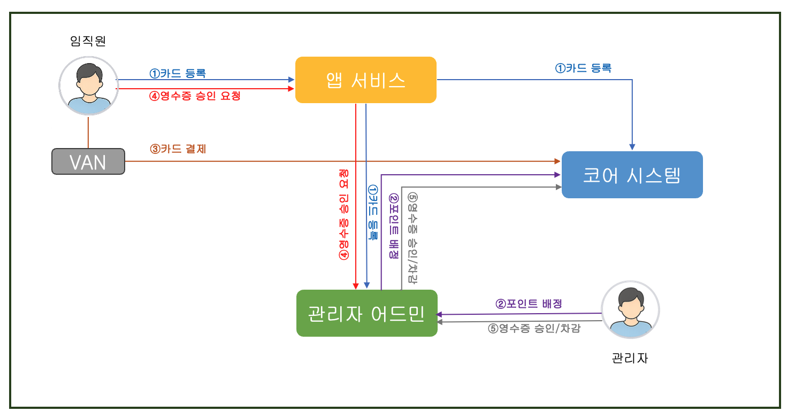
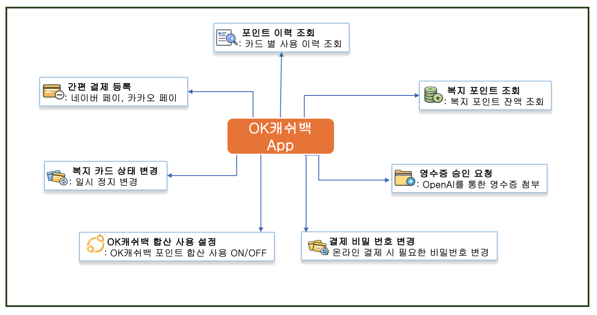
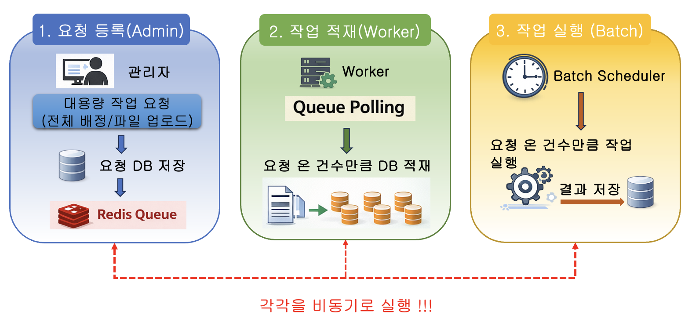

---

title: "OK캐쉬백 복지 포인트 서비스 개발기: 보안, 대용량 처리, 그리고 현실적인 선택들"

date: "2026-03-30"

tags: ["OK캐쉬백", "복지 포인트"]

author: "euisook_hong"

description: "OK캐쉬백 기반의 복지 포인트 개발 사례에 대한 소개"

---

---

# OK캐쉬백 복지 포인트 서비스 개발기: 보안, 대용량 처리, 그리고 현실적인 선택들

## 들어가며

OK캐쉬백 포인트의 활용 가치를 확장하고, 사용자에게 다양한 혜택을 제공하기 위해 복지 포인트 사업을 추진하게 되었습니다.   OK캐쉬백 복지 포인트는 제휴사가 각 임직원에게 제공해 주는 복지 포인트를 관리해 주는 서비스 입니다.   포인트를 사용하기 위한 카드는 하나 카드 기반으로 발급되어 전국 카드 가맹점 300만개에서 사용 가능하며, 간편 결제를 등록하여 실물 카드가 아닌 모바일로도 결제 가능합니다.  각 제휴사 마다 다르지만 소득공제의 혜택도 주어지며, OK캐쉬백에서 제공되는 다양한 프로모션의 혜택도 주어집니다.  오키 클럽 이용자의 경우에는 오키 클럽의 혜택도 즉시 적용 됩니다.  기본적으로 복지 포인트는 허용 업종에 한해서 결제가 가능하지만 OK캐쉬백 포인트가 있고 합산 사용 기능을 이용한다면 허용 업종을 구분하지 않고 결제할 수도 있습니다.

---

## OK캐쉬백 복지 포인트 서비스 구성 

겉으로 보면 단순한 포인트 서비스처럼 보이지만, 실제로는 다양한 기능이 유기적으로 맞물려 동작하는 구조입니다. 이러한 서비스를 안정적으로 운영하기 위해, 내부적으로는 여러 시스템이 역할을 나누어 구성되어 있습니다.

### 복지 포인트를 구성하는 시스템

- **코어 시스템**: 복지 포인트 시스템에서도 가장 안쪽에 있는 Backend system 입니다. 복지 사업 제휴 계약 관리, 임직원들이 발급 받게 되는 복지 카드 상태 관리, 복지 포인트 가맹점 계약 관리, 고객사별 결제 가능한 허용 업종 관리, 고객이 실물 카드를 이용하여 실제 결제를 했을 때 실시간 결제 처리, 복지 포인트 적립/사용/조회 기능을 제공 합니다

- **OK캐쉬백 앱 서비스**: 실제 임직원들이 복지 포인트를 사용하기 위해 앱을 통해 카드를 등록하고, 카드를 사용하면서 필요한 부가 기능을 제공합니다. 

- **관리자 어드민 시스템**: 사전에 등록된 임직원들만 카드를 등록하도록 제한하기 위한 임직원 정보를 관리하며, 카드 등록 이후 어드민에서 포인트 지급을 통해 복지 혜택을 제공합니다.

### 카드 등록 및 사용 Process
임직원이 앱을 통해 신분증 인증과 계좌 인증을 수행하고 카드 등록 합니다.   카드 등록 정보는 코어 시스템과 복지 어드민으로 전달됩니다. 이후 어드민에서는 해당 사용자에게 배정/차감할 포인트가 있는 경우, 코어 시스템으로 포인트 배정/차감을 요청합니다. 

복지 어드민에서는 임직원의 정보만 등록 되면 복지 포인트를 배정/차감할 수 있는데, 실제 포인트는 카드 등록 후 사용될 수 있는 구조로 카드가 등록되기 전까지는 복지 어드민에서 요청된 배정/차감 정보를 저장하고 있습니다.

카드가 등록된 후에 사용자가 실물 카드를 이용하여 결제하면 VAN을 통해 코어 시스템으로 결제 내역이 전달되어 허용 업종이 한해 차감 처리 됩니다. 카드가 등록되면, 이후 영수증 승인 요청을 통하여 복지 포인트를 사용할 수도 있습니다.

---

## OK캐쉬백 앱 서비스

위와 같이 OK캐쉬백 앱에서는 단순한 포인트 조회를 넘어, 실제 사용과 관리까지 사용자 중심의 다양한 기능을 제공합니다.
특히 복지 포인트의 특성상 “제한된 사용 조건”과 “사용 편의성”을 동시에 만족시켜야 했기 때문에, 사용자 경험을 해치지 않으면서도 정책을 자연스럽게 녹여내는 것이 중요한 과제였습니다.
이러한 고민을 바탕으로, 사용자 입력 부담을 줄이고 운영 효율을 높이기 위한 다양한 기능을 함께 설계하게 되었습니다.

### OK캐쉬백 앱에서 제공되는 부가 서비스

- **복지 포인트 조회**: 자신이 배정 받은 복지 포인트에 대한 조회를 제공합니다.  각 복지 포인트 별로 받은 항목과 현재의 잔여 포인트를 조회할 수 있습니다.  
- **복지 포인트 이력 조회**: 복지 포인트를 사용한 경우, 사용한 이력을 바로바로 제공해줍니다.
- **간편 결제 등록**: 카드를 등록하면서 선택하여 간편 결제를 등록할 수 있지만, 카드 등록시 선택하지 못했다면, 이후 관리 페이지를 통해 간편 결제를 등록할 수 있습니다. 
- **복지 카드 상태 변경**: 카드를 분실한 경우에는 카드의 상태를 일시 정지 상태로 만들어 카드 도용을 막을 수 있습니다. 
- **OK캐쉬백 합산 사용 설정**: 복지 포인트는 기본적으로 허용된 업종에서만 사용 가능하며, 비허용 업종에서는 결제가 제한됩니다.  단, OK캐쉬백 포인트가 있는 경우, OK캐쉬백 합산 사용을 설정함으로써 허용 업종에서는 복지 포인트를 비허용 업종에서는 OK캐쉬백 포인트를 사용할 수 있습니다.  
- **결제 비밀번호 변경**: 복지 카드를 온라인에서 사용하기 위해서는 결제 비밀번호를 추가로 입력해야 합니다.  이때 사용할 결제 비밀번호를 설정/변경할 수 있습니다. 
- **영수증 승인 요청**: 복지 카드가 아닌 다른 카드 혹은 현금으로 허용 업종에서 결제 하였다면, 해당 영수증으로 복지 포인트 차감 처리를 신청할 수 있습니다. 

관리자는 영수증 승인 요청 시 첨부된 영수증을 기반으로 해당 결제가 허용 업종에 해당하는지 여부를 판단합니다.  이에 따라 초기 요건 검토 단계부터 승인번호, 가맹점명, 사업자번호 등 영수증 내 주요 정보의 중요성이 크게 부각되었습니다.

### 영수증 인식을 위한 OpenAI 도입
영수증 첨부시, 사용자 입력 부담을 줄이고, 영수증 기반 검증의 정확도를 높이기 위해 OpenAI를 활용한 영수증 인식 기능을 도입하였습니다.
영수증 이미지를 분석하여 승인번호, 가맹점명, 사업자번호 등의 핵심 정보를 자동으로 추출함으로써, 관리자의 검증 효율성과 사용자 편의성을 동시에 개선할 수 있었습니다.
도입에 앞서 다양한 케이스의 영수증을 기반으로 인식 성능을 비교·검증하였으며, 아래 표는 그 결과를 나타냅니다.

### 1. GPT‑4o 모델

| 모델 | 요청 | 결과 상태 | 응답 시간(초) | 비용(₩) | 비고 |
|---|---|---|---:|---:|---|
| GPT‑4o | 요청 1 | 성공 | 21.65 | 4,927.00 | - |
| GPT‑4o | 요청 2 | 성공 | 22.60 | 4,763.00 | - |
| GPT‑4o | 요청 3 | 실패 | 5.38 | 5,761.00 | 승인번호 인식 오류 |

### 2. GPT‑4.1‑mini 모델

| 모델 | 요청 | 결과 상태 | 응답 시간(초) | 비용(₩) | 비고 |
|---|---|---|---:|---:|---|
| GPT‑4.1‑mini | 요청 1 | 성공 | 2.84 | 0.9797 | - |
| GPT‑4.1‑mini | 요청 2 | 성공 | 1.98 | 0.7564 | - |
| GPT‑4.1‑mini | 요청 3 | 성공 | 3.20 | 1.0044 | - |

### 3. GPT‑4.1‑nano 모델

| 모델 | 요청 | 결과 상태 | 응답 시간(초) | 비용(₩) | 비고 |
|---|---|---|---:|---:|---|
| GPT‑4.1‑nano | 요청 1 | 실패 | 1.89 | 0.2106 | 결제일 인식 오류 |
| GPT‑4.1‑nano | 요청 2 | 실패 | 2.19 | 0.5794 | 거래금액 인식 오류 |
| GPT‑4.1‑nano | 요청 3 | 실패 | 2.79 | 0.2808 | 카드사 인식 오류 |

결과에 따라 인식률, 응답 시간, 비용이 가장 좋은 gpt-4.1-mini 모델을 채택하였습니다.

---

## 어드민 시스템 개발을 위한 설계 전략

복지 포인트 서비스에서 어드민 시스템은 단순한 관리 도구를 넘어, 실제 서비스 운영의 핵심 역할을 담당합니다.
특히 포인트 지급, 차감, 사용자 관리와 같은 주요 기능이 집중되어 있기 때문에 안정성과 보안, 그리고 운영 효율성을 동시에 고려한 설계가 필요했습니다.
이러한 배경 속에서 어드민 시스템을 설계하며 고민했던 주요 전략들을 정리해 보았습니다.

### 접근 통제
복지 포인트 어드민 서비스를 개발하면서 가장 먼저 고민한 부분은 바로 보안이었습니다.  포인트를 다루고, 카드까지 발행하는 금융 성격의 서비스이다 보니 법무 검토 단계에서부터 보안성 심의 대상으로 분류되었고, 예상대로 높은 수준의 보안 요구사항이 뒤따랐습니다.  그래서 우리는 초기 설계 단계부터 기능보다 먼저 보안 요소를 중심으로 구조를 고민하기 시작했습니다.

특히 어드민 영역에서는 접근 통제가 핵심 이슈였습니다.  마스터 관리자와 제휴사 관리자가 수행하는 기능은 거의 유사하지만,
IP 통제와 권한 분리 같은 컴플라이언스 요건은 반드시 충족해야 했기 때문입니다.

사실 일정과 리소스가 충분했다면, 두 관리자 영역을 완전히 분리하여 각각 별도의 코드와 서버로 구성하는 것이 가장 이상적인 방법이었을 것입니다. 하지만 현실은 그렇지 않았습니다. 타이트한 일정과 제한된 인력 속에서, 개발자들은 하나의 코드베이스 안에서 권한과 접속을 분리할 수 있는 구조를 만들어내야 했습니다. 그 결과, 마스터 관리자와 제휴사 관리자는 접속 경로 자체를 분리하는 방식으로 설계 하였습니다.

- **마스터 관리자** : 사설 IP에 매핑된 사설 도메인을 통해 접근
- **제휴사 관리자** : 공인 IP에 매핑된 공인 도메인을 통해 접근

특히 마스터 관리자는 VDI를 통해 고정 IP를 할당받고, 해당 IP로 방화벽을 별도 신청해야만 접속이 가능하도록 구성했습니다.  이렇게 폐쇄망 기반으로 접근을 제한함으로써, 관리자 영역 중에서도 가장 높은 수준의 보안 환경을 구현할 수 있었습니다.  여기에 더해, 사내 권한 관리 시스템과 연동하여 접근 권한을 통제하고, 관리자 활동 로그를 주기적으로 수집 및 전달하여 지속적인 모니터링까지 가능하도록 했습니다.

반면, 제휴사 관리자는 내부 권한 관리 시스템을 사용할 수 없기 때문에 대신 **2단계 인증(2FA)**을 적용했습니다. 또한 인증 이후에는 단순 로그인에 그치지 않고, 해당 사용자에게 부여된 제휴사 ID를 함께 관리하도록 설계했습니다. 이 덕분에, 예를 들어 자신이 관리하지 않는 다른 제휴사의 데이터를 요청할 경우, 시스템에서 즉시 차단되고 에러를 반환하도록 구현할 수 있었습니다.

위 내용을 정리하면 다음과 같습니다.

|   구분 | 마스터 관리자 | 제휴사 관리자 |
|-----|-----|-----|
| 접속 경로 | 사설 도메인 | 공인 도메인 | 
| 접근 방식 | VDI 필수 | 인터넷 직접 접속 | 
| 네트워크 통제 | 방화벽 정책 적용 | 없음 |
| 인증 방식 | ID/PW & 권한 체크 | ID/PW & 휴대폰 OTP |
| 보안 레벨 | 매우 높음 (폐쇄망) | 중-높음 (2차 인증) |
| 용도 | 어드민 운영자 | 제휴 관리 |

### 대용량 처리를 위한 구조 설계

두 번째로 고민했던 부분은 바로 대용량 처리 구조였습니다.

복지 포인트 서비스의 특성상, 전사 임직원 등록이나 전체 임직원 대상 포인트 지급처럼 한 번의 요청으로 수백~수천 건의 작업이 발생하는 케이스가 많았습니다. 이걸 단순하게 동기 방식으로 처리하면 요청 하나에 수백 건의 DB 작업이 묶이게 되고, 응답 시간은 길어지고, 심한 경우 타임아웃이나 장애로 이어질 수 있습니다.

그래서 아예 접근 방식을 바꿨습니다.  핵심은 **“요청과 실행을 분리하자”** 였습니다.

🔹 요청은 가볍게, 처리는 비동기로

대용량 요청이 들어오면, 실제 작업을 바로 수행하지 않고 요청 정보만 DB에 저장합니다. 예를 들어, “700명의 임직원에게 각각 100만 포인트를 지급해달라”는 요청이 들어오면 DB에는 이 요청이 단 한 줄의 데이터로 기록됩니다.  그리고 동시에 해당 요청을 Redis Queue에 등록한 뒤, 사용자에게는 즉시 응답을 반환합니다. 사용자는 긴 대기 없이 요청을 완료할 수 있고, 실제 처리는 백그라운드에서 진행되는 구조입니다.

🔹 Worker가 작업을 쪼개서 처리

이후 Worker는 Redis Queue를 지속적으로 Polling 하다가 요청이 들어오면 해당 작업을 가져와 처리합니다. 이때 중요한 포인트는 대용량 요청을 실제 처리 단위로 쪼개는 과정입니다. 앞서 예시로 들었던 요청이라면, Worker는 이를 다음과 같이 세분화합니다.

- A 임직원 → 100만 포인트 지급
- B 임직원 → 100만 포인트 지급
- C 임직원 → 100만 포인트 지급
- …

총 700건의 개별 작업으로 쪼개진 작업들은 다시 DB에 저장되고, 이후 실제 포인트 지급 프로세스가 이 단위로 처리하게 됩니다.

🔹 배치 기반으로 안정적인 처리

포인트 지급 및 차감은 10분 단위 배치로 수행됩니다. 배치는 자신이 처리해야 할 작업들을 조회한 뒤, 순차적으로 포인트를 지급하거나 차감하는 역할을 합니다. 진행 상황을 눈으로 확인할 수 있게 700건의 작업이 실행되는 동안, 각 작업의 성공/실패 여부를 계속 집계하여 초기 요청 데이터에 반영하도록 했습니다.  이를 통해 운영자는 “현재 몇 건이 처리되었고, 얼마나 남았는지”를 한눈에 확인할 수 있습니다.  이 구조를 통해 얻은 가장 큰 효과는 대용량 처리에서도 안정성과 응답성을 모두 확보할 수 있었다는 점입니다.

### 일정 단축을 위한 OGG 설계

세 번째로 고민했던 부분은 “시간”, 그리고 그 안에서의 개발 전략이었습니다. 복지 포인트 서비스는 특성상 매년 연초에 포인트가 배정되기 때문에 무조건 연내 오픈이 되어야 하는 프로젝트였습니다. 그런데 저희가 실제 개발을 시작한 시점은 9월 초. 남은 시간은 사실상 3개월(9~11월 개발 + 12월 QA)뿐이었습니다.

이 상황에서 가장 현실적인 질문은 하나였습니다.  “이 일정 안에, 어떻게 하면 가장 빠르게 요구사항을 구현할 수 있을까?”

🔹 이상적인 구조 vs 현실적인 선택

원래 설계대로라면, 코어 시스템에서 다음과 같은 데이터들을 API 형태로 제공하고

- 포인트 배정/차감 이력
- 카드 사용 내역
- 영수증 처리 이력

저희는 이를 호출해서 화면을 구성하는 구조가 되어야 했습니다. 하지만 API를 정의하고, 개발하고, 테스트하고, 안정화하는 과정까지 고려하면 현실적으로 일정 내에 맞추기 어려운 상황이었습니다.

🔹 방향을 바꾼 결정: DB 기반 데이터 연동

그래서 저희는 접근 방식을 과감하게 바꿨습니다.  API 연동 대신, DB 레벨에서 데이터를 직접 공유할 수 있는 구조가 가능한지를 먼저 검토했습니다.  이 과정에서 DBA와 협의하게 되었고, OGG(Oracle GoldenGate)를 활용한 데이터 연동이 가능하다는 답변을 받았습니다.  결국, 필요한 핵심 데이터에 대해 총 6개의 테이블을 OGG로 연동하는 방향으로 결정하게 되었습니다.

이 방식은 분명 이상적인 아키텍처는 아닐 수도 있습니다. 하지만 제한된 시간 안에서 개발 속도를 확보하고 안정적으로 오픈하는 목표를 달성하기에는 가장 현실적인 선택이었습니다.  이번 경험을 통해 다시 한번 느낀 점은, 아키텍처는 언제나 “정답”이 있는 것이 아니라 상황과 제약 속에서 최적의 선택을 하는 과정이라는 것이었습니다. 특히 일정이 중요한 프로젝트라면, 완벽함보다 중요한 것은 **“제때 동작하는 시스템을 만드는 것”**일지도 모릅니다.

---

## 마치며

이번 복지 포인트 서비스 개발은 단순한 기능 구현을 넘어,
보안, 대용량 처리, 그리고 제한된 일정이라는 다양한 현실적인 제약 속에서
어떻게 균형 잡힌 선택을 할 것인가에 대한 고민의 연속이었습니다.

때로는 이상적인 구조보다는 현실적인 선택이 필요했고,
그 과정에서 개발자들과 끊임없이 논의하고 부딪히며 방향을 만들어갔습니다.
완벽한 아키텍처보다는, 실제로 안정적으로 동작하고
서비스에 기여할 수 있는 시스템을 만드는 것이 더 중요하다는 것을 다시 한번 느낄 수 있었습니다.

앞으로도 이러한 경험을 바탕으로, 더 나은 구조와 더 좋은 서비스를 만들어 나가고자 합니다.