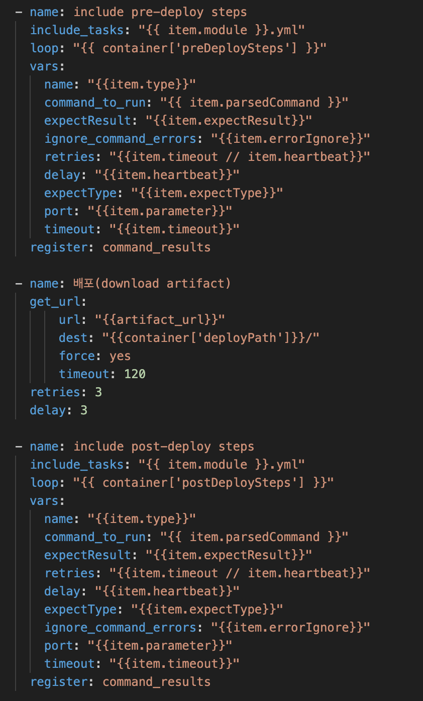
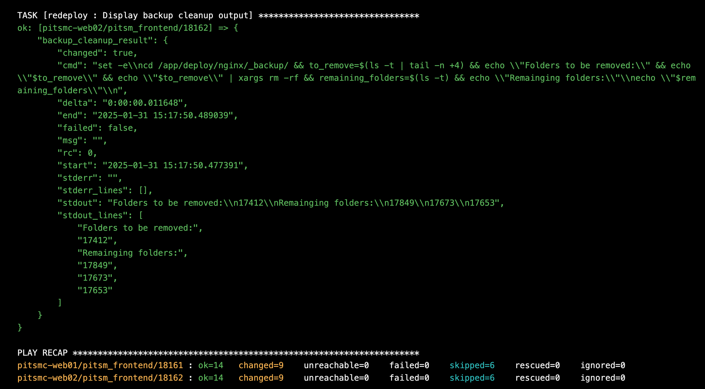

소프트웨어 배포 자동화는 코드 변경 및 테스트 이후 프로덕션 환경에 배포하는 과정을 자동화하여 배포 속도를 향상시키고 품질을 보장하는 중요한 기술이며, 이를 통해 배포 빈도를 증가시키면서도 일관된 환경을 유지하고 보안성을 강화할 수 있습니다.

AWX(Ansible Web eXecutable)는 Ansible 기반의 오픈 소스 IT 자동화 플랫폼으로, GUI 및 API를 제공하여 Ansible 플레이북 실행을 보다 쉽게 관리하고 스케줄링할 수 있도록 지원합니다. 본 글에서는 AWX를 활용하여 배포 자동화 시스템을 구축하는 방법과 고려해야 할 주요 요소를 살펴봅니다.

### 배포 자동화의 중요성

소프트웨어 배포 자동화 개념은 이미 개발 프로세스에서 필수적인 역할을 합니다. 이는 개발자가 코드를 변경하고 테스트한 후 프로덕션 환경에 배포하는 과정을 자동화하여 시간을 절약하고 오류 가능성을 줄이는 데 도움이 되기 때문입니다.    

- **효율성 향상:**
  수동 배포 프로세스는 시간 소모가 크고 반복적이며, 오류가 발생할 가능성이 높습니다. 배포 자동화는 이러한 프로세스를 자동화하여 개발자가 더 중요한 다른 업무에 집중할 수 있도록 시간을 확보해 줍니다. 또한 배포 프로세스의 일관성을 유지하면, 오류 가능성을 줄이고 배포 시간을 단축할 수 있습니다.

- **품질 향상:**
  배포 자동화는 배포 프로세스를 표준화하고 일관성을 유지하여 소프트웨어 품질이 향상됩니다. 자동화된 테스트를 통해 배포 전에 코드의 버그를 발견하고 해결할 수 있습니다. 이는 시스템 안정성을 높이고 사용자 경험을 개선하는 데 도움이 됩니다.

- **배포 빈도 증가:**
  배포 자동화는 배포 프로세스를 간소화하여 배포 빈도를 높여 줍니다. 이는 새로운 기능 및 업데이트를 사용자에게 더 빠르게 제공해 주며,문제 발생 시 신속하게 핫픽스(긴급히 배포되는 패치 프로그램)를 배포하여 시스템 가동 시간을 늘릴 수 있습니다.

- **보안 강화:**
  배포 자동화는 프로세스를 표준화하고 일관성을 유지하여 보안 취약점을 줄일 수 있습니다. 자동화된 보안 테스트를 통해 배포 전에 시스템의 보안 취약점을 발견하고 해결할 수 있습니다. 따라서 배포 자동화는 소프트웨어 개발 프로세스의 효율성, 품질, 빈도, 비용 및 보안성을 향상시키는 데 중요한 역할을 하는 기술입니다.

이 글에서 소개할 AWX를 이용한 배포 자동화 툴 개발은 다음과 같은 장점을 제공합니다.

- 간편한 설치와 사용: AWX는 오픈 소스 플랫폼이며, 설치 및 사용이 간편합니다.
- 다양한 기능: AWX는 다양한 배포 관련 기능을 제공합니다.
- 확장성: AWX는 확장 가능하며, 다양한 환경에 적용할 수 있습니다.
- 커뮤니티 지원: AWX는 활발한 커뮤니티를 가지고 있으며, 기술 지원을 받을 수 있습니다.

AWX를 이용한 배포 자동화 툴 개발은 소프트웨어 배포 프로세스를 개선하고 다양한 장점이 있는 효과적인 방법입니다.

### AWX: Ansible 기반의 강력한 자동화 플랫폼

AWX는 Ansible 기반의 오픈 소스 IT 자동화 플랫폼으로써, 웹 기반 인터페이스를 통해 Ansible Playbook을 관리, 실행, 배포, 모니터링 등을 수행할 수 있는 강력한 기능을 제공합니다.

**AWX의 주요 기능:**

- Ansible Playbook 관리: Playbook 작성, 편집, 실행, 버전 관리
- 인벤토리 관리: 호스트 그룹 및 개별 호스트 정의와 관리
- 작업 템플릿: 반복적인 작업 템플릿 생성 및 재사용
- 자동화된 배포: 배포 스케줄 및 워크플로우 설정
- 권한 관리: 사용자 및 팀에 대한 역할 기반 권한 관리
- 모니터링 및 보고: 작업 실행 결과 및 시스템 상태 모니터링 및 보고서 생성
- REST API: 자동화 및 통합을 위한 API 제공
- 확장성: Celery를 통한 분산 작업 처리
- Ansible Engine: 실제 서버에서 Playbook 실행
- 추가 기능: Ansible Vault, Notification, 네트워크 인벤토리, RBAC 등

**AWX는 다음과 같은 분야에 활용될 수 있습니다.**

- 서버 프로비저닝 및 배포
- 시스템 구성 및 관리
- 애플리케이션 배포 및 유지 관리
- 네트워크 구성 및 관리
- 보안 및 규정 준수
- 클라우드 자동화

AWX는 다양한 규모의 조직에서 IT 자동화를 효과적으로 수행할 수 있도록 지원하는 강력하고 유연한 플랫폼입니다.

### AWX 설치

AWX Operator는 Kubernetes 상에서 Ansible AWX를 관리하기 위한 도구입니다. AWX는 Ansible의 웹 기반 그래픽 사용자 인터페이스로써, 작업 흐름을 자동화하고 관리할 수 있는 플랫폼입니다. AWX Operator는 Kubernetes Operator의 일종으로, AWX를 배포, 관리 및 확장하기 위한 자동화된 방식을 제공합니다.

AWX Operator는 Kubernetes의 Custom Resource Definition (CRD)을 사용하여 AWX 리소스를 정의합니다. 사용자는 이 CRD를 통해 AWX 애플리케이션을 배포하고 구성할 수 있습니다. AWX Operator는 이러한 리소스를 감지하고 관리하며, 필요한 작업을 수행하여 AWX 애플리케이션을 제어합니다.

AWX Operator를 사용하면 AWX 애플리케이션을 Kubernetes 클러스터에서 쉽게 배포하고 관리할 수 있습니다. AWX Operator는 AWX의 다양한 구성 요소를 관리하고, 자동으로 복제본을 생성하거나 스케일링할 수 있습니다. 또한 AWX Operator는 AWX 애플리케이션의 상태를 모니터링하고 필요한 경우에는 자동으로 복구 작업을 수행할 수 있습니다.

AWX Operator를 사용하면 Kubernetes 환경에서 Ansible AWX를 보다 효율적으로 관리할 수 있습니다. 이를 통해 개발자와 운영팀은 자동화된 작업 흐름을 구성하고, 인프라 자동화를 확장할 수 있습니다. 또한 Kubernetes의 자원을 효율적으로 활용할 수 있습니다.

Helm 차트를 이용하여 AWX Operator를 설치하면 기본적으로 PostgreSQL이 StatefulSet으로 구성됩니다. 하지만 사내 정책상 DB는 별도의 DB존에 구성해야 하므로, 기 구축된 PostgreSQL을 사용하기 위해 `postgres-configuration` secret을 수정하였습니다.

**AWX Operator를 이용해 설치시 다음과 같은 점을 고려해야 합니다.**

- Kubernetes 클러스터 버전: AWX Operator는 Kubernetes 1.18 이상을 지원합니다.
- AWX 버전: AWX Operator는 특정 AWX 버전만 지원합니다.
- 저장소: AWX 데이터를 저장할 영구 저장소가 필요합니다.
- 네트워킹: AWX 컨테이너에 대한 네트워크 접근 권한을 설정해야 합니다.
- 인증: AWX 컨테이너에 대한 인증 방법을 설정해야 합니다.

### 배포 자동화 툴 개발 과정

- **서버 개발**
  - AWX API 연동:
    - 배포 설정 시 호스트 및 인벤토리를 생성합니다.
    - 배포 시 Job Template 및 Ad-hoc Command 실행합니다.
  - 주요 기능:
    - 배포 설정 관리
    - 배포 작업 실행 및 상태 조회
    - 배포 로그 조회

- **Playbook 개발**
  - 배포 유형별 Playbook:
    - Web 배포(apache/nginx)
    - 커스텀 배포 등
  - 웹 서버 배포 Playbook 예시:
    - L4에서 웹 서버 제거
    - PID 파일 이용한 웹 서버 중지
    - 포트 다운 확인
    - 기존 배포 경로 빌드 결과물 삭제
    - 새로운 빌드 결과물 다운로드 및 압축 해제
    - 배포 경로를 Docroot로 복사
    - 웹 서버 시작
    - Health Check 수행
    - L4에 웹 서버 추가
    - 백업 폴더 생성 및 백업본 생성 (Rollback 대비)
  - 커스텀 배포 예시:
    - 설정된 배포 명령어를 ad-hoc command로 실행
    - 설정된 배포 전/후 명령어를 동적으로 include하여 playbook 실행   
    

  - 커스텀 배포를 이용한 L4 in/out를 통한 무중단 배포 예시:
    - Health Check API 구현:
      - 서비스에 `/healthcheck`와 `/healthcheck/l4out` API를 구현
      - 정상 상태: `/healthcheck` 호출 시 "skp_healthcheck_ok" 응답
      - 점검 상태: `/healthcheck/l4out` 호출 시 "out_of_service" 응답
    - L4 out 프로세스:
      - 배포 시작 전 `/healthcheck/l4out` API 호출
      - 서비스가 "out_of_service" 응답 시, L4는 해당 서비스를 비정상으로 인식
      - L4는 5초 간격으로 3회 재시도 후 연속 실패시 "DOWN" 상태로 인식하며, 서비스를 서비스 풀에서 제거
    - 배포 수행:
      - L4에서 제거된 후 서비스 업데이트 및 배포 진행
    - L4 in 프로세스:
      - 배포 완료 후 `/healthcheck` API 호출
      - 서비스가 "skp_healthcheck_ok" 응답 시, L4는 서비스를 정상으로 인식
      - L4는 서비스를 풀에 다시 추가하고 트래픽 유입 시작
    - 구현 방법:
      - 커스텀 배포 기능을 사용하여 curl 명령어로 헬스체크 API 호출
      - 배포 전후 스크립트에 L4 out/in 로직 포함   
      

### 배포 자동화 툴 테스트 및 실행

배포 자동화 툴의 웹화면에서 미리 설정한 설정을 통해 배포를 테스트할 수 있습니다.   
배포 자동화 툴은 사용자 편의를 위해 웹 UI를 제공하고 있으며, 배포가 필요한 대상 서버 및 명령어 등을 미리 설정할 수 있습니다. 빌드 서버와 연동하여 빌드된 결과물을 배포 설정을 이용해 배포가 가능하며, 배포 시 ansible playbook 실행시의 아웃풋 화면을 함께 확인 가능합니다.  
 필요에 따라 debug 를 이용해 필요한 정보를 추가합니다.  

### 문제 해결 및 고려사항

AWX를 기반의 배포 도구 개발에서 다음과 같은 문제들이 발생할 수 있습니다:

- **보안 문제:** 배포 도구를 개발할 때 보안 취약점이 발생할 수 있습니다. 예를 들어, 인증 및 권한 부여, 데이터 보안, 네트워크 통신의 암호화 등을 고려해야 합니다. 배포 서버 접근시 적절한 인증 방법 및 권한 부여를 사용하여야 합니다.
- **에러 처리:** 배포 도구의 개발 과정에서 예상치 못한 에러가 발생할 수 있습니다. 이에 대한 적절한 에러 처리 및 로깅 메커니즘을 구현해야 합니다.
- **성능 및 확장성 문제:** 대규모 배포 환경에서 성능과 확장성 문제가 발생할 수 있습니다. AWX와의 통신, 작업 처리, 동시성 관리 등을 최적화하여 성능과 확장성을 향상시켜야 합니다. AWX의 Execution Environment을 이용하면, 작업을 분산하여 성능과 확장성을 향상시킬 수 있습니다.
- **지속적인 개발 및 유지보수:** 배포 도구는 지속적으로 개발, 업데이트, 유지보수되어야 합니다. AWX의 업데이트나 변경사항에 대응하고, 새로운 요구사항을 수용할 수 있도록 개발 및 유지보수가 필요합니다.
- **사용자 경험:** 배포 도구의 사용자 경험을 고려해야 합니다. 직관적이고 사용하기 쉬운 인터페이스, 문서화된 가이드, 에러 메시지의 명확성 등을 고려하여 사용자들이 편리하게 도구를 활용할 수 있도록 해야 합니다.

이러한 문제들은 AWX를 기반으로 배포 도구를 개발할 때 고려해야 할 중요한 사항입니다. 충분한 테스트, 검증, 문제 해결 능력을 갖추고, 커뮤니티나 지원 그룹과의 소통을 통해 이러한 문제들을 극복할 수 있습니다.

### 결론

AWX 기반의 배포 자동화 툴을 개발하고 운영하면서 얻은 경험을 바탕으로 다음과 같은 결론을 도출하였습니다.
 

- AWX는 에이전트 없는 배포방식에서 장점이 있습니다. 에이전트 설치 및 업그레이드에 따른 부담이 없고, 배포 대상 서버들간의 직접 통신으로 보다 단순하고 안정적인 배포가 가능합니다.
- AWX의 호스트 기반 인벤토리와 템플릿은 배포 자동화 구축을 보다 쉽고 직관적으로 가능하게 합니다. 배포 작업의 표준화와 재사용성 확보에 큰 도움이 됩니다. 오픈소스 기반으로 커뮤니티의 지속적인 기여로 발전 가능성이 높습니다. 문제 해결을 위한 정보와 지식 공유가 용이합니다.
- 앞으로는 Kubernetes와의 연동을 통한 배포 자동화의 확장, 배포 이력 및 성능 지표 수집 기능 강화, UI/UX 개선 등을 계획하고 있습니다. AWX 기반의 배포 자동화 툴은 안정성과 생산성을 보장하는 효과적인 도구로 자리매김할 것입니다.

감사합니다. 

(참고) https://devocean.sk.com/blog/techBoardDetail.do?ID=165723 