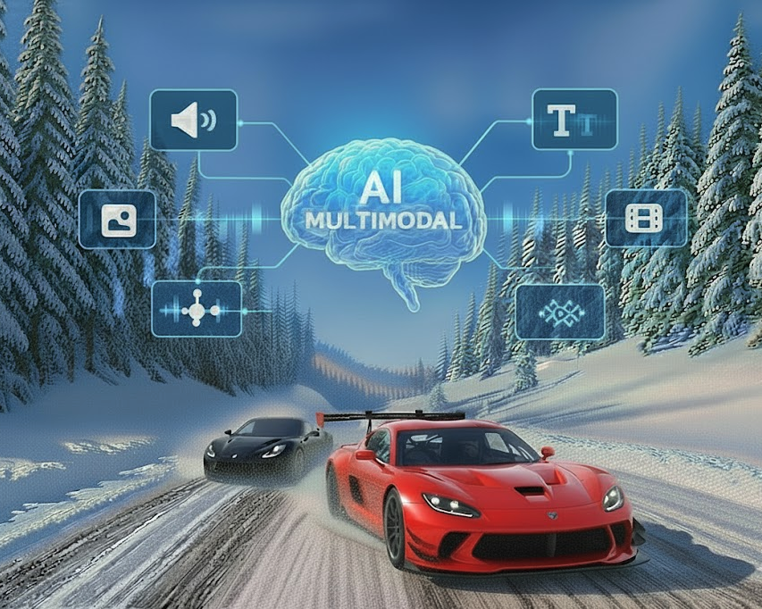
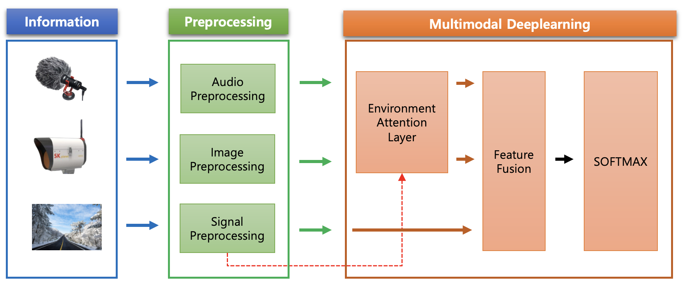
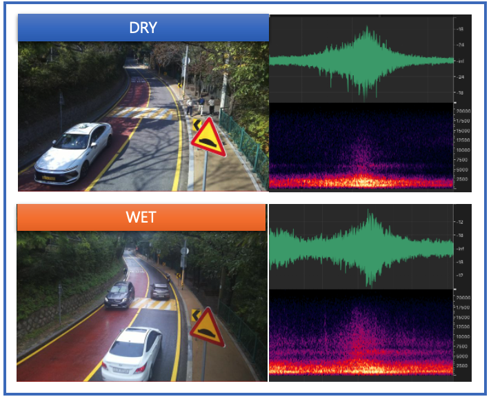
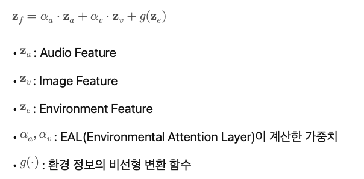
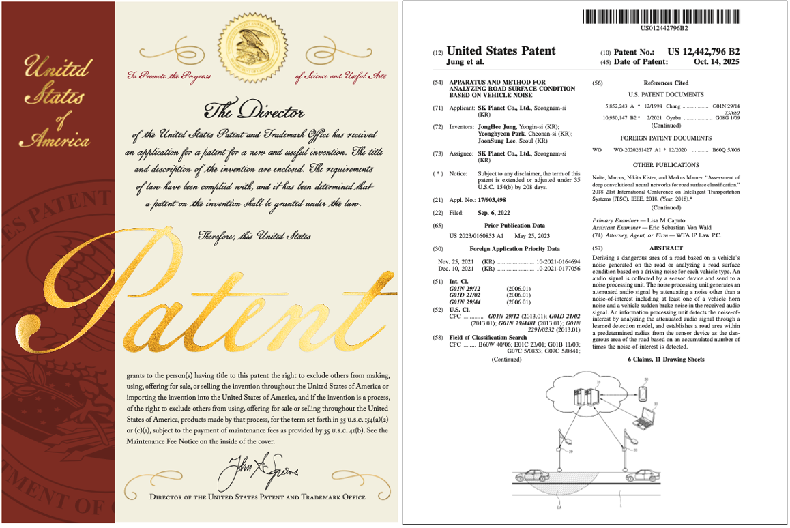
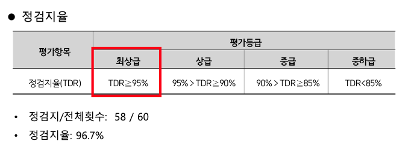
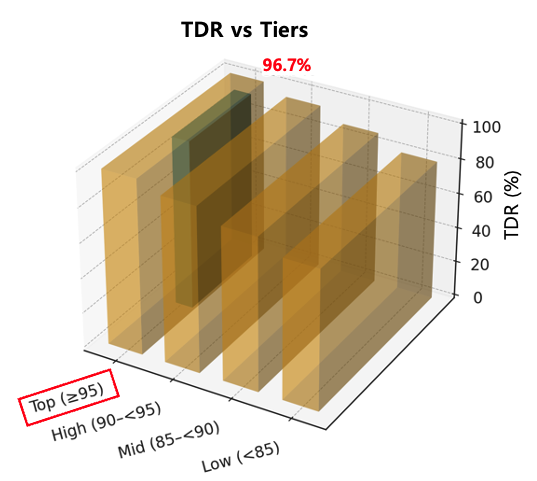

안녕하세요, 데이터서비스개발팀에서 AI를 개발하는 이준성입니다. 이번 글에서는 멀티모달 기반의 블랙아이스 감지 솔루션을 소개하려고 합니다. 기술적인 부분도 어렵지 않게 풀어 설명했으니 편하게 읽어 주세요. 

# 개요

AI를 사용하여 도로의 결빙을 어디까지 감지할 수 있을까요? 

겨울철 도로 사고의 주요 원인은 ‘보이지 않는 결빙’, 즉 블랙아이스입니다. 겉보기에는 마른 아스팔트처럼 보여도, 얇은 얼음층이 형성되면 운전자는 아무런 징조 없이 미끄러질 수 있습니다. 특히 야간, 비가 갠 직후, 가시거리가 낮은 환경에서는 기존 카메라 기반 감지 기술만으로는 정확도가 크게 떨어질 수 있습니다.

그래서 등장한 기술이 **멀티모달 결빙 감지 솔루션**입니다. 도로의 주행 소리(Audio), 영상(Image)을 동시에 분석하고, 환경 정보(온도·습도)를 함께 반영하여 결빙 위험을 예측합니다. 즉, **듣고 (Audio), 보고 (Image), 느끼는 (Environment) 방식으로 보이지 않는 위험을 감지하는 AI기술**입니다(따라서 본 글에서는 이 솔루션에 'ARHIS Ambient(가칭)'라는 멋진 이름을 붙여 보았습니다~).

덧. 참고로 ARHIS(Audio & AI based Road Hazard Information System, 음향기반 도로노면 검지 시스템/솔루션)는 차량이 달릴 때 도로 노면에서 발생하는 음향을 탐지, 블랙 아이스와 같이 눈에 보이지 않는 도로 노면의 상태를 검지(detection)하는 당사의 기술이며 RB ARHIS는 이 기술을 솔루션화한 제품입니다. 여기에 멀티모달 센싱 기능이 추가된 것이죠.  
ARHIS와 RB ARHIS에 대한 자세한 내용은 [여기](https://techtopic.skplanet.com/rbarhis-ai/)를 참조하세요! 

# 결빙감지 멀티모달 AI 솔루션이란?

**'ARHIS Ambient', 즉 결빙 감지 멀티모달 AI 솔루션은 Audio, Image 데이터를 함께 분석하고, 환경 정보(온도·습도)를 기반으로 Feature 가중치를 조정해 도로 위 블랙아이스를 예측하는 인공지능 기술**입니다. 단일 정보에 의존하지 않기 때문에 주·야간뿐만 아니라 악천후 상황에서도 안정적으로 결빙 위험을 탐지할 수 있는 것이 특징입니다.

# 멀티모달 AI 솔루션 Architecture

## 1) 도로의 숨결과 표정을 읽는 AI의 감각, EAL 모듈

**EAL(Environmental Attention Layer)** 은 환경 정보(온도·습도)를 입력받아 Audio Feature와 Image Feature의 신뢰도를 동적으로 조정하는 **Attention 기반 레이어**입니다. 모든 입력이 동일한 비중으로 처리되는 것이 아니라 **환경 변화**에 따라 가중치가 달라집니다.

야간이거나 시야 확보가 어려운 상황에서는 Audio Feature 비중이 증가하고, 급격한 기온 하락 또는 강수 변화가 감지되면 결빙 가능성 구간 가중치가 강화됩니다.  EAL은 실시간으로 지금 어떤 데이터를 더 믿어야 하는가를 계산하며, 불필요한 노이즈의 민감도는 낮추고 중요한 Feature에 집중합니다.

## 2) 노면의 상태를 ‘귀로 듣는’ 차량주행 Audio 

타이어와 도로가 마찰하며 발생하는 소리는 노면 상태에 따라 확연히 달라집니다. 노면이 젖으면 타이어 마찰음이 넓은 대역으로 퍼지면서,수 kHz 이상의 고주파 성분에서 진폭이 크게 나타납니다.

AI는 이 신호를 주파수 기반 Feature로 변환해 분석하고, 운전자가 체감하기 전 단계에서 결빙 조짐을 감지합니다. 이는 기존 시각 기반 시스템이 놓칠 수 있는 상황을 보완하고 안정적인 감지 성능을 제공합니다.

## 3) 노면의 상태를 ‘눈으로 보는’ Image Feature

**Image Feature**는 도로의 시각적 상태를 기반으로 표면 반사, 텍스처 변화(Asphalt Grain Pattern)를 탐지합니다. 하지만 실제 도로 환경에서는 조도 저하, 안개, 비·눈으로 인한 영상 노이즈 등으로 Vision 단일 모달의 신뢰도가 떨어질 수 있습니다. 

이때 환경 데이터(EAL)가 함께 입력되면, 모델은 온도·습도를 참고하여 “현재 시각 정보가 왜곡된 상황"인지, “결빙 가능성이 높은 조건"인지를 추가적으로 판단할 수 있게 됩니다. 예를 들어 조도가 낮아 도로 표면 텍스처가 흐려질 경우, EAL은 급격한 온도 하락이나 기상정보 변화를 결빙 후보 구간으로 가중치를 높여 Image Feature의 빈틈을 보완합니다. 

결과적으로, 모델은 단순히 “현재 보이는 영상”이 아니라 “환경 요인을 반영한 Multi-feature Reasoning 결과”를 함께 고려합니다. 이러한 구조 덕분에 Vision 센서 기반 결빙 감지의 한계를 줄이고, 실제 도로 상황에서도 높은 추론 안정성을 유지할 수 있습니다.

## 4) 멀티모달 Feature Fusion

멀티모달 결빙 감지 모델은 여러 개의 데이터를 단순히 합치는 방식이 아니라, 각각의 모달(오디오, 이미지, 환경 데이터)을 따로 인코딩한 뒤 마지막 단계에서 결합하는 **Late Fusion** 구조를 사용합니다.

먼저, EAL은 환경 정보를 입력받아 오디오 특징과 이미지 특징 중 어떤 정보를 더 믿어야 하는지에 대한 가중치를 계산합니다. 예를 들어, 야간처럼 영상 신뢰도가 떨어지는 상황에서는 오디오 특징의 비중이 커지고, 차량주행이 드물거나 정체가 심한 경우는 이미지 정보와 환경 정보가 더 크게 반영됩니다.

이렇게 계산된 가중치는 오디오와 이미지 특징을 결합할 때 함께 적용되어 최종 멀티모달 표현을 만들어냅니다. 결빙 여부 판단은 한 가지 형태의 데이터가 아니라, **오디오 + 이미지 + 환경 정보가 모두 융합**되어 이루어집니다. 입력정보 중 한 신호에 노이즈가 생기거나 품질이 떨어져도 나머지 feature가 이를 보완할 수 있기 때문에 낮·밤, 비·눈, 안개 등 다양한 상황에서도 **결빙 감지의 안전성이 향상**됩니다.

# 특허 및 성능 검증

결빙감지 솔루션은 60여건 이상의 특허 포트폴리오를 구축했으며, 25년 10월에 미국 등록 특허(US 12,442,796 B2)가 발행되었습니다.

최근 2025년 10월, 해당 솔루션을 도입한 공공기관의 성능 평가에서 **정검지율(TDR) 96.7%** 를 기록하며, 검지 성능을 공식적으로 인정받았습니다.

* 평가 기준: 5일 동안 매 정각마다 노면의 상태와 추론 결과를 비교하여 성능을 검증
* 정검지율(True Detection Rate, TDR): 전체(5일)중에 노면상태를 정확하게 판단한 비율

# 마무리

블랙아이스는 눈앞에 있어도 잘 보이지 않는 위험 요소입니다. 멀티모달 AI 솔루션은 도로가 보내는 작은 신호와 변화를 포착하여 결빙을 감지합니다. 더욱 더 안전한 주행 환경을 위해서 멀티모달 AI기술을 계속 발전시키겠습니다.

긴 글을 읽어주셔서 감사합니다.