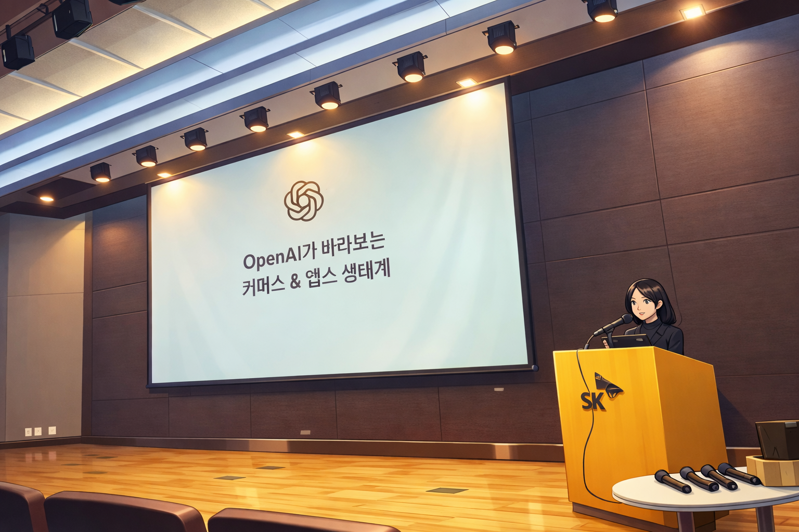
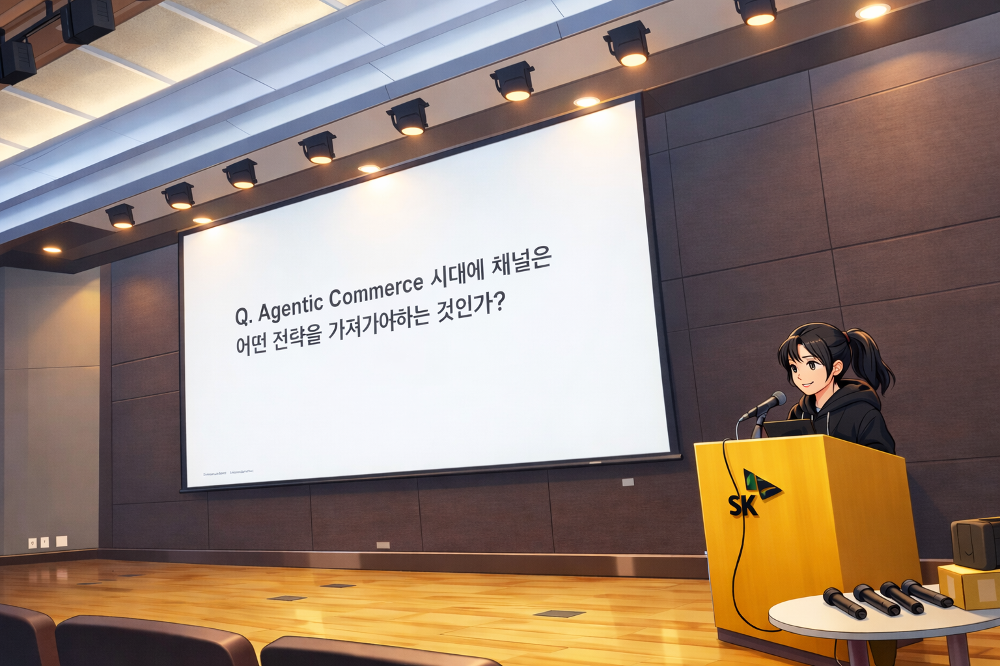
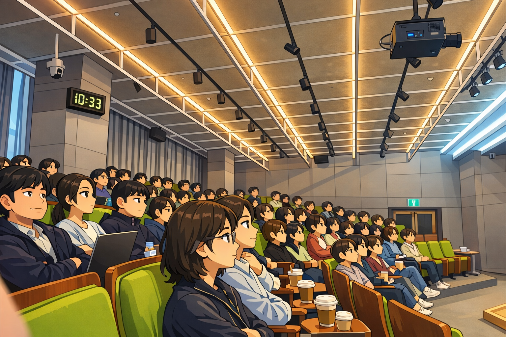

안녕하세요 SK플래닛 테크편집부입니다! 
테크편집부는 저희 회사의 다양한 개발 및 기술문화 관련 내용들을 여러분께 공유해 드리고 있는데요, 
올 2월에는 **OpenAI 및 11번가** 와 함께한 판교 플래닛 세미나의 따끈따끈한 소식을 전해드립니다. 

(참고) 판교 플래닛 세미나의 이름을 DTC(Data & Tech Committee)에서 **ATT(AI Tech Talk)** 로 변경하였습니다. 
원래 DTC가 기존 임원들의 회의 협의체에서 비롯되어 행사 명칭에 'Committee'가 남아 있었는데요,  
조금 헤비(?)하다는 의견과 함께 최근 기술 트렌드와 행사의 정체성을 고려하여 **'AI'** 와 **'Tech'** 를 포함하기로 하였습니다.  
앞으로도 많은 응원 부탁드립니다(DTC 관련 예전 소개글은 [여기](https://techtopic.skplanet.com/skp-techseminar24/)를 참조하세요). 

---
 

외부 전문가와 함께하는 올해 첫 세미나는 **OpenAI Korea**의 한지은 전략 어카운트 디렉터 및 김정원 솔루션 엔지니어 분을 모시고 2월 23일에 SK플래닛 판교사옥에서 진행하였어요(바쁘신 중에도 미팅과 세미나에 시간을 할애해 주신 OpenAI Korea의 김경훈 총괄대표님 및 두 분 발표자께 이 자리를 빌어 감사의 인사를 드립니다). 'OpenAI API Platform기반의 기술 소개 및 사례' 를 메인으로 다음 주제들을 커버하였습니다. 

* OpenAI 최근 사업방향 및 기술 소개 
* 엔터프라이즈 기업의 AX를 위한 OpenAI 오퍼링
* OpenAI가 바라보는 커머스 및 앱스 생태계 소개 
* 커머스 사례 소개: Instacart 협업, 쇼핑 리서치, Apps in ChatGPT 등  
* Agentic Commerce 전략, 대응방안 및 Codex 구현 MVP 시연 (11번가) 
* 질의응답 및 애프터 미팅  

특히 이번에는 11번가 자회사 (재)편입 후 **SK플래닛 및 11번가 구성원** 약 200명이 한 자리에 모여 기술 인사이트를 공유하는 의미있는 자리였는데요(설 연휴 직후였는데도 많은 분들이 와 주셨어요 ^ ^), 앞으로도 양사 및 유력한 비즈 파트너와의 다양한 기술 활동을 통한 AI 시너지를 기대합니다. 

Image created • Presentation at the conference stage

Image created • Korean woman presenting in conference room

Image created • Lecture hall with attentive audience
 
 

(위 이미지들은 OpenAI ChatGPT를 활용하여 애니메이션 스타일로 변환 및 공유하였습니다) 

읽어 주셔서 감사합니다! 