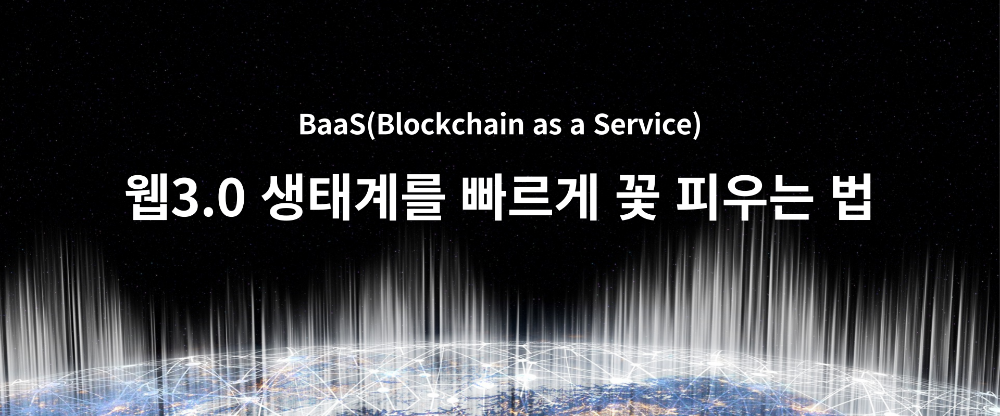
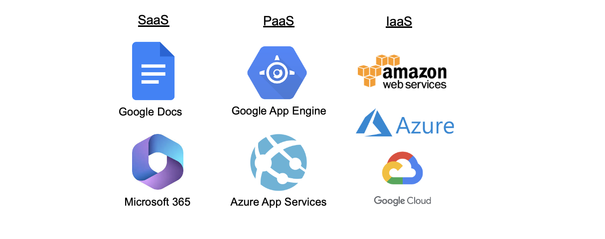
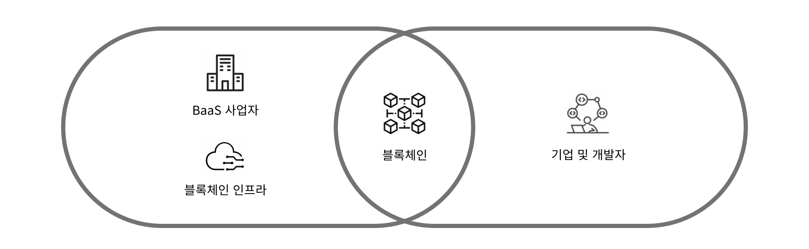
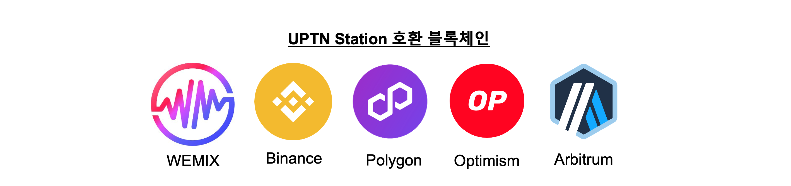
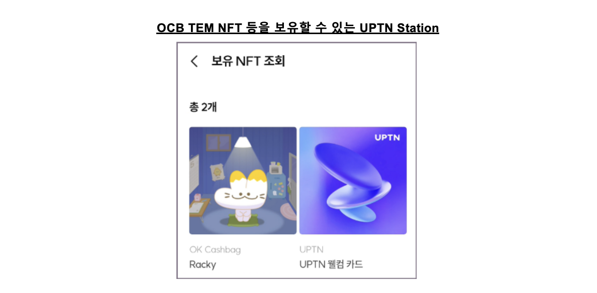

Blockchain as a Service(이하 BaaS)는 제 3자가 Blockchain을 플랫폼으로 활용해서 다양한 응용기능이나 서비스를 제공하는 웹 3.0 분야입니다. 'as a Service' 모델은 기업과 개인이 서비스를 직접 소유하거나, 그에 준하는 권리를 보유하지 않아도 관련 서비스를 사용할 수 있게 함으로써 서비스에 대한 효율성과 접근성을 크게 향상시킵니다. 

이번 포스팅에서는 블록체인을 서비스 형태로 제공할 때의 장점 및 SK플래닛의 BaaS 개발 현황을 공유드리고자 합니다. 

## 대표 모델로 한 번에 이해할 수 있는 as a Service

'as a Service'의 대표 모델은 SaaS(Software as a Service),  PaaS(Platform as a Service) 및 IaaS(Infrastucture as a Service)로 구분할 수 있으며, BaaS 역시 이러한 모델 중 하나입니다. 

#### (1) SaaS: Software as a Service
SaaS는 소프트웨어 애플리케이션을 온라인으로 제공하는 서비스입니다. 주로 웹 브라우저를 통해 애플리케이션에 접속하며, 서버 관리나 소프트웨어 업데이트 같은 기술적인 문제에 대해 사용자가 관여하지 않아도 됩니다. Google Docs, Microsoft 365 등이 SaaS의 대표적인 사례입니다.

#### (2) PaaS: Platform as a Service
PaaS는 개발자가 애플리케이션을 개발하고 배포할 수 있는 플랫폼과 환경을 제공하는 서비스입니다. PaaS 운영사가 서버, 네트워크, 스토리지, 데이터베이스 관리 등의 인프라를 관리를 대행하며, 따라서 개발자는 코드 작성에 집중할 수 있습니다. PaaS의 예로는 Google App Engine, Microsoft Azure App Service 등의 서비스가 있습니다. 

#### (3) IaaS: Infrastructure as a Service
IaaS는 가상화된 컴퓨팅 리소스를 인터넷을 통해 제공하는 서비스입니다. 사용자는 운영 체제, 스토리지, 네트워킹 등을 포함한 인프라를 임대할 수 있으며, 자신의 IT 리소스를 물리적으로 구축하거나 관리할 필요가 없습니다. 많이 사용하는 IaaS로는 Amazon Web Services(AWS), Google Cloud Platform(GCP), Microsoft Azure 등입니다. 

#### (4) BaaS: Blockchain as a Service
클라우드 서비스 제공자가 블록체인 기술 인프라의 구축, 호스팅, 관리를 대행하는 서비스입니다. 기업이나 개발자는 복잡한 블록체인 인프라를 직접 구축/유지 관리할 필요가 없으며, 클라우드 기반의 솔루션을 통해 블록체인 애플리케이션과 기능을 쉽게 개발, 배포, 운영할 수 있습니다. 

## 장점: 기업이 BaaS를 이용할 경우 어떤 장점이 있을까요? 

BaaS는 기업이 블록체인 기술을 쉽고 효율적으로 도입할 수 있는 환경을 제공합니다. 주로 클라우드 인프라를 활용하여 배포와 관리를 하기 때문에 절차가 간단하며, 비용 효율성과 확장성을 개선할 수 있습니다. 이미 아마존, 마이크로소프트, IBM, 오라클, 알리바바와 같은 기업들이 BaaS 오퍼링 서비스를 제공 중입니다. 

BaaS를 사용할 경우 기업들은 다음과 같은 이점을 누릴 수 있습니다. 

#### (1) 간편한 구축 및 관리
BaaS를 사용하는 경우 BaaS 제공 업체가 블록체인 네트워크의 설정, 운영, 유지 관리를 담당하기 때문에 사용자는 복잡하고 어려운 절차 없이 사용 가능합니다. 스마트 계약을 쉽게 개발하고, 블록체인 네트워크에 배포할 수 있다는 점도 BaaS의 큰 장점입니다. 

#### (2) 비용 효율성
블록체인 인프라를 구축하고 관리하는 데 드는 시간과 비용을 절약할 수 있습니다. 구독 형태로 BaaS를 이용하므로 사용자는 초기 투자 비용을 최소화하고 실제 사용한 만큼만 비용을 지불하면 됩니다. 

#### (3) 확장성
BaaS는 클라우드 인프라를 활용하기 때문에 애플리케이션 수요 변화에 따라 리소스를 유연하게 조정할 수 있습니다. 이는 비즈니스가 성장할 경우 블록체인 네트워크를 쉽게 확장할 수 있다는 의미입니다. 

현재 BaaS는 주로 IaaS를 기반으로 블록체인 기술을 쉽게 활용할 수 있는 형태로 발전하고 있으며, 기존의 Public Cloud 업체를 중심으로 서비스되고 있습니다. 

## 현황: BaaS로 웹 3.0 생태계를 준비 중인 SK 플래닛
SK플래닛은 지난 수 년간 UPTN(업튼)을 통해 블록체인과 관련된 다양한 경험을 축적해 왔으며, 웹 3.0 기반 서비스에 블록체인 기술을 보다 쉽게 도입하고 활용할 수 있도록 지원하고자 합니다. UPTN이 제공하는 주요 BaaS는 다음과 같으며, 고객들은 이를 통하여 쉽게 웹 3.0에 온보딩할 수 있습니다. 

#### UPTN Web 3.0 Transformer (웹 2.0 연계 및 웹 3.0 전환)
UPTN Station을 이용하면, 웹 2.0에서도 블록체인 지갑을 사용할 수 있습니다. 기존의 웹 2.0 서비스들은 대부분 소셜 로그인 또는 ID/Password를 사용하며, 서비스 간 연동이 필요할 경우 연계 정보(CI, Connecting Information)를 이용합니다. 이러한 방식은 웹 2.0에서 블록체인 지갑을 사용하는 데에는 한계로 작용합니다. 

이에 비해 UPTN은 신원이 확인된 고객의 CI 정보를 기반으로 블록체인 지갑 주소를 발급, 관리하고 있어 기존의 방식으로도 블록체인 지갑을 사용할 수 있습니다. 뿐만 아니라 SK플래닛 B2B 네트워크 및 서비스를 활용하여 멤버십, 쿠폰, 이벤트, 마일리지 등을 쉽게 웹 3.0화 함으로써 다양한 비즈니스에 활용할 수 있는 유틸리티 솔루션을 제공합니다. 

#### UPTN Station: EVM 호환 Self-custodial Wallet 
EVM(Ethereum Virtual Machine)이 탑재된 UPTN Station은  이더리움 기반의 다수의 블록체인과 호환됩니다. 아발란체(https://www.avax.network/ )뿐만 아니라 위믹스, 바이낸스 스마트 체인과 같은 Layer 1 블록체인, 그리고 폴리곤, 옵티미즘, 아비트럼 등의 Layer 2 블록체인도 폭넓게 지원할 수 있으며, TSS(Threshold Signature Scheme) 방식의 개인 키 관리를 사용하여 높은 보안 수준을 가지고 있습니다. 

#### UPTN Block Explore: 블록 탐색기
Block Explore(블록 탐색기)는 블록체인 네트워크의 블록과 트랜잭션 상세 정보를 조회할 수 있는 도구입니다. 사용자는 특정 블록, 거래, 주소 그리고 블록체인 네트워크의 현재 상태와 같은 다양한 데이터를 조회 및 분석할 수 있으며, 이를 통해 블록체인을 추적하고 투명성을 유지할 수 있습니다. 

현재 UPTN에는 아발란체 서브넷 기반의 블록 익스플로러가 구축되어 있으며, 블록체인을 구축하고자 하는 고객과 UPTN에 온보딩하고자 하는 서비스들은 이를 통해 쉽게 블록 정보를 조회할 수 있습니다. 

#### UPTN NFT 스튜디오: NFT 민팅
웹 3.0 경험이 없는 기업들이 자신의 비즈니스에 쉽고 빠르게 NFT를 접목할 수 있도록 NFT 민팅 솔루션을 제공합니다. 지난 해 UPTN은 OK캐쉬백 TEM NFT, NFT 티켓, 11번가 명품 보증 NFT(OOAh luxe) 등 실생활과 접목된 다양한 NFT 사례들을 만들었습니다. 

비즈니스에 NFT를 활용하고자 하는 기업 또는 서비스는 UPTN을 기반으로 다양한 유형의 NFT를 개발함으로써 고객의 다양한 요구를 빠르게 충족할 수 있습니다. 

#### UPTN Air-Drops: 토큰 에어드롭
웹 3.0에서 토큰 에어드롭은 특정 암호화폐나 토큰을 지갑 소유자에게 무료로 배포하는 가장 대표적인 마케팅 전략입니다. 사업자는 토큰 에어드롭을 통해 사용자의 관심을 모으고 서비스 초기 사용자를 빠르게 확보할 수 있습니다.

또한 토큰 에어드롭을 받은 사용자는 이를 통해 금전적 혜택도 기대할 수 있는데요, UPTN은 아발란체를 비롯한 주요 메인넷에서 토큰(ERC-20, ERC-721)을 에어드롭할 수 있는 솔루션을 보유하고 있으며, 지금까지 약 65만 건 이상의 에어드롭 수행 사례를 쌓아 왔습니다. 사업자는 UPTN의 토컨 에어드롭 서비스를 이용해 손쉽게 웹 3.0 고객에게 접근할 수 있습니다. 

#### Meta Transaction: 가스비 대납
블록체인 네트워크 가스비(Gas Fee)는 웹 3.0 서비스를 이용하는 데 있어 가장 난감한 문제 중 하나입니다. 대부분의 디앱(Decentralized Application, DApp)은 블록체인 상에서 트랜잭션을 발생시키는 주체, 즉 서비스 사용자가 가스비를 지불하게 되어 있으며, 이러한 과금 체계는 기존의 웹 2.0 사용자가 가장 낯설어하는 부분이기도 합니다. 특히 블록체인 네트워크의 사용량에 따라 비용이 적게는 수 배, 많게는 수십 배까지 실시간으로 변동된다는 점도 고려해야 할 문제입니다. 

UPTN은 이러한 사용자의 불편함을 최소화하기 위해 가스비 대납(Meta Transaction)을 지원합니다. 가스비 대납은 가스비를 사용자의 지갑이 아닌 컨트랙트가 지정한 별도 지갑에 청구함으로써, 가스비에 대한 사용자의 부담과 불편함을 줄일 수 있습니다. 

#### UPTN Admin: 내부 통제 및 토큰 관제 프로세스
내부 통제는 재무 보고의 신뢰성을 높이고 법률과 규정을 준수하며, 자산의 손실을 방지하려는 목적을 가지고 있습니다. 블록체인 토큰의 경우 자산으로서 법률, 제도적 모호성을 가지고 있으나, 거래소 또는 개인간의 교환 및 거래가 점차 확산됨에 따라 화폐에 자산으로써의 지위를 강화해 나가는 중입니다. 이 때문에 토큰에서도 화폐와 유사한 수준의 내부 통제 및 관제에 대한 요구가 커지고 있는 현실입니다.

UPTN은 이러한 요구에 부합하는 내부 통제 및 토큰 관제 프로세스를 구축하였습니다. 

#### UPTN Ops: 블록체인 메인넷 및 노드 구축 운영 
UPTN 블록체인은 약 1년 동안 안정적으로 운영되고 있는데요, 이는 아발란체 서브넷 기반의 메인넷 구축 및 운영 경험을 바탕으로 블록체인 프로토콜, 스마트 계약 개발, 암호화 기술, 네트워크 보안, 인프라 관리, 거버넌스 체계 구축 노하우를 보유한 덕분이라고 할 수 있습니다. 

또한 UPTN은 국내 규제 기준에도 부합한 블록체인이며, 웹 3.0 비즈니스를 펼치고자 하는 기업은 UPTN을 활용하여 안정적으로 시장에 진출할 수 있습니다. 

## 맺으며

BaaS는 다양한 산업 분야에서 블록체인 프로젝트를 신속하고 효율적으로 시작할 수 있는 강력한 도구입니다. 블록체인 기술의 잠재력이 더 많은 기업에게 인식되면서, 기업들은 BaaS를 활용하여 운영 효율성을 개선하고, 새로운 가치 창출 기회를 탐색할 수 있게 하는 중요한 역할을 하는 중입니다.

UPTN은 이러한 추세에 발맞춰 블록체인의 장점을 활용하면서도 복잡성과 높은 비용이라는 한계를 개선하기 위한 다양한 방안을 계속 고민할 예정입니다. 읽어 주셔서 감사합니다. 