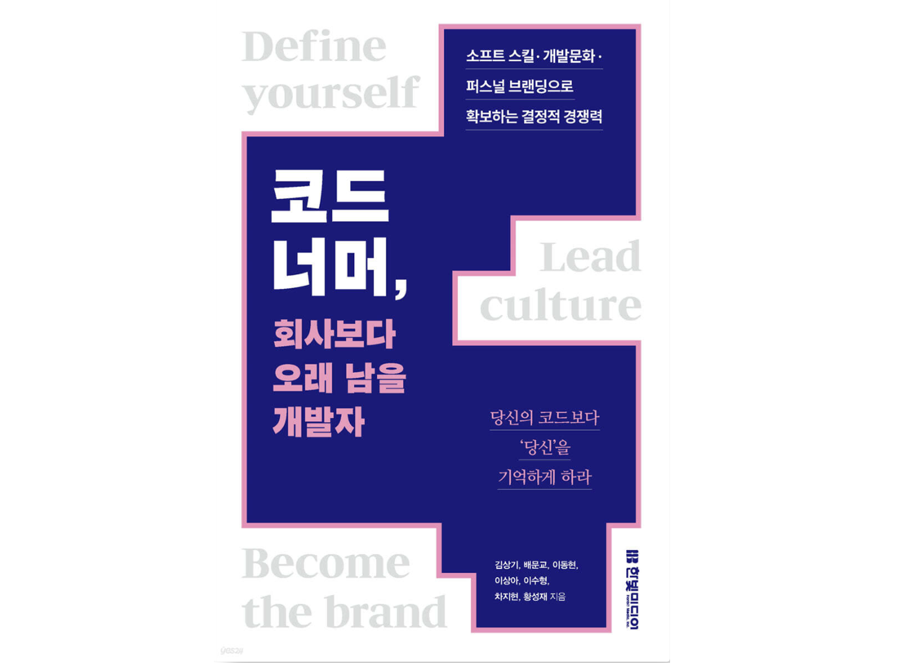
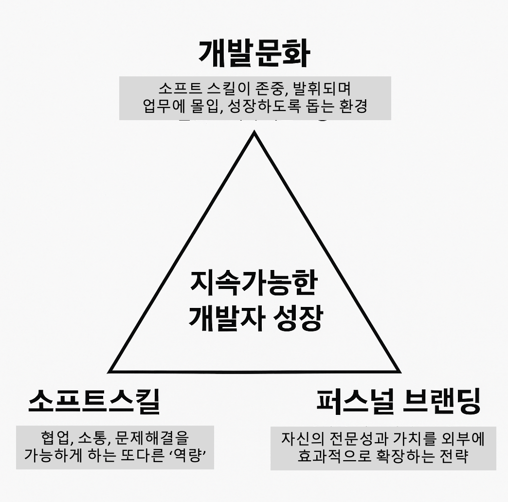
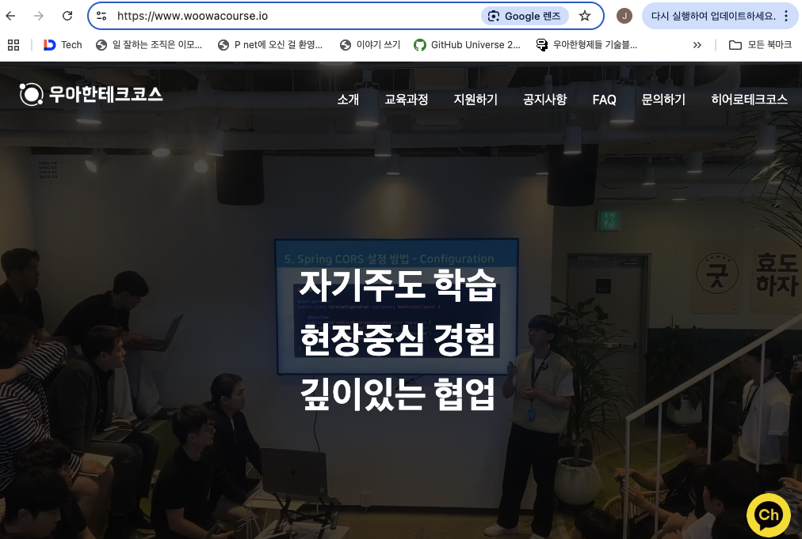
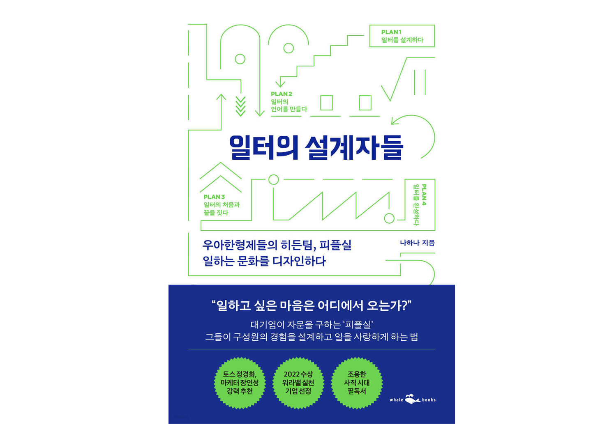
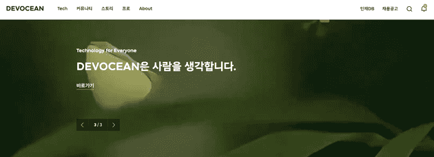
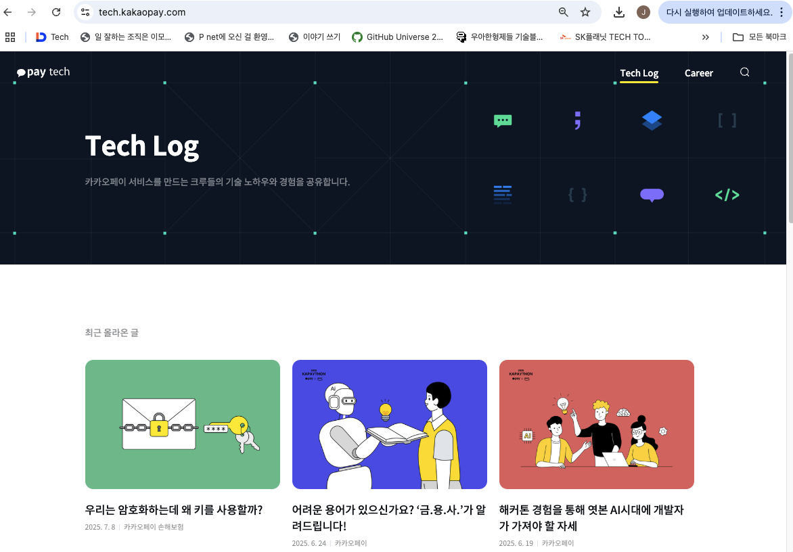
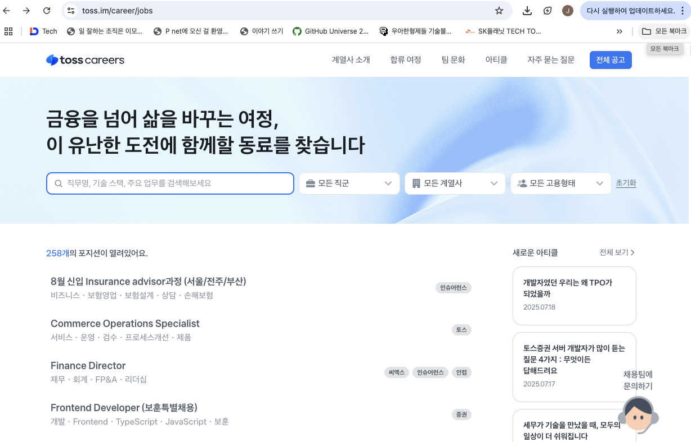

안녕하세요, SK플래닛 DevRel 매니저입니다. 오늘은 최근 화제가 되고 있는 개발자 소프트스킬 | 퍼스널브랜딩 | 개발문화 도서, **"코드 너머, 회사보다 오래 남을 개발자"** 의 요약 및 독후감을 작성하여 보았어요~ (요즘 학교에서는 "독후감"이라는 표현보다는 자유롭게 책을 읽고 기록하며 생활 속에서 실천을 강조하는 "독서생활본(讀書生活本)"의 작성을 권장한다고 하는데요, 웬지 성찰/학습/개선이라는 패턴의 **개발자 회고(Retrospect)** 와도 유사한 점이 많은 것 같습니다. 나의 업무와 회사의 문화를 회고하는 마음으로 퀵하게 작성해 보았사오니 참고 부탁드립니다!) 

* 도서 링크는 여기에! https://product.kyobobook.co.kr/detail/S000216932006 (교보문고)

## 0. 잠시 전하는 말씀 있겠습니다~

돌아오는 7월 25일 (금) 19:00 ~ 22:00, 서울 서대문구 연희로2길 62 한빛미디어 B동 1층 리더스홀에서 100명의 청중을 모시고 "기술보다 강한 '나'를 만드는 실전 커리어 전략" 이라는 제목으로 본 책의 **북토크** 를 진행하오니 관심있는 분들께서는 참고하시기 바랍니다 ~~(본 글을 포스팅하는 시점에는 이미 마감되었다고 합니다)~~.  
기타 자세한 사항은 여기를 참조하세요 => https://techtopic.skplanet.com/techseminar2025-2h/
  (삼성전자, 우아한형제들, SKT, 카카오페이, (전)토스 DevRel 실무자의 생생한 이야기를 소개합니다!)

## 1. 왜 이 책이 화제일까요? 

본 도서는 **소프트스킬, 개발문화, 퍼스널 브랜딩** 이라는 세 영역에서 주 독자인 개발자와 예비 개발자들에게 현업 사례와 경험과 함께 이들의 중요성을 전해 주는 실무서입니다.   
문득 이 세 영역을 **삼각형** 으로 도식화해보고 싶은 생각이 들었는데요(책에는 그림이 없습니다 ^ ^), 각 꼭짓점인 소프트 스킬, 개발 문화, 퍼스널 브랜딩은 상호 보완하면서 개발자의 성공을 이끌어나가게 됩니다. 

* 소프트 스킬: 조직 안에서 협업을 가능하게 하는 또 하나의 "역량" 
* 개발 문화: 그런 소프트 스킬이 존중받고 발휘되며 업무에 몰입, 성장하도록 돕는 환경 
* 퍼스널 브랜딩: 자신의 전문성과 가치를 외부로 확장하여 커리어 기회를 확장하는 전략. 
* 삼각형은 (양방향) 피드백 루프를 형성하며, 삼각형의 중심은 **"지속 가능한 개발자의 성장"** 을 추구

(책에는 없지만 이해를 돕기 위해 도식화하였습니다)

참고로 도서 정보는 다음과 같습니다. 

* 도서명: '코드 너머, 회사보다 오래 남을 개발자'
* 핵심 메시지: 당신의 코드보다 '당신'을 기억하게 하라
* 주요 주제: 소프트 스킬, 개발문화, 퍼스널 브랜딩으로 확보되는 결정적 경쟁력
* 집필진: 국내 주요 IT기업의 만렙 DevRel 매니저님들 ^ ^
* 출판사: 한빛미디어 (올해 6월 30일 1쇄 발간)
* 링크: https://product.kyobobook.co.kr/detail/S000216932006 (교보문고 기준) 

## 2. 챕터별 핵심내용 및 소감 

#### (1) 성장 지옥에서 탈출할 비기, 소프트 스킬 

본 챕터는 크게 "**대화의 기술** (휴먼은 코드로(만) 소통하지 않는다)"과 "**회의의 기술** (회의에서 눈도장 찍고 스카웃되기?)"의 두 파트로 크게 나눌 수 있는데요, 인간의 기본 활동인 듣기와 말하기가 회사라는 필드에서는 커뮤니케이션과 회의에서 나타나는데요, 나와 회사에서 바로 도입할 수 있는 실제적인 "스킬" 중심으로 정리되어 있는 것들이 인상적이었습니다. 자세한 내용은 책을 참조 부탁드리며, 저의 눈에 들어왔던 내용 일부만 공유드립니다. 

* 상대방을 진심으로 인정하는 것이 경청의 시작
* 대화를 이어나갈 수 있는 질문 '스킬' 익히기
* 닫힌 질문(Yes/No)과 열린 질문 적절하게 활용하기
* 왜(Why) 보다는 '무슨 이유로', '어떤' 을 선호하기
* 말하기와 듣기의 비율은 3:7 로 유지
* 상어 같은 대화자 vs. 고래 같은 대화자
* 조언보다는 인정과 공감하기
* 회의의 목적과 기대 결과를 미리 그리고 명확하게 전달하기
* 배경 음악, 시간제한 도구 등의 보조 장치 잘 활용하기
* 체크인 및 체크아웃 잘하기 등

#### (2) 우테코 리사 코치가 말해주는 소프트 스킬의 중요성 

참고로 우테코는 "우아한테크코스", 즉 우아한형제들 회사 내 외부개발자 양성을 위한 교육조직으로 수 년간 좋은 개발자들을 양성하고 있습니다 - 박재성(포비) 님을 비롯하여 다양한 직무별 강사 및 소프트스킬 코치님들이 도움을 주고 계세요. 

* 우아한 테크코스 웹사이트: https://www.woowacourse.io/  

이 챕터에서는 정확한 자기 인식의 힘이 나와 조직 성장의 시작점이라고 정의를 내리고 있는데요, (1) 개인 관점에서는 **자기 인식**에서 시작하여 **자기 효능감**과 **회복 탄력성**을 길러 나가고, (2) 조직과 리더 관점에서는 **심리적 안전감**을 잘 제공해 줄 수 있으면 행복한 개발자 문화가 이루어지겠구나 하는 생각이 들었습니다(제 의견은 책의 내용과는 살짝 다르지만 개인만으로는 힘들 수도 있다고 생각하거든요). (3) **유연성과 자기 결정력** 은 그 정반합(?)의 결과일 수 있겠다는 생각이 들었습니다. 개인적으로 좋아하는 내용들, 고민하는 내용들이 나와서 매우 반가왔고 동시에 이러한 요소들이 실제로 잘 Working하는지가 궁금하기도 했던 터라 흥미있게 읽었습니다 ~~(실은 독후감 초안은 이미 써놓았다가 포스팅을 못하고 있었...)~~.  주요 내용은 다음과 같습니다. 

* 자기 인식(Self-awareness)과 자기 효능감
* 회복 탄력성(Resillience)
* 심리적 안전감(Psychological Safety)
* 유연성 및 자기 결정력

덧. 그러다가 어제 우형 피플실에 근무하시는 분께서 쓰신 **"일터의 설계자들"** 이라는 책을 병행해서 읽게 되었는데 내용들이 상호보완되어 좀더 이해가 잘 되었고 "정말 회사에서 이런 부분까지 다뤄준단 말이야?" 하는 생각 역시 함께 들었습니다(조직 레벨에서 이 부분을 다뤄 준다면 개발자는 몰입할 수 있고 따라서 행복할 수 있겠네요. 다만 모든 회사가 규모나 상황상 이렇게 하기는 쉽지 않으니 어떤 펑션으로 도움을 받는 것도 현실적으로 필요하겠다는 생각이 듭니다). 참고로 이 책에서도 "관리보다 관심을",  "심리적 안정감을 키우는 일터의 조건" 등의 컨센서스가 보였습니다. 

('일하고 싶은 마음은 어디에서 오는가' - 저도 **자문**을 구하고 싶어졌습니다 ^ ^)

#### (3) 공유와 소통으로 키워가는 성장의 선순환

이 챕터를 한줄 요약하면 "커뮤니티 및 기술 블로그와 함께 성장하기(feat. SK데보션 빌드업 스토리)" 로 적을 수 있을 것 같아요. 

소속 특징(?) 때문에 데보션 커뮤니티와 담당자를 종종 뵙고 있지만 감탄하는 것 중 몇 가지는 다음과 같은데요,  

- (1) SKT에서 시작하였지만 이를 넘어 하이닉스, AX, 플래닛 등 **SK ICT의 엔지니어를 아우르는 개발자 커뮤니티**를 만들어 냈다는 것 ~~(그래서 도메인이 sk.com...)~~
- (2) **오프라인 커뮤니티와 온라인 테크 블로그를 융합**하여 운영하고 있다는 것 
- (3) 올해는 좀 성격이 바뀌었지만 수 년간 **데보션을 채용 브랜드로까지 이끌어 냈다**는 점입니다. 

아울러 올해는 역량개발 플랫폼으로의 새로운 도전 중으로, 다양한 스터디 모임을 진행하고 외부 전문가와의 교류를 추진하는 것으로 알고 있습니다(지난 주 판교 밋업 때는 **엔비디아** 데브렐께서 오셔서 개발자 협력 프로그램도 소개해 주셨네요!). 저도 작년부터 업무 관련해서 데보션 프로 활동으로 기여하고 있지만 개인적으로도 이 커뮤니티를 응원하며 지속 발전하기를 바랍니다. 

책에서는 그밖에도 다음 내용들이 언급되며 함께 참고하시면 좋을 것 같습니다. 

* 조직간 사일로 해소
* 자발적 학습과 교류 문화 조성
* 기술 공유, 기술토론 활성화
* 시작하는 글쓰기부터 콘퍼런스 발표까지의 단계별 접근

덧. SK데보션 기술 블로그는 여기를 참조하세요! https://devocean.sk.com/

#### (4) 나무가 크려면 산도 커져야 한다 - 동반 성장 개발문화

  
(카카오페이 기술 블로그 'Tech Log')

언젠가 카카오페이 테크블로그에서 책 내용과 유사한 글을 읽은 적이 있습니다 - https://tech.kakaopay.com/post/kakaopay-dr-03/

당시 한 조직에서의 기술 문화의 이식을 전략적이고 체계적으로 접근하고 실행해 나가는 모습까지를 한 편의 글에서 보여 주셔서 인상적이었는데요. 건강한 조직문화와 개발문화에 대한 명확한 비전, 정의, 방향을 설정한 후 이에 부합하는 다양한 프로그램들을 지속적이고도 진정성 있게 실천해 나갈 때 나무와 산에 비교되는 개인과 조직이 동반 성장한다는 큰 이야기도 감히 할 수 있지 않을까 싶습니다(조금만 스포(?)하자면, 에를 들어 **'개발'의 정의**를 우리가 아는 단순한 코딩 업무만이 아닌 **코딩 + 서비스 + 정책 + 프로세스를 포함한 우리 회사의 미션을 해결하기 위한 모든 활동**을 포함하였는데요, 이 관점에서는 개발문화의 정의와 범위도 달라지고 또 확장될 수밖에 없을 것입니다). 

덧. 얼마 전 업무 때문에 글쓴이 분께 급히 연락을 드려 찾아뵌 적이 있었는데요, 바쁜 중에서도 친절과 여유를 잃지 않으면서도 필요한 내용들을 잘 전달해 주셔서 대접해주신 K-mart 간식과 커피와 함께 기억이 남습니다(언젠가 Agit 15층에서 탁구 한판 치는 날이 오면 좋겠네요!)

* 조직문화와 개발문화의 조화
* 지금 당장 실천할 수 있는 선한 영향력
* 개발자 성장을 위한 시스템 (자발적 기술 공유 문화) 
* 조직 성장을 위한 다양한 제도들 ~~(너무 많아 책을 꼭!)~~

덧. 카카오페이 기술 블로그(Tech Log): https://tech.kakaopay.com/

#### (5) 나라는 브랜드를 만드는 개발자 퍼스널 브랜딩 전략 

요즘 개발자의 연관 검색어 중 하나를 꼽는다면 **'퍼스널 브랜딩'** 일 것입니다. 최근에는 퍼스널브랜딩 교육과정까지 개설될 정도이지만 개인 블로그 쓰는 것 말고는 어떻게 해야 할지 모르겠는(?)분들께 권해 드립니다. 
개발자의 고유한 가치는 누가 알려주기보다는 내가 만들어가는 것이고 어떤 길을 가야 할지 궁금하신 분들을 위해 퍼스널 브랜딩의 how뿐만 아니라, what을 잘 정의하면서 why라는 right way까지 제시해 주는 것이 개인적으로 좋았습니다.

* 정의: 개발자로서 나만의 고유한 가치를 세상에 알리는 일 
* 실행 전략: 자기진단: 강점, 가치, 경험 파악. 이후 기록 시작(기술블로그 운영, 지식 공유, 소셜미디어 활용 등)

아울러 '샤이'할 수 있는 MBTI 'I' 유형 개발자들의 네트워킹 방법과 팁도 소개하고 있네요(저도 I형 데브렐러라 ㅎ). 도움이 되시기 바랍니다 : ) 

* 작은 그룹에서 시작하기 
* 콘텐츠로 나를 먼저 보여주기
* 좋은 질문을 하고 귀 기울이기
* 사전 준비하기 등등 

#### (6) 이력서 없이도 주 1회 스카웃을 부르는 커리어 설계 

(toss careers: 토스 채용 사이트)

**기업 데브렐 활동의 주요 목적 중 하나는 개발자의 "채용 활동과의 연계"입니다** (예를 들어 T모 사의 경우 채용 브랜딩 담당자의 역할을 최근 JD에 포함하고 채용을 진행하기도 했었죠). 그래서 많은 기술 블로그에는 그 회사의 '채용' 사이트 링크가 연결되어 있으며, 개발자들이 관심있어할 만한 주제와 내용을 (a.k.a. 회사의 개발 활동과 개발 문화를) 끊임없이 블로그와 컨퍼런스, 밋업 등 다양한 채널을 통해 어필합니다. 역으로 개발자들도 나의 비전과 능력을 발휘할 더 좋은 직장환경에서 일해야 할 권리(!)가 있고 따라서 인터넷과 AI 환경(SEO & AEO, 그리고 AI가 서류전형에 관여하는 상황 등)에서 'Machine Readable'하게 나를 어필해야 합니다.

글쓴이께서 주요 IT기업에서 개발자 채용 커리어로의 전문성을 기반으로 이 내용들을 소개해 줍니다.

* 기업이 원하는 개발자는 따로 있다: 개발자 취업/이직
* 개발 능력보다 더 중요한 문제 해결 능력 
* 이력서 대신 네트워킹으로 승부하자 
* 기업이 나를 먼저 찾게 만들자 등등 

그밖에도 사내 기술 공유를 위한 다양한 프로그램들을 소개하고 있으니 데브렐/기술문화 담당자께도 도움이 될 것 같습니다! (엔지니어링 데이, 프다클 등) 

#### (7) 회사가 나를 홍보하게 만드는 자기 PR 기술 

조직이 홍보하는 개발자가 되는 방법에 대한 실제적인 관점을 제공합니다. 개발자(나) 중심의 관점에서 **회사가 생각하는 관점의 전환**을 가져올 수 있는 유용한 팁들이 많으니 참고하시기 바랍니다.  

* 홍보팀은 항상 새로운 스토리를 원한다: PR도 DR도 마찬가지다! 
* 내 이야기를 필요로 하는 곳은 반드시 있다 
* 신규성, 진실성, 정보성을 갖춘 나만의 개발자 이야기 
* PR을 도와 줄 홍보 담당자 찾기 
* 선택받는 이야기로 재구성하기                                                        
* 회사의 비전에 나를 녹아내기 등등 

## 3. 정리하며 

이 책을 읽으면서 가장 인상 깊었던 것은 **'당신의 코드보다 당신을 기억하게 하라'** 는 표지에 있는 한줄 메시지였는데요, 저는 이것을 두 가지 방향으로 해석하였습니다. 즉 

* 다른 사람(동료, 상사, 타 기업의 인사담당자 포함)들이 나를 기억할 수 있도록 해야 하고(퍼스널 브랜딩 차원), 
* 책에 명시되어 있지는 않지만 AI도 나를 잘 기억할 수 있도록 블로그나 링크드인 등 나의 기록을 잘 남기는 부분을 병행해야 한다는 것입니다(SEO, AEO, 최근 하드한 프롬프트 한번씩 입력해 보셨는지요?)

또한 앞으로 AI에게 점점 기대하는 역량이 '생산성과 효율성'이라면, 
인간에게 더욱 요구하게 될 역량이 바로 이 책에서 기술하는 **소프트 스킬**이라고 보았습니다. 
그런데 소프트 스킬은 인간이 인간과 협업할 때 필요한 역량이라면, 최근 이야기가 많이 나오고 있는 'AI와 인간의 협업'을 위해서는 어떤 ~~하이브리드한~~ 스킬이 필요할까요? (프롬프트 엔지니어링? 규칙을 부여하여 원하는 결과를 뽑아낼 수 있는 바이브코딩? 멀티 툴 활용?) 이 부분도 별도로 고민이 필요할 영역일 것 같습니다. 

혹시 다음에 **'코드너머 2편'** 이 나온다면 ^ ^ 1편은 개발자 관점에서의 소프트스킬/브랜딩/문화를 서술했다면, 2편은 IT기업과 담당자 관점에서의 데브렐 업무 및 프랙티스, AI와 개발자의 협업 및 활용과 해커톤 영역까지 소개하는 관점의 책을 한번 기대해 봅니다(저희도 참전할 수 있으면 좋겠네요 ^ ^).

그러한 의미에서 이 책이 우리나라 개발자 생태계에, 그리고 소프트스킬 | 퍼스널브랜딩 | 개발문화 분야의 마중물이 되기를 바랍니다~~(영중일베 번역 들어가나요)~~.

읽어 주셔서 감사드립니다! 