### No.1 리워드 쇼핑 플랫폼, Wezuro 런칭!

SK플래닛은 지난 9월 경유하여 쇼핑하며 포인트를 쌓아가는 쇼핑 혜택 플랫폼 Wezuro( https://wezuro.co.kr )를 선보였습니다.  
이번 포스트를 통해 No.1 리워드 쇼핑 플랫폼인 Wezuro가 브랜드적 관점에서 어떻게 구축되었는지 SK플래닛이 추진한 과정을 설명드리려고 합니다.

### Overview: 슈퍼 앱에서 버티컬 앱으로

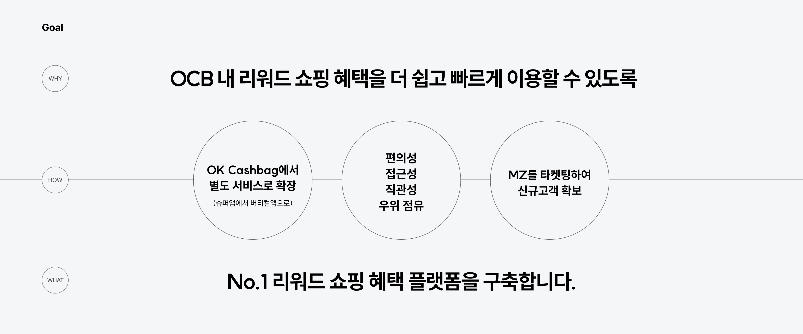

OK캐쉬백은 경유하여 쇼핑하고 포인트를 적립하는 '쇼핑적립' 서비스를 제공하고 있었어요.  
외부적으로 체리피커가 체리슈머로 인식되는 긍정적인 측면이 있고, 최근의 고객은 신(新)자린고비/무지출/조각/반반/공동구매 등과 같이 계획적이고 합리적인 소비를 지향하고 있어요.  
UX 리서치를 진행한 결과, OK캐쉬백 내 '쇼핑적립' 비즈니스가 성장하고 있지만, OK캐쉬백 홈 > 쇼핑 탭 내에서 다수의 블록으로 인하여 접근성이 용이하지 않고 활동성이 떨어지며, 앱 진입 경로가 길고 어렵다는 문제점을 인식했어요.  

이러한 문제점을 해결하기 위해서는 사용성을 개선하고 서비스 활성화 및 재방문을 유도해야 한다는 방향성을 세웠어요.
또한 기존의 슈퍼 앱에서 버티컬 앱으로 분리시켜 사용성(즉, 편의성/접근성/직관성 등)에서 우위를 확보하고, MZ 세대를 타켓팅하여 신규 고객을 확보한 후, 이를 기반으로 새로운 서비스인 No.1 리워드 쇼핑 플랫폼을 구축하자는 목표를 설정했어요.  

### Brand Vision: 쇼핑의 모든 순간을 유익하게

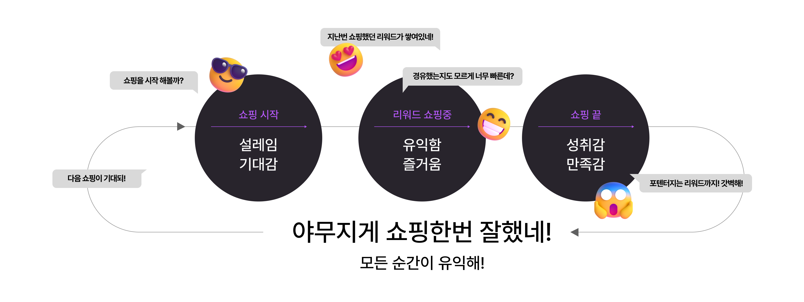
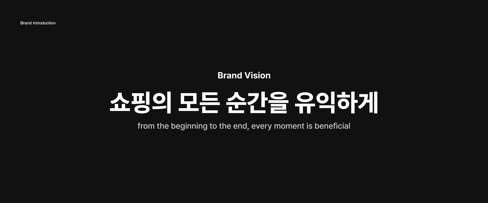

이러한 방향과 목표로 프로젝트가 설정되었고, 그에 맞게 브랜드적 관점에서 브랜드가 가고자 하는 방향, 목표 등을 정의했어요.    
전체적으로 고객이 서비스를 사용하면서 처음부터 끝까지 모든 과정에서 유익함을 느낄 수 있는 브랜드를 만들기로 했어요. 또한 UX 리서치를 하면서 사용성을 개선하고 서비스 활성화 및 재방문을 유도해야 한다는 피드백을 프로젝트 목표에 반영했어요.  

그리고 혜택의 의미가 포함된 '유익함'이라는 단어에 범위를 더 넓혀서 편리함과 성취감을 포함하는 단어가 우리 서비스에 적합한 키워드라고 생각했어요. 경유가 만든 연결된 경험은 무한한 포텐셜이 있고, 그 순간들이 모두 유익하길 바라면서 "쇼핑의 모든 순간을 유익하게"로 브랜드 비전을 정의했어요.

### 쇼핑적립의 새로운 이름, Wezuro 브랜드의 전략을 담아 로고타입 제작

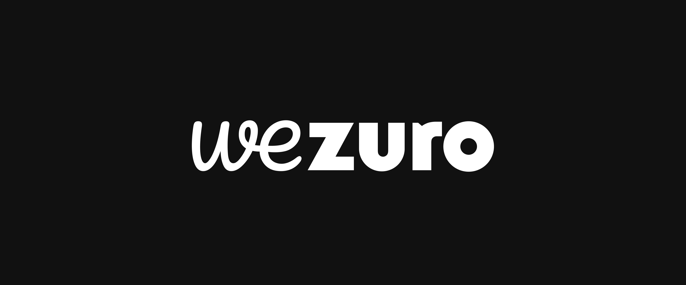

Wezuro는 우리(We)가 주로(Zuro), 즉 우리가 즐겨 이용한다는 의미를 담고 있어요. 또한 서비스 활성화 및 재방문을 유도하기 위한 우리의 목표도 담겨 있어요.  
이러한 Wezuro의 직접적인 의미와 서비스 목표 그리고 이미 도출한 Wezuro의 브랜드 전략을 로고타입에 담아내고자 했어요.  
제작된 로고타입에서 'we'의 부드럽고 유연한 쉐입은 경계없이 쉽게 이용할 수 있다는 인상을 주고자 했고, 빠르고 쉽게 이용할 수 있어서 접근성이 좋다는 의미를 담았습니다. 이는  Wezuro의 핵심가치인 Seamless를 표현한 것이에요.  
또한 'we'의 소프트함은 경유쇼핑을 하면서 얻는 혜택으로 인한 즐거움을 의미하고 있어요. 'zuro'는 볼드한 서체를 사용하여 강한 인상을 주었고, 친근한 소문자는 핵심가치인 Ritual을 담고 있어요.  

### Brand Value

브랜드의 핵심가치는 고객과 약속이자 브랜드를 한 방향으로 나아갈 수 있게 해 주는 길잡이 역할을 해요.  
이를 기반으로 브랜드의 비전(쇼핑의 모든 순간을 유익하게)을 담아 4가지 키워드를 뽑았고, 핵심가치를 바탕으로 브랜드의 아이덴티티를 구축하게 되었어요.

**1) Seamless**  
경유해서 쇼핑한다는 의미로 서비스의 번거로움을 느끼지 않게 하고 경계없이 접근성이 용이하여 쉽게 이용할 수 있습니다.

**2) Connective**  
쇼핑몰과 쇼핑몰이 연결되면서 리워드가 생기고, 쇼핑 취향을 공유하여 사람과 사람이 연결되고, 모든 연결의 순간이 즐거운 혜택으로 돌아옵니다. 우리가 만드는 연결은 혜택으로 가는 방향이며 무한한 가능성이 있는 세계로 확장됩니다.

**3) Beneficial**  
편리하게 쇼핑하고, 받은 리워드를 은행 저축처럼 쌓을 수 있어서 모든 순간에 유익함을 주는 서비스를 제공합니다.

**4) Ritual**  
일상에서 소소한 성취감을 얻고, 가치있는 소비와 갓생을 사는 MZ 세대가 저희의 타겟입니다. MZ 세대의 습관을 쇼핑과 연결시키고, 이러한 쇼핑 습관은 Wezuro의 리워드와 함께 무한한 가능성을 만들어 갑니다.

### Brand Identity

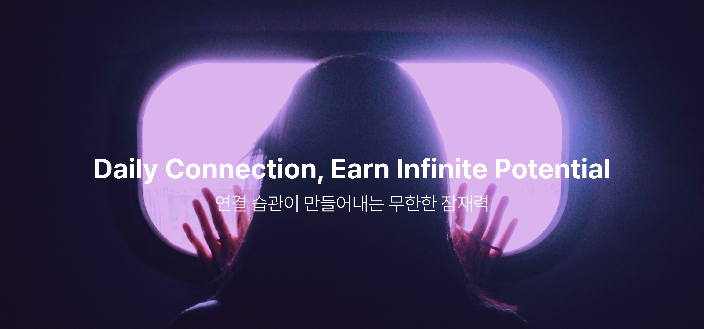
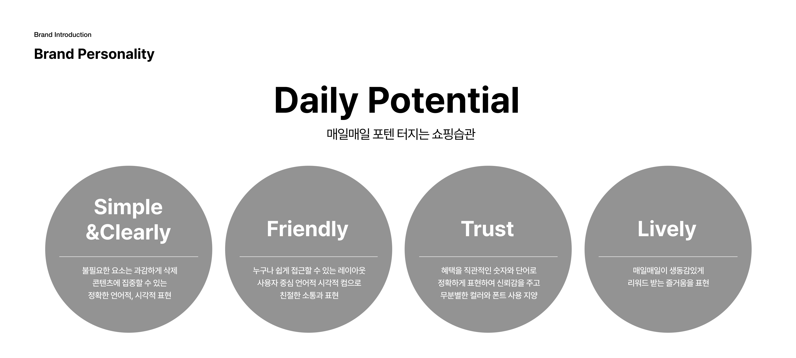

앞서 도출된 브랜드의 비전과 핵심 가치를 담아 브랜드의 아이텐티티를 "연결의 습관이 만들어내는 무한한 잠재력"으로 정의했어요.  
그리고 브랜드의 정체성을 시각적으로 표현하기 위하여 디자인 표현 원칙을 만들었는데, 일차원적으로 심플하고 예쁜 디자인이 아닌, 브랜드의 아이덴티티가 담고 있는 의미의 표현 원칙이에요.  
이러한 표현 원칙은 UI뿐만 아니라 고객이 브랜드를 만나는 접점에 적용됩니다.

### 컬러는 무심한 듯 시크하게 그리고 다채롭게 

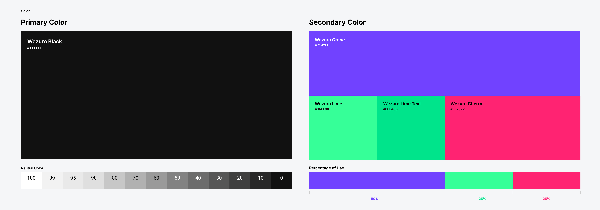

프라이머리 컬러는 블랙입니다. 블랙은 모든 컬러를 혼합하면 나오는 색깔인데, Wezuro에서 경험하는 많은 서비스와 브랜드들을 모두 담고 있다는 의미가 있습니다.  
또한 MZ 타켓에 맞춰 트렌디한 컬러이며, 무심한 듯 시크한 인상을 줍니다.  
세컨더리 컬러는 3가지로 구성되는데 생동감 있는 즐거움을 표현합니다. 신선한 컬러 조합으로 경쾌한 기운을 담아내기 때문에 브랜드 아이덴티티를 더욱 풍부하게 만듭니다.  

### Wezuro의 모티프: Z북마커 그리고 기호들

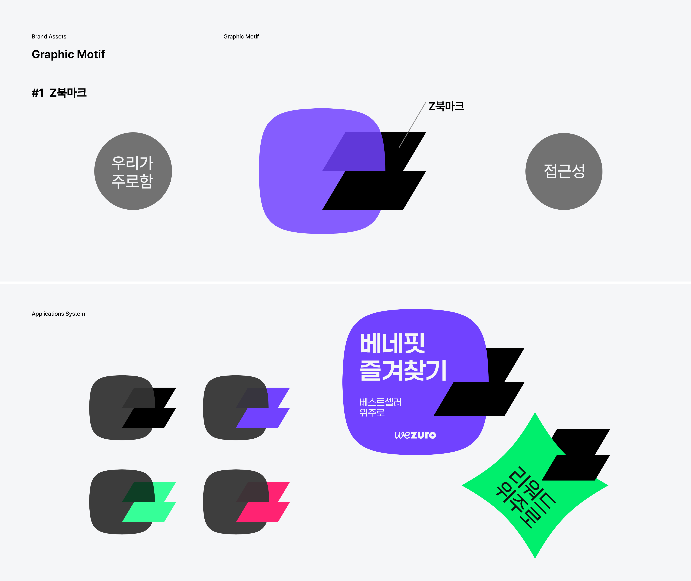

#### #1. Z북마크 ####

우리가(We) 주로(Zuro)한다. 위주로 쇼핑한다의 의미에서 '즐겨찾기(북마크)' 모티프를 도출했어요.  
Z 형태는 Wezuro의 Z와 타켓 세대인 MZ의 Z를 의미하기 때문에 'Z북마크'라고 이름을 지었어요. 
아주 쉽게 또 다시 베네핏을 받을 수 있다는 메시지를 일관성 있고 주목성 있게 전달하고, 지속적으로 쇼핑 습관을 유도하고 접근성이 쉽다는 인식을 주고자 했어요.  
Z북마크는 사용자에게 브랜드의 아이덴티티(연결 습관, 무한한 잠재력)를 더 쉽고 강하게 전달합니다.  

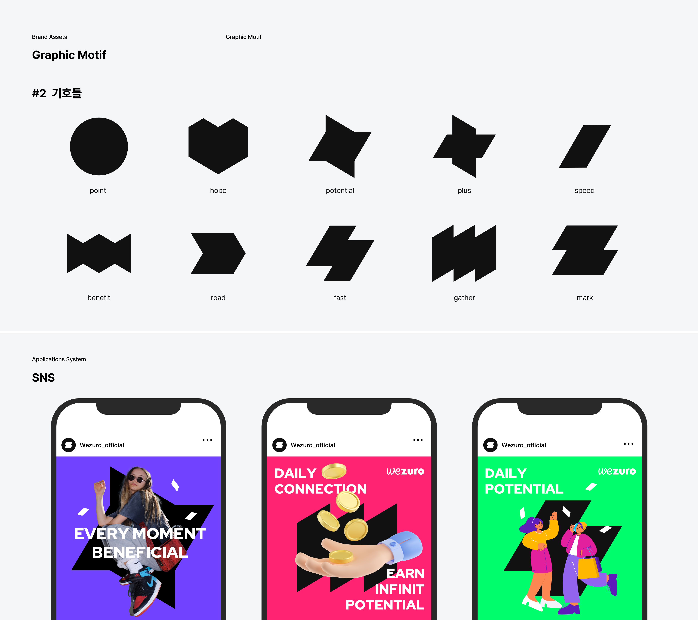

#### #2. 기호들 ####

서비스의 특징을 기하학적인 형태의 10 가지 기호로 도출했어요. Wezuro의 'Z' 획을 이용하여 다양한 형태로 구성된 기호들은 재미있고 지루하지 않게 표현하여 Wezuro의 가치를 사용자에게 전달합니다.  

### 사용자와 만나는 Wezuro

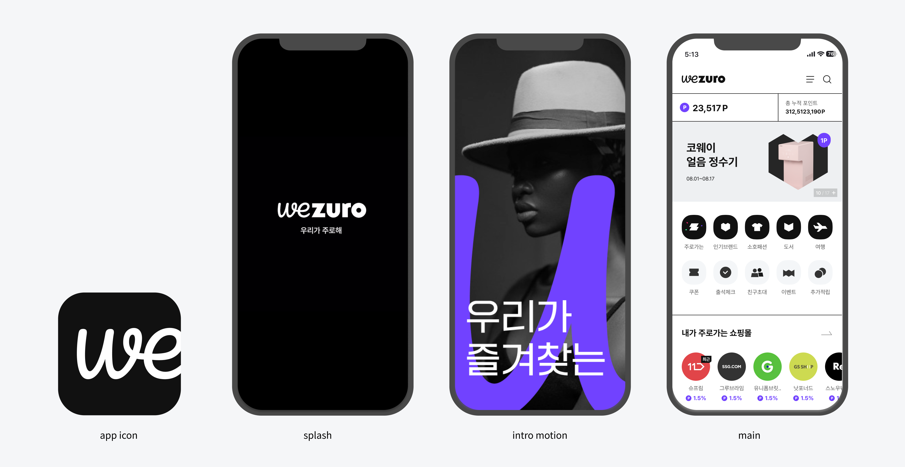

UI에 브랜딩이 적용된 모습이에요. We의 유연한 느낌을 담아 앱아이콘을 제작했고, 인트로 모션을 만들어서 브랜드를 더 강하게 인지하도록 하였습니다.  
주로한다/즐겨찾는다는 의미의 워딩을 지속적으로 사용하고, 모티프(#2 기호들)의 인상을 담아낸 아이콘을 제작하여 Wezuro 브랜드를 통일감 있게 전달하고 있습니다.  

### 새로운 고객 확보를 위하여

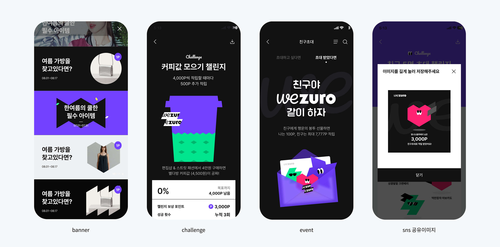

새로운 고객을 MZ로 타겟팅하여 트렌디한 서비스를 만들기 위해 노력하고 있는데요. 배너는 모티프를 활용하여 다양한 인상을 주되 통일감을 느낄 수 있도록 제작했어요.  
그리고 참여형 동기부여 이벤트를 진행하여 브랜드 컬러와 모티프를 활용하여 Wezuro의 경쾌한 즐거움을 사용자에게 전달하고자 했어요.

### 마치며

새로운 서비스를 만들어 나가는 과정에서 BX는 UX/UI와 긴밀한 협력으로 작업이 이루어지는데요.  
이는 브랜드가 사용자와 만나는 접점이므로 하나의 목소리를 내기 위한 노력이었고, 서로의 지속적인 의견 교환과 반영으로 서비스가 잘 구현될 수 있었습니다.  
앞으로 Wezuro는 사용자가 'Daily Potential'을 느낄 수 있게 하고, 나만의 쇼핑 즐겨찾기가 될 수 있도록 지속적으로 고민하려고 해요. 많은 관심 부탁드립니다.

No.1 리워드 쇼핑 플랫폼, Wezuro

URL: www.wezuro.co.kr