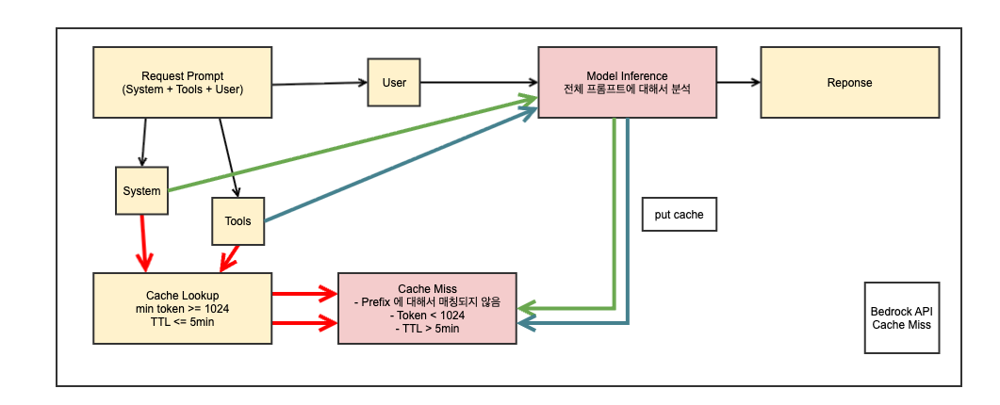
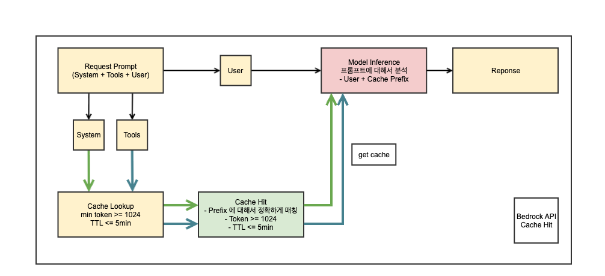

이 글은 SK플래닛 사내 AI 프로젝트 **Chat DIC**에서 AWS Bedrock의 Prompt Caching 기능을 활용해 **쿼리 생성 속도와 비용을 최적화한 사례**를 다룹니다.

## 0. 개요

AWS Bedrock의 **Prompt Caching**은 반복적으로 사용되는 프롬프트 문맥(예: system, tools 등)을 캐시에 저장하여 **모델 재계산을 줄이고 응답 지연 시간 및 토큰 비용을 절감**할 수 있는 기능입니다.  
현재 Bedrock의 일부 모델에 대해 **Generally Available(GA)** 상태로 제공되고 있습니다.

## 1. Chat DIC 이란?

Data Infrastructure(DI)팀에서 개발한 사내 Text 기반의 SQL Assistant 및 Table 메타 검색 시스템입니다.
향후 당사의 데이터 플랫폼인 DIC 내의 여러 서비스를 LLM을 기반으로 통합하고 사용자의 데이터 분석 진입장벽을 낮춰주며, 궁극적으로는 Agent 형태로 개발될 예정입니다. 
현재 클로즈 알파 단계로 데이터 직군 구성원들이 사전 테스트 중이며. 10월 중 오픈 테스트를 진행할 예정입니다.

## 2. Prompt Caching이란?

Prompt Caching은 대형 언어 모델(LLM)이 동일한 프롬프트 문맥을 여러 번 계산하지 않도록 하는 기능입니다.  
이를 통해 **지연 시간 단축**과 **토큰 비용 절감**이 가능합니다.

### 지원 모델
- Claude 4.0 Sonnet  
- Claude 3.7 Sonnet  
- Claude 3.5 Haiku  
- Amazon Nova Micro / Lite / Pro / Premier 등

### 효과
- **지연 시간 단축:** Cache된 문맥은 재연산이 불필요하여 응답 속도 향상  
- **토큰 비용 절감:** Cache에서 읽은 토큰은 낮은 요율이 적용, 일부 쓰기 토큰은 일반 요금보다 높을 수 있음

---

## 3. 작동 원리

### Cache Checkpoint
- 캐시 저장 지점으로, prompt prefix(연속된 문맥 블록)를 지정  
- Claude 3.7 Sonnet 기준 최소 1,024 tokens 필요  
- 예: 1,800 tokens에서 cachepoint 지정 시, 이후 cachepoint 지정은 2,048 tokens 도달 시 가능

### TTL (Time To Live)
- 캐시 유효 기간은 **5분**
- TTL 내 캐시 히트 발생 시, TTL은 재설정됨

### 지원 API
- Converse / ConverseStream  
- InvokeModel / InvokeModelWithResponseStream  
- Cross-region Inference 기능과 조합 가능

### Prompt 관리
- Console 및 API에서 프롬프트 생성·수정 시 캐싱 옵션 설정 가능  
- `system`, `messages`, `tools` 등의 필드에 적용 가능  
- 체크포인트 추가 시 모델별 최대 제한 존재

---

## 4. 모델별 제약 사항

| Model name | Model ID | Release Type | Minimum tokens per checkpoint | Max checkpoints | Fields |
|-------------|-----------|---------------|-------------------------------|-----------------|--------|
| Claude 3 Opus 4.1 | anthropic.claude-opus-4-1-20250805-v1:0 | GA | 1,024 | 4 | system, messages, tools |
| Claude Opus 4 | anthropic.claude-opus-4-20250514-v1:0 | GA | 1,024 | 4 | system, messages, tools |
| Claude Sonnet 4 | anthropic.claude-sonnet-4-20250514-v1:0 | GA | 1,024 | 4 | system, messages, tools |
| Claude 3.7 Sonnet | anthropic.claude-3-7-sonnet-20250219-v1:0 | GA | 1,024 | 4 | system, messages, tools |
| Claude 3.5 Haiku | anthropic.claude-3-5-haiku-20241022-v1:0 | GA | 2,048 | 4 | system, messages, tools |
| Claude 3.5 Sonnet v2 | anthropic.claude-3-5-sonnet-20241022-v2:0 | Preview | 1,024 | 4 | system, messages, tools |
| Amazon Nova Micro | amazon.nova-micro-v1:0 | GA | 1K | 4 | system, messages |
| Amazon Nova Lite | amazon.nova-lite-v1:0 | GA | 1K | 4 | system, messages |
| Amazon Nova Pro | amazon.nova-pro-v1:0 | GA | 1K | 4 | system, messages |
| Amazon Nova Premier | amazon.nova-premier-v1:0 | GA | 1K | 4 | system, messages |

---

## 5. 적용 과정

### (1) AWS Gateway + Lambda 구조 (초기 설계)
- AWS Bedrock API 호출을 Lambda에서 수행  
- 다음 문제점 발생:
  - Gateway Timeout 최대 29초 → 90초로 확장 요청 → 90초 이상의 타임아웃 적용 어려움
  - SSE 통신 미지원 → `stream` 옵션 적용 불가
  - Throttling 이슈 발생 → 요청 토큰 수가 많을 경우 API 호출 실패
  - Lambda 환경에서는 Prompt Cache 미지원  
- 해당 구조는 개발 테스트용으로만 유지

### (2) AWS ALB + EC2 구조 (재설계)
- SSE 통신 지원 (`stream=true` 정상 작동)
- Timeout 3600초까지 설정 가능 (기본 600초로 설정)
- 여전히 Throttling 이슈 발생

### (3) Prompt Caching 적용으로 Throttling 해결
- `system`, `tools` 프롬프트에 캐시 적용  
- `messages` 프롬프트는 캐시 적용하지 않음  
  - 이유: message 리스트의 수만큼 cachepoint가 생성되어 한도 초과 가능성 높음  
  - 사용자 질문이 매번 다르므로 캐시 효율이 낮음

### 호출 시 주의점
- **공백 하나라도 달라지면 캐시 미적용**  
- 따라서 변하지 않는 `system`, `tools` 프롬프트에만 캐싱 적용

---

## 6. 적용 코드

### 🧩 System Prompt Caching

```python
system_prompts = []
for message in chat_request.messages:
    if message.role != "system":
        continue
    assert isinstance(message.content, str)
    system_prompts.append({"text": message.content})

# system prompt caching
if system_prompts:
    system_prompts.append({
        "cachePoint": {
            "type": "default"
        }
    })
```

### 🧰 Tools Prompt Caching

```python
if chat_request.tools:
    tool_list = [self._convert_tool_spec(t.function) for t in chat_request.tools]
    # tools prompt caching
    tool_list.append({"cachePoint": {"type": "default"}})
    tool_config = {"tools": tool_list}
```

---

## 7. Cache Hit 구조 (추정)

| 구분 | 조건 | 설명 |
|------|------|------|
| **Cache Miss** | 누적 토큰 수 < 1,024 OR 프롬프트 prefix 불일치 OR TTL(5분) 초과 | 모델 재연산 발생 |
| **Cache Hit** | 누적 토큰 수 ≥ 1,024 AND 프롬프트 prefix 완전 일치 AND TTL(5분) 내 유효 | system, tools tokens 계산 절감 |


(Cache Miss)
<br/>

(Cache Hit)
<br/>

---

## 8. 마치며

Prompt Caching은 반복적이고 고정된 프롬프트 구조를 가진 LLM 응용 서비스에서 **비용 절감 및 성능 향상**에 매우 효과적인 기능입니다.  
특히 Bedrock의 `system`, `tools` 프롬프트를 캐싱하면 모델 응답 시간을 단축하고, Throttling 문제도 완화할 수 있습니다.

아직 `messages` 영역에는 적용 효율이 낮지만, 장기적으로 Bedrock이 더 세분화된 캐시 제어를 제공하게 된다면  
프롬프트 기반 애플리케이션의 효율성은 더욱 향상될 것으로 기대됩니다.

---

## 9. 참고 링크

- 🔗 [AWS 공식 문서: Prompt Caching](https://docs.aws.amazon.com/bedrock/latest/userguide/prompt-caching.html)