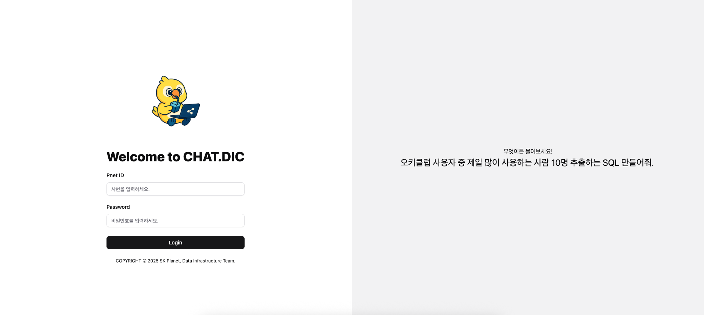
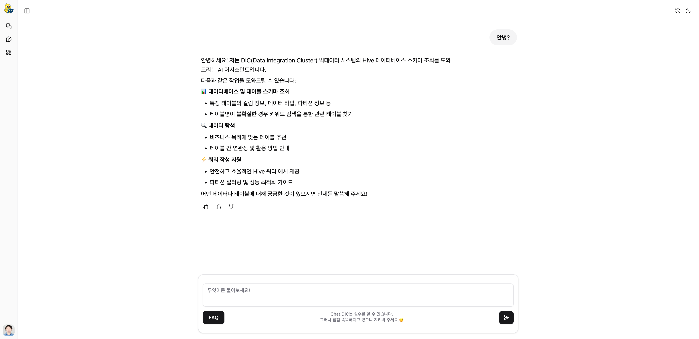
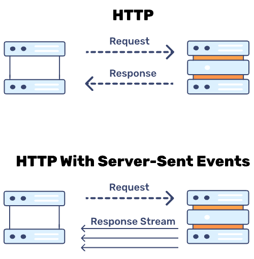
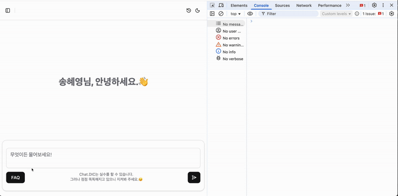
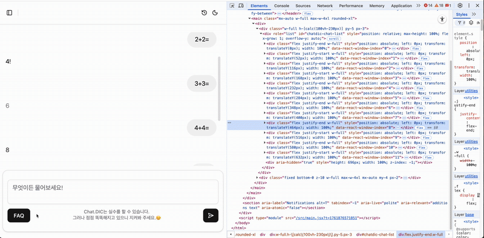

이 글은 SK플래닛 **Chat DIC 사내 프로젝트의 프런트엔드(Frontend) 개발** 과정에서,  
실시간 대화형 LLM 서비스의 특성에 맞춰 적용한 여러 기술적, 성능적 개선점을 정리한 글입니다.

[**Chat DIC**](https://techtopic.skplanet.com/chatdic-ai-text2sql/)(저희는 /챗:디/라고 읽습니다)는 SK플래닛 Data Infrastructure팀에서 개발한 **Text 기반의 SQL Assistant 및 Table 메타 검색 시스템**입니다. 
이 글에서는 Chat DIC의 프런트엔드에 도입된 기술 중 주요 항목을 소개합니다.

(참고) 프런트엔드 vs. 프론트엔드: 어떻게 쓰는 게 맞을까요? 에 대한 답변은,  <br/>
국립국어원 답변에서는 **'프런트엔드'** 가 맞다고 하며, 실제 위키백과나 구글 트렌드 등에서는 **'프론트엔드'** 표현이 더 많다고 합니다. 참고로 다음 글도 함께 읽어보세요([인프런 글](https://www.inflearn.com/blogs/2544?srsltid=AfmBOopiLr3H07bm32c0UeJT52CnuCFh0HGsh8czkumC81ag5tHU8m4O)). <br/>
(저희 다른 글에서도 혼용되어 있을 텐데 가급적 하나의 글에서는 동일한 표현을 유지하려고 노력하고 있습니다. 이 글에서는 **'프런트엔드'** 로 정리해 보았습니다)

> Chat DIC 프런트엔드는 React + Vite + JavaScript로 개발되었으며, <br/>
> Tailwind CSS 기반의 UI 라이브러리를 사용하고 있습니다.

<br/>

### Chat DIC 로그인 화면



### Chat DIC 대화 화면


---

# 주요 내용

* SSE(Server-Sent Events)를 이용한 실시간 스트리밍 처리
* Buffer 적용으로 대화 출력 성능 개선
* Virtualization(가상화) 기반 Windowing 기법 적용
 
---

# SSE(Server-Sent Events)로 구현한 실시간 대화 스트리밍

일반적으로 채팅 형식의 애플리케이션을 구현할 때는 **WebSocket**을 이용한 양방향 통신 로직을 먼저 구현해야 할 것으로 생각합니다. 그러나 LLM에서는 응답을 **서버 → 클라이언트 단방향**으로 전달하기 때문에 WebSocket처럼 복잡한 양방향 통신 기능이 불필요합니다.
사용자 요청은 단순한 HTTP만으로도 충분하며, 클라이언트는 서버의 응답을 실시간으로 스트리밍하면 됩니다.

따라서 많은 LLM 애플리케이션들은 **SSE(Server-Sent Events, 이하 SSE)** 방식을 주로 채택하고 있으며, Chat DIC의 프런트엔드에서도 SSE 방식을 적용하여 스트리밍을 구현했습니다(SSE는 IE를 제외한 대부분의 브라우저에서 지원하고 있습니다).

### 비교: WebSocket vs SSE

| 구분         | WebSocket             | SSE(Server-Sent Events) |
|------------|-----------------------|-------------------------|
| 통신 방향      | 양방향 (Client ↔ Server) | 단방향 (Server → Client)   |
| 프로토콜       | ws://, wss://         | HTTP/HTTPS              |
| 재연결 처리     | 수동 구현                 | 브라우저가 자동 처리             |
| 데이터 형식     | 바이너리/텍스트              | 텍스트(JSON 등)             |
| 방화벽 통과     | 어려움                   | 용이                      |
| 서버 구현 복잡도  | 높음                    | 낮음                      |
| HTTP/2 호환성 | 제한적                   | 완전 지원                   |
| 주요 사용 사례   | 채팅, 협업 도구             | 알림, LLM 응답 스트리밍         |

SSE는 일반 HTTP 통신과 달리 서버로부터의 데이터 전송이 모두 완료될 때까지 Connection을 유지하는 게 특징입니다.
그리고 Connection Error가 발생하면 브라우저 차원에서 자동으로 재연결을 시도합니다.

### HTTP vs HTTP w/SSE

 <br/>

또한 클라이언트의 상태를 서버에 지속적으로 알려주며 트랜잭션 부하를 일으키는 Polling 방식과는 달리, SSE는 한 번의 트랜잭션 내에서 데이터 처리가 가능하다는 장점이 있습니다.

그리고 무엇보다 중요한 것으로, SSE는 WebSocket보다 구현이 **쉽습니다**.

### SSE를 활용한 스트리밍 응답 처리

다음으로 SSE를 활용한 서버의 스트리밍 응답을 처리하는 방식에 대해 설명드리겠습니다.
스트리밍 응답 처리는 [MDN](https://developer.mozilla.org/en-US/docs/Web)에서 제공하는 웹 표준 가이드 문서들을 바탕으로 구현했습니다.

### 서버로부터 스트리밍 응답 받기

먼저 사용자의 메시지를 REST API 호출을 통해 서버에 전달합니다. 
그러면 서버에서는 Content-Type이 `text/event-stream`인 HTTP 응답을 리턴합니다.
브라우저에서는 이를 [ReadableStream](https://developer.mozilla.org/ko/docs/Web/API/ReadableStream) 객체로 받습니다.

서버와의 통신은 JavaScript의 기본 [Fetch API](https://developer.mozilla.org/ko/docs/Web/API/Fetch_API/Using_Fetch)를 사용하여 구현했습니다.

> Fetch API를 사용하기 전, 저희팀에서 JavaScript 개발자들이 자주 사용하던 [axios](https://axios-http.com/kr/docs/intro) 라이브러리를 적용해 보았습니다만,
> 해당 라이브러리는 스트리밍 응답 처리에 적절하지 않음을 확인하였습니다. 
> 왜냐하면 axios는 브라우저에서 실행시 XMLHttpRequest 객체를 사용하여 request를 처리하며, 응답을 ReadableStream 객체로 리턴하지 않기 때문이었습니다.


### 스트리밍 응답 파싱하기
Content-Type이 `text/event-stream`인 서버 응답은 일반적인 HTTP 응답과 좀 다릅니다. 
해당 응답은 Event Stream이라는 포맷을 따르며, 각 메시지는 `data:` 접두어로 시작하는 데이터 블록으로 구분됩니다.

아래는 Chat DIC 서버로부터 받은 스트리밍 응답의 일부입니다.
```event-stream
data: {"type": "message", "content": "안녕하세요!"}

data: {"type": "message", "content": " 저는 D"}

data: {"type": "message", "content": "IC(Data"}

data: {"type": "message", "content": " Integration"}

data: {"type": "message", "content": " Cluster"}

data: {"type": "message", "content": ")"}

data: {"type": "message", "content": " "}

data: {"type": "message", "content": "빅데이터 시"}

data: {"type": "message", "content": "스템의"}

data: {"type": "message", "content": " "}

...

data: [DONE]
```
브라우저에서는 이를 ReadableStream 객체로 받게 되며, 이를 파싱하여 각 데이터 블록을 추출 및 처리하여 실시간으로 화면에 출력해야 합니다.
스트리밍 응답을 파싱하는 로직은 MDN의 [ReadableStream](https://developer.mozilla.org/en-US/docs/Web/API/ReadableStream) 문서에서 소개하는 예제를 바탕으로 구현했습니다.

### 스트리밍 응답 출력 결과
아래 영상에서 Chat DIC 서버에서 받은 스트리밍 응답이 실시간으로 브라우저에 출력되는 모습을 확인할 수 있습니다.<br/>


결과적으로 Chat DIC에서는 SSE를 도입함으로써 **더 적은 코드로 안정적인 실시간 응답 출력**을 구현할 수 있었습니다.

---

# Buffer 적용으로 대화 출력 성능 개선

일반적으로 LLM 애플리케이션 사용 시, 대화가 출력되는 동안 브라우저의 다른 탭을 활성 후 다시 LLM 애플리케이션과 대화 중이던 탭으로 돌아왔을 때 당연히 대화 출력이 완료되어 있을 거라 생각하실 겁니다.
그런데 Chat DIC 프런트엔드 개발을 한참 진행하던 도중 “다른 탭을 보고 돌아왔는데도 여전히 답변이 출력 중인” 현상을 발견했습니다.

이는 브라우저가 활성 탭에 자원(CPU, Memory)을 더 많이 활용하기 위해 비활성 탭에 **리소스 제한(Throttling)** 을 걸기 때문이었습니다.
즉, 탭이 비활성화되면 서버로부터 받은 LLM 스트리밍 응답을 브라우저에 렌더링하는 과정에서 지연이 발생하는 것입니다.

이를 해결하기 위해 **Buffer**를 도입했습니다.

### 개선 방식

1. 탭이 비활성화될 경우,  
   들어오는 스트리밍 데이터를 **임시 Buffer에 저장**
2. 탭이 다시 활성화되면,  
   Buffer의 내용을 꺼내서 한꺼번에 출력 후 Buffer 초기화

아래는 Buffer 적용 예시입니다(원리만 나타낸 것으로, 실제 소스코드와는 조금 다릅니다).

```javascript
...

const ChatApp = () => {
    ...
    const isActiveRef = useRef(true);
    const bufferRef = useRef([]);
    
    const onSubmitMessage = async (message) => {
        const readableStream = await fetchSSEStream(message);
        for await (const chunks of parseSSEStream(readableStream)) {
            for ( const chunk of chunks ) {
                if (isActiveRef && isActiveRef.current) {
                    // 탭이 활성화 된 경우 바로 메시지 출력
                    ...
                    
                } else {
                    // 탭이 비활성화된 경우, 버퍼에 저장
                    bufferRef.current.push(chunk)
                }
            }
        }
    }
    
    useEffect(() => {
        const onVisibilityChange = () => {
            if ( isActiveRef && isActiveRef.current === 'visible' ) {
                processBuffer(); // 페이지가 다시 활성화되었을 때, 버퍼에 쌓인 데이터를 처리
            }
        };

        // 페이지 활성상태 변경 이벤트 리스너 등록/해제
        document.addEventListener('visibilitychange', onVisibilityChange);
        return () => {
            document.removeEventListener('visibilitychange', onVisibilityChange);
        };
    }, [ processBuffer ]);
    
    ...
};

```

위와 같이 LLM 응답 출력에 Buffer를 적용한 결과, 사용자는 “지연 없이 자연스럽게 대화가 이어지는 경험”을 얻게 되었습니다.

---

# 가상 DOM(Virtual DOM)을 활용한 Windowing 기법 적용

Chat DIC의 성능 테스트를 하면서 또 다른 문제를 발견했습니다. 대화가 길어질수록 브라우저에 대화가 출력되는 속도가 느려지는 것이었습니다.

원인은 대화가 길어질수록 브라우저 화면에 렌더링되는 **DOM 노드 수가 증가**해서였습니다. 쉽게 말해 화면에 그려야 하는 요소가 계속 늘어나서 브라우저가 느려지는 것이었습니다.

이를 해결하기 위해 가상 DOM(Virtual DOM)을 활용하는 **Windowing**이라는 기법을 적용했습니다.

### Windowing의 원리

- 화면에 보이는 UI 요소만 실제로 렌더링
- 보여줄 필요 없는 요소는 브라우저에 출력중인 DOM 노드에서 제거
- 스크롤 위치에 따라 동적으로 렌더링 범위 조정

### 구현
Chat DIC 프런트엔드에서는 [react-window](https://react-window.vercel.app/) 라이브러리를 활용하여 간단하게 Windowing을 적용했습니다.

```jsx
import { List, useDynamicRowHeight } from 'react-window';

const ChatMessages = ({ messages }) => {
    const rowHeight = useDynamicRowHeight({ // 동적 행 높이 Hook 사용 (채팅 대화 내용 길이에 따라 행 높이 조절)
        defaultRowHeight: 50,
    });
    
    const RowComponent = ({ index, style }) => (
        <div style={style}>
            <ChatMessage message={messages[index]} />
        </div>
    );
    
    return (
        <div className="w-full h-[calc(100vh-230px)] py-5 px-3">
            <List
                id="chatdic-chat-list"
                rowComponent={RowComponent}
                rowCount={messages.length}
                rowHeight={rowHeight}
                rowProps={{ messages }}
            />
        </div>
    );
};
```

### 효과

- DOM 노드 수 일정하게 유지
- 브라우저 자원 사용량 대폭 감소
- 스크롤 및 렌더링 속도 향상

아래 영상에서 `id="chatdic-chat-list"`인 div 요소 아래의 노드 수가 어느 정도 증가하다가 일정 수준의 개수로 유지되는 것을 확인할 수 있습니다.<br/>
대화가 늘어날수록 `data-react-window-index="??"` 속성에 나타나는 숫자값의 변화를 보면 0으로 시작하던 index부터 점점 사라지며, 노드 수가 더이상 늘어나지 않습니다.



따라서 도입 결과 대화가 길어져도 **쾌적한 브라우저 성능**을 유지할 수 있게 되었습니다.

---

# 맺음말

Chat DIC 프런트엔드 화면을 보면 언뜻 보면 단순한 채팅창 그 이상도 이하도 아닌 것처럼 느껴질 것입니다. <br/>
그러나 그 뒤에는 여러 가지 최적화를 위해 고민했던 흔적들이 녹아 있습니다. <br/>
추가적인 고민들은 Chat DIC를 고도화시키면서 지속해 나갈 예정입니다.

그리고 Chat DIC 프런트엔드 개발 과정은 단순히 LLM을 “보여주는” 인터페이스가 아니라,  
**스트리밍, 성능 최적화** 전체를 통합적으로 설계 및 적용할 수 있었던 경험이었습니다.

- **SSE로 실시간 스트리밍을 단순하게**,
- **Buffer 및 Windowing 기법 사용으로 성능을 최적화**하며,  
  Chat DIC르 보다 사용자 친화적으로 발전시켜 나갈 수 있었습니다.


> Chat DIC는 단순한 채팅창이 아니라,  
> “대규모 언어 모델과 사용자 사이의 대화 경험을 효율적으로 전달하는 인터페이스 제공”을 목표로 합니다.

앞으로도 SK플래닛 Data Infrastructure팀은 LLM 서비스의 **실시간성, 확장성, 사용성**을 높이기 위한 프런트엔드 기술을 지속적으로 검토 및 적용시켜 나갈 예정입니다.

---

# 참고자료
* [Using server-sent events - MDN Web Docs](https://developer.mozilla.org/ko/docs/Web/API/Server-sent_events/Using_server-sent_events)
* [What is SSE (Server-Sent Events) and How Do They Work?](https://bunny.net/academy/http/what-is-sse-server-sent-events-and-how-do-they-work/)
* [Virtual DOM and Internals - React](https://legacy.reactjs.org/docs/faq-internals.html)
* [Virtualize Long Lists - React](https://legacy.reactjs.org/docs/optimizing-performance.html#virtualize-long-lists)
