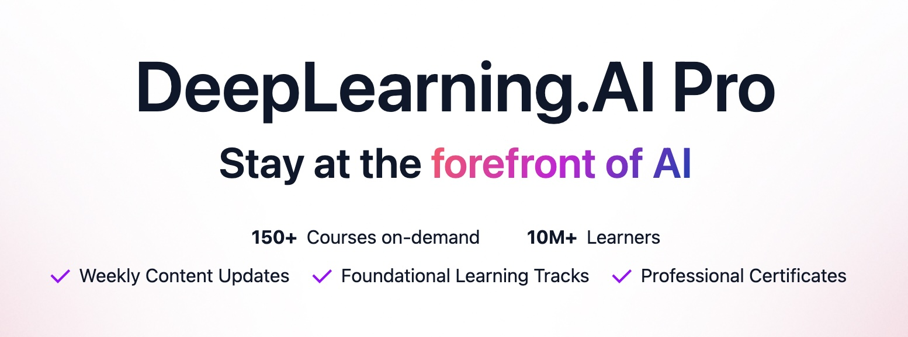
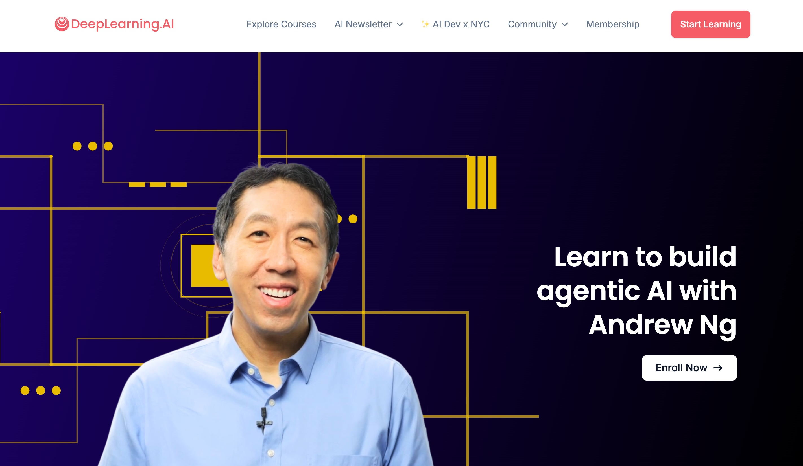

안녕하세요, Joe! 입니다.  
'휴먼의 AI학습' 시리즈 그 두번째는 여러분이 잘 아시는 DeepLearning.ai 사이트를 소개합니다. 최근에 구독형 서비스(pro)를 오픈하면서 화제가 되기도 했지요. 2025년 11월 버전 기준으로 정리해 보도록 하겠습니다. 

# (1) https://www.deeplearning.ai/ (딥러닝 에이아이의 주요 특징은?)

DeepLearning.ai 는 코세라를 창립한 스탠포드 출신의 AI 4대천왕 앤드류 응이 설립한 비영리 AI 기관입니다.  
교육 및 AI 기술 공유에 특화되어 있으며(앤드류 응이 넓은 의미에서 AI Evangelist 역할을 한다고 볼 수도 있겠네요!) 양질의 무료 교육 콘텐트를 제공합니다. 

(사이트 최상단 배너에서 DeepLearning.AI Pro 구독 프로그램을 소개하고 있음) 

(앤드류 응의 사진과 그의 강의 'Agentic AI' 를 소개하고 있음) 

## 특징: 'Industrial & Practical MOOC'

제가 본 DeepLearning.ai는 마치 실무형 AI 코세라(또는 유다시티)의 느낌이었습니다. 

* Coursera가 스탠포드 등 주요 대학의 우수한 교육 VOD들을 모아서 구성한 Academic MOOC(Massive Online Open Course)였다면, 
* DeepLearning.ai는 OpenAI, Anthropic, Google, LangChain 등 유명 AI 회사들의 엔지니어가 강의하는 Industrial & Practical MOOC라고 할 수 있겠습니다.  
(우리나라에서는 유일하게 Upstage에서 올린 강의가 있다고 합니다)

## 실습 편의성도 코세라 등 일반 MOOC보다 높은 편. 

* 특히 1시간 분량의 무료 강의인 Short Course의 비중을 높였고, 
* VOD와 Jupyter Notebook 스타일의 실습이 내장되어 있어 편리하게 실습을 해볼 수 있습니다. 

## 한국어 지원은 살짝 아쉬움. 

* 대부분 영어 콘텐트와 자막으로 이루어져 있었습니다. 
* 일부 과정(예: ChatGPT Prompt Engineering for Developers) VOD에서는 영어/한국어/일본어 자막이 지원이 되고 있었습니다.  
(Coursera의 GTC(자막 봉사 커뮤니티, 지금은 depricated) 생각이 문득 드는군요. 그때만 해도 NLP 자막/기계번역은 난제 중 하나로 꼽혔는데 지금의 생성형 AI에게는 너무나 쉬운 것이 되어버렸다는...) 

---

# (2) https://www.deeplearning.ai/courses/ (코스는 어떻게 구성되어 있나요?) 

코스는 크게 다음 3가지로 나눌 수 있습니다(Course Type)

* Short Course: 전체 VOD 약 1시간 내외의 단기 강좌. 데모 및 실습 코드를 제공 (Free 수강 가능) 
* Course: Pro 가입 후 수강 가능(하다고 되어 있으나 실제로는 일부 맛보기 가능)
* Professional Certificate: 코세라의 Specialization과 유사한 구성. 

레벨은 1) Beginner와 2) Intermediate(중급) 2단계로 나눠져 있었구요 

인기있는 토픽(Popular Topic)으로 과정을 찾을 수 있도록 편리하게 정리가 되어 있었습니다. 

* Agents
* AI Coding
* AI Frameworks
* AI in Software Development
* AI Safety 
* (그밖에도 많이 있음)

혹시나 해서 검색해 봤는데, 놀랍게도 클로드코드 short course도 있네요! :) 

위 토픽 외에도 **주요 키워드별로 실제 검색해서 나온 교육과정**들을 아래 표로 정리해 보았습니다. 

## (1) ChatGPT 

| 교육과정 | URL |
|-------------|-----------|
| **ChatGPT Prompt Engineering for Developers** | https://www.deeplearning.ai/short-courses/chatgpt-prompt-engineering-for-developers/ |
| **Building Systems with the ChatGPT API** | https://www.deeplearning.ai/short-courses/building-systems-with-chatgpt/ | 

## (2) AI Coding / Programming 

| 교육과정                                                                  | URL                                                                                                                                                                                              |
| --------------------------------------------------------------------- | ------------------------------------------------------------------------------------------------------------------------------------------------------------------------------------------------ |
| **Claude Code: A Highly Agentic Coding Assistant**                    | [https://www.deeplearning.ai/short-courses/claude-code-a-highly-agentic-coding-assistant/](https://www.deeplearning.ai/short-courses/claude-code-a-highly-agentic-coding-assistant/)             |
| **Collaborative Writing and Coding with OpenAI Canvas**               | [https://www.deeplearning.ai/short-courses/collaborative-writing-and-coding-with-openai-canvas/](https://www.deeplearning.ai/short-courses/collaborative-writing-and-coding-with-openai-canvas/) |
| **Generative AI for Software Development (Professional Certificate)** | [https://www.deeplearning.ai/courses/generative-ai-for-software-development/](https://www.deeplearning.ai/courses/generative-ai-for-software-development/)                                       |
| **Jupyter AI: AI Coding in Notebooks**                                | [https://www.deeplearning.ai/short-courses/jupyter-ai-coding-in-notebooks/](https://www.deeplearning.ai/short-courses/jupyter-ai-coding-in-notebooks/)                                           |
| **MCP: Build Rich-Context AI Apps with Anthropic**                    | [https://www.deeplearning.ai/short-courses/mcp-build-rich-context-ai-apps-with-anthropic/](https://www.deeplearning.ai/short-courses/mcp-build-rich-context-ai-apps-with-anthropic/)             |
| **Pair Programming with a Large Language Model**                      | [https://www.deeplearning.ai/short-courses/pair-programming-llm/](https://www.deeplearning.ai/short-courses/pair-programming-llm/)                                                               |
| **Vibe Coding 101 with Replit**                                       | [https://www.deeplearning.ai/short-courses/vibe-coding-101-with-replit/](https://www.deeplearning.ai/short-courses/vibe-coding-101-with-replit/)                                                 |

## (3) Agents / Coding Agents

| 교육과정                                                       | URL                                                                                                                                                                                                |
| ---------------------------------------------------------- | -------------------------------------------------------------------------------------------------------------------------------------------------------------------------------------------------- |
| **Agentic AI by Andrew Ng**                                | [https://www.deeplearning.ai/courses/agentic-ai/](https://www.deeplearning.ai/courses/agentic-ai/)                                                                                                 |
| **AI Agents in LangGraph**                                 | [https://www.deeplearning.ai/short-courses/ai-agents-in-langgraph/](https://www.deeplearning.ai/short-courses/ai-agents-in-langgraph/)                                                             |
| **Build AI Apps with MCP Servers: Working with Box Files** | [https://www.deeplearning.ai/short-courses/build-ai-apps-with-mcp-server-working-with-box-files/](https://www.deeplearning.ai/short-courses/build-ai-apps-with-mcp-server-working-with-box-files/) |
| **Build Apps with Windsurf’s AI Coding Agents**            | [https://www.deeplearning.ai/short-courses/build-apps-with-windsurfs-ai-coding-agents/](https://www.deeplearning.ai/short-courses/build-apps-with-windsurfs-ai-coding-agents/)                     |
| **Building AI Browser Agents**                             | [https://www.deeplearning.ai/short-courses/building-ai-browser-agents/](https://www.deeplearning.ai/short-courses/building-ai-browser-agents/)                                                     |
| **Building Code Agents with Hugging Face smolagents**      | [https://www.deeplearning.ai/short-courses/building-code-agents-with-hugging-face-smolagents/](https://www.deeplearning.ai/short-courses/building-code-agents-with-hugging-face-smolagents/)       |
| **Building Live Voice Agents with Google’s ADK**           | [https://www.deeplearning.ai/short-courses/building-live-voice-agents-with-googles-adk/](https://www.deeplearning.ai/short-courses/building-live-voice-agents-with-googles-adk/)                   |
| **Evaluating AI Agents**                                   | [https://www.deeplearning.ai/short-courses/evaluating-ai-agents/](https://www.deeplearning.ai/short-courses/evaluating-ai-agents/)                                                                 |
| **Multi AI Agent Systems with crewAI**                     | [https://www.deeplearning.ai/short-courses/multi-ai-agent-systems-with-crewai/](https://www.deeplearning.ai/short-courses/multi-ai-agent-systems-with-crewai/)                                     |

## (4) LLM

| 교육과정                                          | URL                                                                                                                                                                          |
| --------------------------------------------- | ---------------------------------------------------------------------------------------------------------------------------------------------------------------------------- |
| **Improving Accuracy of LLM Applications**    | [https://www.deeplearning.ai/short-courses/improving-accuracy-of-llm-applications/](https://www.deeplearning.ai/short-courses/improving-accuracy-of-llm-applications/)       |
| **LangChain for LLM Application Development** | [https://www.deeplearning.ai/short-courses/langchain-for-llm-application-development/](https://www.deeplearning.ai/short-courses/langchain-for-llm-application-development/) |
| **Pretraining LLMs**                          | [https://www.deeplearning.ai/short-courses/pretraining-llms/](https://www.deeplearning.ai/short-courses/pretraining-llms/)                                                   |

## (5) AI

| 교육과정                                        | URL                                                                                                                                              |
| ------------------------------------------- | ------------------------------------------------------------------------------------------------------------------------------------------------ |
| **AI Python for Beginners by Andrew Ng**    | [https://www.deeplearning.ai/short-courses/ai-python-for-beginners/](https://www.deeplearning.ai/short-courses/ai-python-for-beginners/)         |
| **Building an AI-Powered Game**             | [https://www.deeplearning.ai/short-courses/building-an-ai-powered-game/](https://www.deeplearning.ai/short-courses/building-an-ai-powered-game/) |
| **Generative AI for Everyone by Andrew Ng** | [https://www.deeplearning.ai/courses/generative-ai-for-everyone/](https://www.deeplearning.ai/courses/generative-ai-for-everyone/)               |

