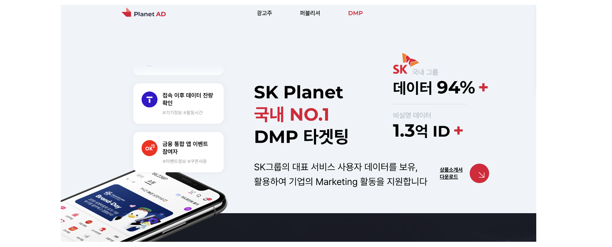
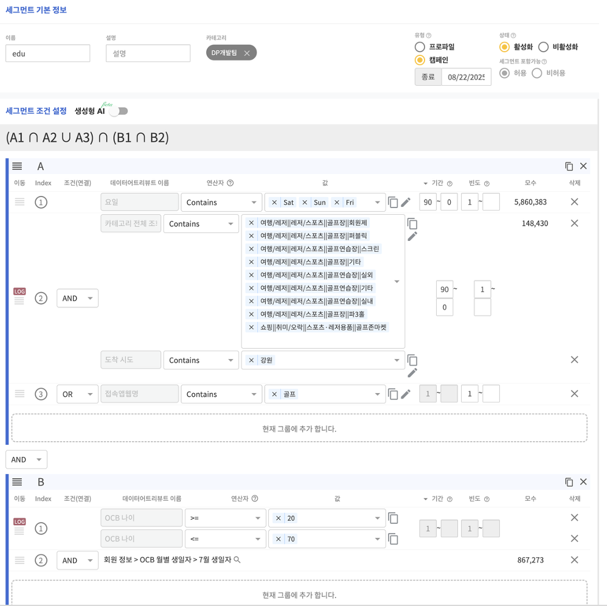
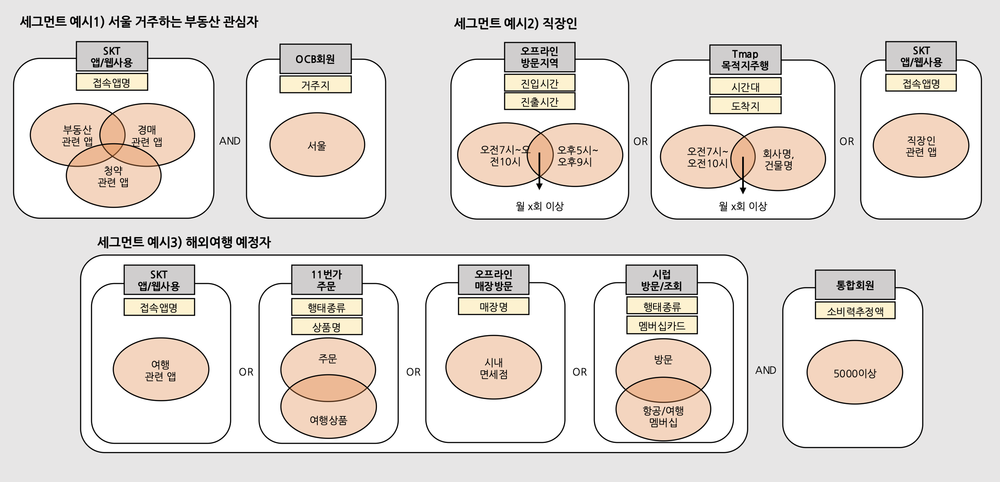
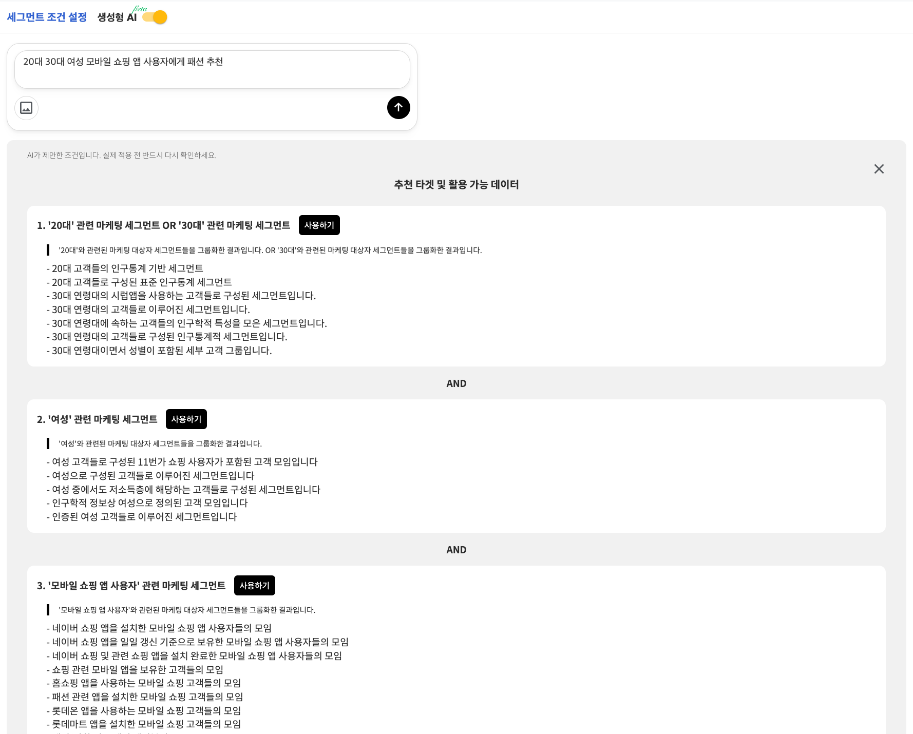
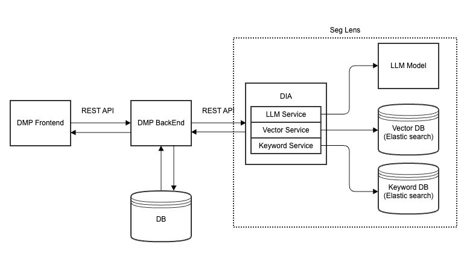
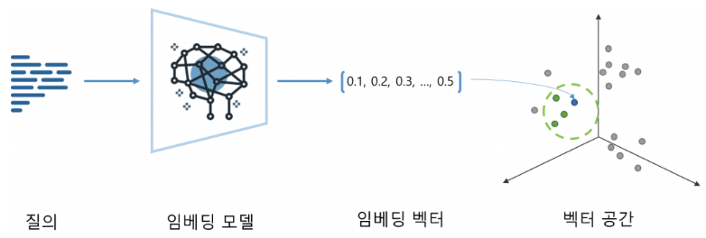
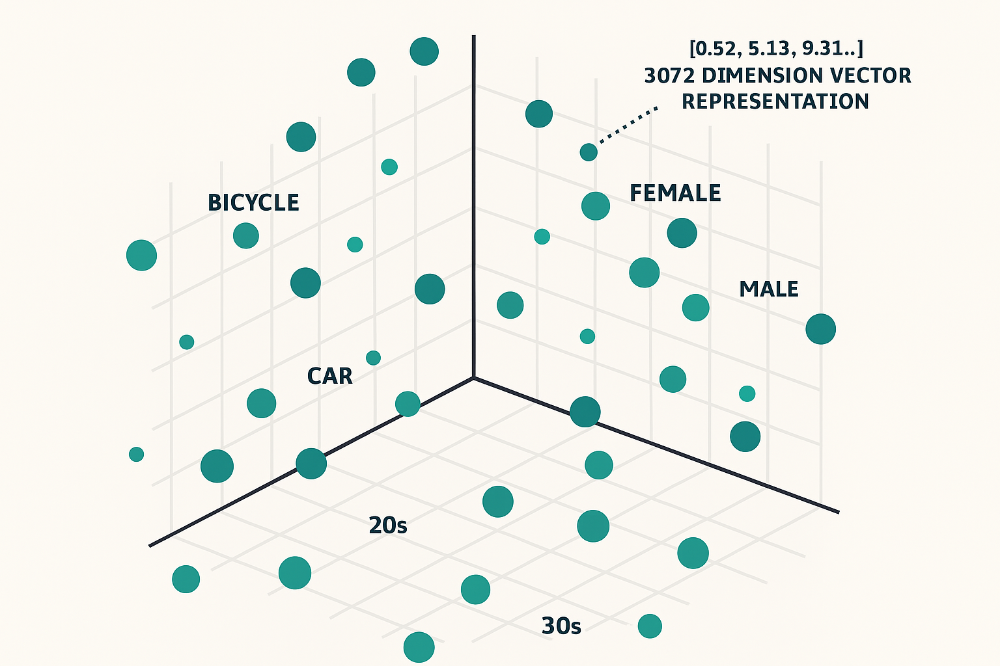
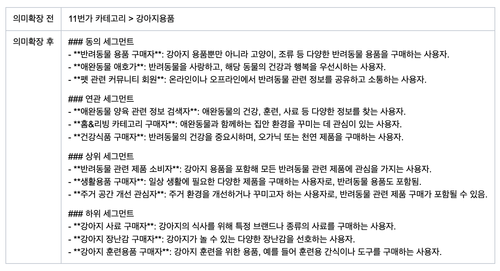
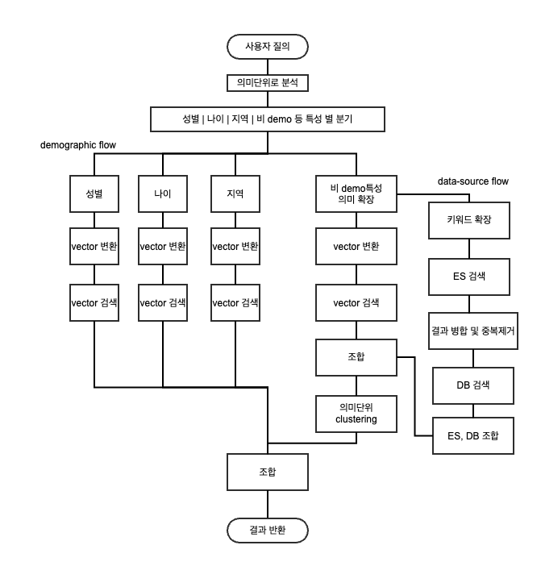
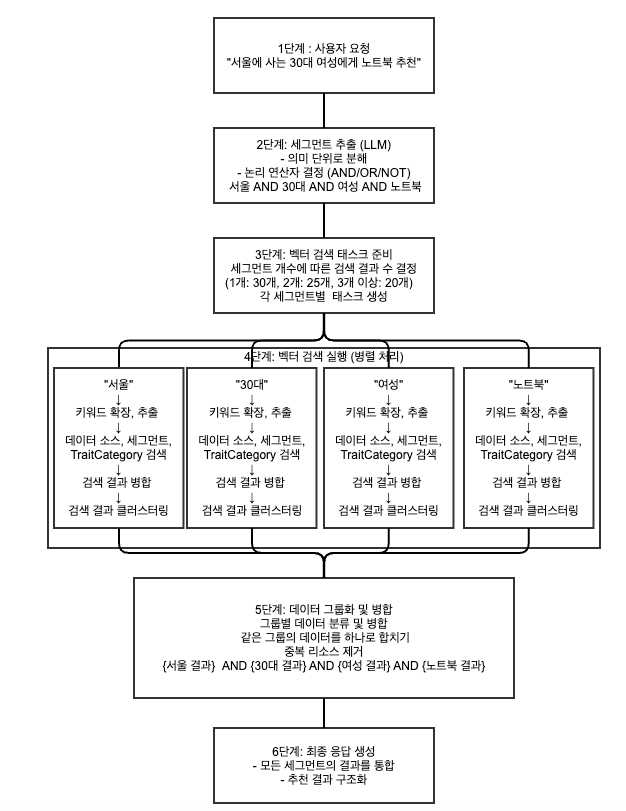

이 글은 SK플래닛 **LLM 기반 DMP(Data Management Platform)인 "Seg Lens" 시스템** 개발 사례를 소개합니다. 
<br/><br/>
Seg Lens는 **마케터의 의도를 해석하고, 방대한 데이터 속에서 최적의 타겟 세그먼트를 찾아주는 지능형 마케팅 툴**로, **Segment + Lens**의 합성어입니다. 여기서 Segment(세그먼트)는 DMP/CDP에서 **마케팅 타겟**을 의미하며, Lens(렌즈)는 **마케터가 데이터를 바라보는 관점**을 의미합니다. 이번에 DMP에 LLM을 도입한 후 마케터의 관점을 더욱 반영하여 데이터를 해석하고, 의도를 바로 실행 가능한 세그먼트로 변환할 수 있게 되었습니다. 
<br/><br/>
이 글의 주요 내용은 다음과 같습니다. 

* DMP란 무엇인가요? 
* 기존 DMP의 세그먼트 생성 방식 및 한계 
* DMP에 LLM 도입하기: 의미기반 탐색과 Seg Lens 
* Seg Lens의 주요 기능 및 전체 구성도
* 벡터 DB 구축: Semantic Expansion, LLM 도입, 데이터 접근 제어
* DIA(DMP Intelligence API)란 무엇인가요? 
* DIA 구조 및 서비스 플로우 
* 맺음말 

---
# DMP란 무엇인가요? 

**SK플래닛 데이터서비스개발팀**에서는 마케터들이 데이터를 기반으로 더 효율적인 캠페인을 운영하는 **DMP(Data Management Platform)와 CDP(Customer Data Platform)** 두 플랫폼을 함께 개발 및 운영하고 있습니다.<br/>
(참고: [SK플래닛 DMP 소개 페이지](https://alp.planetad.co.kr/pages/dmp.html))


<br/>
DMP와 CDP는 다양한 데이터 소스(웹/앱 로그, 광고 반응 데이터, 구매 이력 등)로부터 고객 행동 정보를 수집하고, 이를 바탕으로 특정 조건에 맞는 고객군(세그먼트)을 만들어 마케팅에 활용할 수 있도록 돕는 **데이터 마케팅 플랫폼**입니다. 즉,<br/>


| “원하는 조건을 입력하면, 그에 맞는 고객을 찾아주는 똑똑한 데이터 관리 시스템”


이라고 할 수 있습니다.<br/>

---
# 기존 DMP의 세그먼트 생성 방식 

기존의 DMP에서는 마케터가 직접 데이터 조건을 입력해 세그먼트를 구성해야 했습니다.

(SKP DMP 조건 생성 화면)

예를 들어, <br/>

* 최근 7일 이내 앱을 방문한 사용자
* 장바구니에 상품을 넣었지만 구매하지 않은 사용자
* 30대 여성 중 특정 카테고리를 자주 조회한 고객

이러한 조건을 설정하려면 마케터가 데이터 구조를 이해하고 논리적으로 조건를 구성할 줄 알아야 했습니다. <br/>
아무래도 비전공자나 실무 마케터에게는 진입 장벽이 높을 수밖에 없었습니다.


(조건 예시)


---
# 기존 DMP의 한계 (마케터 관점)

마케터들이 실제로 겪던 주요 문제점은 러닝커브 외에도 다음과 같았습니다. 

## 1. 시간과 노력의 과다 소모 

세그먼트 조건을 수동으로 설정해야 했으므로, 심지어 한 번의 세그먼트 생성에 평균 2~3시간이 소요되기도 했습니다. 그만큼 휴먼 에러 발생 가능성도 높았습니다.

## 2. 방대한 데이터지만 낮은 접근성 

* DMP: 세그먼트 8,760건 / 트레잇 카테고리 57,829건
* CDP: 세그먼트 5,090건 / 트레잇 카테고리 26,873건

데이터는 많지만 필요한 정보를 빠르게 찾는 효율은 매우 낮았습니다.<br/>
결국 “데이터는 많지만 활용성이 떨어지는” 역설적인 상황이 자주 발생했습니다.<br/>

## 3. 직관적 탐색의 어려움

‘유사’, ‘관련’ 조건을 직관적으로 찾기 어렵고, 키워드 기반 검색만으로는 의도한 조합을 떠올리기가 쉽지 않았습니다.

## 4. 비효율적인 리소스 구조

세그먼트 기획보다 데이터 탐색에 더 많은 리소스가 쓰이는 구조였습니다.<br/>
결국 마케팅 전략 수립보다 쿼리 작성과 검색에 더 많은 시간이 소모되었습니다.<br/><br/>

---
# 복잡한 데이터 환경이 문제를 가중시킨다

DMP/CDP는 다양한 회사, 다양한 서비스 등의 고객 행태 데이터를 수십 개의 데이터 소스에서 수집하고 사용합니다.<br/>
이 과정에서 세그먼트, 트레잇, 데이터 소스 속성(Attribute) 등이 얽히며 데이터 구조는 점점 더 복잡해집니다.<br/>
결국 마케터가 이 모든 데이터를 완벽히 이해하고 활용하는 것은 현실적으로 불가능했으며, 그 결과 다음과 같은 문제가 반복됩니다.

* 수동 세그먼트 설정에 과도한 시간 소요
* 숨겨진 데이터의 미활용
* 놓치는 타겟 조합 발생

---
# 그래서 필요한 것은? 

이제는 더 이상 검색창에 조건을 하나하나 입력하는 방식으로는 한계가 분명합니다. 마케터가 자연스럽게 말하듯 입력하면, 시스템이 그 의도를 이해하고 세그먼트를 찾아주는 방식, 바로 **LLM 기반 자연어 접근 방식**이 필요했습니다.<br/>
<br/>

---

# 왜 LLM인가?

기존 DMP는 데이터는 많지만, 마케터의 의도(Intention) 를 이해하지 못했습니다. <br/>
예를 들어 마케터가<br/>

| “서울에 사는 30대 혹은 40대 여성에게 노트북 추천 캠페인을 하고 싶어요.”

라고 입력한다고 해 봅시다.<br/>

기존 DMP는 이 문장을 이해하지 못합니다.<br/>
마케터는 결국 아래처럼 조건을 **일일이** 입력해야 했습니다:<br/>

* 나이: 30~49
* 성별: 여성
* 지역: 서울
* 관심 제품: 노트북

하지만 LLM(Large Language Model) 은 문장의 의미를 파악하고,<br/>
그 안의 논리적 관계(AND, OR, NOT 등)를 **모델이 스스로 해석해 구조화할 수 있습니다.** <br/>
<br/>
**즉, 마케터의 “생각”을 바로 “데이터 조건”으로 그대로 바꿀 수 있는 길이 열린 것입니다.**

---
# 의미 기반 탐색(Semantic Search)의 필요성

마케터가 데이터를 다룰 때 필요한 것은 단순한 키워드 검색이 아닙니다.<br/>
그들이 원하는 것은 **의미 기반 탐색(semantic search)** 입니다.<br/>
<br/>
예를 들어,<br/>

| “서울 지역의 고가 IT제품 관심 고객”

이라는 의도에는 단순히 ‘서울’, ‘IT’, ‘고가’ 키워드만 있는 게 아닙니다.<br/>
‘구매력’, ‘브랜드 선호도’, ‘최근 검색 패턴’ 같은 맥락적 의미가 담겨 있죠.<br/>
<br/>
마케터는 자연어로 의도를 설명하기만 하면,<br/>
LLM이 이를 구조화된 데이터 조건으로 변환하는 방식이 필요하였습니다. <br/>
<br/>

---
# Seg Lens (revisited)

이제 Seg Lens를 다시 한번 설명드리면, <br/>

“마케터의 의도를 해석하고, 방대한 데이터 속에서 최적의 타겟 세그먼트를 찾아주는 지능형 마케팅 툴" 입니다. <br/>
Seg Lens는 Segment + Lens의 합성어로, 여기서 Segment(세그먼트)는 DMP/CDP에서 마케팅 타겟을 의미하며, Lens(렌즈)는 마케터가 데이터를 바라보는 관점을 의미합니다.<br/>
<br/>
즉, Seg Lens는 **LLM 기술을 활용해서 마케터의 관점에서 데이터를 해석하고, 의도를 바로 실행 가능한 세그먼트로 변환하는 시스템**입니다.<br/>

---
# Seg Lens의 주요 기능


(DMP/CDP Seg Lens 화면)

Seg Lens는 LLM의 의미 이해 능력을 중심으로 다음과 같은 핵심 기능들을 제공합니다.

## 1. 자연어 세그먼트 추출

마케터의 자연어 질의를 분석해 세그먼트 조건으로 구조화합니다. <br/>
복잡한 논리(AND, OR, NOT)도 자동 반영해 줍니다.<br/>

## 2. 이미지 분석 기능

이미지 업로드를 통해 텍스트 + 시각 정보를 결합한 분석이 가능합니다.<br/>
예를 들어 “이 제품에 관심 있을 고객을 찾아줘.”라고 입력하면, LLM이 이미지의 맥락을 이해하고 고객군을 추천합니다.<br/>

## 3. 키워드 확장 및 유사 세그먼트 제안

입력된 세그먼트를 기반으로 관련 키워드나 유사 고객군을 자동 제안합니다.<br/>
즉, 마케터가 미처 생각하지 못한 연관 세그먼트를 발견할 수 있습니다.<br/>

## 4. 벡터 검색 기반 의미 탐색

LLM이 생성한 벡터 임베딩(embedding) 을 활용해, 의미적으로 유사한 세그먼트를 빠르게 탐색합니다.<br/>
단순 키워드 일치가 아닌, 맥락적 유사성(Contextual Similarity)에 기반한 탐색이 가능합니다.<br/>

## 5. 결과 필터링

마케팅 목적(예: 리타겟팅, 신규 유입, 브랜드 인지도 강화 등)에 따라 LLM이 결과를 재구성하고, 가장 적합한 세그먼트만 선별해 제공합니다.

---
# Seg Lens 전체 구성도



Seg Lens는 아래와 같은 컴포넌트로 구성되어 있습니다.

(1) 벡터 데이터베이스(Vector DB)
* DMP/CDP의 데이터 조건을 embedding하여 사용자 질의와 유사한 조건을 검색하기 위한 DB
<br/>

(2) DIA* 모듈 
* LLM Service: OpenAI GPT-4 기반 세그먼트 추출
* Vector Service: 3,000 차원의 Vector DB 유사도 기반 검색
* Keyword Service: 정확한 매칭 및 스코어링

(* DIA: DMP Intelligence API, 이후 설명합니다)

---
# 벡터 데이터베이스(Vector Database)란?

벡터 데이터베이스(이하 벡터DB)는 고차원 벡터 데이터를 효율적으로 저장하고 검색할 수 있는 특화된 데이터베이스입니다.<br/>
기존의 관계형 데이터베이스가 정확한 키워드 매칭에 최적화되어 있다면, 벡터DB는 맥락적 유사도를 기반으로 한 검색에 특화되어 있습니다.<br/>
<br/>

---
# 벡터 임베딩(Vector Embedding)의 개념과 작동 원리

벡터 임베딩(Vector Embedding)은 비정형 데이터(텍스트, 이미지, 음성 등)를 정형화된 숫자의 배열 형태로 변환하는 과정입니다. 
이 과정을 통해 컴퓨터가 이해할 수 있는 수학적 표현으로 데이터를 변환합니다. <br/>
벡터 임베딩의 작동원리에 대해 간단히 살펴보면 다음과 같습니다. <br/>

(표)
| 구분         | 내용                   | 
|-------------|-----------------------|
| 원본 텍스트    | 자전거에 관심있는 20대 여성 | 
| 임베딩된 텍스트 | [0.4, 0.6, -0.3, 0.8, -0.2, 0.1, 0.9, -0.4, ...] | 

이 문장은 임베딩 모델을 통해 다차원의 벡터로 변환됩니다. 이 벡터의 각 숫자는 문장의 의미, 맥락, 주제 등을 수학적으로 표현한 값입니다.<br/>
즉, 언뜻 보기에 단순한 숫자 배열이지만, 벡터 공간에서는 문장의 의미적 위치를 나타내는 “좌표”가 됩니다.<br/>



<br/>
임베딩의 핵심은 “의미가 비슷한 문장은 벡터 공간에서도 서로 가깝게 위치한다”는 것입니다.<br/>
<br/><br/>
예를 들어 아래와 같은 문장들을 임베딩 벡터로 변환했다고 가정하겠습니다.<br/>

* 유사_텍스트1 = "사이클링을 좋아하는 젊은 여성"  # → 유사한 벡터값 <br/>
* 유사_텍스트2 = "자전거 타기를 즐기는 20대"      # → 유사한 벡터값 <br/>
* 유사_텍스트3 = "자동차에 관심있는 30대 남성"    # → 다른 벡터값 <br/>

<br/>
유사_텍스트1과 유사_텍스트2는 원본 문장 “자전거에 관심있는 20대 여성”과 유사한 의미를 가지고 있으므로, 벡터 공간에서도 서로 가까운 위치에 존재합니다. 반면 유사_텍스트3은 “자동차”와 “남성”, “30대” 등 다른 주제를 포함하고 있기 때문에 원본 문장과의 벡터 거리가 멀어집니다.<br/>
<br/>
이처럼 임베딩은 단어 하나하나를 따지는 것이 아니라, 문장의 전체적인 의미와 맥락을 숫자로 표현함으로써 <br/>
의미 기반 검색(Semantic Search), 추천 시스템, 유사도 분석 등에 활용됩니다.<br/><br/>



DMP/CDP에서는 **Elasticsearch의 Dense Vector 기능**을 활용하여 의미적 유사도 기반 검색을 구현했습니다.

---
# 벡터 데이터베이스(Vector Database)의 검색 방식

벡터 DB에서 검색에는 **코사인 유사도(Cosine Similarity)** 를 사용합니다. <br/>
이는 두 벡터가 이루는 각도를 기준으로 의미적 유사도를 측정하는 방법으로, 벡터의 크기(길이)에 영향을 받지 않으면서 **방향**만으로 의미의 유사함을 비교할 수 있습니다. <br/>
<br/>
Elasticsearch는 이 코사인 유사도를 활용해 쿼리 벡터와 인덱스에 저장된 벡터들 사이의 유사도를 계산하고, <br/>
**Top-K 검색(Top-K Retrieval)** 방식으로 가장 유사한 K개의 결과를 빠르게 반환합니다. <br/>
<br/>
이 문장은 임베딩 모델을 통해 다차원의 벡터로 변환됩니다. 이 벡터의 각 숫자는 문장의 의미, 맥락, 주제 등을 수학적으로 표현한 값입니다. 즉, 언뜻 보기에 단순한 숫자 배열이지만, 벡터 공간에서는 문장의 의미적 위치를 나타내는 **좌표**가 됩니다.<br/>

```
"knn": {
  "field": "my_vector", #vector가 저장된 필드 명
  "query_vector": query_vector, # 검색하고자 하는 임베딩 백터
  "k": k, # 반환할 이웃의 목표 개수
  "num_candidates": self.MAX_CANDIDATES, # 탐색할 후보개수
  "filter": { ... } # 검색에 추가 조건 
}
```

---
# Seg Lens 벡터 DB 구축(1) - Semantic Expansion으로 벡터검색 정확도 높이기

일반적으로 벡터 검색(Vector Search)은 사용자가 입력한 키워드를 임베딩하여 데이터와의 유사도를 계산합니다. 하지만 단순한 키워드만 임베딩할 경우, 의미적인 맥락(context)이 충분히 반영되지 않아 정확도가 떨어질 수 있습니다.
<br/>
예를 들어, “은행”이라는 단어를 그대로 임베딩하면 기계는 금융기관인지 은행나무인지 잘 구분하지 못합니다. 이런 문제는 짧은 키워드에 문맥 정보가 부족하기 때문에 발생합니다.<br/>
<br/>
최근의 임베딩 모델은 대부분 문장 단위 또는 청크(chunk) 단위로 학습되어 있습니다. 문맥이 풍부한 문장을 임베딩할수록 모델이 의미를 더 잘 파악하며, RAG(Retrieval-Augmented Generation) 성능 또한 향상됩니다.<br/>
그래서 최신 DMP/CDP 시스템에서는 단순 키워드 기반의 벡터화 대신, **의미 확장(Semantic Expansion) 단계**를 추가합니다. 사용자의 입력을 문장 단위로 확장한 후 임베딩함으로써, **훨씬 더 정확한 검색과 추천이 가능**하게 되었습니다.<br/>



---
# Seg Lens 벡터 DB 구축(2) - 비용 및 성능을 고려한 LLM 모델 사용 (실시간 vs BATCH API)


DMP/CDP 에서는 5만 개가 넘는 항목에 대해 의미확장과 embedding을 각각 수행합니다. 최신 데이터를 실시간으로 요구되지 않는 상황에서는 batch API 를 사용하는것이 시간과 비용을 아끼는 방법이 될 수 있습니다.<br/>

## 1. 비용 효율성 

50,000개의 세그먼트를 처리한다고 가정해보겠습니다.<br/>


**1) 실시간 API 사용 시**
- 비용: $50 (50,000 × 500 tokens × $0.002 / 1,000)
- 처리 시간: 30-60분 (네트워크 지연 + 재시도 고려)
- API 호출 제한: 3,500 requests/minute


**2) Batch API 사용 시**
- 비용: $25 **=> 50% 비용 절감**
- 처리 시간: 2-4시간 **=> 일관성 유지됨**
- 사용자 개입: 불필요 **=> 완전 자동화**

<br/>

연간 약 $9,000의 **비용 절감 효과**까지 얻을 수 있었습니다.<br/>
<br/>

## 2. 안정성과 신뢰성

실시간 API를 사용할 때 가장 큰 문제는 Rate Limit과 네트워크 불안정성이었습니다.<br/>

```
Error: Rate limit exceeded. Try again in 60 seconds.
Error: Too many requests. Please slow down.
Error: API quota exceeded for the day.
```

이러한 오류들이 발생하면 전체 프로세스가 중단되고, 복잡한 재시도 로직을 구현해야 했습니다.<br/>
반면 Batch API는 OpenAI 서버에서 자동으로 부하를 분산하므로, 개별 요청이 실패하더라도 **전체에는 영향을 주지 않는다**는 안정성 측면의 장점을 가지고 있습니다. <br/>
<br/>

## 3. 운영 효율성

실시간 API는 24시간 모니터링이 필요하였지만, **Batch API는 엔지니어에게 모니터링 피로도를 상대적으로 줄여 주었습니다.** 그리고 한국시간의 업무시간에서는 Batch API가 24시간까지 걸리지 않고, 대부분 1-2시간 내로 결과를 전달해주어서 모니터링하기 용이한 부분이 있었습니다(정형화할 수는 없지만 북미 사용자의 사용량이 많은 시간대를 피하는 것도 하나의 팁이 될 수 있습니다).<br/><br/>
참고로 Batch API의 진행 상태는 각 LLM 서비스의 대시보드에서도 접근하여 모니터링할 수 있습니다. 
<br/>

---

# Seg Lens 벡터 DB 구축 (3) - Vector DB 생성 프로세스

7단계 자동화된 파이프라인을 통해 입력된 메타 정보를 확인 및 임베딩 후, Elasticsearch에 bulk로 업로드합니다. <br/>

```Python
graph TD
    A[1. 서비스 DB에서 세그먼트/Trait 조건 추출] --> B[2. 의미 확장을 위한 LLM 배치 요청문 생성]
    B --> C[3. LLM에 의미확장용 Batch API 요청과 응답]
    C --> D[4. 임베딩 벡터 요청문 생성]
    D --> E[5. 임베딩 벡터 생성용 Batch API 요청과 응답]
    E --> F[6. Elasticsearch 데이터 변환]
    F --> G[7. 임베딩 벡터 저장]
```

각 프로세스별 예시는 다음과 같습니다. 

## 1. DMP/CDP의 세그먼트/Trait 조건 추출 예시

```
s_10014,segment,표준 세그먼트 > 쇼핑 > 조회상품 (90일) > 자동차 > SUV,SUV,SUV  
s_10015,segment,내부용 세그먼트 > (구)쇼핑-브랜드 세그먼트 > (구)조회상품 > 브랜드 > 차량용품 > 벤츠,벤츠,Benz...
``` 

## 2. 의미 확장을 위한 LLM Prompt 예시

```
‘표준 세그먼트 > 쇼핑 > 조회상품 (90일) > 자동차 > 소형차’는 세그먼트입니다. 
이 세그먼트를 DMP 시스템의 조건으로 활용하거나, 타겟 광고/추천을 위한 임베딩 벡터로 활용하려고 합니다. 
단, 세그먼트의 내용이 지역명, 성별, 연령대일 경우 동의 세그먼트로만 확장해 주세요. 
이 세그먼트의 의미를 다음과 같은 방식으로 확장해 주세요: 
- 동의 세그먼트 (유사한 사용자 행동/관심) 
- 상위 세그먼트 (더 넓은 관심 또는 범주) 
- 하위 세그먼트 (더 구체적인 조건의 사용자 집단) 
- 연관 세그먼트 (다른 플랫폼이나 행동에서 의미적으로 연관 있는 세그먼트) 
결과는 동의, 상위, 하위, 연관 세그먼트만 출력되며 자연어로 이루어져 있습니다.
```

## 3. LLM 의미확장 API 결과물 

```
동의 세그먼트
	소형차에 관심이 있는 사용자 중 최근 90일 이내에 자동차 관련 정보를 조회한 사용자 집단입니다.
	이들은 소형차 구매 의사가 높거나 소형차에 대한 정보 검색이 활발한 사용자들입니다.

상위 세그먼트
	자동차에 관심이 있는 사용자, 즉 모든 차량 유형에 대한 정보를 검색하거나
	관련 콘텐츠를 소비하는 사용자 집단입니다.
	이 범주에는 중형차, 대형차, SUV 등 다양한 차량 유형에 관심을 가진 사용자들이 포함됩니다.

하위 세그먼트
	특정 브랜드의 소형차를 검색한 사용자, 예를 들어 현대, 기아, 토요타의 소형차에 대한 정보를 찾는 사용자 집단입니다.
	이들은 특정 브랜드에 대한 선호가 뚜렷한 소비자들입니다.

연관 세그먼트
	자동차 관련 액세서리나 부품에 관심이 있는 사용자 집단입니다.
	이들은 소형차뿐만 아니라 관련된 차량 관리 용품이나 자동차 보험, 정비 서비스 등에도 관심을 가질 가능성이 높은 사용자들입니다.
```

## 4. LLM Embedding Vector 추출 (3,072차원 예시)

```Python
"embedding": [0.00021520282, -0.02277509, -0.014803194, -0.02186752, 0.02352322, -0.0014579368,  
0.016005112, -0.02368266, 0.009247398, -0.026368573, -0.0055098054, 0.0035290963,  
-0.015379624, 0.033653658, 0.0376764, 0.017121177, -0.015772087, -0.01713344,  
0.06882811, 0.0336046, 0.0010516768, 0.021744875, -0.01782025, -0.031642288,  
-0.025044013, -0.013306932, -0.014337146, 0.042778414, 0.008161994, 0.04368598,  
-0.009235133, -0.046923798, 0.028306358, ...]
```

## 5. Elasticsearch에 Embedding Vector 적재

생성된 임베딩 벡터는 Elasticsearch의 dense_vector 필드 형태로 저장됩니다. dense_vector는 고정된 차원의 실수(float) 배열을 효율적으로 저장하고, 유사도 기반 검색을 지원하고자 설계된 특수한 필드 타입입니다.<br/><br/>
이렇게 저장된 벡터들은 단순한 텍스트 검색이 아닌 의미 기반 검색을 가능하게 합니다. 즉, 사용자가 입력한 문장과 의미적으로 비슷한 문장을 찾아 주는 구조입니다. 
<br/>
<br/>

---
# Seg Lens 벡터 DB 구축(4) - 서비스별·권한별 데이터 접근 제어 방안

DMP(Data Management Platform)와 CDP(Customer Data Platform)에서는 **동일한 검색 요청이라도, 사이트나 사용자 권한 수준에 따라 접근 가능한 자원이 달라져야 합니다.** 관리자가 사용하는 운영 콘솔(Admin Console) 및 각 파트너·브랜드 사이트의 접근 범위는 명확히 구분되어야 하며, 이는 단순 보안이 아닌 비즈니스 로직 차원의 필수 요구사항입니다. <br/>
<br/>
예를 들어, DMP에서는 세그먼트(Segment), 트레잇(Trait), 데이터 소스(Data Source)의 공유 상태에 따라 검색 가능한 데이터 범위가 달라집니다. SK플래닛-DMP에서는 자체 수집 데이터와 파생 세그먼트까지 조회할 수 있지만, SK브로드밴드-DMP에서는 자사 데이터만 접근 가능해야 합니다. 이를 위해 검색 쿼리의 filter 영역에 사이트별 접근 가능한 자원 정보를 반영했습니다.<br/>
접근 제어 정보는 site_resource_index에 저장되며, 검색 시점에 해당 사이트의 resource_id 목록을 조회하여 메인 인덱스 결과를 동적으로 필터링합니다.<br/>


```JSON
          "filter": [
            {
              "terms": {
                "filter_id": {
                  "index": "site_resource_index", # 접근가능한 자원정보
                  "id": "20", # 현재 접속한 사이트의 ID
                  "path": "resource_id" # 접근 가능한 데이터들의 목록
                }
              }
            }
          ]
```

이 구조는 Elasticsearch KNN(Vector) 검색과 자연스럽게 통합되어, 벡터 검색의 정확도(semantic similarity)를 유지하면서도 사이트별 권한 제어(authorization filtering)를 동시에 보장합니다.

```JSON
{
  "_index": "site_resource_index",
  "_id": "20",
  "_source": {
    "resource_id": [
      "d_1277",
      "t_1279",
      "s_1280",
      "s_1281",
      "d_1282", ... ]
}
```

---
# DIA(DMP Intelligence API)란?

**DIA** 는 **Data Management Platform(DMP)의 지능형 추천 시스템**으로, 다음과 같은 목적을 가지고 있습니다:

## 1. 마케팅 세그먼트 기반 지능형 추천

* 사용자가 입력한 키워드나 이미지를 분석하여 마케팅 대상 세그먼트를 자동으로 추출
* 각 세그먼트별로 관련 리소스(콘텐트, 상품, 서비스 등)를 지능적으로 추천
* 벡터 검색과 키워드 매칭을 결합한 하이브리드 추천 시스템

## 2. AI 기반 콘텐트 분석

* OpenAI GPT 모델을 활용한 자연어 처리
* 이미지 분석을 통한 시각적 콘텐츠 이해
* 키워드 확장 및 세그먼트 추출을 통한 정확한 의도 파악

## 3. 실시간 벡터 검색

* Elasticsearch를 활용한 고성능 벡터 검색
* 임베딩 기반 의미적 유사도 검색
* 사이트별 필터링을 통한 맞춤형 추천

---
# Seg Lens DIA 구축(1) - Architecture



---
# Seg Lens DIA 구축(2) -  Service Flow



## 1. 자연어와 이미지로 질의

Seg Lens는 사용자의 질의부터 다르게 접근합니다. <br/>
단순한 키워드가 아니라, 자연어 문장이나 이미지로도 마케터의 의도를 전달할 수 있습니다. 예를 들어,

| “서울에 사는 30대 혹은 40대 여성에게 노트북 추천”

이 한 문장 안에는 여러 의미 단위가 숨어 있죠.
Seg Lens는 이를 자동으로 분석해 이렇게 구조화합니다. 

**"서울 AND (30대 OR 40대) AND 여성 AND 노트북"**
<br/>
<br/>

## 2. 의미 단위 분석과 세그먼트 추출

LLM(OpenAI 기반)을 활용해 질의에서 핵심 키워드와 의미 단위를 추출합니다.<br/>
이를 ‘세그먼트 정보’로 정리하면 다음과 같습니다.<br/>

* 세그먼트 정보 Json 파싱 

```JSON
{
  "query": "서울에 사는 30대 혹은 40대 여성에게 노트북 추천",
  "logic": "서울 AND (30대 OR 40대) AND 여성 AND 노트북",
  "segments": [
    {
      "value": "서울",
      "type": "demo_area",
      "conjunction": "AND",
      "order": 1,
      "group": 1
    },
    {
      "value": "30대",
      "type": "demo_age",
      "conjunction": "AND",
      "order": 2,
      "group": 2
    },
   ...
  ]
} 
```

성별, 나이, 지역 등은 demo type(인구통계 정보), 그 외 키워드는 general type(일반 관심 키워드)로 구분합니다.

## 3. 키워드 검색 + 벡터 검색의 하이브리드 접근

### 3-1. 키워드 검색 

“노트북”이라는 키워드에서 관련 항목을 확장합니다.<br/>
예를 들어, LLM을 통해 아래와 같은 확장 키워드를 자동 생성합니다. <br/>

```JSON
입력 키워드: 노트북
추출된 키워드: ['노트북', 'LG 그램', '삼성 갤럭시북', '애플 맥북 프로', '애플 맥북 에어', '델 XPS', '레노버 씽크패드', 'HP 스펙터', 'ASUS 젠북', 'MS 서피스 랩탑', 'MS 서피스 프로', '에이서 스위프트', 'MSI 모던', '노트북 거치대', '무선 마우스']
```

이 키워드들을 기반으로 Elasticsearch에 병렬 검색을 수행하여, 높은 점수를 받은 결과만 남기고 중복을 제거합니다.

```JSON
키워드 검색 결과 : {
        "_index": "dmp_index_n1",
        "_id": "h0M-A5oBR8OodhE7G-E5",
        "_score": 10.481092,
        "_source": {
          "column_value": """72_col007 노트북\\노트북||노트북||삼성""",
          "count": 31993,
          "attrId": "d_94"
        }
      },
      {
        "_index": "dmp_index_n1",
        "_id": "tEM-A5oBR8OodhE7G-E5",
        "_score": 10.481092,
        "_source": {
          "column_value": """72_col007 노트북\\노트북||노트북||LG""",
          "count": 27169,
          "attrId": "d_94"
        }
      },

......(생략)......
```

### 3-2. 벡터 검색

동시에, 질의어와 세그먼트 정보를 의미적으로 확장합니다.<br/>
예를 들어 “서울”이라는 단어는 단순 지역명이 아니라, “서울에 거주하거나 활동하는 사람들”이라는 맥락으로 확장됩니다.<br/>

```JSON
키워드 확장 결과: 마케팅 대상은 서울에 거주하거나 활동하는 사람들입니다. 이 대상은 지리적으로 서울특별시에 위치한 소비자 또는 사용자를 의미하며, 서울 내에서 이루어지는 구매, 방문, 또는 기타 행동을 기반으로 식별할 수 있습니다. 연령, 성별, 관심사 등 다른 속성은 주어지지 않았으므로 포함하지 않습니다.

키워드 확장 결과: 마케팅 대상은 30대 연령층에 속하는 사람들입니다. 이 대상은 만 30세부터 39세 사이의 성인으로, 특정 성별이나 지역에 제한되지 않으며, 연령에 따른 생활 패턴이나 관심사를 가진 집단이라고 볼 수 있습니다. 구매 행동이나 관심사는 세그먼트에 명시되어 있지 않아 일반적인 30대 특성에 기반한 마케팅 전략을 세울 수 있습니다.

...
```

이렇게 생성된 문장을 3,072차원의 벡터로 임베딩하여 의미 유사도 기반 검색을 수행합니다.<br/>
그 결과 “서울시 거주자”, “서울 서초구 거주 세그먼트”와 같은 유의미한 결과를 반환합니다. <br/>
<br/>

```JSON
벡터 검색 결과: {
  "total": 5,
  "recommendIds": [
    {
      "type": "segment",
      "id": "53979",
      "content": "출처 > 서울시거주자",
      "score": 0.8341
    },
    {
      "type": "segment",
      "id": "11705",
      "content": "표준 세그먼트 > 목적지/거주지 > 목적지 (구) > 서울 서초구",
      "score": 0.8251
    },
	...
  ]
}  
```

### 3-3. 결과 병합과 그룹화

키워드 검색과 벡터 검색의 결과는 각각 CSV로 변환 후 통합됩니다.<br/>
이후, 같은 의미를 가진 데이터는 그룹으로 묶여 **마케터가 바로 쓸 수 있는 형태로 정리**됩니다.<br/>

```JSON
그룹 데이터 1: {
  "target": "'서울' 관련 마케팅 세그먼트",
  "reason": "'서울'와 관련된 마케팅 대상자 세그먼트들을 그룹화한 결과입니다.",
  "resources": [
    {
      "type": "segment",
      "id": "53979",
      "content": "출처 > 서울시거주자",
      "content_desc": "서울시에 거주하는 고객들로 구성된 OK캐쉬백락 세그먼트"
    },
    {
      "type": "segment",
      "id": "11705",
      "content": "표준 세그먼트 > 목적지/거주지 > 목적지 (구) > 서울 서초구",
      "content_desc": "서울 서초구에 거주하는 고객들로 이루어진 목적지(구) 세그먼트"
    },
    ...
  ],
  "conjunction": "AND"
} 

......(생략)......
```

### 3-4. 최종 결과 반환

최종적으로 Seg Lens는 아래와 같은 구조로 결과를 제공합니다.<br/>
이 결과는 단순한 검색 결과가 아니라, 의도를 이해해 **바로 실행 가능한 세그먼트 추천**으로 완성됩니다.<br/>

```JSON
{
  "code": 200,
  "result": {
    "content": "서울에 사는 30대 혹은 40대 여성에게 노트북 추천",
    "result_summary": "서울 AND (30대 OR 40대) AND 여성 AND 노트북",
    "recommendation_targets": [
      {
        "target": "'서울' 관련 마케팅 세그먼트",
        "reason": "'서울'와 관련된 마케팅 대상자 세그먼트들을 그룹화한 결과입니다.",
        "resources": [
          {
            "type": "segment",
            "id": "53979",
            "content": "OK캐쉬백락 > 서울시거주자",
            "content_desc": "서울시에 거주하는 고객들로 구성된 OK캐쉬백락 세그먼트"
          },
          {
            "type": "segment",
            "id": "11705",
            "content": "표준 세그먼트 > 목적지/거주지 > 목적지 (구) > 서울 서초구",
            "content_desc": "서울 서초구에 거주하는 고객들로 이루어진 목적지(구) 세그먼트"
          },
          ...
        ],
        "conjunction": "AND"
      },
      ...
    ],
    "resut_summary": "서울 AND (30대 OR 40대) AND 여성 AND 노트북",
    "revised_result": {
      "keyword": "서울에 사는 30대 혹은 40대 여성에게 노트북 추천",
      "revised_keyword": "서울에 사는 30대 혹은 40대 여성에게 노트북 추천"
    },
    "extract_segment_result": {
      "query": "서울에 사는 30대 혹은 40대 여성에게 노트북 추천",
      "logic": "서울 AND (30대 OR 40대) AND 여성 AND 노트북",
      "segments": [
        {
          "value": "서울",
          "type": "demo_area",
          "conjunction": "AND",
          "order": 1,
          "group": 1
        },
        {
          "value": "30대",
          "type": "demo_age",
          "conjunction": "AND",
          "order": 2,
          "group": 2
        },
        ...
      ]
    },
    "request_id": "570c6ecc-45ba-42a0-a23d-9b68d8459052"
  }
}
```

# 맺음말

**Seg Lens**는 단순히 세그먼트 생성 방식을 바꾼 것뿐만 아니라, 데이터 마케팅 패러다임 자체를 혁신한 시도입니다. LLM과 벡터 검색을 활용해 ‘데이터를 이해하는 시스템’에서 **‘마케터의 의도를 이해하는 시스템’** 으로 발전함으로써, 마케터는 더 이상 복잡한 데이터 구조를 해석할 필요 없이 **생각을 실행으로 바로 전환**할 수 있게 되었습니다. 복잡한 조건 설정 대신 자연어 한 줄, 텍스트·이미지 입력만으로도 원하는 타겟을 찾는 경험은, 마케터가 데이터 엔지니어가 아닌 **고객을 이해하는 전략가로서 본연의 역할에 집중하게 만들어 줍니다.**
<br/><br/>
**Seg Lens는 기술을 통해 마케터의 의도를 곧바로 실행으로 연결하는 경험을 추구합니다.** 앞으로도 Seg Lens는 더욱 다양한 데이터 소스와 연결되어 데이터의 복잡함을 줄이고, 인사이트의 속도를 높이는 혁신을 지속할 것입니다. 
<br/>
<br/>
덧. 처음 기획한 제목은 "데이터? 몰라도 돼요!!" - 간단한 입력으로 타겟 고객을 찾는 LLM 마케팅 솔루션" 였답니다. 혹시 읽어보신 글의 내용에 부합이 되었을까요? : ) 

읽어 주셔서 감사드립니다! 


