안녕하세요, 판교 SK플래닛 DevRel & 기술교육 담당 Joe입니다 :)  

판교의 많은 IT회사처럼 저희도 다양한 DevRel(Developer Relation, 개발자 활동)을 진행하고 있는데요, 

지난 수 년간 사내 기술 공유 문화 활동으로 진행하였던 Data & Tech Committee(이하 DTC) 라는 이름의 판교 테크 세미나 프로그램을 Tech Topic 블로그를 통해 회고하며, 특히 지난 11월 진행된 DTC 주제인  'Age of AI - the Future of Work' 강연 및 현장의 분위기, 구성원 의견 중 일부를 함께 담아 보았사오니 즐겨 주시면 감사하겠습니다. 

아울러 기술 세미나를 기획하거나 운영하는 다른 회사 및 부서에서도 함께 참고하여 주시면 감사하겠습니다. 

## DTC(Data & Tech Committee)란? 
---
#### TL;DR
```java
* 예전에는 사내 임원 중심의 기술 미팅으로 시작했다가, 
   3년 전부터 현재는 임직원을 아우르는 전사 대상의 기술 공유 커뮤니티로 발전하였음(2024년 11월 기준)
* 매월 사내 기술 공유뿐만 아니라 외부 전문가의 강연을 통해 많은 인사이트를 제공하고 있음
```

#### 개요 및 아젠다 
DTC 프로그램과 관련하여 당사 개발자 활동 페이스북에 정리된 내용이 있어 아래 인용해 보았습니다(https://facebook.com/readme.skp/ 를 일부 수정). 

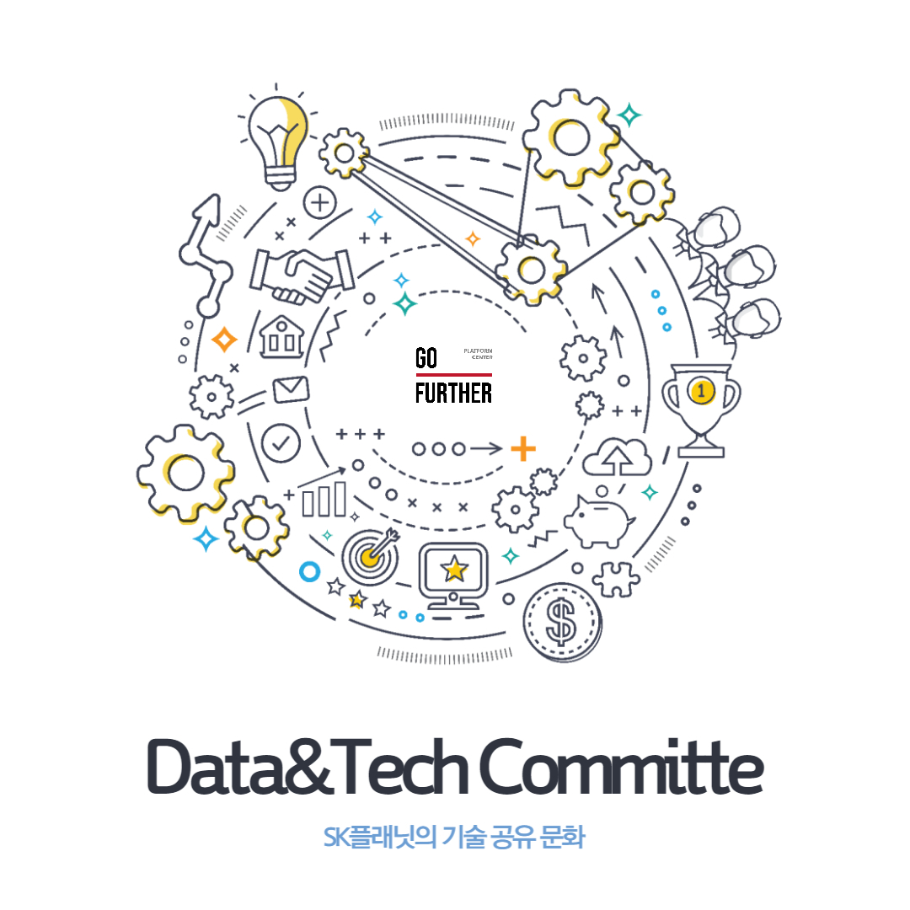
(이미지는 사내 모 PL 님께서 디자인해 주셨습니다 ^ ^)

Data & Tech Committee(이하 DTC)는 매월 진행되는 전사 기술 공유 프로그램으로 개발, 인프라, 데이터, UX 등 현업의 다양한 업무 사례를 공유함으로써 구성원들의 상호 교류와 시너지 창출을 통한 기술 문화를 만들었습니다. 이와 함께 DTC는 기획, 사업, UX 등 비개발 직군의 임직원들도 적극적으로 참여하였으며, 다양한 분야의 외부 전문가 초빙을 통해 기술 인사이트 공유 및 네트워킹을 함께 강화해 나가고 있습니다.

SK플래닛에서 다루었던 주요 아젠다는 아래와 같습니다. 
(덧. 역시 생성형 AI의 비중이 많아지고 있네요! - 이제는 프로그램명을 ATC(AI & Tech...) 로 바꾸어야 할까요?) 

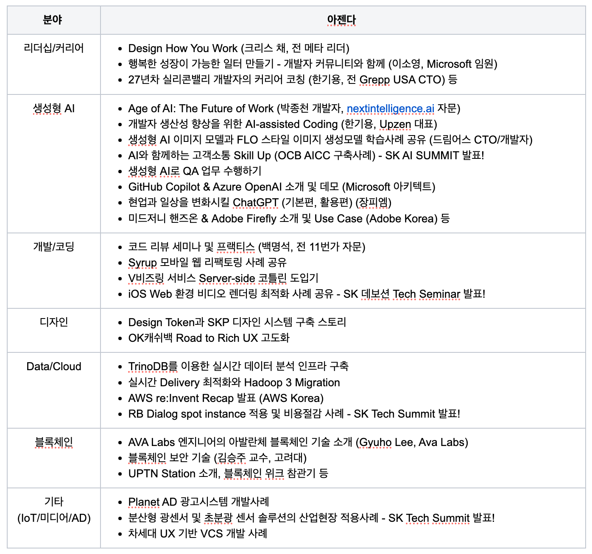
[지난 3년간의 아젠다: 다양한 분야를 여러 전문가 분들께서 커버해 주셨습니다]

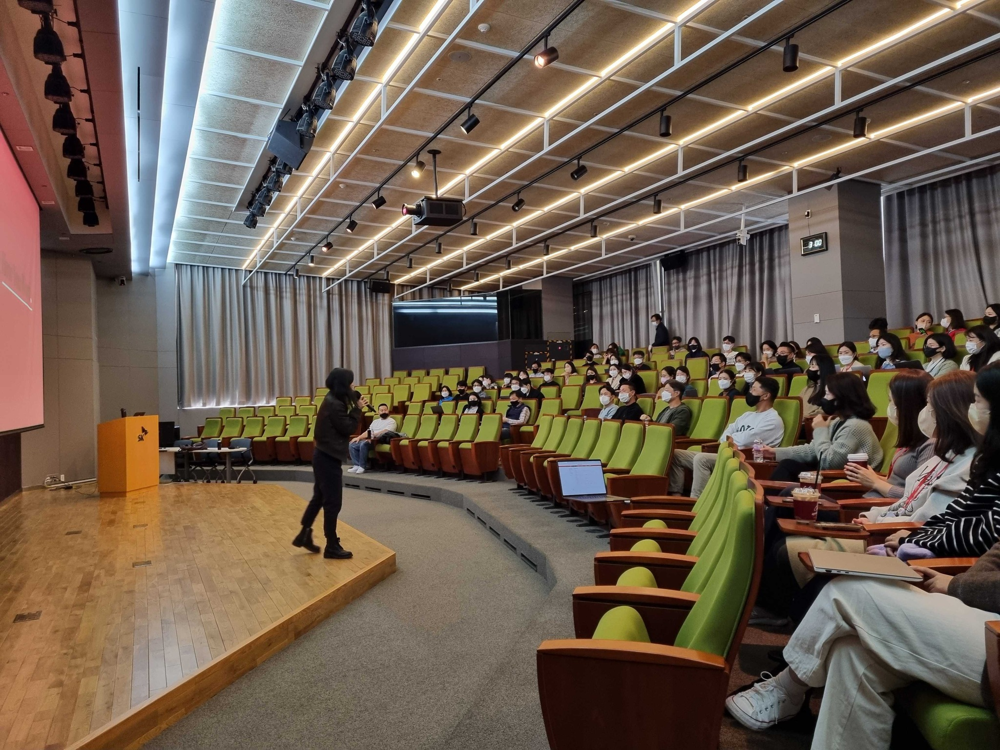
[Chris Chae 님의 열정 넘치는 발표 장면. 2022년 판교사옥 SUPEX Hall]

#### 운영

저희는 DTC 프로그램을 다음과 같이 진행하였습니다(2024년 기준) .

```java
* 한 번에 하나의 아젠다/주제를 발표하여 집중력을 높임 (예전에는 아젠다 2-3개를 하루에 발표하기도 함)
* 사전질문 이벤트를 진행하여 구성원 참여 강화 - 현장에서 답변과 함께 공유하고 현장 질문도 함께 받음 
  (질문자에게는 기여보상 지급)
* 주로 실시간 온라인 방식으로 진행하되(파견 근무자도 참여 가능)
  연간 2-3회 현장 강연도 진행함(리더십/커리어 강연은 모두 SUPEX Hall에서 현장 강연으로 진행).
* 도구는 사내 Teams의 동영상 기능을 사용하다가, 
  원스토어/드림어스 등 패밀리사 분들도 참여하면서 Zoom의 활용 비중을 높였음.
* 발표내용 중 외부에 오픈 가능한 내용을 블로그 스타일로 정리하여 Tech Topic에 공유
  (One Source Multi Use).
```

## Age of AI - The Future of Work ('24년 11월 DTC)
---
도서 '개발자로 살아남기' 로 유명한 박종천 님을 모시고 현장 강연으로 진행하게 되었습니다. 최근에는 미국 인공지능 스타트업 자문 및 개발, 강연 등 국내외에서 다양한 활동을 하고 계신데 어렵게 섭외하게 되었습니다 ^ ^ 

행사 공지 방법은 사내공지 및 SK데보션 https://devocean.sk.com/ 의 커뮤니티 메뉴에서 데보션 프로 님들 대상으로 따로 드렸고(아래 참조), 스퀘어 패밀리사에는 메일로 공유를 드렸구요, 플래닛 외에도 텔레콤, 드림어스컴퍼니에서 참여해 주셨습니다(3월에는 원스토어에서도 참여).

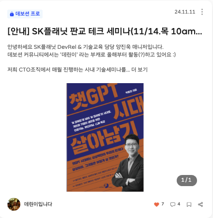

참고로 종천님은 2021년 가을 플래닛 사내 개발자행사때 처음으로 '개발자로 살아남기' 강연을 해 주셨고(당시는 COVID-19 시절이어서 온라인으로 강연하셨는데, 그때도 개발자분들 반응이 엄청 좋았죠), 3년만에 드디어 오프라인으로 모시게 되었습니다. 약 200명의 개발자와 기획자 여러분이 판교사옥 SUPEX Hall을 가득 메워 주셨답니다!


'Age of AI: The Future of Work' 라는 주제로, 3시간 분량의 강연을 2배속(?)으로 그러나 정확하고 열정적으로 잘 전달해주셔서, 질의응답 시간에 구성원들의 질문이 쏟아지는데 원래 약속된 강의시간을 20분이나 더 넘겼다는 ;; (점심시간이라 저희가 양해를 구하고 끊었는데도 행사 마치고 질문하러 줄을 섰습니다...</br></br>
좋은 주제만큼이나 좋은 연사의 힘은 정말 대단한 것 같습니다!)


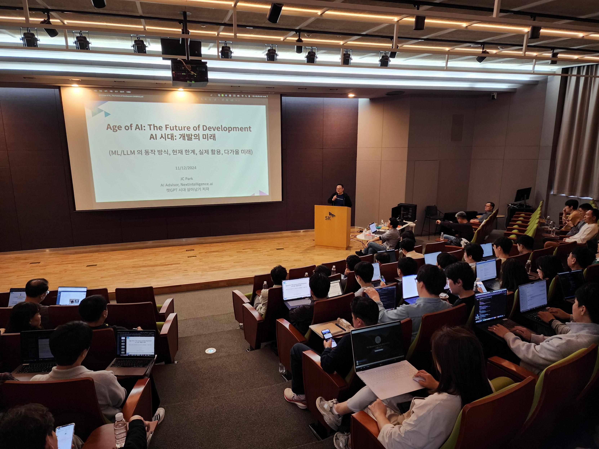
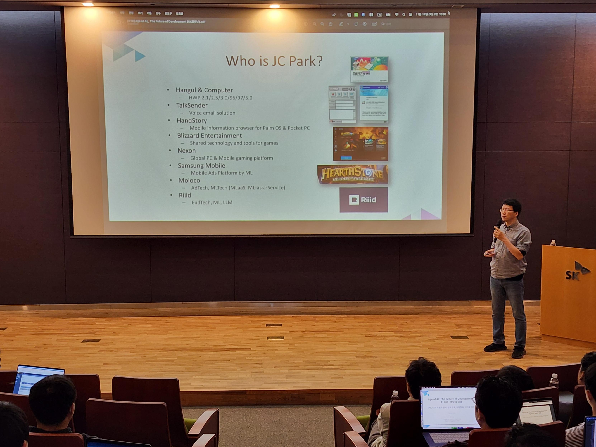
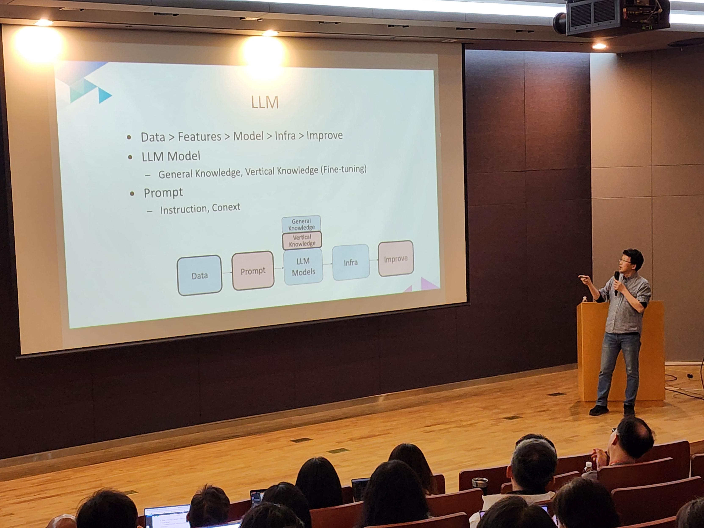
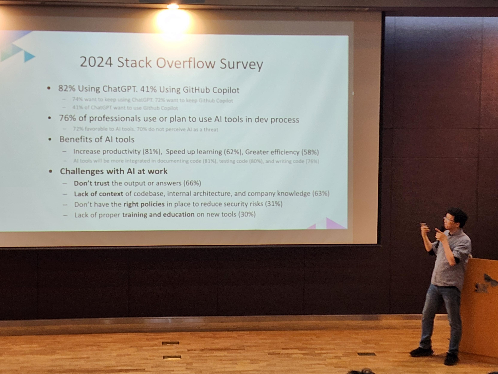
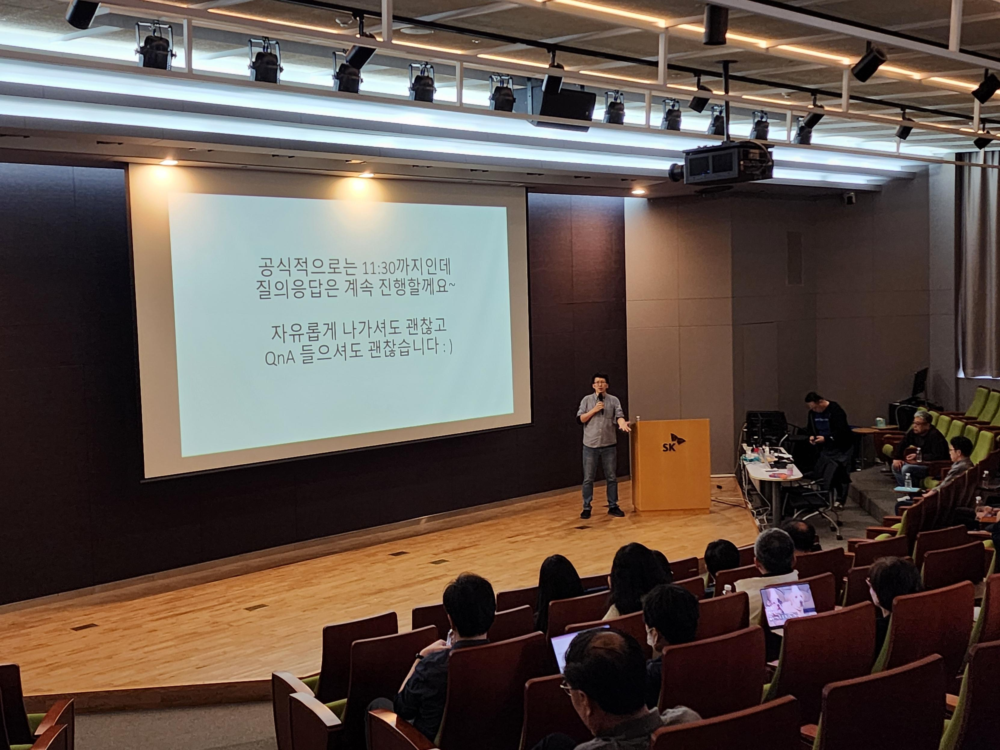
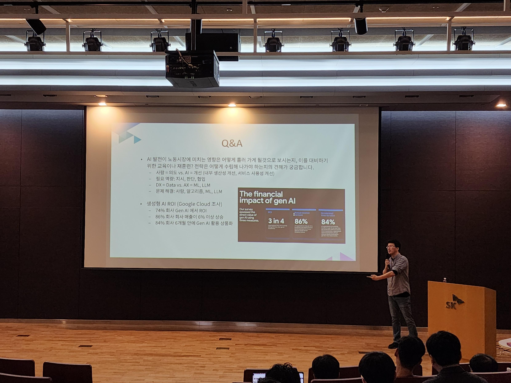
(이날 사례발표가 특히 좋았는데 연사님께서 특정 회사의 이름을 공개하지 말아 달라고 당부하셔서 블로그에서 남기지 못함을 아쉽게 생각합니다 ^ ^)

현장감을 조금이라도 공유하기 위해, 구성원들의 피드백을 일부 공유드립니다. ^ ^
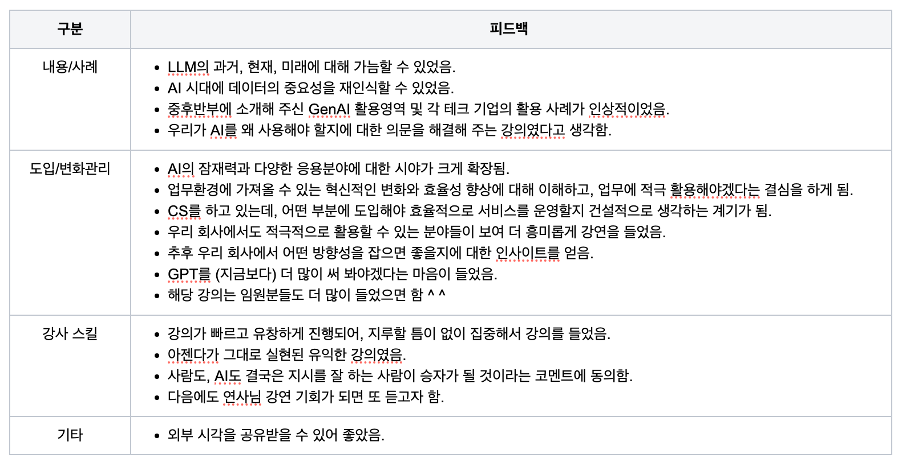

## 마무리하며 
---
</br>
SK플래닛 판교 세미나 DTC가 어떤 형태의 기술 세미나로 바뀔지 모르지만, </br>
향후에도 SK의 구성원들이 기술 인사이트를 얻고 공유해 나가는 지식 플랫폼으로 지속 발전하기를 바랍니다(언젠가 데보션 테크데이 같이 다양하게 모일 수 있는 오픈 세미나로 성장하면 더 좋겠죠?) </br></br>

그동안 함께해 주신 외부 전문가와 사내 발표자 분들께, 그리고 이 글을 읽어 주신 분들께 감사드립니다. </br>
2024년 남은 한해 잘 마무리하세요! </br>