안녕하세요, SK플래닛에서 프론트엔드 개발을 담당하고 있는 김찬민이라고 합니다.

작년 이맘때까지만 해도 프론트엔드 개발자가 AI를 사용하는 용도는 [새로운 기술을 습득하거나 코드를 리팩터링하는](https://devocean.sk.com/blog/techBoardDetail.do?ID=165847) 등 프롬프트를 기반으로 하는 코드 생성 작업이 대부분이었던 것 같은데요, MCP와 코딩 에이전트의 등장 후로는 훨씬 더 다양한 방식으로 AI를 활용할 수 있게 된 것 같습니다.
AI의 활용 방법들 중 하나로, 이번 글에서는 [Framelink Figma MCP](https://github.com/GLips/Figma-Context-MCP) 를 사용해 프론트엔드 개발자의 숙제 중 하나인 UI 컴포넌트를 효율적으로 개발하는 방법을 소개해보려 합니다.

(참고) 글을 쓰는 시점에 [Figma 공식 MCP](https://help.figma.com/hc/ko/articles/32132100833559-Dev-Mode-MCP-%EC%84%9C%EB%B2%84-%EC%95%88%EB%82%B4%EC%84%9C) 의 베타 버전이 공개되어 있기는 하나, 아직까지는 Framelink Figma MCP가 더 안정적으로 동작한다고 느껴져 Framelink Figma MCP를 다루었습니다.

# 1. Cursor 에디터와 Figma MCP 연동
---
[Framelink Figma MCP](https://github.com/GLips/Figma-Context-MCP) 는 Cursor, GitHub Copilot 등의 코딩 에이전트와 Figma를 이어주는 MCP로, 피그마 노드(≈ UI 요소)의 주소를 프롬프트에 추가하면 UI를 인식해 코드로 전환할 수 있습니다.

## 1-a. 설치 및 설정하기
Framelink Figma MCP를 사용하기 위해서는 먼저 피그마 액세스 토큰이 필요합니다.

* 토큰 발급 위치 : [피그마 홈 - Settings - Security 하단]
* 토큰 권한은 모두 Read-only로 부여했습니다.

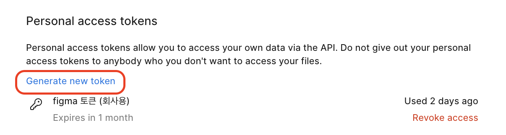

다음으로 Cursor 에디터에 MCP를 추가하기 위해 Cursor 설정에 진입합니다.
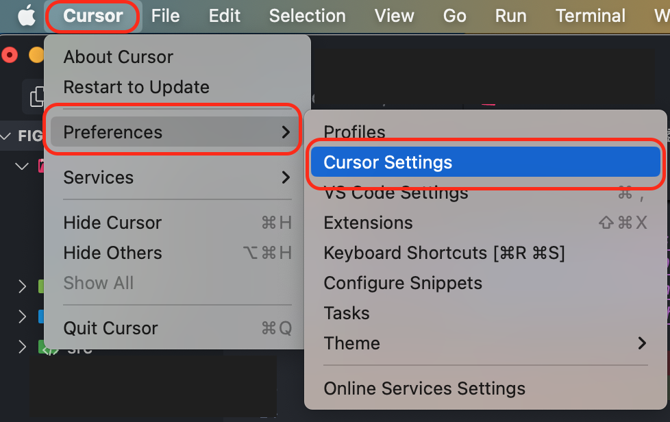

MCP 설정에 진입했다면 "New MCP Server" 버튼을 눌러 MCP 서버를 추가할 수 있습니다.
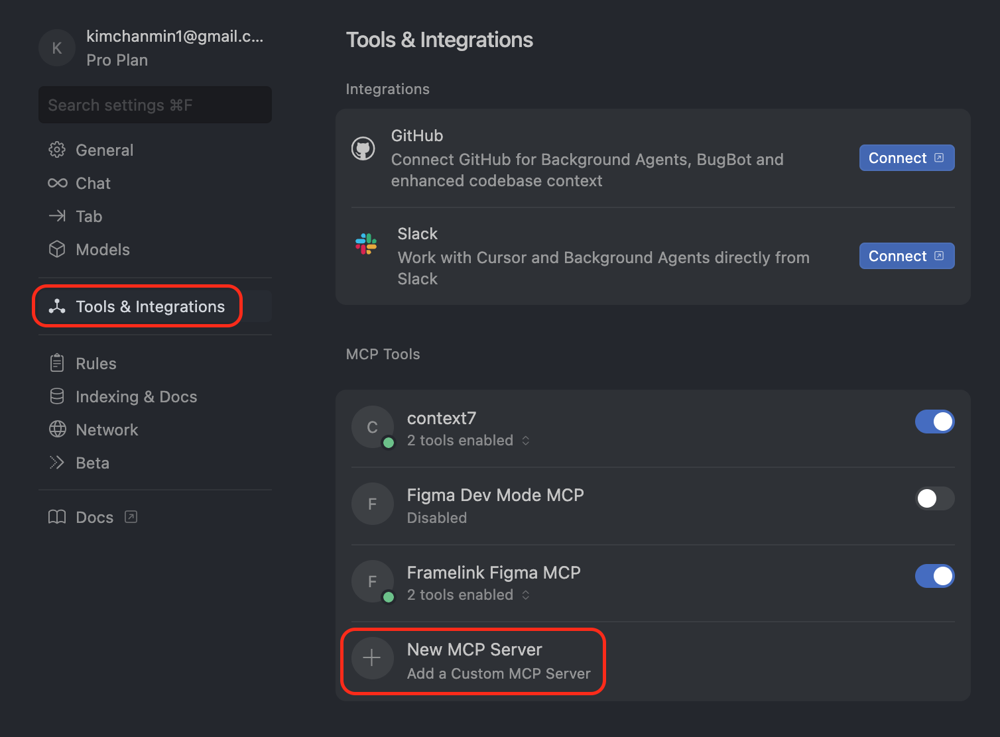

```js
{
  "mcpServers": {
    "Framelink Figma MCP": {
      "command": "npx",
      "args": ["-y", "figma-developer-mcp", "--figma-api-key=피그마_액세스_토큰", "--stdio"]
    }
  }
}
```
MCP 서버를 추가한 뒤 MCP Tools에 Framelink Figma MCP에 초록불이 들어와 있다면 성공입니다.
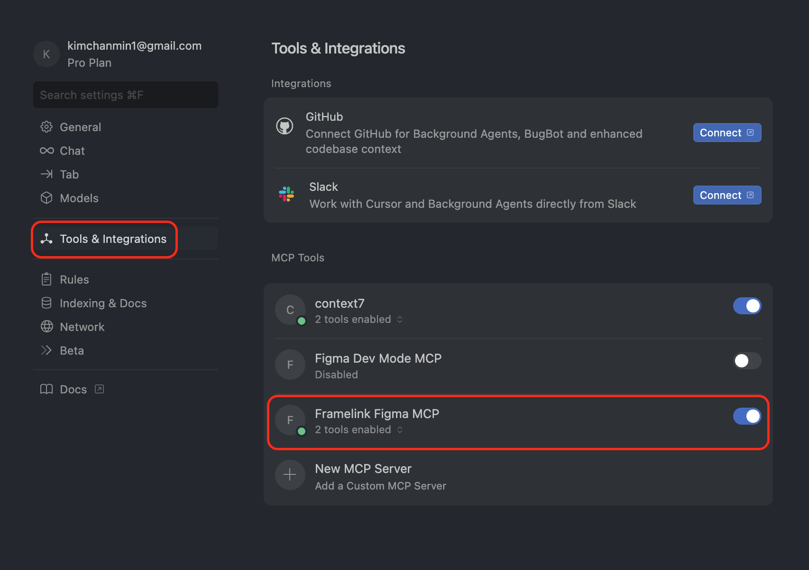
이제 프롬프트에 Figma 노드 정보를 포함시키면 MCP 서버가 Figma API를 통해 해당 노드의 정보를 불러올 수 있고, 코딩 에이전트는 이를 코드로 변환할 수 있게 됩니다.

<br/>

# 2. Figma MCP로 컴포넌트 개발하기
---
MCP 설정이 끝났다면 테스트를 위해 구글에서 유지보수하는 UI 컴포넌트 라이브러리인 [Material UI](https://www.figma.com/community/file/912837788133317724/material-ui-for-figma-and-mui-x) 의 피그마 시안을 코드로 옮겨 보겠습니다.

## 2-a. Figma 디자인 요소 선택하기
Figma에서 개발하고자 하는 UI 컴포넌트를 선택하고 해당 요소의 URL을 복사합니다(Pages가 아닌 Layers 메뉴에서 노드를 복사해야 하는 점만 유의해 주세요).

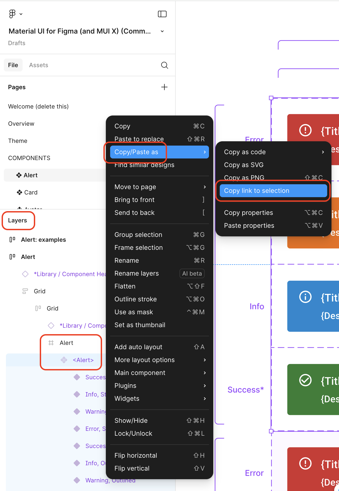

Figma Dev Mode를 사용한다면 조금이나마 더 쉽게 요소를 선택할 수 있습니다.

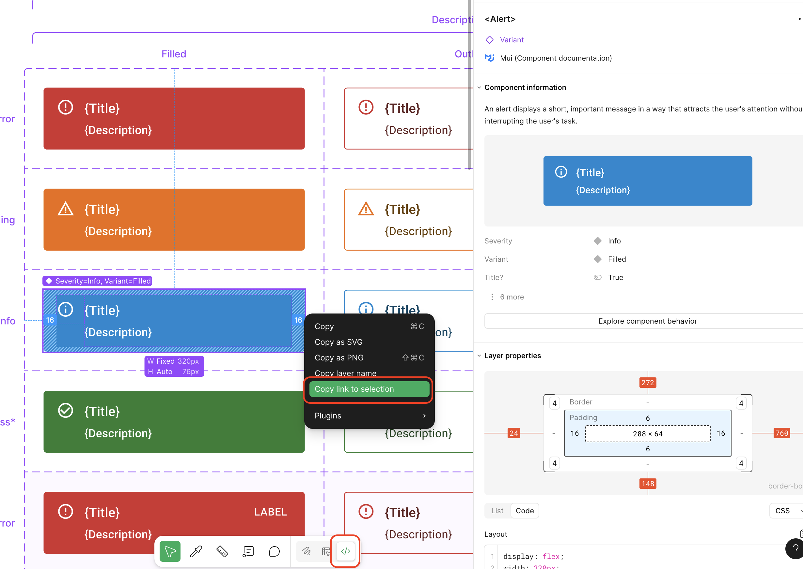

## 2-b. 코딩 에이전트에 프롬프트 작성하기
이제 Cursor 에디터에 다음과 같이 프롬프트를 작성하면 LLM이 피그마 파일을 읽을 수 있게 됩니다.

```
@https://www.figma.com/design/MQDo9JH9CSJw4Dm1wsxj91/Material-UI-for-Figma--and-MUI-X---Community-?node-id=6594-968657&t=vqVI3vvlCQYLyqj8-4


이 피그마 시안을 참고해 React 컴포넌트와 스토리북을 구현해줘.
```

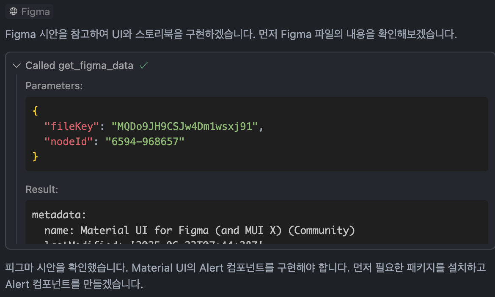

프롬프팅의 결과로 [Figma Material UI](https://www.figma.com/design/OZujJWaiPQwe7kHUgO9AeC/Material-UI-for-Figma--and-MUI-X---Community-) 중 Alert UI에 대응하는 컴포넌트와 스토리북 문서가 생성되었습니다.

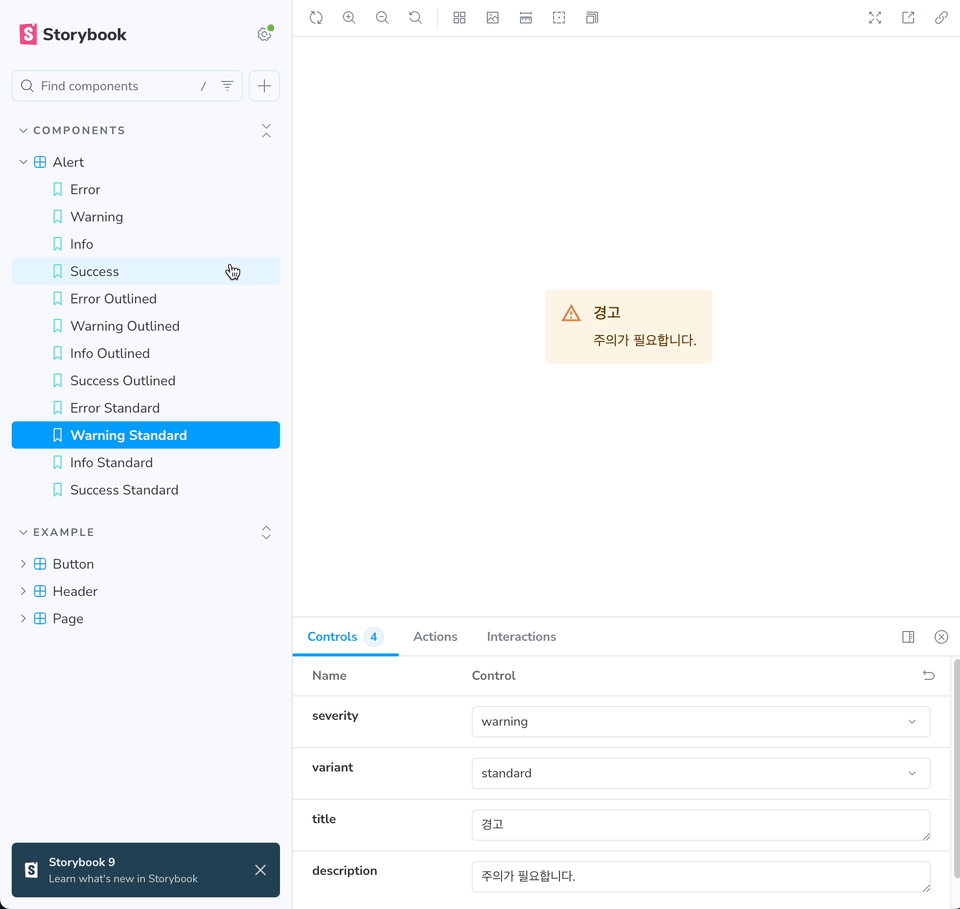

# 3. 실제 업무에 적용해본 후기
---
개인적으로는 LLM에게 수동적으로 코드 개선을 요청하는 단계를 넘어, 피그마 파일을 읽고 마크업을 생성해주는 모습에 큰 인상을 받았습니다. 그래서 React 기반의 OK캐쉬백 서비스에 사용되는 일부 컴포넌트를 Vue로 재작업하는 과정에 MCP를 실제로 사용해 보았습니다.

* OK캐시백 디자인 시스템 피그마 일부
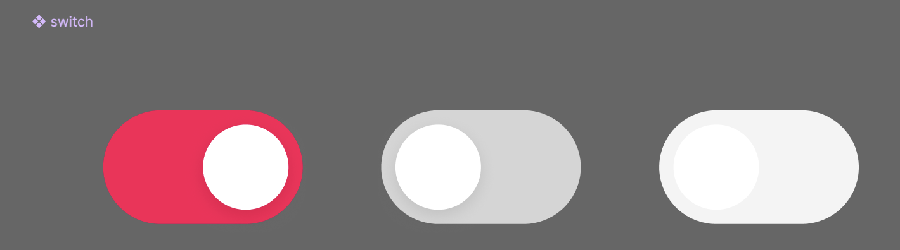

* MCP 기반으로 생성된 컴포넌트를 튜닝해 완성한 모습
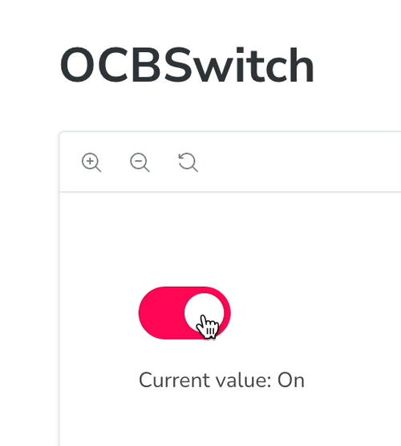
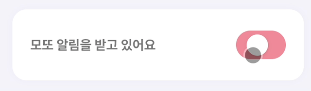

MCP가 성공적으로 컴포넌트를 생성해 주었고, 스위치가 더 자연스럽게 움직일 수 있도록 motion 라이브러리를 사용해 애니메이션을 다듬으니 만족스러운 결과물을 얻을 수 있었습니다.

제가 직접 처음부터 구현해야 했다면 4시간 정도 걸렸을 것 같은 작업이었는데, 수 분 내에 작업을 마치고 작은 디테일들을 보완하는 데에 사용할 수 있는 시간이 늘었던 만족스러운 경험이었습니다.

<br/>

# 4. 마치며
---


화면 전체 UI를 코드로 옮기려 시도하면 유지보수가 어려운 코드가 생성되는 등 아직은 AI가 완벽하지 않은 모습을 보이기도 하지만,
단위 컴포넌트를 구현하고 스토리북 문서를 관리하는 목적만으로도 프론트엔드 개발자의 부하를 크게 줄여줄 수 있게 되었습니다.

수동적으로 코드 생성, 개선을 요청하는 용도를 넘어 프론트엔드 개발에서 중요한 과정인 디자인을 코드로 옮기는 데에 들이는 시간을 크게 단축할 수 있게 되었다는 점에는 만족하지만, 앞으로 프론트엔드 개발자들이 일하는 모습은 어떻게 변화해야 할지, 어떤 식으로 경쟁력을 갖춰야 할지에 대해서는 어려운 고민거리를 던져준 것 같습니다.

UI 구현에 어려움을 겪을 수 있는 타 직군이나 주니어 개발자들에게 이 글이 도움이 되셨길 바라며, 더 좋은 글로 다시 찾아뵙겠습니다.

---
#### (참고) 작가의 최근 글은 여기서도 읽으실 수 있습니다.

* [LoadingSpinner를 도입하여 웹앱 사용자 경험을 개선하다(웹앱 사용자 경험을 개선하는 기술 한 스푼)](https://techtopic.skplanet.com/uptn-loadingspinner/)
* [[Vue] motion 라이브러리로 더 나은 UX 제공하기](https://devocean.sk.com/blog/techBoardDetail.do?ID=167311)
* [시각장애인을 위해 모달 컴포넌트 접근성 개선하기](https://devocean.sk.com/blog/techBoardDetail.do?ID=167206)

