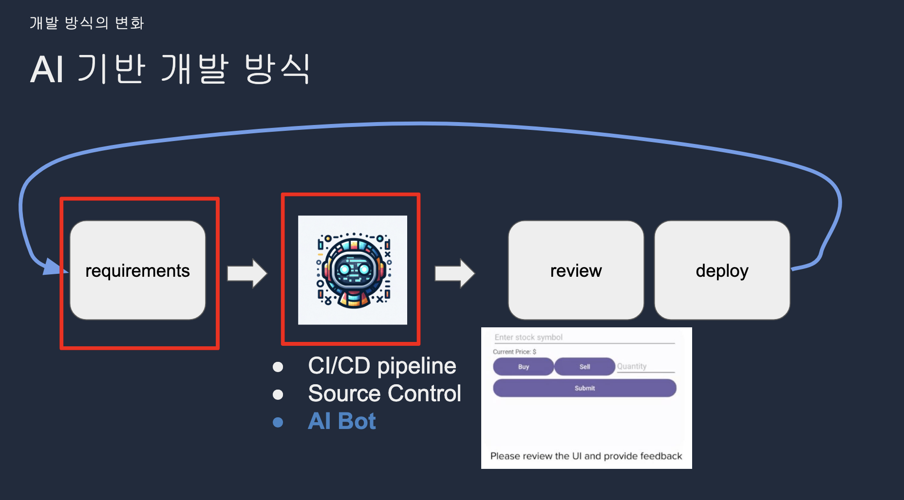

본 글에서는 엔지니어의 개발 생산성을 향상시킬 수 있는 GitHub Copilot(이하 코파일럿), ChatGPT 외 다양한 AI 툴(AI-assisted Software)의 기능과 활용 방법을 소개하며, 생성형 AI로 인한 개발 방식의 변화, AI의 발전에 따른 우려 사항, 그리고 AI 툴을 바라보는 여러 관점들을 발표자와 실리콘밸리 사례 위주로 설명합니다(* 참고로 본 글은 지난 3월 사내에서 진행되었던 SK플래닛 기술 세미나(Data & Tech Committee, DTC*)에서 Upzen 한기용 대표의 발표 내용을 중심으로 정리하였습니다 - 발표자의 허락을 받아 편집자가 Tech Topic 블로그에 포스팅합니다). 

이들을 잘 활용할 경우 개발자의 소프트웨어 개발 생산성이 향상된다고 알려져 있는데요, 정말 그러한가 해서 발표자께서는 실리콘밸리 지인 찬스(!)를 사용하셨다고 합니다(물론 발표자님도 써 보셨고요 ^^).

(참고) '개발 생산성(Software Development Productivity)'이란? 

지인 중 인도 개발자 출신 스타트업 대표와 인터뷰를 했었는데, 사내 개발자들이 코파일럿 엔터프라이즈 유료 버전을 사용하도록 6개월 정도 지원했더니  확실히 개발자 생산성이 올라간다는 피드백을 받았다고 합니다. 페어 프로그램 느낌도 꽤 나구요. 특히 주니어들의 개발자 생산성이 훨씬 올라간다고 합니다(그렇다고 주니어를 대체(?)하지는 않겠죠?). 하나 더 재미있는 사실은 코파일럿 하나만 많이 사용할 경우 피드백 루프가 생기는 것 같아, 다른 AI 툴을 병행해서 사용할 계획이 있다고 들었습니다(예: 툴 1로는 코드 생성, 툴 2로는 유닛 테스트 생성 등). 앞으로는 툴이 발전해서 휴먼이 작성한 코드와 AI 툴이 작성한 코드를 잘 구분해 주면 더욱 좋겠다는 의견도 제시해 주셨습니다. 

소프트웨어 개발 생산성은 코딩 시간의 단축(남는 시간에 다른 일을 하거나 쉴 수 있음), 코드 퀄리티 향상, DevEx(개발자 경험)의 향상, 코딩 스킬 향상 등 여러 가지로 정의할 수 있으며, GitHub에서 발간한 아래 글을 보시면 AI 툴 관점에서의 개발 생산성을 좀더 잘 이해할 수 있을 것으로 생각합니다(자세한 설명은 생략). 

* 제목: "Measuring the impact of GitHub Copilot" (Ryan Salva, VP of Product, GitHub)
* 링크: https://resources.github.com/learn/pathways/copilot/essentials/measuring-the-impact-of-github-copilot/
 

## 1. 개발 생산성 툴 소개
--- 
DataCamp에서 약 8개월 전에 다양한 생성형 AI 툴을 survey했었는데 아래와 같이 카테고리를 분류하고 있습니다. 
(https://www.datacamp.com/cheat-sheet/the-generative-ai-tools-landscape)

* Text Applications
* Image Applications
* Video Applications
* Audio Applicatons
* Coding Applications
* Data Applications
* Bots
* Other Applications

~~(참고로 발표자가 이 툴들을 대부분 체크해 봤는데 발표 시점에서 약 1/3이 서비스를 닫았다고 합니다...너무나 빠르게 변하는 시장인 듯)~~
우리는 엔지니어들이 관심이 많은 Coding Application 및 Data Application 중심으로 보도록 하겠습니다.  

#### (1) Coding Applications

GenAI 기반 Coding Application은 공통적으로 아래의 기능을 사용자에게 제공합니다. IDE 형태 및 Extension을 통해 대부분의 기능을 제공하기도 하며(예: GitHub Copilot), 웹사이트 생성 등 특정 기능에 특화되어 있는 프로그램들도 있습니다(예: locofy.ai, Webflow 등). 

* Website Generation from Text 
* Website Generation from Figma Designs (참고: Figma AI at Config 2024) 
* Website Personalization & Optimization
* Code Generation/Completion
* Code Analysis & DevOps Intelligence
* Documentation Generation 

이 중에서 발표자께서는 웹사이트를 '만들어' 주는 Webflow(https://webflow.com/)를 써 봤는데 만족도가 높았다고 합니다. 발표자는 프론트엔드 비전공자이나(십수년 전 윈도우즈 애플리케이션 개발 경험은 있고 이후 데이터 직군으로 전직) 1인 기업용 웹사이트 개발을 위해 이 툴을 사용해 보았으며, 필요한 코드도 생성해 주고, 모르는 것은 코파일럿과 ChatGPT에게 물어보면서 함께 개발하는 쓸만한 웹 애플리케이션이 하나 나왔다고 합니다(웹사이트는 안 보여주셨네요 ^^; ). 

#### (2) Data Applications 
GenAI 기반 Data Analysis Application은 다음과 같은 기능을 제공합니다. 예전에는 실리콘밸리에서는 마케팅부서 등에서 요청이 오면 SQL을 대신 작성해 주는 이른바 'SQL Monkey' 가 있었다고 합니다. 이제 AI 툴이 대체할 수 있게 되었는데요, 현재는 회사에서 많이 쓰는 스키마를 업로드하고 프롬프트로 명령어를 보내면 SQL을 만들어 주는 수준이라고 하며 향후에는 더욱 다양한 분석기능을 제공할 것으로 예상됩니다.

* Automated Analysis & Insights 
* Machine Learning & DataOps 
* Synthetic Training Data Generation 

(예) SQLAI.ai https://www.sqlai.ai/ 

 

그리고 향후의 데이터 분석은 지금의 엑셀 같은 느낌으로 바뀌지 않을까 하는 의견을 주셨습니다. 참고로 발표자는 데이터 도메인에 약 13년간 재직했다고 하는데요. 데이터 엔지니어링, 데이터 분석, 데이터 보안 중 분석 직군은 (사라지지는 않겠으나) 향후에는 모든 사람이 할 수 있는 스킬 정도로 바뀌지 않을까 말씀을 주셨고, 큰 범주에서는 코딩도 비슷한 길을 걸을 것으로 예상해 주셨습니다(대단히 잘 하는 사람, 적당히 할 줄 아는 사람 등등). 

## 2. GitHub Copilot 소개 (in detail) 
---

#### (1) 주요 특징

GitHub은 코파일럿 출시 초기에는 'AI-powered Pair Programmer' 라는 컨셉으로 제품을 홍보하였는데, 2023년 11월 샌프란시스코에서 열린 GitHub Universe 행사에서 코파일럿의 Enterprise 버전을 공개하였고 이후 컨셉을 'AI-powered Developer Platform'으로 변경하였습니다. 

코파일럿은 웹 브라우저나 IDE(VSCode, JetBrain IDE) 에서 Extension을 설치하면 채팅하면서 코드를 만들어 쓸 수 있습니다 - 왼쪽은 채팅 창, 오른쪽은 코드 창. 작업 중인 코드를 선택한 다음 리뷰, 유닛 테스트를 위한 명령(프롬프팅)을 줄 수 있습니다. 코딩 관점에서는 ChatGPT보다 더 편리하다고 할 수 있습니다(코드를 직접 보면서 이야기하고 바로 수정). 

#### (2) 라이선스별 Pricing 및 기능

GitHub에서는 세 가지 라이선스의 코파일럿을 제공하고 있습니다 - 개인(Individual), 비즈니스(Business), 엔터프라이즈(Enterprise) - 이들은 가격 및 기능의 차이가 존재합니다. 이 중 비즈니스 라이선스 이상에서 지원되는 기능은 다음과 같습니다. 
* 슬래쉬(/) 커맨드 사용 가능: Slack의 슬래쉬 기능과 유사한 기능으로 여러 가지 편리성을 제공합니다(뒤에서 설명).   
* 내가 작성한 코드를 코파일럿이 학습하지 않습니다(기업에서 보안을 고려할 경우 검토할 수 있음). 

엔터프라이즈 라이선스에서만 지원되는 기능은 다음과 같습니다. 
* PR(Pull Request) 메시지 자동 생성 기능: GitHub PR의 약 40퍼센트가 아무 메시지가 없는 상태라고 합니다! 엔터프라이즈 버전에서는 PR description을 자동으로 생성해 주며, 개발자는 이것으로 보고 편리하게 PR 메시지 업데이트 및 코드 검토가 가능합니다. 
* 기업 버전 파인튜닝 기능: 개인 및 비즈니스 버전에서는 코드리뷰 시 일반적인 코파일럿의 학습된 내용으로 Code Suggestion을 해 주지만, 엔터프라이즈 버전에서는 사내 Private Repo 코딩 스타일 제공이 가능하며, 여러 컨벤션을 학습 후 Code Completion Model이 파인튜닝된 코드를 제안해 줍니다. 이러한 환경이 구축될 경우 새로 들어온 신입 및 경력 개발자들이 회사의 코딩 컨벤션을 바로 배울 수 있게 됩니다. 

#### (3) Copilot Chat 기능 

2023년 3월 Copilot X의 기능 중 하나로 소개되었으며 연말에 정식 출시되었습니다. GPT-4 모델을 사용하여 ChatGPT에 준하는 강력한 기능을 제공합니다. 
IDE 및 브라우저에서 왼쪽에는 채팅 창을, 오른쪽에 코드 창을 띄우고 다음 기능들을 실행할 수 있습니다.    
* 새 프로젝트 실행, 특정 코드 Unit Test, 문서화, 이해 못하는 코드 설명 요청, 코드 최적화 (생각보다 잘 한다고 합니다 ^^)
* 변수 이름짓기, 정규식 만들기 
* 오른쪽에서 코드 블록을 선택하고, 왼쪽 채팅창에서 여러 프롬프트(명령어)를 주면 됩니다(예: 이 코드 유닛테스트 붙여줘, 설명해 줘, 문서화 해 줘, 최적화 해 줘 등등) 

GitHub에서는 많은 회사들과 엔터프라이즈 버전을 프리뷰로 사용하였다고 합니다. 액센츄어에서는 개발자 450명을 대상으로 테스트 및 서베이한 결과, 개발자 대부분이 사용 첫날부터 만족도가 높았다고 합니다. 우리 나라의 그렙(프로그래머스, 개발자 교육/채용 업체)에서도 모든 직원들이 회사 비용으로 코파일럿을 사용하고 있습니다(엔터프라이즈 버전은 검토 중). 

#### (4) Copilot Slash Command 
슬래쉬(/) 명령어는 코파일럿에서 유용하게 사용됩니다. 아래는 몇 가지 예시입니다.

## 3. ChatGPT 4 소개 
---
이 글에서는 모든 기능을 설명하지는 않고, 개발 생산성과 관련이 있는 GPT Store와 Code Interpreter의 개요, 특징 및 활용 방법을 소개합니다(올해 3월 발표여서 GPT-4o나 mini는 커버하지 않음). 발표자께서는 가능하면 꼭 유료 버전을 사용하시는 것을 권장(이라 쓰고 강조라고 읽음)하셨네요. 무엇을 해야 할지 모를 때도, 아니면 해야 할 일을 알고 있을 때도 일단 편하게 '대화'를 하면 좋다는 것입니다.

#### (1) GPT Store & apps

앱 스토어와 유사한 형태이며, 이것으로 GPT 기능을 가진 챗봇을 쉽게 만들 수 있습니다. 일종의 노코드-로우코드 개념이구요. 
코딩에 익숙하지 않아도 약간의 '개념'만 있다면 나만의 챗봇 제작이 가능합니다. 

GPT Builder로 실제 나만의 앱을 만들게 되는데, 3가지 기능이 존재합니다. 
* Instruction: '너는 이런 봇이야' 페르소나와 기능을 부여해 줌 
* Knowledge: 옛날 파인튜닝 기능과 유사. 나만의 대화셋(예: QnA 대화셋) 이 있으면 파인튜닝을 아주 쉽게 해줌. 발표자의 경우 저서 및 링크드인, 페이스북의 기고 글을 pdf file로 만들고 업로드하면 발표자의 말(투)을 기억하고 마치 발표자가 이야기하는 것처럼 구현이 가능함. 기업용 CS Chatbot 구축이 가능하고, 우리 회사 제품 FAQ, 제품 설명서 등을 Knowledge에 올려놓고 나중에 API 형태로 access도 가능(이것도 생각보다 잘함). 물론 인스트럭션을 잘 줘야 하며, 할루시네이션은 조절 잘 해야 함. 
* Actions: GPT 외부의 개념/툴을 이용하는 것으로, Zapier와도 연동하여 생산성 향상 가능함 - 지메일로 어떤 이메일이 오고, 그 이메일에 특정 단어가 있으면 트리거하여 자동화 가능  

GPT Store 가보면 상단에 여러 카테고리가 있으며, 이 중 프로그래밍 파트 가보면 다른 사람들이 만들어 놓은 봇이 많다고 합니다. 사용량에 따라(사람들이 많이 쓰면) 금전적 보상이 있다고 하니 함께 참고하세요! 

#### (2) Code Interpreter

OpenAI에서 GPT Builder를 이용해 구현할 수 있습니다. 
이 기능은 발표자가 실제 업무에서 많이 사용하였다고 하며, 시간을 엄청나게 세이브할 수 있다고 합니다(발표자는 20불 값어치는 충분히 한다고 언급).  
ChatGPT 에서 파이썬 코드 스니펫을 직접 실행할 수 있는 통합 실행 환경이 갖춰져 있으며, 데이터 파일을 업로드 및 분석하고 모델링 코드를 생성하는 데 최적으로 알려져 있습니다. 

코드 인터프리터로 데이터 분석하는 방법은, CSV 파일을 샘플 일부로 만들어 인터프리터에 업로드 후 ChatGPT에게 이야기합니다(이 파일을 보고 분석해 줘) 
* EDA(Exploratory Data Analysis - 탐색적 데이터 분석), 즉 데이터를 보고 이해하기 위한 다양한 분석 기법을 적용할 수 있음. 
* 생각보다 잘함. 시각화도 해 주고, 타겟 데이터 예측을 위한 훈련 데이터 말도하며, 해당 데이터를 분석할 수 있는 파이썬 코드를 생성해 줌.
* 이를 다운로드 받아서 코드 인터프리터가 코딩해 준 것에 기능을 추가할 수 있음 

내가 데이터를 모델링할 일이 있으면 ChatGPT를 사용하면 됩니다. 

## 4. 개발 방식의 변화
---
#### (1)기존 개발 방식

여기서는 AI-assisted Coding의 대조 개념으로서 '기존' 개발 방식이라고 명명하였습니다. 기존 개발 방식의 수명주기(Life Cycle)은 아래의 짧은 사이클을 따르며, 애자일하게 스프린트 형태로 반복하게 됩니다 ~~(회사에 따라 워터폴...)~~. 여기에 CI/CD pipeline이나 Source Control이 포함될 수 있습니다. 

#### (2) AI 코딩 관련 최근 연구들 

생성형 AI 툴이 나오기 이전에도 소프트웨어 개발 분야에 AI/ML 도입에 대한 연구가 기업 및 대학 연구실에서 진행되었으며, 이 중 몇몇 결과는 코파일럿 등 AI 툴에 이미 반영되고 있다고 합니다. 관심있는 분들은 관련 웹사이트나 논문을 참고하시기 바랍니다. 

* (a) https://research.facebook.com/publications/getafix-learning-to-fix-bugs-automatically/
* (b) https://www.usenix.org/conference/osdi22/presentation/david
* (c) https://arxiv.org/abs/2206.15000
* (d) https://arxiv.org/pdf/2306.09541
* (e) https://cacm.acm.org/research/measuring-github-copilots-impact-on-productivity/

#### (3) AI 기반 개발 방식 

'AI 기반' 개발 방식은 요구사항 다음에 'AI Bot'이 개입하는 형태이며 휴먼과 함께 코드를 만들어 냅니다(그래서 GitHub에서는 Copilot을 'Your AI Pair Programmer' 라고 명명), 이후 리뷰와 배포 과정을 연이어 진행하게 됩니다. 
미래의 소스코드는 휴먼이 AI 봇에게 주는 명령이나 대화(프롬프트)가 새로운 소스 코드가 될 것입니다. 

#### (4) 코딩 봇에게 우리가 원하는 '태도'(특성) 

개발자는 코딩 봇이 좋은 코드를 생성하기 위해 다음의 특성을 기대할 것입니다 - (a) Concise, (b) Reliable, (c) Inquisitive, (d) Self-aware, (e) Personalized 등등 - 그런데 이 특성은 알고 보면 우리가 좋은 (휴먼) 개발자에게 원하는 태도와 동일합니다. 

예를 들어,  
* 얼마나 간결하게 답을 주느냐
* 얼마나 믿을 수 있느냐
* 얼마나 호기심이 있느냐: 명령을 줬을 때 그대로 하는 것이 아니라, 문제를 파악하기 위해 되물어본다든지 하는 것
* 항상 잘하지는 못하지만, 대화를 바탕으로 얼마나 학습하고 나에게 맞는 답을 주는가 등입니다. 

현재의 코딩 봇은 (a), (b)에 더 치중하고 있으며 아직 (c)-(e)는 잘 동작하지 않는 것 같습니다. 주니어 개발자가 시간이 지나면서 발전하듯이, AI 툴도 점차 많은 능력을 가지면서 (c)-(e)도 곧 가능해지지 않을까 생각합니다. 

(위 내용은 ChatGPT-4o 의 도움을 받아 정리하였습니다)

## 5. AI의 발전과 우려 사항
---
* 질문: AI의 발전이 과연 인류에게 도움이 되는 것인지 우려점에 대해 살펴보자
* 참고: 관련 소송 일지 https://sustainabletechpartner.com/topics/ai/generative-ai-lawsuit-timeline/ 

#### (1) GenAI 관련 주요 소송 및 문제점 

코드 무단 재사용, 학습 이미지의 도용, 환각(Hallucination)이 포함된 응답, 뉴스 컨텐트에 대한 소유주의 저작권 침해 소송 등 다양한 분야에서의 GenAI 소송이 일어나고 있으며, GenAI 기술이 사회에 주는 영향과 문제점은 다음과 같습니다. 

* 너무 빠른 변화로 관련 법제가 따라가지 못하고 있음: 앞선 소송들의 경우 어떤 판결이 내려질지 알 수 없으며, 그런 중에서도 수많은 GenAI application들이 전 세계에서 사용되고 있음. GenAI 로 만든 생성물의 저작권 귀속 문제 등. 
* 사칭을 통한 사기와 가짜 뉴스 생성
* 노동 시장에 주는 잠재적인 악영향: 예를 들어 Stackoverflow, Klarna 인력 해고 및 대체하는 사례가 있으며, OpenAI에서 기능을 하나 출시할 때마다 도산하거나 영향받는 기업의 수는 추산 불가능. 
이를 해결하기 위한 AI 관련 규제 움직임들이 각국 정부기관 주도로 진행되고 있습니다. 

(참고: 관련 사이트) 
* MS, GitHub, OpenAI 소송 (GitHub Copilot 관련, 2022.11) https://www.theverge.com/2022/11/8/23446821/microsoft-openai-github-copilot-class-action-lawsuit-ai-copyright-violation-training-data
* AI 아트 툴 소송(2023.1) https://www.reuters.com/legal/transactional/lawsuits-accuse-ai-content-creators-misusing-copyrighted-work-2023-01-17/
* ChatGPT 환각 관련 소송(2023.4) https://www.reuters.com/technology/australian-mayor-readies-worlds-first-defamation-lawsuit-over-chatgpt-content-2023-04-05/
* Gettyimage vs. Stable Diffusion(2023.1) https://www.theverge.com/2023/1/17/23558516/ai-art-copyright-stable-diffusion-getty-images-lawsuit
* NYT 관련 Microsoft vs. OpenAI 소송(2023.11) https://www.wsj.com/tech/ai/new-york-times-sues-microsoft-and-openai-alleging-copyright-infringement-fd85e1c4?mod=Searchresults_pos1&page=1

## 6. 생산성 툴(소프트웨어)를 바라보는 관점
---
질문: 개발 생산성 툴의 발전을 어떤 관점에서 받아들어야 할 지 알아보자
(이 질문 및 답변들은, 우리가 AI 툴을 어떻게 활용할 것인지에 대한 메타인지 관점에서 중요하게 작용할 것임: 편집자 주) 

#### (1) 개발 방식의 변화

현재의 코딩 봇은 좋은 태도를 지닌(일을 시켜도 불평하지 않으므로), 그러나 가끔 거짓말을 하는(!) 주니어 개발자와 유사한 것 같습니다. ChatGPT, 코파일럿이 만든 코드를 다 믿으면 안 되며(스택오버플로 코드를 copy & paste해서 낭패를 보는 것과 유사), 정확하게 명령어를 주고 아웃풋을 제대로 검증하는 능력이 앞으로 더욱 중요해질 것입니다. 
* 봇으로 개발하는 시간이 내가 한땀 한땀 만드는 시간보다 빠르고 정확하다면 (수정 과정이 있더라도) 분명 이점이 있을 것입니다. 
* 앞으로의 코딩은 프로그래밍 문법에 대한 명확한 이해나 관련 교육은 덜 중요해질 것이며, 코딩 봇과의 대화 능력이 더 중요해질 것입니다. 
* 우리가 알고 있는 소스 코드 에디터의 형태도 변화할 것으로 예상됩니다. 코딩은 현재의 엑셀 수준으로 바뀌어, '사람들이 알면 좋은' 스킬로 변할 가능성이 높다고 생각합니다. 

미래의 코딩의 형태는 
* Task Specification을 코딩 봇에게 전달하고(Prompt Engineering으로), 
* 코딩 봇은 소스 코드를 '생성'하며(챗봇과의 대화 내용이 새로운 '소스 코드'), 
* 앞으로 우리가 직접 (옛 개념의) 소스 코드의 내용을 살펴보는 일은 점점 줄어들 것으로 생각합니다. 

#### (2) 개발자의 역할 변화 (feat. AI 시대의 개발자 커리어)

휴먼 개발자가 완전히 없어질 것으로 보진 않지만, 지금처럼 코딩을 많이 하지는 않을 것이며, 의사 소통 능력 등이 점점 중요해질 것입니다. 
물론 기술은 중요하지만 너무 기술지향적인 사람이 될 필요는 없다고 생각하는데, 기술은 항상 변화하며 기술이 나를 완성시켜 주지 못하기 때문입니다.  
대신 문제 정의를 잘하고, 결과 지향적인 사람, 결국 어떤 성과 내는 사람이냐가 더 중요해질 것입니다(기본기 중요, 현재에 집중, 결과를 내는 사람). 

그밖에 AI 시대 개발자 커리어 관련 몇 가지 제언을 주셨는데요, (1) 40대 후반을 넘어서면 평판이 나를 먹여 살리게 됨 - 지인 추천 형태로 계속 일을 하게 될 것임 
(2) 평판이 좋으려면 이 두 가지가 있어야 하는데, 내가 하는 일을 성취해 내는 모습을 보이는 것과 긍정적인 태도를 가지는 것
(3) 너무 기술 지향적으로 주경야독하지 말고 하나만 할 것을 추천하며, 회사 일에 집중하는 것이 커리어를 건강하고 오래 끌어가는 비결이라고 합니다.  

그밖에 발표자의 신간인 "실패는 나침반이다"를 소개해 주셨습니다 ^^ (yes24 9.9/10점) https://m.yes24.com/Goods/Detail/125116480

## Wrap-up 
---
앞으로의 개발자는 물론 AI를 잘 사용하는 개발자들이 살아남겠지만, 
현재의 코딩 능력보다는 문제를 정의하는 능력이나 의사소통 능력이 점점 더 중요하리라 예상합니다(개인의 능력 자체보다는 그룹을 이끌고 가는 영향력, 즉 리더십이 중요). 

다음 문장으로 본 글을 마무리하고자 합니다.  
"To replace us programmers with AI, clients will need to accurately describe what they want. We're safe." 

읽어 주셔서 감사합니다.

(*) SK 플래닛의 기술 공유 문화로 발전하고 있는 Data & Tech Committee(이하 DTC)는 매월 진행되는 전사 기술 공유 프로그램으로, 2024년 기준 4년째를 맞이하게 되었습니다. 
DTC에서는 개발, 인프라, 데이터, UX 등 현업의 다양한 업무 사례를 공유함으로써 구성원들의 상호 교류와 시너지 창출을 통한 기술 문화를 만들어 나가고 있으며, 개발자, 데이터 엔지니어 및 비개발자들 및 임원들도 참여하여 다양한 의견을 개진합니다. 최근에는 스퀘어 관계사에까지 범위를 확장하여 발표 및 참여를 지원하고 있습니다.

(*) 내용 및 강연 문의: 한기용 Upzen 대표 & San Jose State University 겸임교수 
(전 Yahoo 엔지니어링 디렉터, Udemy 시니어 디렉터, Grepp USA CTO)
, keeyong at gmail dot com  
