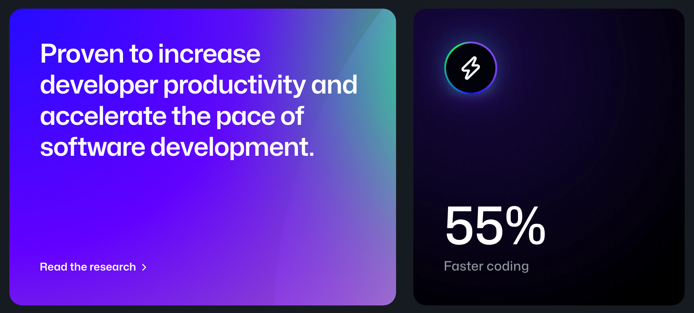
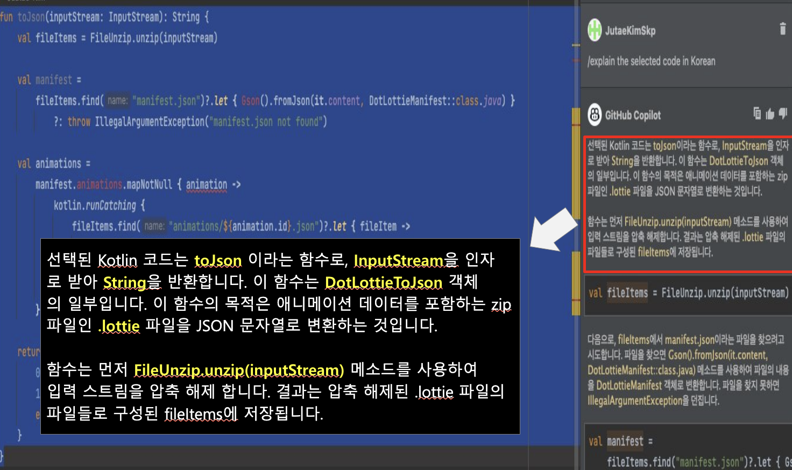

여러분은 업무에서 GitHub Copilot(이하 '코파일럿'으로 명명) 등 AI-assisted Software를 얼마나 많이 사용하고 계신지요? :) 

SK플래닛에서도 이미 작년부터 코파일럿을 업무에 도입한 개발자들이 있었지만, 직무와 연차, 활용 용도에 따라 상이하게 사용하고 있었고 각자의 만족도도 달랐습니다. 따라서 당사는 2024년 4월부터 8월까지, 다양한 개발 업무에서 개발 생산성 향상 실험 및 사례 발굴 등의 활동을 진행하였습니다. 본 글은 이 활동을 회고하고 사례를 정리한 '코파일럿 활용기' 성격으로 작성하였사오니 함께 참고 부탁드립니다.  

참고로 SK플래닛에서 사용한 코파일럿 버전은 'Copilot for Business' 이며, 당사의 사업 및 개발 분야는 아래를 참조하시기 바랍니다. 

* 사업 소개: https://www.skplanet.com/
* 개발 분야: https://techtopic.skplanet.com/

## 1. 코파일럿 활용 개요 
---
이번 '코파일럿 활용'의 목표는 (1) 코파일럿의 다양한 활용 사례를 정리하여 구성원에게 공유하는 것과 (2) 코파일럿이 개발업무 생산성에 미치는 영향을 정량적으로 측정하여 비교하는 실험을 포함하였습니다(~~좀 어려웠...~~). 또한 (3) 많이 사용되는 백엔드, 프론트엔드 개발 외에도 데이터, 인프라, 블록체인 개발자에 대한 피드백을 함께 받아 다양성을 높이고자 하였습니다. 

(아시는 것처럼, 코파일럿 사이트에 가보면 '55% Faster coding' 및 개발자 생산성 증가와 함께 소프트웨어 개발 페이스를 가속화할 수 있음이 증명되었다는 문구가 있습니다. 과연 이 숫자가 나올 것인가? 두둥~~)

(출처: GitHub Copilot 웹사이트, https://github.com/features/copilot)

이를 위해 먼저, 3월에 외부 전문가를 초빙하여 생성형 AI 기반 Coding에 대해 최근 기술 트렌드를 공유하고 눈높이를 맞추었습니다(주제: 실리콘밸리 개발자가 바라보는 AI 생산성 툴 및 개발 방식의 변화, 연사: 한기용 Upzen 대표). 본 세미나에 대한 요약은 다음 글을 참고하시기 바랍니다 => https://techtopic.skplanet.com/genai-productivity/

4월에는 Kick-off meeting을 통해 취지를 설명하고 2개의 내부 사용자 그룹을 구성하여 업무 도입 및 활용 사례를 정기적으로 공유하였습니다. 그룹 1은 SDE(백엔드, 프론트엔드, Android/iOS 앱 개발), Web3 개발 중심으로 구성하였고, 그룹 2는 Data Engineer, 인프라 개발자 중심으로 총 30명의 사내 개발자가 참여하였습니다. 
 

## 2. 코파일럿 활용 
--- 
코파일럿은 아시는 것처럼 생성형 AI 기반 코드 작성 도구로, 코드 자동완성 및 추천, 언어간 전환 기능, 코드 수정 기능(리팩토링, 오류 수정), 코드 설명 등의 다양한 개발 업무에 도움을 줄 수 있습니다. 이를 전통적인 자동 완성 기능과 비교할 경우 다음과 같은 차이가 있습니다. 

(1) 자동 완성은 사전(dictionary)을 참조하는 Syntax 기반의 자동 완성으로, 문법의 오류를 방지하고 타이핑을 줄여주는 정도의 수준입니다. 글쓰기에 비유하면 '맞춤법 검사기 + 단어 자동완성' 수준으로 볼 수 있습니다. 

(2) 반면 코파일럿은 개발자의 의도에 따른 소스 코드 생성, 자연어 프롬프트 기반의 로직 생성 및 개발자 의도 예측에 따른 로직 생성이 가능합니다. 글쓰기에 비유하면 '스토리를 스스로 생성하는 수준' 으로 볼 수 있습니다. 

그럼 좀더 자세히 활용 사례를 보도록 할까요? :) 

#### A. 자연어 to Code (코드 생성) 

코파일럿에서 가장 직관적이고 많이 활용하는 기능 중 하나는 '자연어 to Code(코드 생성)' 기능입니다. 
코드 생성/작성은 (1) API 명세로부터, (2) 주석으로부터, 그리고 (3) 함수 이름으로부터 코드를 작성할 수 있습니다. 

코파일럿은 주석(Comment) 형태의 API 명세로부터 코드를 생성합니다. 

코파일럿은 주석(Comment)에 프롬프트를 입력할 수 있으며, 출력으로 코드를 작성합니다. 

코파일럿은 함수 이름으로부터 내용을 '추론'하여 이에 부합한다고 판단되는 코드를 생성합니다. 

 

#### B. 개발자 의도 분석 후 추천 (자동 완성) 

코파일럿은 개발자의 의도를 분석한 후 코드를 추천(Code Suggestion)해 줍니다. 코드를 추천받기 위해서는 (1) 작성된 코드 패턴으로부터 데이터 자동 완성, (2) 전체 로직에 대한 '이해' 에 기반한 로직 작성 등이 있으며, (3) Server API 작성 후, Client Code를 코파일럿이 자동으로 작성해 주기도 한데 결과는 괜찮았다고 합니다. 

상단에 주석(Comment) 형태로 원하는 도시를 나열하고, label과 value 예시를 하나 제시하면(one-shot learning) 나머지 데이터를 자동 완성해 줍니다. 

아래 사례는 전체 Logic에 대해 코파일럿이 '이해'하고 다음 코드의 Logic을 추천해 주는 사례입니다.
logData 중 특정 조건에 충족하는 로그의 갯수를 구하고 lineData에 넣도록 하는 의도를 가지고 코딩을 시작하였는데, 코파일럿은 그 의도에 부합하는 코드들 제안합니다. 

 
Server API를 작성하면, 코파일럿은 Client Code를 자동 생성해 줍니다. 

(참고: Server API Code는 다음과 같습니다)

 

#### C. Copilot Chat 코드 리팩터링

개발자들은 코드 리팩터링(Refactoring) 업무를 많이 수행하는데요, Copilot Chat 기능을 통하여 리팩터링 업무에 도움을 받을 수 있습니다.
Copilot Chat은 (1) 간단한 표현 축약, (2) Method 단위의 코파일럿 특유의 리팩토링 기능을 제공합니다. 

다음 그림은 왼쪽의 코틀린 코드를 오른쪽과 같이 축약해 주는 사례인데, 중급 이상 코틀린 코드에 숙련된 개발자가 보기에도 만족도가 높은 코드를 생성해 주었습니다. 

Method 단위의 리팩터링 수행도 코파일럿을 통해 가능합니다. 코파일럿은 중복 코드를 Method로 만들어 가독성과 재사용성이 향상된 코드를 생성하였습니다.  

#### D. Copilot Chat을 활용한 레거시 코드 분석 및 문서화

Copilot Chat을 활용하여 레거시 코드의 특정 영역에 대해 설명을 요청할 경우 좋은 답변을 받을 수 있습니다. 
이 경우 /explain 명령어를 사용합니다. 이 기능은 단순한 코드 라인별 주석의 총합을 생성하는 것이 아니라 코드 블록의 의도와 목적, 그리고 그 목적을 수행하는 절차까지 상세한 설명을 해 주는 것을 볼 수 있습니다. 

또한 해당 코드에 대한 문서화도 Javadoc 스타일로 잘 작성해 줍니다(/doc 명령어 사용). 

#### E. Copilot Chat Test 작성 활용 사례 

Copilot Chat을 활용하여 테스트 코드도 작성할 수 있습니다. 무엇을 사용하여 작성할지(예: JUnit 5, assertJ 3 등) 및 다양한 조건을 프롬프트로 전달합니다(예: Test Coverage 100% 달성). 

#### F. 기타 개발 사례 - 개발언어 번역, 오류 수정 등 

그밖에서 코파일럿에서 개발언어 번역(변환)기능도 제공합니다.  아래는 Java 언어로 작성된 버블 소팅 코드를, 동일 기능을 하는 Golang 코드로의 간단한 변환 사례입니다. 

Copilot Chat에 프롬프트로 오류 수정 명령을 내릴 수도 있습니다(아래 참조). 

#### G. 데이터 분석 및 처리 활용 사례

Database 대량 스키마 변경 작업 시 코파일럿을 사용하면 극적인 생산성 향상을 보일 수 있습니다. 올해 당사 데이터 시스템의 테이블 및 컬럼 comment를 작성해야 하는 경우가 있었는데요, 대상 테이블 약 200개, 컬럼 약 5천개를 커버하는 코멘트를 자동 생성하여 작업 시간을 단축하였습니다(2일 분량 작업을 약 2시간만에 해결). 

Copilot Chat 대화창에 전체 테이블 scheme 파일(scheme.sql) 등록 후 프롬프트를 요청할 수 있으며, 

전체 테이블의 column을 해석 및 추론하여 comment를 등록해 주는 alter SQL문을 생성해 줍니다.
이 경우 예를 들어 '11st'와 같이 축약된 단어는 '11번가'로 자동 추론을 해 줍니다. 위 과정을 반복할수록 자동 생성된 코멘트의 정확도가 향상되는 것을 경험하였습니다.

LLM fine tuning을 위한 학습 데이터 생성 테스트를 진행하였습니다. 코파일럿에 샘플 데이터를 복사 후 질문-답변 생성을 요청하였는데요, 데이터뿐만 아니라 생성된 질문-답변을 생성하는 Python script를 함께 생성해 주었습니다. 

## 3. 코파일럿이 생산성에 미치는 영향
---
코파일럿이 개발자의 업무 생산성에 미치는 영향을 Microsoft의 실험 결과와 SK플래닛 사례를 함께 소개하고, 이를 비교한 결과를 함께 공유합니다.  

#### A. Microsoft 실험 결과 리뷰

2023년 2월 Microsoft에서 발표한(참고: GitHub은 Microsoft의 자회사입니다) 'The Impact of AI on Developer Productivity: Evidence from GitHub Copilot' (링크) https://arxiv.org/pdf/2302.06590 논문에 소개되었던, 코파일럿의 생산성 효과를 검증하기 위한 두 가지 실험(A/B testing)을 소개합니다.  

첫 번째로는 과제 완료시간 대비 완료자 비율에 대한 시간 관점의 생산성 효과 실험으로, 코파일럿 사용 시 약 2배의 개발 속도 향상이 있었습니다. 

* 실험 조건: JavaScript로 HTTP Backend 를 구현하는 것
* 대상자: 코파일럿 사용자 및 미사용자 각각 35명 참여 
* 실험 결과: 완료 시간을 55.76% 단축 => 개발 속도를 약 2.26배 개선 (사용자 평균: 71.17분, 미 사용자 평균: 160.89분) 

코파일럿 사이트의 '55% Faster coding' 는 이 논문을 근거로 하고 있는 것 같습니다 ^ ^ 

두 번째는 코파일럿 가격 대비 지불 의사가 있는 사용자의 비율에 대한 선호도 실험으로, 실제 사용 경험이 있었던 기존 사용자가 코파일럿의 효용성을 더 느끼는 것으로 나타났습니다. 

* 실험 조건: 코파일럿 사용자
* 대상자: 기 사용자 그룹 및 '코파일럿 1분 소개영상' 시청자 각각 35명 대상으로 설문 조사 
* 설문 내용: 출시 알림을 받고 싶은 최대 월 사용료 
* 실험 결과: 실제 사용 경험이 있는 경우 코파일럿의 효용성을 더 느낌 (사용자 평균 월 USD 27.25, 미사용자 평균 월 USD 16.91) 

#### B. SKP 자체 측정 결과 

SK플래닛에서도 코파일럿의 개발 생산성 효과 관련 실험을 진행하였는데요, 코파일럿 사용 여부에 따른 실무 과제 완료 시간을 측정해서 유의미한 결과를 도출해 보고자 하였습니다. 별도의 측정용 과제를 만들어 수행하기에는 업무가 '바빴기' 때문에 기존 업무 내에서 수행하는 과제를 중심으로 앞서 정의한 두 개의 사용자 그룹별로 동일한 실험을 수행하였습니다. 아래는 그 실험조건 및 결과입니다. 

다수의 SDE(Software Development Engineer)와 Web3 개발자로 구성된 그룹 1에서는 다음과 같이 실험을 진행하였습니다. 

* 실험 조건: 현업 과제 중 난이도 '중(Middle)' 에 해당하는 측정 요건 선정
* 대상자: 코파일럿 사용자 및 미사용자 각각 16개 및 18개 요건 측정 
* 실험 결과: 완료 시간을 약 41.7% 단축하였으며, 개발 속도를 약 1.71배 개선한 것으로 볼 수 있음 (55%까지는 아닙...)
* 기타: 코파일럿 사용 시 개발 속도 평균은 약 3.04시간(표준편차 1.3), 미 사용 시 평균은 5.21시간(표준편차 2.2)

다음은 그룹 1의 실험 결과입니다.

데이터 엔지니어, 인프라 및 일부 개발자들로 구성된 그룹 2의 실험 결과는 다음과 같습니다. 

* 실험 조건: 위와 동일 (난이도 중, 측정 요건 18개 선정)
* 대상자: 코파일럿 사용자의 업무시간 측정 및 미사용자 업무시간 추정  
* 실험 결과: 완료 시간을 약 40.7% 단축하였으며, 개발 속도를 약 1.68배 개선한 것으로 볼 수 있음
* 기타: 코파일럿 사용 시 개발속도 평균 4.05시간(표준편차 3.1)

다음은 그룹 2의 실험 결과입니다. 

두 그래프의 추이를 보면 파란색(코파일럿 사용자) 그래프가 왼쪽, 즉 시간이 적게 소요된 편으로 치우쳐 있음을 직관적으로 알 수 있습니다. 

#### C. 측정 결과 비교 
양 사의 측정 결과를 비교하면 다음과 같습니다(좀더 노오력하면 55%를 달성할 수 있을까요). 

측정 결과를 통해 개발속도 개선과 함께 완료시간 편차도 함께 고려를 하였는데요, 코파일럿을 사용할 경우 표준편차가 적게 나타났으며, 이는 개발자 숙련도(시니어 등)에 따른 완료시간의 차이가 적다는 것을 의미합니다. 즉 주니어나 새로운 과제/언어를 사용하는 '미숙련' 개발자에 대한 역량 보강(Augmentation) 효과를 코파일럿이 제공한다고 볼 수 있겠습니다. 

## 4. 코파일럿이 개발자 경험에 미치는 영향 
---
이번에는 코파일럿이 DevX(Developer Experience, 개발자 경험)에 미치는 영향을 공유합니다.
개발자 체감 생산성 변화 및 사용 선호도에 대한 설문 및 결과를 시각화한 내용이 포함되어 있습니다. 

#### A. 개발자 체감 생산성 변화 조사 

코파일럿이 개발 생산성에 어떤 영향을 미쳤는지 구성원 설문을 통하여 체감 생산성 개선 정도를 파악하였습니다(웬지 많은 분들이 예상할 수 있는 결과가 나온 것 같...)

* 매우 개선: 35.3%, 다소 개선 64.7% 으로 부정적인 의견은 (다행히도) 없었습니다. 
* 코파일럿 활용 분야는 주 개발언어 코딩, 정규식/SQL/Script 작성, 코드품질 개선의 순이었으며, 그 외에도 신규 언어 코딩, 테스트 코드 작성, 분석/번역을 수행하였습니다. 
* 코파일럿 활용을 통해 절약된 시간 활용은 요건을 더 많이 개발하거나 코드 개선, 기술 부채 해소 등 시간이 부족하여 수행하지 못한 개발 업무에 활용한 것으로 나타났습니다.

(덧. 위 '언어간 번역' 은 개발 언어간의 변환입니다. 영한번역이 아니에요 ^ ^) 

#### B. 사용 선호도 조사 

아울러 코파일럿의 도입 필요성, 미 사용 시 생산성 변화, 희망하는 도입 방식 등을 함께 조사하였는데요~

당장 도입해야 한다는 의견은 약 19%, 도입하면 도움이 될 것 같다는 의견은 약 68%로 약 87%의 개발자가 긍정적인 응답을 해 주셨습니다. 
코파일럿을 지금부터 사용하지 않게 될 경우, 내 업무 생산성 변화는 대부분이 다소 하락할 것이라는 의견을 주었습니다(85.7%).
코파일럿의 도입 방식는 사용자 대다수가 '사용 희망자가 신청하는 방식'을 선호하였습니다(89.3%). 
그 밖에 개발 용도로 한정할 때 사용을 희망하는 생성형 AI 소프트웨어의 순위는 코파일럿이 ChatGPT에 비해 근소한 우위를 나타냈습니다. 

## 5. 유의 사항 
---

ChatGPT 등 GenAI(LLM) 기반 소프트웨어에서 늘 유의해야 할 사항으로 언급되는 내용이 보안과 환각, 그리고 개발자의 역량에 대한 것입니다. 
코파일럿에서도 유사한 개념들이 적용됩니다. 

(1) 보안(Code Security)

* GitHub Copilot 비즈니스 버전은 보안 측면에서 중요한 기능을 강조하는데, AI 기반 보안 취약점 필터링 시스템을 통해 하드코딩된 자격 증명, SQL 삽입 등 일반적인 보안 취약점이 포함된 코드를 생성하지 않도록 합니다. 또한, GitHub Copilot 비즈니스 버전은 개발자의 코드를 학습 데이터로 사용하지 않기 때문에 기업 보안에 적합한 솔루션임을 설명하고 있습니다
* 참고: https://github.blog/news-insights/product-news/github-copilot-for-business-is-now-available/ 

(2) 환각(Hallucination)

* 코파일럿은 사용자가 원하지 않는 코드를 생성할 수도 있으므로, 이를 판별하고 수정할 수 있는 능력(또는 프로세스)이 필요합니다. 
* 코드에 대한 프롬프트를 정교하게 잘 질문할수록(manipulation) 내가 기대하는 답변을 얻을 '확률'이 높으므로, 개발자 도메인에서의 프롬프트 엔지니어링 능력이 함께 필요할 수 있습니다. 

(3) 개발 역량(Software Development Skills) 

* 몇몇 개발자들은 '내가 AI-assisted Software를 계속 쓰면 여기에 종속되어 코딩 실력이 줄어들지 않을까' 를 걱정하면서 코파일럿 같은 AI 툴을 일부러 사용하지 않기도 합니다. 
* 사용하시는 분들은 항상 활용하는 기능만 쓰는 것이 아니라, 그렇지 않은 분야/기능에 대해서도 활용 범위를 넓혀 가는 것도 중요한 것 같습니다(참고로 3월 저희 세미나에 등장한 실리콘밸리 개발자 인터뷰에서는 사내에 사례를 공유하거나 활용 교육이 필요할 수 있다고 언급하였음). 

(4) 기타 

* iOS 앱 개발 환경은 아직 잘 지원하지 않습니다(사용할 수 있는 Extension은 있습니다). 
* Web3 개발에 많이 사용되는 솔리디티 프로그래밍에서는, 블록체인의 특성상 코드가 한번 저장되면 수정이 어렵기 때문에 아직은 코파일럿을 활용하는 데 제약이 많다고 합니다.

## 6. 결론 
---

GitHub Copilot(이하 '코파일럿')은 개발 생산성 관점에서, 개발자의 경험 관점에서 개발자에게 많은 유익을 제공해 줍니다. 
또한 개발 패러다임 관점에서도 AI-assisted Coding (또는 Prompt-based Coding)이 미래의 코딩 형태에 부합하는 것으로 여러 전문가들이 언급하고 있는 바, 더 많은 IT기업에서의 활용이 늘어날 것으로 예상합니다. 

우리의 업무가 바퀴를 만드는 업무도 있겠지만, 이미 잘 만들어진 바퀴(도구)를 잘 활용하여 기업의 목표를 빠르고 퀄리티 있게 달성할 수 있다면 '한번 써보는 것도' 어떨까요? 
(물론 우리가 사용할 바퀴도 함께 개선되면 더욱 좋겠지요 ^ ^) 

읽어 주셔서 감사합니다! 
