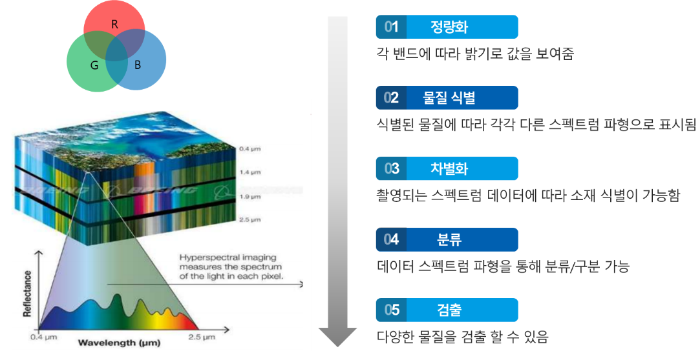

초분광 기술은 초분광 센서를 활용하여 사람이 볼 수 있는 가시광선과 볼 수 없는 적외선, 자외선까지 빛을 세부적으로 분해하고 데이터화하는 것입니다.   
이러한 초분광 기술에 AI를 접목하면, 생산공장에서 품질관리, 불량품 검출, 공정 자동화 등 다양한 영역에 적용할 수 있습니다.   
SK Planet은 초분광 기술에 자체적으로 개발한 AI를 접목하여 사업화를 하고 있으며, 이와 관련된 몇 가지 상용 사례를 소개하고자 합니다.

## 초분광 기술 개요
초분광 기술은 사람이 눈으로 볼 수 있는 R, G, B의 가시광선 영역을 포함하여 적외선, 자외선 영역의 빛을 세부적으로 분해하는 것입니다. 초분광 카메라는 공간 정보와 분광 기술을 더해 각 파장대의 밴드를 세분화하여 3차원 데이터를 생성합니다.  
특히, 초분광 기술은 각 이미지 픽셀을 조밀한 연속적인 스펙트럼 정보로 표현하여 데이터 큐브¹ 형태로 구성합니다. 데이터 큐브에 저장된 데이터를 통해 객체의 상태, 구성, 특징, 변이를 도출하여 객체를 식별하거나 객체의 결함 정도를 측정할 수 있습니다.   
모든 물체는 사람의 손금과 같은 고유한 스펙트럼을 가지고 있는데, 초분광 기술은 이러한 특징을 활용하여물체를 식별할 수 있습니다. 따라서 사람의 눈으로 보지 못하는 영역의 정보를 얻을 수 있는 기술입니다.

초분광 기술의 주요 응용 분야는 제조(2차 전지, 제약, 식품 등), 국방, 환경, 문화재 등의 영역에서 물체 식별, 결함 검출 등의 목적으로 많이 사용됩니다. 이러한 초분광 기술에 AI 기술을 접목하면, 기존 대비 훨씬 좋은 성능의 기능을 구현할 수 있습니다.   
먼저, 초분광과 AI를 활용한 솔루션 구조를 보면 광원을 통하여 반사되는 물질의 고유한 스펙트럼을 초분광센서를 통하여 데이터 큐브 형태로 취득하게 됩니다. 이후 현장 데이터 수집 장치에 저장한 후, 각 AI 모델이 우리가 얻고자 하는 결과물에 부합하는지를 판단합니다.  

시스템 구조를 보면 광원, 초분광센서, 자동화 설비, 현장 데이터 수집장치, AI Cloud 모델로 구성됩니다.   
여기에서 데이터 큐브는 많은 공간 및 스펙트럼 정보를 포함하는 수십~수백 메가바이트의 대용량으로 구성됩니다. 이것은 대기 및 기하학적인 왜곡 등 물리적인 요인뿐만 아니라 데이터의 혼합된 픽셀, 인접 대역과 높은 상관관계로 인한 데이터의 중복성, 초분광 시그니처²의 가변성 그리고 차원의 저주³와 같은 요인으로 초분광 데이터 분석을 어렵게 합니다.   
이후 초분광 데이터에서 의미있는 정보를 얻기 위해서는 데이터 수집, 데이터 큐브의 생성, 초분광 데이터 처리, 특징값 추출의 과정을 거칩니다.  

주된 데이터 처리 과정은 분류⁴(Classification)와 군집화⁵(Clustering)이며, 분류는 식별된(Labeled) 데이터로 모델을 학습하여 입력 데이터가 무엇인지를 판단하는 것이고, 군집화는 비식별된(Unlabeled) 데이터를 특성이 같은 것끼리 그룹화하는 것입니다. 

딥러닝을 이용한 분광공간 분류기는 심층 신경망을 통해 더욱 함축(Abstract)된 특징값을 추출함으로써, 입력 데이터에서 국소 지점의 변화에 둔감하도록 학습합니다.
Stacked Auto-Encoder(SAE)나 Deep Belief Network(DBN) 알고리즘은 비식별 데이터의 군집화를 위해 주로 사용되며, 초분광 데이터 분석에서는 입력값 특징을 추출하고 차원을 줄이기 위해 절차입니다. 이의 기본 구조는 SAE/DBN의 은닉층에서 학습을 통해 입력된 초분광 데이터의 특징값을 추출하고, 출력단에 로지스틱 회귀(LR: Logistic Regression) 분류기 등을 연결하여 분류합니다.

CNN(Convolutional Neural Network) 기반의 분광공간 분류기는 기 식별된 정보를 바탕으로 모델을 학습하여 초분광 데이터를 분류하는 것이며, 각 픽셀 단위의 1차원 초분광 데이터를 입력하는 1D-CNN, 임의 공간 단위의 초분광 데이터를 전처리하여 입력하는 2D-CNN, 전처리 없이 초분광 원본(Raw) 데이터를 입력하는 3D-CNN이 있습니다.  

2D-CNN에서의 전처리는 초분광 데이터 분석에 유용한 공간 정보나 분광 정보를 학습에 추가하여 분류 성능을 높이기 위한 것이고, 전처리 방법으로 전통적인 머신러닝 알고리즘인 PCA(Principal Component Analysis)를 이용하는 PCA-CNN, Gabor-CNN 등이 있습니다.  

최근에는 CNN에 시간적 변화를 분석하는 Recurrent CNN도 연구되고 있습니다. 이는 분광공간의 특징값 변화를 시간에 따라 학습하는 방법으로, 이를 이용하여 특정 지역에서 객체의 변화 추이를 관찰할 수 있습니다.  

라벨링이 되어 있는 샘플을 초분광 센서를 통해 데이터 큐브를 생성시켜 이를 활용하여 학습하고 AI 모델을 생성합니다. 생성된 AI 모델은 생산 중 분류 및 검출을 진행하고, 정의되지 않은 분류 및 이물질이 검출될 때마다 업데이트됩니다.  

## 초분광 기술 적용 사례
초분광 기술이 적용되는 대표적인 분야는 생산 공정으로 불량 검출, 품질관리, 프로세스 모니터링, 자동화 및 로봇 시스템 등 입니다.    

> * 불량 검출: 다양한 파장 대역에서 물체를 촬영하여 제조 과정 중에 생기는 불량을 탐지합니다. 예를 들어, 제품의 표면 또는 내부에서 결함이나 불균일성을 감지합니다.
> * 품질 관리: 제조 공정에서 원료의 품질을 평가하는데 사용됩니다. 원료의 화학적 구성, 성분, 농도 등을 분석하여 제품의 품질에 영향을 미치는 요소를 파악합니다.
> * 프로세스 모니터링: 제조 공정 중에 발생되는 화학 반응, 온도, 압력 등의 변수를 실시간으로 모니터링하는데 사용됩니다. 이를 통해 제조 과정의 안정성을 평가하고 문제 발생시 조치를 취할 수 있습니다.
> * 자동화 및 로봇 시스템: 자동화 및 로봇 시스템에 통합시켜 제조 공정을 자동화하는 데에도 활용됩니다. 예를 들어 제품의 크기, 모양, 색상 등을 식별하여 로봇이 자동으로 제품을 분류하거나 검사할 수 있습니다.

### 2차 전지 생산 공정 
좀 더 구체적인 적용 사례로 2차 전지 생산 공정을 보겠습니다. 2차 전지 생산에서 최근 많이 상용화된 양극활물질은 용량과 수명이 우수한 물질이지만 합성이 어렵습니다.  
기존 하루 이상 걸렸던 완제품의 샘플 테스트를 초분광 기술을 활용하여 10여분 이내의 전수 검사가 가능합니다. 또한 제품 개발에 있어서 실시간으로 원료의 함량과 원료의 순도 등을 검출하는데 도움을 줄 수 있습니다.

* 스펙트럼 분석: 초분광 카메라는 다양한 파장 대역에서 물체를 촬영할 수 있습니다. 이를 통해 이물질의 스펙트럼 특성을 분석하여 다른 물체와 구별할 수 있습니다. 예를 들어, 제품 내에 있는 이물질의 스펙트럼을 사전에 수집하고 분석하여, 제품 검사 시에 해당 스펙트럼과 일치하는 이물질을 식별할 수 있습니다.
* 이미지 분류: 초분광 이미지는 픽셀 단위로 다양한 스펙트럼 정보를 포함하고 있습니다. 이를 활용하여 이물질 검출을 위한 이미지 분류 알고리즘을 개발할 수 있습니다. 기계 학습을 활용하여 이미지 데이터를 학습시킨 후, 새로운 이미지에서 이물질을 자동으로 검출할 수 있습니다.
* 이물질 스펙트럼 라이브러리: 다양한 종류의 이물질에 대한 스펙트럼 데이터를 수집하여 라이브러리를 구축하는 것입니다. 제조 공정에서 이물질을 검출해야 할 때, 이물질의 스펙트럼을 실시간으로 측정하여 라이브러리와 비교하여 일치하는 이물질을 식별합니다.
* 데이터 처리 및 알고리즘: 초분광은 많은 양의 데이터를 생성합니다. 이를 효과적으로 처리하고 분석하기 위해 데이터 처리 기술을 활용해야 합니다. 데이터 전처리, 특징 추출, 분류 및 검출 알고리즘 등을 적용하여 이물질을 검출하는 정확도를 높일 수 있습니다.

### 식품 생산 공장 
초분광 기술은 각종 식재료가 들어가는 후레이크나 분말 가루의 이물질을 찾아 낼수 있습니다. 기존 정형화된 이물질(금속, 고무)에서 비정형화된 이물질까지 찾아낼 수 있습니다. 또한 비닐을 투과할 수 있기 때문에, 포장되어 있는 즉석식품 내 이물질을 확인 할 수 있습니다.

* 데이터 수집: 분류를 위해 적절한 데이터를 수집해야 합니다. 초분광 카메라를 사용하여 대상물체의 다양한 파장 대역에서 이미지를 촬영합니다. 이렇게 촬영된 이미지는 다차원 데이터로서, 각 픽셀은 다양한 스펙트럼 정보를 가지고 있습니다.
* 데이터 전처리: 수집한 초분광 데이터를 분류 작업에 적합하도록 전처리해야 합니다. 전처리 과정에는 노이즈 제거, 스펙트럼 정규화, 차원 축소 등이 포함될 수 있습니다. 목표는 데이터를 정리하여 중요한 정보를 유지하면서 불필요한 정보를 제거하는 것입니다.
* 특징 추출: 전처리된 데이터로부터 특징을 추출합니다. 초분광 데이터는 많은 수의 밴드(파장 대역)를 가지고 있어서 특징 추출이 중요합니다. 통계적인 방법이나 주성분 분석(PCA) 등을 사용하여 특징을 선택하거나 추출합니다.
*	분류 모델 학습: 추출된 특징을 사용하여 분류 모델을 학습시킵니다. 지도 학습 방법을 사용하여 데이터에 대한 레이블(정답)을 제공하고, 학습 알고리즘이 클래스를 예측하도록 합니다. 대표적인 분류 알고리즘으로는 지원 벡터 머신(SVM), 결정 트리, 신경망 등이 있습니다.
* 모델 평가: 학습된 분류 모델의 성능을 평가합니다. 이를 위해 테스트 데이터 세트를 사용하여 모델의 예측 결과를 검증합니다. 정확도, 정밀도, 재현율 등의 평가 지표를 사용하여 모델의 분류 성능을 평가합니다.
* 적용 및 개선: 학습된 분류 모델을 실제 적용하고, 필요에 따라 모델을 개선합니다. 추가적인 데이터 수집, 특징 추출 방법 변경, 분류 알고리즘 변경 등을 고려하여 모델의 성능을 향상시킬 수 있습니다.

### 플라스틱 분류 
분리 수거된 플라스틱을 재활용하기 위해서는 종류별 분류가 선행되어야 합니다. 현재는 대부분 수작업으로 분류하지만 속도와 정확성이 떨어집니다. 이를 초분광 센서과 AI 모델을 활용하여 빠르고 정확한 분류가 가능합니다. 

## 시사점

* 상세한 정보 제공: 다양한 파장 대역에서 물체를 촬영하여 매우 상세하고 다차원의 정보를 제공합니다. 이를 통해 물체의 성질, 구성 요소, 화학적 특성 등을 정밀하게 파악할 수 있습니다. AI 알고리즘과 결합하면 이러한 다차원 데이터를 효과적으로 분석하고 해석할 수 있습니다.
* 자동화 및 효율성 향상: 제조 공정이나 농업 등 다양한 분야에서 자동화와 효율성을 향상시키는 데에 사용될 수 있습니다. 예를 들어, 제품의 불량을 자동으로 검출하거나 모니터링할 수 있습니다. 이를 통해 인력 및 시간을 절약하고 생산성을 향상시킬 수 있습니다.
* 정확한 판단과 예측: 정교한 패턴 인식과 예측을 가능하게 합니다. 다양한 데이터를 학습하여 패턴을 인식하고, 이를 기반으로 예측 모델을 구축할 수 있습니다. 이를 통해 제조 공정에서 정확성을 높일 수 있습니다.
* 실시간 모니터링과 대응: 실시간으로 데이터를 수집하고 분석할 수 있어 실시간 모니터링과 대응이 가능합니다. 제조 공정에서 발생하는 문제나 이상을 빠르게 감지하고 조치를 취할 수 있습니다. 이를 통해 생산 공정의 안정성을 유지하고 잠재적인 문제를 예방할 수 있습니다.

### 용어 설명
1. 데이터 큐브: 초분광 데이터를 취득하면 데이터 파일과 헤더 파일을 얻게 됩니다.
데이터 파일은 BSQ, BIL, BIP 3가지 형식으로 저장되고, 헤더 파일은 데이터 형식, 타입, 라인수, 픽셀수, 밴드수등 데이터 파일을 해석할 수 있는 파일
> * BSQ : Band-Sequential
> * BIL : Band-Interleaved-by-Line
> * BIP : Band-Interleaved-by-Pixel
2. 데이터 시그니처: 물질별 상이하게 나타나는 고유 스펙트럼의 특성
3. 차원의 저주: 일상 경험의 3차원 물리적 공간과 같은 저차원 환경에서는 발생하지 않는 고차원 공간에서 데이터를 분석하고 정리할 때 발생하는 다양한 현상
4. 분류: 기존에 존재하는 데이터의 Category 관계를 파악하고, 새롭게 관측된 데이터의 Category를 스스로 판별하는 과정
5. 군집화: 데이터들의 특성을 고려해 데이터 집단(클러스터)을 정의하고 데이터 집단의 대표할 수 있는 중심점을 찾는 과정
