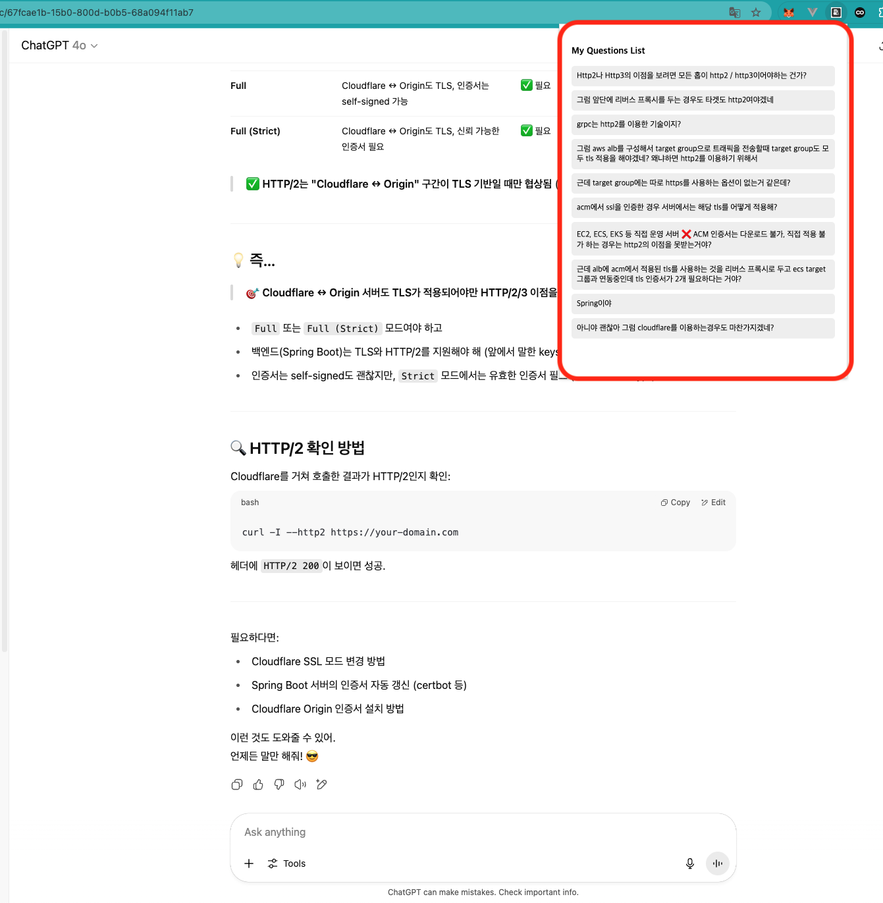
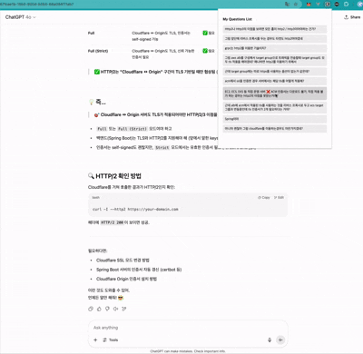
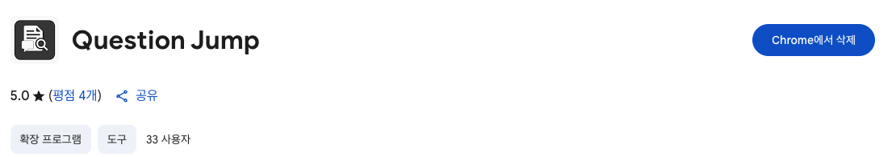

안녕하세요. SK플래닛에서 Web3 서비스의 백엔드를 담당하고 있는 원준수라고 합니다.  
ChatGPT를 사용하면서 겪었던 불편함을 해결한 경험을 공유하고자 합니다. 
GPT와 대화를 계속해서 진행하다 보면, GPT의 응답이 길어지면서 이전에 했던 질문과 그에 대한 답을 찾는데 스크롤을 많이 올려야 하는 상황이 많이 발생하였습니다.  
CTRL+F를 통해서 키워드 검색을 하려고 하더라도 해당 키워드가 너무 많았기 때문에 역시 질문에 대한 히스토리를 찾는 것에 불편함을 느꼈습니다. 
위 상황을 개선하고자 크롬 익스텐션을 개발하여 문제를 직접 해소한 경험을 공유하고자 합니다.

## 문제가 무엇이고 어떻게 문제를 해결할 것인가? 
---
 

**문제 사항** 

* 내가 한 질문에 대한 모음을 찾아보고 싶음
* GPT와의 대화가 길어지면서 이전 질문에 대한 답변을 찾아보는 게 어려움

**해결 방안**

* 내가 질문한 모음을 한눈에 파악할 수 있는 UI 구성
* 질문했던 내용으로 바로 이동 가능한 기능 구성

**문제 해결**

* 내가 한 질문에 대한 모음 보기 - 지금까지 했던 질문들을 한눈에 볼 수 있는 페이지를 구성하였습니다.   
    
* 이전 질문에 대한 답변 바로가기 - 이전 질문을 클릭하면 해당 질문으로 바로 이동하도록 구성하였습니다.   
    

## 크롬 익스텐션 등록
---

작성한 크롬 익스텐션을 정식으로 등록해 보겠습니다.  
[Chrome Web Store](https://developer.chrome.com/docs/webstore)   
Developer Dashboard에 접속해 스토어 등록정보를 작성하고 구글의 승인을 기다리면 됩니다. 
해당 확장 프로그램의 경우 사용자의 정보를 필요로 하지 않기 때문에 하루만에 승인이 났습니다. 

   
[확장 프로그램 링크](https://chromewebstore.google.com/detail/kiookecbjpjlmlfcjjfjlnlgopcfjako?utm_source=item-share-cb)

 

## 마무리
---

아이디어를 GPT에게 제공하여 빠르게 프로그램을 구현할 수 있었습니다.  
AI 덕분에 아이디어를 실체화하는 속도가 빨라진 것을 느꼈고, 더 잘 사용해봐야겠네요. 

 