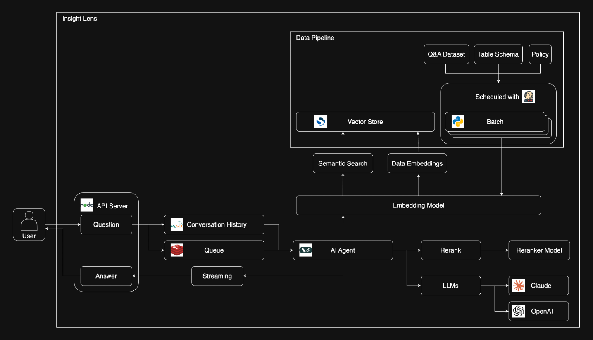
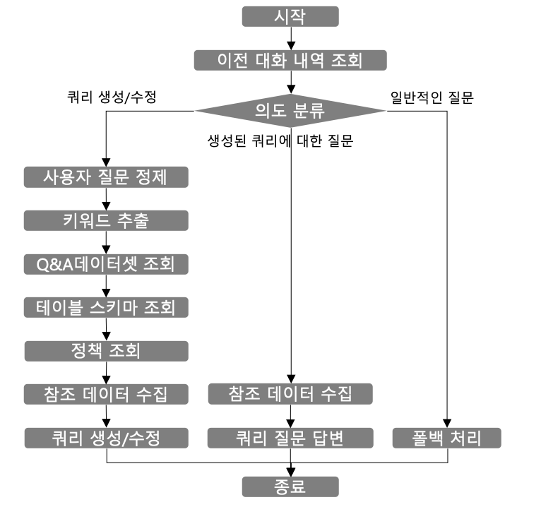
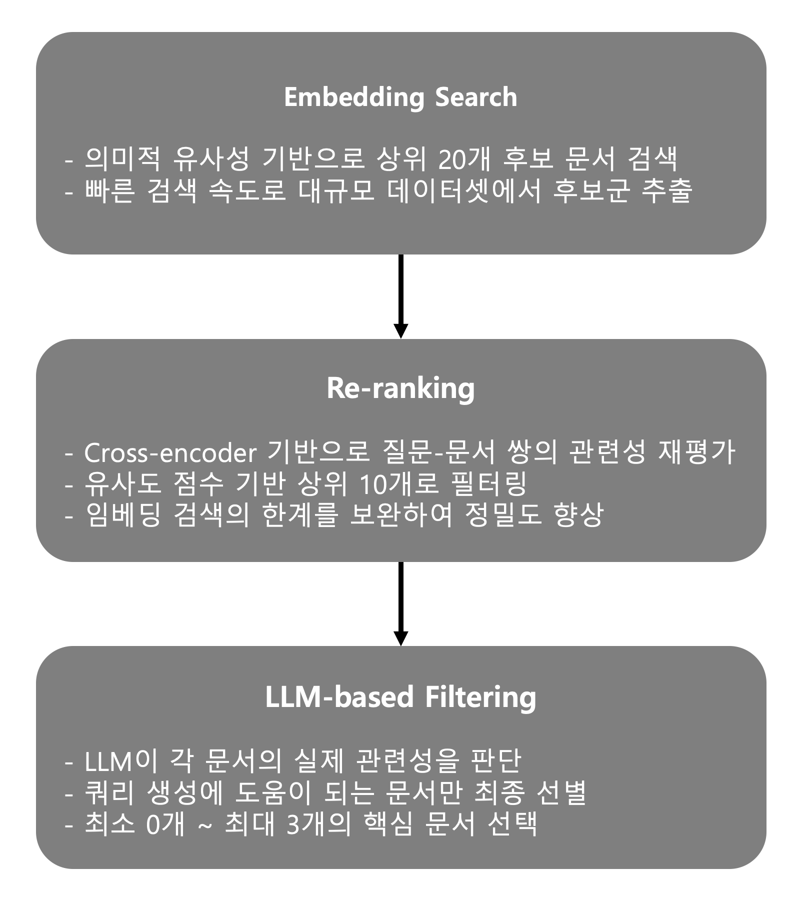

오늘날 기업 환경에서 데이터 기반 의사결정의 중요성은 아무리 강조해도 지나치지 않습니다. 기획자, 마케터, 운영 담당자 등 비개발 직군에서도 데이터 조회에 대한 니즈가 급증하고 있으며, 원하는 시점에 원하는 데이터를 얼마나 빠르게 확보할 수 있느냐가 비즈니스 경쟁력을 좌우하는 시대가 되었습니다.


하지만 기존 데이터 추출 프로세스를 살펴보면, SQL에 익숙하지 않은 현업 담당자들은 데이터 분석팀에 추출 요청을 하고, 요구사항을 명확히 하기 위해 여러 차례 피드백을 주고받으며, 그제서야 원하는 결과물을 받을 수 있습니다. 이 과정에서 발생하는 시간적 지연과 커뮤니케이션 비용은 조직 전체의 생산성을 저하시키는 주요 요인이 됩니다.


이러한 비효율을 해소하고 **데이터 인사이트**를 실현하기 위해 저희 팀에서는 **InsightLens**라는 Text2SQL 기반 서비스를 개발했습니다. InsightLens는 LLM과 검색증강생성(RAG, Retrieval-Augmented Generation) 기술을 결합하여, 사용자가 자연어로 질문하면 실행 가능한 SQL 쿼리를 자동으로 생성해주는 AI 에이전트입니다. 이 글에서는 InsightLens의 개발 배경부터 에이전트의 설계, 그리고 개발 과정에서 얻은 기술적 인사이트까지 공유드리겠습니다.


---

# Text2SQL이란?


**Text2SQL**은 사용자가 입력한 자연어 질문을 데이터베이스에서 실행 가능한 SQL 쿼리로 변환하는 기술입니다. 이 기술의 핵심은 자연어 처리와 데이터베이스 스키마에 대한 이해를 결합하여, 사람의 의도를 정확하게 파악하고 이를 구조화된 쿼리 언어로 번역하는 데 있습니다.

이 기술을 통하면 SQL에 익숙하지 않은 현업 담당자도 자연어만으로 데이터를 조회할 수 있어, **데이터 인사이트** 실현에 큰 역할을 합니다. 더 이상 데이터에 접근하기 위해 개발자나 데이터 분석가의 도움을 기다릴 필요가 없어지는 것입니다.


## 기대 효과


- **접근성 향상**: SQL 문법을 모르는 사용자도 자연어만으로 복잡한 데이터 조회가 가능해집니다. 이는 조직 내 데이터 활용 범위를 확대시킵니다.

- **업무 효율화**: 기존에 며칠씩 소요되던 데이터 추출 요청-피드백 사이클을 몇 분 내로 단축할 수 있습니다. 데이터 분석팀은 반복적인 추출 업무에서 벗어나 더 가치 있는 분석 업무에 집중할 수 있게 됩니다.

- **인사이트 발굴**: 실시간 데이터 조회가 가능해지면서 현업 담당자들이 궁금한 순간에 바로 데이터를 확인하고, 이를 바탕으로 빠른 의사결정을 내릴 수 있습니다.

- **비즈니스 임팩트**: 궁극적으로 서비스 품질과 고객 만족도 향상으로 이어지며, 데이터 기반의 민첩한 의사결정 문화가 조직에 정착됩니다.


---

# 검색증강생성(RAG, Retrieval-Augmented Generation)이란?


InsightLens가 단순한 “자연어 → SQL 변환기”가 아니라 **업무에 바로 쓰일 수준의 쿼리를 안정적으로 생성**할 수 있었던 핵심 배경은 **검색증강생성(RAG)** 입니다. RAG는 LLM이 답을 '상상해서' 만들기보다, **사전에 축적한 내부 지식(문서/스키마/예시 쿼리 등)을 먼저 검색(Retrieval)** 한 후, 그 결과를 근거로 답을 생성(Generation)하도록 만드는 패턴입니다.


## 왜 Text2SQL에 RAG가 필요한가?


Text2SQL은 LLM의 언어 이해 능력만으로도 어느 정도 동작하지만, 실무 환경에서는 다음 문제가 곧바로 드러납니다.

- **스키마/컬럼 환각(Hallucination)**: 존재하지 않는 테이블/컬럼을 그럴듯하게 만들어 쿼리를 작성
- **조인 관계 추정 오류**: FK(외래 키, Foreign Key) 관계나 조인 키를 추측해 잘못된 결과를 반환
- **도메인 규칙 누락**: “취소 제외”, “특정 코드값 매핑”, “파티션 처리” 같은 업무 규칙을 빠뜨림
- **조직별 표준 미준수**: 집계 기준, 기간 정의, 지표 산식 등 팀 내부 합의가 반영되지 않음
<br>

RAG는 이 문제들을 완전히 “해결”한다기보다, **LLM이 올바른 근거를 보고 생성하도록 유도해 실패 확률을 크게 낮추는 방식** 입니다.


## InsightLens에서 RAG가 작동하는 방식


InsightLens의 RAG 흐름은 간단히 다음 3단계로 이해할 수 있습니다.
<br>

1.**질문 정제 및 키워드/의도 파악**  

인사말·부연설명 등 노이즈를 제거하고, 검색에 유리한 형태로 질문을 정리합니다.
<br>

2.**Vector Store에서 관련 지식 검색(Retrieval)** 

정제된 질문과 키워드를 기반으로 다음과 같은 내부 지식을 검색합니다.

* 과거 유사 질문과 정답 SQL(Q&A 데이터셋)
* 테이블/컬럼 설명 및 관계(스키마)
* 파티셔닝, 코드값, 집계 규칙 등 정책/가이드(정책 데이터)

3.**검색 결과를 컨텍스트로 주입해 SQL 생성(Generation)** 

검색된 근거를 프롬프트에 넣고, 모델이 **“이 근거 범위 안에서만”** 쿼리를 작성하도록 제약합니다.  <br>
결과적으로 환각을 줄이고, 조직 규칙을 반영한 SQL을 안정적으로 생성할 수 있습니다.

---


# 개발 배경

## 기존 데이터 추출 프로세스의 문제점

InsightLens 개발을 시작하기 전, 저희는 기존 데이터 추출 프로세스가 어떻게 진행되고 있는지 분석하였습니다.

기존 데이터 추출 과정은 다음과 같은 단계로 진행되었습니다:

1. **요청 접수**: 현업 부서에서 분석지원 Jira 티켓을 통해 데이터 분석팀에 추출 요청을 등록합니다. 이때 요청 내용이 명확하지 않은 경우가 빈번했습니다.

2. **요구사항 조율**: 요청자와 담당자 간에 여러 차례 코멘트를 주고받으며 정확히 어떤 데이터가 필요한지, 어떤 기간의 데이터인지, 어떤 조건으로 필터링해야 하는지 등을 조율합니다.

3. **쿼리 작성**: 담당자가 관련 문서, 과거 히스토리, 테이블 스키마 등을 참고하여 복잡한 SQL 쿼리를 작성합니다. 이 과정에서 여러 테이블 간의 관계를 파악하고, 적절한 조인 조건을 설정하며, 비즈니스 로직에 맞는 필터 조건을 적용해야 합니다.

4. **결과 검토 및 수정**: 추출된 결과를 요청자가 검토하고, 예상과 다른 부분이 있으면 다시 피드백을 주고받으며 쿼리를 수정합니다.

단순한 데이터 추출 요청은 하루 이내에 처리될 수 있지만, 복잡한 비즈니스 로직이 포함되거나 여러 테이블을 조인해야 하는 경우에는 이 과정이 며칠씩 소요되기도 했습니다. 특히 담당자가 휴가 중이거나 다른 업무로 바쁜 경우, 대기 시간은 더욱 길어졌습니다.


## 이해관계자별 Pain Point


이러한 프로세스에서 각 이해관계자가 겪는 어려움을 정리하면 다음과 같습니다:

| 구분 | 문제점 |
|------|--------|
| **요청자 <br>(현업)** | 원하는 데이터를 받기까지 과정이 복잡하고 시간이 오래 걸립니다. 급한 의사결정이 필요한 상황에서 데이터를 기다려야 하는 답답함이 있으며, 데이터 추출 담당자에게 요청하는 것 자체가 심리적 부담이 되기도 합니다. |
| **담당자 <br>(개발/분석)** | 처음 받는 유형의 요청이거나 복잡한 케이스일 때 참조할 만한 문서가 부족합니다. 과거에 유사한 쿼리를 작성한 적이 있더라도 그 히스토리를 찾기 어렵고, 테이블 간의 관계나 컬럼의 의미를 파악하는 데 많은 시간이 소요됩니다. |
| **조직 <br>전체**  | 반복적인 커뮤니케이션으로 양쪽 모두의 업무 생산성과 집중도가 저하됩니다. 동일하거나 유사한 요청이 반복되더라도 매번 처음부터 처리해야 하는 비효율이 발생합니다. |


저희는 이러한 복잡한 과정을 LLM 기반의 AI 에이전트와 외부 지식을 검색해 AI의 생성 결과를 보강하는 RAG 기술을 통해 해결할 수 있지 않을까 고민하기 시작했습니다. 특히 **"성능이 뛰어난 프론티어 모델에 SQL 쿼리 생성에 필요한 적합한 데이터만 제공할 수 있다면, 복잡한 데이터를 조회하는 쿼리도 충분히 작성 가능하지 않을까?"** 라는 가설에서 InsightLens 개발이 시작되었습니다.

---

# PoC(Proof of Concept) 진행


본격적인 개발에 앞서, 저희는 가설을 검증하기 위한 PoC를 진행했습니다. AI 프로젝트에서 PoC 단계는 매우 중요합니다. 아무리 좋아 보이는 아이디어라도 실제 데이터와 환경에서 동작하지 않으면 의미가 없기 때문입니다. 저희는 약 2주간의 집중적인 PoC를 통해 기술적 가능성과 예상되는 장애물을 파악하고자 했습니다.


## 검증 방식

PoC는 다음과 같은 방식으로 진행되었습니다:


1. **테스트 데이터셋 구성**: 실제 업무에서 자주 요청되는 데이터 추출 케이스를 기반으로 Q&A 데이터셋을 구성했습니다. 여기에는 사용자의 자연어 질문과 그에 대응하는 SQL 쿼리가 포함되었습니다.

2. **테이블 스키마 준비**: 테스트에 사용할 테이블들의 스키마 정보를 정리했습니다. 테이블명, 컬럼명, 데이터 타입, 그리고 가능한 경우 컬럼에 대한 설명을 포함시켰습니다.

3. **프론티어 모델 테스트**: Claude 와 OpenAI 등의 프론티어 모델에 준비된 데이터와 함께 자연어 질문을 입력하여 SQL 쿼리 생성 능력을 테스트했습니다.

PoC 결과는 고무적이었습니다. 프론티어 모델의 성능은 이미 충분히 뛰어났고, 적절한 테이블 스키마와 예시 쿼리를 컨텍스트로 제공했을 때 실제로 실행 가능한 SQL 쿼리가 생성되는 것을 확인할 수 있었습니다. 단순한 SELECT 문뿐만 아니라 여러 테이블을 조인하고 그룹핑하는 복잡한 쿼리도 꽤 정확하게 생성했습니다.


## 발견한 이슈

그러나 PoC 과정에서 참조 데이터의 품질과 관련된 여러 이슈도 함께 발견되었습니다. 모델의 성능이 아무리 뛰어나더라도, 입력으로 제공되는 데이터의 품질이 낮으면 출력 품질도 떨어질 수밖에 없다는 것을 확인했습니다.


**Q&A 데이터셋 측면에서 발견된 문제점:**

- **포맷 불일치**: 기존에 축적된 Q&A 데이터들의 포맷이 일관되지 않았습니다. 어떤 데이터는 질문과 쿼리가 명확히 구분되어 있었지만, 어떤 데이터는 그렇지 않았습니다.

- **맥락 부재**: SQL 쿼리는 존재하지만, 이 쿼리가 원래 어떤 비즈니스 요청에 의해 생성된 것인지 명확하게 기록되어 있지 않은 경우가 많았습니다. 쿼리만 봐서는 왜 이런 쿼리가 필요했는지 파악하기 어려웠습니다.


**테이블 스키마 측면에서 발견된 문제점:**

- **설명 부재**: 테이블과 컬럼에 대한 설명이 없거나 불충분한 경우가 많았습니다. 어떤 컬럼이 있어도 이것이 무엇을 의미하는지, 어떤 값들이 들어갈 수 있는지 알 수 없었습니다.

- **코드값 정의 미흡**: 코드값이 사용되는 컬럼의 경우, 각 코드가 무엇을 의미하는지 정리가 되어 있지 않았습니다. 예를 들어 `status = '01'`이 활성 상태인지 비활성 상태인지 문서화되어 있지 않았습니다.


## 개선 방향

이러한 이슈들을 해결하기 위해 저희는 크게 두 가지 방향으로 프로젝트를 진행하기로 결정했습니다:

**1. 데이터셋 포맷 정의 및 전처리**

먼저 Q&A 데이터셋과 테이블 스키마에 대한 표준 포맷을 정의했습니다. Q&A 데이터셋의 경우 질문(Question), SQL 쿼리(Answer), 사용된 테이블 목록 필드를 포함하도록 했습니다. 테이블 스키마의 경우 테이블 설명, 각 컬럼의 설명, 코드값 정의 등을 포함하도록 했습니다. 그리고 기존에 산재해 있던 데이터들을 이 포맷에 맞게 전처리하는 작업을 진행했습니다.

**2. LLaMA 모델을 활용한 데이터 증강**

내부적으로 사용 가능한 LLaMA-3.3-70B-Instruct 모델을 활용하여 부족한 데이터를 증강하기로 했습니다. 예를 들어, Q&A 데이터셋에 질문이 없거나 빈약한 경우 이를 SQL 쿼리를 기반으로 LLM이 질문들을 생성하도록 처리하였습니다.

**PoC를 통해 내린 결론은 명확했습니다:**

> 모델 성능은 자연어 질문을 토대로 SQL 쿼리를 생성하기에 이미 충분하다. 핵심은 관련 데이터를 얼마나 잘 정제하여 참조시키느냐에 있다.

이러한 결론을 바탕으로 본격적인 개발을 시작했습니다.


---

# 주요 기능

InsightLens는 현재 다음과 같은 기능들을 제공하고 있습니다. 각 기능은 기존 업무 프로세스와의 통합성과 사용자 경험을 최우선으로 고려하여 설계되었습니다.

## 대화형 인터페이스

ChatGPT와 같은 대화형 인터페이스를 통해 자연스럽게 데이터 추출 요청을 할 수 있습니다. 사용자는 별도의 학습 없이도 평소에 데이터 추출을 요청하듯 자연어로 질문하면 됩니다.

처음부터 완벽하게 요구사항을 정의하지 않아도, 대화를 통해 점차 원하는 형태로 쿼리를 수정해나갈 수 있습니다. "여기서 기간만 바꿔줘", "성별 컬럼도 추가해줘"와 같은 후속 요청을 통해 쿼리를 반복적으로 개선할 수 있습니다.

## Jira 연동

기존에 데이터 추출 요청이 Jira를 통해 이루어지고 있었기 때문에, 기존 워크플로우를 유지하면서도 InsightLens의 이점을 활용할 수 있도록 Jira 연동 기능을 구현했습니다.

Jira에 데이터 추출 요청 티켓이 등록되면 InsightLens 에이전트가 트리거 되어 실행됩니다. 에이전트는 티켓의 내용을 분석하여 SQL 쿼리를 생성하고, 그 결과물을 InsightLens 에서 확인할 수 있습니다. 담당자는 생성된 쿼리를 검토하고 필요한 경우 추가 수정 요청을 할 수 있습니다.

이 기능을 통해 현업 담당자들은 기존에 사용하던 방식 그대로 요청을 하면서도, 빠른 초기 응답을 받을 수 있게 되었습니다.

## 쿼리 결과 제공 정보

InsightLens는 단순히 SQL 쿼리만 생성하는 것이 아니라, 쿼리에 대한 부가 정보를 함께 제공합니다:

- **쿼리에 대한 상세 설명**: 생성된 쿼리가 어떤 로직으로 동작하는지 한국어로 설명합니다. 각 JOIN의 목적, WHERE 조건의 의미, 집계 함수의 역할 등을 이해하기 쉽게 설명합니다.

- **예상 출력 결과**: 쿼리 실행 시 예상되는 출력 결과를 제공합니다. 사용자는 쿼리를 실행하기 전에 예상 결과를 확인하고, 원하는 형태인지 검토할 수 있습니다.

- **쿼리 생성에 참조된 데이터**: 어떤 테이블 스키마, Q&A 데이터셋, 정책 데이터를 참조하여 쿼리를 생성했는지 투명하게 공개합니다. 이를 통해 사용자는 쿼리 생성 과정을 이해하고, 필요한 경우 추가 정보를 제공하여 더 정확한 쿼리를 요청할 수 있습니다.

## 지속적 개선 메커니즘

InsightLens의 가장 중요한 특징 중 하나는 **사용할수록 똑똑해지는** 시스템이라는 점입니다. 이는 사용자 피드백을 통한 지속적 학습 메커니즘을 통해 구현됩니다.

생성된 쿼리가 사용자의 요구사항을 정확히 반영하는 것으로 확인되면, 사용자는 해당 쿼리를 **정답 데이터**로 등록할 수 있습니다. 등록된 정답 데이터는 데이터 파이프라인을 통해 Vector Store에 임베딩되어 축적됩니다.

이후 유사한 질문이 들어오면, 이 정답 데이터가 RAG를 통해 검색되어 쿼리 생성 시 참조됩니다. 즉, 과거에 검증된 좋은 쿼리가 새로운 쿼리 생성의 참고 자료가 되는 선순환 구조가 만들어집니다.

이러한 피드백 루프를 통해 InsightLens는 시간이 지날수록, 사용자가 많아질수록 더 정확한 쿼리를 생성할 수 있게 됩니다. 이는 단순히 모델 성능에 의존하는 것이 아니라, **데이터의 축적을 통해 지속적으로 가치를 높여가는** 전략입니다.\

## 범위 외 질문 처리

InsightLens는 데이터 추출을 위한 SQL 쿼리 생성에 특화된 서비스입니다. 따라서 쿼리 생성과 관련 없는 일반적인 질문(예: "오늘 날씨 어때?", "회사 식당 메뉴 알려줘")에 대해서는 정중하게 범위 외 요청임을 안내합니다.

이러한 제한은 서비스의 목적을 명확히 하고, 사용자가 적절한 기대를 갖도록 하기 위함입니다. 또한 불필요한 LLM 호출을 방지하여 리소스를 효율적으로 사용할 수 있게 합니다.

---

# 시스템 아키텍처



## 기술 스택

각 컴포넌트별 기술 스택과 선택 이유를 상세히 설명드리겠습니다:


| 컴포넌트 | 기술 | 선택 이유 |
|----------|------|-----------|
| 에이전트 | Python, LangChain, LangGraph | AI/ML 생태계에서 Python은 사실상 표준 언어이며, LangChain과 LangGraph는 LLM 기반 애플리케이션 개발에 가장 활발하게 사용되는 프레임워크입니다. |
| LLM | Claude, OpenAI | 두 가지 모델을 모두 지원하여 그래프의 각 노드 별로 최적의 모델을 선택하여 사용할 수 있게 했습니다. |
| Vector Store | OpenSearch | Lexical Search 와 Semantic Search 검색을 모두 지원합니다. |


## Vector Store에 저장되는 데이터

InsightLens의 핵심 기능인 RAG(Retrieval-Augmented Generation)를 위해 Vector Store에는 세 가지 유형의 데이터가 임베딩되어 저장됩니다. 각 데이터는 SQL 쿼리 생성 시 검색되어 프롬프트의 컨텍스트로 활용됩니다.

**1. Q&A 데이터셋**

사용자의 자연어 질문(Question)과 그에 대응하는 SQL 쿼리(Answer)로 구성된 데이터입니다. 이 데이터는 Few-shot Learning의 예시로 활용되어 모델이 유사한 질문에 대해 어떤 형태의 쿼리를 생성해야 하는지 학습하는 데 도움을 줍니다.

데이터 소스로는 분석지원 Jira 티켓 + 정답 쿼리, 분석지원 포털 + 메뉴별 쿼리, 재사용 가능한 쿼리 저장소, 그리고 InsightLens에서 사용자가 직접 등록한 정답 데이터 등이 있습니다. 특히 InsightLens에서 등록된 정답 데이터는 실제 사용 과정에서 검증된 고품질 데이터로, 시스템이 사용될수록 이 데이터가 축적되어 성능이 점차 향상되는 선순환 구조를 만들어냅니다.

**2. 테이블 스키마**

데이터베이스의 테이블 구조에 대한 정보입니다. 테이블명, 컬럼명, 데이터 타입뿐만 아니라 테이블과 컬럼에 대한 설명, 코드값의 의미 등이 포함됩니다. 이 정보가 충분히 제공되어야 모델이 환각(Hallucination) 없이 실제 존재하는 테이블과 컬럼만을 사용하여 쿼리를 생성할 수 있습니다.

테이블 스키마 데이터는 사내 메타데이터 관리 시스템과 연동하여 주기적으로 업데이트됩니다. 새로운 테이블이 추가되거나 기존 테이블의 구조가 변경되면 파이프라인을 통해 자동으로 Vector Store에 반영됩니다.

**3. 정책 데이터**

쿼리 생성 방향을 커스터마이징하기 위한 규칙과 지침입니다. 예를 들어, 특정 테이블은 파티셔닝되어 있어 조회 시 모든 파티션을 UNION 해야 한다든지, 특정 코드값은 어떤 의미로 사용해야 한다든지 하는 비즈니스 규칙들이 여기에 해당합니다.

정책 데이터를 통해 모델이 단순히 문법적으로 올바른 쿼리를 생성하는 것을 넘어 비즈니스 컨텍스트에 맞는 쿼리를 생성할 수 있도록 합니다.

## RAG 성능 강화를 위한 Reranker

단순한 벡터 유사도 검색만으로는 최적의 참조 문서를 찾기 어려운 경우가 있습니다. 임베딩 모델은 의미적 유사성을 잘 포착하지만, 특정 도메인이나 전문 용어에 대해서는 한계가 있을 수 있습니다. 이를 보완하기 위해 저희는 **Reranker 모델**을 도입했습니다.

Reranker는 초기 검색 결과를 받아 각 문서와 쿼리 간의 관련성을 더 정교하게 평가하여 순위를 재조정합니다. 이를 통해 Vector Store에서 검색된 후보 문서들 중에서 실제로 쿼리 생성에 도움이 되는 문서만을 선별할 수 있습니다.

---

# 에이전트 설계

InsightLens의 핵심은 사용자의 자연어 질문을 받아 SQL 쿼리를 생성하는 AI 에이전트입니다.

## 왜 Python과 LangChain/LangGraph인가?

AI 기술은 지난 몇 년간 매우 빠른 속도로 발전해왔습니다. 새로운 모델, 새로운 기법, 새로운 프레임워크가 매우 빠르게 등장하고 있으며, 이러한 빠른 변화에 대응하기 위해서는 생태계가 활발하고 최신 기술 적용이 빠른 언어와 프레임워크를 선택하는 것이 중요했습니다.

**Python을 선택한 이유:**

Python은 AI/ML 분야에서 사실상 표준 언어로 자리 잡았습니다. TensorFlow, PyTorch, Hugging Face Transformers 등 거의 모든 주요 AI 라이브러리가 Python을 기본으로 지원하며, 새로운 기술이 나오면 가장 먼저 Python SDK가 제공됩니다. 저희 팀의 주력 언어가 Java였음에도 불구하고, AI 에이전트 개발에는 Python이 상대적으로 더 적합하다고 판단했습니다. 빠르게 변화하는 AI 트렌드에 대응하고, 최신 기술을 신속하게 적용하기 위해서는 Python 생태계의 이점을 활용하는 것이 좋다고 판단하였습니다.

**LangChain의 장점:**

LangChain은 LLM 기반 애플리케이션을 개발하는 데 필요한 기본 빌딩 블록을 제공하는 프레임워크입니다. LangChain을 통해 다음과 같은 기능들을 모듈화하여 체이닝 형태로 쉽게 조합할 수 있습니다:

- **프롬프트 관리**: 프롬프트 템플릿을 정의하고 변수를 동적으로 삽입할 수 있습니다.

- **모델 추상화**: OpenAI, Anthropic, 로컬 모델 등 다양한 LLM을 동일한 인터페이스로 사용할 수 있어, 모델 교체가 용이합니다.

- **도구(Tool) 통합**: 외부 API, 데이터베이스, 검색 엔진 등을 LLM이 사용할 수 있는 도구로 정의하고 연결할 수 있습니다.

- **메모리 관리**: 대화 히스토리를 관리하여 멀티턴 대화에서 맥락을 유지할 수 있습니다.

- **RAG 파이프라인**: 검색 증강 생성을 위한 다양한 컴포넌트(문서 로더, 텍스트 분할기, 임베딩, 벡터 스토어 등)를 제공합니다.


**LangGraph의 장점:**

LangGraph는 LangChain 위에서 동작하는 라이브러리로, 에이전트의 실행 흐름을 그래프 형태로 정의하고 관리할 수 있게 해줍니다. 복잡한 AI 에이전트를 개발할 때 LangGraph의 이점은 다음과 같습니다:\

- **상태(State) 기반 설계**: 에이전트의 전체 상태를 명시적으로 정의하고 관리할 수 있어 디버깅과 테스트가 용이합니다.

- **복잡한 흐름 표현**: 분기(조건부 실행), 반복(루프), 병렬 실행, 실패 처리 등 복잡한 로직을 그래프 형태로 직관적으로 표현할 수 있습니다.

- **재사용성**: 각 노드를 독립적인 컴포넌트로 개발하여 다른 에이전트에서도 재사용할 수 있습니다.

- **가시성**: 에이전트의 실행 흐름을 시각적으로 확인할 수 있어, 비개발자와의 커뮤니케이션에도 유용합니다.


## 에이전트 그래프 구조
InsightLens의 에이전트는 여러 개의 노드로 구성된 그래프 형태로 설계되었습니다. 각 노드는 특정 기능을 담당하며, 노드 간의 연결은 실행 흐름을 나타냅니다.
<br>




이 구조의 핵심 설계 원칙은 **"의도 파악 후 분기"**입니다. 모든 사용자 입력을 동일한 파이프라인으로 처리하는 대신, 먼저 사용자의 의도를 파악한 뒤 각 의도에 최적화된 처리 흐름으로 분기시킵니다. 이를 통해 불필요한 처리를 줄이고, 각 유형의 요청에 대해 더 정확한 응답을 생성할 수 있습니다.

그래프 구조의 또 다른 장점은 **점진적 확장이 용이**하다는 점입니다. 새로운 의도 유형이 추가되면 해당 의도를 처리하는 노드 또는 서브그래프만 추가하면 됩니다. 기존 코드를 크게 수정하지 않고도 기능을 확장할 수 있어 유지보수성이 높습니다.

---

# 핵심 노드 상세 설명

이제 에이전트를 구성하는 각 노드의 역할과 구현 방식을 상세히 살펴보겠습니다. 각 노드는 단일 책임 원칙(Single Responsibility Principle)에 따라 하나의 명확한 기능만을 수행하도록 설계되었습니다.

## 1. 이전 대화 내역 조회 노드


에이전트 처리의 첫 단계는 같은 대화 세션 내의 이전 대화 내역을 조회하는 것입니다. 사용자와의 대화는 연속적인 맥락을 가지며, 이전에 무슨 이야기를 나눴는지에 따라 현재 질문의 의미가 달라질 수 있습니다.

예를 들어, 사용자가 첫 번째 턴에서 "지난달 신규 가입자 수 알려줘"라고 질문하고, 두 번째 턴에서 "연령대별로 나눠줘"라고 요청했다면, 두 번째 질문은 이전 맥락 없이는 해석이 불가능합니다. 따라서 이전 대화 내역을 함께 참조하여 "지난달 신규 가입자 수를 연령대별로 나눠서 조회"하는 쿼리를 생성해야 합니다.

대화 내역은 API 서버를 통해 MySQL 데이터베이스에 저장되며, 세션 ID를 기반으로 해당 세션의 모든 대화 기록을 조회합니다. 조회된 대화 내역은 이후 노드들에서 맥락 파악이 필요할 때 활용됩니다.

## 2. 의도 분류 노드

현재 사용자의 질문이 어떤 의도인지 파악하여 적절한 처리 흐름으로 분기시키는 핵심 노드입니다.

**분류 카테고리:**

| 의도 | 설명 | 예시 |
|------|------|------|
| 쿼리 생성/수정 | 새로운 SQL 쿼리 생성 또는 기존 쿼리 수정 요청 | "지난달 매출 데이터 뽑아줘", "여기서 날짜 조건만 바꿔줘" |
| 쿼리 관련 질문 | 생성된 쿼리에 대한 설명이나 이해를 위한 질문 | "이 쿼리가 뭘 하는 거야?", "왜 이 테이블을 사용했어?" |
| 일반 질문 | 데이터 추출과 관련 없는 일반적인 질문 | "안녕", "오늘 날씨 어때?" |


의도 분류에는 LLM을 활용합니다. 단순한 키워드 매칭이나 규칙 기반 분류보다 LLM 기반 분류가 더 유연하고 정확합니다. 프롬프트에는 각 의도 카테고리에 대한 명확한 정의와 함께 적절히 분류된 예시들(Few-shot examples)을 포함시켜 분류 정확도를 높였습니다.

## 3. 사용자 질문 정제 노드

쿼리 생성/수정 의도로 분류된 경우, 가장 먼저 수행되는 것이 사용자 질문을 정제하는 작업입니다. 실제 현업에서 들어오는 데이터 추출 요청은 다양한 형태를 띱니다. Jira 티켓을 통해 들어오는 요청의 경우 인사말, 감사 인사, 부연 설명 등이 포함되어 있는 경우가 많습니다.

이러한 불필요한 표현들은 Vector Store에서 참조 데이터를 검색할 때 노이즈로 작용할 수 있습니다. "안녕하세요, 항상 지원에 감사드립니다"와 같은 문구가 포함된 채로 임베딩 검색을 수행하면, 실제로 필요한 데이터 관련 문서가 아닌 유사한 인사말이 포함된 문서가 검색될 수 있습니다.

**정제 전:**

> "안녕하세요, 매월 요청 드리는 건인데요, 1월 신규 가입자 수 부탁드리겠습니다. 기존과 동일하게 처리해주시면 됩니다. 항상 지원에 감사드립니다."


**정제 후:**

> "1월 신규 가입자 수"

정제 프롬프트는 다음과 같은 원칙을 따르도록 설계했습니다:

- 인사말, 감사 인사 등 예의적 표현 제거
- "매월 요청 드리는", "기존과 동일" 등 불필요한 정보 제거
- 데이터 추출에 필요한 핵심 요구사항만 유지
- 원래 의미가 손실되지 않도록 주의\

## 4. 키워드 추출 노드

정제된 질문에서 핵심 키워드를 단어 단위로 추출합니다. 이 키워드들은 Q&A 데이터셋, 테이블 스키마와 정책 데이터를 검색할 때 활용됩니다.

질문 전체 텍스트로 검색하는 것보다 핵심 키워드로 검색하는 것이 더 정확한 결과를 가져오는 경우가 많습니다. 특히 테이블 스키마 검색의 경우, 키워드가 테이블이나 컬럼 설명에 포함되어 있을 가능성이 높기 때문입니다.

**키워드 추출 예시:**

| 정제된 질문 | 추출된 키워드 |
|-------------|---------------|
| "25년 오락 신규 가입자에 대한 DAU 조회 쿼리 작성" | 오락, 신규 가입자, DAU |
| "OCB 에 대한 DAU 데이터 조회" | OCB, DAU |
| "2025.06.14 ~ 2025.07.14 기간 차주 머핀 주유/충전 고객의 OCB App 고객화 방안을 위한 집계 데이터 추출" | 머핀, 주유, 충전, OCB App |

## 5. Q&A 데이터셋 검색 파이프라인

Text2SQL 성능의 핵심은 **사용자 질문과 최대한 유사한 참조 데이터를 찾는 것**입니다. 만약 과거에 유사한 질문에 대해 작성된 SQL 쿼리가 있다면, 이를 참조하여 훨씬 정확한 쿼리를 생성할 수 있습니다.

저희는 단순한 벡터 유사도 검색만으로는 충분하지 않다는 것을 PoC 과정에서 확인했습니다. 벡터 검색 결과 상위에 노출되더라도 실제로는 관련성이 낮은 문서들이 포함되는 경우가 있었고, 이러한 노이즈가 쿼리 생성 품질을 저하시켰습니다. 이를 해결하기 위해 **3단계 검색 파이프라인**을 구성했습니다.




**이렇게 3단계로 설계한 이유:**

1) **정밀도 향상**: 단계를 거칠수록 관련성이 낮은 문서가 걸러지므로, 최종적으로 남는 문서들의 품질이 높습니다.

2) **노이즈 제거**: 연관성이 낮은 참조 데이터가 프롬프트에 포함되면 오히려 쿼리 생성에 혼란을 줄 수 있습니다. LLM 기반 최종 선별을 통해 정말 도움이 되는 문서만 사용합니다.

3) **토큰 최적화**: 프롬프트의 컨텍스트 윈도우는 제한되어 있고, 토큰 사용량은 비용에 직결됩니다. 불필요한 문서를 제거하여 핵심 정보만 전달함으로써 비용을 절감합니다.

4) **유연한 대응**: 질문과 정확히 일치하는 과거 사례가 없는 경우, 억지로 관련 없는 문서를 포함시키지 않고 0개를 선택할 수 있습니다.

## 6. 테이블 스키마 조회 노드

사용자 질문에 답변할 수 있는 테이블 스키마를 정확히 찾는 것은 **환각(Hallucination) 방지**의 핵심입니다. LLM은 학습 데이터에 기반하여 그럴듯한 테이블명이나 컬럼명을 생성할 수 있지만, 이것이 실제로 데이터베이스에 존재하지 않으면 쿼리 실행 시 오류가 발생합니다.

테이블 스키마 검색은 두 가지 소스에서 정보를 수집합니다:

1. **Q&A 데이터셋 참조 테이블**: 앞 단계에서 검색된 Q&A 데이터셋에서 사용된 테이블 정보를 추출합니다. 유사한 질문에서 사용된 테이블은 현재 질문에서도 필요할 가능성이 높습니다.

2. **키워드 기반 검색**: 추출된 키워드를 사용하여 Vector Store에서 관련 테이블 스키마를 검색합니다.

조회된 테이블들에 대해서는 **참조 횟수 기반 스코어링**을 적용합니다. 여러 소스에서 반복적으로 언급된 테이블은 높은 점수를 받고, SQL 쿼리 생성 시 우선적으로 사용되도록 안내합니다. 이를 통해 모델이 가장 관련성 높은 테이블을 선택하도록 유도합니다.

## 7. 정책 조회 노드

정책 데이터는 쿼리 생성 방향을 커스터마이징하기 위한 비즈니스 규칙과 지침입니다. 테이블 스키마만으로는 표현되지 않는 도메인 특화 지식이 여기에 해당합니다.

**정책 데이터 예시:**

| 정책 유형 | 내용 | 적용 상황 |
|-----------|------|-----------|
| 파티셔닝 처리 | 거래 내역 테이블은 월별로 파티셔닝되어 있으므로, 조회 기간이 여러 달에 걸치는 경우 각 파티션을 UNION하여 조회해야 함 | 거래/결제 관련 쿼리 생성 시 |
| 코드값 매핑 | 포인트 유형 코드 'PT001'은 OK캐쉬백 포인트, 'PT002'는 제휴사 포인트를 의미함 | 포인트 관련 쿼리 생성 시 |
| 집계 규칙 | 매출 집계 시 취소 건은 제외하고 계산해야 함 (status != 'CANCELED') | 매출/실적 관련 쿼리 생성 시 |


정책 데이터는 추출된 키워드를 기반으로 Vector Store에서 검색됩니다. 검색된 정책은 쿼리 생성 프롬프트에 포함되어, 모델이 비즈니스 규칙을 준수하는 쿼리를 생성하도록 안내합니다.

## 8. 참조 데이터 수집 노드

멀티턴 대화에서 맥락을 유지하기 위한 노드입니다. 동일한 대화 세션 내에서 이전 턴에 쿼리가 생성되었다면, 그 쿼리를 생성할 때 사용된 참조 데이터들을 함께 수집합니다.

예를 들어, 첫 번째 턴에서 "지난달 신규 가입자 수"를 조회하는 쿼리를 생성했고, 두 번째 턴에서 "성별로 나눠줘"라고 요청했다면, 두 번째 쿼리 생성 시에는 첫 번째 턴에서 사용한 테이블 스키마와 정책 정보를 함께 참조해야 합니다. 그래야 일관된 맥락에서 쿼리를 수정할 수 있습니다.

## 9. SQL 쿼리 생성/수정 노드

앞선 모든 노드에서 수집한 정보를 종합하여 최종 SQL 쿼리를 생성하는 핵심 노드입니다. 이 노드의 프롬프트는 다른 노드들에 비해 훨씬 길고 복잡합니다. 다양한 참조 데이터와 지시사항이 모두 포함되어야 하기 때문입니다.

**프롬프트 구성 요소:**


```xml

<instructions>
  SQL 쿼리 생성에 필요한 상세 지시사항
  - 문법 규칙 (사용할 SQL 방언, 예약어 처리 등)
  - 성능 관련 지침 (인덱스 활용, 불필요한 서브쿼리 지양 등)
  - 출력 형식 규칙
  - 제약 조건 (특정 함수 사용 제한 등)
</instructions>

<conversation_history>
  이전 대화 내역 (멀티턴 맥락 유지용)
  이전 턴에서 생성된 쿼리와 그때 사용된 참조 데이터 포함
</conversation_history>


<table_schemas>
  검색된 테이블 스키마 목록
  각 테이블의 참조 점수와 함께 제공
</table_schemas>

<qa_datasets>
  검색된 유사 Q&A 데이터셋
  과거에 유사한 질문에 대해 생성된 쿼리 예시
</qa_datasets>

<policies>
  적용해야 할 정책 데이터
  비즈니스 규칙과 특수 처리 지침
</policies>

<output_format>
  출력 형식 지정
  SQL 쿼리, 쿼리 설명, 예상 결과 컬럼, 참조 데이터 목록 등
</output_format>

<user_request>
  사용자의 현재 요청 (정제된 질문)
</user_request>

```

생성된 응답에는 SQL 쿼리뿐만 아니라 쿼리에 대한 설명, 예상 출력 컬럼, 쿼리 생성에 참조된 데이터 목록 등이 함께 포함됩니다. 이를 통해 사용자는 생성된 쿼리가 자신의 요청을 정확히 반영하는지 확인할 수 있고, 필요한 경우 수정을 요청할 수 있습니다.

---

# 프롬프트 엔지니어링 전략

성능을 좌우하는 또 다른 핵심 요소는 프롬프트 설계입니다. 동일한 모델을 사용하더라도 프롬프트를 어떻게 구성하느냐에 따라 출력 품질이 크게 달라집니다.

## 기본 원칙

**1. 영어 기반 프롬프트**

사용자 인터페이스와 최종 응답은 한국어로 제공되지만, 프롬프트 자체는 영어로 작성했습니다. 이에는 두 가지 이유가 있습니다:

첫째, **답변 정확성 향상**입니다. 대부분의 LLM은 영어 데이터로 가장 많이 학습되었기 때문에, 영어 프롬프트에 대한 이해도와 지시 따르기 능력이 더 뛰어납니다. 특히 복잡한 지시사항을 전달할 때 영어 프롬프트가 더 정확하게 해석됩니다.

둘째, **토큰 효율성**입니다. 한국어는 영어에 비해 동일한 의미를 전달하는 데 더 많은 토큰을 사용합니다. 한글 한 글자가 여러 토큰으로 분리되는 경우가 많기 때문입니다. 영어 프롬프트를 사용함으로써 토큰 사용량을 절감하고, 그만큼 더 많은 참조 데이터를 컨텍스트에 포함시킬 수 있습니다.

**2. XML 포맷 활용**

프롬프트가 길어지면 모델이 각 섹션의 경계를 명확히 인식하기 어려울 수 있습니다. 저희는 XML 태그를 활용하여 프롬프트를 구조화했습니다. `<instructions>`, `<table_schemas>`, `<examples>` 등의 태그로 각 영역을 명확히 구분함으로써, 모델이 긴 프롬프트를 정확하게 파싱하고 각 섹션의 목적을 이해할 수 있도록 했습니다.

**3. 대화 맥락 유지**

멀티턴 대화에서 맥락을 유지하기 위해 이전 대화 내역을 프롬프트에 포함시킵니다. 단, 모든 대화 내역을 그대로 포함시키면 토큰 낭비가 심하므로, 최근 N개의 턴만 포함하거나, 쿼리 생성과 관련된 핵심 정보만 요약하여 포함시킵니다.

**4. 응답 포맷 명시**

LLM의 출력을 파싱하고 후처리하기 위해서는 일관된 포맷의 응답이 필요합니다. 모범 예시를 함께 제공하여 모델이 지정된 포맷을 따르도록 유도했습니다.

**5. Few-shot Learning 활용**

모범 답변 사례(Few-shot examples)를 프롬프트에 포함시켜 답변 품질을 향상시켰습니다. 특히 의도 분류, 질문 정제, 키워드 추출 등의 노드에서는 적절히 처리된 예시들을 3~5개 제공하여 모델이 패턴을 학습할 수 있도록 했습니다.

이러한 구조화된 프롬프트를 통해 모델은 필요한 모든 정보에 체계적으로 접근하고, 일관된 품질의 SQL 쿼리를 생성할 수 있습니다.

---

# 개발 회고

InsightLens를 개발하면서 많은 시행착오를 겪었고, 그 과정에서 귀중한 교훈을 얻었습니다. 특히 AI 서비스를 운영하면서 느낀 점들을 공유드립니다.

## 프롬프트 엔지니어링 툴의 필요성

프론티어 모델의 빠른 발전으로 인해, 프롬프트 관리가 AI 서비스 운영의 핵심 과제로 떠올랐습니다. 새로운 모델이 출시될 때마다 기존 프롬프트가 최적인지 다시 검토해야 하고, 성능 향상을 위해 프롬프트를 지속적으로 개선해야 합니다.

**프롬프트 관리에서 중요한 요소들:**

- **버전 관리**: 프롬프트 변경 이력을 추적하고, 필요한 경우 이전 버전으로 롤백할 수 있어야 합니다. 코드는 Git으로 관리하듯이, 프롬프트도 체계적인 버전 관리가 필요합니다.
- **테스트 자동화**: 프롬프트가 변경되었을 때 기존 기능이 정상 동작하는지 자동으로 검증할 수 있어야 합니다. 테스트 데이터셋을 미리 정의해두고, 변경된 프롬프트로 테스트를 실행하여 품질을 확인하는 프로세스가 필요합니다. 이를 통해 프롬프트 변경이 예기치 않은 부작용을 일으키는 것을 방지할 수 있습니다.
- **비개발자 접근성**: 프롬프트를 개발자가 전적으로 관리할 수도 있지만, 도메인 전문가나 기획자가 직접 관리하는 것이 더 효과적인 경우도 있습니다. 코드 레벨이 아닌, 비개발자도 쉽게 접근하고 수정할 수 있는 인터페이스가 필요합니다.
- **A/B 테스트**: 프롬프트 변경의 효과를 정량적으로 측정하기 위해 A/B 테스트를 수행할 수 있어야 합니다. 일부 사용자에게만 새로운 프롬프트를 적용하고, 성능 지표를 비교하여 배포 결정을 내릴 수 있어야 합니다.

### 에이전트 빌더 활용

AI 에이전트를 개발할 때, 특히 초기 단계에서는 어떤 형태로 에이전트를 구성해야 할지 명확하지 않습니다. 어떤 노드가 필요한지, 노드들을 어떻게 연결해야 하는지, 각 노드에서 어떤 처리를 해야 하는지 등을 결정하기 위해 많은 시행착오를 겪게 됩니다.

매번 코드로 에이전트 구조를 변경하고 테스트하는 것은 시간이 많이 소요됩니다. **에이전트 빌더**를 활용하면 이러한 탐색 과정을 훨씬 효율적으로 수행할 수 있습니다.

**에이전트 빌더의 장점:**

- **빠른 프로토타이핑**: 보통 드래그 앤 드롭 방식으로 에이전트의 구조를 빠르게 변경하고 테스트할 수 있습니다. 코드 작성 없이도 다양한 구조를 실험해볼 수 있어 최적의 형태를 찾는 데 시간을 크게 절약할 수 있습니다.
- **시각적 이해**: 에이전트의 실행 흐름을 시각적으로 확인할 수 있어, 복잡한 로직도 쉽게 이해할 수 있습니다. 비개발자와의 커뮤니케이션에도 유용합니다. 기획자나 도메인 전문가가 에이전트의 구조를 직접 보고 피드백을 줄 수 있습니다.
- **협업 효율성**: 팀원들이 동일한 인터페이스에서 에이전트 구조를 확인하고 논의할 수 있어 의사소통이 원활해집니다.
- **디버깅 용이성**: 각 노드의 입출력을 시각적으로 확인할 수 있어, 문제가 발생했을 때 원인을 빠르게 파악할 수 있습니다.

## RAG의 효과: “모델 성능”보다 “참조 데이터 품질”

PoC에서 확인했듯, 프론티어 모델 자체의 SQL 생성 능력은 이미 강력합니다. 하지만 실무 성능을 결정하는 것은 대개 **모델의 IQ**가 아니라 **컨텍스트로 주는 데이터의 품질**이었습니다.

- 스키마 설명이 부실하면 컬럼 의미를 오해하고
- 코드값 정의가 없으면 잘못된 필터 조건을 걸며
- 유사 정답 쿼리가 없으면 조인·집계 패턴을 재발명하려다 실패합니다.

즉, InsightLens의 성능 개선은 “모델 교체”만으로 해결되지 않고, **Vector Store에 쌓이는 지식(정답 쿼리/스키마/정책)의 축적과 정제**가 핵심이었습니다.

## RAG에서 중요한 운영 포인트

RAG 기반 시스템을 운영하면서 특히 중요한 포인트는 다음과 같습니다.

- **검색 정확도 향상**: 정답을 잘 찾아주도록 검색 대상을 조정하고, 정답과 거리가 먼 것은 제외 하도록 합니다.   
- **최신성 관리**: 스키마 변경, 정책 변경이 Vector Store에 늦게 반영되면 오히려 품질이 떨어집니다.
- **피드백 루프**: 사용자가 검증한 “정답 쿼리”를 계속 축적하면, 시간이 갈수록 검색 품질과 생성 품질이 동반 개선됩니다.
    
InsightLens는 이러한 원칙을 기반으로, “LLM이 잘해서”가 아니라 **LLM이 잘할 수 있도록 근거를 공급하는 구조**로 Text2SQL의 실무 적용 가능성을 끌어올렸습니다.

---

# 마치며

"데이터에 쉽게 접근할 수 있다면, 더 나은 의사결정을 할 수 있다"는 생각하기 때문에, 저희는 앞으로도 InsightLens를 통해 데이터 분석 업무의 효율을 높이고, 누구나 데이터에서 인사이트를 발견할 수 있는 환경을 만들고자 노력하려고 합니다.