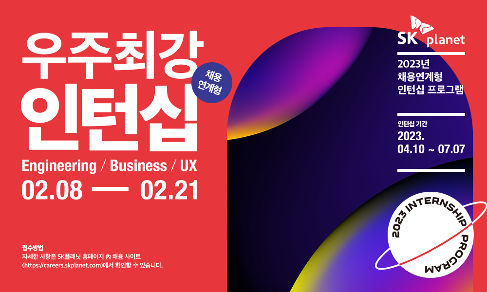

SK플래닛의 '채용연계형' 인턴프로그램 "우주최강인턴십"을 소개합니다.

모집 기간은 2월 8일부터 2월 21일까지이며
Engineering(Programming, AI 파트), UX(기획/설계, Visual Design, UI 개발 파트), Biz, 개인정보보호 등 다양한 분야에 지원하실 수 있습니다.

SK플래닛 우주최강인턴쉽은
4월 10일부터 3개월 간 오리엔테이션을 포함해 다양한 교육과 멘토링의 기회가 제공되며,
각 분야에서 최고의 경험을 가진 선배, 동료들과 함께 다양한 실무 경험의 기회를 가질 수 있습니다.
뿐만 아니라 인턴 기간이 끝난 후에는 인턴쉽 결과에 따라 정규직 입사의 기회까지 주어지는 아주 특별한 기회이기도 합니다.

여러분, '우주최강인턴쉽'에 참여할 준비가 되셨나요?
그렇다면 아래 SK플래닛 채용 페이지를 클릭하시고 지금 바로 지원하세요[(https://careers.skplanet.com)](https://careers.skplanet.com).
뜨거운 열정과 에너지를 가진 인턴 여러분을 기다리고 있겠습니다.​
감사합니다.
