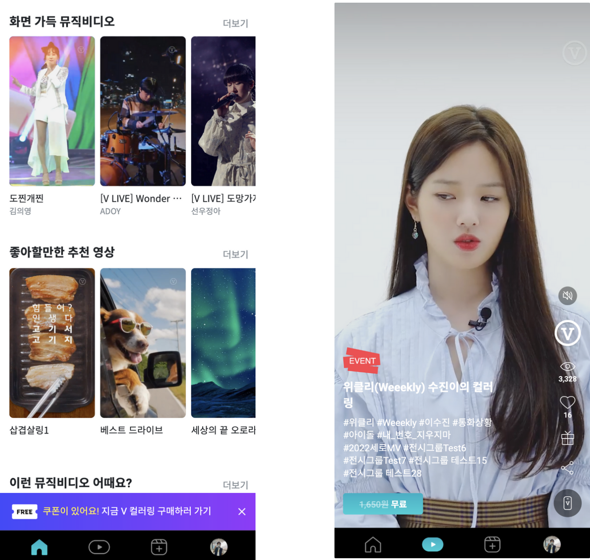
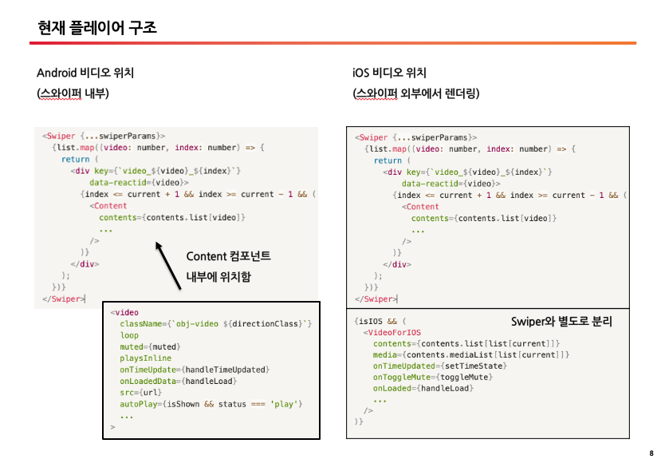
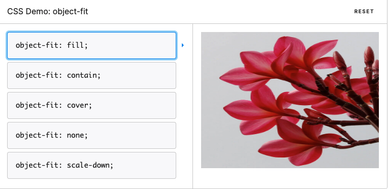
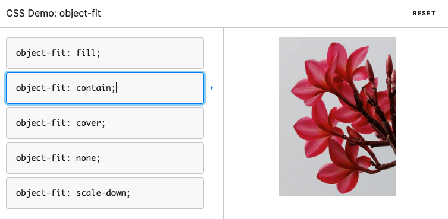
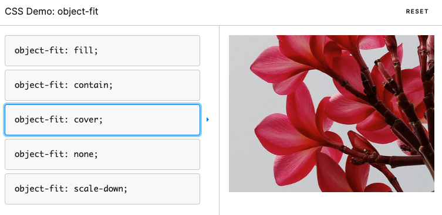
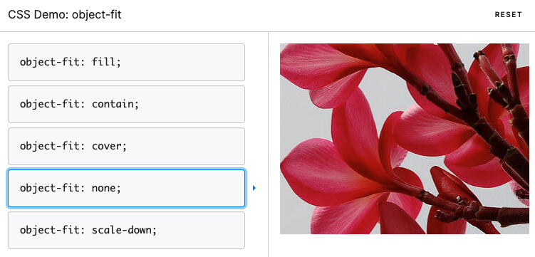

대부분의 동영상 어플리케이션에서 구현되어 있는 것처럼, V 컬러링에서도 동영상 렌더링 시 재생 전 회색 (또는 하얀) 화면의 노출을 방지하고자 배경에 미리 썸네일을 깔아 두는 구현 방식을 사용하고 있습니다.
그런데 iOS가 15 버전으로 업데이트되면서, 이상하게도 썸네일에서 비디오 재생으로 넘어가는 그 찰나에 화면이 깜박거리는 현상이 발생하기 시작했습니다.

한 화면에 한 영상만 로드되는, 특히 홈과 같이 크기가 작은 영상인 경우 별로 티가 나지 않았지만 플레이어처럼 전체 화면을 빠르게 스와이프하면서 영상이 바뀌는 경우에는 계속 깜박임이 발생하여 눈이 아주 피로했습니다.



(왼쪽이 홈 화면, 오른쪽이 아래위로 스와이프하면서 전체 화면으로 영상을 볼 수 있는 플레이어 화면입니다.)

V 컬러링은 기본적으로 모든 영상이 자동 재생되고 있습니다.
그런데 iOS의 경우 정책상 사용자가 액션을 취하기 전까지는 무조건 음소거 모드로 동영상 재생을 하도록 되어 있는데요,
V 컬러링은 사용자가 한 번 소리를 켜면 스와이핑을 해서 다음 영상으로 넘어가더라도 똑같이 소리 재생 모드가 유지되어야 하기 때문에 안드로이드와 동일한 구조로는 구현할 수 없는 이슈가 있었습니다.

그래서 안드로이드와 iOS를 구분하여, 안드로이드는 스와이퍼 내부에 비디오를 위치시키고 iOS의 경우 껍데기 정보와 썸네일만 스와이퍼 내부에 둔 채 비디오 영역은 바깥으로 분리하여
스와이핑이 완료된 이후에 동영상을 따로 로드하여 소리를 재생시키는 우회적인 방법을 사용하고 있습니다.



처음 이슈를 발견했을 때 저는 이러한 구조적 차이점에 원인이 있다고 판단해서, 안드로이드와 iOS의 서로 다른 구현 방식을 분석했습니다.

구현되어 있는 구조를 간단히 설명하자면, 안드로이드는 스와이퍼 내부에 비디오를 컨트롤하는 컴포넌트를 넣어 현재 보고 있는 영상 직전/직후의 썸네일을 미리 받아와서 스와이프를 할 때 보다 빠르게 화면에 렌더링을 하는 반면,
iOS는 안드로이드와 같은 구현 방식을 사용하면 재생 시 자동으로 음소거가 되어 버리는 문제점이 있기 때문에 비디오를 컨트롤하는 영역을 따로 분리해서 스와이프가 된 이후 하나씩 영상을 재생하며 소리를 켜는 방식을 사용하고 있습니다.

그래서 iOS를 안드로이드와 동일한 방식으로 구현해 보기도 하고, 재생되는 시점의 데이터를 하나 하나 확인해 보며 원인을 파악해 보려고 애썼지만 어떤 방법으로도 해결이 되지 않았습니다.

### 스와이핑 중 썸네일 제거 및 onLoadedData 상태값 변경

여러 가지 방법을 시도해 보다가 slide change event가 일어나는 시점을 살펴보았습니다.

사용자에게 아무것도 렌더링되지 않은 화면을 보여주지 않기 위해 현재 스와이핑이 되는 과정, 즉 slide change event가 일어나는 시점에도 썸네일을 배경으로 보여주고 있었는데요,

이미지에서 동영상으로 전환이 되는 시점에 리페인팅을 하는 과정이 잘 처리되지 못하는 것이 아닌가 하는 생각이 들어, 스와이핑 중일 때는 썸네일을 제거해 보기로 하였습니다.
그랬더니 배경이 사라지면서 조금 덜 버벅거리는 느낌은 있었지만, 여전히 비디오가 재생되는 시점에서는 깜박임이 발생하였습니다.

이번에는 비디오 로드의 초기 상태값을 변경해 보기로 하였습니다. iOS의 경우 처음에 로딩 상태를 나타내는 값이 false로 되어 있고, 비디오의 `onLoadedData` 속성에서 해당 상태값을 true로 바꿔주며, slide change event 발생 시 다시 로딩 상태를 false로 바꿔 주고 있습니다.

#### onLoadedData

`video` 태그가 완전히 로드될 때 javascript를 실행하는 이벤트 요소

```html
<video onLoadedData="{setLoaded}" />
```

(참고) 비디오 로드 순서 (출처 : w3cschool)

> 1. onloadstart
> 2. ondurationchange
> 3. onloadedmetadata
> 4. onloadeddata
> 5. onprogress
> 6. oncanplay
> 7. oncanplaythrough

HTML의 기본 태그인 video의 속성 중에는 `onLoadedData`라는 값이 있는데, 이름으로도 알 수 있듯이 이 값은 비디오가 정상적으로 로딩되었는지의 여부를 판단합니다.
원래는 이 `onLoadedData` 속성 값에 따라 썸네일을 보여줄지 비디오를 보여줄지 여부를 판단하고 있었는데,
최초 렌더링 시에는 당연히 비디오가 로드되지 않은 상태였기 때문에 해당 상태의 초기값은 false였습니다.

그리고 비디오가 로드되면 상태 값이 true로 변경되면서 브라우저의 화면을 다시 그리는, 즉 앞에서 설명드린 repaint 과정이 수행되는데요,
이렇게 그림을 다시 그리는 과정에서 깜박임이 발생하는 것이 아닐까 하는 추측에서, 비디오 로드 상태의 초기값을 우선 true로 바꿔 보았더니 마침내 화면이 깜박이는 현상은 사라지게 되었습니다.

썸네일이 사라졌기 때문에 로딩이 느린 감은 있었지만, 그래도 깜박이는 현상이 해결되었기 때문에 결국은 위 두 가지의 조합을 통해 문제를 해결한 것으로 일단락을 지었습니다.

### 가로형 영상인 경우에만 스와이핑 중 썸네일 노출

```javascript
//변경 전
<Swiper ...{swiperParams} />
  <Player>
    
  </Player>
</Swiper>

//변경 후
<Swiper ...{swiperParams} />
  ...
</Swiper>
{isIOS && (
  {!loaded && direction === 'HORIZONTAL' && (
    
  )}
  <VideoForIOS ... />
)}
```

하지만 이렇게 썸네일을 보여주는 과정을 생략하니 비디오가 재생되기 전에는 검은 화면이 노출되어, 깜박이는 현상은 사라졌지만 뭔가 화면이 굉장히 느리게 렌더링되는 느낌을 지울 수가 없었습니다.
특히 너비가 더 긴 가로형 영상인 경우 원래부터 위아래가 검은색 배경이라 크게 느리다는 느낌이 없었지만, 길이가 더 긴 세로형 영상의 경우 전체 화면이라 시각적으로 주는 효과가 더 크게 느껴졌습니다.

이번에는 썸네일의 위치 및 보여주는 시점을 변경해 보기로 하였습니다.
우선 원래 스와이퍼 안에 있던 껍데기 컴포넌트에서 안드로이드와 iOS 공통으로 사용하던 썸네일을 스와이퍼 외부에 따로 빠져 있는 iOS 비디오 영역으로 이동시켜 보았습니다.

그리고 이미지 위치를 옮긴 후 비디오의 로드 상태값을 다시 원복시켜, 로드가 되지 않았을 때는 썸네일을, 로드가 된 이후에는 비디오를 보여주도록 변경해 보았더니 여전히 깜박거리는 현상은 있었지만 이전보다는 훨씬 개선이 된 느낌이었습니다.
어떤 부분에서 개선이 된 걸까 테스트를 해보다 보니, 세로형 영상에서는 개선이 되지 않았지만 가로형 영상에서는 깜박이는 현상이 바로 해결되고 아주 매끄럽게 화면 전환이 일어나는 것을 확인할 수 있었습니다.

그래서 데이터를 기준으로 가로형 영상과 세로형 영상을 구분하여 가로형은 기존과 같이 썸네일 로드 후 비디오를 재생하도록 처리하였고,
세로형은 썸네일을 제거하고 비디오를 바로 로드하도록 처리하였습니다.
이렇게 했더니 가로형 영상에서는 깜박이는 현상은 사라지면서도 썸네일이 아예 보이지 않을 때보다는 훨씬 빠른 것 같은 느낌을 받을 수 있었습니다.

### object-fit

하지만 여전히 어딘가 찜찜했던 마음의 빚을 해결하고자 문제를 다시 한번 들여다 보았습니다.
자바스크립트 영역에서는 이제 할 수 있는 방법을 모두 동원해 보았기 때문에 이번에는 style 속성을 살펴보면 어떨까 하는 생각이 들었습니다.
가로형에서는 잘 되는데 세로형에서만 문제가 발생하는 원인이 뭘까 곰곰이 생각하며 두 타입의 스타일 속성을 하나하나 비교해 보니
`object-fit`이라는 속성의 값이 서로 다르다는 점을 알게 되었습니다.

css의 `object-fit` 속성이란, 요소의 크기에 맞게 `` 태그와 `<video>` 태그의 크기를 조정하는 방법으로 사용되는 속성입니다. 기본적인 속성 값은 다음과 같습니다.

> - **fill** : 기본값이며 요소의 크기에 맞게 꽉 채워서 보여줍니다. 크기가 늘어나거나 찌그러집니다.
> - **contain** : 요소의 가로/세로에 맞춰 크기가 조정되고, 비율은 고정입니다.
> - **cover** : 요소의 가로/세로에 맞춰 크기가 조정되고, 비율은 고정입니다. 가득 채울 때까지 확대됩니다.
> - **none**: 원본 사이즈로 처리됩니다.
> - **scale-down** : none과 contain 중 대체 콘텐츠의 크기가 더 작아지는 값을 선택합니다.







(출처 : [object-fit] https://developer.mozilla.org/ko/docs/Web/CSS/object-fit)

이렇게 다섯 가지 값이 있는데, 기존 코드를 살펴보니 가로형 영상인 경우 `contain` 값이, 세로형 영상인 경우 `cover` 값이 적용되어 있었습니다.
`contain`과 `cover`은 둘다 모두 가로/세로 비율에 맞게 크기가 조정되지만, 차이점은 `cover` 속성인 경우 화면을 가득 채울 때까지 확대됩니다.

V 컬러링 정책이 가로형 영상은 너비에 맞추기만 하면 되지만 세로형인 경우 풀 화면으로 보여줘야 한다는 것이었는데요
이에 따라 가로형 영상은 너비만 맞으면 되었기 때문에 `contain` 값을 사용하는 것이 가능했지만
세로형 영상은 `contain` 값을 사용하게 되면 가로 너비가 비어버리기 때문에 요건을 충족하지 못해 `cover` 값을 사용하고 있던 것이었습니다.

### 로드 시점에 object-fit 값 변경

이에 `object-fit` 속성의 값이 `cover`일 경우 iOS 15에서 썸네일과 영상의 변환 과정이 자연스럽지 못하다는 추측을 통해, 비디오의 `object-fit`의 초기값을 `contain`으로 바꿔 보았습니다.
역시나 예상대로 가로형과 같이 깜박거리는 현상이 사라지고 매끄럽게 영상으로 전환되는 모습을 볼 수 있었습니다.

문제의 원인이 `object-fit`이었다는 것을 깨닫고 썸네일 속성도 역시 `contain`으로 바꿨더니 위화감이 없어졌고
따라서 iOS 15 버전에서는 `object-fit`의 `cover` 값을 제대로 처리하지 못한다는 결론을 내릴 수 있었습니다.

하지만 이렇게 해도 여전히 문제는 남았습니다. 세로형의 썸네일과 비디오 속성을 contain으로 해 버리면
풀 화면을 채워야 한다는 기획요건에 부합하지 못하고 너비가 양쪽으로 남게 되는 현상이 발생했기 때문입니다.

어떤 방법이 있을까 한참 동안 생각해보다가 순간, 초기 값은 `contain`으로 하되 비디오가 로드되는 시점에 cover로 변경을 하면 어떨까? 하는 아이디어가 떠올랐고
그렇게 했더니 마침내 세로형 영상에서도 깜박이는 현상 없이 자연스럽게 썸네일에서 동영상으로 전환되는 모습을 확인할 수 있었습니다. 😎

### 스와이핑 중 썸네일이 사라지는 side effect 발생


이렇게 완전히 이슈를 해결했다고 생각하고 있었는데 어느 순간 스와이핑 중 썸네일이 사라지고 있다는 사실을 발견하게 되었습니다.

안드로이드의 경우 스와이핑을 할 때 이전 영상의 썸네일과 이후 영상의 썸네일이 모두 보이면서 자연스럽게 화면이 전환되고 있는데,
iOS는 스와이핑 중에는 썸네일이 보이지 않고 검은 화면이 노출되고 있었던 것입니다.

문제를 해결하였던 과정을 다시 하나씩 살펴보니 썸네일의 위치가 최초에는 스와이퍼 내부의 껍데기 컴포넌트에 있었으나, 중간에 스와이퍼 외부에 있는 iOS용 플레이어 위쪽으로 이동한 것을 찾을 수 있었는데요,
앞서 말씀드렸던 것처럼 iOS 비디오는 음소거 이슈 때문에 스와이퍼 외부에서 따로 동작하고 있기 때문에
이미지까지 이쪽으로 빼버리면 스와이핑 시 썸네일이 보이지 않는 것이 당연한 일이었습니다.

어차피 문제의 원인은 `object-fit`이었다는 것을 알게 되었기 때문에 이미지를 다시 스와이퍼 내부로 이동해 보았더니,
슬라이드 전환이 끝나기 전까지는 기존 영상의 썸네일이 그대로 남아있는 것을 확인할 수 있었습니다.
우선 까만 화면이 보이는 것보다는 훨씬 안정적인 느낌이었지만 그래도 안드로이드처럼 스와이핑 중 다음 영상으로 썸네일이 변경되지 않았기 때문에 완전히 해결되었다고는 볼 수 없었습니다.

### 스와이핑 시 현재 영상과 다음 영상의 연결이 자연스러워지도록 수정

다시 문제 해결 과정을 천천히 들여다보니, 제일 처음에 깜박임 이슈를 처리하던 과정에서 스와이핑 중 보이던 이미지를 제거해 버렸다는 사실을 알게 되었습니다.
`object-fit`이 원인이라는 사실을 알았을 때 다른 방법들을 제거했어야 하는데 그러지 못하고 그대로 두었던 것이 화근이었습니다.

그래서 원래 비디오 로딩 여부로만 체크했던 썸네일과 비디오 렌더링 처리에 스와이핑 중이라는 상태값을 함께 체크하도록 처리했더니,
깜박이는 현상도 해결되고 스와이핑 중 썸네일이 사라지는 현상도 모두 해결이 된 것을 확인할 수 있었습니다.

```javascript
// image
<Swiper>
  {(!loadedForIOS || moving) && (
    
  )}
</Swiper>

// video
const objectFit: "contain" | "cover" = useMemo(
  () => (direction === "HORIZONTAL" ? "contain" : "cover"),
  [direction]
);

const loadedStyle = useMemo(
  () => (loaded && moving ? { objectFit } : { display: "none" }),
  [loaded, moving]
);

<video
  className="contain"
  style={loadedStyle}
  onLoadedData={() => setLoaded(true)}
  ...
/>;
```

### iOS 15.5 추가 이슈 해결

이번 대응을 통해 덤으로 해결한 이슈도 있습니다. 원래 플레이어를 제외한 다른 작은 영상에서는 화면 깜박임 이슈가 없었는데요, iOS가 15.5 버전으로 업데이트되면서 `object-fit` 속성을 처리하는 과정에서 또 변화가 생겼습니다.
`object-fit`의 `cover` 값을 사용하고 있는 모든 비디오에서, 썸네일에서 영상으로 전환되는 시점에 너비가 변경되는 이슈가 발생한 것입니다.

네이버나 틱톡 등 다른 동영상 플랫폼에서도 현재까지 나타나는 현상인데요, 썸네일에서 동영상으로 전환되는 과정에 너비의 사이즈 변화가 발생하는 모습을 볼 수 있었습니다.
이렇게 모든 영상에서 약간 부자연스럽게 화면이 튀는 모습이 나타났으나, 플레이어 화면에서 해결했던 방법, 즉 `object-fit`의 초기 값은 `contain`으로 세팅하되 비디오가 로드되는 시점에 `cover`로 변경을 하는 방법을 사용함으로써 이번 이슈도 자연스럽게 해결할 수 있었습니다.
현재는 동일한 너비로 자연스럽게 전환됩니다.

### iOS 16.0 추가 이슈 해결

iOS 16 버전이 업데이트되면서 잘 되던 방식에 또다시 문제가 생겼습니다. 15 버전으로 처음 업데이트 되었을 때처럼 비디오가 깜박거리기 시작한 것이죠.
다행히 이번에는 문제의 원인을 잘 알고 있었고, 비디오의 구조 또한 완전히 파악하고 있었기 때문에 접근 방법을 쉽게 찾을 수 있었습니다.

우선 깜박거리는 현상을 제거하기 위해 기존에 `display: none`으로 처리하던 부분을 `visibility: hidden`으로 변경하였습니다.
그 이유는 `display` 속성의 경우 그 값에 따라 `block`인 경우 DOM에 영역 자체가 생겨나고 `none`인 경우 사라지기 때문에,
값이 변경될 때마다 높이값을 새로 계산하는 리플로우 과정이 발생하므로 성능에 좋지 않은 영향을 미치기 때문입니다.
반면 `visibility` 속성을 사용하면 영역은 미리 잡아 놓되 값에 따라 노출, 숨김 처리만 되기 때문에 리플로우 과정을 줄일 수 있습니다.

역시나 예상대로 깜박이는 현상은 사라지고, 대신 15.5에서 발생하던 것과 같이 사이즈의 너비가 줄었다가 확대되는 모습이 두드러졌습니다.
기존에 비디오 로드 전 `object-fit`의 값을 `contain`으로 잡아 놓았다가 비디오 로드 후 `cover`로 변경했던 방법이 더 이상 적용되지 않는 모습이었죠.

우선 썸네일과 비디오의 `object-fit` 값을 모두 `cover`에서 `contain`으로 변경해 보았습니다. 그랬더니 역시 아주 매끄럽게 화면 전환이 일어나는 모습을 확인할 수 있었습니다.
역시나 iOS 16 버전에서도 `cover` 값을 처리하지 못하는 것을 확신할 수 있었습니다.

혹시나 하는 마음으로 `cover`를 `fill`로 변경해 보았습니다. `fill`은 `cover`와 달리 원본 이미지의 비율은 유지되지 않지만 화면을 가득 채우는 효과는 `cover`와 동일합니다.
테스트를 해 보니 `fill`이나 `cover`나 시각적인 차이점은 뚜렷하게 나타나지 않았습니다. 설레는 마음으로 플레이어에 진입해 보았더니 놀랍게도 전혀 위화감 없이 현상이 해결된 모습을 확인할 수 있었습니다!

#### object-fit의 값을 cover에서 fill로 변경

```javascript
const loadedClassName = useMemo(() => (
	loaded ?
		(direction === 'HORIZONTAL' ? 'landscape' : 'fill') :
		'hidden'),
  [loaded, direction]
);

// 비디오에서 style 속성을 제거하고 클래스로 변경
<video
	className=${loadedClassName}
	style={moving ? { visibility: 'hidden' } : {}}
	...
/>
```

### 15.x, 16.x 버전 충돌 해결

위 코드를 적용한 후 iOS 15.0.1 버전부터 15.4 버전까지 테스트를 해 보았더니 렌더링이 제대로 되지 않는 현상이 나타났습니다. 그래서 예외적으로 위 버전만 분기 처리하여 기존의 코드를 사용하도록 하였고, 나머지 15 버전 이하나 15.5 이상, 안드로이드 버전은 새로운 코드를 사용하도록 처리하였습니다.

```javascript
const videoClassName = useMemo(() =>
	(isUniqueIOSVersion ? 'landscape' : loadedClassName), [
  isUniqueIOSVersion, loadedClassName
]);

const loadedStyle = useMemo(() =>
	(loaded && !moving ? { objectFit } : { display: 'none' }),
[loaded, moving]);

const movingStyle = useMemo(() =>
	(moving ? { display: 'none' } : {}),
[moving]);

const videoStyle = useMemo(() =>
	(isUniqueIOSVersion ? loadedStyle : movingStyle),
[loadedStyle, movingStyle]);

<video
  ref={videoEl}
  className={`obj-video ${videoClassName}`}
  style={videoStyle}
  ...
/>
```

그리고 기존에 `visibility` 속성으로 변경했던 값을 `display`로 다시 원복시켰습니다. (style 속성 충돌 때문) ⇒ 이 부분은 추후 다시 검토해 볼 예정입니다.

### transition 적용

추가적으로 테스트를 해 보니 가끔 스와이핑을 시작하는 시점에 미세하게 썸네일이 깜박거리는 현상이 발견되었습니다. 이에 `display` 속성이 문제가 된 것을 직감하고 다시 해결 방안을 찾기 시작했습니다.
그러던 중 다른 작은 비디오 화면에서 사용하고 있는 `transition` 속성을 사용하면 어떨까 하는 생각이 들었습니다.
플레이어에서는 `CSSTransition` 컴포넌트를 씌우면 `object-fit` 속성이 제대로 작동하지 않는 이슈가 있어서 style에 직접 적용하는 방법을 선택하였습니다.

`transition` 속성은 다음과 같이 사용할 수 있습니다.

```javascript
div {
  transition: <property> <duration> <timing-function> <delay>;
}
```

- transition-property
  - 트랜지션을 적용해야 하는 css 속성의 이름으로, 트랜지션 하는 동안 여기에 명시된 속성만 움직입니다.
- transition-duration
  - 트랜지션이 일어나는 지속 시간을 명시합니다.
- transition-timing-function
  - 속성의 중간값을 계산하는 방법을 정의합니다. `ease`, `linear`, `step-end`, `steps` 등의 속성이 있습니다.
- transition-delay
  - 속성이 변한 시점과 트랜지션이 실제로 시작하는 사이에 기다리는 시간을 정의합니다.

하지만 `display` 속성과 `visibility` 속성은 모두 `transition` 기능을 사용할 수 없다는 사실을 알게 되었습니다. 스무스한 화면 전환을 위해서는 css transition이 필수인데, `transition`의 경우 연속적인 숫자로 값을 줄 수 있는 속성에만 작용하기 때문입니다.
그래서 `display` 속성을 `opacity`로 변경하고 `transition` 처리를 하였습니다.

```javascript
const movingStyle = useMemo(
  () =>
    moving
      ? {
          opacity: 0,
          transition: "opacity 100ms ease-in-out",
        }
      : { opacity: 1 },
  [moving]
);
```

### iOS 16.2 추가 이슈 해결

iOS 16.2 버전 이상부터 플레이어에서 갑자기 렌더링이 이상하게 되는 이슈가 발생했습니다. 기존의 문제점이 화면이 일시적으로 작아졌다가 커진 현상이었다면, 이번에는 반대로 첫 로딩 시에는 화면이 커졌다가 작아지는 문제였습니다.
16.0으로 iOS 버전이 업데이트되면서 추가적으로 발생했던 이슈를 해결하기 위해 `object-fit` 속성을 `cover`에서 `fill`로 변경했었는데요, 아마도 그 조치에 대한 side effect이었던 것이 아닐까 하는 생각이 들었습니다.
결과적으로 15버전에서 15.5 버전, 그리고 16.0에서 16.1 버전, 현재 최종 버전인 16.3 (16.2 이상) 이렇게 세 가지로 분기 처리를 하기 위해서 코드를 다음과 같이 수정하였습니다.

```javascript
// player.tsx (썸네일 보여주는 영역)

const isIOS16LowVersion =
  isIOS() && iosVersion >= "16.0" && iosVersion < "16.2";

const objectFitClass = isIOS && isIOS16LowVersion ? "fill" : "cover";
```

```javascript
// videoForIOS.tsx (플레이어 영역)

const isIOS15Version =
  EnvChecker.isIOS() && iosVersion >= "15.0" && iosVersion < "15.5";
const isIOS16LowVersion =
  EnvChecker.isIOS() && iosVersion >= "16.0" && iosVersion < "16.2";

const objectfitValue = useMemo(
  () => (isIOS16LowVersion ? "fill" : "cover"),
  [isIOS16LowVersion]
);

const directionClassName = useMemo(
  () => (direction === "HORIZONTAL" ? "landscape" : objectfitValue),
  [direction]
);

const loadedClassName = useMemo(
  () => (loaded ? directionClassName : "hidden"),
  [loaded, directionClassName]
);

const videoStyle = useMemo(
  () => (isIOS15Version ? loadedStyle : movingStyle),
  [loadedStyle, movingStyle]
);
```

### 마무리

결과적으로는 화면이 깜박거리는 현상과 스와이핑 중 썸네일이 사라지는 두 현상 모두 `loaded`와 `moving`의 상태 값, 그리고 이미지를 로드하는 위치, `object-fit` 등의 조합으로 해결할 수 있는 문제였습니다.

이번 경험을 통해 문제 해결에 접근하는 시야를 좀더 넓게 가질 수 있었고, 성능 최적화라는 목표를 향해 한 걸음씩 나아가며 이슈를 해결하는 여러 가지 방법을 터득할 수 있었습니다.

그리고 이러한 고민과 노력의 과정이 결국은 사용자에게 더 나은 경험을 제공하고, 서비스의 품질을 높이는 데 많은 기여를 한다고 생각합니다. 😊
