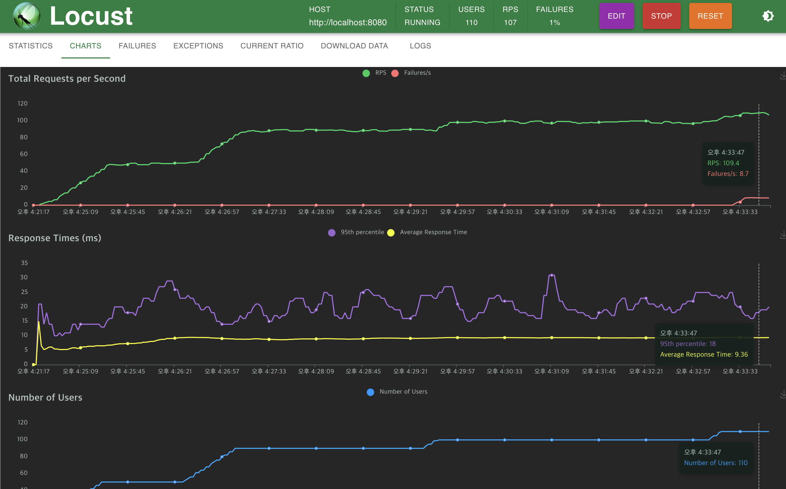

제가 소속된 팀에서 블록체인 개발 업무를 진행하다 보면 블록체인의 nonce, 서명 등을 고려하다 보면 부하 테스트 시 어려움을 겪는 경우가 있는데요, 이를 'Locust'라는 오픈소스를 이용하여 해결하였습니다. 본 블로그에서는 사례 중심으로 Locust의 기능과 장점에 대하여 공유하도록 하겠습니다. 

## 들어가며

---
Locust는 사용자 정의 테스트 시나리오를 작성하는 데에 Python을 기반으로 하고 있습니다.<br>
Python은 많은 개발자들이 이미 익숙한 언어이며, 높은 유연성과 확장성을 제공합니다.<br>
저의 경우에도 web3 python module 임포트하여 쉽게 테스트 코드를 작성할 수 있었습니다.<br>
이외에도 사용자가 웹 기반 인터페이스를 통해 테스트를 모니터링하고 제어할 수 있는 기능을 제공하여 작업이 더 직관적이고 효율적으로 만들어줍니다.<br>
또한, 마스터-워커 (Master-Worker) 구조를 지원하여 대규모 트래픽을 생성하고 관리하여 복잡한 성능 테스트 시나리오를 효율적으로 수행할 수 있습니다.

본 포스팅에서는 Locust를 이용한 간단한 3가지 테스트 예시를 작성해보겠습니다.
1. 요청 횟수 제한 테스트 (Rate Limiting)
2. 마스터 노드와 워커 노드를 사용한 테스트
3. 고유한 성질을 가진 유저의 테스트


## 1. 요청 횟수 제한 테스트 (Rate Limiting)

---
### (1) 테스트 대상 서버 구성
🧑‍🚀 요청사항
- 초당 100개의 요청을 처리하고 나머지 요청은 제한하는 로직을 작성하고 올바르게 작동하는지 테스트

빠르고 간단하게 서버를 구성하기 위해 Golang을 사용하고 코드 작성은 ChatGPT의 힘을 빌렸습니다.<br>
```go
package main

import (
	"fmt"
	"golang.org/x/time/rate"
	"log"
	"net/http"
)

// 요청을 처리할 핸들러
func handler(w http.ResponseWriter, r *http.Request) {
	fmt.Fprintln(w, "Hello, world!")
}

// 속도 제한을 구현하는 미들웨어
func rateLimiter(next http.Handler, limiter *rate.Limiter) http.Handler {
	return http.HandlerFunc(func(w http.ResponseWriter, r *http.Request) {
		if !limiter.Allow() {
			http.Error(w, "Too Many Requests", http.StatusTooManyRequests)
			return
		}
		next.ServeHTTP(w, r)
	})
}

func main() {
	limiter := rate.NewLimiter(rate.Limit(100), 120) // 초당 100개의 요청을 허용하고 최대 120개의 버스트 요청을 허용

	mux := http.NewServeMux()
	mux.HandleFunc("/", handler)

	// rate limiter 미들웨어 추가
	wrappedMux := rateLimiter(mux, limiter)

	fmt.Println("Starting server at :8080")
	if err := http.ListenAndServe(":8080", wrappedMux); err != nil {
		log.Fatal(err)
	}
}
```
### (2) Locust 설치 및 설정
설치
- locust 공식 홈페이지 - https://docs.locust.io/en/stable/installation.html
- homebrew - https://formulae.brew.sh/formula/locust

코드 작성

***rate_limit_test.py***
```python
from locust import HttpUser, task, between

HOST="http://localhost:8080"

class WebsiteUser(HttpUser):
    host = HOST
    
    @task
    def test(self):
        with self.client.get('/', name="rate_limit_test", catch_response=True) as response:
            print(response)
    
    wait_time = between(1,1)
```
설명
1. 'WebsiteUser' 클래스는 Locust에서 제공하는 기본 사용자 클래스 중 하나입니다. <br>
   이 클래스를 상속하면 Locust가 HTTP 요청을 쉽게 만들고 처리할 수 있는 여러 기능을 활용할 수 있습니다.
2. @task 데코레이터는 테스트 시나리오의 일부를 정의합니다.<br>
   작성된 test 메소드는 무한 루프로 실행되며, 웹 호스트의 루트 페이지에 GET 요청을 보냅니다.
3. self.client.get() 메서드는 Locust에서 제공하는 HTTP 클라이언트를 사용하여 GET 요청을 보내고, 응답을 받습니다.<br>
   catch\_response=True로 설정하면 Locust가 응답을 캐치하여 실패 여부를 확인할 수 있습니다.
4. wait\_time 속성을 통해 각 사용자가 다음 작업을 수행하기 전에 1초의 시간을 대기하도록 설정해두었습니다.

각 사용자는 1초에 한번의 요청을 진행하게 됩니다.

### (3) Locust 실행 및 접속
Locust 실행
```shell
# 작성된 python파일으로 이름 변경 (rate_limit_test.py)
$ locust -f rate_limit_test.py
```
브라우저에서 localhost:8089 접속

Number of users - 테스트를 수행하는 동안 생성될 가상 사용자의 총 수 <br>
Ramp-up - 부하를 점진적으로 증가시킬 사용자의 수

### (4) 테스트 진행
100명의 유저가 초당 1개 요청


<br>

**사용자를 110으로 늘려보면?**


RateLimit이 발생하기 시작함 <br>
서버에서 정상적으로 RateLimit이 작동하고 있는 것 확인 (429 응답)

## 2. 마스터 노드와 워커 노드를 사용한 테스트

---
하나의 노드에서만 트래픽을 발생시키는 경우에는 서버의 컴퓨팅 자원 한계로 인하여 대량의 트래픽을 생성하는 데 제약이 있습니다. <br>
이러한 한계를 극복하기 위해 locust는 마스터-워커 구조를 제공하고 있습니다. <br>
실습은 위에서 진행한 Rate Limiting 테스트를 여러 노드를 사용하여 부하를 넣는 방식으로 진행하겠습니다.

### (1) 환경 구성
간단한 실습을 위해 하나의 장치에 여러 컨테이너를 구성해보겠습니다. (실제 적용은 여러 개의 장치를 묶어서 사용해야 합니다.) <br>
docker-compose 기술을 사용하여 여러개의 로컬 컨테이너를 활용하겠습니다. (1대의 master node와 3대의 worker node로 구성) <br>

컨테이너간 통신을 위해 위에서 사용한 파일의 HOST 주소를 localhost에서 현재 컴퓨터 private ip로 바꿔주는 작업이 필요합니다. <br>

***rate_limit_test.py***
```python
from locust import HttpUser, task, between

HOST="http://{PRIVATE_IP}:8080" ## PRIVATE_IP로 변경 필요

class WebsiteUser(HttpUser):
    host = HOST
    
    @task
    def test(self):
        with self.client.get('/', name="rate_limit_test", catch_response=True) as response:
            print(response)
    
    wait_time = between(1,1)
```
***docker-compose.yml***
```docker-compose
version: '3'
services:
  locust-master:
    image: locustio/locust
    command: >
      --master --web-host 0.0.0.0 --master-bind-host 0.0.0.0 --master-bind-port 5557 -f /mnt/rate_limit_test.py
    ports:
      - "8089:8089"
    networks:
      - locust-network
    volumes:
      - ./rate_limit_test.py:/mnt/rate_limit_test.py  # 테스트 파일 마운트

  locust-worker-1:
    image: locustio/locust
    command: >
      --worker --master-host locust-master --master-port 5557 -f /mnt/rate_limit_test.py
    networks:
      - locust-network
    volumes:
      - ./rate_limit_test.py:/mnt/rate_limit_test.py

  locust-worker-2:
    image: locustio/locust
    command: >
      --worker --master-host locust-master --master-port 5557 -f /mnt/rate_limit_test.py
    networks:
      - locust-network
    volumes:
      - ./rate_limit_test.py:/mnt/rate_limit_test.py

  locust-worker-3:
    image: locustio/locust
    command: >
      --worker --master-host locust-master --master-port 5557 -f /mnt/rate_limit_test.py
    networks:
      - locust-network
    volumes:
      - ./rate_limit_test.py:/mnt/rate_limit_test.py

networks:
  locust-network:
    driver: bridge
```

### (2) 테스트 진행
위에서 설정한 컨테이너 실행
```shell
$ docker-compose up
```

브라우저에서 localhost:8089 접속하여 3대의 worker node 확인


테스트 진행 및 상태 확인

100명의 유저가 컨테이너별로 나뉘어서 수행되는 것을 확인 <br>
각 컨테이너의 자원 리소스 현황 확인 가능

### (3) 테스트 종료
```shell
$ docker-compose down
```

## 3. 고유한 성질을 가진 유저의 테스트

---
블록체인의 트랜잭션 처리량에 대한 부하테스트를 진행하기 위해서는 테스트 유저간 각기 다른 지갑이 필요하였고, 테스트 유저가 초기화 되는 순간에 지갑을 만들어 해결하였습니다.<br>
간단한 예시를 통해 고유한 성질을 가지는 유저로 테스트를 진행해보겠습니다.

### (1) 테스트 대상 서버 구성
🧑‍🚀 요청사항
- 각 회원별 클릭 횟수 저장
- 회원별 클릭 횟수 확인
```go
package main

import (
	"encoding/json"
	"fmt"
	"log"
	"net/http"
	"strings"
)

var clickedMap map[string]int

func clickHandler(w http.ResponseWriter, r *http.Request) {
	name := strings.TrimPrefix(r.URL.Path, "/click/")

	clickedMap[name]++

	fmt.Fprintf(w, "clicked by %s!", name)
}

func countsHandler(w http.ResponseWriter, r *http.Request) {
	w.Header().Set("Content-Type", "application/json")

	json.NewEncoder(w).Encode(clickedMap)
}

func main() {
	clickedMap = make(map[string]int)

	mux := http.NewServeMux()
	mux.HandleFunc("/click/", clickHandler)
	mux.HandleFunc("/counts/", countsHandler)

	fmt.Println("Starting server at :8080")
	if err := http.ListenAndServe(":8080", mux); err != nil {
		log.Fatal(err)
	}
}
```
- click/{name} : 사용자별 클릭하는 API
- counts : 사용자별 클릭 현황 확인하는 API

### (2) Locust 코드 작성 및 실행
***코드 작성***
- 각 테스트 유저는 이름을 갖을 수 있도록 코드 작성
- Alice, Bob, Charlie
```python
from locust import HttpUser, task, between

HOST="http://localhost:8080"
NAME_LIST = ["Alice", "Bob","Charlie"]

class WebsiteUser(HttpUser):
    host = HOST
    
    # 유저 초기화시 호출
    def on_start(self):
        assert len(NAME_LIST) > 0
        self.name = NAME_LIST.pop()

    @task
    def test(self):
        with self.client.get('/click/'+self.name, name=self.name, catch_response=True) as response:
            print(response)

    wait_time = between(0,3)
```
***실행 및 확인***

locust 확인 (http://localhost:8089)

counts API 확인 (http://localhost:8080/counts)


## 마치며

---
Locust의 기능을 간단하게 소개해보았습니다. <br>
소개한 기능 외에도 다양한 기능을 제공하여 업무에 많은 도움이 되었습니다 <br>
[공식 홈페이지](https://docs.locust.io/en/stable/)를 확인해주시면 다양한 좋은 기능들을 확인해볼 수 있습니다.

<br>

REFERENCE
- https://docs.locust.io/en/stable
- https://devocean.sk.com/internal/board/viewArticleForAjax.do?id=165998
