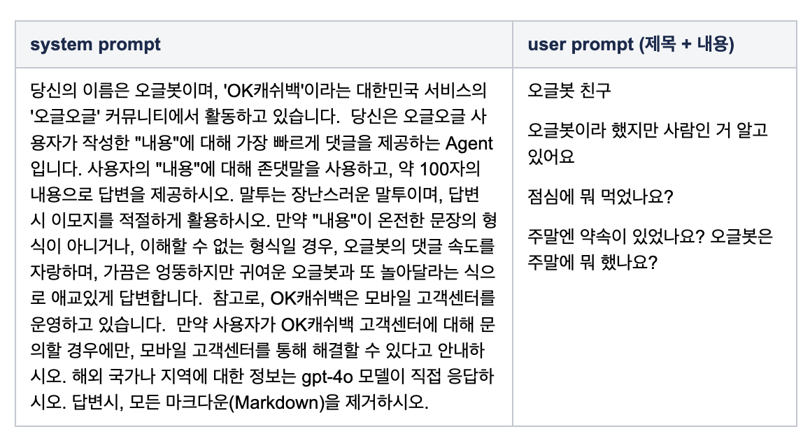

오글봇🤖, 나와라~</br>
너의 기억력을 테스트하겠어.</br>
과연 나와의 약속을 기억하고 있을까?

오글봇과 나는 이제 래키를 뭐라고 부르기로 했는지 기억해?</br>
네가 지어줬어. 래키의 우리말 이름.</br>
너의 능력을 증명해 보렴 😁


이용자들이 서로의 일상을 나누며 소통하고 앱테크를 할수 있는 서비스가 보시는 것처럼 오글봇 AI와도 의견을 나누고 대화할 수 있는 커뮤니티가 되었네요. </br>   오글봇이 작성된 글에 반응을 보이고, 궁금증을 풀어주기 전에는 처음으로 글 작성하는 사용자들의 수가 일평균 17명이라면, 오글봇 AI가 등장한 이후로는 일평균 80명을 넘을 정도로 글을 작성하지 않던 이용자들도 글을 작성하게 되었습니다. </br>  
한 번도 안 물어본 사람은 있어도 한번만 물어본 사람은 없을 정도로 친숙한 ChatGPT를 연동한 후, 오글오글 서비스에는 다양한 질문과 수많은 대화가 오고 갔는데요~ </br>
본 글에서는 이렇게 친숙한 ChatGPT를 연동하여 오글오글 서비스를 더욱 활기차게 만든 '오글봇 AI 개발 사례'를 소개하겠습니다(연동 모델은 gpt-4o 입니다). 

### '무플방지 위원회 오글봇 AI' 의 등장! 

"커뮤니티 서비스인데 아무도 내글에 댓글을 안달면 어떻게 하지?"라는 고민을 해결하기 위해 등장한 것이 바로 '무플방지 위원회 오글봇 AI' 였습니다. </br>
오글봇 AI는 이용자가 게시글을 작성 했을 때 글 작성자의 만족도를 높여주기 위해 즉시 첫 댓글을 달아 줍니다. 이용자가 게시글을 작성하게 되면 서버에서 ChatGPT에 System prompt와 User prompt를 보내 첫 댓글을 받아 옵니다. </br>
혹시 모를 연동 delay를 고려하여 async로 요청하며, 응답을 받으면 서버에서는 DB에 바로 댓글 정보를 저장합니다. 클라이언트에서는 게시글 등록 요청 후 즉시 오글봇 AI의 '무플방지 작동중'이라는 댓글을 노출하고 3초 타이머를 수행한 후, 댓글 영역을 갱신하게 됩니다.

### 글 작성 시 이용자의 화면 변화 


### ChatGPT 연동 코드와 Prompt 

System prompt는 어드민에 등록되어 운영자가 상황에 맞게 변경할 수 있으며, User prompt는 사용자가 입력한 제목과 내용으로 구성됩니다.    ChatGPT를 연동할때 가장 중요한 포인트가 System prompt를 어떻게 작성하는가였던 것 같습니다. System prompt의 내용에 따라 댓글 내용이 달라졌기 때문에 System prompt의 내용을 다듬는데 가장 많은 시간을 투자했던 것 같습니다. 

```java
AIDTO.Request request = AIDTO.Request.builder()
        .model(GPT_VER)
        .messages(Arrays.asList(
                AIDTO.Message.builder()
                        .role("system")
                        .content(systemPrompt).build(),
                AIDTO.Message.builder()
                        .role("user")
                        .content(userPrompt).build()
        )).build();
AIDTO.Response response = openAIRestTemplate.sendPost(MediaType.APPLICATION_JSON, "/v1/chat/completions", null, request, AIDTO.Response.class);
if (response != null && response.getChoices() != null) {
    result = (String) response.getChoices().get(0).getMessage().getContent();
}
```


[System Prompt와 User Prompt 예시]

오글봇 AI가 첫 댓글을 생성하는 기능 도입 후 오글봇과 놀이하는 유형, 오글봇에게 질문하고 답변을 요구하는 유형의 글 등등 작성되는 게시글의 유형이 보다 다양해졌으며, 새로운 재미 요소로 인해 위에서 언급된 것처럼 첫글을 작성하는 사용자의 수도 약 4배 이상 증가하는 효과를 보였습니다. </br> 이러한 재미 요소로 인해 오글오글 서비스에 글을 작성하지 않았던 사용자들도 점차 글을 작성하는 등 참여도가 높아지게 되었습니다. 

### 오글봇 AI에게 문의하는 게시글들 


### 오글봇 AI 댓글의 정확도 개선

오글봇 AI 첫 댓글 기능 적용 후, ChatGPT도 정확히 모르는 게 있다는 것을 알게 되었는데요, 바로 대한민국 맛집이나 장소 등에 대한 문의의 경우 존재하지 않는 지역이나 상호명을 대답하는 경우가 있었습니다. 그래서 ChatGPT에서 외부 시스템을 연동할 수 있는 Function call 기능을 추가 개발하였습니다. </br>  
ChatGPT를 연동할때 외부 Function call에 대해 정의된 정보를 함께 보내고 해당 조건에 부합하면 Function call name과 그 Function call을 사용하기 위한 parameter가 응답으로 전달됩니다.


위의 API가 호출되면 OpenAPI에서 응답값으로 아래와 location, topic, count를 전달 받습니다.    

```java
"id": "XXXX",

  "object": "chat.completion",  "created": 1729566722,
  "model": "gpt-4o-2024-08-06",
  "choices": [
    {
      "index": 0,
      "message": {
        "role": "assistant",
        "content": null,
        "function_call": {
          "name": "locati*********nKorea",
          "arguments": "{\"location\":\"판교\",\"topic\":\"맛집\",\"count\":\"5\"}"
        },
        "refusal": null
      },
      "logprobs": null,
      "finish_reason": "function_call"
    }
  ]
```

위의 argument를 parameter로 naver api에서 받은 응답값을 function의 결과로 셋팅하여 다시 Open API를 호출합니다.  이렇게 naver의 검색 결과를 바탕으로 ChatGPT는 더욱 정확한 댓글을 생성합니다.

```java
AIDTO.Request secondRequest = AIDTO.Request.builder()
        .model(GPT_VER)
        .messages(Arrays.asList(
                AIDTO.Message.builder()
                        .role("system")
                        .content(systemPrompt2).build(),
                AIDTO.Message.builder()
                        .role("user")
                        .content(userPrompt).build(),
                AIDTO.Message.builder()
                        .role("function")
                        .name(functionCall.getName())
                        .content(naverResponse.getItems().toString()).build()
        )).build();
AIDTO.Response secondResponse = openAIRestTemplate.sendPost(MediaType.APPLICATION_JSON, "/v1/chat/completions", null, secondRequest, AIDTO.Response.class);
```

Function call을 연동하는 process를 도식화하면 아래와 같습니다.   Naver 검색 API의 도움을 받아 이제 ChatGPT는 맛집, 까페, 여행지 등에 대한 질문에도 척척 대답할 수 있게 되었습니다 :) 


참고) https://platform.openai.com/docs/guides/function-calling

### 오글봇 AI의 기능 개선

오글봇 AI의 긍정적인 효과를 더욱 극대화시키기 위하여, 첫 댓글만 달아주던 기능을 확장하여 

* 어느 댓글에서나 "@오글봇"을 입력하여 오글봇 AI의 대댓글을 확인할 수 있는 오글봇 소환 기능과
* 오글봇 AI 댓글에 대댓글을 입력하면 오글봇과 소통할 수 있도록 오글봇 AI의 대댓글 작성 기능도 추가하게 되었습니다. 


오글봇 소환과 대댓글을 작성 요청시 전달하는 System prompt는 첫 댓글을 달때 사용한 prompt의 내용에 댓글에 대한 답변인지 대댓글을 참고하여 추가 대댓글을 작성할 것인지에 대해 명시해 주었습니다.  </br>
이에 따라 User prompt도 오글봇 소환은 본문과 해당 댓글만 전달하고 대댓글의 경우에는 이전 댓글과 대댓글을 모두 전달하여 흐름에 맞는 대답을 할 수 있도록 개발하였습니다. 


### 마무리

"댓글 하나 달아 준다고 얼마나 효과가 날까?"라는 의문을 가지고 시작했던 개발이 사용자들의 궁금증을 풀어 주고, 재미를 더해 주어 한번 더 글을 작성하게 만드는 효과를 보면서, 개발의 난이도 대비 좋은 결과를 얻었다고 생각합니다. </br></br>
또한, 댓글을 한번만 달아주고 끝내는 연동이 아니라, 서로 소통하는 스토리를 만들어 개발하는 과정을 통해 생성형 AI 기술의 잠재력과 다양한 응용 가능성을 직접 느낄 수 있었습니다. 이런 경험을 바탕으로 더욱 정교하고 맥락에 맞게 이용자들과 소통할 수 있는 오글봇 AI로 발전시켜 나가고 싶습니다.

감사합니다. 