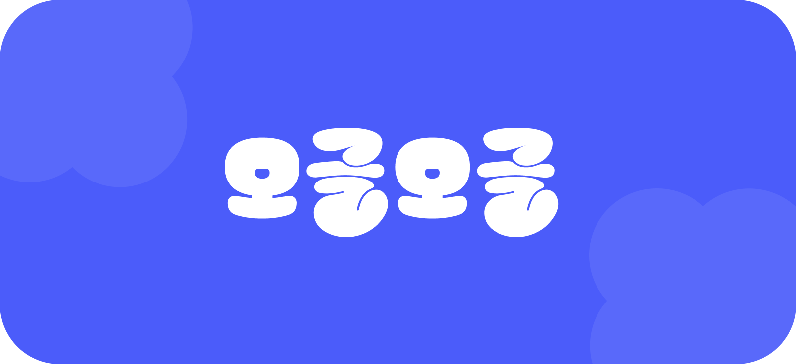

OK캐쉬백에 새롭게 추가된 서비스인 오글오글([ogog.kr](https://ogog.kr/home))을 런칭했어요. 
다양한 이야기가 모여 있다는 의미인 ‘오글오글' 서비스는 놀면서 돈을 벌 수 있는 생활 참여형 리워드 서비스에요. 
오글오글에는 어떤 기능이 있는지, 향후 계획은 어떤 것들이 있는지 공유드리려 하니 저희와 함께 여정을 즐겨 주세요!

### 왜 커뮤니티를 선택했을까?

2022년 OK캐쉬백 고객 활동성을 조사했어요. 
이 결과 헤비 유저의 방문 횟수, 체류 시간 등은 증가했지만, 미들 유저의 규모는 점점 줄어들고 있었어요. 
또 다른 문제는 헤비 유저의 활동 패턴인데, OK캐쉬백에 방문하더라도 1~2개 서비스만 사용할 뿐 다른 서비스는 이용하지 않았어요. 
우리는 이러한 문제를 파악했고 이것을 해결하기 위해, **신규 유저 유입과 헤비 유저 활동성을 강화하기 위한 방안**이 필요했어요.

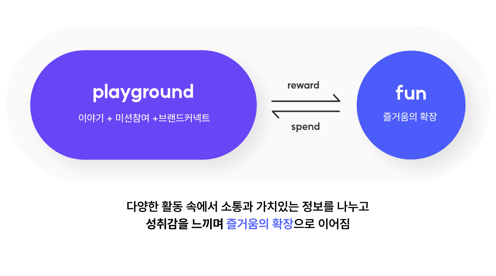

OK캐쉬백 팀은 "관심가질 만한 것을 제안하여 유저들을 유입시켜서 OK캐쉬백 내 다양한 서비스를 인지시켜 보자"로 시작했어요. 
스스로 주제를 던져 가며 즐길 수 있는 공간을 **놀이터**라는 키워드로 발전시켜서 운영 중이던 미션 게시판을 바꿔보기로 했어요. 
소통만으로는 다른 커뮤니티 서비스와 다를 게 없기 때문에, 다양한 미션과 포인트 적립을 가미하여 가치를 높였어요. 
포인트와 관련해 주목할 만한 점은 미션인데요. 기존 미션 게시판에서 유저들이 개인 쇼핑몰 링크를 걸어 두고 방문하면 포인트로 보상해 주는 사례가 있었어요. 
이를 통해 개인 마케팅 채널에 대한 고객의 니즈가 있다는 것을 파악했고, 고객 간 주고 받는 C2C 채널로 발전시킬 수 있는 방향으로 목표를 잡았어요. 
OK캐쉬백 커뮤니티의 전체적인 방향이 구체화되면서 이에 맞는 이름과 디자인에 대한 대대적인 변화가 시작되었어요.

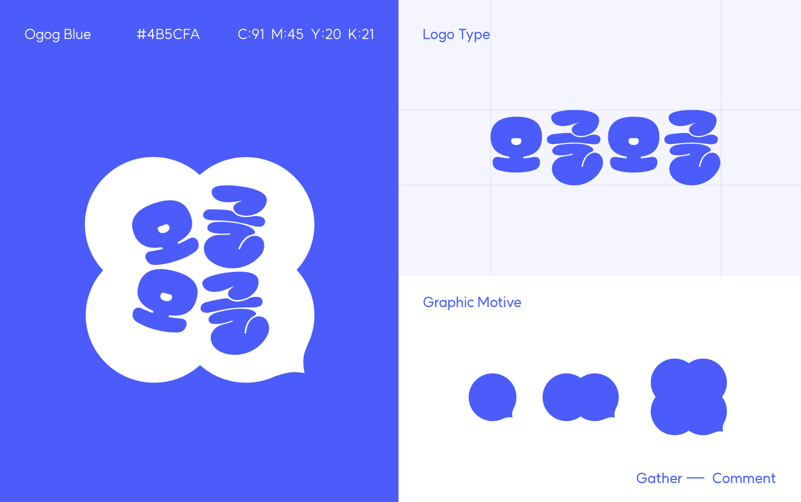

### 미션게시판의 새로운 이름 오글오글

미션 게시판은 다양한 이야기가 모여있다는 의미의 ‘오글오글’로 리브랜딩을 시작했어요. 
20~30대를 타겟으로 새로운 경험을 도출하고자 오글오글 단어에서 주는 [모이다]라는 의미에 [즐거움]을 담아 브랜드 가치를 전달했어요.

소통이 즐거움의 확장으로 이어지는 가치를 시각적으로 표현했어요. 
그래픽은 말풍선을 모티브로 모바일 환경에서 일관된 브랜드 경험을 줄 수 있도록 가이드 라인을 제시했어요.

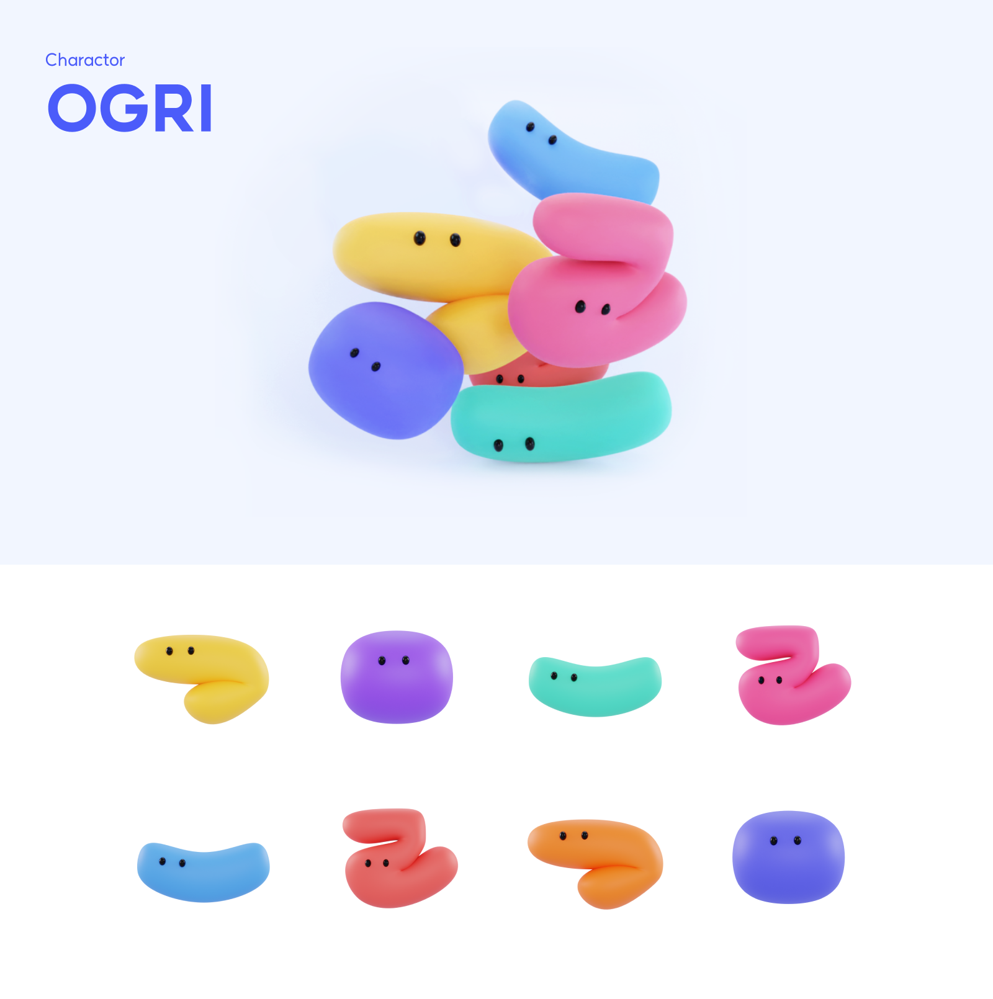

### 오그리 캐릭터 개발

이 중에서도 가장 많이 신경쓴 것은 ‘오그리' 인데요. 
커뮤니티 특성상 캐릭터가 프로필에 보이기 때문에 캐릭터가 브랜드의 전반적인 느낌에 영향을 끼치는 요소예요. 
커뮤니티 내 유저들을 지칭하는 애칭으로 오글오글의 한글 자음, 모음을 모티브로 둥글고 귀여운 이미지로 캐릭터가 만들어졌어요. 
오글오글의 다양한 요소에 활용하고 있어요.

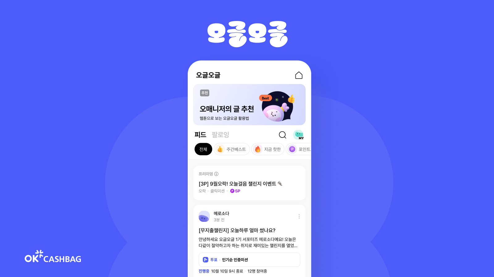

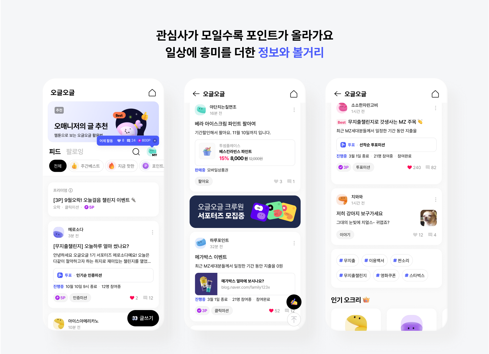

### 1. 활동 동기를 줄 수 있는 디자인

오글오글은 커뮤니티 채널에 포인트 적립을 더해 활동한 만큼 보상받을 수 있는 기제를 추가했어요. 
자신이 올린 콘텐츠가 인기를 끌수록, 그리고 댓글을 달수록 더 많은 보상을 받는 방식이라 아래 세 가지 핵심 기능에 초점을 두고 빠르게 만들어 나갔어요.

* 유저들이 올린 양질의 콘텐츠가 더 빠르게 발견될 수 있도록 하자
* 명예적, 경제적 보상을 충분히 받아 계속 활동할 수 있는 동기를 만들자
* 콘텐츠들을 템플릿화하여 한눈에 볼 수 있도록 하자

홈 화면은 명확한 정보 전달에 중점을 두어 모듈화하고, 위치를 일관성 있게 정돈했어요. 
통일감 있는 컴포넌트로 유저가 빠르게 습득할 수 있도록 정보 인지력을 높였어요. 
보상 체계를 포인트 블릿으로 강조해 흥미를 유발시켜서 활동으로 자연스럽게 이어지는 경험을 제공했어요.

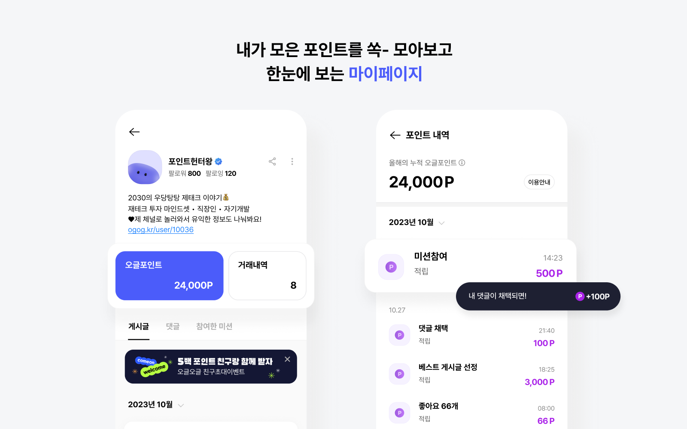

마이페이지는 활동한 내역과 지금까지 모은 포인트를 한 눈에 볼 수 있도록 구성했어요. 
이렇게 보상심리를 느낄 수 있는 화면 구성으로 서비스를 꾸준히 이용할 수 있게 했어요. 
더불어 자신을 소개할 수 있는 공간과 팔로우 기능을 제공하여 유저간의 관계를 강화하도록 환경을 만들었어요. 
내 취향 크리에이터들의 콘텐츠를 팔로우하고 더 긴밀한 유대 관계를 구축하도록 고민하고 있는데요. 이를 위하여 다양한 추가 기능들을 순차적으로 보여드릴 계획이예요.

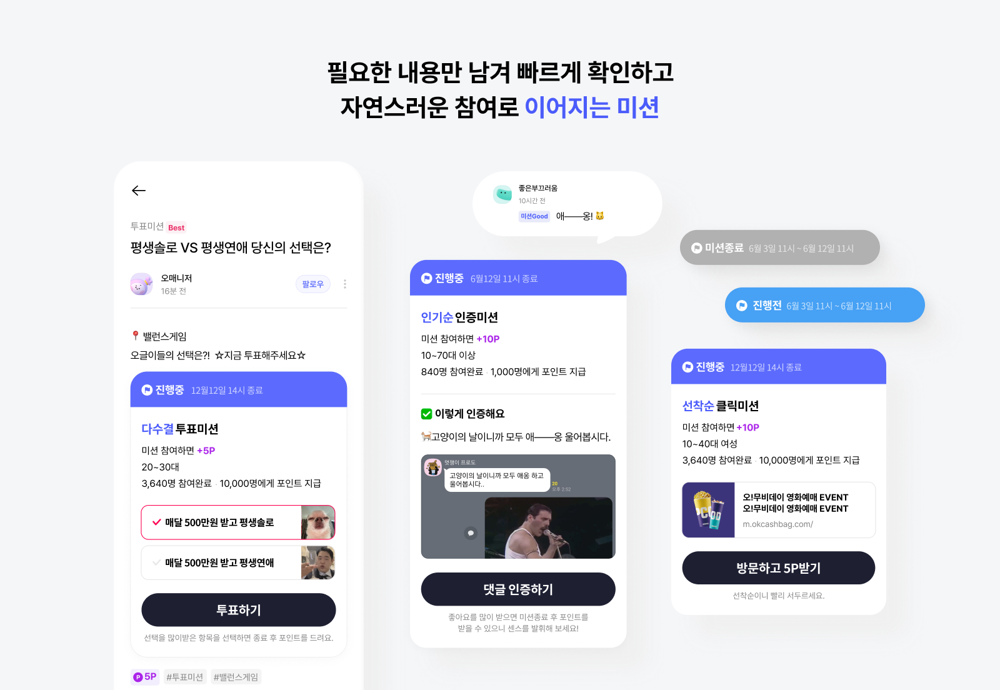

### 2. 자연스러운 참여로 이어지는 미션

미션정보는 필요한 요소만 간결히 남겨서 유저들이 빠르게 미션을 파악하고 참여로 이어지는 행위 유발성 UX로 접근했어요. 
미션 유형별로 참여 방법은 다르지만 시작 시간, 참여 인원 등의 정보를 통일해서 이러한 공통 콘텐츠에 대해 일관성을 맞췄어요. 
미션 상태를 Top Bar 컬러로 표시해 직관적으로 인지할 수 있어요. 또한, 사용자가 올린 다양한 콘텐츠를 공통된 비주얼로 보여줄 수 있도록 했으며 확장성을 고려해 긍정적인 경험으로 이어지도록 구성했어요.

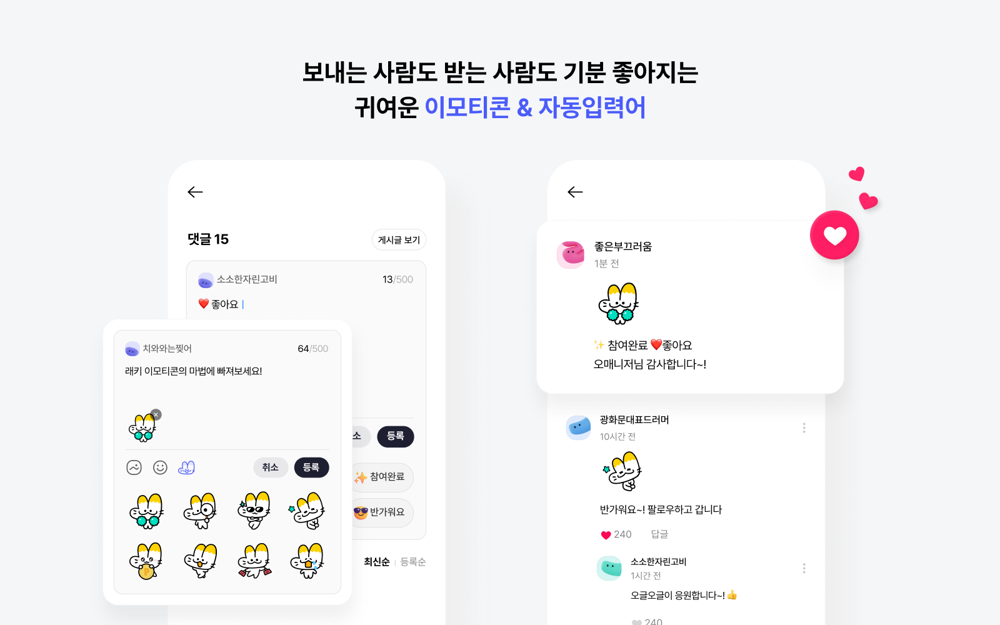

### 3. 보내는 사람도 받는 사람도 기분 좋아지는 귀여운 리액션

“이 정보 진짜 좋아!” “진짜 나랑 비슷한 이야기네~” 공감의 마음이 마구 솟구칠 땐 하트 버튼을 꾹 눌러 간단히 공감을 표현할 수 있어요. 
텍스트 기반 채팅 외에도 풍부한 감정을 표현할 수 있는 장치를 제공하고 있어요. 
자동입력어와 OK캐쉬백의 캐릭터 래키 이모티콘으로 더 풍부하게 감정을 표현할 수 있어요. 
즉각적인 공감과 반응이 중요한 커뮤니티 특성상 리액션 장치를 확장시켜서 즐거운 여정이 될 수 있도록 만들었어요. 
실제 런칭 후, OK캐쉬백 유저의 나이대 특성을 볼 때, 커뮤니티가 처음이고 온라인 채팅이 어색한 분들도 계셨는데 이를 돕는 길잡이 역할을 해줬어요. 
보내는 사람도 받는 사람도 기분 좋아지는 귀여운 래키의 매력을 느껴보세요!

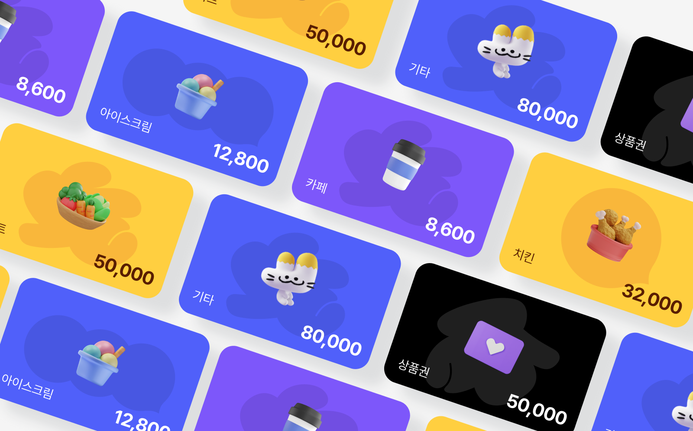

### 4. 오글오글을 브랜드로 보여주는 경험

오글오글에선 콘텐츠 생산과 보상이 선순환될 수 있도록 포인트 생태계를 만들어서 다양한 시도를 하고 있어요. 
미션을 만들어 개인 마케팅 채널로 상품화하거나 개인 간 거래 ‘팔아요'와 포인트 선물 기능을 제공하여 혜택을 다양화했어요. 
UX팀에선 이러한 상품들을 양질의 콘텐트로 보여주기 위한 많은 고민을 했어요. 
오글오글만의 아이덴티티를 바탕으로 정보와 메시지를 효과적으로 전달했어요. 
예를 들어 ‘팔아요’의 카테고리에 오글오글의 브랜드 그래픽 모티프로 유형화하여 각 아이템별 특성을 담은 상품 모듈 디자인으로 트렌디함을 더했어요.

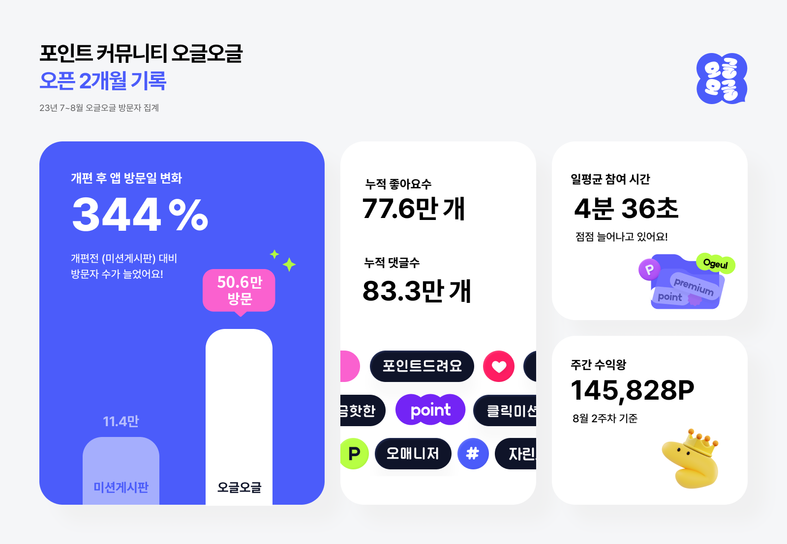

### 오글오글 오픈 2개월 기록

베타 서비스 오픈 이후, 유저들은 게시글에 활발히 댓글을 남기고 좋아요와 이모지를 누르며 긍정적으로 반응했어요. 
덕분에 7월 앱 방문일 비율이 개선 전(미션 게시판) 대비 무려 344% 이상 높아졌으며, ML 고객의 체류시간은 평균 2분 이상 늘어났어요. 
또한, 2개월 만에 약 11.3만 명의 유저들이 새로운 프로필을 생성했고, 77.6만 개의 좋아요와 83.3만 개의 댓글을 달며 활발한 활동을 이어나가는 모습을 볼 수 있었어요. 
뿐만 아니라, C2C 플랫폼으로써 콘텐츠와 리워드 제공 확대 가능성을 검증하였고요. 
오글오글 이름처럼 둥글고 따뜻한 이야기들이 오고가는 모습을 보면서 프로젝트를 함께 한 팀원들과 뿌듯한 마음을 나눴어요.

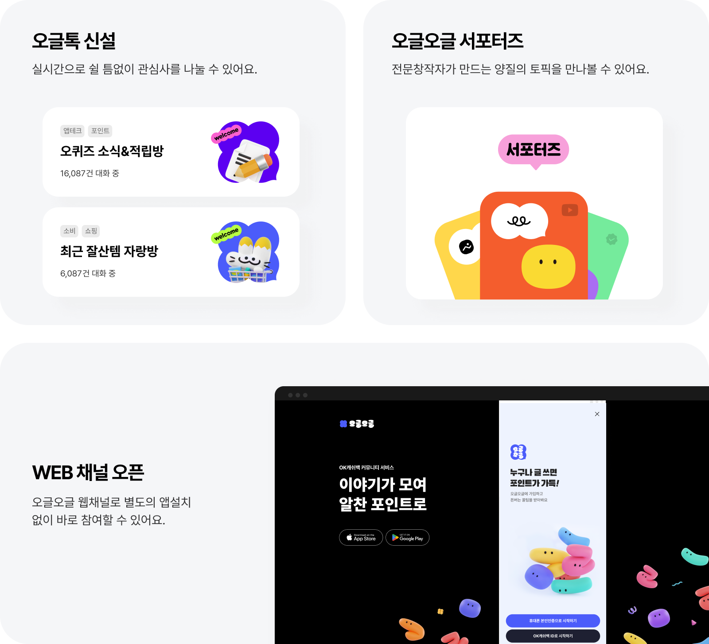

### 오글오글팀, 앞으로 어떻게 갈까요?

지금까지 오글오글 커뮤니티가 만들어진 여정과 베타 서비스를 오픈한 결과에 대해 설명드렸는데요. 
서비스 출시 이후에도 유저들의 리얼한 목소리와 사용 행태를 관찰하며 서비스 완성도를 높여갈 예정이에요. 
이 중에 최우선으로 고도화 작업이 필요한 부분을 선별하고 최적의 디자인과 사용성을 제공하기 위해 내부적으로 많은 테스트를 진행하고 있어요. 
이를 바탕으로 **유저 간 포인트를 주고받는 C2C채널로 도약할 예정**이에요. 
누구나 쉽게 크리에이터가 되어서 자발적으로 콘텐츠를 만들고 재미를 느낄 수 있는 구조를 만들고 있어요. 
먼저 전문 창작자를 선발해 서포터즈 활동 진행과 ‘오글톡’ 신설을 시작으로 향후 목표를 구체화하여 확실한 개인 마케팅 플랫폼을 기대하고 있어요. 
더불어 신규 POC 웹 채널을 제공한 개방형 플랫폼으로 선보일 예정이에요. 별도로 앱 설치 없이 바로 참여할 수 있는 환경을 마련해 신규 고객 가입률을 높이는 효과를 기대하고 있어요. 
이 과정에서 기존의 인증 절차를 간편하게 정리해 서비스에 접근하는 시간을 줄였어요.

### 마치며

오글오글 팀은 오글오글 모여 저마다의 다채로운 이야기를 나누는 건강한 포인트 커뮤니티를 만들어가기 위해 세심하게 고민하고 있어요. 
다양한 연령대의 OK캐쉬백 사용자들이 세대를 초월해 공감할 수 있도록 많은 노력을 기울이고 있답니다. 
앞으로도 누구나 쉽게 크리에이터가 되어 활동하며 다양한 콘텐츠로 재미를 느낄 수 있는 모습을 보여드릴 예정이니 기대해 주세요!

URL : https://ogog.kr/home

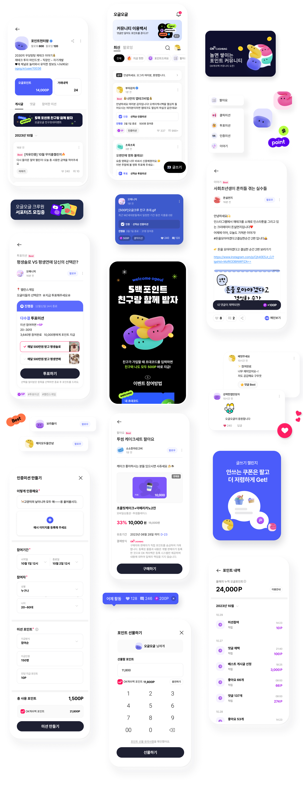