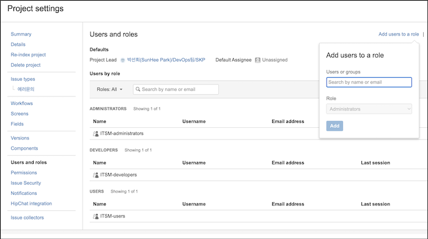
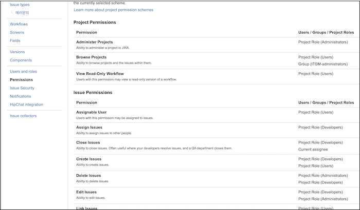
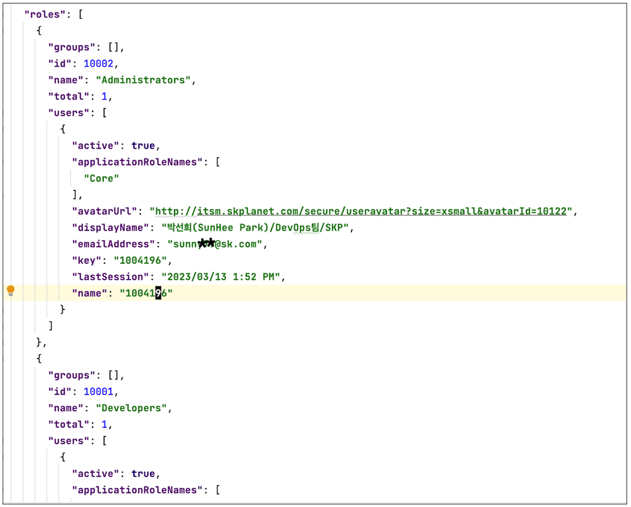
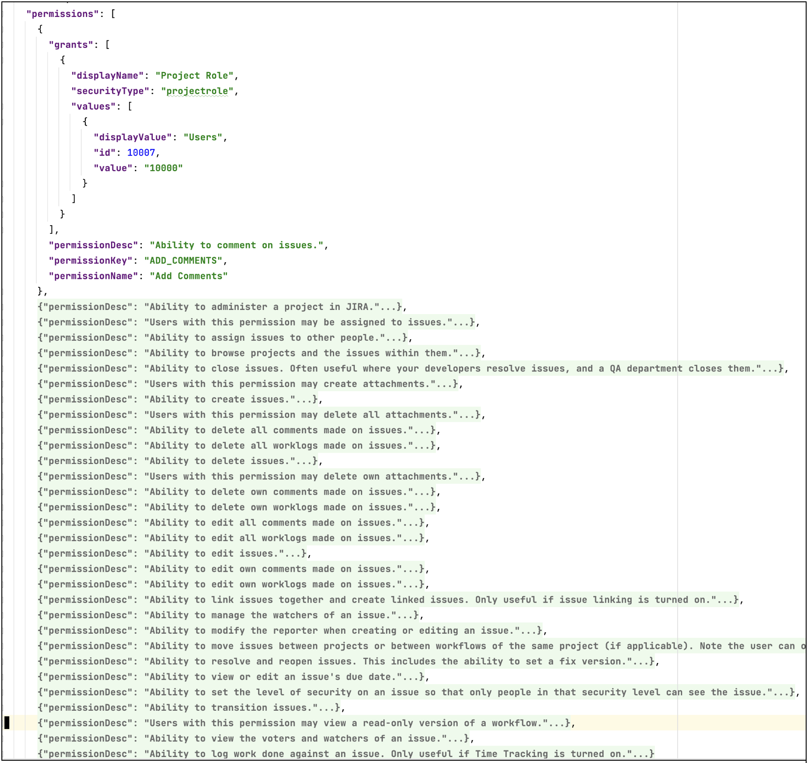

본 글은 SK플래닛에서 OPA(Open Policy Agent)를 이용하여 사내 JIRA의 권한을 구현한 사례를 공유하며, 아래와 같이 크게 세 가지 작업을 정리하고자 합니다. 
* 첫번째는 개발 중인 ITSM 시스템에서 권한 부분을 OPA를 이용해 구현합니다. 
    * 정책은 Rego로 작성합니다. 
* 두번째는 작성된 정책을, data API를 이용해 권한 체크를 구현합니다. 
* 세번째는 애플리케이션과 OPA 서버를 하나의 파드로 묶어 사이드카 형태로 쿠버네티스 개발 환경에 배포합니다. 


## 본문

* ITSM 시스템의 백엔드를 Java Spring 및 JPA를 사용하여 개발하였고, 현재 사용 중인 JIRA를 대체할 예정입니다. 
* JIRA의 데이터를 이전할 계획이라, JIRA의 데이터 구조를 그대로 사용하고자 합니다.
* JIRA의 권한 관련 데이터 및 권한 정책을 확인하였습니다. 
* JIRA의 프로젝트 관리 권한을 가진 사용자라면 아래와 같은 페이지에서 프로젝트의 롤과 퍼미션의 수정이 가능합니다.
* Users and Roles 에서 ADMINISTRATORS/DEVELOPERS/USERS 롤에 그룹 및 사용자를 할당할 수 있습니다.
* 
* Project Permissions 에서 각 퍼미션에 사용자, 그룹 및 위에서 할당한 롤을 추가할 수 있습니다. 
* 
* 이렇게 화면에서 설정한 값은 JSON으로 아래와 같이 표현합니다(JIRA API를 통해 확인). 
    * 파일 크기가 꽤 되므로 일부 내용만 캡쳐하며, permissionKey(퍼미션 내용)과 grants(권한부여) 을 포함한 동일한 형태의 퍼미션을 배열로 정의하고 있습니다. 
    * 해당 JSON을 OPA에서 권한 체크 시, 데이터로 사용합니다. 
* 
* 
* 이러한 구조를 염두해 두고 권한 처리를 생각해 보면, 사용자 및 사용자의 그룹이 속한 **롤**을 확인하고,
* 사용자 아이디, 그룹명, 롤명으로 permissions의 grants를 뒤져서 해당 사용자가 해당 퍼미션에 권한이 있는지 여부를 확인할 수 있습니다. 
* 복잡해 보이지만 의외로 간단합니다. Rego를 작성해 봅니다.  

```
package app.rbac

import future.keywords.if

# By default, deny requests.
default allow := false

allow {
   # Find grants for the permissionKey.
   user_is_granted[_] == input.permissionKey
}

user_is_granted := grant if {
   #내가 가진 프로젝트 롤
   myRoleWithUser := {ro.id | ro = data[input.project.key].roles[_]; ro.users[_].name = input.user}

   #내가 포함된 그룹이 가진 프로젝트 롤
   myRoleWithGroup := {ro.id | ro = data[input.project.key].roles[_]; ro.groups[_].name = input.groups[_]}

   #권한 체크를 하고자 하는 프로젝트의 퍼미션조회
   perm := {pe | pe = data[input.project.key].permissions[_]}

   #나의 롤에게 부여된 퍼미션
   grantOfUserRole := {gr | gr = perm[ur].permissionKey; to_number(perm[ur].grants[_].values[_].value) == myRoleWithUser[_]}

   #나의 그룹의 롤에게 부여된 퍼미션
   grantOfGroupRole := {gr | gr = perm[gr].permissionKey; to_number(perm[gr].grants[_].values[_].value) == myRoleWithGroup[_]}

   #나에게 부여된 퍼미션
   grantOfUser := {gr | gr = perm[u].permissionKey; perm[u].grants[_].values[_].value == input.user}

   #나의 그룹에게 부여된 퍼미션
   grantOfGroup := {gr | gr = perm[g].permissionKey; perm[g].grants[_].values[_].value == input.groups[_]}

   #위의 퍼미션의 합집합
   grant := grantOfUserRole | grantOfGroupRole | grantOfUser | grantOfGroup
}
```

* 작성한 정책(rego)과 데이터을 이용하여 권한을 체크합니다. OPA 플레이그라운드에서 테스트할 수 있습니다. 
    * https://play.openpolicyagent.org/p/7dwdCy843A
* 백엔드 서버에서 OPA data API를 이용하여  권한 체크를 하는 로직을 개발해 봅니다. 
* Spring Security의 PreAuthorize 태그를 이용합니다. 
* Spring Controller에 권한 체크를 위해 PreAuthorize 태그를 추가합니다.
* PreAuhorize에서 opaclient.allow를 호출합니다. 

```
@PreAuthorize("@opaClient.allow('CREATE_ATTACHMENTS',T(java.util.Map).of('key', #key))")
@PostMapping(value = "{version}/issue/{key}/attachments")
@ResponseBodypublic ResponseEntity uploadFile(@PathVariable String version,@PathVariable String key,
                       @RequestParam List<MultipartFile> file) throws IOException {
    List<TicketFile> ticketFiles = ticketService.uploadFiles(key, file);
    return new ResponseEntity(ticketFiles, HttpStatus.OK);

}
@PreAuthorize("@opaClient.allow('TRANSITION_ISSUES',T(java.util.Map).of('key', #key))")
@PutMapping(value="/issue/{key}/{issueEvent}")
@ResponseBodypublic ResponseEntity updateState(@PathVariable String key,@PathVariable String issueEvent){
    IssueEvent event = IssueEvent.valueOf(issueEvent);

    Ticket ticket = ticketService.updateIssueState(key, event);
    return new ResponseEntity(ticket, HttpStatus.OK);
}
```

* opaClient.allow는 아래와 같이 구현하였습니다. 
* input으로 사용자 아이디와 그룹, 권한을 체크하고자 하는 프로젝트와 퍼미션를 입력합니다. 

```
//URI는 OPA 서버의 endpoint로 http://localhost:8181 로 설정한다.
@Value("${opa.url}")
String URI;

public boolean allow(String action, Map<String, Object> resourceAttributes) {
        Authentication authentication = SecurityContextHolder.getContext().getAuthentication();
        if (authentication == null || !authentication.isAuthenticated() || action == null 
                             || resourceAttributes == null || resourceAttributes.isEmpty()) {
            return false;
        }

        String name = authentication.getName();
        List<String> authorities = authentication.getAuthorities()
                .stream()
                .map(GrantedAuthority::getAuthority)
                .collect(Collectors.toUnmodifiableList());

        Object project = null;

        if (resourceAttributes.containsKey("key")){
            String issueKey = (String) resourceAttributes.get("key");
            String projectKey = issueKey.substring(0, issueKey.indexOf("-"));
            project = Map.of("key", projectKey);
        }

        /**
         * {
         *     "groups": [
         *         "ITSM-users"
         *     ],
         *     "permissionKey": "ADD_COMMENTS",
         *     "projectKey":"TEMP",
         *     "user": "1004196"
         * }
         */
        Map<String, Object> input = Map.of(
                "user", name,
                "permissionKey", action,
                "project", project,
                "groups", authorities
        );

        ObjectNode requestNode = objectMapper.createObjectNode();
        requestNode.set("input", objectMapper.valueToTree(input));
        log.info("Authorization request:\n" + requestNode.toPrettyString());

        JsonNode responseNode = Objects.requireNonNull(restTemplate.postForObject(URI+"/v1/data/app/rbac/allow",
                                                                                  requestNode, JsonNode.class));
        log.info("Authorization response:\n" + responseNode.toPrettyString());

        return responseNode.has("result") && responseNode.get("result").asBoolean();
    }
```

* 개발한 백엔드 서버와 OPA 서버을 쿠버네티스(이하 k8s) 환경에 개발 서버로 배포해 봅니다. 
* 아래 k8s deployment yaml를 이용하여, 백엔드 서버(pitsm-backend)와 OPA 서버를 한 pod 내에 container로 배포합니다. 
* OPA 서버를 사이드카 형태로 실행하면 아래와 같은 장점이 있습니다. 
    * localhost:8181을 통해 권한을 체크하므로, 네트웍 지연을 없앨 수 있음
    * 애플리케이션과 함께 배포되며, 애플리케이션과 함게 스케일링되어 운영 및 관리가 용이함
    * 단점도 있음. data를 수정하는 경우, 사이드카 형태의 각 OPA 서버에게 data 수정 API를 요청해야 함
    * 메시지 브로커를 사용하여 각 애플리케이션에서 이벤트를 받아 data를 수정하도록 함
    * 또는 OPAL을 이용하여 OPA의 정책과 데이터를 동기화할 수 있음
* OPA 서버를 시작할때 /policies 경로에 정책을 사용하도록 설정하였습니다. 
* opa-policy configmap을 rego파일을 이용해 생성하고, /policies 경로에 마운트합니다. 

```
    spec:
      volumes:
        - name: opademo-policy
          configMap:
            name: opademo-policy
            defaultMode: 420
      containers:
        - name: pitsm-backend
          image: dev.pcr.kr/devops/pitsm-backend:20230328142251          
          env:
            - name: SPRING_PROFILES_ACTIVE
              value: kube
          resources: {}
          terminationMessagePath: /dev/termination-log
          terminationMessagePolicy: File
          imagePullPolicy: IfNotPresent
          securityContext:
            privileged: false
        - name: opa
          image: openpolicyagent/opa:latest
          args:
            - run
            - '--ignore=.*'
            - '--server'
            - /policies
          ports:
            - name: http
              containerPort: 8181
              protocol: TCP
          resources: {}
          volumeMounts:
            - name: opademo-policy
              readOnly: true
              mountPath: /policies
```


## 마무리

* 권한 기능을 Java로 구현할까도 생각했지만, 구현의 단순함이나 성능에서 OPA로 구현한 것에 만족함(자바로 구현했다면 데이터의 저장을 위해, 퍼미션 및 롤 데이터를 위한 스키마 설계 부터 머리가 아플 듯).
* 여러 개의 테이블로 구성하고 관계를 설정할 생각을 하면 머리가 아픔.
* 현재는 JSON 형태의 데이터를 통으로 DB 컬럼에 저장 중임.
* DB에서 데이터를 조회해서 권한 체크를 할 것이 아니기 때문에, 굳이 테이블을 나눠서 인덱스를 생각할 필요가 없음.
* OPA는 데이터를 메모리에 올려놓고 실행되기 때문에 빠르게 동작할 것으로 기대함.
* 또한 사이드카로 구성하여, 애플리케이션에서 권한 요청시 네트웍 지연을 없앤 것도 맘에 듬.
* 다만 데이터 동기화를 위한 추가 작업이 필요함. 
    * 메시지 브로커를 이용해 애플리케이션에서 업데이트 작업을 하거나,
    * OPAL를 도입하여 데이터 동기화를 하는 등의 작업이 필요함.

읽어 주셔서 감사합니다! 

## Reference

* [https://devocean.sk.com/search/techBoardDetail.do?ID=163522](https://devocean.sk.com/search/techBoardDetail.do?ID=163522)
* [https://devocean.sk.com/search/techBoardDetail.do?ID=163580](https://devocean.sk.com/search/techBoardDetail.do?ID=163580)
* [https://devocean.sk.com/search/techBoardDetail.do?ID=163530](https://devocean.sk.com/search/techBoardDetail.do?ID=163530)
* [https://learning.oreilly.com/videos/how-netflix-enforces/0636920424208/0636920424208-video329910/](https://learning.oreilly.com/videos/how-netflix-enforces/0636920424208/0636920424208-video329910/)
* [https://www.openpolicyagent.org/docs/latest/rest-api/#get-a-document-with-input](https://www.openpolicyagent.org/docs/latest/rest-api/#get-a-document-with-input)
* [https://docs.opal.ac/getting-started/intro](https://docs.opal.ac/getting-started/intro)
* [http://www.yes24.com/Product/Goods/102742361](http://www.yes24.com/Product/Goods/102742361)