안녕하세요, Joe! 입니다.  
**'학습'** 이라는 단어는 생각하는 인간의 전유물 같은 것이라고 생각했는데 어느 새 (다른 의미에서) AI에게 빼앗겨(?) 버린 지난 10여년인 것 같습니다(기계학습, 강화학습 등등 말이지요). 그렇다면 이제 인간의 배움은 어떤 용어로 표현 또는 번역해야 할까요? 하는 생각이 문득 들면서(이 글의 주제와는 상관이 없습니다)...
 
네. 이 글의 주제는 AI 학습(== 공부, 배움)와 관련된 **공인된 글로벌 AI 학습 사이트를 소개 및 추천**하는 내용이에요. 오늘은 그 첫번쨰로, **OpenAI Academy**를 빠르게! 살펴보도록 하겠습니다.  
(마침 저희 회사에서 전사 HRD 부서 주관으로 **'AI 활용사례 공모전'** 을 진행하고 있는데요, 이러한 내용들이 더 나은 AI 업무 활용에 도움이 되시길 바랍니다)

# OpenAI Academy: MOOC 사이트의 형태를 가진 'OpenAI 서비스의 동영상 매뉴얼 페이지'

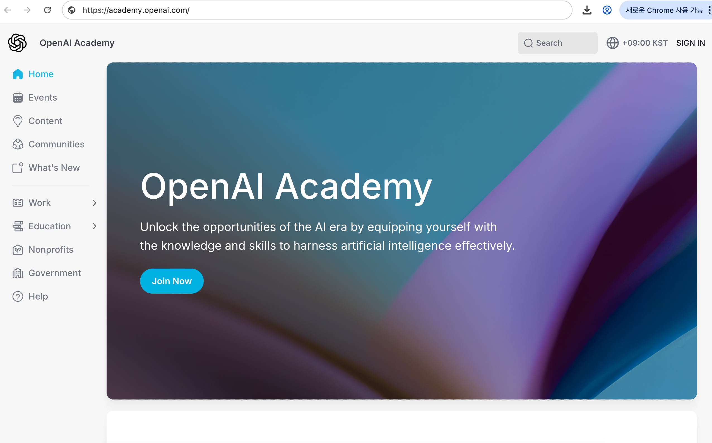
[https://academy.openai.com/](https://academy.openai.com/)
 

실은 이 사이트는 지난 4월 조용히 오픈되었었는데, OpenAI Korea 대표이신 김경훈 님께서 어제 [링크드인](https://www.linkedin.com/in/harrisonkim/)에 아래 글을 올려 주셨고 500+명의 사용자들이 반응을 보였었습니다.  
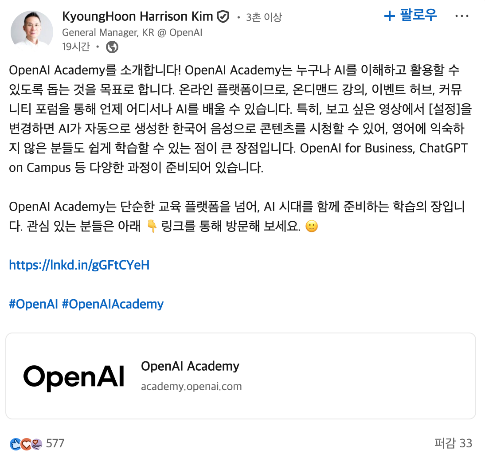 
(출처: 김경훈 대표님 링크드인)

MOOC: Massive Open Online Course 입니다. 이 글을 읽으시는 분들은 다 아실 것 같은 Coursera, Udacity, edX 등이 대표적인 MOOC였죠. 인프런, 패캠, 유데미 등이 등장하기 전이었던 그 시절, 이들 사이트는 플립러닝이라는 용어와 함께 보장된 품질을 제공하며 한때 자기주도학습의 유행을 이루어 냈었던, 그러나 (한글) 자막번역이 늘 아픈 손가락으로 남아 있었던, 그런 기억이 납니다(패쑤!).
이제 기계가 직접 읽어주기까지 하니, '입코딩'과 더불어 놀라운 시대가 열린 듯~
  
초기에 페이지를 살펴본 기억이 있어 6개월만에 얼마나 많이 변했는지 궁금하기도 해서 들어가 보았습니다. 
(살짝 스포(?)해 보면, **GPT가 버전 5로 업데이트된 8월에 콘텐트를 집중적으로 업로드** 한 것을 볼 수 있습니다)

## Login

본인의 ChatGPT 계정으로 로그인 후 이메일로 Magic Link를 받은 후 접속합니다(로그인을 안해도 동영상 보는데 큰 문제는 없는 것 같습니다).
프로필 업데이트(사진필수, 링크드인 선택) AI Interests & Applicaton 등 체크리스트를 작성하면 메인으로 갑니다.
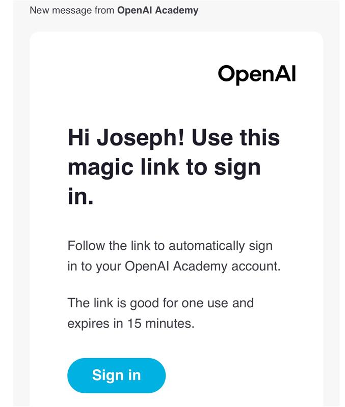 

메뉴별 특징은 다음과 같습니다.

## Home

메인 페이지. Events & Content VOD와 메뉴(왼쪽)를 보여줍니다.
메뉴는 Events, Contet, Communities, What's New 등입니다(첫 번째 그림을 참조하세요!).

## Events

Upcoming, Now, Past Livestream을 보여주네요.
예정된 스트림은 등록을 해놓으시면 메일/캘린더 일정이 등록되며, 종료된 스트림은 Content 페이지로 가시면 볼 수 있습니다.
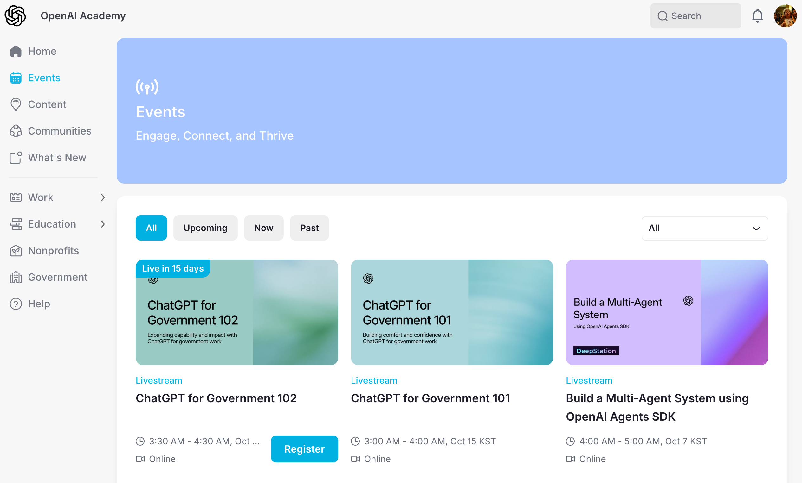
 
등록을 하면 '영수증 보기' 링크가 보여서 잠시 깜놀했는데 가격은 음... '아직은' 무료라고 나오네요. 다행입니다 :)
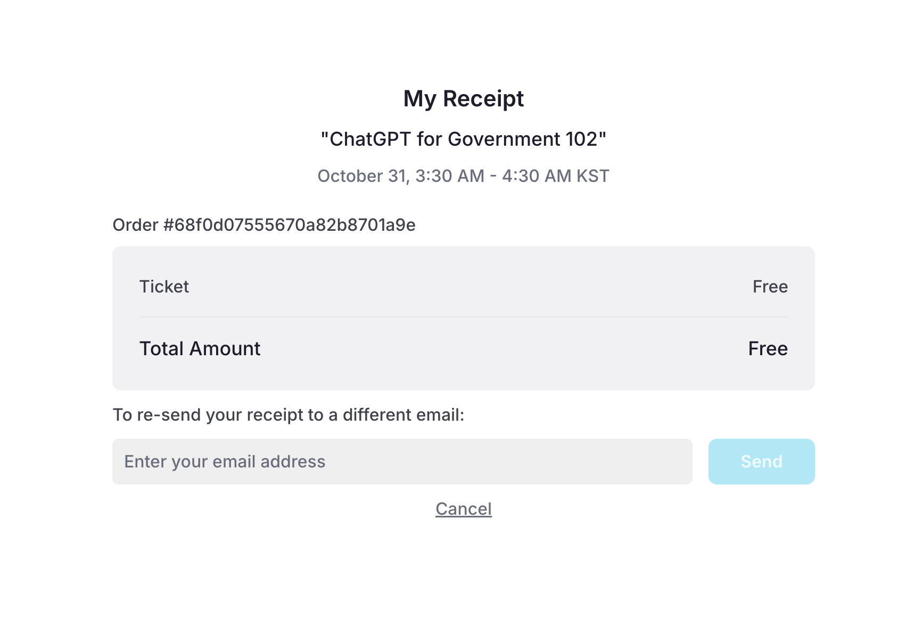

## Content

Featured, Collections, All Contents 섹션으로 나눠져 있습니다.  
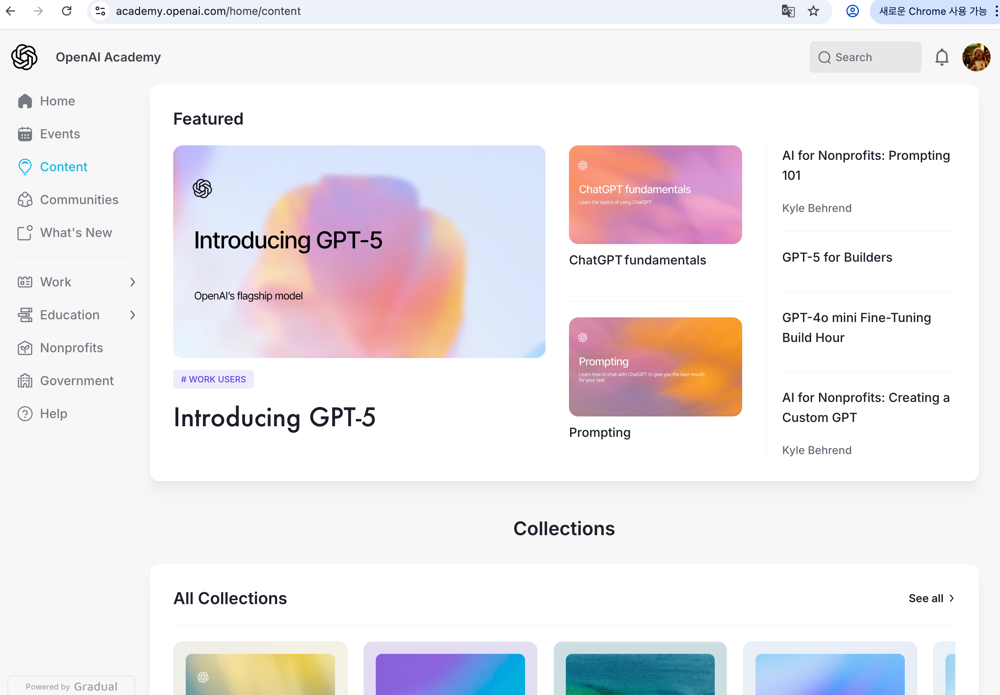

Featured > Article 항목에,
August 8, 2025 · Last updated on August 13, 2025 (가장 최신인 듯한)
**Introducing GPT-5** 타이틀이 맨 위에 위치해 있습니다.  
해시태그는 # WORK USERS 이며, X, Linkedin, 이메일로 보낼 수 있습니다.

GPT-5가 8월 7일 오픈된 것으로 나오므로, [**VOD와 콘텐트도 거의 동시에 오픈되었었네요**](https://openai.com/ko-KR/index/introducing-gpt-5/)

## Communities

타이틀을 클릭하고 들어가면, 아래 VOD 및(~~내부적으로 Youtube 말고~~ vimeo를 사용합니다) 정리된 내용이 나옵니다.
(그런데 이 시점에서 메뉴가 Content -> Communities 로 은근슬쩍 변경되어 있는 것을 알 수 있습니다!
다른 글에서는 관심사나 지역 단위로 그룹이 형성되어 동료 학습자와 교류가 가능한 메뉴라고 합니다.
https://www.ainews.com/p/openai-academy-launches-free-program-for-practical-ai-learning

### Introducing GPT-5

영상은 약 2-3분 길이로 되어 있고(다른 영상은 1분 미만-10분 분량으로 다양합니다)
**음성은 한국어 포함 10개 국어**를 선택할 수 있습니다(**해당언어 자막**도 함께 볼 수 있음).
아쉽게도(!) 웹사이트의 영어는 클로바처럼 한글 번역 기능을 제공하지는 않습니다.

Try it out for yourself 항목은 다음과 같으며,

* GPT-5 is better at writing
* GPT-5 is better at research and analysis. Summarize large datasets quickly and accurately.
* GPT-5 is better at problem-solving. Handle multi-step business problems with accuracy.

그 다음으로는 분야별 활용 케이스 및 프롬프트 예시가 나옵니다.

* 분야: **Engineering,** sales, marketing, finance, **operations**
* **예시 프롬프트는 '완벽한' 영어 자연어 문장입니다**(JSON 아님).

자세한 예시를 보려면 [여기](https://academy.openai.com/home/clubs/work-users-ynjqu/tags/prompt-packs-6849a0f98c613939acef841c)를 참고하라고 합니다. 여기에도 총 10가지 사례를 보여줍니다.
여기서 내가 관심있는 분야로 바로 들어가거나,
'ChatGPT for any role' 타이틀을 클릭해서 케이스별 Work Prompt Pack 을 받으셔도 됩니다.
(각 항목별로 'Try it in ChatGPT' 링크가 있어서 바로 실습 가능합니다)

* Communication & writing: 'Write a professional email' 등
* Meetings & collaboration: 'Summarize meeting notes' 등 5가지
* Organization & productivity

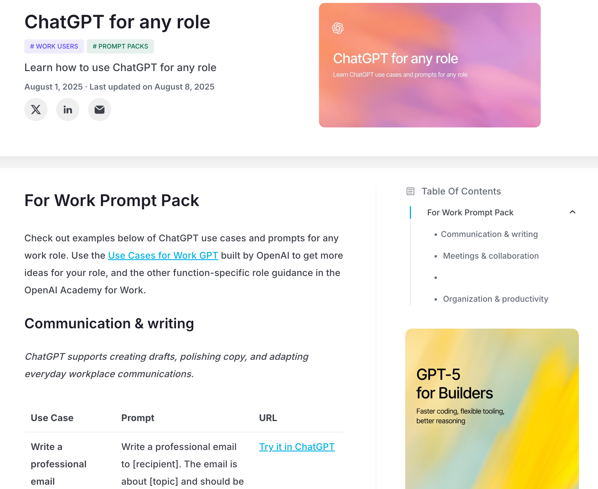

스크린샷에 **GPT-5 for Builders** 배너가 보이는데 재미있을 것 같아서 클릭해 봅니다(몇 가지 배너가 함께 넘어갑니다). 

### GPT-5 for Builders

https://academy.openai.com/home/clubs/builders-etkn1/resources/gpt-5-for-builders  
부제는 'Faster coding, smarter tools, flexible reasoning' 이며
해시태그는 **\# BUILDER \# AI FOR CODING** 입니다. 드디어 뭔가 찾은 것 같네요! : )
여기서 말하는 Builder 는, 기술적 지식이 있거나 없어도 아이디어를 실현할 수 있는 사람, 도구나 플랫폼을 사용하여 제품과 애플리케이션을 구성하고 배포하는 '사람'의 개념을 말하며 Developers와 구별하고 있습니다( ~~Agent일지도 ..~~. ).
Web3 진영/커뮤니티의 BUIDL', T사의 'Makers' 개념 등과 유사할 것 같네요.

VOD는 안보이고 영어 설명들이 쭉 나옵니다.
Core Resource 로는 다음을 보여줍니다.

* [GPT-5 Tools & Parameters Cookbook](https://cookbook.openai.com/examples/gpt-5/gpt-5_new_params_and_tools)
* [GPT-5 Prompting Guide](https://cookbook.openai.com/examples/gpt-5/gpt-5_prompting_guide)
* [Frontend Coding with GPT-5](https://cookbook.openai.com/examples/gpt-5/gpt-5_frontend)

참고로 **[OpenAI Cookbook](https://cookbook.openai.com/)** 은
단순한 이론 설명을 넘어, OpenAI API를 활용하여 실제 무언가를 만들어볼 수 있는 코드 + 가이드 형태의 콘텐트입니다. 레시피 형태로 정리된 사이트와 깃헙 저장소를 함께 제공해요(소스는 MIT Licence로 공개되어 있어 자유롭게 활용 가능). 다만 데모 레벨이 많고 보안, 에러처리 등은 별도로 보완해야 하며, 요금정책 및 API 버전 변화에 따라 어느 시점에는 일부 예제가 작동을 안할 수도 있습니다(함께 업데이트되어 갑...).
메뉴는 Topics, GPT-5, Featured cookbooks, Popular cookbooks, All 입니다(이 글 작성 시점에서 10월 11일이 가장 최신이고 243개의 레시피가 올라와 있습니다).

* 사이트: https://cookbook.openai.com/
* GitHub: https://github.com/openai/openai-cookbook

이 콘텐트와 연결이 되어 있는 페이지로는
**Welcome to the OpenAI Builder Community** 가 있네요.
해시태그는 **\# BUILDER ORIENTATION** #BUILDERS 인 것으로 보아 여기가 출발점인 것 같습니다.
이후에는 맨 아래 Dive in -> Related 섹션이 있고,
여기 나오는 몇 가지 주제들 중 하나를 클릭하면
이에 해당하는 Developers 사이트를 보여주게 됩니다.

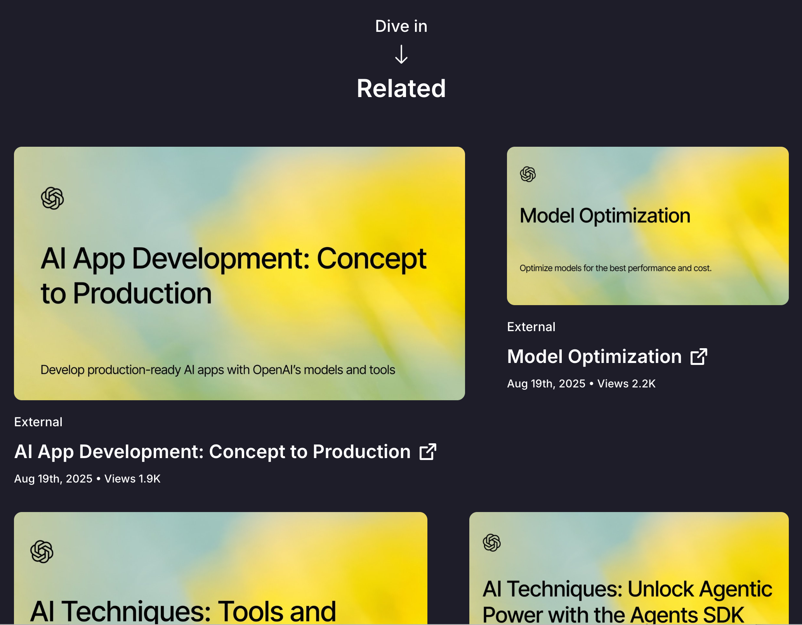 

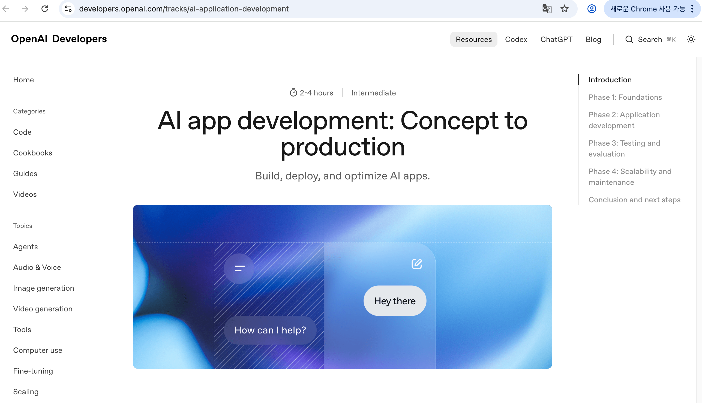 

**[OpenAI Developers](https://developers.openai.com/)** 개발자 페이지는
개발자(Developer)를 위한 OpenAI 공식 문서 및 리소스 허브라고 하며 API, SDK, 도구, 가이드, 데모 앱 등을 한눈에 볼 수 있게 구성되어 있습니다.
해당 주제 및 내용 페이지가 있고(스압주의), 왼쪽의 메뉴 중 카테고리별 메뉴는

* Code
* Cookbook
* Guides
* Videos

이며, Topic별로는

* Agents
* Audio & Voice
* Image Generation
* Video Generation
* Tools
* Computer use
* Fine-tuning
* Scaling

과 같습니다.  
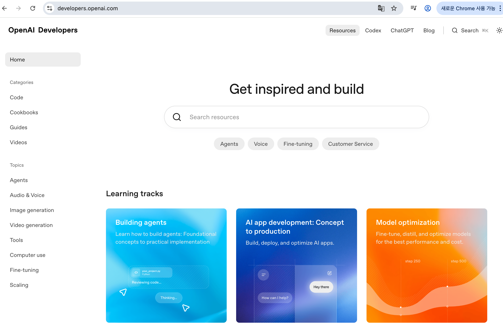

여기서 특정 주제를 더 선택하면 가이드 페이지인 '**OpenAI Platform**' 사이트로 넘어갑니다.
예) Building agents (1-3hours, Beginner) > Core concepts > guide 선택: [여기](https://platform.openai.com/docs/guides/agents)로 이동하며, 좀더 자세한 설명을 볼 수 있습니다.
(AgentKit, How to build an agent, Deploy agents in your product, Optimize agent performance, Get started)

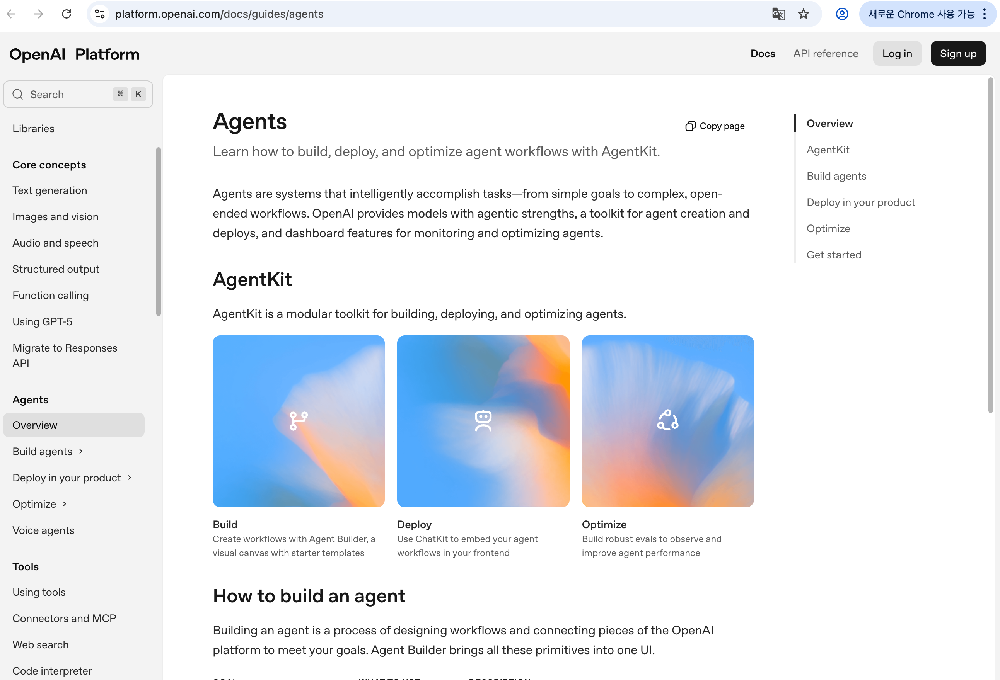 

페이지의 마지막에는 Get Started가 있고
~~실제 도구를 실행해 볼 수 있는 것 같았으나~~ 또다른 가이드 페이지로 넘어가네요.
넘어가서야 Agent Builder 실행 링크가 제공됩니다(인증=로그인 필요).

... 이렇게 가면 끝이 없을 것 같아서 일단 나와서 다른 메뉴를 소개하도록 하겠습니다 : )

 

## What's New

'Introducing GPT-5' 보다 더 새로운 콘텐트가 있었네요\~
바로 9월에 게시된 'Using ChatGPT to Spot Scams' 입니다(이 콘텐츠를 학습하면 사기를 식별하고 피하는 방법을 배울 수 있을 것 같습니다!).

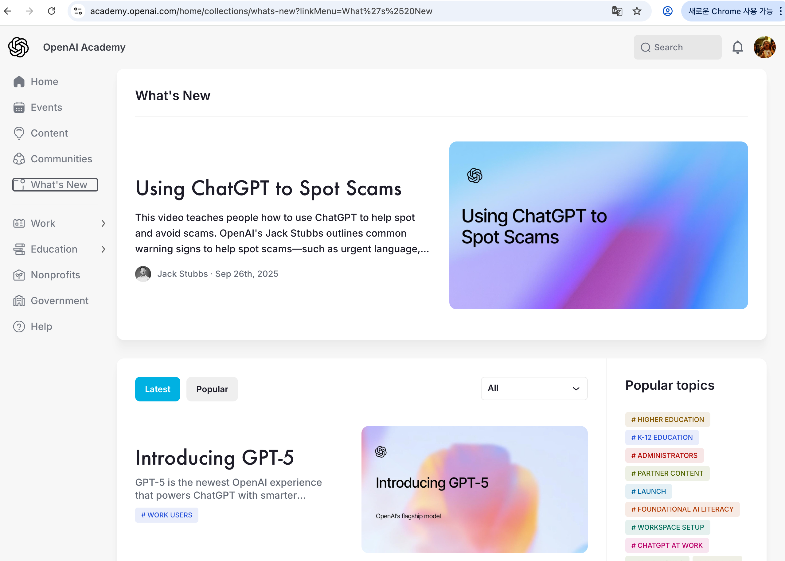 

갑자기 공유 프로젝트 하나가 보이네요!
Organize your ChatGPT work—now with team collaboration 이 소제목인 것을 보니 팀 작업에 ChatGPT를 활용하는 실습 과제인 것 같습니다. 자세한 사항은 [여기](https://academy.openai.com/home/clubs/work-users-ynjqu/resources/projects)를 읽어보세요.
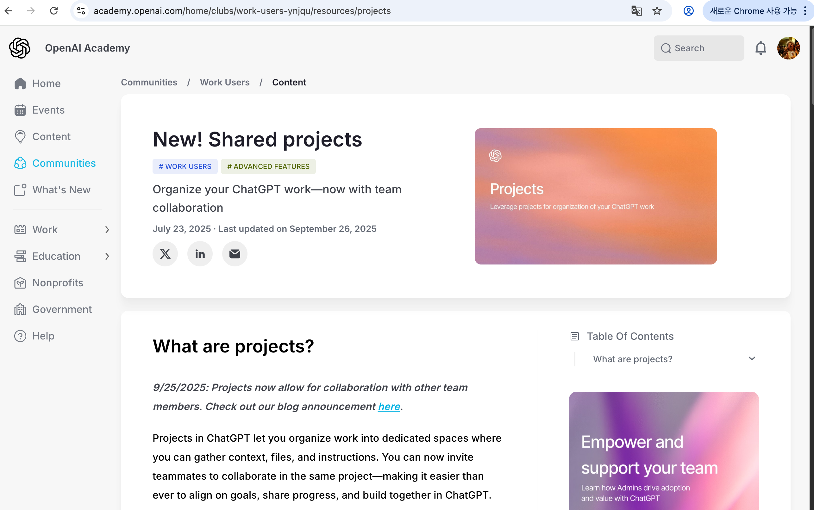 

# 다른 메뉴 카테고리들

이 네 가지 메뉴 카테고리는 나의 직무에 맞추어 활용할 수 있는 일종의 가이드 팩입니다.

## Work Users

실무자(Practitioner)로서 ChatGPT를 파트너로 활용하여 판단력, 실행 속도, 창의력을 확장할 수 있는 기본 콘텐트를 제공합니다.
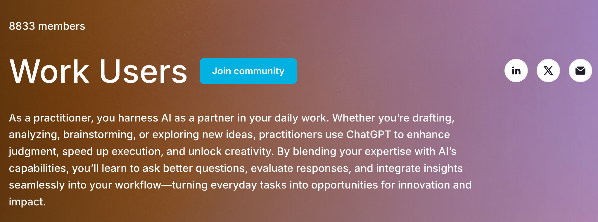 

다음과 같이 4가지(4단계?)로 구분되어 있습니다 - **Users, Admins, Champions, Builders.**

### (1) (Work) Users

**기본 콘텐트 4개**로 구성되어 있습니다. 해시태그는 # WORK USERS # INTRO TO CHATGPT 입니다. 

* ChatGPT fundamentals
* Using voice
* Creating images
* Customizing ChatGPT

### (2) Admins

**ChatGPT Admin(관리자)** 로서 필요한 사용 방법을 제공합니다.
조직이 생성형 AI의 가치를 최대한 발휘하도록 돕기 위한 워크스페이스 환경 구성, 전체 도입과정 관리 등을 포함하며, 실무자/구성원들이 보안 관점에서 안전하고, 자신있게, 회사의 목표에 부합하도록 ChatGPT에 접근하도록 지원합니다. 
4개의 콘텐츠가 제공되며, 해시태그는 # ADMINISTRATOR 입니다

* Leading impactful ChatGPT Trainings
* Example launch planner
* Comomunicating about ChatGPT Enterprise to your team
* Welcome to the For Work Admins Track!

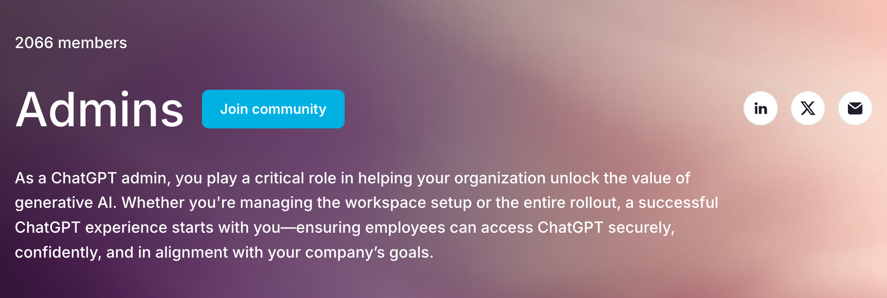

### (3) Champions

**OpenAI Champion(챔피언)** 은 모범적으로 ChatGPT를 사용하면서 동시에 조직 내 AI 활용 문화를 이끄는 역할을 맡게 됩니다. 1) 영향력 있는 AI Workflow를 공유하고, 2) 실무 중심의 사용 사례 워크숍을 운영하며, 3) 동료들이 ChatGPT을 일상 업무의 일부로 받아들일 수 있도록 영감을 주는 것이 목표입니다.
이러한 노력은 조직 내에서 1) AI 도입을 촉진하고 2) 혁신을 불러일으키며 3) 전문성을 확산시키는 원동력이 됩니다(**해커톤 플레이북**, **브레인스토밍 플레이북** 등 흥미있는 자료들을 제공하네요!).  
4개의 콘텐츠, 해시태그는 # CHAMPIONS #DRIVING ADOPTION 입니다

* Hackathon Playbook
* Team Use Case Brainstorm Playbook
* Use Case Showcase Playbook
* The AI Champion role

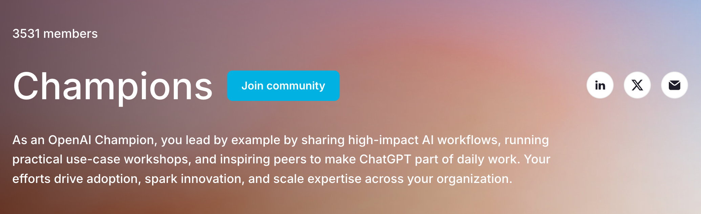 

### (4) Builders

마지막으로 Builder 는 아이디어를 (OpenAI의 도구와 접근법을 잘 익혀서) 강력한 AI 솔루션으로 실현하는 역할입니다.
Agents, RAG, Fine-tuning 등 다양한 기술을 활용할 수 있으며,
본 페이지에서는 빌더들이 AI 솔루션을 설계하고 최적화하여 자신있게 출시할 수 있는 역량과 자원을 보유하도록 돕습니다.  
4개의 콘텐트, 해시태그는 #BUILDERS #TECHNICAL LEARNING TRACKS # AI FOR CODING 입니다.

* Model Optimization
* BUilding Agents
* AI App Development: Concept to Production
* GPT-5 Builders

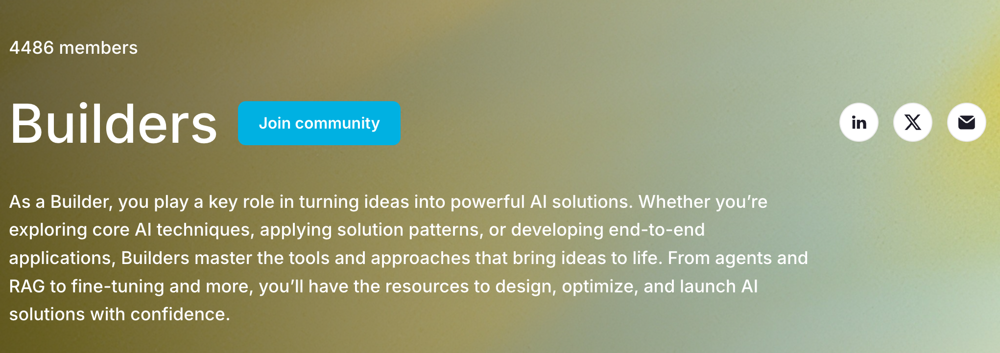 

그밖에도 Education(K-12, Higher Education), Nonprofits(비영리단체), Government(정부기관) 담당자들을 위한 가이드 팩도 제공하고 있습니다(자세한 설명은 여기서는 생략합니다).

Help 메뉴는 다음 메뉴별로 help 기능을 제공합니다.  
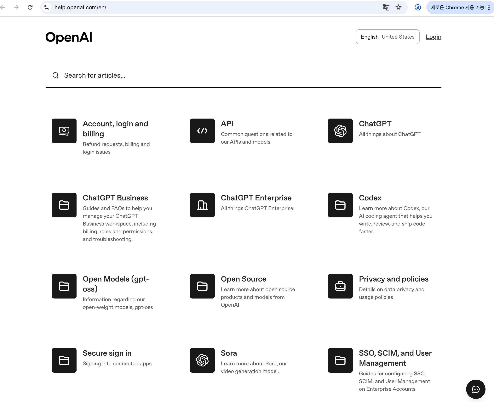 

# 마무리하며

원래는 OpenAI Academy 외에도 **Deeplearning.AI, Google AI Learn, Microsoft Learn** 또는 이와 유사한 교육 사이트들을 함께 정리하고자 했는데 이것 하나만도 길어졌네요 : )
일단 이 글을 따라가면서 전체 메뉴 훑어보기(?)에서 톺아보기(!)까지는 어느 정도 달성한 것 같으니(독자 여러분의 시간을 좀 절약했을까요 ^ ^) 이제 원하는 주제를 하나 잡아서 'Dig in' 해 봅시다! :)  
서두에 언급한 것처럼 사내에서 AI 활용사례 공모전이 진행 중인데요, 이러한 내용들이 작은 도움이 되길 바라며 이 글을 마무리해 봅니다.
읽어 주셔서 감사합니다!

