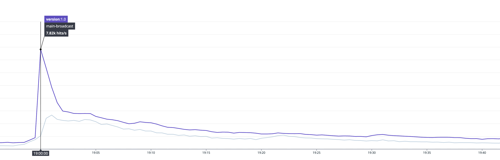
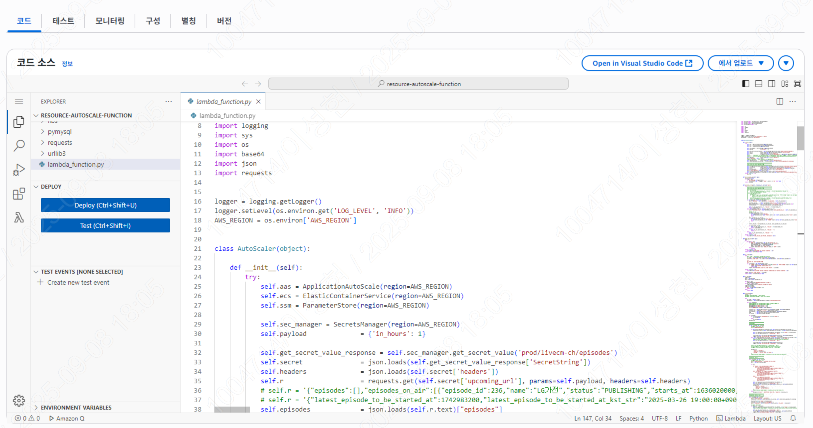

안녕하세요, 개발그룹 데이터서비스개발팀 이성현 매니저입니다. 
본 글을 통해 저희 '오!라방' 서비스의 클라우드 비용 절감 사례를 소개해 드리게 되어 기쁩니다.  
'오!라방'[(설명 참조)](https://openapi.sk.com/products/detail?svcSeq=53&menuSeq=284)은 SK플래닛의 OK캐쉬백 앱 내에서 운영되는 라이브커머스 채널링 플랫폼의 이름으로, 'OK캐쉬백'과 '라이브커머스 방송'의 합성어입니다. 오!라방 서비스가 성장함에 따라 클라우드 비용 증가 문제에도 함께 직면하게 되었는데요, 저희 팀에서는 이를 해결하기 위한 비용 절감 방안을 다각도로 검토해 왔습니다.  

비용 절감을 위해서는 먼저 주요 비용 발생 지점을 파악해야 했는데요, 
비용 리포트를 분석한 결과 **네트워크 트래픽으로 인한 AWS ELB(Elastic Load Balancing) 비용과 Amazon ECS(Elastic Container Service) 컴퓨팅 비용**이 가장 큰 비중을 차지했습니다.

분석 과정에서 오!라방의 여러 서비스 중 **프론트엔드 서버의 트래픽이 다른 API 서버들보다 월등히 많다**는 사실을 발견했습니다. 따라서 프론트엔드 서버의 구조 개선이 핵심 과제라는 결론에 도달했습니다.

# 1. 오!라방 서비스 구조 및 특징

### (1) 서비스 구성 요소

오!라방은 다음과 같은 서비스로 이루어져 있습니다. 

- **오!라방**: 방송전, 방송진입, 방송중, 방문미션 등 가장 많은 포인트 기재를 가진 오!라방의 메인 라이브 커머스 콘텐츠
- **숏폼 콘텐츠**: 짧은 형태의 커머스 영상 콘텐츠
- **라이브모아**: 방송전, 방송중 포인트 기재를 가진 라이브커머스 콘텐츠

### (2) 트래픽 특성 및 인프라 구조

오!라방과 라이브모아는 방송 시작에 맞춰 푸시를 발송합니다. 따라서 방송 시작과 동시에 사용자의 유입이 몰리게 되며, 이와 같은 구조로 인해 **사용자 트래픽은 1~2분 내에 집중됩니다.**

이러한 트래픽 패턴으로 인해, ECS의 Auto Scale 기능을 사용할 경우 스케일 아웃 전에 서비스가 다운되는 현상이 발생합니다. 따라서 **별도의 람다 코드를 통해 방송 시간에 맞춰 태스크 수를 제한하여 수동 스케일 아웃하는 방식**을 그 동안 사용하고 있었습니다.

참고로 스케일 람다는 매 15분, 45분마다 트리거가 돌면서 API 를 통해 방송 정보를 받아와 별도 로직에 맞춰 스케일 아웃과 스케일 인 동작을 실행합니다.

# 2. 기존 아키텍처의 문제점 (as-was) 

그러나 위와 같이 람다를 활용한 스케일 작업 방식은, 사전에 스케일 규모를 지정해야 하는 데서 오는 근본적인 문제점을 안고 있었습니다.

(1) **예측 불가능한 스케일링**: 스케일 아웃할 규모를 미리 예측해서 설정할 수밖에 없어, 예상 최대치에 맞춰 설정하다 보니 낭비되는 자원이 많았고, 때로는 예기치 못한 트래픽이 발생하면 ECS 태스크가 다운되는 경우도 발생했습니다.
 
(2) **불필요한 자원 유지**: 트래픽이 집중되는 1~2분을 제외하고는 굳이 컴퓨팅 자원이 필요 없음에도 불구하고, 몇 번의 예외 상황으로 인해 스케일 아웃 규모를 유지해야 했습니다.

# 3. 서버리스 아키텍처

위와 같은 이유로 기존 ELB + ECS 구조로는 오!라방의 특수한 트래픽 패턴을 효율적으로 처리하기 어려웠습니다. 그래서 **인프라 구조의 변경**을 고민했고, 이미 많이 사용되고 있고 충분히 검증된 서버리스 아키텍처인 **CloudFront와 S3 기반의 서버리스 구조로 마이그레이션**하기로 결정했습니다. 

CloudFront 와 S3 기반의 서버리스 아키텍처를 선택하게 된 이유는 아래와 같습니다.

- **불필요한 컴퓨팅 비용 제거** : 저장소 비용과 요청에 대한 비용을 기반으로 요금을 책정하는데 여기서 저장소 비용은 매우 작은 용량이기에 무시할 수 있는 수준이었고 요청에 대한 비용만 고려하면 됐기 때문에 기존 구조의 가장 큰 문제점이었던 낭비되는 불필요한 컴퓨팅 비용을 절감할 수 있습니다.
- **예기치 못한 트래픽 대처** : 컴퓨팅 자원이 따로 없기 때문에 예기치 못하게 늘어나는 트래픽에 대해서도 유연하게 대처 가능했습니다.
- **네트워크 비용 절감**: CloudFront의 비용이 동일 트래픽인 경우 ELB 대비 저렴하였기에 네트워크 비용도 절감되는 효과가 있었습니다.

위와 같은 장점을 기반으로 마이그레이션을 진행하기 위해서 몇 가지 사전 검증이 필요한 부분들이 있었습니다.

- **비용 효율성**: 기존 ELB + ECS 환경 대비 마이그레이션 후 확실한 비용 절감 예상 여부
- **성능 검증**: 최대 10,000 TPS 트래픽 처리 가능 여부

검증을 위해 현재 트래픽 기준 비용과 마이그레이션 이후 예상 비용을 산정해 비교했고, 약 $4,600 ~ $7,000 정도의 절감이 가능한 것으로 확인했습니다. 이는 기존 전체 클라우드 비용의 약 50% 에 육박하는 수치였습니다. 

이후에 성능 검증을 위헤 관련 조사를 진행해보니 CloudFront 를 통해 서비스하는 경우 최대 250,000 TPS 까지 보장하고 있어 충분히 여유있는 상황이었기에 안정적으로 프로젝트를 시작할 수 있었습니다.

# 4. 프론트엔드 경량화

위 프로젝트를 통해서도 많은 비용을 절감할 수 있었지만 추가적인 비용 절감을 위해 또 다른 문제였던 네트워크 트래픽량 절감을 위해 여러 방법을 고민했습니다. 프론트엔드 서버의 네트워크 사용량이 높은 이유를 분석해 보니 번들의 크기가 문제였습니다. 기존 Next.js 환경은 프레임워크 자체의 오버헤드로 인해 번들 크기가 컸습니다. 여러 방안을 검토한 결과, **Next.js의 구조적 한계로 인해 기본 오버헤드를 근본적으로 줄이기 어려워** 상대적으로 가벼운 **Vite로 마이그레이션**하기로 결정했습니다.

### (1) 마이그레이션 과정의 도전

Next.js 전용 hook들이 코드베이스 전반에 광범위하게 사용되어 있어 마이그레이션에 어려움이 있었습니다. 이를 해결하기 위해 **기존 로직을 대폭 수정하는 대신, Next.js hook과 동일한 API를 제공하는 커스텀 훅을 개발하여 코드 변경을 최소화**했습니다.

### (2) 개선 효과 

Vite로 마이그레이션을 완료한 결과:
- **극적인 번들 크기 감소**: JS 파일 기준 **1.4MB → 0.4MB**로 약 70% 감소
- **빠른 개발 서버**: ESM 기반의 빠른 개발 환경
- **효율적인 번들링**: 최적화된 프로덕션 빌드
- **빌드 속도 및 개발 환경 개선** (Next → Vite)

**8월 11일 배포 후 1주일간의 안정화 기간을 거쳐** 비용을 분석한 결과, **7월 대비 월 $5,000의 절감 효과**를 확인했습니다. 트래픽 변동성을 고려할 때 실제 절감액은 이보다 더 클 것으로 예상됩니다.

# 5. 요약: 프로젝트 성과

### (1) 비용 절감

- **컴퓨팅 비용**: 서버리스 구조 전환으로 24시간 인스턴스 운영 비용 완전 제거
- **네트워크 비용**: 번들 크기 70% 감소 및 CloudFront 활용으로 트래픽 비용 절감
- **운영 비용**: 수동 스케일링 작업 및 서버 관리 부담 해소 

### (2) 개발 환경 개선
- **빌드 성능**: Vite 도입으로 개발 서버 속도 및 빌드 시간 단축
- **개발 생산성**: ESM 기반 HMR(Hot Module Replacement)로 개발 효율성 향상

### (3) 기술적 성과
- **번들 최적화**: JS 파일 크기 1.4MB → 0.4MB (70% 감소)
- **확장성**: 트래픽 급증에 대한 자동 대응 체계 구축
- **안정성**: 정적 파일 배포로 인한 배포 안정성 및 롤백 용이성 확보

읽어 주셔서 감사합니다. 

