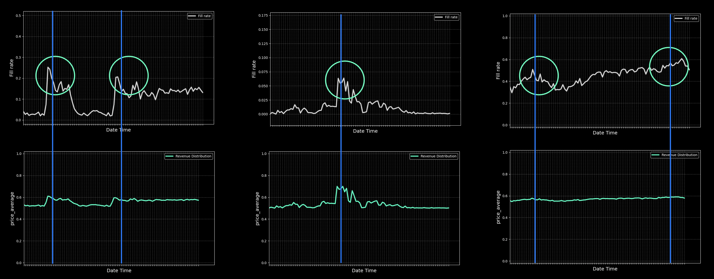
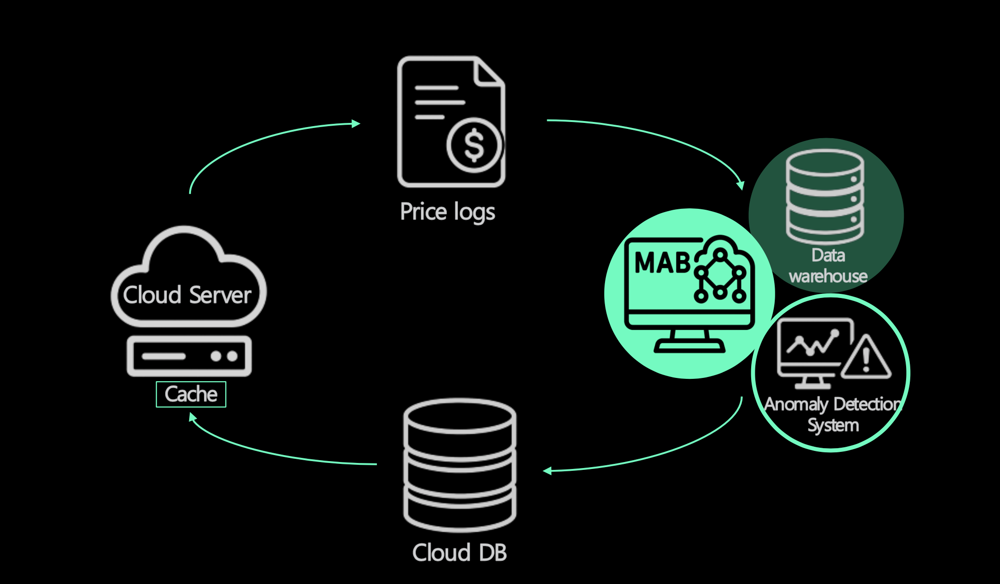
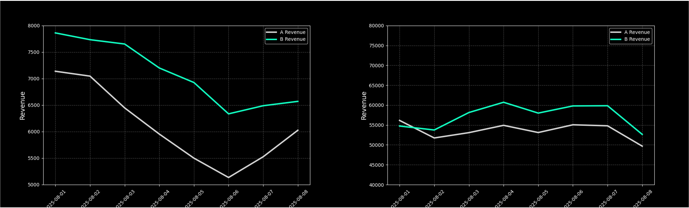
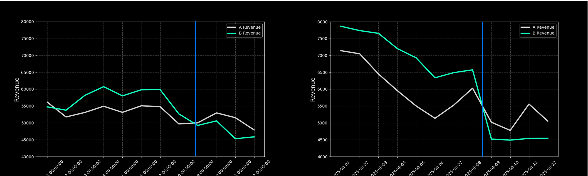
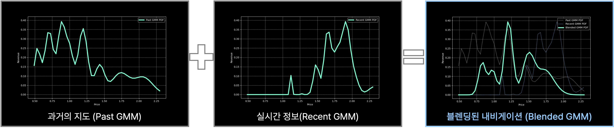
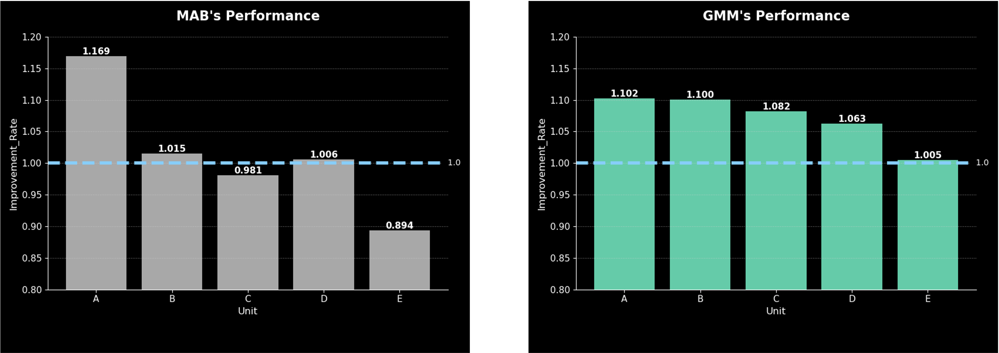
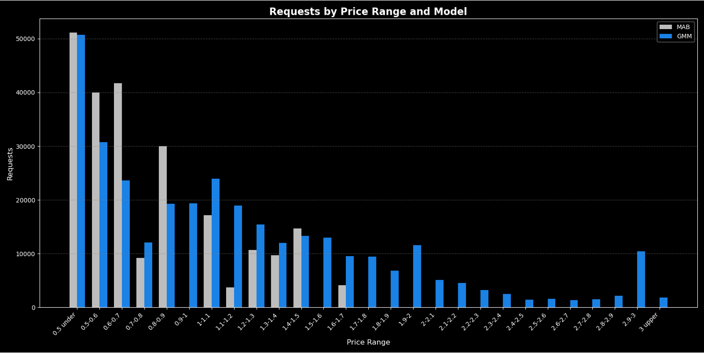

(본 사례는 SK AI SUMMIT 2025에서 발표한 사례입니다)

안녕하세요, SK플래닛 광고개발팀과 AI서비스개발팀입니다. 
이번 글에서는 저희가 협업하여 구축한 AI 기반 광고 수익 최적화 시스템의 개발 사례를 소개드리려 합니다.

SK플래닛은 OK캐쉬백, Syrup, 오락: 등 다양한 앱을 통해 광고를 노출하고 있으며, 이를 통해 수익을 창출하는 디지털 광고 생태계를 운영하고 있습니다.
광고 플랫폼은 단순히 광고를 보여주는 시스템이 아니라, **광고주(Advertiser)** 와 **매체(Publisher)** 를 연결하고, **광고 네트워크(Ad Network)** 를 통해 실시간으로 광고를 입찰하고 송출하는 복잡한 기술 인프라입니다.
특히 저희는 OpenRTB(Real-Time Bidding) 기반의 광고 입찰 시스템을 운영하고 있으며,
광고 요청이 들어오는 순간, 수십 개의 광고 네트워크에 동시에 입찰 요청을 보내고, 가장 높은 가격을 제시한 광고를 선택해 노출합니다.
이 과정에서 트래픽, 가격, 응답률, 수익률 등 다양한 요소가 실시간으로 상호작용하며,
광고 수익을 결정짓는 핵심 변수로 작용합니다.
이 글에서는 크게 두 가지 관점에서 프로젝트를 소개합니다:

>A. 시스템 관점: 광고 생태계의 구조, OpenRTB 기반 입찰 방식, 트래픽 처리, A/B 테스트 환경 등 
>B. 머신러닝 관점: 수익 최적화를 위한 알고리듬 진화 과정

광고 수익 최적화라는 현실적인 문제를, 기술과 데이터, 그리고 AI가 어떻게 풀어냈는지 그 여정을 함께 따라가 보시죠.

---
# A. 시스템 관점

## (1) 광고 생태계의 이해: Publisher, Advertiser, 그리고 Media의 연결

온라인 광고를 접하다 보면 Publisher, Advertiser, Media 같은 용어들을 자주 듣게 됩니다. 이 세 주체가 어떻게 연결되어 광고 생태계를 이루는지 쉽게 알아보겠습니다.

### 1.Advertiser (광고주) - 광고를 내는 사람 
광고주는 자신의 제품이나 서비스를 알리고 싶어하는 기업이나 개인입니다.

* 쿠팡, 배달의민족, 삼성전자 같은 기업들
* 신제품 출시, 브랜드 인지도 향상, 매출 증대가 목적
* 광고비를 지불하는 주체  
* 예시: 새로운 스마트폰을 출시한 삼성전자가 더 많은 사람들에게 알리고 싶어합니다.

### 2.Publisher (퍼블리셔) - 광고 지면을 제공하는 사람 
퍼블리셔는 사용자들이 방문하는 콘텐츠나 플랫폼을 운영하며, 그 공간에 광고를 게재할 수 있게 해주는 주체입니다.

* 블로그, 유튜브, 뉴스 사이트, 앱 개발자
* 자신의 콘텐츠나 플랫폼에 광고를 노출
* 광고 수익을 얻는 것이 목적
* 예시: 일일 방문자 10만 명인 테크 블로그 운영자가 광고 공간을 제공합니다. 

### 3.Media (미디어/광고 플랫폼) - 둘을 연결하는 중개자 
미디어는 광고주와 퍼블리셔를 연결해주는 플랫폼입니다.

* Google Ads, Facebook Ads, 카카오모먼트, 네이버 광고
* 광고주의 광고를 적절한 퍼블리셔에게 전달
* 타겟팅, 성과 측정, 결제 시스템 제공
* 예시: Google AdSense가 삼성의 광고를 테크 블로그에 자동으로 배치합니다. 

## (2) 광고 플랫폼의 진화: OpenRTB의 역할
디지털 광고 시장은 지난 20년간 엄청난 변화를 겪었습니다. 그 중심에는 표준화와 자동화가 있었죠.  
이 글에서는 광고 플랫폼의 진화 과정과 OpenRTB, Planet AD 같은 핵심 기술들을 살펴보겠습니다.

### 광고 플랫폼의 진화 3단계

(a) 1세대: 직접 판매 (1990년대) 

광고주 ←→ 웹사이트 (직접 협상) 
광고주와 퍼블리셔가 일일이 직접 계약 
수동 작업, 확장성 낮음 

(b) 2세대: Ad Network (2000년대)

광고주 ←→ Ad Network ←→ 퍼블리셔들 
Google AdSense, DoubleClick 등장 
자동화된 광고 게재, 하지만 각 네트워크가 독립적으로 운영 (폐쇄적) 

(c) 3세대: RTB 시대 (2007년~현재)

광고주 → DSP → Ad Exchange ← SSP ← 퍼블리셔 
              (실시간 입찰) 
밀리초 단위 실시간 경매 
여러 광고주가 동시에 경쟁 입찰 
최고가 낙찰자가 광고 게재 

(d) OpenRTB: 광고의 공통 언어 

OpenRTB가 해결한 문제 

* 이전: 각 플랫폼마다 다른 방식 → N × M 개의 통합 작업 필요 
* 이후: 단일 표준으로 모두 연결! 

OpenRTB란? 
IAB가 만든 실시간 입찰을 위한 표준 프로토콜입니다. 

작동 과정:
1. 사용자 웹페이지 방문
2. SSP가 광고 슬롯 정보 수집
3. OpenRTB 형식으로 입찰 요청
4. 여러 DSP들이 동시 입찰 (100ms 이내)
5. 최고가 입찰자 선정
6. 광고 노출

각각의 장점: 

* 광고주: 여러 SSP에 동시 접근, 개발 비용 절감 
* 퍼블리셔: 더 많은 광고주 연결, 경쟁으로 수익 증대 
* 생태계: 투명성 증가, 신규 진입 장벽 감소 

## (3) Ad Network와 Minimum Price의 트레이드오프
블로그나 앱으로 광고 수익을 만들 때 가장 고민되는 것 중 하나가 바로 

*"최소 입찰가(Minimum Price)를 얼마로 설정할까?"*

입니다. 이번에는 Ad Network 선택과 Minimum Price 설정의 관계, 그리고 그 사이의 트레이드오프를 알아보겠습니다.

### Minimum Price란 

Minimum Price(최소 입찰가)는 내 광고 지면에 광고가 게재되기 위해 광고주가 지불해야 하는 최소 금액입니다.  
예를 들어 광고 1회 노출당 최소 100원이라면 이 금액보다 낮은 입찰은 자동으로 거부됩니다. 물론 이 값은 Publisher가 직접 설정 가능합니다. 

### Ad Network의 역할

Ad Network는 수많은 광고주들을 모아서 실시간으로 경쟁 입찰(RTB, Real-Time Bidding)을 진행합니다. 
대표적인 Ad Network는 아래와 같습니다. 

*Google AdMob / AdSense / Facebook Audience Network / Unity Ads / AppLovin / 카카오모먼트*

트레이드오프의 핵심: 가격 vs 노출 빈도 입니다. 

**높은 Minimum Price 설정 시**

장점:
1. 광고 단가가 높아져 같은 노출수로 더 많은 수익
2. 품질 좋은 광고주만 선별
3. 프리미엄 포지셔닝 가능

단점:
1. 입찰 조건을 충족하는 광고주 감소
2. 광고 노출 기회(Fill Rate) 하락
3. 빈 광고 슬롯 증가로 총 수익 감소 가능

 
예시: 최소가를 500원으로 설정한다면

* 클릭당 수익: 높음 (500원 이상)
* 하지만 100번의 노출 기회 중 20번만 광고 표시
* 총 수익: 500원 × 20 = 10,000원

**낮은 Minimum Price 설정 시**

장점:
1. 더 많은 광고주 참여 가능
2. 높은 Fill Rate (거의 모든 슬롯에 광고 게재)
3. 안정적인 수익 흐름

단점:
1. 광고 단가가 낮아짐
2. 저품질 광고 노출 가능성
3. 사용자 경험 저하 위험

 
예시: 최소가를 50원으로 설정

- 클릭당 수익: 낮음 (평균 100원)
- 하지만 100번의 노출 기회 중 95번 광고 표시
- 총 수익: 100원 × 95 = 9,500원

## (4) 실시간 입찰 구조: Display Weight와 OpenRTB 프로세스
 실제 광고 플랫폼은 1개의 Adnetwork가 아니라 필요에 따라 수십에서 수백 개의 Adnetwork와 연결된 거대한 망 형태를 이루고 있습니다. 그렇다면 운영적인 측면에서 딜레마에 빠질 수 있습니다. 

광고가 필요한 시점에 어떤 Adnetwork에 요청을 해야 최적의 효과가 나올까? 단지 1 ~ 2개 광고만 필요할 경우에도 그때마다 모든 Adnetwork 에 요청한다면 이는 큰 트래픽 낭비를 초래합니다. 
 따라서 필요한 광고의 특정 배수(예: 4배수 또는 5배수)만큼 되도록 균등하게 Adnetwork를 선택하도록 합니다. 다만 여러 운영 노하우와 경험으로 광고 응답률이 다른 Adnetwork보다 높거나 높은 단가의 광고 응답률이 높은 업체를 대상으로 Display weight 이라는 가중치를 두어서 타 Adnetwork보다 더 많은 기회를 부과하기도 합니다.
 
 이제 Adnetowork를 선정했다면, 광고 플랫폼은 필요한 시점에 실시간으로 동시에 Adnetowork들에게 광고 요청을 하며, 가장 높은 금액의 광고를 업체의 광고를 선택하고 노출합니다. 이 일련의 과정이 앞서 말씀드린 SK플래닛 광고 플랫폼인 **Planet AD의 OpenRTB, 실시간 입찰경쟁 시스템**입니다.

## (5) 광고 트래픽 분석: 시간대별 Fill Rate와 단가 변화

아래 차트는 서로 다른 3개 Adnetwork 에서 하루(0시 ~ 24시) 동안 광고 응답률(상단 3개) 과 광고 단가 평균(하단 3개)을 노출한 차트입니다.

현재 고정된 Min Price를 사용함에도 시간마다 광고 응답률과 광고 단가 평균이 다름을 알 수 있습니다.
첫 번째 Adnetwork의 경우 상대적으로 새벽 시간 및 오후 시간대에 높은 광고 응답률을 보이고 있으며, 두 번째 Adnetwork 경우 오전쯤에 높은 광고 응답률을 보이고 있습니다. 세번째 Adnetwork 경우 새벽과 저녁에 높은 응답률을 보이고 있지만 광고 단가의 변화는 크게 없어 보입니다.

따라서 실시간으로 변화하는 패턴에서 머신러닝 알고리듬을 이용하여 최적의 Min Price 와 Display Weight를 이용한다면 매출 효율을 극대화 가능하다는 것이 저희가 내린 결론입니다.

## (6) MLOps 기반 운영 구조: 클라우드 시스템과 이상 탐지

 
광고플랫폼 MLOps는 다음과 같이 구성하였습니다.
 
 

당사의 광고 플랫폼은 AWS 클라우드 망을 사용 중이며, 서버에는 OPENRTB를 통해 전달된 업체 가격정보 응답 등 다양한 메타 정보를 가지고 있습니다. 해당 정보를 추출하여 데이터 정제, 가공 후 클라우드 망 바깥쪽에 머신러닝이 동작하는 서버로 전달합니다.  
해당 서버는 MAB를 수행하며 부가적인 데이터 및 파라미터를 Data Warehouse 에 저장하고 자체적으로 이상탐지 알고리듬으로 현재 값이 정상적인지 매출 등과 비교합니다. 만약 매출이 떨어지거나 예측값이 너무 벗어난다면 최초 초기값으로 복귀하거나 이전에 가장 매출이 좋았던 시점으로 파라미터 세팅을 변경합니다.

그렇게 예측한 값은 클라우드에서 접속 가능한 DB로 전달하며, 해당 값은 광고 서버에서 활용 가능한 캐시로 저장합니다.
  

---
# B. 머신러닝 관점
앞서 소개한 시스템 구조와 입찰 방식은 광고 수익을 결정짓는 중요한 기반이 됩니다.
하지만 이 기반 위에서 실제로 어떤 광고를, 어떤 가격에, 어떤 시점에 노출할 것인지를 결정하는 과정은 훨씬 더 복잡하고 정교한 판단을 요구합니다.

초기에는 사람이 직접 정의한 **휴리스틱(Heuristic)** 규칙을 기반으로 가격을 조정했습니다. 하지만 `광고 지면 수백 개 × Ad Network 수십 개`에 이르는 조합을 마케터가 일일이 조정하기에는 현실적인 한계가 있었습니다.

이러한 상황을 좀더 효율적으로 관리하기 위해, 저희는 머신러닝 기반의 가격 조정 알고리듬*을 도입하기로 결정하였습니다.
먼저 단순한 규칙 기반 알고리듬인 **MAB(Multi-Armed Bandit)** 을 도입 적용하였고,  
이후 MAB의 한계를 극복하기 위해 **GMM(Gaussian Mixture Model)** 기반의 모델로 진화했으며,
마지막으로 **실시간 블렌딩** 전략을 통해 시장 변화에 민첩하게 대응할 수 있는 시스템을 완성하였습니다.

이 섹션에서는 다음과 같은 내용을 중심으로 광고 수익 최적화를 위한 머신러닝 여정을 소개합니다:

(참고) 알고리듬 vs. 알고리즘: 어떻게 쓰는 게 맞을까요? [(참고: 위키피디아)](https://ko.wikipedia.org/wiki/%EC%95%8C%EA%B3%A0%EB%A6%AC%EC%A6%98)

'의외로', 알고리듬과 알고리즘의 영어 표현 및 해석은 다음과 같습니다. 

* 알고리듬(Algorithm): 어떠한 문제를 해결하기 위해 정해진 일련의 절차나 방법을 공식화한 것 
* 알고리즘(Algorism): 수학의 기수법, 셈법, 풀이법 (요즘은 거의 사용하지 않는 용어)

그러나 우리나라에서는 소프트웨어 개발에서 많이 사용하는 'Algorithm'을 두 발음 모두 혼용하는 경향이 있는 것 같습니다(저희 다른 글에서도 혼용이 있을 수 있으나 가급적 하나의 글에서는 동일한 표현을 유지하려고 노력하고 있습니다. 이 글에서는 '알고리듬'으로 정리하였습니다).

>MAB 알고리듬이 어떤 한계에 부딪혔는지  
GMM을 통해 어떻게 숨겨진 수익 기회를 발견했는지 
실시간 블렌딩 전략으로 시장 변화에 어떻게 대응했는지

데이터와 모델 중심으로, 광고 수익 최적화라는 현실적인 문제를 AI가 어떻게 풀어냈는지 그 과정을 함께 살펴보겠습니다.

---
## (1) 기존 접근 방식: 휴리스틱 기반의 수익 조정
광고 수익 최적화 문제를 처음 마주했을 때, 저희는 사람이 직접 정의한 휴리스틱(Heuristic) 규칙을 기반으로 가격을 조정하는 방식으로 접근했습니다.
예를 들어, 다음과 같은 규칙들이 사용되었습니다:

>마케터가 각 지면, 각 Ad Network에 일일이 적당한 min_price(최소가격)을 입력   
마케터의 주관적 판단으로 min_price 변경

이러한 방식은 구현이 간단하고 빠르며, 초기에는 일정 수준의 성과를 낼 수 있었습니다.
하지만 광고 플랫폼이 점점 복잡해지고, 광고 지면과 네트워크가 다양해지면서 휴리스틱 방식의 한계가 명확히 드러나기 시작했습니다.

### 현실적인 운영의 어려움
저희 광고 플랫폼은 OK캐쉬백, 시럽, 오락 등 다양한 앱에서 광고를 노출하고 있으며,
이들 앱에는 각각 수십 개의 광고 지면이 존재합니다.
또한, 광고 입찰은 수십 개의 외부 Ad Network와 실시간으로 연결되어 이루어집니다.
즉, 조정해야 할 조합은 `수백 개의 지면 × 수십 개의 Ad Network = 수천 개`의 가격 설정 문제로 확장됩니다.
이 모든 조합을 마케터가 손으로 일일이 조정하는 것은 사실상 불가능합니다.
게다가 광고 시장은 시간대, 요일, 이벤트, 경쟁사 프로모션 등에 따라 끊임없이 변화합니다.
이러한 변화를 실시간으로 감지하고, 적절한 가격 조정을 수행하는 것은 휴리스틱 방식으로는 매우 어렵습니다.

### 머신러닝 도입의 필요성
이러한 복잡성과 변화 속도 속에서, 저희는 다음과 같은 질문을 던졌습니다:

>“이 수많은 조합을 사람이 직접 조정하는 것이 과연 최선일까?” 
“시장 변화에 민첩하게 대응할 수 있는 자동화된 방법은 없을까?”  
“데이터 기반으로 더 나은 결정을 내릴 수 있는 방법은 없을까?”

이 질문들은 결국 머신러닝 기반의 가격 조정 알고리듬 도입으로 이어졌습니다.
그리고 그 첫 번째 시도가 바로 **MAB(Multi-Armed Bandit)** 알고리듬이었습니다.

---
## (2) 첫 번째 시도: Multi-Armed Bandit
광고 수익 최적화 문제를 처음 마주했을 때, 저희는 가장 직관적이고 검증된 방법부터 시작했습니다.
그것이 바로 MAB(Multi-Armed Bandit) 알고리듬입니다.
MAB는 여러 선택지(광고 네트워크) 중에서 **탐색(Explore)** 과 **활용(Exploit)** 을 균형 있게 수행하며, 각 네트워크의 성과에 따라 **bid floor(최소 입찰가)** 를 조정하는 방식입니다.
이 알고리듬은 특히 다음과 같은 상황에 적합합니다.

> 광고 네트워크가 여러 개 존재하고,  
> 각 네트워크의 성과가 실시간으로 변화하며,   
> 빠른 수익 최적화가 필요한 경우

### 왜 MAB를 선택했을까?
MAB는 다음과 같은 장점이 있습니다:

* **빠른 수렴 속도**: 단기적인 최적값을 빠르게 찾아냅니다
* **자동 적응**: 별도의 룰 없이 데이터 기반으로 학습합니다
* **낮은 구현 난이도**: 복잡한 모델 없이도 실용적인 성과를 낼 수 있습니다

 

실제로 초기 적용 시, 기존 휴리스틱 방식보다 더 높은 수익률을 보여주며 긍정적인 결과를 얻을 수 있었습니다.
A/B 테스트에서도 MAB 로직이 적용된 B 그룹이 기존 A 그룹보다 우수한 성과를 기록했습니다.

### 하지만, 예상치 못한 현상이 발생하다 
시간이 지나면서 MAB의 성과는 점점 평준화되거나, 일부 지면에서는 기존 방식보다 낮은 수익을 기록하는 현상이 나타났습니다.
이유는 명확했습니다. MAB는 다음과 같은 한계를 가지고 있었기 때문입니다:
 

* **상태(Context)를 고려하지 못함**: 예) 시간대, 디바이스, 지역 등 복잡한 변수 반영 불가
* **단순 반복 문제에 최적화**: 복잡한 상호작용이나 비선형 관계를 학습하기 어려움
* **관성적 선택**: 과거 성과가 좋았던 선택지에만 집중하며 새로운 기회를 놓칠 수 있음

이러한 한계는 광고 시장처럼 빠르게 변화하고, 복잡한 상호작용이 존재하는 환경에서는 치명적인 약점이 될 수 있습니다.

---
## (3) 문제 재정의: 현실의 복잡성
MAB을 통해 광고 수익 최적화에 일정 수준의 성과를 거두었지만, 시간이 지나면서 성과가 평준화되거나 오히려 하락하는 현상이 나타났습니다.
저희는 이 현상을 단순한 실패가 아닌, 더 나은 전략으로 진화할 수 있는 신호로 받아들였습니다.

그래서 다시 질문을 던졌습니다.  
“우리가 풀고 있는 문제는 정말 MAB가 가정하는 문제와 같을까?”

### 우리가 마주한 현실
데이터를 분석하면서, MAB의 기본 가정과는 다른 복잡한 패턴들이 존재한다는 사실을 발견했습니다.
1. **시간대별 수익 변동성**  
&emsp; 같은 가격이라도 시간에 따라 수익률이 크게 달라지는 현상이 있었습니다. 
&emsp; 예를 들어, 금요일 저녁과 월요일 아침의 수익률은 동일한 가격에서도 큰 차이를 보였습니다.

2. **비선형적 가격–수익 관계** 
&emsp;가격이 높다고 해서 항상 수익이 높아지는 것은 아니었습니다. 
&emsp;수익률은 특정 가격 구간에서 봉우리 형태로 증가했다가 다시 감소하는 비선형적인 구조를 보였습니다.

3. **가격과 응답률의 상호작용** 
&emsp;광고 응답률 역시 가격에 따라 단순히 증가하거나 감소하는 것이 아니라, 복잡하게 얽혀 있는 상호작용을 보였습니다.

### MAB의 한계, 그리고 새로운 질문
이러한 패턴은 MAB가 가정하는 “각 선택지(가격)가 독립적인 평균 보상을 가진다”는 전제와는 맞지 않았습니다.
즉, 문제 자체가 MAB의 구조보다 훨씬 더 복잡했던 것입니다.
그래서 저희는 다음과 같은 새로운 질문을 던지게 되었습니다:

> 이 복잡한 상호작용을 어떻게 모델에 담아낼 수 있을까?  
> 단순한 평균 보상이 아닌, 시간과 가격, 응답률의 관계를 함께 고려할 수 있는 방법은 없을까? 
> 우리가 보고 있는 최적이 진짜 최적인가? 혹시 더 높은 수익 기회가 숨어 있는 건 아닐까?

이 질문들은 결국, 저희가 다음 단계로 나아가는 데 중요한 전환점이 되었습니다.
그리고 그 해답은,  
**GMM(Gaussian Mixture Model)** 이라는 새로운 접근 방식에서 찾을 수 있었습니다.

---
## (4) 새로운 접근: Gaussian Mixture Model

MAB을 통해 얻은 초기 성과는 분명 고무적이었습니다. 하지만 시간이 지나면서 성과가 평준화되고, 일부 지면에서는 오히려 기존 방식보다 낮은 수익을 기록하는 현상이 나타났습니다.
저희는 이 현상을 단순한 성능 저하로 보지 않았습니다. 오히려 우리 문제의 복잡성이 기존 모델의 가정을 뛰어넘고 있다는 신호로 받아들였습니다.
광고 수익률은 단순한 평균값이 아니라, 시간대, 가격, 응답률 등 다양한 변수들이 얽힌 복잡한 지형을 가지고 있었습니다.
이러한 복잡한 구조를 더 잘 반영할 수 있는 모델이 필요했고, 그 해답은 바로 Gaussian Mixture Model, 즉 GMM이었습니다.

### GMM이란?
GMM은 데이터를 여러 개의 가우시안 분포(봉우리)로 표현하는 통계적 모델입니다.
저희는 이 모델을 통해, 광고 수익률이 단일한 평균값이 아니라 다수의 수익 클러스터로 구성되어 있다는 사실을 확인할 수 있었습니다.
예를 들어, 특정 가격대에서 수익률이 높아지는 구간이 하나만 있는 것이 아니라,
여러 개의 유망한 가격 구간이 존재하며, 이들 각각이 서로 다른 시간대나 상황에서 최적의 선택지가 될 수 있다는 점을 발견했습니다.

### GMM의 핵심 아이디어

* **다(Multi)봉우리 구조 탐색**: 수익률이 높은 여러 구간을 동시에 탐색
* **복잡한 관계 모델링**: 가격, 시간, 응답률 간의 비선형 상호작용 반영
* **포트폴리오 전략**: 하나의 선택지에 집중하는 대신, 여러 가능성을 동시에 고려

### MAB vs. GMM: 탐색 전략의 차이

MAB는 가장 먼저 발견한 봉우리에 집중하는 **전문화된 전략**을 사용합니다. 이는 빠른 수익 최적화에는 효과적이지만, 숨겨진 기회를 놓칠 수 있습니다. 
GMM은 전체 지형을 조망하며 여러 가능성을 동시에 탐색하는 **포트폴리오 전략**을 사용합니다. 이는 복잡한 지형에서 더 많은 기회를 발견할 수 있습니다.

이러한 전략적 차이는 실제 광고 수익 최적화에서 근본적인 성과 차이를 만들어냈습니다.

---
## (5) 최종 진화: GMM 블렌딩
GMM을 통해 광고 수익 지형 전체를 조망할 수 있게 되었지만, 또 하나의 문제가 남아 있었습니다.
바로 시장 변화의 속도입니다.
광고 시장은 예측 불가능한 이벤트, 경쟁사의 프로모션, 사용자 행동 변화 등으로 인해 실시간으로 요동칩니다.
과거 데이터를 기반으로 만든 GMM만으로는 이러한 변화에 민첩하게 대응하기 어렵습니다.
그래서 저희는 **GMM 블렌딩** 전략을 도입했습니다.

### GMM 블렌딩이란?
GMM 블렌딩은 두 가지 정보를 결합하는 방식입니다:
* **과거의 지도(Past GMM)** 
&emsp;장기적인 수익 패턴을 반영한 안정적인 모델 
&emsp;수백 개의 상황을 대표 그룹으로 묶고, 각 그룹별로 장기적인 수익 지형도를 학습

* **실시간 정보(Recent GMM)** 
&emsp;최근 몇 시간의 데이터를 기반으로 한 민첩한 모델 
&emsp;현재 트렌드나 이벤트에 빠르게 반응

* **블렌딩된 내비게이션(Blended GMM)** 
&emsp;두 모델을 지능적으로 결합하여, 지금 이 순간 가장 최적화된 가격을 추천 
&emsp;마치 지도 위에 실시간 교통정보를 더한 내비게이션처럼 동작

 
이 전략을 통해 저희는 장기적인 안정성과 단기적인 민첩성을 동시에 확보할 수 있게 되었습니다.
광고 수익 최적화 시스템이 단순한 모델을 넘어, 살아있는 의사결정 시스템으로 진화한 것입니다.
 
 

---
## (6) 성과와 인사이트
GMM-GMM 블렌딩 전략을 적용한 이후, 저희는 광고 수익 최적화에서 질적으로 다른 성과 패턴을 확인할 수 있었습니다.
이전까지는 특정 알고리듬이 특정 환경에서만 잘 작동하는 경우가 많았지만, GMM은 다양한 환경에서 안정적인 성과를 유지했습니다. 

### MAB vs. GMM: 성과 비교

먼저, MAB의 성과를 살펴보면 다음과 같은 특징이 있었습니다:
* **폭발적인 성과 가능성**: 특정 지면에서는 16% 이상의 수익 향상을 기록
* **환경 민감성**: 트래픽 분포나 시간대가 조금만 달라져도 성과 편차가 크게 발생
* **불안정성**: 일부 환경에서는 기준치보다 낮은 수익을 기록하기도 함

반면, GMM은 다음과 같은 특징을 보였습니다:
* **구조적 안정성**: 적용된 모든 지면에서 예외 없이 수익이 향상
* **일관된 성장 패턴**: 환경 변화에도 흔들리지 않는 성과 유지
* **복잡한 관계 학습**: 시간대, 가격, 응답률 등 다양한 변수 간 상호작용을 반영

 
이러한 차이는 단순히 알고리듬의 성능 차이라기보다는, 문제 정의와 모델의 적합성 차이에서 비롯된 것입니다.

### 숨겨진 기회의 발견
GMM은 단순히 수익을 높이는 것뿐만 아니라, 기존 모델이 놓쳤던 수익 기회를 새롭게 발견하는 데에도 효과적이었습니다.
예를 들어, MAB는 0.5 ~ 1.0 사이의 낮은 가격대에 자원을 집중하는 경향이 있었지만,
GMM은 1.1 ~ 2.9 이상의 가격대까지 넓고 깊은 탐색을 수행하며,
더 높은 수익률을 가진 봉우리를 찾아내는 데 성공했습니다. 
이러한 탐색 전략의 차이는 실제 광고 운영에서 매출의 안정성과 성장 가능성 모두를 확보하는 데 중요한 역할을 했습니다.

---
# C. 결론: AI 기반 광고 플랫폼의 진화, 그리고 다음 걸음

이번 프로젝트는 단순히 광고 수익을 높이기 위한 기술적 시도에 그치지 않았습니다.
저희는 광고 생태계의 구조를 다시 정의하고, 실시간 입찰 시스템을 정교하게 설계하며,
그 위에 AI 기반의 의사결정 시스템을 구축함으로써 지속 가능한 수익 최적화 전략을 만들어 냈습니다.

광고개발팀과 AI서비스개발팀의 협업을 통해 **OpenRTB 기반의 입찰 구조, Ad Network 운영 전략, 성과 측정을 위한 A/B 테스트 환경을 설계**했고,
**휴리스틱 → MAB → GMM → GMM 블렌딩**으로 이어지는 알고리듬 진화 과정을 통해 복잡한 시장 환경에 대응할 수 있는 지능형 가격 조정 시스템을 완성하였습니다. 

## (1) 우리가 얻은 인사이트

**광고 수익 최적화는 단순한 가격 조정이 아니다**  
지면, 네트워크, 시간대, 응답률 등 다양한 요소가 얽힌 복잡한 문제이며, 이를 풀기 위해선 데이터 기반의 접근이 필수적입니다.

**휴리스틱은 출발점일 뿐, 자동화와 적응이 핵심이다** 
사람이 직접 조정하기엔 너무 많은 조합과 너무 빠른 시장 변화가 존재합니다. AI는 이 복잡성을 다루는 데 최적의 도구입니다.

**MAB는 빠르고 효율적이지만, GMM은 더 넓고 깊은 기회를 발견한다**  
단기 최적화에 강한 MAB와, 구조적 안정성과 장기 전략에 강한 GMM은 서로 다른 강점을 가지고 있으며,
이를 실시간으로 블렌딩함으로써 두 모델의 장점을 모두 활용할 수 있습니다.

## (2) 앞으로의 방향
이번 프로젝트를 통해 저희는 살아있는 광고 수익 최적화 시스템의 가능성을 확인했습니다.
**AI가 스스로 학습하고, 실시간으로 보정하며, 변화하는 시장의 정답을 매 순간 새롭게 찾아내는 시스템**
이것이 저희가 지향하는 지능형 광고 플랫폼의 미래입니다.
앞으로도 SK플래닛은 데이터 기반의 문제 정의와 점진적인 모델 진화를 바탕으로,
더 넓은 서비스 영역으로 확장하고, 더 정교한 의사결정 시스템을 만들어 나갈 것입니다.

이 글이 광고 플랫폼의 수익 최적화에 관심 있는 분들께 작은 인사이트가 되었기를 바랍니다. 감사합니다. 
