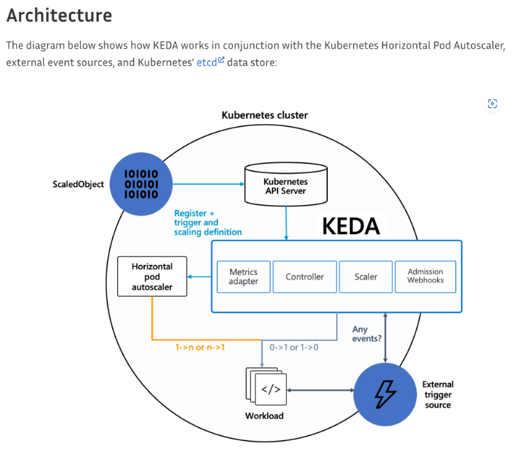

SK플래닛의 Planet AD 는 리워드 광고 플랫폼으로 현재 시럽, OK 캐쉬백, 오락, T 멤버십 등에 광고를 제공하고 있습니다. 
2023년 4월에 처음 서비스를 시작하여 이제 1년을 맞이하고 있습니다. 1년 동안 서비스를 운영하면서 팀원들이 맞닥뜨린 여러 사례들과 문제 해결을 위해 어떤 노력들을 하였는지 사례를 중심으로 말씀드리고자 합니다.

## Planet AD 와 AWS 

Planet AD 는 여러 AWS 서비스를 사용하고 있습니다. Amazon EKS 에서 여러 서비스를 운영하고 있으며, 광고 할당에는 Opensearch, DMP 타겟팅에는 DynamoDB, 데이터베이스는 Aurora MySQL 을 사용하고 있습니다. 이처럼 다양한 AWS 서비스를 사용하다 보면 비용 절감이라는 주제를 빠트릴 수 없으므로, 서비스 안정화와 비용 절감이라는 두 가지의 주제로 말씀드리고자 합니다. 

### EKS IP Pool 관리
Planet AD 는 Amazon EKS(Elastic Kubernetes Service)에서 서비스를 운영하고 있습니다. EKS에서 서비스를 운영 할 때 중요한 부분 중 하나는 부하에 따른 Autoscaling인데요, Planet AD 에서도 CPU/RAM 사용량으로 Autoscaling 설정을 해놨습니다. 그런데 트래픽이 집중되는 시간에 Node 가 새로 생성이 되었는데, IP 가 부족하여 Node 생성이 Pending 되는 현상이 발생했습니다. 

이와 같은 현상은 EKS Node의 기본 설정을 사용하게 될 경우 발생할 수 있습니다. EKS Node는 보다 빠른 Pod 생성을 위해서 Pod 에 할당 가능한 IP를 Warm  pool 로 구성하여 유지하게 됩니다. Warm pool 에 있는 IP 는 실제 Pod 에 할당되어 있지 않더라도 사용중인 IP 로 간주합니다. Warm pool 에 할당되는 IP 수는 Node의 ENI (Elastic Network Interface) 수에 따라서 결정되고, ENI 수는 Node 타입(인스턴스 타입)으로 결정됩니다. 예를 들어서 m5.4xlarge의 경우 최대 8개의 ENI 가 붙을 수 있고 각 인터페이스 당 30개의 IP 주소가 할당 될 수 있습니다. 즉 Node에서 Warm pool 에 할당하는 IP 가 30개라고 했을때, Pod가 10개만 생성이 된다면 나머지 20개의 IP는 실제 사용하지 않지만 사용중으로 취급되어 낭비되는 IP 가 생기게 됩니다. 

Pod 에 IP가 할당되는 과정

즉, 많은 수의 Node 가 스케일 아웃 되면서 기본 값으로 Warm Pool 에 할당 될 IP가 부족하여 Node 가 생성되지 않았던 것이었습니다. 따라서 낭비되는 IP 가 없도록 Warm Pool 설정의 변경이 필요합니다. Planet AD에서 변경한 설정 값은 아래와 같습니다.

* WARM_ENI_TARGET : WARM IP POOL 을 유지 하기 위한 추가 ENI 의 수
* WARM_IP_TARGET : Node 생성 시 필요한 최소의 IP 주소 수
* MINIMUM_IP_TARGET : Node 생성 시 Pod에 할당하기 위해 확보해야 하는 최소의 IP 수

`WARM_ENI_TARGET` 의 기본값은 1인데, 이는 기본 ENI외의 추가 ENI 1개에서도 Warm Pool 을 유지한다는 설정입니다. 저희는 이 설정을 삭제했습니다.
`WARM_IP_TARGET` 은 ENI 전체를 Warm Pool로 가져가지 않고 특정 IP 개수만큼만 Warm Pool을 확보하겠다라는 설정입니다. `WARM_IP_TARGET=1`로 설정되면 Pod이 생성될 때마다 Secondary IP를 1개씩 추가로 할당한다고 보시면 됩니다. 이때, Pod의 생성과 종료가 빈번한 경우 인스턴스에 IP를 Attach/Detach 하는 API call의 수가 늘어나 ENI를 추가하거나 IP를 추가하는데 쓰로틀링 이 발생할 수 있습니다.
이를 방지하기 위해 `MINIMUM_IP_TARGET`을 함께 설정합니다. Node에 일반적으로 유지되는 Pod의 수를 `MINIMUM_IP_TARGET` 으로 지정해 놓으면 해당 수만큼 ENI에 미리 IP가 할당되어 있습니다.
`WARM_IP_TARGET`과 `MINIMUM_IP_TARGET` 은 주로 사용하는 인스턴스 크기와 Planet AD 의 평균 Pod 리소스를 고려하여 설정하였습니다. 

### EKS 1.24 Containerd 런타임 IPv4,IPv6 dualstack 지원 이슈

AWS EKS 는 주기적으로 버전 업그레이드가 필요합니다. 특히나 2024년에는 추가 지원(Extended support)가 추가되면서 EOS(End Of Support) 이 후에도 지원을 받을 수 있습니다만 그만큼 과금이 되도록 변경되면서 적절한 시간에 버전 업그레이드는 필수적인 사항이 되었습니다. 업그레이드 이 후 변경점에 따라서 이슈가 발생하기도 하는데, EKS 1.23에서 1.24로 업그레이드 이 후 겪은 이슈 하나를 말씀드리겠습니다. 

EKS 1.24를 적용한 후 모니터링 중 500 에러가 증가하는 현상을 발견했습니다. 

500 에러 발생 로그

에러 로그에서는 upstream 으로 IPv6 주소를 사용하고 있습니다. 이는 EKS 1.24 의 주요 변경점 중 하나인 Docker의 CRI(Container Runtime Interface) 지원이 제거되고 `Containerd` 로 변경된 것이 원인이었습니다. `Containerd` 는 Pod의 루프백 주소로 IPv4(127.0.0.1) 및 IPv6(::1) 주소 모두를 바인딩합니다. 하지만 Planet AD 의 nginx 에서는 upstream host를 `localhost` 로 사용하고 있었는데, 이 경우에도 IPv4와 IPv6 모두 할당이 가능합니다. 그런데 upstream이 IPv4를 리스닝 중 일 때, localhost 가 ipv6 (::1) 로 되면 upstream 으로 접속이 되지 않아 이 현상이 발생하게 됩니다. 저희는 `localhost` 대신 명시적으로 `127.0.0.1`로 지정하고 IPv6 설정을 비활성화 하여 해당 현상을 방지하였습니다. 

### Autoscaling 최적화

#### KEDA(k8s Event-driven Autoscaling) 적용

앞서 CPU/RAM 사용량에 따른 Autoscaling을 설정했다고 말씀드렸습니다만, 실제 적용해보니 아쉬운 점이 있었습니다. 선제적으로 스케일링이 되지 않고 스파이크 치는 시점에 스케일링이 시작되어 1, 2분 후에 스케일링이 완료되니, 스케일링 중인 시간에 더 많은 요청이 들어오면 정상적으로 처리되지 않는 현상이 간헐적으로 발생했습니다. 이를 해결하기 위해 먼저 트래픽을 분석해 보았습니다.

Planet AD의 트래픽을 분석해 보면 크게 세 개로 구분할 수 있습니다.

Planet AD 트래픽

| 구분  |  |     |   |
| --- | ---------------- | -------------------- | -------------------- |
| 설명  | request 가 적은 새벽  | request가 최대로 발생되는 구간 | 스파이크 현상이 반복 발생되는 구간  |
그래프 범례

트래픽 그래프를 보면 새벽 시간 대에는 아무래도 유저가 줄어들어 request 가 적습니다. 그리고 저녁부터 자정까지 0X:00 에 최대 request 가 발생합니다. 그 밖의 시간대에는 한 시간 단위로 스파이크가 반복됩니다. 

각 패턴을 시간대로 구분이 가능하니, 시간대를 설정하고 이에 따른 스케일링 설정을 추가해보기로 합니다. Autoscaling 을 지원하는 여러 도구들이 있지만 cron 설정과 여러 메트릭을 트리거로 지정할 수 있는 KEDA(Kubernetes Event-driven Autoscaling)가 Planet AD에는 가정 적합하다고 생각하여 적용하였습니다. 

KEDA Architecture

잠깐 KEDA에 대해서 설명을 드리자면, KEDA는 쿠버네티스 프로젝트를 관리하는 CNCF(Cloud Native Computing Foundation)에서 관리하는 프로젝트 중의 하나입니다. 별도의 컨테이너로 설치되며, 쿠버네티스 메트릭이나 외부 DB 값등을 트리거로 설정하고 이벤트가 발생하면 스케일링을 시작합니다. 이를 위해서 `ScaledObject`와 `HPA(Horizontal Pod Autoscaling)`리소스가 자동으로 추가됩니다. 

Planet AD에서는 cron 으로 자정을 제외한 새벽 시간대에는 적은 수의 Pod 수를, 스파이크 구간에서는 스파이크가 주로 발생하는 정시보다 몇 분 이른 시간에 Pod가 스케일 아웃을 시작하도록 설정하였습니다. 

KEDA 적용 전 Pod 수 

KEDA 적용 후 Pod 수

위 그래프에서 트래픽 패턴과 유사하게 Pod가 변하는 모습을 확인 할 수 있습니다. KEDA를 적용하고 하나의 효과를 더 얻을 수 있었는데, 고정적으로 유지하던 Node 수가 트래픽 패턴에 맞추어 늘어나고 줄어들며 비용도 감소되었습니다. 

#### DNS lookup 지연 개선

DNS lookup 발생 로그

EKS 에서 Pod 가 스케일 아웃되면, 클러스터 내부에서 DNS 를 담당하는 CoreDNS 도 같이 스케일 아웃이 되어야 합니다. CoreDNS가 부족하게 되면 DNS lookup 지연이 발생하게 됩니다.

cluster proportional autoscaler 개요

Pod 수는 Node 수에 비례해서 늘어나므로 결국 Node 수 증가에 따라서 Autoscaling 이 필요하게 됩니다. 쿠버네티스에서 이런 상황에 대응할 수 있도록 제공되는 CPA(Cluster Proportional Autoscaler)를 사용하여 CoreDNS를 Autoscaling을 하게 됩니다. Planet AD 에서도 DNS lookup 지연 문제 개선을 위해 CPA를 적용하였습니다.

### RDS Proxy 적용

앞서 Planet AD의 트래픽 패턴을 보면, 특정 시간대에 스파이크가 생기는 패턴입니다. 이 때 문제가 될 수 있는 또 다른 부분이 DB Connection이 있습니다. 아무래도 접속이 늘어나면 이에 필요한 DB 요청도 늘어나고 Connection도 자연히 늘어나니까요. 그러다보니 Connection이 맺어지지 않아 요청이 실패되는 현상도 발생했습니다. 
Planet AD 서버 애플리케이션은 Golang을 사용하고 있는데, Golang MySQL Dirver에서는 fail-over 지원이 되지 않아 다른 방법을 찾던 중에 AWS RDS Proxy 를 적용하였습니다. 또 AWS RDS 는 인스턴스 크기에 따라서 지원되는 Connection 수가 다른데, RDS Proxy 의 Connection 관리에 따라서 인스턴스 스케일 아웃 없이 Connection 확장 효과도 더불어 얻을 수 있었습니다.

RDS Proxy 적용 전/후 비교

그래프에서 확인할 수 있듯이, 클라이언트 Connection이 스파이크를 그려도 RDS Proxy에서 Connection을 관리하므로 DB Connection은 클라이언트 Connection 보다 덜 가파르게 늘어나는 것을 확인 할 수 있습니다.

### DynamoDB 최적화

Planet AD에서 타겟팅 광고를 위해서 DMP 세그먼트를 사용하고 있습니다. Planet AD에서는 DMP 세그먼트를 적용을 위해 AWS DynamoDB를 사용하고 있습니다. 
DynamoDB는 완전 관리형 NoSQL DB 서비스로 읽기 용량 단위(Read Capacity Unit), 쓰기 용량 단위(Write Capacity Unit)로 과금이 되며, 읽기 및 쓰기 처리하는 방식으로는 On-Demand와 Provisioned의 두가지 방식이 있습니다. Planet AD에서는 서비스 특성에 따라 트래픽 대응을 위해 여러가지 기능이 제공되는 Provisioned capacity 모드를 사용하고 있습니다.

일 배치(batch)를 사용할 때의 DMP 타겟팅 워크플로우

처음 DMP 타겟팅은 S3를 이용하여 Dynamo DB에 세그먼트 정보를 가져와서 사용하는 방식이었습니다. 이 방식은 일 배치를 사용하므로 세그먼트 생성 후 Planet AD에 적용하기까지 최소 2일이 소요되는 점이 단점이었습니다. 이 점을 개선한 실시간 타겟팅을 적용하였는데, 적용 후 여러가지 문제가 발생했습니다. 대표적인 문제점은 아래와 같습니다. 
* 유저 한 명에 대한 DMP 세그먼트 갯수가 너무 많아 Read/Write Capacity를 높여야 했고, DynamoDB 과금 구조상 비용 증가로 이어졌습니다. 
* DynamoDB에 대한 요청이 증가하였고, 스파이크가 발생하여 쓰로틀이 발생하였습니다. 이를 대응하기 위해 Provisoned capacity 를 증가시켜야 했고, 증가 분만큼 비용 또한 늘어났습니다.

비용 증가한 문제를 해결하기 위해 기존에는 읽기/쓰기 용량 단위(R/W Capacity Unit) 당 하나의 세그먼트를 할당하였는데, 최대 100개의 세그먼트를 넣을 수 있도록 데이터 모델을 수정했습니다.

데이터 모델 수정 전/후

| Unit | 수정 전 (min-max) | 수정 후 (min-max) |
| ---- | -------------- | -------------- |
| RCU  | 6K-15K         | 1.5K-2.8K      |
| WCU  | 14K-24K        | 1K-1.7K        |
그 결과 Read/Write Capacity 가 사용량이 표의 내용 처럼 줄어들었고, 비용 또한 큰 폭으로 줄일 수 있었습니다. 

### 쉽고 빠른 AWS 비용 최적화 방법

AWS 비용을 줄이는 이슈는 Planet AD 런칭 후 지금까지 계속되는 과제입니다. 서비스의 트래픽 증감에 따라서 비용 또한 바뀔 수 있으나, 효율적으로 비용을 사용하기 위해서 적용한 몇 가지 방법들을 말씀드립니다. 

#### RI 계약

사용 중인 AWS 서비스 중에서 비용이 크고, 인스턴스 타입 변동이 제한적인 서비스 위주로 3년 RI 계약을 적용했습니다. 장기 계약을 할 경우 서비스에 따라 50% 이상 절감이 가능하므로 가장 큰 폭으로 비용을 줄일 수 있었습니다. 
다만 RI 계약을 할 경우 스케일 업 또는 스케일 아웃에 제약이 발생합니다. 계약된 인스턴스로만 사용할 수 있기 때문에 스케일 업이나 스케일 아웃으로 인스턴스가 변경될 경우, RI 계약 요금과 변경된 인스턴스의 비용이 중복으로 발생될 수 있으므로 주의 하여야 합니다. 

#### EBS Volume 변경

AWS 인스턴스에서 사용하는 볼륨 같은 경우 현재 GP2와 GP3 가 제공되고 있습니다. 서비스 특성에 따라서 GP3 를 사용하는게 유리하다면, GP3가 GP2 대비 시간당 $ 0.02 가 저렴하므로 약간이나마 비용 절감 효과가 있습니다.

#### Graviton 인스턴스 사용

Graviton 인스턴스를 사용할 경우 일반 인스턴스를 사용할 때 보다 최대 20%까지 저렴합니다. 다만 Graviton 인스턴스는 ARM 아키텍처이므로 적용하기 전 호환성 점검이 필요합니다. Planet AD 에서는 RDS와 Elasticache에 Graviton 인스턴스를 사용하고 있습니다. 

#### Datadog ASM

Planet AD에서는 보안을 위해 AWS WAF(Web Application Firewall) 를 적용하고 있었습니다. WAF 같은 경우 ACL과 요청 수에 비례하여 비용이 증가하게 됩니다. Planet AD 같은 경우 서비스 런칭 후 트래픽이 증가하는 추세이므로, WAF 비용 또한 증가할 수 밖에 없었습니다. 
Datadog ASM(Application Security Management)의 경우 WAF와 비슷하게 코드 취약성 탐지, 위협 관리 기능을 제공하면서 Datadog APM 호스트 수에 비례해서 비용이 책정되며, 이 비용 또한 WAF 비용 보다 저렴하므로 Datadog ASM을 적용하였고, WAF 비용 대비 1/3 수준으로 비용을 절감하였습니다.

## 맺음말

지금까지 Planet AD 런칭 후 약 1년 동안 팀에서 진행한 서비스 안정화 및 비용 최적화 내용을 말씀드렸습니다. 

위에서 말씀드린 내용 이외에도 Spot by NetApp을 사용하여 Spot 인스턴스의 비용을 줄이고, Datadog 이나 Spot by NetApp 에서 제공하는 각 서비스 별 리소스(CPU/MEM) 분석을 참고하여 할당되는 리소스를 최적화시키거나 급격한 트래픽 증가에 대비하기 위해 Spot by NetApp의 Headroom 설정을 하기도 하였습니다. 이러한 활동의 결과 Planet AD는 처음 런칭했을 때 대비 AWS 비용을 약 27% 절감하였습니다.

저희가 시도한 방법들이 비슷한 고민을 하고 계시는 분들에게 약간의 팁이 되길 바랍니다. 서비스 런칭 후 고생하신 팀원들, 서비스 안정화와 비용 최적화에 같이 고민해주시고 도와주신 Cloud Eng.팀과 정보보호담당 팀 담당자분께도 감사의 인사를 전합니다.

감사합니다. 