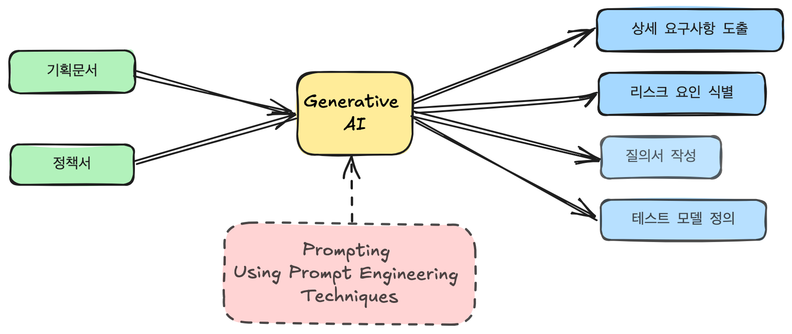
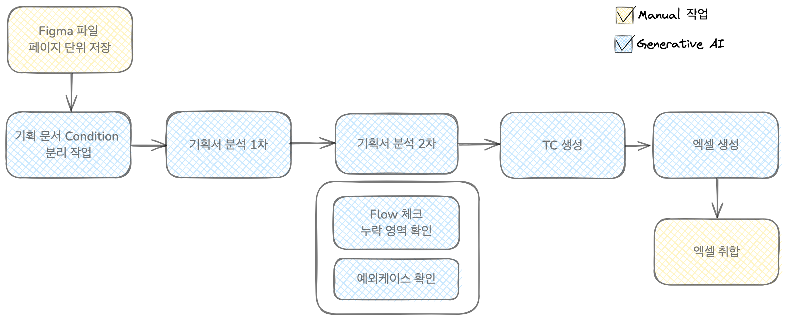
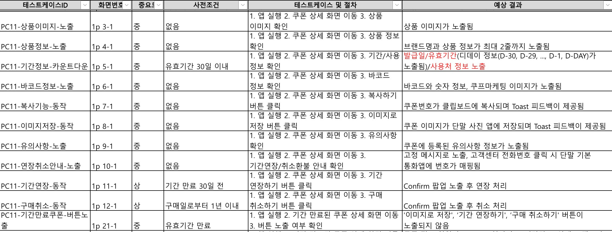

 

최근 다양한 생성형 AI 기술이 등장하면서 여러 산업 분야에서 필수적인 도구로 자리잡고 있는데요, QA(Quality Assurance) 분야도 예외는 아닙니다. AI를 QA 업무에 적절히 활용하면 업무의 효율성과 정확성을 크게 향상시킬 수 있습니다.
요구 사항 분석부터 소프트웨어 결함과 오동작 분석까지, AI는 QA 프로세스의 여러 단계에서 가치를 더할 수 있습니다.

이 글에서는 생성형 AI가 QA 프로세스의 다양한 부분에서 어떻게 활용될 수 있는지와 이를 통해 얻을 수 있는 효과를 살펴보겠습니다.

 

### AI 기술로 QA 혁신하기 : 효율성과 정확성의 두 마리 토끼 잡기
---
 
생성형 AI를 활용하여 QA 업무의 효율성을 극대화하려는 목적은 여러 가지가 있습니다. 

첫째, AI는 요구 사항 분석, 검증 전략 수립, 결함 분석 등 QA 프로세스의 여러 단계에서 시간을 단축시키는 데 큰 역할을 합니다.
전통적인 방법으로는 오랜 시간이 걸리던 작업들을 AI의 도움으로 신속하게 수행할 수 있습니다.
이는 단순히 QA 작업 시간을 줄이는 것에 그치지 않고, 휴먼 오류를 최소화하여 업무의 정확성을 높이는 결과를 가져옵니다.

둘째, AI를 활용하면 기본적인 테스트 케이스를 빠르게 작성할 수 있습니다.
이를 통해 QA 엔지니어들은 예외 케이스나 탐색적 테스트에 더 집중할 수 있어 전체적으로 더 높은 품질의 테스트 케이스를 기대할 수 있고, 결과적으로 테스트의 깊이와 폭을 확장할 기회를 얻게 됩니다. 

 

### 어떤 QA 항목에 AI를 적용할까?
---
 

QA 업무에서 생성형 AI를 적용할 부분은 주로 테스트 분석과 설계 단계입니다. 이 단계에서 AI 활용은 여러모로 큰 이점이 있습니다.

다음은 주요 적용 대상입니다. 

* 요구 사항 분석
  * 요구 사항을 명확하게 이해하고 분석하는 것은 QA 프로세스의 기본입니다. AI를 활용하면 복잡한 요구 사항을 신속하게 정리할 수 있고, 잠재적인 모호성을 사전에 찾을 수 있습니다.

* 검증 전략 인사이트
  * 검증 전략을 수립하는 과정은 종종 시간이 많이 소요됩니다. AI는 데이터를 분석하여 최적의 검증 전략을 제시함으로써 효율적인 검증 계획 수립을 지원할 수 있고, 이를 통해 전략적인 접근이 가능합니다.

* 테스트 케이스 생성 
  * AI는 기본적인 테스트 케이스를 신속하게 작성하는 데 매우 유용합니다. 이를 통해 QA 엔지니어들은 반복적이고 시간이 많이 소요되는 작업에서 벗어나, 예외 케이스나 탐색적 테스트 케이스를 보완하는 데 집중할 수 있습니다. 이 과정은 테스트의 품질을 한층 높이는 결과를 가져옵니다.

* 결함 분석
  * AI를 활용하여 결함 패턴을 식별하고, 과거 데이터를 바탕으로 결함의 원인을 찾아서 검증 계획을 수립하는데 도움을 줄 수 있습니다. 

 

### QA에 가장 적합한 AI 모델은 무엇인가?
---
 

QA 업무에서 AI를 효과적으로 활용하기 위해, QA에 맞는 아웃풋을 제공하는 생성형 AI를 선정하는 작업을 진행했습니다.
ChatGPT-4, ChatGPT-4o, Copilot 그리고 Gemini 등 다양한 LLM 서비스에 동일한 인풋을 제공하여 각 모델이 어떤 결과물을 내놓는지 비교해 보았습니다.

최종적으로 OpenAI의 ChatGPT-4o를 QA에 활용할 LLM 서비스로 선택하였습니다. 특히 이 모델은 이미지나 PDF 형식의 기획서를 효과적으로 분석한 후, 그 데이터를 바탕으로 엑셀 형식의 산출물을 자동으로 생성할 수 있는 점이 큰 강점으로 보였습니다.
이러한 강점들은 QA 프로세스 전반에서 문서 분석과 데이터 정리에 드는 시간을 줄이고, 효과적인 QA 작업을 가능하게 할 것으로 예상됩니다.

현재도 새로운 생성형 AI들이 꾸준히 등장하고 있기 때문에,
앞으로도 QA 작업에 적합한 프롬프트를 정형화하고 다양한 모델을 검토해서 최적의 방법을 찾아나갈 예정입니다.

 

### 프롬프트 엔지니어링이 중요한 이유
---
 

프롬프트 엔지니어링은 AI 모델에게 올바른 질문을 던져 더 정확하고 유의미한 답변을 이끌어 내기 위한 필수 과정입니다. 
잘 설계된 프롬프트는 AI가 할루시네이션 없이 일관성 있는 결과를 도출하는데 도움을 줍니다.
그럼 QA 업무에서 프롬프트 엔지니어링이 왜 중요한지 살펴볼까요?
 

<u> 정확성 및 일관성 향상 </u>

QA 업무에서는 소프트웨어의 결함을 발견하고 수정하는 것이 핵심입니다. 명확하고 구체적인 프롬프트는 AI가 생성하는 테스트 케이스 및 결함 분석 결과의 정확성을 높여, 실수나 누락을 최소화하는데 기여합니다. 
예를 들어, 테스트 케이스를 작성할 때 명확한 입력값과 기대 결과를 지정하면, AI는 더 신뢰할 수 있는 결과를 도출할 수 있습니다.

<u> 다양한 응답 생성 </u>

QA 업무에서 테스트 범위를 넓히는 것이 매우 중요합니다. 적절한 프롬프트를 통해 AI는 다양한 각도에서 정보를 제공하며, 이는 예외 케이스나 경계 조건을 포함한 더 포괄적인 테스트 케이스 생성을 가능하게 합니다.
이로 인해 테스트의 깊이와 폭이 향상되어, 더 높은 품질의 소프트웨어를 보장할 수 있습니다.

<u> 모델의 한계 보완 </u>

AI 모델은 모든 질문에 완벽하게 답할 수는 없지만, 프롬프트 엔지니어링을 통해 모델의 한계를 보완할 수 있습니다.
QA 업무에서는 기술적인 세부 사항이나 복잡한 요구 사항이 종종 존재하므로, 프롬프트를 통해 필요한 정보의 맥락을 제공함으로써 AI가 더 적절한 답변을 도출하도록 유도할 수 있습니다.

<u> 사용자 경험 향상 </u>

최적화된 프롬프트는 QA 엔지니어가 AI를 더 쉽게 이해하고 사용할 수 있게 해 주며, 전반적인 사용자 경험을 향상시킵니다.
또한, 효율적으로 설계된 프롬프트는 QA 엔지니어가 반복적인 작업에서 벗어나 더 창의적인 문제 해결에 집중할 수 있도록 돕습니다. 
결국, 프롬프트 엔지니어링은 QA 프로세스에서 AI를 효과적으로 활용하는 데 필수적인 요소이며, 이를 통해 보다 높은 결과물을 기대할 수 있습니다.

 

### 프롬프트 엔지니어링: QA 업무에서 AI를 똑똑하게 사용하는 방법
---
 

AI를 QA 업무에 최적화하여 활용하려면 효과적인 프롬프트 작성이 필수적입니다.
다음은 QA 업무에 도움이 되는 몇 가지 프롬프트 기법과 이들이 어떻게 특정 업무에 효과적으로 적용될 수 있는지를 살펴보겠습니다.  
 
<u> Chain-of-Thought Prompting</u>

Chain-of-Thought Prompting은 AI에게 문제를 단계적으로 해결하도록 유도하는 기법으로, 중간 추론 단계를 제시하여 복잡한 추론이 가능하도록 합니다.
특히 이 기법은 기획 문서나 정책서를 분석하는 데 효과적입니다. 복잡한 문제를 단계별로 쪼개서 접근하면, 더 깊이 있는 분석이 가능합니다.

**작성 예시**
>1단계: 테스트 케이스 작성을 위해 조건 문구를 식별하세요. 예: '~시', '~하면', '~하는 경우', 식별된 문구를 세 개의 큰 따옴표("""...""")로 묶어 표시하세요.
>
>2단계: 조건 문구가 없는 결과값에 필요한 조건을 생각해보고, 이를 세 개의 큰 따옴표("""...""")로 묶어 작성하세요.
>
>3단계: 조건과 결과를 매칭해 표로 작성하세요. 반복되지 않도록 주의하고, 정의는 상세히 작성하세요. (주의: 최종 표만 출력, 따옴표로 묶은 내용은 제외)

이 과정을 통해 AI는 테스트 케이스 작성을 위한 조건과 결과를 명확히 정리할 수 있습니다.
각 단계는 문제를 분석하고 필요한 요소를 식별하는 데 집중하며, 최종적으로 AI는 조건과 결과를 체계적으로 매칭한 표를 생성하여 보다 효율적인 테스트 케이스 작성을 가능하게 합니다.

이러한 접근은 QA 프로세스에서 필요한 조건과 결과를 명확히 이해하고 정리하는 데 큰 도움이 됩니다.  
 
<u> Chain-of-Question Prompting </u>

Chain-of-Question Prompting은 AI에게 연속적인 질문을 던져 문제를 심도 있게 파악하게 하는 기법입니다.
이 기법은 QA 업무에서 각 흐름에 대하여 명시가 잘 되어 있는지 점검하고, 논리적 결함이나 보완이 필요한 부분을 찾는 데 매우 유용합니다.
  

**작성 예시**

>1. 로그인 프로세스에서 누락된 시나리오가 있는지 확인하세요.
>    * 어떤 조건이나 사용자 행동이 로그인 시나리오에서 간과 되었을 수 있을까요?
>2. 누락된 시나리오에 대해 해당 시나리오가 발생할 경우, 시스템에 미칠 영향을 분석하세요.
>    * 이 누락된 시나리오가 발생하면, 사용자 경험에 어떤 문제가 발생할 수 있을까요?
>    * 시스템 보안이나 데이터 무결성 측면에서 어떤 리스크가 있을까요?
>3. 이런 문제를 예방하기 위해 로그인 프로세스를 어떻게 개선할 수 있을까요?
>    * 어떤 항목에 대하여 추가 검증이나 오류 메시지를 제공하는 것이 도움이 될까요?

이 방식은 AI가 잠재적인 문제나 누락된 테스트 케이스를 발견하는 데 효과적일 뿐만 아니라, QA 프로세스에서 중요한 항목을 놓치지 않도록 도와줍니다.
연속적인 질문을 통해 QA 엔지니어는 각 흐름의 논리적 연결을 검토하고, 예상치 못한 결함이나 리스크를 조기에 식별하여 시스템의 전반적인 신뢰성을 높일 수 있습니다.
이렇게 함으로써 QA 업무는 더 체계적이고 신뢰할 수 있는 결과를 도출할 수 있습니다.  
 
<u> Least-to-Most Prompting </u>

Least-to-Most Prompting은 기본 테스트 케이스에서 시작하여 점진적으로 복잡한 테스트 케이스를 생성하는 기법입니다.
이 기법은 간단한 조건부터 시작하여 점진적으로 복잡성을 추가함으로써, 각 단계에서 테스트 케이스의 안전성과 기능성을 검증하는 데 도움이 됩니다.

**작성 예시**
>1단계: 사용자가 올바르게 로그인했을 때의 기본 테스트 케이스를 작성하세요.
>
>2단계: 잘못된 비밀번호 입력 시 발생할 수 있는 시나리오를 추가하세요.
>
>3단계: 보안 제한 기능을 테스트하는 시나리오를 제시하세요.

이 기법의 장점은 QA 엔지니어가 초기 조건을 명확히 설정하고, 그에 따라 발생할 수 있는 여러가지 예외 상황을 구조적으로 다룰 수 있습니다.
각 단계에서 AI는 기본적인 흐름을 기반으로 테스트 케이스를 확장하며, 이는 QA 프로세스에서 예상치 못한 결함이나 보안 취약점을 사전에 발견하는 데 큰 도움이 됩니다.

또한, 이 방법은 QA 팀이 복잡한 시스템 요구 사항을 효과적으로 분석하고 문서화하는 데도 도움이 됩니다.
단계적으로 테스트를 진행함으로써, QA 엔지니어는 각 단계의 결과를 명확히 평가할 수 있으며, 필요할 경우 추가적인 시나리오를 생성하여 전체적인 테스트 범위를 확장할 수 있습니다. 

이러한 접근은 궁극적으로 소프트웨어의 품질 향상에 기여하게 됩니다.  
 
<u> Role-based Prompting </u>

Role-based Prompting은 AI에게 특정 역할을 부여하여 문제를 해결하도록 유도하는 기법입니다. 이것은 AI가 특정 역할에 맞추어 실질적이고 현실적인 테스트 케이스를 작성할 수 있도록 하여, QA 프로세스의 실제 상황을 반영할 수 있습니다.

**작성 예시**
>당신은 QA 엔지니어입니다. 결제 페이지의 UI 테스트를 진행하세요.
>UI가 다양한 해상도에서 어떻게 반응하는지 테스트 케이스를 작성하세요.

이 기법을 활용하면, AI는 QA 엔지니어의 시각에서 요구되는 테스트를 이해하고 그에 맞는 구체적인 테스트 케이스를 생성할 수 있습니다.

  
 
<u> Contextual Prompting </u>
 
 

Contextual Prompting은 QA 업무에 특정 상황을 제공해 AI가 그에 맞춰 더 적합한 답변을 생성하도록 하는 기법입니다.
구체적인 상황을 제공하면 AI는 그에 맞춘 정확한 테스트 케이스를 제안하기 때문에, QA 과정에서 발생할 수 있는 다양한 시나리오에 대한 대비가 가능합니다.

**작성 예시**
>최근 업데이트된 사용자 정보 수정 기능을 테스트하려고 합니다. 이를 위한 시나리오를 설계하세요.
>잘못된 데이터 입력 시 발생할 수 있는 오류 메시지와 그에 대한 대응 방안을 작성하세요.

이 기법을 사용하면 AI는 상황에 맞는 구체적이고 실질적인 답변을 생성합니다.
특히 이것은 QA 프로세스에서 중요한 요소인 세부 사항을 놓치지 않도록 도와주며, 보다 실용적인 테스트 시나리오를 설계할 수 있게 합니다.

Contextual Prompting은 특정 상황을 이해하고 테스트 케이스 반영을 위한 중요한 기법으로, 다양한 업무 영역에서 문제 해결에 큰 도움이 될 것입니다.

 

### 활용 예시 (1): 테스트 설계 단계에서 요구 사항 분석
---
 

이제 이렇게 개발한 프롬프트를 실제 QA 업무에서 어떻게 활용할 수 있는지 살펴보겠습니다.

테스트 설계 단계의 핵심인 요구 사항 분석 과정입니다.
검증 요건에 대한 기획 파일이나 정책 문서를 입력으로 사용하고, 이를 바탕으로 프롬프트를 활용해 상세 요구 사항, 리스크 요인, 질의서 등을 도출하며, 효과적인 테스트 모델을 정의할 수 있습니다.

 
설계 화면과 화면 설명을 포함한 기획서를 첨부하고, 여기서 요구 사항 분석을 요청하는 프롬프트를 활용하여 진행해 보았습니다.
가능한 모든 경우의 수를 고려해 요청했더니, AI는 테스트 케이스 작성을 용이하게 할 수 있도록 조건문을 깔끔하게 분리하고 정리해 주었습니다.

이러한 방식으로 요구 사항을 분석하면, 복잡한 테스트 케이스를 작성할 때 특정 조건이 누락되는 것을 방지할 수 있습니다.
  

**프롬프트 일부**
>...
>
>기획서 분석 과정에서 중요한 세부 사항을 놓치지 않도록, 기획서의 모든 화면 요소와 기능을 최대한 상세하게 분석해 주세요.
>
>특히 다음 사항을 포함해 주세요:
>화면 내 각 요소의 위치와 역할
>각 버튼 및 인터랙션의 기능과 예상 동작
>다양한 시나리오에서 기능이 어떻게 동작해야 하는지
>
>가능한 모든 경우의 수를 고려하여 테스트 케이스를 작성할 수 있도록, 기획서를 구체적이고 상세하게 분석해 주세요.
>
>...

**응답 일부**

>...
>
>블럭 노출: 당일 1회차 경기 전에 블럭이 노출되지 않음
>정렬: 최근 진행 회차 순으로 노출
>공동 우승 시: 우승자 명 모두 노출
>5줄 초과 시: '더보기' 버튼이 노출되며, 선택 시 5줄씩  추가로 노출. 더 이상 정보가 없는 경우, 더보기 버튼이 노출되지 않음.
>
>...

 
두 번째로는 예상하지 못한 케이스를 확인하기 위한 프롬프트를 작성했습니다. 
이 프롬프트는 경계값이나 예기치 못한 사용자 행동을 점검하도록 설계되었습니다.

AI의 답변을 확인해 보니, AI는 우승자 정보가 변경되는 경우에 대한 흐름이 정의되지 않았다는 점을 지적하고 있었습니다.
이렇게 도출된 사항은 한 번 더 검토하여 테스트 케이스에 추가할 수 있으니, QA 프로세스에서 놓칠 수 있는 세부 사항까지 철저히 관리할 수 있는 기회를 제공합니다.

**프롬프트 일부**
>...
>
>기획서에서 고려하지 않았거나 발생할 가능성이 낮지만, 중요한 예외 케이스를 도출해 주세요.
>특히, 경계값, 빈 입력, 잘못된 형식의 데이터, 예기치 못한 사용자 행동 등 다양한 예외 상황을 포함해 주세요.
>

**응답 일부**
>...  
>문제 설명:
>
>기획 문서에서는 닉네임, 프로필 이미지, 경기 진행 날짜, 시간, 회차 정보 노출 및 정렬에 대한 정의만 제공하고 있습니다.  
>하지만, 우승자 정보가 변경되거나 삭제되어야 할 경우에 대한 처리는 명확하게 정의하지 않았습니다.
>
>...

 

### 활용 예시 (2): 테스트 케이스 생성
---
 

다음 단계에서는 앞서 분석한 요구 사항을 바탕으로 체크리스트나 테스트 케이스를 작성합니다.
이때 이전 단계에서 AI를 활용하여 도출한 상세 요구 사항과 리스크 요인 인풋으로 넣고 프롬프트를 활용하여 테스트 케이스를 작성합니다.
  

  

 
앞에서 분석한 요구사항을 기반으로 테스트 케이스 생성 프롬프트를 사용하여 하나의 결과물을 만들어 보았습니다.
테스트 케이스는 기본적으로 고정된 형식이 있기 때문에, 이 형식을 프롬프트에 명확히 정의해 두면, AI는 매번 일관된 형식의 결과물을 자동으로 생성해 줍니다.

 
 

**프롬프트 일부**
>당신은 QA 엔지니어입니다. 주어진 기획서를 바탕으로 기본 기능 테스트를 위한 테스트 케이스를 작성해 주세요.
>기획서의 모든 세부 사항을 철저히 검토하고, 포괄적인 테스트 케이스를 만들어 주세요.
>
>#예시#
>[["테스트 케이스 ID", "화면 번호", "중요도", "사전조건", "테스트 케이스 및 절차", "예상 결과", "비고"], ["PC10-알림 영역-01", "3p 1-3", "상", "받을 포인트가 있는 경우", "1. 포인트콘 메인 화면 접근\n2. 알림 영역 확인", "포인트 알림이 표시됨", ""]]

또한, AI가 지적했던 예외사항 시나리오에 대한 피드백을 반영하여 해당 부분을 테스트 케이스 생성 프롬프트에 추가할 수 있습니다.
이를 통해 예상하지 못했던 시나리오까지도 꼼꼼히 관리할 수 있어서 테스트 과정에서 놓칠 수 있는 부분을 미리 대비할 수 있게 됩니다.

 

### 활용 예시 (3): 결함 분석
---
 

생성형 AI를 활용하면 결함 분석이 더욱 효율적으로 이루어집니다.
결함 분석은 발생한 버그의 경향을 파악하고, 심각도를 분류하여 우선적으로 해결해야 할 문제들을 식별하는 데 중요한 역할을 합니다.

예를 들어, AI를 통해 단말 별, OS 버전 별 결함 통계를 빠르게 확인할 수 있으며,
이러한 통계는 회귀 검증(Regression Test) 시 결함이 집중적으로 발생되는 단말을 선별하는 데 큰 도움이 됩니다. 이를 통해 QA 팀은 더 중요한 업무에 집중할 수 있게 됩니다.

AI에게 프롬프트를 입력하여 결함의 원인을 자동으로 분석하고 패턴을 도출할 수도 있습니다.
"최근 3개월 동안 발생한 결함의 공통 요소를 분석하세요."라는 프롬프트를 입력하면, AI는 결함 발생 시점, 기능, OS 버전, 사용자 행동 등의 공통점을 찾아 분석해 줍니다.
이를 통해 반복되는 문제를 쉽게 파악하고 근본 원인에 대한 방법을 찾을 수 있습니다.

현재 검증 중인 기능에서 발생한 이슈를 심층적으로 분석하는 것도 가능합니다.
이러한 분석은 탐색적 테스팅에 활용되어 기존 테스트에서 놓쳤던 결함을 효과적으로 찾아내는 데 사용됩니다.

예를 들어, "description의 단말 정보와 재현 스텝 컬럼을 참조해서 단말별 이슈 중 어떤 상황에서 문제가 많이 도출되는지 분석해 줘"라는 프롬프트를 통해 더욱 구체적인 인사이트를 얻을 수 있습니다.

AI 기반의 결함 분석을 통해 결함의 심각도 분류, 통계, 경향 분석을 자동화하고, 이를 바탕으로 QA 업무의 효율성 개선 여부를 검토할 수 있습니다.

 

### 실제 서비스에 AI 적용해보기
---
 

이제 우리는 앞서 확인한 AI의 활용도를 바탕으로 포인트로 쿠폰을 구매하고 관리하는 서비스 검증에 시범 적용해 보았습니다.
먼저, 기획 문서를 AI를 통해 철저히 분석하여 요구 사항을 명확히 파악했습니다. 그 다음, 이러한 요구 사항을 토대로 테스트 케이스를 작성하는 과정에서도 AI를 활용했습니다.

 
결과물은 엑셀 파일로 생성되어, 이를 통해 테스트를 바로 수행할 수 있었습니다.

 
시범 적용 결과, 검증 과정에서 수정이 필요한 케이스도 발견되었지만, 전반적으로 기능 검증에 유용하였습니다.

특히 예외 케이스를 통해 이슈를 검출할 수 있는 가능성도 있었습니다.
다만 복합 케이스에 대해서는 보완이 필요하며, 전체 시스템에 대한 이해도가 포함되면 더욱 좋을 것 같습니다.

AI를 활용한 작업 결과물은 100% 완벽하지는 않습니다.
보완 작업이 분명히 필요하며, AI를 활용하기 위해서는 이러한 한계를 줄일 수 있는 방법을 꾸준히 연구해야 할 것입니다.
앞으로의 QA 과정에서 AI의 장점을 최대한 활용하면서도, 수작업으로 작성한 테스트 케이스와의 균형을 잘 맞추는 것이 중요한 과제가 될 것 같습니다.

 

### 마치며
---
 

마치 스마트폰이 처음 등장했을 때, DMB도 안 나오고 배터리 분리도 안 되어 불편하다며, 디지털 카메라와 MP3 플레이어가 훨씬 낫다(?)고 하던 시절이 혹시 기억나시나요?
당시에는 많은 사람들이 스마트폰의 불편함을 강조했지만, 지금은 우리 생활에서 없어서는 안 될 필수품이 되었습니다.

이처럼 ChatGPT도 처음에는 "파일 분석도 안 되고 느리며 거짓말을 하는 도구"라고 불리기도 했습니다.
그러나 이제는 전 세계의 다양한 산업에서 혁신을 이끌어내는 중요한 존재로 자리잡았습니다.
물론 AI 기술이 발전하는 과정에서 거품도 존재하고, 영화에서 보던 AI가 사람을 위협하거나 많은 직업이 사라질 것이라는 우려도 나옵니다.

저희도 처음에는 걱정했지만, AI를 활용하여 QA 업무를 진행해보니 활용 가능성이 충분히 보이고,
이러한 변화가 실제로 어떻게 효율성을 향상시킬 수 있을지 기대하고 있습니다.
AI를 통해 더 많은 업무를 동시에 처리할 수 있는 기회를 얻게 된다면 인간의 생산성은 극대화 되고,
AI를 잘 이해하고 활용할 수 있는 IT 엔지니어는 더욱 대체 불가능한 존재가 될 것이라고 생각합니다.

감사합니다.

