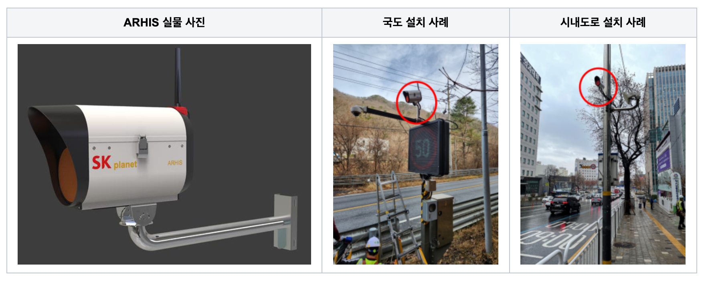
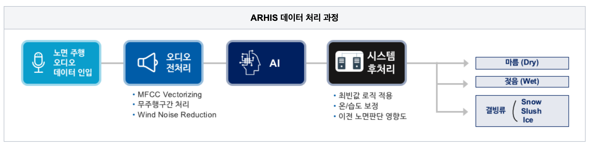
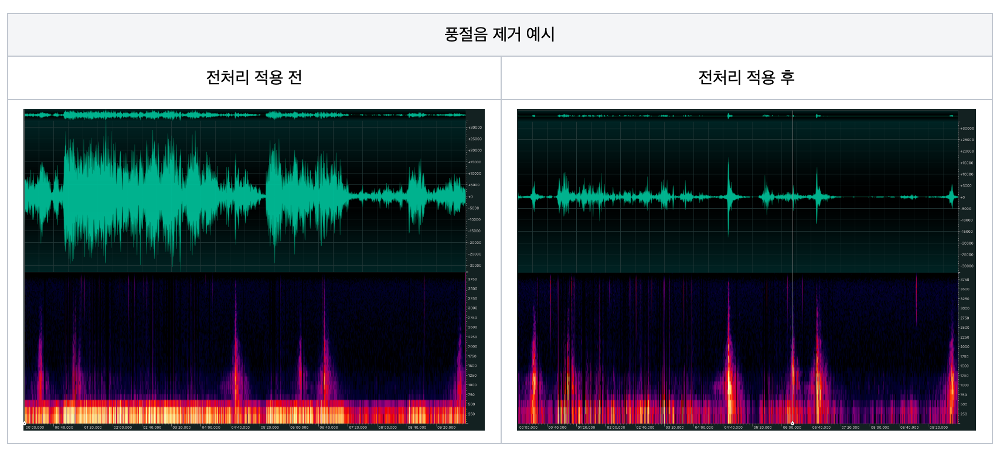
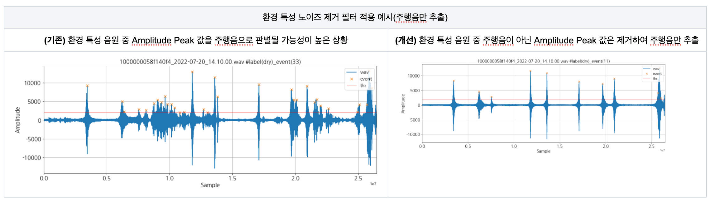
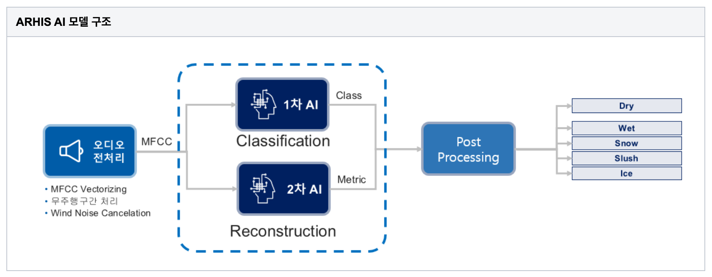
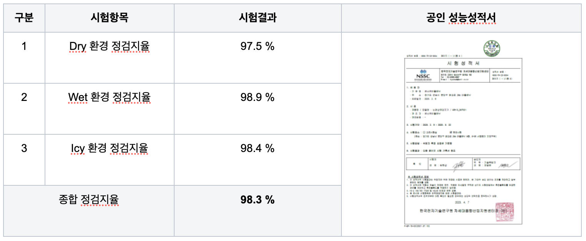
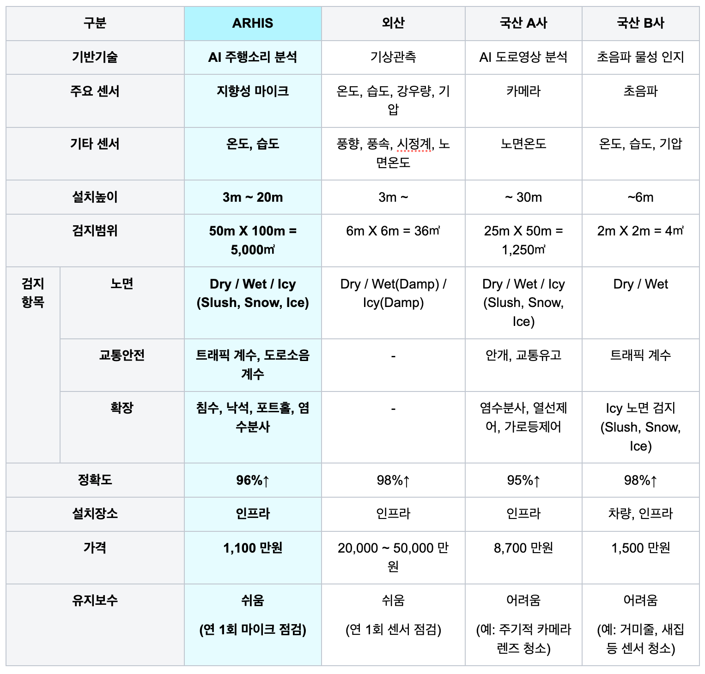
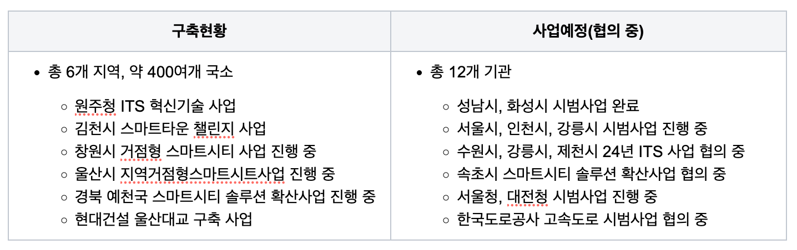
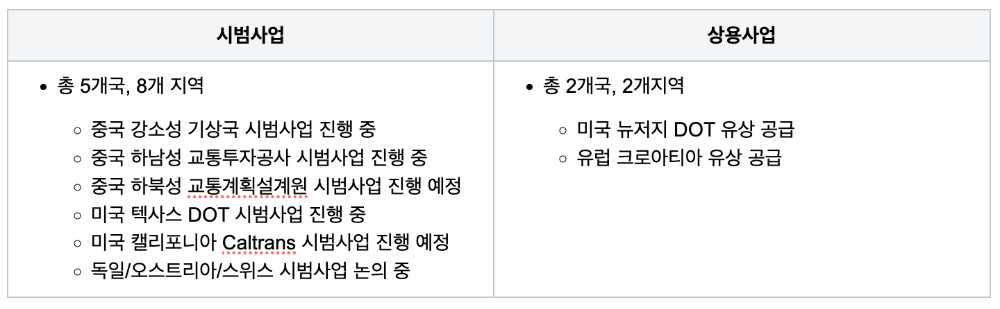
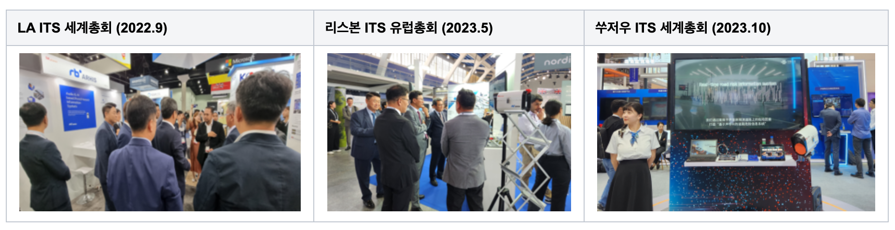

SK플래닛이 자체 개발한 ARHIS(Audio & AI based Road Hazard Information System)는 차량이 달릴 때 도로 노면에서 발생하는 음향을 탐지하여, 블랙 아이스와 같이 눈에 보이지 않는 도로 노면의 상태를 검지(detection)하는 기술입니다. 

이 기술을 솔루션화한 RB ARHIS는 기상청 등 관련 기관으로부터 우수한 평가를 받았으며, 제 18회 대한민국 기상산업대상에서 국무총리상을 수상하였습니다. 

주요 수상 내역
* 2021년 4월: 국토교통부 혁신상(2021년 ITS 혁신기술)
* 2021년 10월: 과학기술정보통신부 장관 표창(IoT Awards 2021)
* 2022년 8월: 국토교통부 혁신상(2022년 스마트건설 챌린지)
* 2022년 12월: 국토교통부 장관 표창
* 2023년 9월: 국무총리상(제18회 기상산업대상)

상세한 내용은 ARHIS 웹사이트(https://www.rbarhis.com/) 에서 확인할 수 있습니다. 

###  ARHIS란?  

ARHIS는 도로 위험 탐지 시스템으로, 도로에서 차량의 주행 소리를 활용하여 노면상태를 검지합니다. ARHIS가 검지하는 도로의 노면 상태는 크게 Dry(마른 노면), Wet(젖은 노면), Icy(결빙 노면)와 같이 3가지로 구분되며,  Icy는 세부적으로 Snow(적설), Slush(슬러쉬), Black Ice(블랙 아이스)로 구분됩니다.

도로의 노면 상태는 AI(Artificial Intelligence)기술로 판단합니다. 도로 노면 상태에 따라 차량의 주행소리가 다르기 때문에, 다양한 노면 상태의 주행소리를 AI에 사전 학습시키면 AI 모델이 현장에서 발생되는 주행 소리를 통해 도로 노면 상태를 판단할 수 있습니다. 

이렇게 ARHIS는 노면 상태를 실시간으로 검지함으로써 도로 상태를 24시간 모니터링하고 점검해야 하는 사람의 노력을 대신할 수 있으며, 따라서 도로 관리자는 ARHIS 운영 시스템의 알림에 따라 도로 결빙, 침수 등과 같은 위험 요소를 빠르게 파악하고 조치할 수 있습니다.

### ARHIS 원리 

##### 개요 

ARHIS는 도로 노면의 주행 소리를 AI가 학습하여 현장의 도로 노면 상태를 추론합니다. AI 모델이 노면 상태를 판단하기 위해서는 (1)현장 이미지 및 주행소리 데이터 수집, (2)전처리, (3)AI 모델(라벨링, 학습, 모델배포, 추론) 및 (4)시스템 후처리와 같이 4단계로 진행됩니다.

(1)현장 이미지 및 주행소리 데이터는 ARHIS 디바이스에 내장된 카메라와 마이크가 수집하고, 수집된 데이터는 디바이스에 탑재된 LTE 통신 모듈이 운영시스템으로 전송합니다.
운영자는 운영시스템에 수집된 이미지와 음원으로 현장의 도로 노면을 판단하여 라벨링 작업을 합니다.

(2)전처리를 거친 500개 이상의 라벨링된 음원은  (3)AI모델이 학습하고, 학습된 모델은 해당 ARHIS 디바이스에 배포되어 실시간으로 현장 노면을 추론합니다. 노면 판단 추론값은 다시 운영시스템으로 전송되어 (4)시스템 후처리를 거쳐서 1분 단위로 노면 종류를 판단합니다.

##### ARHIS의 AI 기술

ARHIS의 핵심 기술은 (1)음원 전처리 기술과 (2)AI 모델입니다.

(1)음원 전처리 기술을 통해 수집된 음원에서 불필요한 노이즈를 제거하여 음원의 품질 향상, 시스템 리소스 최적화 및 AI 모델의 추론 성능을 향상시킬 수 있습니다.  

전처리 과정은 AI 모델이 추론 가능한 MFCC(Mel-Frequency Cepstral Coefficient) 형태의 Feature를 추출한 후, 소프트웨어로 구현된 필터를 통해서 마이크에 입력되는 바람소리와 주변 환경의 특정 소음을 제거합니다. ARHIS에 적용된 필터의 주요 기능은 풍절음(고속 주행시 발생하는 바람 소리) 제거와 환경 특성 노이즈 제거입니다.

* 풍절음 제거: 특정 도로 및 환경(예: 교량, 터널, 바닷가)에서 발생하는 풍절음을 제거함

* 환경 특성 노이즈 제거: 도로 주변의 다양한 환경 특성 음원(예: 새 소리, 벌레 소리, 공사 소음) 주파수를 분석 및 필터링하여 음원 품질 향상
 

(2)AI 모델은 전처리를 통해 추출된 MFCC를 활용하여 1차 AI 모델, 2차 AI 모델을 기반으로 노면상태를 추론합니다. 

AI 모델 구조는 다음과 같이 2단계로 나눱니다.  
* 1차 다중분류(Classification): 노면 상태 분류(Dry/Wet 등)
* 2차 이상탐지(Reconstruction): 젖은 노면 상태의 결빙 여부 판단(Wet/Icy 등) 

 

마지막으로 AI 모델의 추론 결과를 추론 최빈값 및 다양한 알고리즘을 활용한 시스템 후처리를 거쳐 노면 상태를 최종으로 판단합니다. 이러한 과정을 거친 결과, ARHIS의 최종 검지 성능은 98%로 매우 높습니다.  

* 추론 최빈값: 1분 내에 AI모델이 추론한 노면 결과 중, 가장 많은 결과를 선정 

※ 정검지율(True Detection Rate, TDR): 현장에 설치된 임의의 ARHIS 디바이스를 선정하여(약 100대), 노면이 변화하는 날씨에 각각의 ARHIS가 24시간 노면 상태를 판단하여 정확하게 판단한 비율

### 왜 '음향(Audio)'인가?  

이 글에서는 음향(Audio)와 소리(Sound)를 혼용해서 사용합니다(외부에서는 ARHIS를 '음향식 노면 검지기' 라고도 부르고 있습니다). 

맑은 날의 자동차 주행 소리는 타이어와 도로의 마찰에서 나는 소리이지만, 빗길, 빙판길, 눈길에서는 타이어와 도로 사이의 물과 눈이 함께 마찰을 일으켜서 맑은 날의 주행 소리와는 다릅니다. ARHIS는 이러한 소리의 차이를 구분할 수 있습니다. 

소리를 이용한 도로 노면 검지 기술은 검지 거리, 검지 범위, 장비가 설치된 높이, 검지의 장애 요인, 유지보수, 구축 비용, 기능 확장 등에서 타 솔루션 대비 장점이 있습니다. 

* 거리: 기존의 노면 검지 방식(초음파, 노면온도 측정)은 검지 지점에 국한된 반면, ARHIS는 100~200m에서도 검지가 가능합니다. 
* 범위: 소리의 전파(Propagation)에 따라 검지 거리를 늘일 수 있으므로, 다차선 도로나 장애물이 많은 도로에도 설치할 수 있습니다.
* 설치 높이: 검지 거리가 넓어서 높은 곳에 ARHIS  장치를 설치할 수 있으므로, 주행에 방해가 되지 않습니다.
* 검지 장애: 소리는 가시거리 확보 시 장애(야간, 안개, 미세먼지 등)에 영향을 받지 않으므로, 안정적으로 도로 상태를 인지할 수 있습니다.
* 유지보수: 소리는 사물과 물리적 연결이 없기 때문에 비, 눈, 먼지 등의 기상 환경에 따라 주기적인 청소를 할 필요가 없으므로 안정적인 운영이 가능합니다.
* 구축 비용: 기존의 노면 검지방식(초음파, 노면온도 측정, 카메라)은 검지 거리가 짧고, 고해상도 센서와 관련 장치 구축이 필요하기 때문에 구축 비용이 높습니다.
* 기능 확장: ARHIS는 노면검지 뿐만 아니라 소리로 구분 가능한 다양한 도로 환경(낙석, 포트홀, 도로소음, 트래픽 등)을 AI 모델 업데이트를 통해서 확장 가능합니다.

### 마무리

#### (1) ARHIS 사업 현황

##### 국내 현황

SK플래닛은 겨울철 결빙사고 위험이 높은 지역(강원도, 경상도 등)과 특정 지형(교량, 산악지대 등)의 수요에 따라 국내 400개 이상의 지역에 ARHIS를 설치하였으며, 다수의 지자체 및 교통 관련 기관과 사업을 추진 중입니다.

 

##### 해외 현황

사계절이 뚜렷한 지역은 도로 결빙으로 인한 사고 위험성이 높기 때문에, 미국, 중국, 유럽 국가들을 대상으로 ARHIS 사업을 추진하고 있습니다. 

##### 전시회 참가

SK플래닛은 2022년부터 ARHIS 솔루션 해외 사업을 추진하고 있습니다. ITS(Intelligent Transport Systems) 관련 다양한 국제 전시회에 참가하여 전세계 도로교통 관계자들에게 ARHIS를 홍보하고 있습니다.

특히 SK플래닛 부스 방문객들은 소리를 활용하여 도로결빙을 탐지할 수 있는 ARHIS에 관심이 많았습니다. 

#### (2) 향후 계획

ARHIS는 카메라와 마이크, AI 모델을 통해 도로의 다양한 상황을 인지하는 기술이며, 소프트웨어 업데이트만으로 검지할 수 있는 환경을 추가 확장할 수 있습니다. 

SK플래닛은 2023년 국토부 ITS 혁신기술사업을 통해 교통사고 여부를 검지하는 유고검지 기능을 상용화 중이며, ARHIS와 연동되는 도로 안전문구 표출장치를 개발하여 도로 노면 위험과 사고 위험을 안내하고 있습니다.

2024년에는 ARHIS AI 모델이 운영자를 대신하여 AI 모델에 학습될 데이터를 선별하고 학습하는 오토라벨링 기능 개발과 안개검지 기능을 개발하고 있습니다. 

* 유고검지: 도로의 사고(skid/crash) 소리를 학습하여, 도로 사고 여부를 실시간으로 모니터링(2023년 개발 완료)
* 표출장치: ARHIS를 통한 노면검지 및 사고검지 결과를 도로 안내 표출장치와 연동하여 실시간 도로 안전과 관련된 정보 제공(2023년 개발 완료)
* 오토라벨링: 운영자가 도로 사진과 음원을 직접 확인하고 학습에 필요한 데이터를 수동으로 라벨링하는 운영 업무를 AI 모델을 통해 라벨링 자동화(2024년 개발 검토)
* 안개검지: 교통사고 위험이 높은 안개 탐지를 통해, 상황을 신속하게 전파하여 사전에 사고 방지(2024년 개발 검토)

이외에도 ARHIS는 도로의 눈과 귀로써 현장의 안전을 지키는 다양한 기능을 추가하여 도로 안전과 관련된 통합 솔루션으로 발전하고 있습니다.