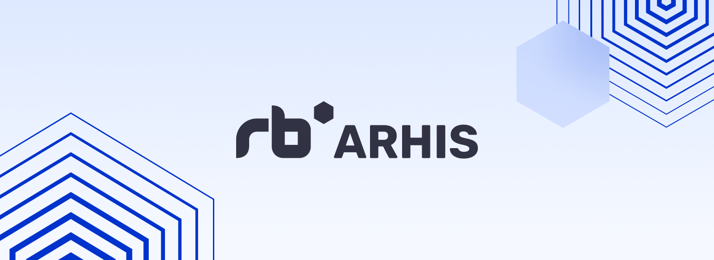

본 글에서는 SK Planet의 IoT 솔루션인 RB ARHIS의 브랜드 웹사이트인 https://www.rbarhis.com 구축에 대한 이야기를 공유드리고자 합니다. 
​
### 들어가며
2022년 9월, 미국 LA에서 개최된 ITS 세계 총회(ITS World Congress 2022)에서 당사의 ARHIS 솔루션을 처음으로 선보였습니다. 
교통 올림픽이라고 불리는 ITS 세계 총회는 1994년부터 매년 개최되는 ITS 분야의 권위 있는 전시회로 관련 기업 및 각국 정부 기관들이 참석하는데요, 이러한 ARHIS 해외 진출을 앞두고 서비스 홍보와 브랜드 이미지 강화를 위한 다양한 활동들을 지원하게 되었습니다.
> ITS (지능형 교통 시스템, Intelligent Transportation Systems)​

ITS 마케팅 홍보 프로젝트인 브랜드 웹사이트 구축 과정에 대하여, 어떻게 인사이트를 도출하고 어떤 프로세스로 제작했는지 이야기해보려고 합니다.
​
### 여러분이 궁금할 수 있는 ARHIS 이야기
#### ARHIS (Audio & AI based Road Hazard Information System)
음향식 노면 감지 시스템 ARHIS는 실시간으로 차량의 주행 소리를 수집하고 데이터를 분석하여 노면의 결빙과 같은 위험을 방지하는 SK Planet의 솔루션입니다.
​
#### 도로 위의 암살자 블랙아이스
블랙아이스로 인한 교통사고는 치사율을 높이고 대형 사고를 유발하는 원인이 되며 겨울철 결빙 등으로 인한 사고 비중은 날로 증가하고 있습니다. 
ARHIS는 국내 겨울철뿐만 아니라, 해외의 기상 이변으로 인한 겨울 폭풍 등 다양한 기후적 상황들에 대비하여 즉각적인 경고와 제설 같은 실시간 대응이 가능합니다.
​
#### 데이터 연동 시나리오
도로변에 설치된 ARHIS 함체(Case)에서 수집되는 노면의 음성정보를 AI가 판별하여 SK Planet 클라우드를 거쳐 ITS 통합센터로 전달이 되며, 센터와 연결된 VMS, VSL 등 교통정보에 반영되어 운전자에게 위험을 알리게 됩니다.

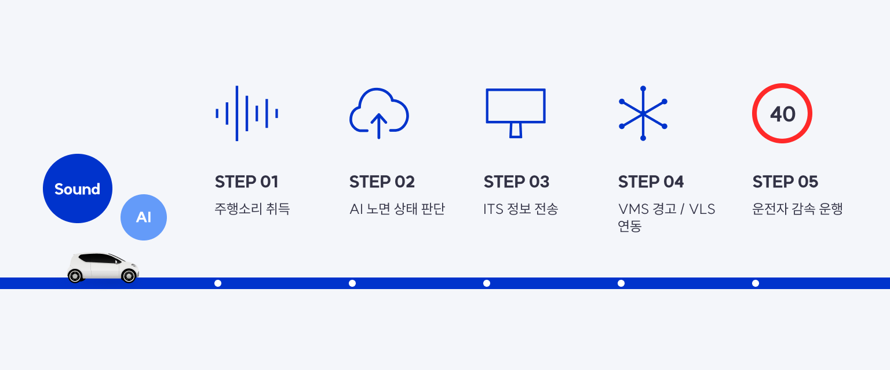
​
### 이러한 ARHIS의 기술력을 알리기 위한 웹사이트가 필요했습니다
우선, 브랜드 웹사이트를 제작하게 된 배경은 크게 세 가지입니다.
  * 서비스 홍보 : ARHIS는 Admin과 Dashboard로 나뉘며, 솔루션 개발 완료 후 마케팅 필요성이 증대되었습니다.
  * 해외 진출 : 22년 9월 ITS 세계총회에 ARHIS를 선보여야 하는 1차 해외 진출 일정이 수립되었습니다.
  * 브랜딩 강화 : RB ARHIS 라는 정식 서비스명과 로고 디자인이 확정되었습니다.
​
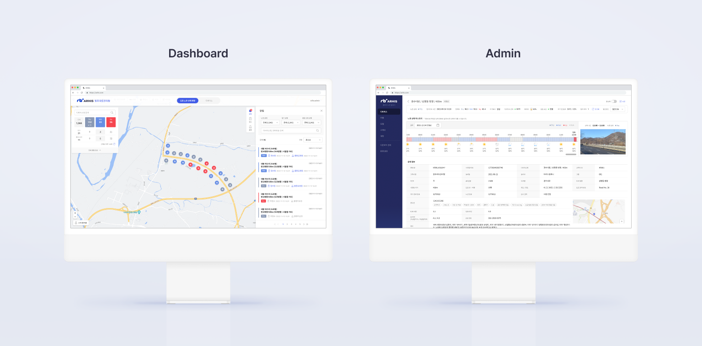

### 그렇다면, 우리의 목표는 무엇이었을까요?
ARHIS의 기술력을 알리는 정보성 웹사이트를 만든다는 큰 목표 아래, 저희 팀에서는 좀 더 세분화된 목표를 수립하였습니다.
* RB Rubix Cube(공통 브랜드 체계)를 기준으로 ARHIS의 메타포를 발굴한다.
* 도출된 브랜드 메타포를 다양한 홍보 채널(웹사이트, 브로슈어, 전시 부스)에 일관된 톤앤매너로 표현하여 브랜딩을 강화한다.
* ARHIS의 기술력을 웹사이트에 시각적으로 표현하여 이해하기 쉽게 효과적으로 보여준다.
* 다양한 환경에 최적화되도록 반응형 웹사이트로 제작한다. (PC, Mobile)
* 해외 진출을 타겟으로 영문 버전 1차 런칭 후, 국문 버전도 제작하여 향후 패밀리 사이트 구조로 확장한다.
​
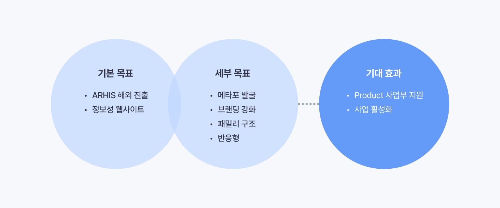

### 웹사이트 제작 - 브랜딩부터 디자인, 모션 구현까지

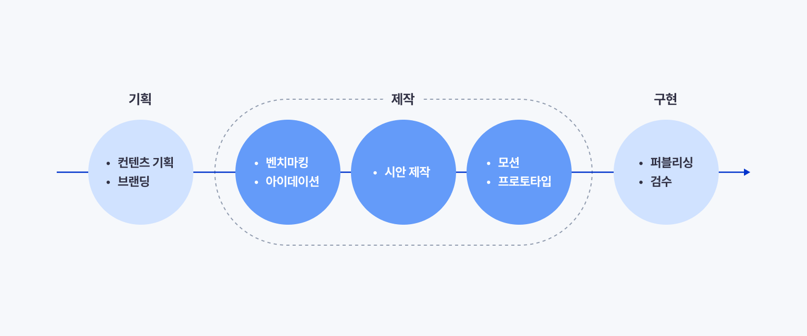
​
#### 1. 콘텐츠 기획
주요 콘텐츠들을 효과적으로 표현하기 위해, 다양한 needs에 따른 해결 방안을 고민하여 flow를 구성하였습니다.
​
* 서비스의 핵심 메시지는 무엇인가? → 최상단 영역에 서비스 성격이 한눈에 드러나는 슬로건과 커버를 노출한다.
* 콘텐츠를 전달하는 스토리텔링 방식은? → 다양한 기술력들을 우선순위가 높은 항목 순으로 배치한다.
* 신뢰감을 높일 수 있는 팩트 체크 콘텐츠는? → 뉴스 기사, 소개 영상, 고객사 후기 등의 콘텐츠를 제공한다.
* 서비스를 비즈니스로 연결하기 위해선? → 전화, 소개서 다운로드 같은 별도 수단을 통해 상세 정보를 제공한다.
​
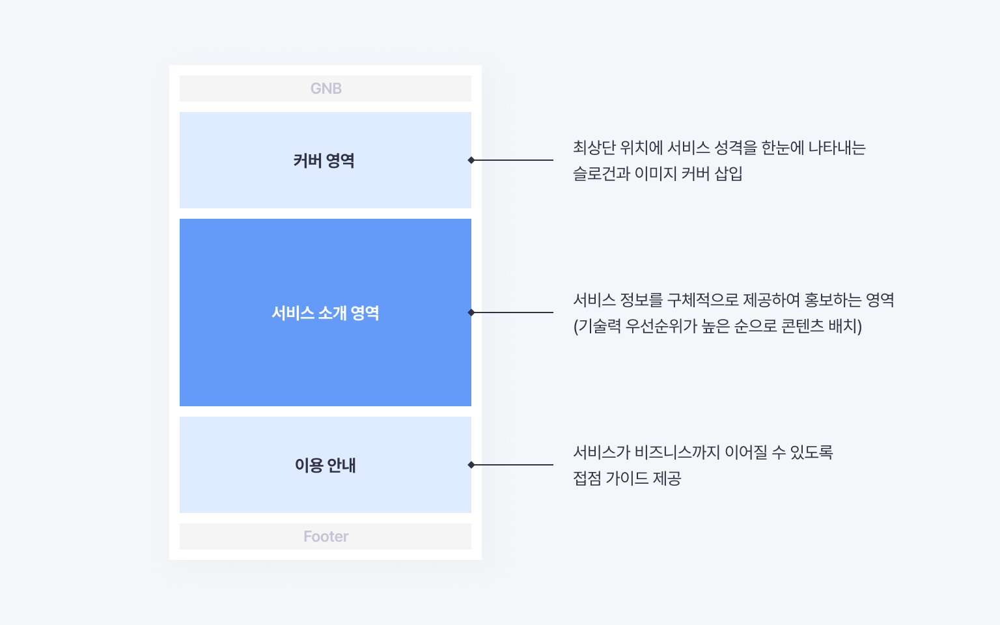

#### 2. 브랜딩
RB Rubix Cube라는 공통 브랜드 체계에서 파생된 RB ARHIS의 로고와 대표 컬러들을 발굴하였습니다.
* RB는 SK Planet을 대표하는 브랜드로, 데이터 인프라를 기반으로 다양한 영역에서 기술 역량을 발휘하는 SKP ICT 솔루션입니다.​
* Brand Color : ARHIS의 중요한 환경적 요소인 '블랙 아이스'라는 키워드를 바탕으로, 블랙아이스의 블랙과 RB 블루 컬러를 조합하여 블루블랙을 브랜드 컬러로 정의하였습니다.

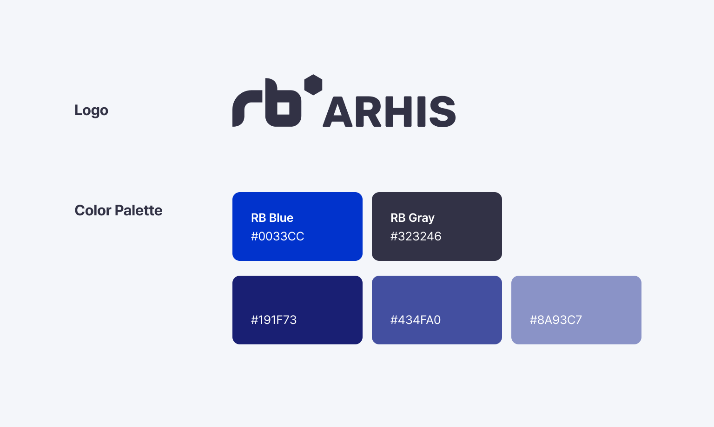

* 그래픽 모티브 발굴 : 먼저 ARHIS의 서비스 특성을 바탕으로 키워드들을 도출하였습니다. 그중 ARHIS의 환경적, 기술적 특성을 나타냄에 있어 가장 주요한 키워드인 Sound를 선택하였고, RB Rubix Cube와 결합하여 ARHIS만의 모티브를 발굴하는 과정을 거쳤습니다.
* ARHIS Cube : 도로 노면의 음향 파동을 큐브로 표현하고, 솔리드형과 라인형으로 제작하여 다양한 접점에 활용할 수 있도록 하였습니다.

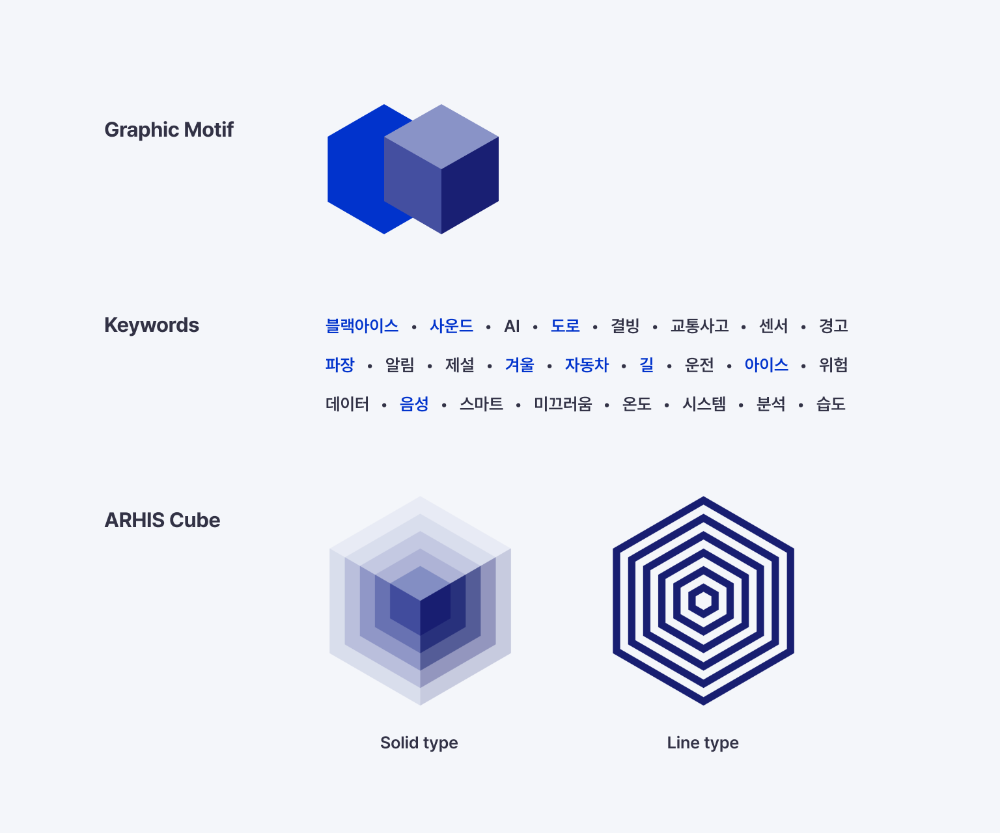

#### 3. 벤치마킹
유사 서비스들을 비롯해 다양한 분야의 웹사이트와 그래픽 요소들을 벤치마킹하였고 이를 키워드로 분류하여 그룹핑하는 과정을 거쳤습니다.

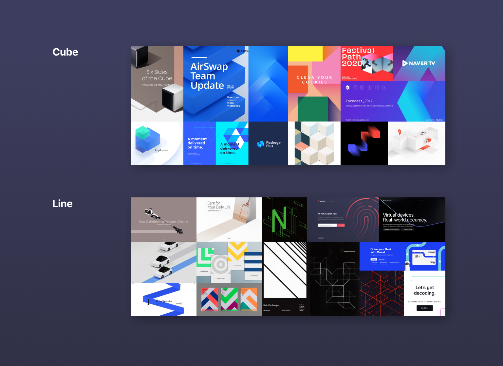
​
#### 4. 메인 비주얼 영역 아이데이션
웹사이트 최상단 영역에 서비스 아이덴티티를 한눈에 나타내기 위해 ARHIS Cube 모티브를 활용한 다양한 컨셉의 메인 비주얼 아이데이션을 진행하였습니다.

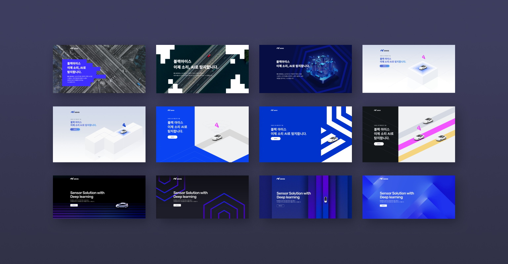
​
#### 5. 웹사이트 시안 제작
앞서 진행한 벤치마킹, 아이데이션 방향성을 바탕으로 많은 테스트 시안을 제작해봄으로써, 서비스를 표현하는 데 있어 최적의 컨셉과 레이아웃을 찾기 위해 다양한 시각으로 고민하였습니다.

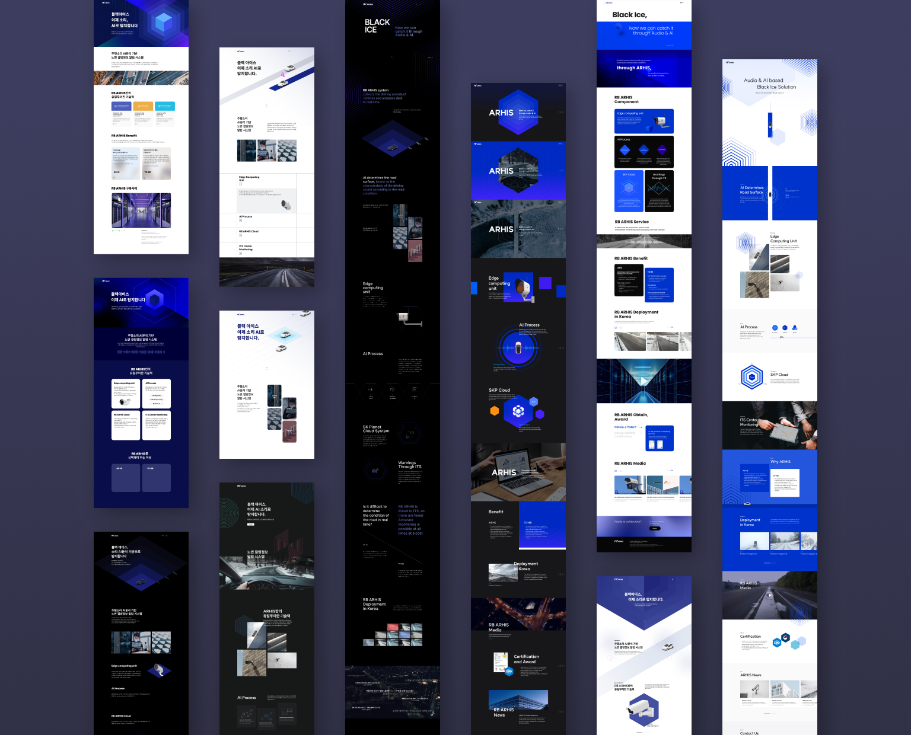

최종 시안 : ARHIS의 환경적 요소 중 주요 키워드인 도로를 RB blue와 결합하여 ‘Blue road’라는 컨셉을 도출하였습니다. 브랜드 슬로건을 시작으로 메인 비주얼 중심부에서 Blue road가 나타나고 그 위를 자동차가 상하로 이동하며, 이를 중심으로 아리스의 기술력을 나타내는 콘텐츠들이 순차적으로 노출됩니다. 이처럼 화면 중앙에 길의 흐름을 따라 스토리라인이 있는 레이아웃을 구성하고자 하였습니다.

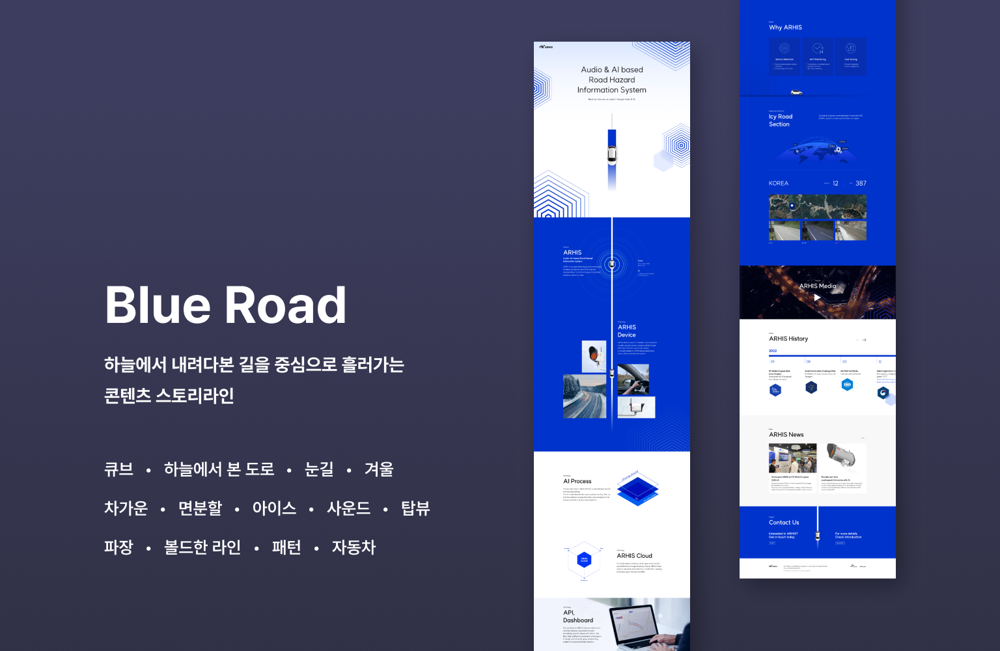
​
#### 6. 모션 (프로토타입)
그래픽과 콘텐츠 전환을 동적으로 표현하여 웹사이트를 입체적으로 구현하기 위해 사용자 스크롤에 반응하는 Parallax scroll motion을 Framer라는 툴로 구현했습니다. 이때, 이때 Scroll animation, Transition 같은 자체 기능을 이용하거나, 좀 더 디테일한 인터랙션은 직접 코드를 짜서 구현하기도 하였습니다.

> Framer(프레이머)는 애니메이션, 스크롤 같은 모션이나 화면 구현을 리액트 기반의 코드를 통해 프로토타이핑하는 툴입니다.

정적인 시안을 동적인 프로토타입으로 구현함으로써 퍼블리셔와 협업 시 커뮤니케이션이 용이하였으며, 디자이너가 고민한 포인트들이 매우 높은 정합성으로 구현되는 장점이 있었습니다.

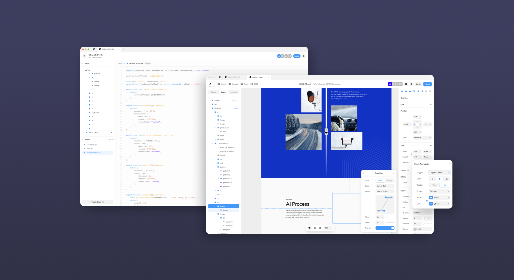
​
#### 7. 퍼블리싱 (마크업)
반응형 테스트 : 초기엔 PC, Mobile 시안만 제작하였으나, 일부 콘텐츠가 중간 단계(Tablet 해상도)에서 그리드가 깨지는 현상이 발생하여 특정 영역은 Tablet 해상도에 최적화된 시안을 대응하였습니다. 이때 피그마의 Auto layout 기능을 활용하여 미리 시뮬레이션해 볼 수 있었습니다.

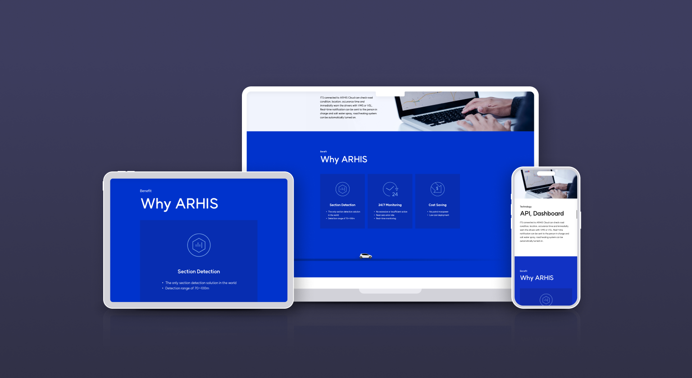

#### 8. 검수 (Test)
영문 버전을 기준으로 오타 검수 및 디자인 정합성 체크를 진행하였으며, 이를 바탕으로 국문 버전을 제작하였습니다.
​
### 그 외에 오프라인 제작물까지
브랜드 웹사이트 외에도 브로슈어, 전시 부스 등 오프라인 콘텐츠 디자인 또한 지원하였습니다.

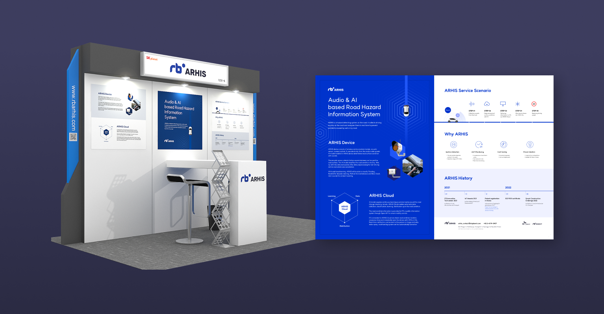

### 마치며
자사 서비스의 해외 진출을 위한 브랜드 확산 프로젝트의 일환으로 온/오프라인의 다양한 홍보 수단들의 통합 브랜딩 프로젝트를 진행할 수 있었던 점에 의미를 부여할 수 있었습니다. 
또한, 주로 웹/앱 같은 온라인 채널 위주의 프로젝트를 진행해오다 이번 기회로 브로슈어, 전시 부스 등 오프라인 작업물이 컨퍼런스 현장에 실제 배치된 것을 보는 것도 색다른 경험이었습니다. 
마지막으로 함께 프로젝트를 진행한 멤버분들께도 감사의 말씀을 드립니다.

URL https://www.rbarhis.com