IT 산업에서는 사용자에게 제공되는 서비스 유형이 점점 다양해지고, 마케팅과 유통 등이 발전하면서 사용자들은 더욱 쉽고 자신들에게 맞는 새로운 서비스를 원하고 있습니다. 

기업들은 사용자들의 이러한 요구사항을 충족할 수 있는 새로운 비즈니스 모델과 서비스를 개발하고 제공해야 합니다.

SK플래닛은 데이터 기반의 클라우드를 통해 새로운 가치를 창출할 수 있는 다양한 서비스를 개발하여 제공하고 있습니다. 본 내용은 SK플래닛이 보유한 RB Cloud 기반 VCS(Video Cloud Streaming)를 위한 기술과 서비스입니다. 

* RB Cloud: SK플래닛의 Cloud 기반 서비스 브랜드입니다.

###  RB Cloud 솔루션 소개

SK플래닛의 RB Cloud 기반 VCS 솔루션은 클라우드 플랫폼을 통해 다양한 서비스와 콘텐츠를 지연없이 처리하고, 화려한 그래픽 표현이 가능합니다. 또한 오버레이와 PIP(Picture in Picture)가 가능하고 3D 애니메이션이나 비디오를 활용한 UI를 사용하여 컨텐츠 제공 사업자의 요구사항을 만족시킬 수 있습니다. 이처럼 성능 이슈를 최소화한 화려한 UI는 사용자 경험(UX)을 개선하고, 서비스 사용률을 높일 수 있습니다.

컨텐츠 제공 사업자들이 직면한 STB(Set Top Box)의 S/W 및 H/W 성능 한계로 인한 불편함을 클라우드 서버에서 신규 기능을 실행하는 ‘서버 가상화’ 기술로 해결 가능합니다.

서버 가상화를 통해 낮은 사양의 STB에서도 고품질/고화질의 서비스 제공이 가능하기 때문에 STB 교체 비용이 절감되었고 쉽게 신규 서비스를 사용자들에게 제공할 수 있습니다.

또한 사업자들은 기존 시스템으로 불가능했던 혁신적인 신규 서비스 제공이 가능해집니다. 360° 비디오, 멀티뷰, 미디어 커머스 등이 대표적인 사례이며, 개별 STB의 H/W 제약을 넘어서는 서버 가상화를 통해 새로운 고부가 서비스를 개발하여 신규 사업기회 발굴로 수익 창출이 가능합니다.

그 외에도 RB Cloud 솔루션을 통해 기존 서비스 개선과 신규 서비스 개발이 빠르게 이뤄질 수 있고 시스템 배포/적용 시간도 절약되기 때문에 개발 비용 절감과 함께 유연한 서비스 제공이 가능합니다. 이를 통해 사용자들은 고품질/고성능 콘텐츠를 즐길 수 있습니다.

다양한 콘텐츠와 관련 서비스를 신속하게 제공할 수 있기 때문에 많은 사업자들은 이 기술이 매우 효과적이라고 평가하고 있습니다. 이것은 다수의 상용화 사례를 통해 입증되었습니다. 

사업자는 비용 절감, 신속하고 효율적인 신규 서비스 도입, 신규 수익 창출 등과 같은 장점으로 이 기술을 매력적으로 느끼고 있습니다. SK플래닛은 더 좋은 기능을 추가하기 위하여 RB Cloud 솔루션을 지속적으로 개선하고 있습니다.

본 내용은 RB Cloud 솔루션을 활용한 VCS 기술의 여러가지 장점을 언급하고, 서비스 제공을 위한 효율적인 방법을 소개합니다.

### RB Cloud 솔루션 서비스 흐름 및 기능

사용자가 리모컨으로 STB에 명령을 보내면, 클라우드 서버는 브라우저 내 웹앱을 구동하여 서비스 화면을 구성하고 이를 이미지 또는 비디오 파일로 변환하여 STB로 전송합니다.

STB는 수신한 내용을 사용자 화면에 출력하는데, 전체 화면이 아닌 변경이 있는 화면만 전송하여 전송 데이터를 줄이고 대역폭을 최소화합니다.

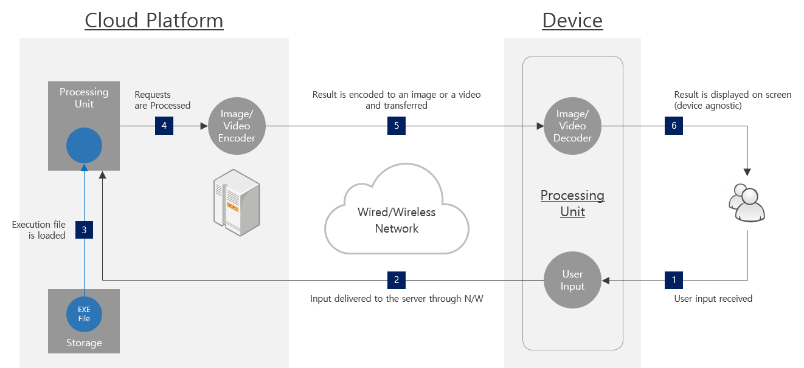

### UI 서비스 종류

RB Cloud 솔루션은 다음 예시와 같이 VOD, 일반 메뉴 및 개인화 서비스 등 다양한 종류의 UI에 적용될 수 있습니다.

####  1) VOD UI                                                                        
VOD 서비스를 위한 화려한 UI로, 콘텐츠의 각 포스터 이미지를 배열하여 직관성을 높이는 VOD 메뉴, 개별 포스터 파일을 모두 전송하지 않기 때문에 로딩시간이 짧고 빠른 화면 전환이 가능합니다.
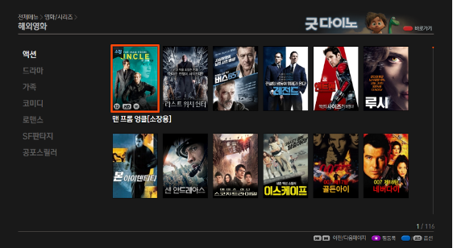 

####  2) Menu UI
실시간 채널 및 VOD 콘텐츠와의 자연스러운 결합
실시간 채널 및 VOD 영상이 함께 표시되는 경우, 별개의 이미지(혹은 비디오) 파일로 전송하여 STB에서 영상을 합치기 때문에 효율적으로 데이터를 처리합니다.
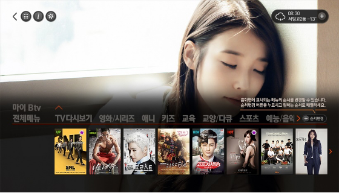

#### 3) Personalized UI
개인화/맞춤형 UI/UX
클라우드 UI를 이용하면 개인화 및 맞춤형 UI를 손쉽게 구현할 수 있습니다.
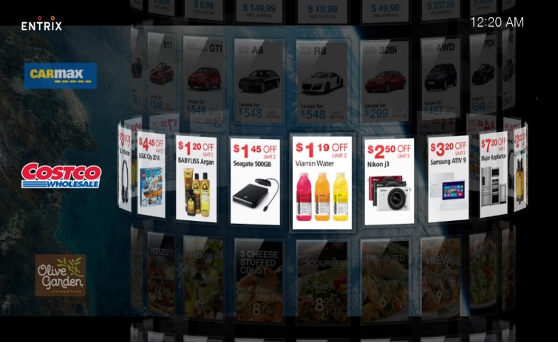

#### 4) 3D UI with Animation
애니메이션 효과의 3D UI
혁신적인 사용자 경험을 추구하는 사업자를 위해 화려한 애니메이션 효과로 높은 품질의 3D UI도 가능합니다.
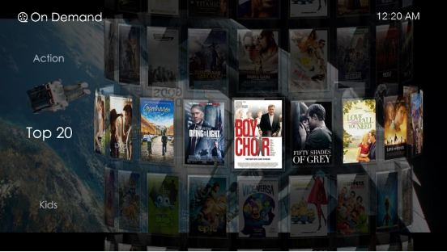

### RB Cloud 솔루션 경쟁력 및 차별화 요소

이미 6백만명이 넘는 사용자들이 RB Cloud 솔루션을 통해 향상된 UI/UX를 경험하고 있습니다. 서버 기반의 빠른 반응 속도와 높은 성능은 UI 및 서비스를 부드럽고 유연하게 실행합니다. RB Cloud 솔루션은 다음과 같이 4개의 차별적인 요소를 가지고 있습니다.

#### 저 지연 기술 (Low-Latency)
클라우드 서버는 최적의 성능 유지를 위해 인코딩된 비디오(혹은 이미지)를 지연없이 생성/전송합니다. 일반적인 스트리밍 비디오 플레이어는 스트림 수신과 A/V Sync를 위해 큰 버퍼가 필요하지만, 클라우드 스트리밍 클라이언트는 수신측에서 인지하기 어려울 정도의 작은 버퍼만 필요합니다.

#### 서버 확장성 (Scalability)
수요에 맞게 서버 확장이 가능하기 때문에 각 서버의 성능(CCU)이 안정적으로 유지됩니다. 따라서 다양한 어플리케이션은 일정 수준의 성능을 안정적으로 유지할 수 있습니다.

#### 서비스 안정성 (Stability)
서버 다중화와 Live Application Context Migration(LACM)을 통해 서비스 중단 가능성을 크게 줄였으며, 이로 인하여 절반의 서버가 Fail-Over되어도 서비스 운영이 가능합니다. 특히 LACM은 클라이언트와 서버 사이의 상세 기록을 동기시키기 때문에 다른 서버로 Fail-Over 시, 자연스럽게 어플리케이션이 재생되어 서비스 중단을 방지합니다. 

### RB Cloud 솔루션 강점
일반적인 미들웨어 내 서비스 애플리케이션 형태로 TV 서비스를 제공하는 방식과 비교했을 때, RB Cloud 솔루션은 다음과 같은 강점을 가지고 있습니다.

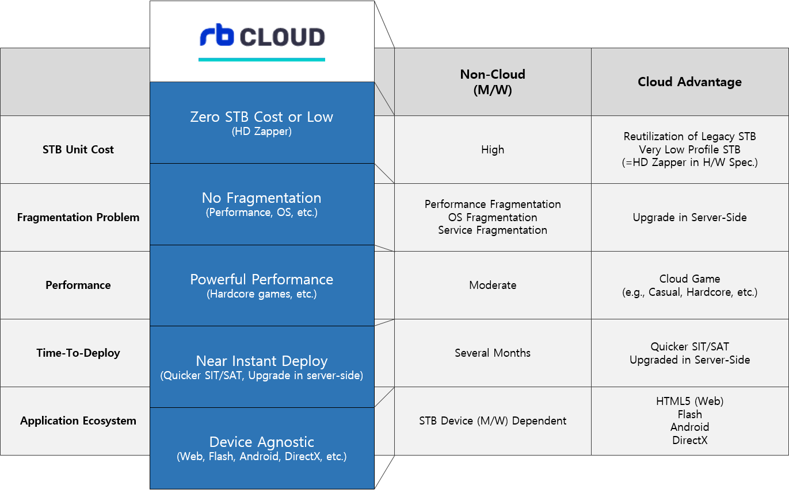

### RB Cloud 솔루션 - ICS / VCS
RB Cloud에서는 Image 기반의 ICS(Image Cloud Streaming)와 Video 기반의 VCS(Video Cloud Streaming)가 있습니다. ICS 방식은 1초 2~3장 정도의 화면을 전달하는 방식으로 애니메이션이 적고 정적 화면 위주로 서비스되며, VCS는 애니메이션이 많은 Dynamic한 UI, 멀티미디어 응용 서비스에 주로 사용됩니다.

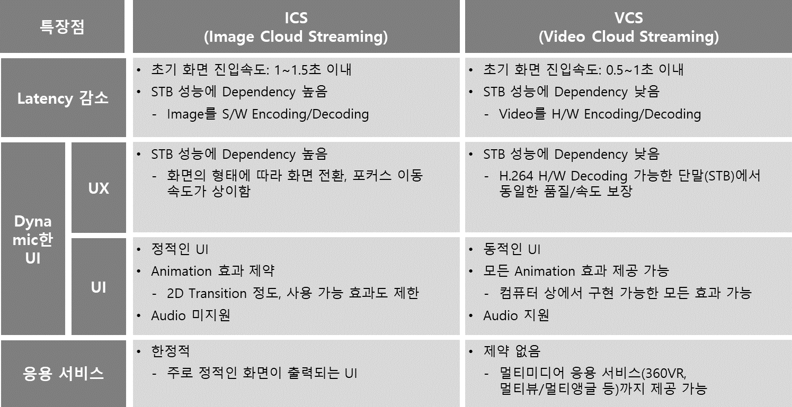

### RB Cloud VCS 1.0 주요 기술

VCS 1.0은 초기에 UI가 아닌 Game, 멀티미디어에 많이 사용되었으나, 나중에 SK Broadband의 UI서비스를 시작으로 본격적으로 사용되고 있습니다. ICS에서 VCS로 전환되면서 Latency, Price, Concurrent users, Stability, Scalability와 같은 5가지 기능 개선에 초점을 두고 개발되었습니다.

Latency에서 가장 많은 영향을 받고 있는 Buffering을 최적화하기 위해 AV 및 Streaming Buffer를 많이 줄였습니다. 상용환경에서 안정성을 확보하기 위하여 많은 테스트와 최적화를 진행했습니다.

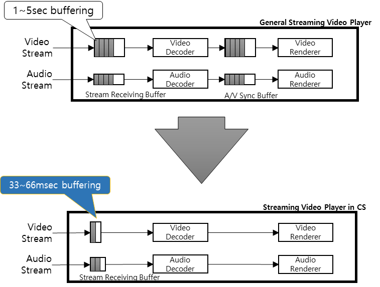

Price 및 Concurrent users에 가장 많은 영향을 받는 Encoding 작업을 최적화하기 위해, ‘Direct Encoding’ 및 ‘화면 변화에 따른 Encoding’을 개발했고, 이러한 결과로 불필요한 작업이 줄어들어서 CPU/GPU의 여유가 생겼습니다. 이런 이유로 사용자를 더 수용할 수 있게 되었고, 상용 수준의 Concurrent Users를 확보했습니다.  

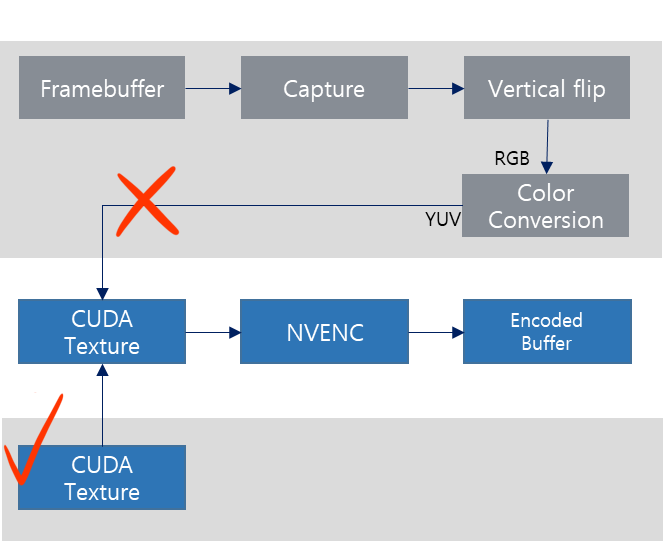

화면에 출력할 데이터를 주고 받을 때, CPU를 거치지 않고 GPU에서 Encoding까지 완료함으로써 속도 및 성능 최적화가 가능했습니다.

화면 변화를 감지하여 전송할 내용만 전달하면서, CPU/GPU 성능 및 Network 트레픽까지 최소화하였습니다.

### RB Cloud VCS 2.0 주요 기능

VCS2.0과 VCS1.0의 가장 큰 차이는 Alpha VCS 적용과 WebGL을 이용한 UI 어플리케이션입니다.
VCS 1.0의 장점이 부각되면서 UI로 활용하려는 사업자가 많아졌습니다.

다만, VCS1.0 에선 Live화면과 동시에 VCS로 Home UI를 노출하는 경우 투명도처리가 되지않아, Live화면이 가려지는 부분이 있습니다. 이와 관련된 사항은 사업자가 지속적으로 문제해결을 요구하고 있습니다.

실시간 영상 위에 홈UI와 Wing UI를 Overlay해도 실시간 방송이 노출되는 Alpha VCS는 비디오에서 투명도처리가 가능합니다. 영상에 Alpha 값을 처리한 기술로 사업자들은 기존 STB UI보다 더 화려하고 동시에 Live영상이 가능한 UX를 제공합니다.

Wing UI를 지원할 수 있는 Alpha VCS의 화면 구성입니다.

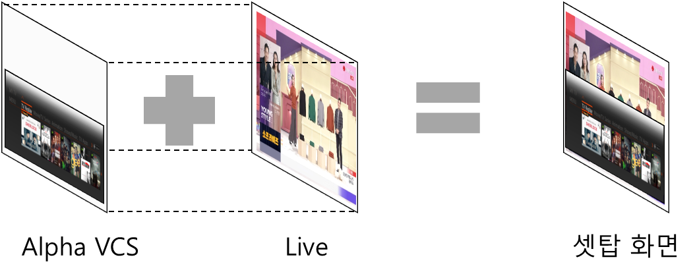

또한 기존 비디오에서 사용하는 RGB(Red/Green/Blue)에 투명도를 표현이 가능한 ARGB(Alpha RGB)를 개발하였습니다. ARGB 형태의 framebuffer를 생성/관리하면서 화면이 구성됩니다. Alpha를 framebuffer에 전달하기 위해 최적화된 알고리즘을 사용했으며, 성능 저하를 최소화하기 위해 Alpha의 화면 변화를 인지하도록 개발하였습니다. 

UI를 더 화려하기 위해 VCS 2.0은 WebGL을 이용한 UI가 적용되었습니다. 3D 애니메이션과 전체 화면을 표현하는 부드러운 기능은 사용자가 빠르고 쉽게 인지할 수 있습니다.

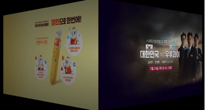
<3D UI 전환 애니메이션>

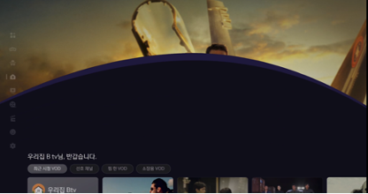
<부드러운 전체 애니메이션>

### 마무리

SK플래닛은 RB Cloud 솔루션에 새로운 개념의 클라우드 기반 기술을 적용하고 발전시키고 있습니다.

Web App 외에 Unreal / Android Application에 대한 RB Cloud 솔루션 적용과 AI, 빅데이터, 개인화 추천 기능을 추가했습니다. 이를 통하여 사용자는 보다 나은 TV UI와 다양한 서비스를 제공받고, 사업자는 비즈니스 인텔리전스 기술을 발전시켜서 더 좋은 서비스를 제공할 수 있습니다. 

이러한 새로운 기술을 적용하여 서비스 품질이 높아지고, 이를 통하여 RB Cloud 솔루션의 경쟁력이 한 차원 높아지게 됩니다. 따라서 이 기술을 통하여 더 좋은 서비스 제공이 가능한 선순환 사이클이 형성됩니다.

향후 RB Cloud 솔루션은 계속 발전될 것이고, 이 기술은 사용자들에게 또 다른 경험을 제공할 것으로 기대됩니다.