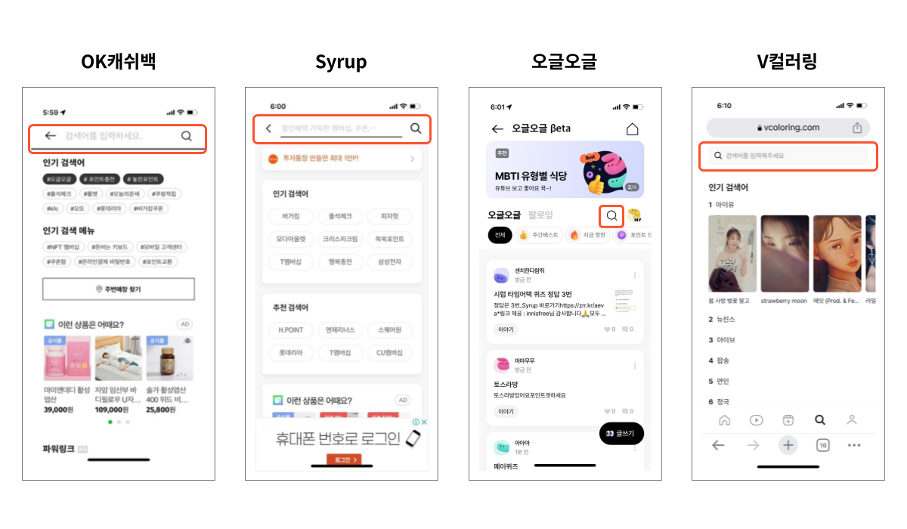

SK플래닛에서는 자사 서비스에 검색 기능이 필요한 경우 빠르게 제공하기 위하여 Elasticsearch 기반 검색 시스템을 활용합니다.  
이 검색 시스템은 키워드 검색 방식으로 다수의 서비스가 쉽게 활용할 수 있는 SaaS 형태이며, AWS 환경에서 Elasticsearch, Kubernetes 등의 기술을 사용하고 있습니다.  
주요 기능으로는 검색 데이터에 대한 색인, 통합 검색 API, Dictionary 관리 등의 기능 등을 제공하고 있습니다.

## 서비스 적용
현재 SK플래닛에서 서비스 중인 OK캐쉬백, Syrup, V컬러링 등의 서비스에 자체 개발한 검색 시스템이 적용되어 있습니다.

## 서비스에 필요한 검색 기능
서비스 내 검색이 필요한 경우, 먼저 기획자는 검색과 관련된 다양한 요구 사항을 정의합니다.  개발자는 이를 토대로 기능을 설계하고 개발하게 됩니다.  
다음 그림은 몇 가지 검색 요구 사항에 대한 예시입니다. 

## 검색 시스템 아키텍처
검색 시스템 아키텍처를 보면, 다음 그림과 같이 크게 AWS Service와 어플리케이션으로 구분됩니다. 그림에서 회색 부분은 AWS Service, 노란색 부분은 어플리케이션을 나타내고 있습니다.  
검색 시스템에서 모든 어플리케이션은 EKS에서 동작됩니다.

### AWS Service
* AWS S3: 검색 데이터 저장, 검색 로그 저장
    * ES Cluster: 검색 데이터 색인, 검색 쿼리, 집계
* Analyzer: Tokenizer, Filter, 형태소 분석
* Cache: 교정어 캐시 및 검색 결과 캐시
* DB: 사전 데이터 관리
* Kafka: 실시간 검색 데이터 전달파이프 라인 누출 감지: 오일이나 가스의 Delivery 파이프 라인에서 Leak 누출을 감지합니다. 실시간 Leak 감지로 사고 방지에 도움이 됩니다.

### EKS
* Search API 서버: 통합 검색, 자동완성
* Airflow Batch 서버: 색인, 집계, 통계
* Admin API 서버: Dictionary 관리
* Kafka Producer: Kafka HTTP proxy
* Kafka Consumer: Kafka Consumer

## 검색 시스템의 특징
SK플래닛이 개발한 검색 시스템은 배치 색인, 실시간 색인 기능을 제공하기 위한 검색 API 등이 포함되어 있습니다.  
특히 서비스별 Dictionary 관리 기능을 제공하여 운영자가 Dictionary를 직접 설정할 수 있습니다. 이때 Dictionary 데이터가 주기적으로 Elasticsearch에 적용되기 때문에 검색 데이터와 Dictionary 데이터를 통합해서 관리할 수 있습니다.

* 검색 시스템은 Common Service로 OK캐쉬백, Syrup 등 여러 서비스가 공유
* 검색 데이터는 JSON 포맷 사용
    * 임의의 JSON 포맷 데이터를 자유롭게 전송 가능
    * 데이터 종류별로 여러가지 JSON 포맷 정의 가능
* 검색 데이터 전송은 2가지 방식으로 제공
    * 배치 색인 데이터: AWS S3 업로드(매일 또는 매 시간)
    * 실시간 색인 데이터: Kafka 전송
* 검색 API 제공
    * 통합 검색 API
    * 자동 완성 API
    * 인기 검색어 API 등
* 서비스별 Dictionary 관리 기능 제공
    * 사용자 사전
    * 유사어 사전
    * 교정어 사전

## 검색과 ChatGPT

지난 2022년 11월 ChatGPT가 공개된 이후 가장 많은 영향을 받고 있는 분야로 검색을 꼽을 수 있습니다.  
특히 구글, 마이크로소프트 등과 같이 검색 기술을 보유하고 있는 주요 빅테크 기업들은 앞다투어 ChatGPT와 같은 생성형 AI 기술을 활용하여 자사 검색 서비스를 한 단계 발전시키고 있습니다.  

ChatGPT 공개 이후, 국내외 주요 빅테크 기업의 기술 현황을 살펴보면  다음과 같습니다.

* ChatGPT 3.5 공개: 2022년 11월 30일
* GPT 4 공개: 2023년 3월 13일
* ChatGPT Plugin 발표: 2023년 3월
* 마이크로소프트 빙 검색 오픈: 2023년 5월 4일
    * MS는 자체 검색 엔진 '빙'에 GPT-4 탑재
    * MS는 출시 90일 만에 5억 건이 넘는 빙 채팅이 이뤄졌으며, 일일 활성 사용자는 1억명을 넘어섬
* 구글 바드 공개: 2023년 5월 10일
    * 초기 미국과 영국 등에 제한적으로 출시했던 대화형 AI '바드'를 전세계 약 180 국가에 공개
    * 구글은 영어에 이어 한국어를 두 번째로 지원했음
* 네이버
    * 기존에 선보인 초거대 AI 모델 하이퍼클로바를 업그레이드한 하이퍼클로바X를 8월에 공개
    * 이것을 백본으로 하여 새로운 검색 경험을 제공하는 CLOVA X 공개
* 카카오
    * 카카오 AI 사업을 추진하는 카카오브레인은 기존의 초거대 AI 모델 KoGPT를 업그레이드한 KoGPT 2.0 공개
    * 2023년 상반기 공개를 계획했으나 기술 고도화를 통하여 2023년 하반기로 연기
    * ChatGPT와 같은 형태의 AI 챗봇인 KoGPT는 2023 연내 공개 예정

Open AI의  ChatGPT Plugin 기술을 이용해,  다른 웹사이트나 서비스, 데이터베이스 기반의 챗봇을 만들 수 있습니다.  
예를 들어 Expedia Plugin과 ChatGPT Plugin을 조합해 여행 계획을 세운다거나, Wolfram plugin과 ChatGPT Plugin을 조합해 복잡한 계산이나 지식을 제공할 수도 있습니다.  
ChatGPT Plugin은 기존 서비스에 ChatGPT를 활용할 수 있도록 확장성을 제공하고 있으며,
Meta는 빠른 속도로 개발되고 있는ChatGPT와 경쟁하기 위해  새로운 LLM(Large Language Model)기술인  LLaMA2를 공개했습니다.  

## 마무리
현재 SK플래닛의  검색 시스템은 키워드 검색 위주로 개발되어 왔으나, 위에서 언급한 다양한 기술과 사례를 통해 대화형 검색을 비롯한 다양한 확장이 가능할 것으로 내다보고 있습니다.  
이를 어떻게 융합하고 서비스에 활용할 수 있을지 꾸준히 연구해 나갈 예정입니다.
