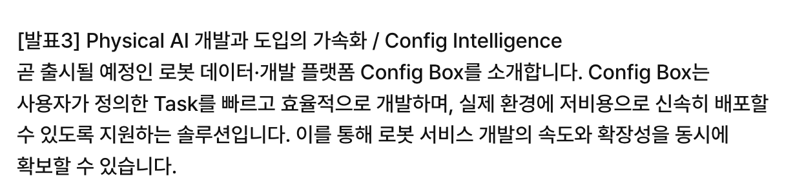

안녕하세요, SK플래닛 테크편집부입니다! 
벌써 SK AI SUMMIT이 1주일 앞으로 다가왔네요~ AI SUMMIT으로 출범한지 2년차를 맞이하여 행사를 퀵하게 소개하고, 사전등록을 깜박하신 독자 여러분을 위한 현장등록 및 온라인(라이브 및 VOD) 시청방법 소개, 그리고 SK플래닛의 2025년 발표 주제 정보를 함께 알려드립니다. 

* SK AI SUMMIT 2025 간단 미리보기 
* SK AI SUMMIT 2025 현장 등록 방법은? (사전 등록을 놓친 분들을 위한 팁!)
* SK AI SUMMIT 2025를 유튜브 라이브로도 볼 수 있는가? 
* SK플래닛의 SK AI SUMMIT 2025 발표 주제는?
* SK플래닛의 SK AI SUMMIT 2024 발표 주제는? 
* SK AI SUMMIT 2025의 '숨은 맛집' - 흥미있는 발표 5가지만 뽑는다면? 

# 1. SK AI SUMMIT 2025 간략 정보 
--- 

* 일시: 2025년 11월 3일(월) - 4일(화) (자세한 시간은 웹사이트 참조) 
* 장소: 서울 삼성동 코엑스 (세부 발표장소는 웹사이트 참조) 
* 주제: 'AI NOW & Next(AI의 미래를 경험하다)'
* 웹사이트: https://www.skaisummit.com/ 
* Youtube: https://www.youtube.com/@skaisummit2025  
(키노트 및 일부 발표는 라이브 스트리밍을 제공하며, 발표 후 녹화 VOD 영상도 제공합니다)

 
 
 

# 2. SK AI SUMMIT 2025 현장 등록 방법은? (사전 등록을 놓친 분들을 위한 팁!)
--- 

이 글을 작성하는 10/28 현재 사전 참가신청은 벌써! **마감**되었습니다. **그러나!** 행사 당일 현장에 오셔서 **'현장 신청(행사당일 세션별 신청)'** 을 하시면 되는데요, 참고로 작년의 경우 행사 약 30분-1시간 전에 행사장 각 장소에 비치된 QR코드에 선착순 현장등록을 했습니다(인기 세션의 경우 줄을 섰던 기억이...).  
자세한 사항은 아래 및 [FAQ](https://www.skaisummit.com/faq)를 참고하세요! 

 
 

# 3. SK AI SUMMIT 2025를 유튜브 라이브 또는 녹화영상으로도 볼 수 있는가? 

---

네. 둘 다 가능합니다. 역시 [FAQ](https://www.skaisummit.com/faq)에 설명이 되어 있네요! 

 
 

# 4. SK플래닛의 SK AI SUMMIT 2025 발표 주제는? (올해는 2건 발표)
---

SK플래닛은 2025년에 2건의 AI 주제를 발표합니다 ~~(텔레콤, 하이닉스 외에는 1건 발표도 어려운데 음...)~~ 

* 제목 #1: **"어떤 광고가 돈이 될까" - SK플래닛 AD(P.AD)에 적용된 AI 기반 광고 수익 최적화 기술**
* 소속/발표자: 데이터서비스개발팀 신호준 매니저, AI서비스개발팀 윤이연 매니저 
* 일시: **11/3(월) 17:00-17:25** (Day 1)
* 분야/장소: AIX, **203호** 
* 발표시간: 25분 (발표 20분, 질의응답 5분)

* 제목 #2: **"내 목소리가 말하고, 노래한다! AI가 만들어준 나만의 목소리"**  (주제 3: Voice LLM, AI와 사람처럼 대화하기 - 음성 기술과 서비스) 
* 소속/발표자: AI서비스 개발팀 김우주 매니저 
* 일시: **11/4(화) 14:40-15:40** (Day 2)
* 분야/장소: Special Session, **205호** 
* 발표시간: 세션당 15분 * 3개, 이후 질의응답 

# 5. SK플래닛의 SK AI SUMMIT 2024 발표 주제는? (작년에는 1건 발표) 

2024년에는 SK플래닛은 1건의 AI 개발 사례를 발표하였습니다. 

* 주제: **"AI와 함께하는 고객소통 Skill Up : 복붙 답변은 이제 그만"**

* 내용 요약: 고객 맞춤형 자동 답변 생성 시스템을 고객 센터에 도입한 과정을 소개합니다. SK플래닛 고객센터에서는 OK캐쉬백 포인트 적립 및 사용 내역 확인, 맞춤형 답변 작성 등을 수동으로 처리해야 했기 때문에 상담사에게 매우 높은 숙련도가 요구되었습니다. 특히 신규 문의가 많을 때는 이러한 문제가 더욱 두드러져 고객 응대 품질이 일관되지 않고, 업무 효율성도 저하되었습니다. 이러한 문제를 해결하기 위해 LLM과 RAG 기술을 활용하여 고객 데이터 및 문의 이력을 기반으로 개별 고객 문의에 맞춤형 답변을 생성하는 자동화 시스템을 구축하였습니다. 시스템 구축 과정에서 겪은 다양한 기술적 도전과 법적 규제 준수 경험을 공유하여 고객센터 운영 효율화를 성공적으로 이루기 위한 인사이트를 전달하고자 합니다.

* 발표자: 이주화 매니저 - SK플래닛에서 오락 서비스 개발에 참여하며 사용자 중심의 애플리케이션 구현에 주력해오고 있습니다. 또한 생성형 AI 기술을 활용한 사내 AI 뉴스레터와 OK캐쉬백 고객센터 효율화 등 RAG 관련 프로젝트에 참여하고 있습니다. 다양한 기술들을 접목하여 사용자 경험의 조화를 추구하는 개발자로 성장하고자 합니다.

* 발표 영상: [(유튜브 링크)](https://youtube.com/watch?reload=9&v=MurvJ-LjQuM) 

 
 
 

# 부록. SK AI SUMMIT 2025의 '숨은 맛집' - 흥미있는 발표 5가지만 뽑는다면? 

키노트 및 국내외 대기업 CEO의 발표는 너무나 잘 알려져 있고(예: 샘 알트만) 다들 아실 것 같아 여기서는 생략하구요.  
여기서는 SK세션 외 ~~(팔이 안으로 굽는다고 할까봐...)~~ 타사 세션 중 편집부의 눈에 들어온 **숨은 맛집같은 주제를 뽑아 보았는데** 여러분들도 동의해주시면 좋을 것 같습니다(주관이 살짝 들어가 있을 수 있으므로 자유롭게 보아 주세요~ 참고로 번호는 시간대 순서입니다). 제가 말하긴 했지만 5가지만 뽑는 일은 참 어려운 일이군요! 

## (1) 국가대표 AI: 일의 미래를 바꾸는 생성형 AI 모델과 에이전트의 힘 (업스테이지, 11/3) 

* 소속/발표자: 업스테이지 김자현 사업개발 리드 
* 일시: 11/3(월) 14:05-14:30 (Day 1)
* 분야/장소: AI Model, 202호 

5대 국가대표 AI 기업 중 유일한 스타트업으로 글로벌 수준의 기술력을 자랑하는 [업스테이지](https://www.upstage.ai/)의 세션입니다. 프런티어급 모델 솔라 프로 2를 기반으로 한 다양한 국내외 사업 도메인에서의 AI 프로덕트를 이번 세션에서 소개할 예정이오니 참고하시기 바랍니다(참고로 9월 말 과기정통부 주관으로 코엑스에서 진행되었던 AI Festa에서 업스테이지 다른 분의 발표 세션에 참여했었는데요, 이 세션도 개인적으로 기대가 됩니다).

## (2) 크래프톤에서의 AI Transformation: 일하는 방식과 프로세스의 AI 기반 혁신 (크래프톤, 11/3) 

* 소속/발표자: 크래프톤 김도균 팀장 (AI Transformation Team)
* 일시: 11/3(월) 14:05-14:30 (Day 1)
* 분야/장소: AI Model, 202호 

최근 AI Native/Design/시너지 등 AIX(AI Transformation)을 위해 기업 내 변화를 주도하는 전담부서를 두는 곳이 많이 생겼고 사례들도 점점 많이 공유되고 있습니다. 혁신적인 게임회사 크래프톤의 AIX조직을 이끄는 김도균 팀장님의 'Enabler로서의 AI'를 활용한 일하는 방식의 전환 사례가 기대됩니다(참고로 SK에서도 이른바 'AI 일.방.혁(일하는 방식의 혁신)'을 위해 하이닉스 등 주요 회사에서 적극적으로 움직이고 있다고 합니다). 아, [크래프톤 AI 웹사이트](https://www.krafton.com/more-experience/ai/)가 별도로 있으니 함께 참고하세요. 

## (3) The Human Factor: 인간다움을 지키며 AI를 구축하는 방법 (MIT Media Lab)

* 소속/발표자: MIT Media Lab Pattie Maes 
* 일시: 11/3(월) 16:25-16:50 (Day 1)
* 분야/장소: Special Session, 205호 

20세기 AI와 소프트웨어 에이전트의 '레전드'이신 MIT Media Lab의 [Pattie Maes 교수님](https://www.media.mit.edu/people/pattie/overview/)이 라인업에 있었네요! 저도 자세히 안 들여다봤으면 그냥 넘길 뻔했습니다(예전에 수도 없이 논문을 다운로드받았던 기억이 나네요. 예를 들어 'Agent-mediated Eletronic Commerce' 같은). 벨기에 출신의 컴퓨터 과학자이자 혁신적인 HCI 연구자, 1990년대 Software Agents 개념을 제시하신 것으로 학계에는 너무나 잘 알려져 있습니다. MIT Media Lab이 유명해지게 된 것도 이분 덕분(!)이라고 굳게 믿는 1인이기도 합니다 ㅎㅎ 섭외해 주신 AI SUMMIT 사무국에 감사드립니다. 

## (4) 2025년 LLM 훈련과 서빙의 진화: 하이퍼스케일 AI 플랫폼 Backend.AI의 기술적 도전과 해법 (래블업)

* 소속/발표자: 래블업 신정규 CEO 
* 일시: 11/4(화) 15:50-16:15 (Day 2)
* 분야/장소: AI Infra, 201호 

독특한 AI 인프라 매니지먼트 사업모델을 표방하며 흑자까지 내고 있는 래블업의 대표 플랫폼 Backend.AI의 테크 인프라 관점에서의 기술 세션입니다(참고로 래블업은 구글 등 투자를 받고 있으며 속도 등의 이슈로 k8s를 적용하지 않는 것으로도 잘 알려져 있죠). 본 세션에서는 특히 이종 컴퓨팅 환경을 활용하여 워크로드를 분배하고 단계별 동작 할등을 통한 서빙 아키텍처 혁신, 네트워크 최적화 및 하이브리드 인프라 통합 관리의 구현입니다. 테크 인프라 기반 AI를 좀더 파보고 싶은 참가자 분들께 권해드립니다. 

## (5) 로봇은 어디까지 왔을까? 자동화부터 휴머노이드까지, 로보틱스 AI의 사계

* 소속/발표자: Config Intelligence 서민준 CEO 
* 일시: 11/4(화) 15:50-17:25 (Day 2, 세션 3/4) 
* 분야/장소: Special Session, 205호 

총 4개의 로봇 자동화에서 휴머노이드까지의 전문가 세션이 이어집니다. CES/GTC 2025에서 Physical AI 개념 발표로 해당 분야 기술이 가속화되고 있으며, 최근 우리나라에서 열린 [CoRL 2025](https://www.corl.org/) 및 [IEEE-RAS Humanoids 2025](https://2025humanoids.org/) 국제 로보틱스 학회에 엔비디아, 구글 딥마인드가 참여 및 후원하는 등 AI 기술이 도입된 로봇 및 휴머노이드에 대한 뜨거운 관심을 보여주었습니다. 
네 세션 모두 재미있을 것 같은데요, 개인적으로는 [Config Ingelligence](https://configint.com/) CEO & KAIST 교수를 겸임하시는 서민준 님 세션이 기대가 됩니다. 

 
 

그밖에도 다른 세션도 다 좋고(예: Agentic AI 세션 등) 다양한 AI 전시도 있으니 함께 참고하세요. 
시간 되시는 분들은 다음 주에 코엑스에서 (각자의 세션에서) 뵙겠습니다. Enjoy SK AI SUMMIT!
 
읽어 주셔서 감사합니다. 

