이른바 'IT 회사'으로 불리는 많은 기업들은, 그들이 개발하는 제품을 통한 기술력을 홍보하고 작성자의 퍼스널 브랜딩을 지원하는 등의 다양한 목적으로 기술 블로그(또는 테크 블로그)를 운영하고 있습니다. SK에서도 SK플래닛을 포함한 이른바 SK ICT Family사들이 각 사별 특성에 맞는 테크 블로그를 운영하고 있는데요, 이번 글에서는 SK ICT 각 사별 테크 블로그의 2024년 버전을 소개해 드리오니 도움이 되시길 바랍니다. ^^ 

## 1. SK DEVOCEAN (/데보션/ 으로 읽습니다!) 
--- 
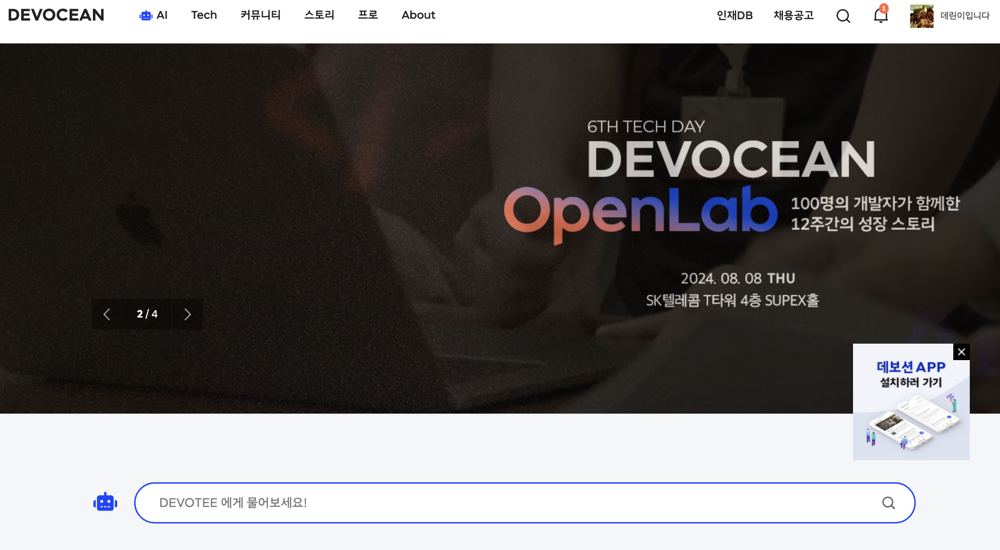

올해로 3주년을 맞은 데보션은 SK텔레콤의 개발자 소통 커뮤니티 플랫폼으로, SK ICT 패밀리사의 개발 전문가들과 외부 개발인재간 소통 및 기술 공유를 위한 디벨로퍼 릴레이션(DevRel) 채널 역할을 겸하고 있습니다. 최근 7월 메뉴를 개편하고 AI 챗봇을 테스트하는 등 이용 편의성을 높이고 있으며, 데보션 영, 테크 데이, 개발자 밋업 등 다양한 프로그램을 함께 진행하고 있습니다. 

* https://devocean.sk.com/ (데보션 메인 페이지)
* https://news.sktelecom.com/204774 (데보션 3주년 홍보기사, SK텔레콤 뉴스룸)

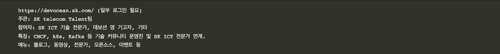

## 2. SK(주) C&C's TECH BLOG 
--- 

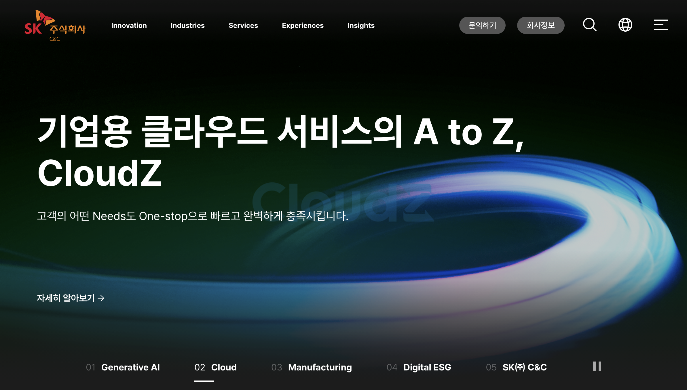

SK C&C의 테크 블로그는 2024년 기준으로 회사 대표 웹사이트에 포함되었으니 함께 참고하세요! https://www.skcc.co.kr/

이전 테크 블로그는 Cloud Native Application 개발을 위한 CNAPS 방법론과 Cloud 및 SW Development Modernization 관련 기술과 노하우를 소개하였습니다.

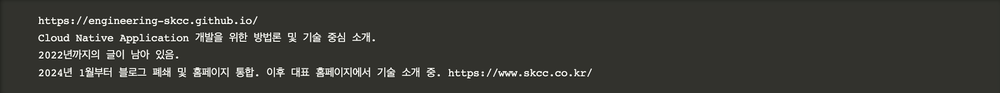

## 3. Tech Topic: SK플래닛 테크 블로그
--- 
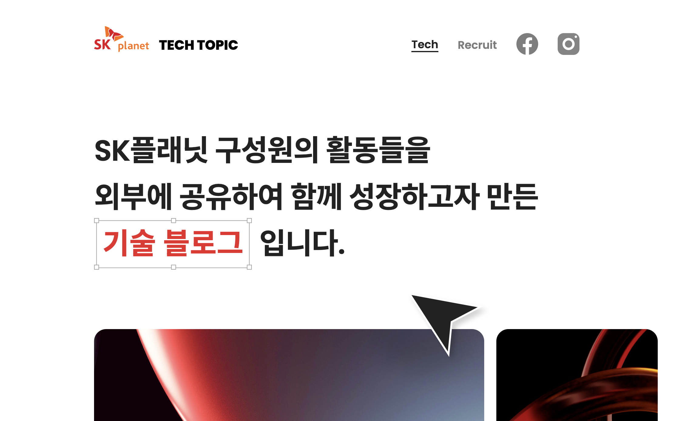

판교에 있는 SK플래닛에서 운영 중인 테크 블로그입니다. https://techtopic.skplanet.com/

2023년 매월 운영되다가 올해는 격월 운영 중이며, 위에서 소개드린 SK데보션 및 T Academy, 외부 사이트인 코드너리, TechBlogPosts와도 연계되어 있구요. 
블로그와 함께 개발자 활동 페이스북을 함께 운영 중입니다(SK플래닛 개발자 활동, 팔로워 약 4.6천, https://www.facebook.com/README.SKP/ )  

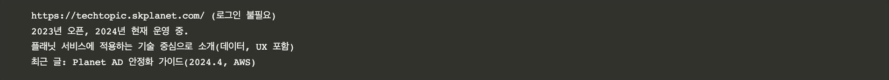

덧. SK플래닛 초기에는 README라는 블로그를 2012년 오픈하여 2018년 11번가 분사 전까지 운영했습니다. 
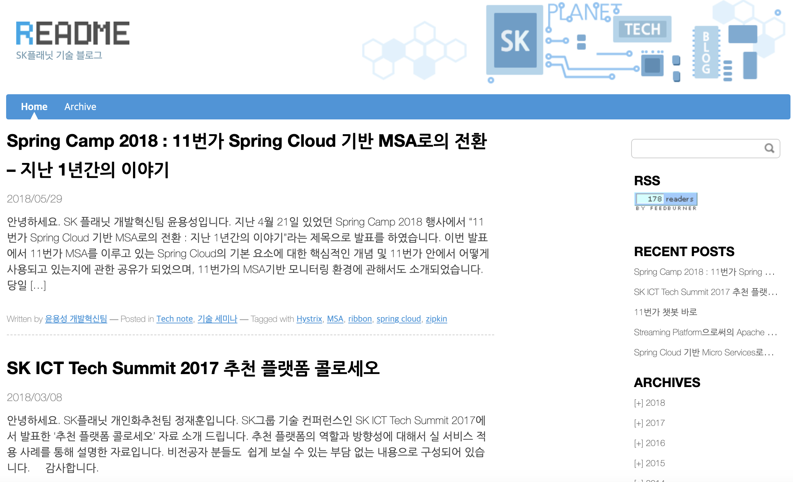

* 링크: https://web.archive.org/web/20190116065552/http://readme.skplanet.com/ 
* 글은 아카이빙되어 있으며, 마지막 글은 Spring Camp 2018년에서도 발표하였던,'Spring Cloud 기반 MSA로의 전환, 지난 1년간의 이야기(2018.5)' 였습니다.

## 4. 11번가 테크 블로그, Tech Talk 
--- 
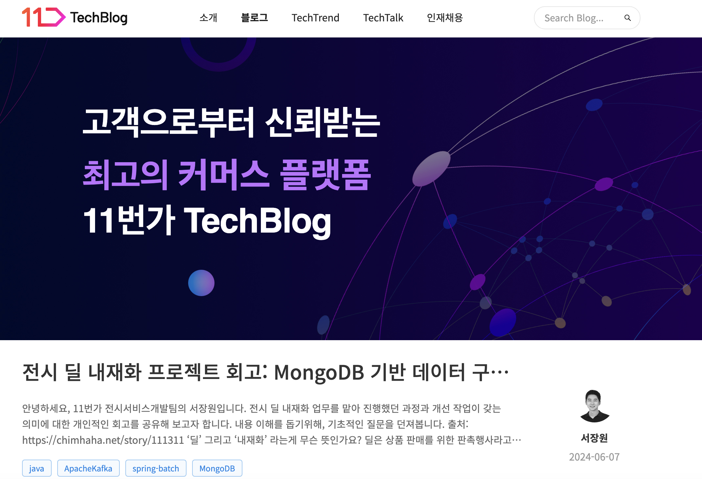

11번가 기술조직에서 운영되는 테크 블로그입니다. https://11st-tech.github.io/

2021년 오픈하였으며 Java, Spring, AWS 개발 및 배포 사례 등 서버 및 클라우드 기술 중심으로 포스팅하고 있습니다. 
Tech Talk라는 외부 대상 기술 컨퍼런스도 매년 진행하고 있으며 발표 내용은 유튜브 등에서 보실 수 있습니다
(컨퍼런스 링크는 https://techtalk.11stcorp.com/ 입니다)

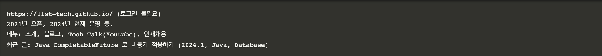

## 5. 드림어스컴퍼니(FLO) 블로그 
--- 
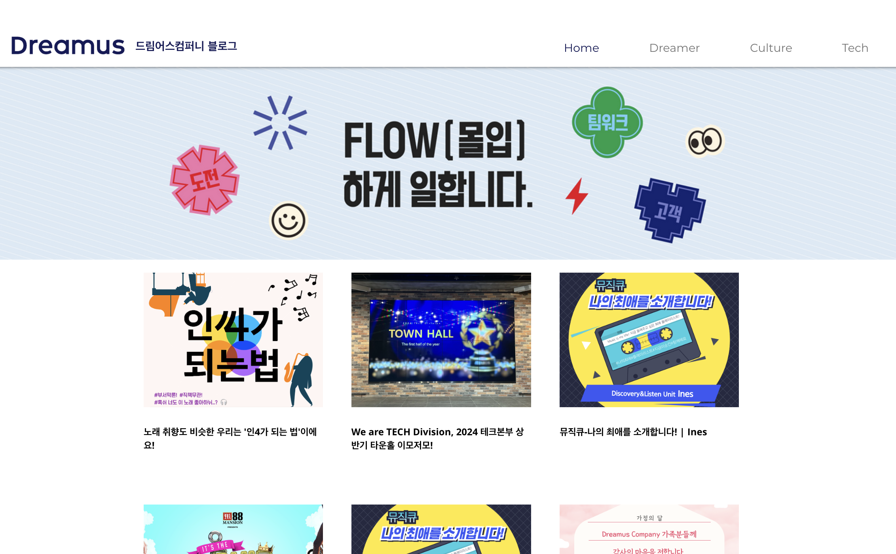

음악 서비스 FLO를 개발하는 드림어스컴퍼니에서 운영하는 블로그입니다. https://www.blog-dreamus.com/

기술뿐만 아니라 회사 컬처 등을 함께 외부에 소개하는 것이 이 블로그의 특징입니다.
커버하는 테크 분야는 앱 개발, 서버, 추천 기술 등 다양한 카테고리를 포함합니다.

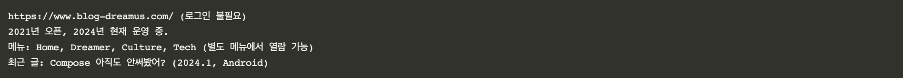

## 6. 티맵모빌리티 블로그 (티맵 테크노트) 
--- 
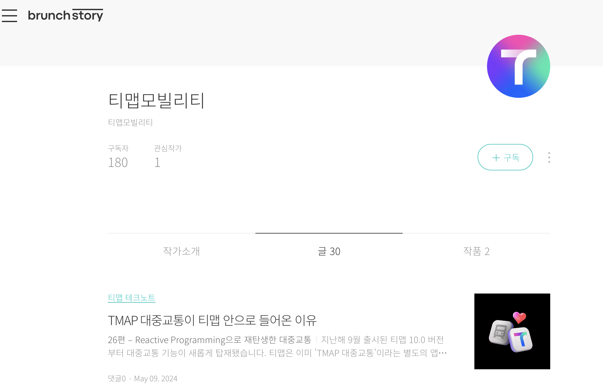

T map을 개발 및 서비스하는 티맵모빌리티의 블로그입니다. https://brunch.co.kr/@tmapmobility

티맵 개발자들이 직접 쓰는 테크노트 중심의 글들을 포스팅한다는 컨셉으로 최근까지 활발하게 외부에 기술을 공유하고 있습니다.
(저도 이 글을 통해 티맵 버전이 벌써 10이라는 것을 알게 되었습니다 ^^)

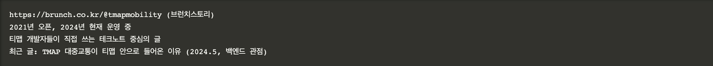

## 7. 인포섹 공식 블로그 (종료) 
--- 
인포섹과 ADT캡스가 쉴더스로 합병하기 직전까지 운영되었던 보안 관련 블로그입니다. https://m.blog.naver.com/PostList.naver?blogId=skinfosec2000&tab=1
남아있는 소개 글은 '보안 그 이상의 믿음, 대한민국 보안산업을 선도하는 인포섹 입니다' 이네요.

#### 마무리

지금까지 SK ICT 관계사 중심으로 운영되었거나 운영 중인 테크 블로그들을 소개하였습니다.
각 테크 블로그들이 SK 관계사뿐만 아니라 외부의 개발자들과도 공유 및 소통의 도구로 더욱 성장하기를 바랍니다. 읽어 주셔서 감사합니다. 

덧. 이 블로그는 SK 데보션에서도 같은 내용으로 참고하실 수 있습니다. https://devocean.sk.com/blog/techBoardDetail.do?ID=166044&boardType=techBlog&searchData=&searchDataMain=&page=&subIndex=&searchText=sk+ict&techType=&searchDataSub=
