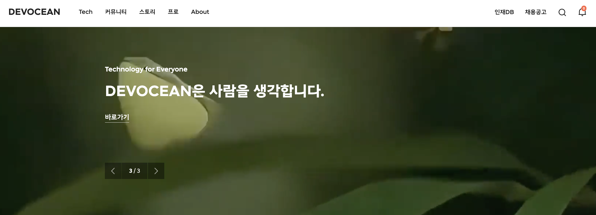
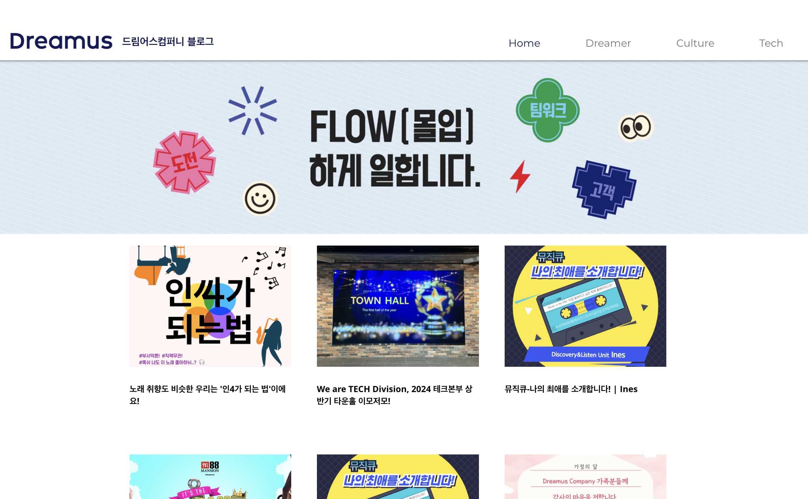

안녕하세요, 테크편집부입니다!  
SK그룹 테크블로그가 궁금하신 분들을 위해, 작년에 이어 SK ICT 테크블로그 2025년 버전을 업데이트해 보았어요~  
(참고: SK ICT 테크블로그 2024년 버전 -  https://techtopic.skplanet.com/skict-techblog24/ ) 

1년이 지났을 뿐인데 업데이트할 내용들이 제법 있었어요. SK ICT를 대표하는 **SK데보션 블로그**, 지금 보고 계시는 **SK플래닛 Tech Topic** 등은 계속 잘 운영되고 있구요, 올해 변경된 주요 내용은

1. SK C&C의 사명 변경(SK AX)과 인사이트 메뉴 소개
2. 원스토어의 개발자 스타일 블로그 오픈 이야기
3. SK쉴더스의 정보보안/물리보안 블로그 내용을 추가했어요~

(작년에 소개해 드린 11번가, 티맵, 드림어스 등의 테크블로그 정보도 현행화했어요. 자세한 내용은 아래에!)

## 1. SK DEVOCEAN(데보션) 기술 블로그  
--- 

올해로 4주년을 맞은 데보션은 SK텔레콤이 운영하는 SK그룹의 대표 개발자 커뮤니티 플랫폼으로, SK ICT 패밀리사의 개발 전문가들과 외부 인재간 소통 및 기술 공유를 위한 개발자 활동(DevRel) 채널 역할을 겸하고 있습니다. 블로그뿐만 아니라 AI 개발 생태계를 지원하는 '데보션 오픈랩', 실무형 AI 인재 성장을 지원하는 '데보션 AI 펠로우십' 등 다양한 외부 프로그램을 함께 진행합니다.

* SK데보션 메인 페이지 https://devocean.sk.com/
* 데보션 오픈랩 신설 홍보기사 https://news.sktelecom.com/202785 (SK텔레콤 뉴스룸, 2024)

## 2. SK(주) AX TECH BLOG 
--- 

2025년 6월 1일부터 SK(주) C&C의 회사명이 SK(주) AX로 변경되었습니다!  
('AX'는 'AI Transformation' 이라는 의미입니다)

SK AX 테크 블로그는 2024년 C&C 때부터 회사 대표 웹사이트에 포함되었으며, 'Insights' 메뉴 내에 기술 인사이트 및 트렌드 메뉴를 별도로 운영하고 있습니다.

* SK AX Insight& Trends 메뉴: https://www.skax.co.kr/insight/trends
* SK AX 회사 사이트: https://www.skax.co.kr/

## 3. Tech Topic: SK플래닛 테크 블로그
--- 

판교에 있는 SK플래닛에서 운영 중인 기술 블로그입니다.  
2023년 1월부터 월 평균 1회 수준으로 블로그를 운영 중이며, OK 캐쉬백, 시럽(Syrup) 등 SK플래닛에서 개발한 프로덕트의 기술과 개발 회고 내용을 소개합니다(초기에는 UX, 솔루션을 포함하였으나 개발 내용 중심으로 변화 중!).
위에서 소개드린 SK데보션 및 T Academy, 외부 개발자 포털(코드너리, TechBlogPosts)와도 연계되어 있구요.
블로그와 함께 개발자 페이스북을 함께 운영 중입니다(SK플래닛 개발자 활동, 팔로워 약 4.6천).  
덧. SK플래닛 초기에는 'README'라는 블로그를 2012년 오픈하여 2018년 11번가 분사 전까지 운영했습니다. 

* SK플래닛 테크 블로그: https://techtopic.skplanet.com/
* SK플래닛 개발자 활동 페이스북: https://www.facebook.com/README.SKP/
* SK플래닛 구 블로그(아카이브): https://web.archive.org/web/20190116065552/http://readme.skplanet.com/
* SK플래닛 회사 사이트: https://www.skplanet.com/ 

## 4. 11번가 테크 블로그, Tech Talk 
--- 

11번가에서 운영 중인 테크 블로그입니다.  
2021년 오픈하였으며 Java, Spring, AWS 개발 및 배포 사례 등 서버 및 클라우드 기술 중심으로 포스팅합니다.

* 11번가 Tech Blog: https://11st-tech.github.io/
* 11번가 회사 사이트: https://www.11stcorp.com/ 

## 5. 드림어스컴퍼니(FLO) 블로그 
--- 

음악 서비스 FLO를 개발하는 드림어스컴퍼니에서 운영하는 블로그입니다.  
기술뿐만 아니라 회사 컬처 등을 함께 외부에 소개하고 있으며,
기술 카테고리에서 커버하는 내용은 앱 개발, 서버, 추천 기술 등 다양한 카테고리를 포함합니다.

* 테크 카테고리: https://www.blog-dreamus.com/dreamus-now
* 드림어스컴퍼니 회사 블로그: https://www.blog-dreamus.com/

## 6. 티맵모빌리티 블로그 (티맵 테크노트) 
--- 

TMAP을 개발 및 서비스하는 티맵모빌리티의 블로그입니다. 브런치를 활용하고 있으며, TMAP 개발자들이 직접 쓰는 테크노트 중심의 글들을 포스팅한다는 컨셉으로 외부에 기술을 공유합니다.

* 티맵모빌리티 테크노트: https://brunch.co.kr/@tmapmobility
* 티맵모빌리티 회사 사이트: https://www.tmapmobility.com/ 

## 7. 원스토어 기술 블로그 (NEW!)
---

2024년 12월 모던한 분위기의 원스토어 기술블로그를 새롭게 오픈하였습니다. 많은 관심과 참고 부탁드립니다!  
(회사 사이트 메뉴에 블로그 메뉴가 포함되어 있습니다)

* 원스토어 Tech Blog: https://www.onestorecorp.com/sv/techblog/
* 원스토어 회사 사이트: https://www.onestorecorp.com/

## 8. SK쉴더스 물리/정보보안 블로그 
--- 

SK쉴더스 회사 사이트에 블로그 메뉴가 포함되어 있습니다. 독특한 것은 정보보안 블로그와 물리보안 블로그가 별도로 운영된다는 점입니다(참고로 SK쉴더스는 예전에 SK인포섹과 ADT캡스라는 두 개의 회사가 하나로 합쳐진 회사여서, 각각의 사업 영역에 맞는 블로그를 운영하는 것 같습니다).

* 정보보안/물리보안 블로그: https://www.skshieldus.com/kor/blog.do
* SK쉴더스 회사 사이트: https://www.skshieldus.com/

## 마무리하며

지금까지 SK ICT 패밀리사 중심으로 운영되었거나 운영 중인 다양한 기술 블로그들을 소개하였습니다(작년보다 더 많아졌네요!). 혹시 빠진 내용이나 보완할 부분이 있다면 알려주시면 감사하겠습니다.  
이들 블로그들이 SK그룹 내 개발자뿐만 아니라 외부의 개발자들과도 공유 및 소통하며 서로가 성장하는 도구로 잘 활용되기를 바랍니다. 읽어 주셔서 감사합니다.
