안녕하세요, 테크편집부입니다. 

지난 여름 사내 세미나에서 **'우리는 이미 만들고 있었다'** 라는 주제로 공유된 개발조직 AI 구현 사례를 블로그 스타일로 재편집/정리였사오니 참고하시기 바랍니다. 

*SK플래닛은 OK캐쉬백과 Syrup Wallet 앱으로 알려져 있는 회사로, 그밖에도 다양한 사내외 AI & Data 플랫폼 및 도구를 개발해 오고 있습니다. 2025년 현재 저희는 LLM을 직접 개발하지는 않으며(예: 'LLM 국가대표 5대 기업'이 아님) AI를 우리의 프로덕트에 어떻게 잘 활용할 것인가에 초점을 맞추고 있습니다. 특히 **1) 프로덕트의 가치의 향상 2) AI Coding 도구를 통한 개발 생산성 향상 3) AI와 협업하면서 생산성을 직접 경험하며 사고의 혁신을 함께 이루는 것**을 지속적인 목표로 가져가려고 합니다(최근에는 11번가를 자회사로 편입하고 기프티콘 사업부를 인수하는 등 새로운 시즌을 맞고 있습니다).  

## 목차

* 왜 AI인가? 
* 우리가 이미 만든 것들은 무엇인가? 
* 만들고 있는 것들은 무엇인가? 
* 실험실에서 나온 이야기
* 선택과 집중: 전략적 판단 

---
# 1. (SKP에 있어) 왜 AI일까요? 

기업의 AI 도입 목적은 크게 세 가지로 나뉩니다. 첫째, **Efficiency**는 업무 자동화, 이상 탐지, 공정 최적화, 재고·수요 예측을 통해 기업의 운영 효율을 높입니다. 둘째, **Insight**는 데이터 기반 의사결정 지원, 마케팅 전략 강화, 상품 추천, 신규 서비스 기획으로 비즈니스 경쟁력을 확보합니다. 셋째, **Experience**는 인터페이스 개선, 개인화 맞춤 서비스, 실시간 피드백, 감정 인식을 통해 고객 경험을 혁신합니다.

이 세 가지는 AI 활용의 핵심 가치 축으로써 작용합니다. 

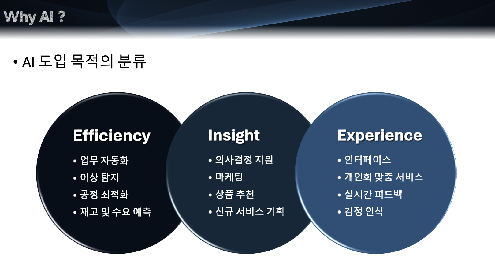
[그림 1 : AI 도입 목적의 분류]

 

---

# 2. 우리(SKP)가 이미 만든 것들은 무엇이 있을까요? 

## (1) 오글봇 (OCB개발팀/OCB서비스개발팀)

**더 자세한 내용은 테크 블로그를 참조하세요!** https://techtopic.skplanet.com/okcashbag-ai-replybot/

오글봇은 OK캐쉬백 커뮤니티 게시판에 첫 댓글을 자동으로 달아주는 AI 서비스로, 2024년에 출시하였으며 사용자의 글과 이미지를 인식하여 즉시 첫 댓글을 생성해 사용자 참여를 유도하는 것을 목적으로 개발하였습니다. 

기술 요소로는 당시 GPT-4o 모델을 적용했고 부가 기능을 통해 긍정적인 사용자 경험을 제공하며 **고객의 긴 서비스 체류시간**을 기대할 수 있습니다. 지역 이벤트 기능도 제공하는데, 국내에서는 NAVER API 기반으로 서비스 중이며, 해외에서는 추후 Google Places API를 활용할 예정입니다. 한정된 리소스로 커뮤니티 맥락에 맞는 댓글을 제공합니다. 

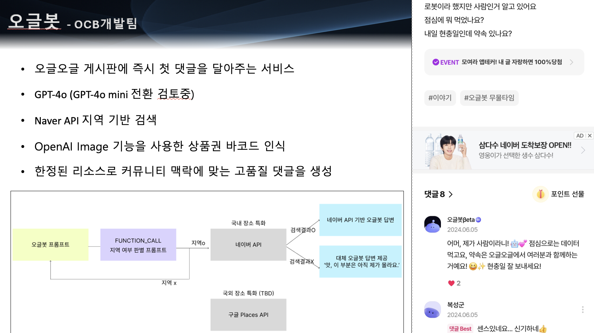
[그림 2 : 오글봇 개요]

## (2) AI Moment (VAS개발팀)

**더 자세한 내용은 테크 블로그를 참조하세요!** https://techtopic.skplanet.com/aimoment/

AI Moment B2B 서비스의 핵심은 AI 기반 광고영상 생성 솔루션이라는 점입니다. 멀티모달 기능으로 이미지-음성-문구를 결합하여 자동으로 광고 영상을 제작하며, 특히 소상공인 등 기업에서 손쉽게 광고영상을 제작, 홍보할 수 있는 영상 제작 기능을 지원합니다. 

주요 기술 요소로는 GPT-4o, Google TTS로 나레이션, 이미지 데이터셋 + 영상 템플릿을 통해 시각 요소와 구조를 결합하여 영상을 제작할 수 있습니다. 

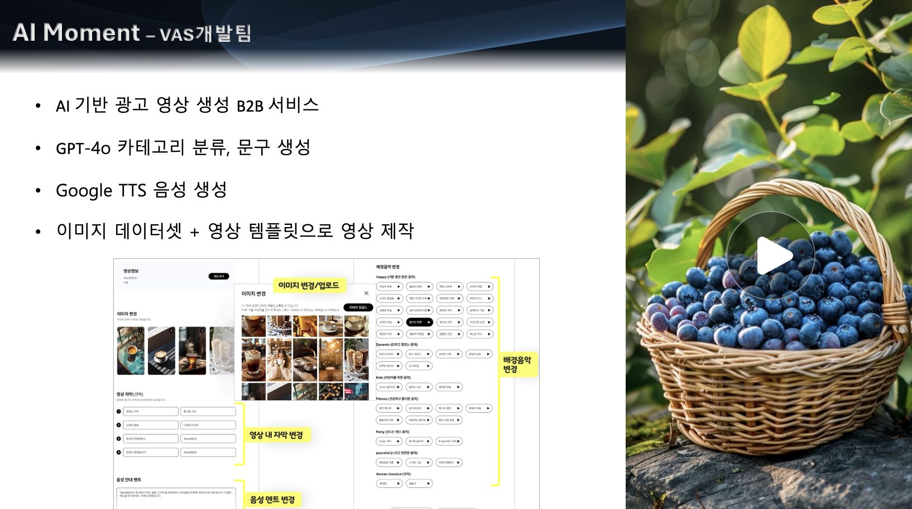
[그림 3 : AI Moment B2B 솔루션 개요]

 

## (3) AI 뉴스레터 (AI서비스개발팀) 

사내 AI봇의 부가기능 중 하나인 AI 뉴스레터 자동 발송 기능입니다.

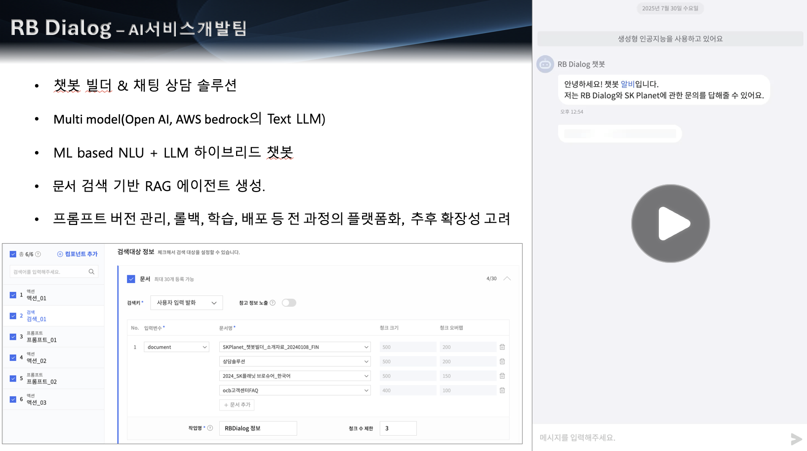

## (4) RB Dialog (AI서비스개발팀)

메인 페이지는 다음과 같으며, https://www.rbdialog.co.kr/  
RB Dialog를 활용한 AICC 개선 발표 내용은 [여기](https://www.youtube.com/watch?reload=9&v=MurvJ-LjQuM)를 참조하세요!  
(AI와 함께하는 고객소통 Skill Up: 복붙 답변은 이제 그만 - SK AI SUMMIT)  
 

RB Dialog는 챗봇 빌더와 채팅 상담 솔루션으로 구성되어 있으며, 다양한 AI 기술을 결합해 고도화된 대화형 서비스를 제공합니다.

주요 특징은 다음과 같습니다:

* Multi-model 지원: OpenAI, AWS Bedrock 기반 Text LLM 활용
* ML 기반 NLU + LLM 하이브리드 챗봇 구조
* 문서 검색 기반 RAG 에이전트 생성으로 지식 확장
* 프롬프트 버전 관리, 롤백, 학습, 배포 등 플랫폼화로 운영 효율성 강화 

# 3. 만들고 있는 것들 (주요 개발 과제)

## (5) DMP/CDP Seg Lens (데이터서비스개발팀) 

**더 자세한 내용은 테크 블로그를 참조하세요!** https://techtopic.skplanet.com/dmp-seglens/

DMP/CDP Seg Lens는 자연어·이미지를 활용한 고객 세그먼트 추천 서비스로, 대규모 데이터 기반 개인화 마케팅을 지원합니다. 세그먼트의 경우는 CDP 3만 개, DMP 6만 개 이상의 조건을 보유하고 있으며, 자연어·이미지 입력으로 고객의 세그먼트를 자동으로 추천합니다. 

기술 요소로는 **(1)  GPT-4.1-nano: 검색 결과 클러스터링 및 정제, 2) GPT-4o-mini: 의미 확장 및 RAG 기반 추천 및 3) 비즈니스 데이터 특성에 맞춘 최적화 설계**로 이루어져 있습니다. 

## (6) Insight Lens (AI서비스개발팀, 데이터서비스개발팀)

Insight Lens는 데이터 분석을 지원하는 AI 기반 쿼리 생성 어시스턴트로, 사내 시스템에 특화된 SQL 쿼리를 자동으로 만들어주는 내부용 text2sql 솔루션입니다. 

주요 기술 요소는 다음과 같습니다. 

* Claude 4 Sonnet, GPT-5로 쿼리 생성
* Llama 3.3 70B 6bit로 검색어 강화
* Multi-stage RAG로 참조 데이터 업데이트
* Jira, Galleon, Medic Data Infra와 연동하여 정책 품질 최적화

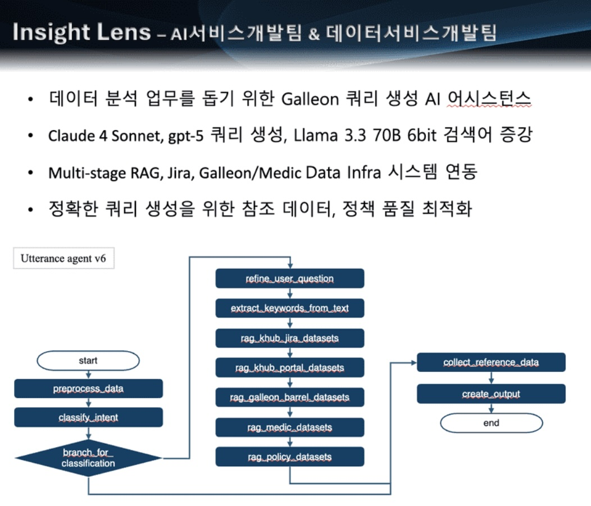

## (7) 1:1 문의 자동답변 (AI서비스개발팀)

1:1 문의 자동 답변 솔루션은 OK캐쉬백 등의 서비스 상담사 고객 대응 솔루션입니다.

이 솔루션의 핵심 기능은, OCB 앱 고객 문의를 접수받으면 이 내용을 맥락으로 답변 이메일 템플릿을 적용하여 답변 초안을 빠르게 만들어 내어 상담 효율을 높이고 있습니다. 

기술 요소로는 Llama 3.3 70B 6bit 모델로 자연스러운 답변을 작성하고, Multi-Stage RAG로 참조 답변 업데이트 및 품질을 측정하여, 제한된 Private LLM 자원으로 품질 최적화를 추구하고 있습니다. 

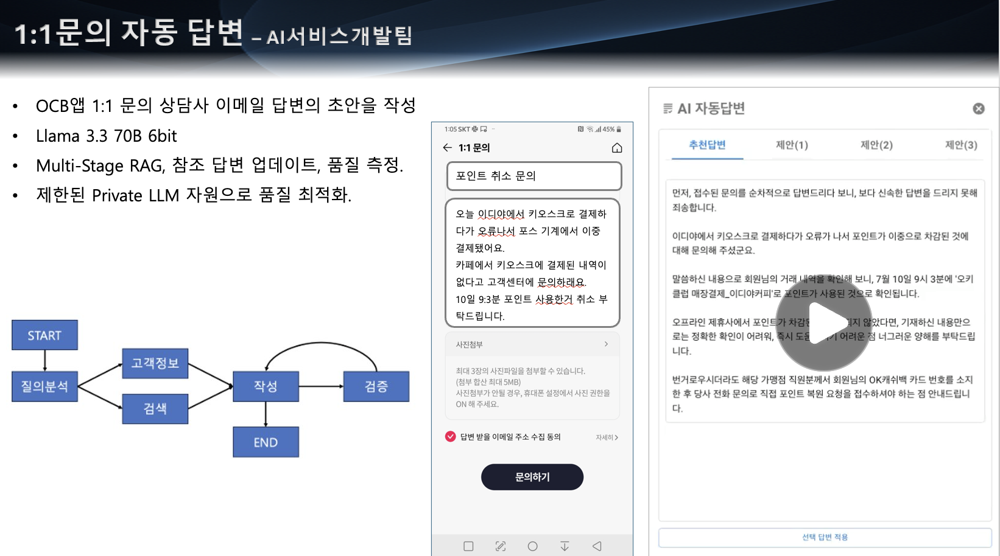

## (8) 지능형 ADN 설정 시스템 

**더 자세한 내용은 테크 블로그를 참조하세요!** https://techtopic.skplanet.com/planet-ad-for-money/blog/

본 과제는 **" '어떤 광고가 돈이 될까' - SK플래닛 AD(P.AD)에 적용된 AI 기반 광고 수익 최적화 기술"** 이라는 주제로 올해 **SK AI SUMMIT** 에서도 발표하였습니다. 지능형 ADN 설정 시스템은 광고 매출 극대화를 위한 노출 가중치 및 최소 단가 자동 조정 시스템이며, 다음의 특징을 갖고 있습니다. 

1) 자동 최적화: 광고 노출 비율과 단가를 실시간으로 조정해 매출을 극대화하고자 하였

2) MAB(Multi-Armed Bandit): 보상 기반 선택 전략을 개선하는 머신러닝 강화학습 기법 적용.

3) 운영 효율성 강화: A/B 테스트, 대용량 트래픽 처리, 실시간 업데이트, 하이퍼파라미터 튜닝 자동화 등의 적용 

최근 MAB의 단점을 보완하고자 **GMM(Gaussian Mixture Model)** 을 도입하여 실험을 계속하고 있습니다. 

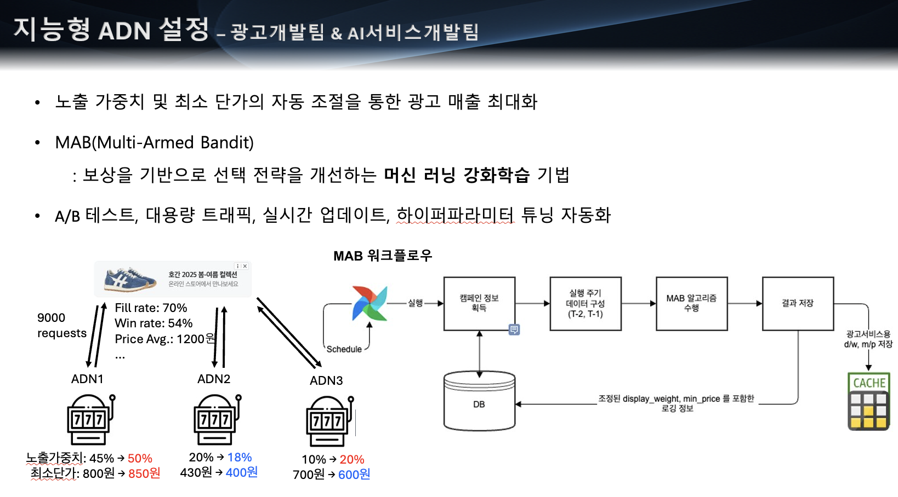

---

# 3.실험실에서 나온 이야기 

다양한 도메인에서의 AI 실험도 꾸준히 진행하고 있습니다(여기서는 이 중 일부를 간단히 언급해 드립니다).

## (9) Proximity ML 기반 타겟 모수 확대 (광고개발팀) 

* 통신사 기지국 기반 데이터를 활용하여 SKP 데이터의 모수 한계 극복 
* LSTM, FCN, Deep Learning, 시계열 예측 등 다양한 실험 
* Grid별 학습 데이터 및 모델 구축, 주적 모델 업데이트, 신뢰도 지표 

## (10) TTS & Speech2Sing (AI서비스개발팀)

**더 자세한 내용은 테크 블로그를 참조하세요!** https://techtopic.skplanet.com/speech2sing-ai/

Large Language Model과 Generative Model(Diffusion, flow-based, Generative Adversarial Network)의 발전으로 음성과 노래 생성 성능이 개선되었습니다. 이를 통해 Text2Speech, Speech2Text, Voice conversion과 같은 기술을 활용해 다양한 보이스 서비스를 통해 개인화된 콘텐츠 제작이 가능해졌습니다. 가장 흔히 접해 본 Text2Speech는 문자를 음성으로 변환해주는 기술입니다.

## (11) Real-time Voice AI (AI서비스개발팀)

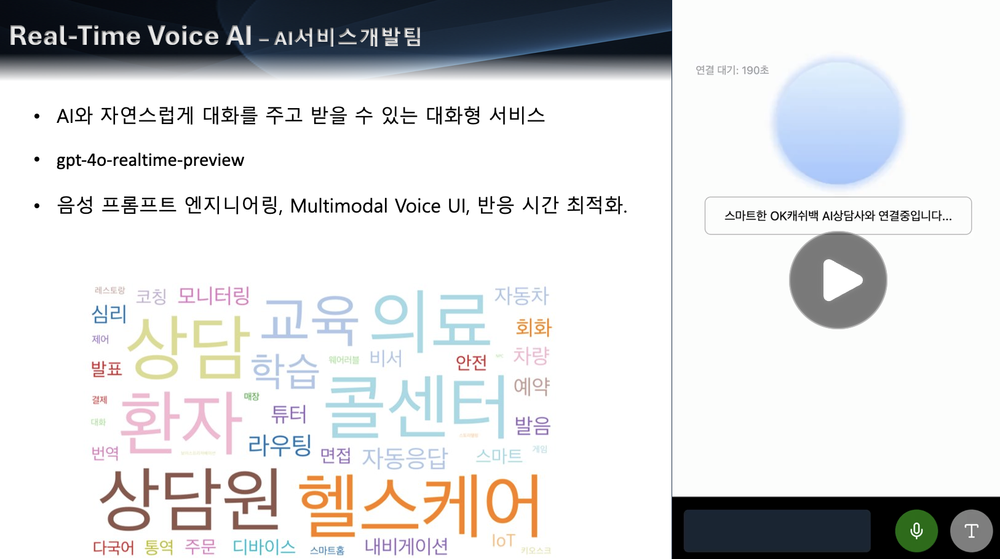

 
 

---

# 4.선택과 집중 - 전략적 판단

## (1) 현실 및 한계

정부·기업은 AI 투자를 확대하지만 기초 연구(R&D) 중심으로 편중되어 있어 상대적으로 응용 서비스가 미흡합니다.  
LLM 경쟁은 속도·비용 부담이 크고 국산화만으로는 글로벌 경쟁력 확보가 어려운 영역입니다.  
개인정보·데이터 이동 제한 등 규제로 서비스 혁신 속도도 더딘 것이 현실입니다. 

## (2) 전략적 선택

그래서 '우리'는, 모델 경쟁 대신 서비스와 데이터에 집중하고자 합니다(지금까지 소개했던 서비스 및 솔루션처럼요).
 

* 검증된 외부 LLM 활용 + 사내 최적화
* 도메인 특화 RAG, 프롬프트 엔지니어링
* 다모델·모듈형 아키텍처로 유연성 확보
* 단기 성과·피드백 중심 개발로 빠른 가치 창출

## (3) 국내 현황

대기업은 LLM·반도체·금융 등 다양한 AI 분야에 투자하며, 정부는 2025~2030년까지 AI 고속도로·데이터센터·GPU 인프라를 구축한다고 합니다(얼마 전 엔비디아로부터 5년간 최신 GPU 26만장 수급 관련 협의가 이루어지기도 하였습니다). 

그러나 서비스 상용화와 고객 경험 혁신은 여전히 부족하며, 따서 '우리'가 먼저 서비스 가치 창출로 격차를 메워야 합니다.

## (4) 왜 서비스 중심인가?

초거대 모델 개발은 비용·리스크·확장성 부담이 큽니다.  
반면 서비스 개발은 고객 가치와 비즈니스 성과를 빠르게 실현합니다.

LLM은 도구로 활용하고, 핵심 경쟁력은 데이터 품질·도메인 특화·UX에서 나오게 하는 것이죠. 

## (5) '데이터에 집중'의 실제 의미

이는 단순히 데이터 양을 늘리는 것이 아니라 품질과 활용성을 높이자는 방향 및 전략입니다. 
데이터 집중은 단순히 "데이터를 많이 모으자”가 아닙니다. (모델은 계속 발전할 것이므로) 모델을 갈아끼우더라도 계속 누적되는 품질 이점을 설계한다는 뜻입니다. 아래처럼 파이프라인·운영·거버넌스 관점의 행동으로 문구를 해석해야 합니다.

* 파이프라인: 로그·질의·실패 케이스 수집 → 정제·라벨링 → RAG용 지식베이스 구축
* 성능 고도화: Retrieval·응답 품질 지표 관리, 하이브리드 검색 적용
* 운영 자동화: 피드백 루프, 오류 사전감지, A/B 실험 체계
* 거버넌스: 개인정보 마스킹, 데이터 혈통(Lineage) 추적

## 서비스 예시

* Real-Time Voice AI: 음성 프롬프트 로그와 실패 사례(오인식/중단)를 데이터화하여, 턴 단위 회복 전략과 **지연 지표(P95 latency)** 로 개선함

* 지능형 ADN 설정: 대규모 트래픽·성과 로그를 MAB 강화학습의 보상으로 사용하여, 단가/노출 가중치가 데이터에 의해 매일 최적화함

* Proximity ML 타겟 확장: SKT 기지국 데이터와 내부 행동 데이터를 결합해 그리드 단위 시계열 예측(LSTM/FCN). 이를 통해 실제 집객·전환에 유의미한 모수를 확장할 수 있음

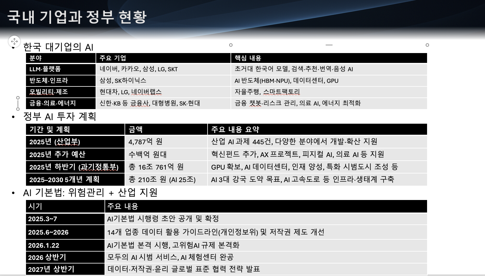

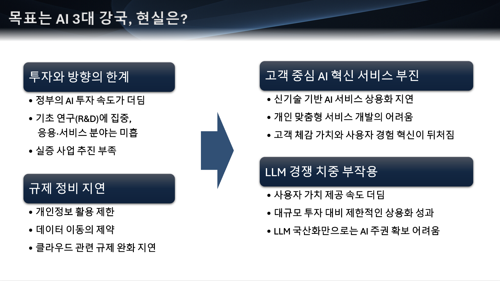

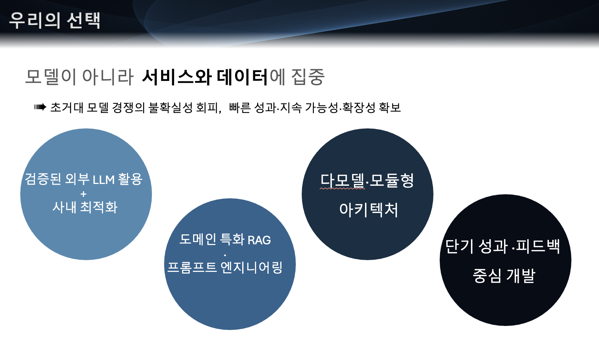

# 결론

 * '우리'(SK플래닛)는 외부 LLM을 잘 활용하고, 데이터로 서비스 성능을 체계적으로 끌어올리고자 합니다. 

 * AI 모델은 교체 가능하지만, 정제된 데이터·지식 베이스·운영 피드백은 '우리'의 누적 자산이 될 수 있습니다.

 * 결국 지속 가능한 경쟁력은 데이터에서 온다 - 이것이 “데이터에 집중한다”라는 말의 실제 의미입니다.