안녕하세요, SK플래닛 광고개발팀 이기원입니다. 본 글에서는 우리 회사의 증강현실(Augmented Reality) 기술 기반 마케팅 솔루션인 **'play AR'** 의 기술을 소개하기에 앞서, 다양한 마케팅 활용 사례를 먼저 소개함으로써 서비스와 효용성을 보다 쉽게 설명해 드리고자 합니다. 

가장 대표적인 최근 사례로는 카카오페이증권과 진행한 '춘식이는 홈런왕!' Web AR 이벤트 사례가 있으며, 그밖에도 많은 사례가 있사오니 참고하시기 바랍니다. 

## 1. 카카오페이증권 | 춘식이는 홈런왕!
<div style="text-align:center;">
  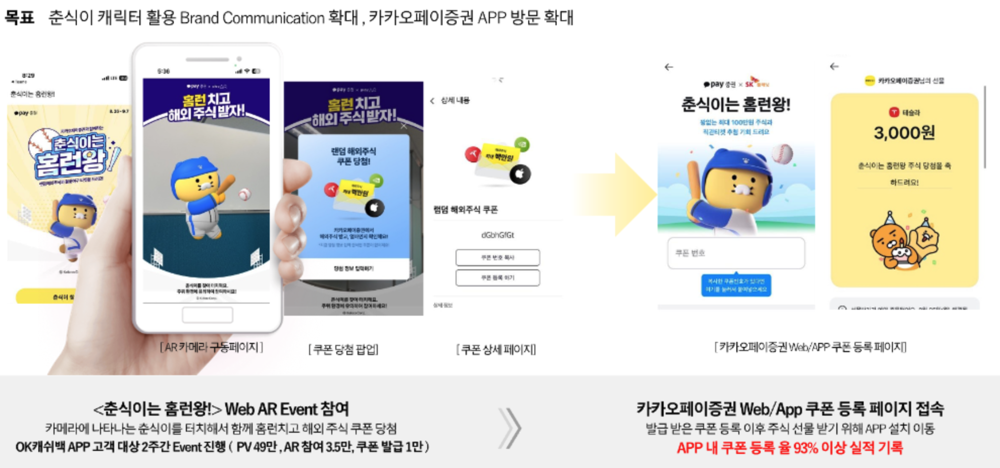
</div>
<br />

## 2.스타벅스 | 체리블러썸
<div style="text-align:center;">
  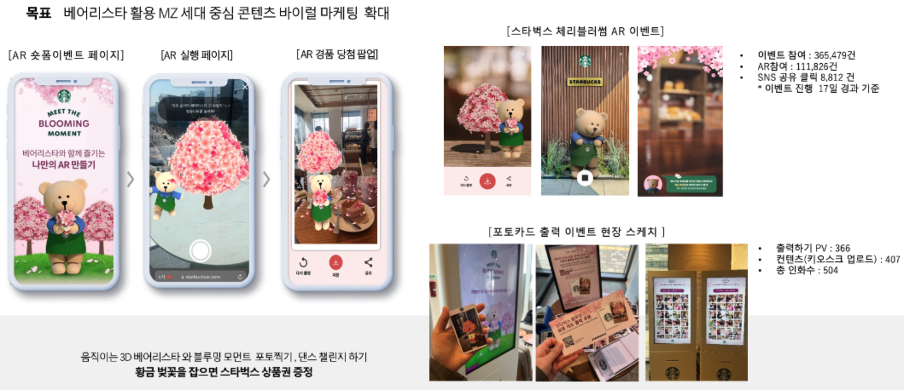
</div>
<br />

## 3. 파라다이스시티 호텔 | 그랜드 산타 익스프레스
<div style="text-align:center;">
  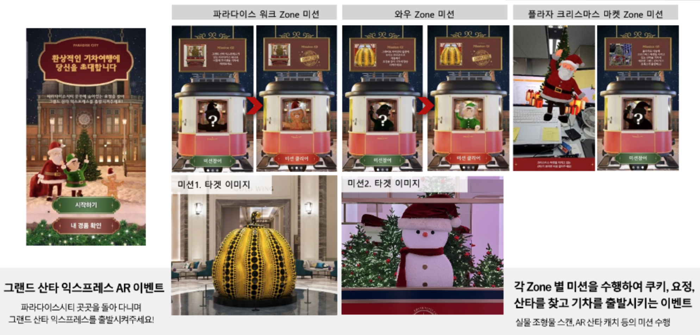
</div>
<br />
<br />

> **위와 같은 사례들은 모두 Web AR 기술을 기반으로 이루어졌습니다.**  
> **Web AR은 기존의 Native AR(App AR)이 가진 한계를 극복하며, 사용자 접근성과 경험을 개선한 기술입니다.**  
> **특히, 앱 설치 없이 QR 코드 스캔만으로 AR 콘텐츠에 접속할 수 있는 Web AR은,**  
> **마케팅 캠페인에서 고객의 참여를 유도하고 몰입감을 높이는 데 중요한 역할을 했습니다.**  
> **이제 play AR이 어떻게 Web으로 개발 되었는지, 그리고 이를 통해 어떤 기술적 변화가 이루어졌는지 살펴보겠습니다.**  

---

# Web AR 기술로의 전환 : 왜 'Web' AR인가?

기술의 발전에 따라 AR(Augmented Reality, 증강현실) 기술은 단순한 호기심의 차원을 넘어서 실질적인 비즈니스 도구로 포지셔닝하고 있습니다. 특히 AR 기술은 마케팅 분야에서 고객과의 상호작용을 강화하고 브랜드 경험을 혁신하는 데 중요한 역할을 하고 있습니다. 이와 같은 흐름 속에서 SK플래닛은 AR을 활용한 마케팅 솔루션인 'play AR'을 선보이며 기술 발전에 발맞춰 나가고 있었습니다.

하지만 기존의 **Native AR(App AR)** 은 사용자 경험을 저해하는 몇 가지 한계를 가지고 있었습니다. 개발자 입장에서는 AR 기능을 구현하기 위해 앱에 play AR SDK를 통합해야 하는 번거로움이 있었고, 사용자 입장에서는 앱 설치라는 진입 장벽이 사용자 접근성을 제한했습니다. 사용자는 AR 콘텐츠를 경험하기 위해 별도의 앱을 다운로드하고 설치해야 했으며, 이는 많은 사용자에게 부담으로 작용했습니다.  

이러한 문제를 해결하기 위해 등장한 것이 바로 **Web AR**입니다.  
Web AR은 **QR 코드 스캔만으로 간편하게 AR 콘텐츠에 접속**할 수 있는 환경을 제공합니다. 별도의 앱 설치 없이 브라우저를 통해 즉시 AR 경험을 시작할 수 있으며, 이는 사용자 접근성을 획기적으로 개선한 기술입니다.

<div style="text-align:center;">
  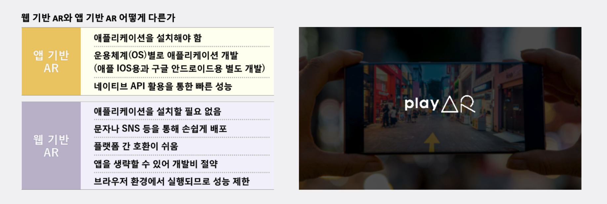
</div>

## Web AR의 주요 장점
1. **앱 설치 부담 해소**  
  Web AR은 별도의 앱 설치가 필요하지 않아, 사용자 진입 장벽을 낮추고 더 많은 고객에게 AR 경험을 제공할 수 있습니다.

2. **QR 코드 스캔을 통한 간편한 접속**  
  사용자는 QR 코드를 스캔하는 것만으로 AR 콘텐츠에 접속할 수 있습니다. 이는 특히 이벤트나 프로모션에서 고객의 참여를 유도하는 데 효과적입니다.

3. **앱 통합 및 배포 부담 없는 맞춤형 환경 제공**  
  Web AR은 별도의 앱 내 SDK 통합이나 배포 없이도 다양한 환경에서 고객 맞춤형 경험을 제공할 수 있습니다.  
  예를 들어, 특정 브랜드의 로고나 이미지를 활용한 AR 콘텐츠를 제작하여, QR 코드 스캔만으로 간편하게 접근할 수 있는 유연한 솔루션을 제공합니다.

## Web AR 전환으로 인한 성능 이슈와 해결 방안
Native AR은 ARKit(iOS)나 ARCore(Android)와 같은 플랫폼의 네이티브 API를 활용하여 디바이스의 하드웨어 가속을 최대한 활용할 수 있습니다.
반면, Web AR은 브라우저 엔진과 JavaScript의 한계로 인해 성능 저하가 발생할 가능성이 있습니다.

이러한 성능 이슈를 해결하기 위해 다양한 **최적화 전략**을 적용하여 Web AR에서도 원활한 사용자 경험을 제공할 수 있도록 개선하였습니다.

### AR 성능 최적화 전략

1. **3D 모델 및 콘텐츠 최적화**  
    - 웹 친화적인 경량화된 3D 모델 포맷(GLTF/GLB)을 활용하여 로딩 속도를 개선하고 렌더링 성능을 최적화하였습니다.

2. **WebGL 기반의 렌더링 최적화**  
   - 쉐이더 최적화: 복잡한 조명 계산과 쉐이더 로직을 간소화하여 GPU 부하를 줄이고 렌더링 성능을 개선하였습니다.
   - 프레임 속도 조정: 디바이스 성능에 따라 프레임 속도를 동적으로 조정하여 저사양 디바이스에서도 원활한 AR 경험을 제공하였습니다.
   - 마커 기반 추적 활용: 복잡한 피처 추적 대신 마커 기반 추적 방식을 사용하여 계산 부담을 줄였습니다.

3. **SPA 구조 구현**  
    - 페이지의 전환 없이 AR 콘텐츠를 빠르게 로드할 수 있도록 SPA 구조로 설계하고, 컴포넌트 기반 구현을 통해 AR 콘텐츠를 컴포넌트 단위로 분리하여 필요한 부분만 로드하고 렌더링하도록 최적화 하였습니다.  

4. **사용자 경험 최적화**  
    - 프로그레시브 로딩과 애니메이션을 활용하여 로딩 상태를 시각적으로 표시하고, 초기 로딩 시간을 단축하며 콘텐츠를 단계적으로 제공함으로써 사용자 경험을 한층 개선하였습니다.

<br />

**이를 통해 앱 설치 없이도 Native AR에 가까운 품질의 AR 경험을 제공하며, 사용자 접근성과 만족도를 동시에 향상시켰습니다.**

---

# Web AR의 기술 스택

Web AR은 최신 기술 스택을 활용하여 강력하고 유연한 AR 경험을 제공합니다.  
주요 기술 스택은 다음과 같습니다:

## 1. WebRTC(Web Real-Time Communication)
WebRTC는 브라우저 간의 실시간 통신을 가능하게 하는 기술로, Web AR에서 카메라 피드를 실시간으로 스트리밍하는 데 사용됩니다. 아주 간단한 코드로 디바이스의 비디오 및 오디오를 스트리밍 할 수 있습니다:

```javascript
async function playVideo(videoElement, constraints) {
  try {
    // 1. 카메라 및 마이크 접근, constraints 예시: { video: true, audio: true }
    const stream = await navigator.mediaDevices.getUserMedia(constraints);

    // 2. 화면에 표시
    videoElement.srcObject = stream;

    return stream;
  } catch (error) {
    console.error('Media access error:', error);
    throw error;
  }
}
```

## 2. A-Frame
Web AR의 메인 프레임워크로, 3D 콘텐츠를 웹 환경에서 구현합니다. A-Frame은 WebGL이나 Three.js에 대한 전문지식 없이도 간단한 HTML 태그를 사용하여 복잡한 3D 장면을 쉽게 구성할 수 있도록 지원합니다.  
A-Frame의 기본 코드 구조는 다음과 같습니다:

```html
<a-scene>
  <a-box position="-1 0.5 -3" rotation="0 45 0" color="#4CC3D9"></a-box>
  <a-sphere position="0 1.25 -5" radius="1.25" color="#EF2D5E"></a-sphere>
  <a-cylinder position="1 0.75 -3" radius="0.5" height="1.5" color="#FFC65D"></a-cylinder>
  <a-plane position="0 0 -4" rotation="-90 0 0" width="4" height="4" color="#7BC8A4"></a-plane>
  <a-sky color="#ECECEC"></a-sky>
</a-scene>
```

위 코드를 실행하면, 다양한 3D 오브젝트(박스, 구, 원기둥 등)가 배치된 장면을 렌더링할 수 있습니다.  
A-Frame은 이러한 간단한 코드만으로도 직관적이고 풍부한 3D 환경을 구현할 수 있는 도구입니다.

<div style="text-align:center;">
  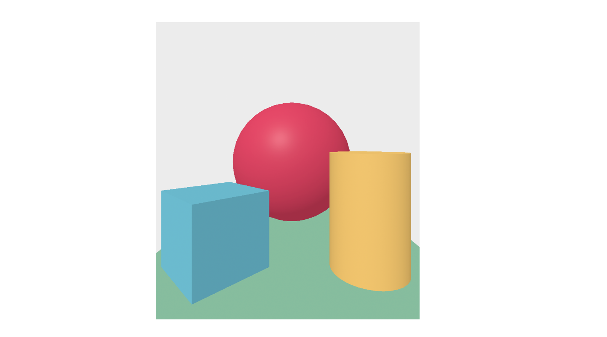
</div>

## 3. AR.js
AR 기능을 강화하는 라이브러리로, 다양한 AR 경험을 제공합니다.  
특히, A-Frame과 완벽히 호환되어 Web AR 환경에서 손쉽게 통합 및 활용할 수 있다는 장점이 있습니다.  
**Location Based(위치 기반)**, **Image Tracking(이미지 추적)**, **Marker Based(마커 기반)** 기능 등을 지원하며,  
실제로 이를 통해 play AR의 다양한 기능들이 구현되었습니다.  
예를 들어, 이미지 스캐닝형 템플릿이나 위치 기반 도슨트 템플릿과 같은 기능들이 AR.js를 활용해 개발되었습니다.

## 4. Vue.js
페이지 전환 없이 AR 콘텐츠를 구동할 수 있도록 **SPA(단일 페이지 애플리케이션)** 구조를 지원합니다.  
Vue.js는 컴포넌트 기반 개발 방식을 통해 템플릿을 기반으로 한 개발 최적화를 실현하며, 유지보수성과 확장성을 보장합니다.

---

# 템플릿 기반 구조와 기능
Web AR은 템플릿 기반으로 설계되어 있어, 간단한 백오피스 설정만으로도 다양한 AR 경험을 손쉽게 제공할 수 있습니다.  
주요 특징은 다음과 같습니다:

<div style="text-align:center;">
  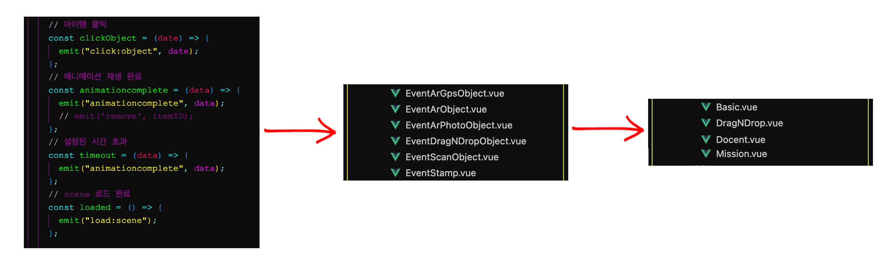
</div>

<div style="text-align:center;">
  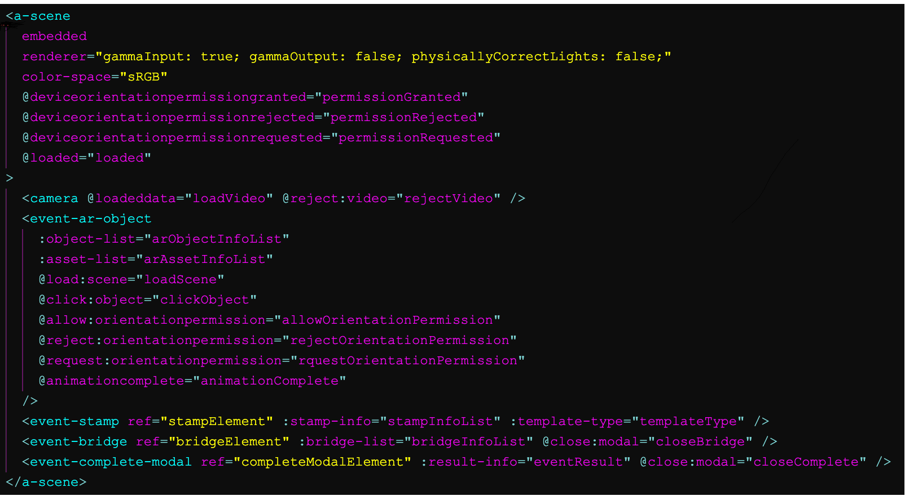
</div>

1. **렌더링 컴포넌트 설계 및 이벤트 관리**  
    - 각각의 역할을 담당하는 오브젝트 렌더링 컴포넌트는 컴포넌트 특성에 맞는 필수 기능만을 포함하도록 설계되었습니다.  공통 기능은 Vue.js의 이벤트 버스를 활용하여 부모 컴포넌트(템플릿)에서 템플릿 특성에 따라 유연하게 설정할 수 있도록 개발되었습니다.

2. **템플릿 기반 AR 구동**  
    - 템플릿 컴포넌트는 각각의 렌더링 컴포넌트를 조합하고, 필요한 이벤트를 선언하여 AR 콘텐츠를 구동하는 역할을 합니다.

---

# play AR의 주요 이벤트 시나리오

play AR은 다양한 이벤트 시나리오를 지원하여, AR 기술을 활용한 몰입감 있는 사용자 경험을 제공합니다.  
아래는 play AR에서 구현 가능한 주요 이벤트 템플릿과 그 특징들입니다:

## 1. **아이템 캐치형 이벤트**  
AR 상에서 특정 아이템을 찾아 캐치하면 혜택을 제공하는 방식입니다.  
사용자는 AR 환경에서 떠다니는 아이템을 터치하거나 특정 위치에서 수집하며, 이를 통해 쿠폰, 포인트, 경품 등의 보상을 받을 수 있습니다.  
<div style="text-align:center;">
  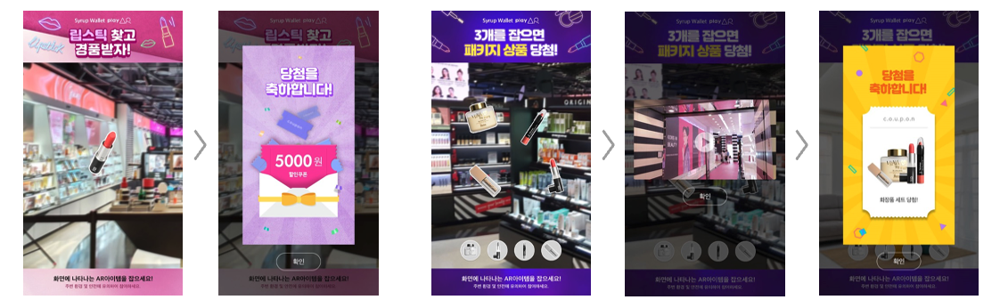
</div>

## 2. **이미지 스캔형 이벤트**  
AR 카메라를 통해 특정 이미지를 찾아 스캔하면 혜택을 제공하는 방식입니다.  
예를 들어, 브랜드 로고나 특정 상품의 이미지를 스캔하면, 관련된 AR 콘텐츠가 활성화되거나 보상이 제공됩니다.  
<div style="text-align:center;">
  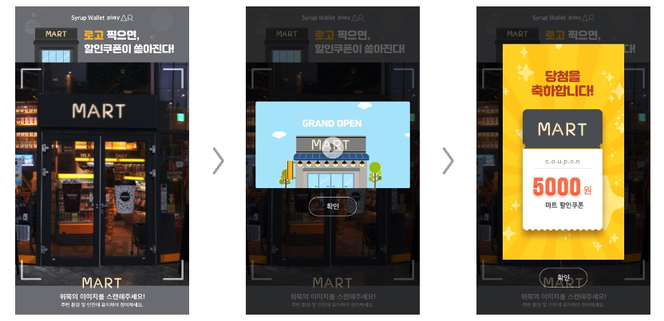
</div>

## 3. **포토형 이벤트**  
사용자가 3D 오브젝트와 함께 사진을 촬영한 뒤, 이를 SNS에 공유하거나 현장에서 인화할 수 있는 이벤트 방식입니다.  
예를 들어, play AR에서 제공하는 3D 오브젝트 캐릭터, 스티커, 배경 등을 활용해 사진을 찍고, 이를 공유하면 추가적인 혜택을 받을 수 있습니다.  
<div style="text-align:center;">
  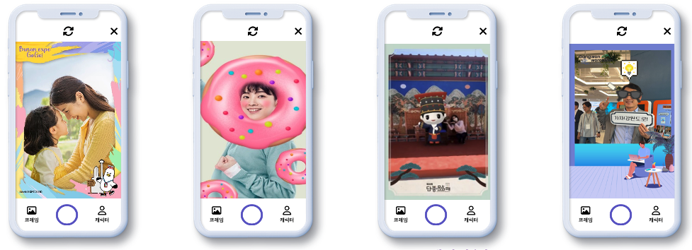
</div>

## 4. **도슨트형 이벤트**  
GPS 기반으로 특정 위치를 안내하고, 해당 위치에 도달하면 AR 콘텐츠가 활성화되어 혜택을 제공하는 방식입니다.  
예를 들어, 사용자가 특정 장소에 도착하면 AR 도슨트가 해당 장소의 정보를 제공하며, 미션 완료 시 보상을 받을 수 있습니다.  
<div style="text-align:center;">
  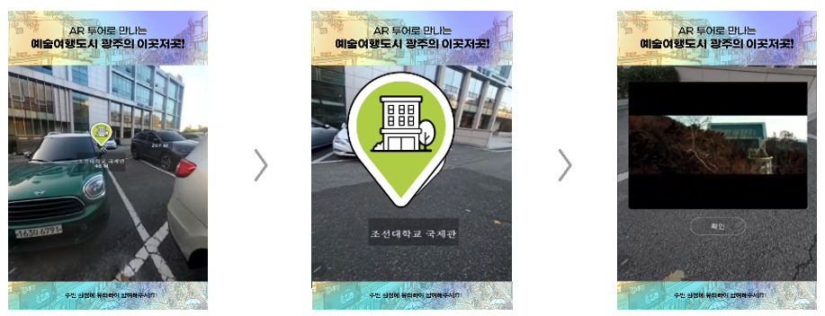
</div>

<br />
<br />

> **템플릿 시나리오뿐만 아니라 play AR의 기반 기술을 활용하여 요구사항에 맞게 커스터마이징이 가능하며, 따라서 실무자는 다양한 캠페인에 활용할 수 있습니다.**

---

# 마무리하며 

SK플래닛의 Web AR 기술 기반 'play AR'은 앱 설치 없이 QR 스캔만으로 AR 경험을 제공해 접근성과 몰입도를 높인 마케팅 솔루션으로, 다양한 템플릿을 통해 브랜드 캠페인을 유연하게 구현하며 다양한 협업 사례를 구축한 사례입니다. 
앞으로도 기술 기반 장점을 잘 활용하여 사업 효과까지 연결할 수 있는 다양한 사례를 발굴하도록 하겠습니다. 