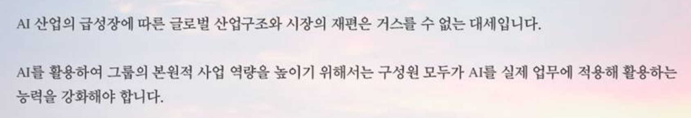
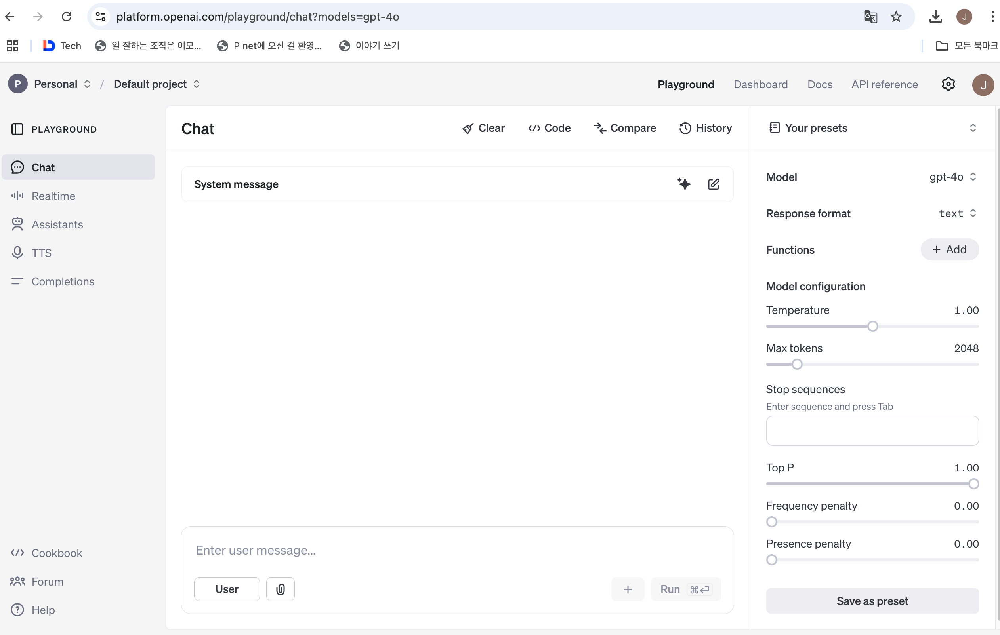
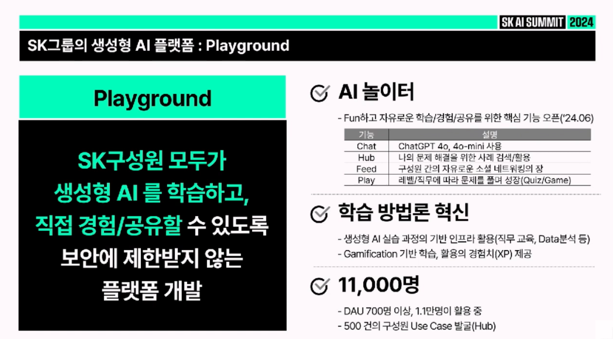
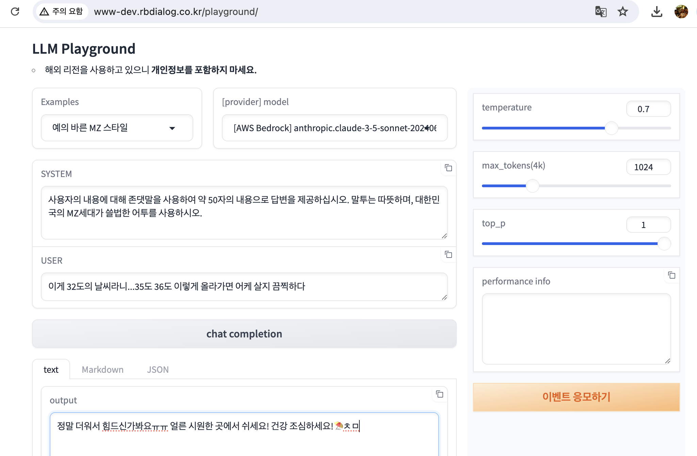
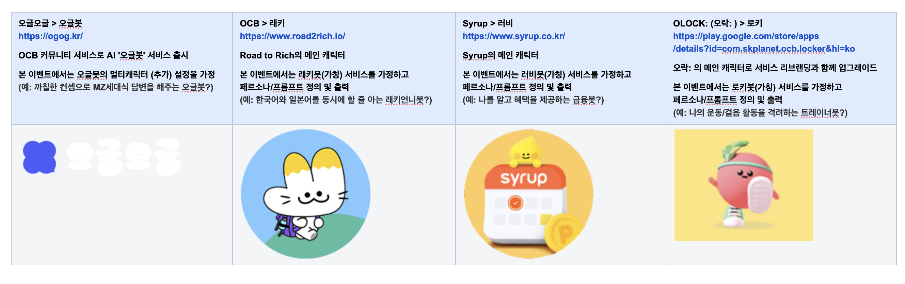
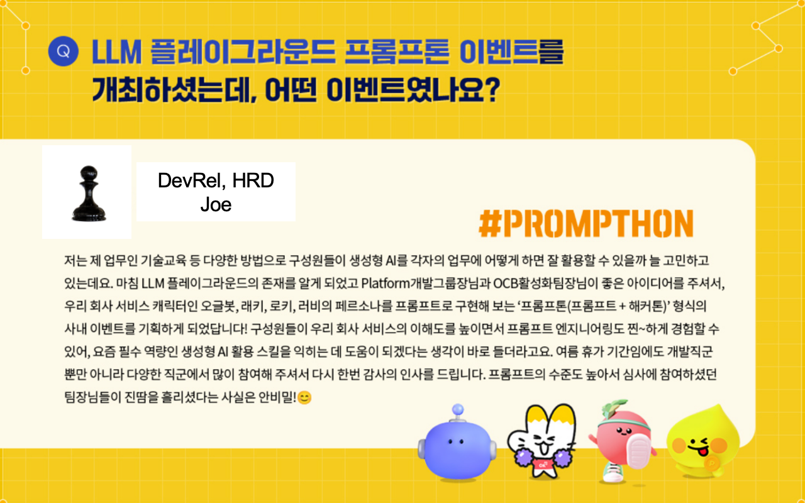
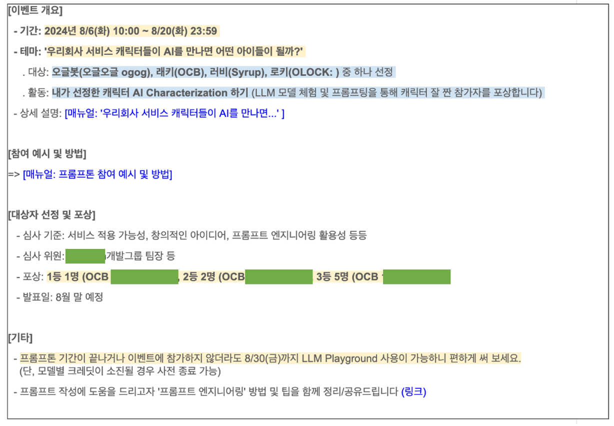
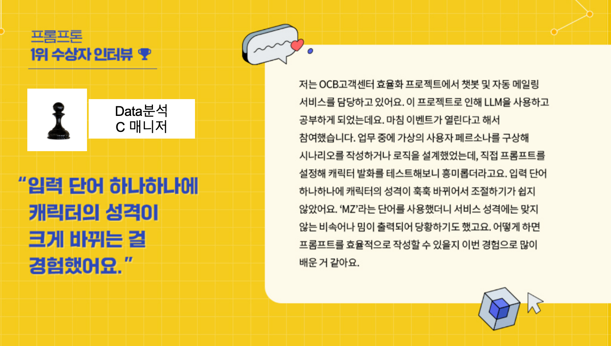
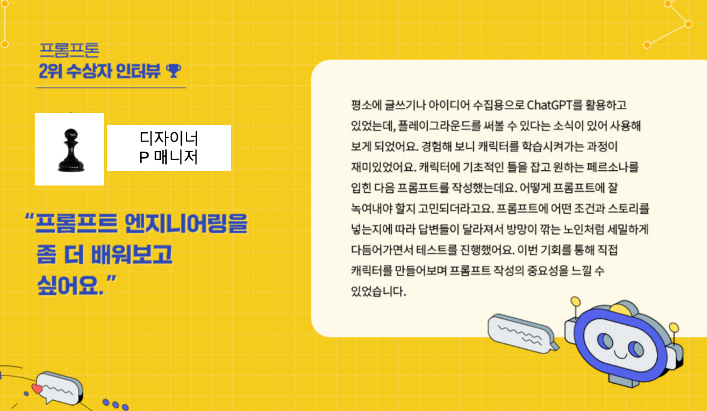
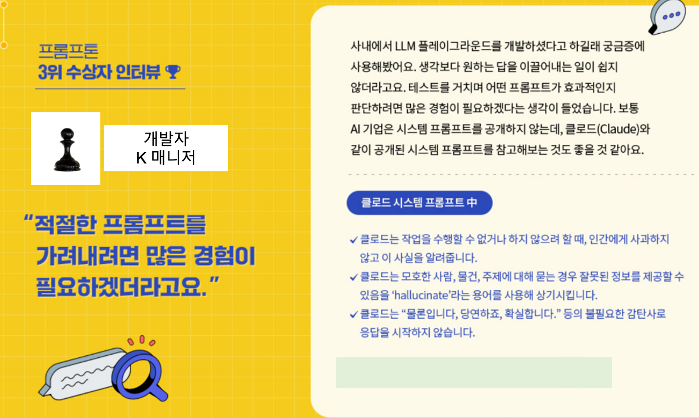

안녕하세요, 판교 SK플래닛 DevRel & 기술교육 담당 Joe입니다 : )
 
ChatGPT가 출시된 이후 계속해서 생성형 AI 기술을 활용한 서비스 개발 고도화뿐만 아니라, 각 기업 내 구성원들의 AI 활용을 높이기 위한 노력 또한 더욱 커지고 있는데요.
따라서 **AI를 잘 활용하기 위한 기업의 환경 조성 및 활용 문화의 확산** 또한 중요해지고 있습니다. 

(2025년 SK그룹 최태원 회장님 신년 메시지 중)
  
SK플래닛에서는 이미 2024년 여름, 사내 구성원들이 다양한 LLM(Large Language Model)을 실제로 체험할 수 있는 **LLM 플레이그라운드**를 사내에 시범 오픈하고,
이를 활용한 **프롬프톤(프롬프트 + 해커톤) 이벤트**를 사내 개발팀과 지원팀의 콜라보레이션으로 진행한 사례를 SK데보션과 Tech Topic을 통해 공유드리오니 참고하시기 바랍니다.
 

### (1) 개발팀: '멀티 LLM Playground'를 사내 오픈하다!
---

#### A. LLM Playground란?  

ChatGPT 기반 서비스에서 활용하는 **LLM Playground** (이하 '플레이그라운드')는 서비스에 적용되는 GPT 모델을 테스트해 볼 수 있는 웹 기반 인터페이스로, http://chatgpt.com/ 의 채팅 인터페이스와 유사한 구성으로 사용자가 익숙하고 편리하게 사용할 수 있습니다. 또한 여러 가지 파라미터 변경 기능을 함께 제공하기 때문에, 사용자는 GPT의 답변 스타일을 직접 바꿔볼 수 있습니다.
 
예를 들어 'Temperature(온도)'라는 파라미터 값을 낮게 설정하면 일반적인 문장의 답변을, 높게 설정하면 무작위성이 증가해 보다 창의적인 답변을 생성하게 되며, 이를 활용해 생성형 AI 기반 서비스의 페르소나를 설계하고 테스트할 수 있습니다.

(OpenAI Playground: https://platform.openai.com/playground/chat?models=gpt-4o )

여러분이 아시는 OpenAI에서 제공하는 Playground 뿐만 아니라, Amazon Bedrock, SKT A.X, 네이버 HyperClovaX 등 LLM을 제공하는 기업 중심으로 플레이그라운드를 제공하고 있습니다(최근에는 각각의 활용 목적에 따라 원티드 LaaS, SK mySUNI의 교육용 Playground 등 다양한 모습의 플레이그라운드가 출시되고 있습니다).

(SK mySUNI의 교육용 Playground: https://www.youtube.com/watch?v=sZ430DLsZA4 )

#### B. Pain Point와 멀티 LLM 플레이그라운드의 시작

그런데 플레이그라운드의 '출시' 뒤에는 실은 개발자 등 실무자 관점에서의 Pain point가 있었는데요,

AI엔지니어 및 개발자가 업무를 위해 LLM 모델을 테스트하기 위해서는 각 LLM 제공 회사의 사이트를 돌아다녀야 하였으며(Context Switching 발생), LLM 모델 별로 비용이나 속도를 비교해 보고 싶은데 그러한 기능을 제공하지 않는 곳도 있어 불편했다고 합니다. 그래서 저희 개발팀에서는 '우리 회사가 자주 사용하는 LLM 모델을 한 곳에서 테스트해 볼 수 있도록 직접 만들어 사용하자!' 는 아이디어를 제안하였고, 이것이 바로 '멀티 LLM Playground'의 시작이었습니다! : )

#### C. 플레이그라운드의 주요 기능

플레이그라운드의 화면 구성은 다음과 같습니다.

* 사내 인트라넷으로 접속 가능 (외부망 불가능)
* 10개 이상의 모델 제공
* 템플릿 예시 제공 (예: 예의바른 MZ 스타일 등)
* System Prompt, User Prompt, Chat Completion, Output
* Parameter: Temperature, Max_tokens, Top_p, Performance info 등
* 이벤트 응모하기 버튼 구현
* 사용자 가이드 제공 등

(플레이그라운드 화면)

플레이그라운드는 다음 LLM 모델을 지원하도록 만들었습니다(현재는 제공하지 않는 모델도 있음).

* OpenAI / GPT-4o 등
* Anthropic / Claude 3.5 Sonnet 등
* Meta / Llama 3
* 네이버 / HyperClova X
* SKT / A.X 등을 지원

원래는 개발팀 등에서 업무 용도로만 사용하고자 해서 UI 등은 크게 신경을 쓰지 않고 빠르게 개발하여 사내에만 사용하고 있었는데 ~~(이름도 '플레이그라운드'...)~~ ,그래도 여러 모델을 한 화면에서 테스트할 수 있어 좋았고, 오른쪽 패널에서 입출력 토큰 비용 및 답변 속도값을 제공하고 있어서 모델별 조건을 바로바로 비교할 수 있었습니다. 
 
 
그러던 중 누군가가, '사내 구성원 전체에게 이 도구를 활용하여 프롬프트 엔지니어링을 경험해 볼 수 있는 기회를 제공하면 어떨까?' 하는 생각을 제안하였고, 마침 담당 임원도 이 아이디어에 동의해 주셨습니다. 따라서 이 도구를 전사에 공개하고 **개발팀과 지원팀 콜라보레이션의 '프롬프톤' 공동 이벤트** 를 진행하게 되었답니다. 

### (2) 지원팀: '프롬프톤' 이벤트를 통해 우리회사 서비스의 캐릭터를 경험케 하다! 
---
#### A. 서비스 캐릭터, 페르소나, 그리고 AI Characterization
SK플래닛에서는 아시는 것처럼 **OK캐쉬백(이하 OCB)** 과 **시럽(이하 Syrup)** 서비스를 운영하고 있는데, 여기에서 사용되는 다양한 귀여운 캐릭터 '판타스틱4' 들이 존재합니다. **오글오글/오글봇** , **래키(OCB)** , **러비(Syrup)** 및 최근 출시된 **OLOCK: (오락: )의 로키** 가 바로 그것이죠(아래 참조).

* 오글오글: https://ogog.kr/
* 래키: https://www.road2rich.io/ (Road 2 Rich)
* 러비: https://syrup.co.kr/
* 로키: https://www.instagram.com/sk.planet.design/p/C-uV8IUyrlr/?img_index=1 등

처음에는 (1)에서 언급한 LLM Playground의 단순 활용 방안을 고민하고 있었는데, 사내 다양한 분들의 이벤트와 캐릭터 활용 아이디어, 그리고 사내에서 공유해 주신 캐릭터 마케팅 관련 글에서 인사이트를 얻어 **"우리 회사 서비스 캐릭터들이 AI를 만나면 어떤 아이들이 될까?"** 라는 테마의 프롬프톤 사내 이벤트가 탄생하게 되었습니다. 요약하자면 Prompt Engineering을 통해, 내가 선택한 캐릭터의 페르소나를 정하는 즉 **'AI Characterization'** 을 진행하는 것이었죠. 

아래는 사내 인터뷰 일부이며, 사진과 이름 등은 익명 처리하였습니다. 

(아래는 프롬프톤 실제 사내공지 일부이며 마스킹한 부분이 있습니다)

#### B. 프롬프톤 수상자 회고

프롬프톤 1~3위 수상자의 회고(소감 인터뷰)를 함께 공유드립니다 ~~(프롬프트는 안보여주고!)~~
 
**사내 데이터 분석가, UX 디자이너, 소프트웨어 엔지니어** 가 골고루 선정되셨는데요! 
이들의 회고를 통해 프롬프톤이 어떻게 진행되었고 어떤 모델과 프롬프트, 생각으로 결과물을 작성하였는지 아이디어와 느낌을 간접 경험해 보시기 바랍니다. 
 
~~(평가 툴도 프롬프트 엔지니어링으로 만들어보기는 했으나 이번 행사는 결국 휴먼 팀장님들이 최종보스...)~~

 

 

### (3) 마무리하며
---
최근 그리고 계속해서 LLM 모델의 성능이 너무나 좋아지면서, 프롬프트 엔지니어링을 강조하던 기조가 조금은(?) 줄어드는 것 같기는 하지만(웬지 수고 대비 효과를 찾는 휴먼의 관점일까요), 오히려 Agentic AI 등이 떠오르고 있는 요즘 Agent에게 정확한 지시를 하기 위해 아직도 **잘 짜여진 프롬프트의 중요성** 은 아직도 그 위상을 지키고 있다고 생각합니다. 
  
또한 이 글에서는 언급하지 않았지만, **'코드 기반 프롬프트'** 도 **'LLM에게 명확한 지시를 내린다'** 는 관점에서 개발 업무, 자동화 코드 생성뿐만 아니라 일반 기획업무 등에서도 유용하게 활용될 수 있을 것으로 기대됩니다 ~~(웬지 다음다음 글이 이 주제 관련 글이 될지도 모르겠다는 생각이...)~~ . 
   
덧1. 본 사내 이벤트는 뤼튼(https://wrtn.io/)의 프롬프톤 행사 사례 등을 참조하였습니다. 국내에서는 거의 최초로 진행이 된 것 같은데 팩트체크가 필요하다면 알려주시기 바랍니다. 
 
(뤼튼 프롬프톤: https://wrtn.io/en/2023/12/19/%EB%AA%A8%EB%91%90%EB%A5%BC-%EC%9C%84%ED%95%9C-ai-%EB%A4%BC%ED%8A%BC-%ED%94%84%EB%A1%AC%ED%94%84%ED%86%A4-%EC%83%9D%EC%84%B1-ai-%EA%B2%BD%EC%A7%84%EB%8C%80%ED%9A%8C/ )

덧2. 이 행사가 끝나고 수 개월 후 '프롬프트 엔지니어의 업무일지'를 쓰신 강수진 박사님의 북토크에 간 적이 있었는데(홍보는 아니나 음...), 이날에서야 강박사님과 진대연 님(세시간전 CSO)이 ex-뤼튼 멤버시절 당시 프롬프톤을 기획하셨던 분들이라는 사실을 알게 되었네요! 기회가 되면 이분들 모시고 또 좋은 기회를 갖고자 합니다. 

덧3. 작년 11월 DTC 인기 연사이셨던 박종천 AI 어드바이저 님께서도 프롬프톤 추천을 해주셨는데 또 한번 해볼까요? : ) 
(참고: http://techtopic.skplanet.com/dtc24-ageofai/)

읽어 주셔서 감사드립니다! 
