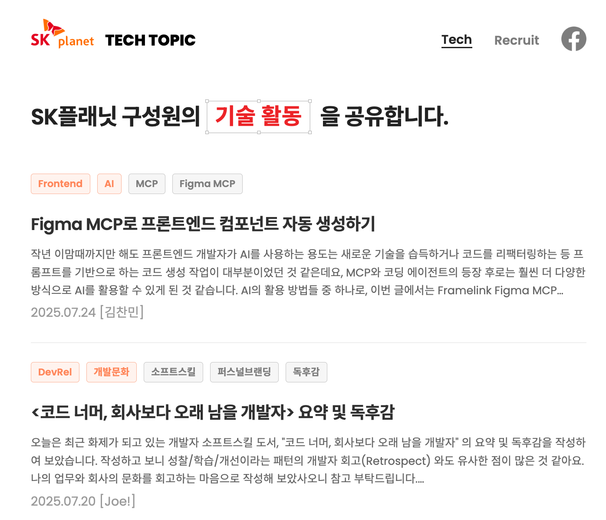
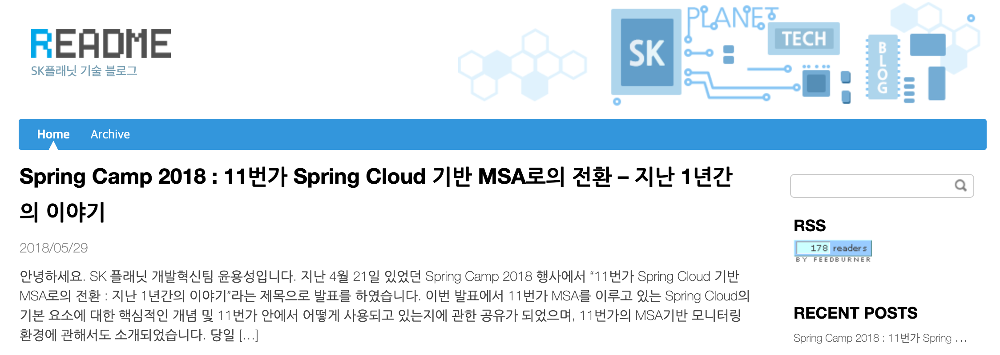

안녕하세요, 테크편집부입니다!  
2023년 1월, SK플래닛의 **기술 블로그**를 새롭게 오픈하였습니다. 

* 이름: **TECH TOPIC**
* 링크: **https://techtopic.skplanet.com/** 
* 한줄설명: "SK플래닛 구성원의 '기술 활동'을 공유합니다."

  
(이미지와 한줄설명은 2025년 7월 버전으로 업데이트하였습니다)

여기서 **'기술 활동'** 은 중의적인 의미를 가지는데요. 

(1) SK플래닛 서비스의 개발 사례 및 경험을 공유하는 **기술(=技術)활동**  
: 코드 구현, 개발 역량, 서비스 운영 경험, 기술 정보 등을 공유하는 활동입니다.

(2) Tech Writing을 통해 퍼스널 브랜딩을 지원하는 **기술(=記述)활동**  
: 기록을 통한 아카이빙, 공유 및 개발자 브랜딩 활동까지 지원하는 개발 문화 활동입니다.

많은 응원과 조언 부탁드리겠습니다. 감사합니다. 
  
(참고) TECH TOPIC 이전에 SK플래닛은 'README 기술 블로그'를 2018년까지 운영하였으며, 현재는 아카이빙되어 있습니다. 관련 내용을 참조하시려면 여기를 참조하세요  
=> [README 블로그 아카이브 접속하기](https://web.archive.org/web/20190116065552/http://readme.skplanet.com/)

  

