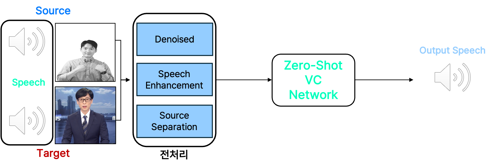
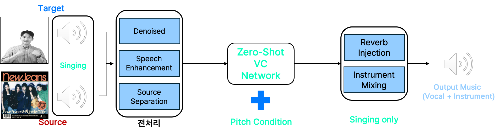
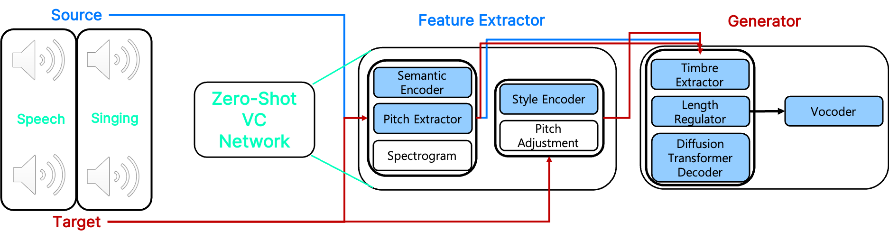
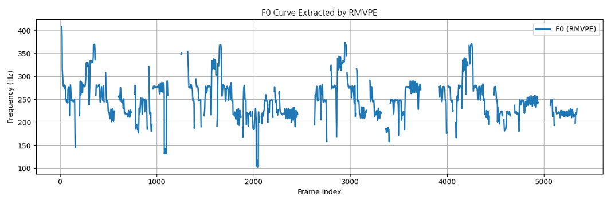
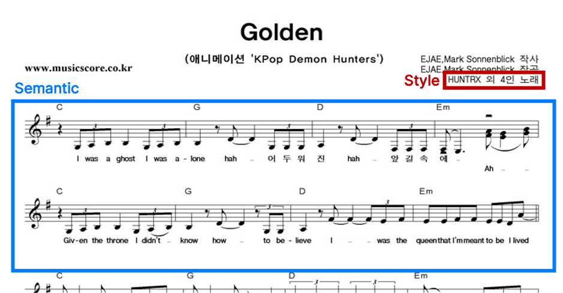
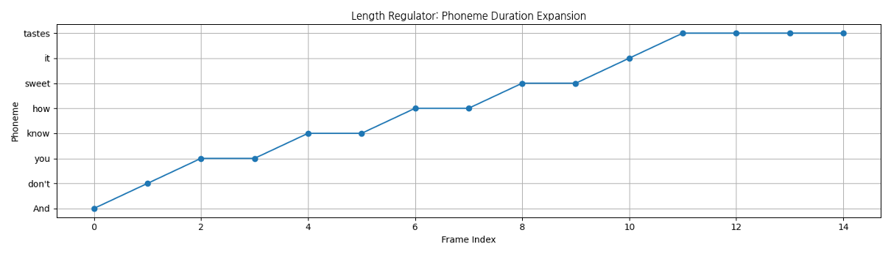
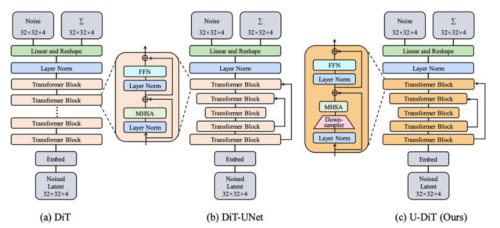
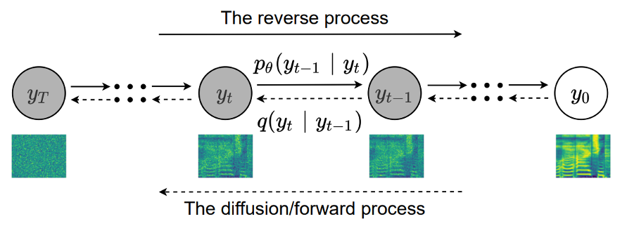
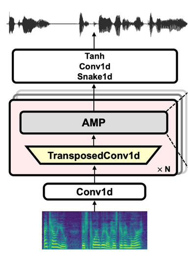
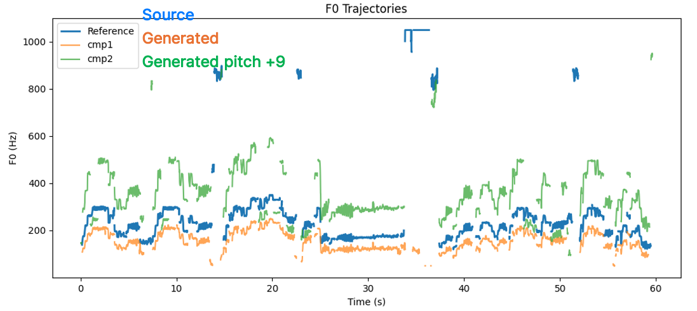

본 글에서는 2025년 11월 4일(화)에 열린 SK AI SUMMIT 2025 행사 둘째날 Special Session에서 당사 김우주 매니저가 발표한 SK플래닛의 **AI를 활용한 Voice Conversion** 기술을 소개합니다.

---

## AI Voice? 

Large Language Model과 Generative Model(Diffusion, flow-based, Generative Adversarial Network)의 발전으로 음성과 노래 생성 성능이 개선되었습니다. 이를 통해 Text2Speech, Speech2Text, Voice conversion과 같은 기술을 활용해 다양한 보이스 서비스를 통해 개인화된 콘텐츠 제작이 가능해졌습니다. 가장 흔히 접해본 Text2Speech는 문자를 음성으로 변환해주는 기술입니다.
#### 예시 AI 생성 음성 🎧
<audio controls>
  <source src="/audio00.wav" type="audio/wav">
  브라우저가 오디오 재생을 지원하지 않습니다.
</audio>

script: _"안녕하세요, 내 목소리가 말하고, 노래한다. AI가 만들어준 나만의 목소리의 발표를 맡게된 SK 플래닛 AI 서비스 개발팀의 김우주라고 합니다."_

다음과 같이 저의 소개 문장을 입력으로 두고 AI에게 읽어 달라고 한 내용인데요. 발음과 리듬, 음색 등이 아직은 '기계음스럽게' 들립니다. 이제 좀 더 사람처럼, 내가 원하는 화자처럼 말하고 노래하게 하려면 **'Speech or Singing Voice Conversion'** 과 같은 기술이 필요합니다.

## Speech Voice Conversion? 

**Reference:** [유재석(naver.com)]

앞서 설명드린 Speech Voice Conversion의 전체 흐름을 간단히 정리하겠습니다. 음성(source, target)을 입력으로 받아 source가 내용과 리듬을 유지하면서 target 화자의 음색과 톤으로 생성하는 기술입니다.

해당 기술은 Text도 입력으로 포함하여 Target Speech Style로 Speech를 생성해주는 TTS with voice conversion과 달리, Source 입력과 Target 입력이 모두 음성입니다. 만약 Text도 입력으로 포함하려면 Text를 따로 처리해주는 Encoder와 Zero-Shot VC Network의 생성기에 condition으로 Text 특징이 들어가야 합니다.

이때 전처리를 통해 목소리가 아닌 잡음을 제거(Denoising), 목소리를 강화하기(Speech Enhancement), 목소리와 Background Music을 분리(Source Separation)하는 작업 등이 필요합니다.

이후 Zero-Shot VC Network의 입력값으로 제공되며, 훈련 데이터에 존재하지 않은 새로운 화자에 대해서도 짧은 5~10초 정도의 음성만으로 변환 및 합성이 가능하도록 추론 시 일반화하여 생성합니다.

이 작업을 통해 Source Speech와 Target Speech를 입력하면 유재석님이 말한 것처럼 Output speech인 "안녕하세요"가 생성됩니다.

<!-- 

  

    Source speech 🎧 
    <audio controls style="width:180px;">
      <source src="./audio_source_speech.wav" type="audio/wav">
      브라우저가 오디오 재생을 지원하지 않습니다.
    </audio>
  

  

    Target speech 🎧 
    <audio controls style="width:180px;">
      <source src="./audio_target_speech.wav" type="audio/wav">
      브라우저가 오디오 재생을 지원하지 않습니다.
    </audio>
  

  

    Output speech 🎧 
    <audio controls style="width:180px;">
      <source src="./output_speech.wav" type="audio/wav">
      브라우저가 오디오 재생을 지원하지 않습니다.
    </audio>
  

 -->

---

## Singing Voice Conversion ? 

앞서 설명드린 Speech Voice Conversion과 전체 구조는 유사하지만, 음성을 입력으로 받아 Target 화자의 음색·톤을 유지하면서 Source 노래의 내용·리듬·멜로디로 생성하는 기술입니다. 추가로 두 가지 새로운 작업이 필요합니다.

Zero-Shot Voice Conversion Network에 새로운 condition으로 pitch를 주입해야 하며, 마지막 단계인 Mixing을 통해 에코와 리버브를 주입하고 보컬과 반주를 합쳐주는 작업이 필요합니다. 이때 내 목소리가 target이 되고 뉴진스의 노래(목소리)가 source가 됩니다. 즉, 내가 부르는 뉴진스 노래가 생성됩니다.

**Reference:** [뉴진스 앨범 커버(NAVER VIBE)](https://vibe.naver.com/track/85487533)

<!-- 

  

    Source singing 🎤 
    <audio controls style="width:180px;">
      <source src="./audio_source_singing.m4a" type="audio/wav">
      브라우저가 오디오 재생을 지원하지 않습니다.
    </audio>
  

  

    Target speech or singing 🎙️ 
    <audio controls style="width:180px;">
      <source src="./audio_target_singing.wav" type="audio/wav">
      브라우저가 오디오 재생을 지원하지 않습니다.
    </audio>
  

  

    Output Music 🎶 
    <audio controls style="width:180px;">
      <source src="./output_music.wav" type="audio/wav">
      브라우저가 오디오 재생을 지원하지 않습니다.
    </audio>
  

 -->

---
## Zero-Shot Voice Conversion (VC) Network ?

앞에서 Speech 또는 Singing Voice Conversion이 대략적으로 어떻게 동작하는지 살펴보았습니다. 이제 세부적으로 어떻게 진행되는지 설명드리겠습니다.
* Feature Extractor
  * 말의 내용 (semantic)과 음의 높낮이(pitch), 화자의 말투와 음색 스타일(timbre, style)을 각각 분리해 특징을 추출해주는 모듈입니다.

* Speech or Singing Generator
  * Feature Extractor에서 생성된 feature를 이용해 말의 내용과 리듬은 그대로 유지하고, 음색만 다른 사람의 목소리로 바꾸는 모듈입니다.
  * **Speech Generator**
    * Source speech와 같이 말하는 사람의 발음을 유지하면서 target speech의 음색으로 자연스럽게 재합성해줍니다.
  * **Singing Generator**
    * Source 보컬처럼 노래를 재구성하고 target의 음색과 감정 표현을 입히는 단계를 통해 합성해줍니다.

음성 분야에서 다양한 목적을 가지고 학습된 모델들을 통해 더욱 정교한 음성을 합성 및 변환하고자 합니다.

---

## Feature Extractor

#### Spectrogram

Mel-Spectrogram

음향 특징에서 가장 기본적으로 사용되는 Mel-Spectrogram은 기존의 Amplitude(진폭) 정보만으로는 표현되지 않는 음성의 주파수적 특성을 푸리에 변환(Fourier Transform) 을 통해 가시화한 스펙트럼입니다. 즉, 각 순간(time frame)마다 어떤 주파수(frequency) 에 어떤 소리(energy) 가 존재하고, 그 높낮이(pitch) 와 세기(amplitude) 가 어느 정도인지를 시각적으로 표현한 것입니다. 이를 통해 우리는 음성 신호의 기본적인 프로소디(Prosody) 즉, 억양(intonation), 피치(pitch), 템포(tempo) 등과 같은 음성의 리듬과 감정적 특성을 추출할 수 있습니다.

**Reference:** [Understanding the Mel Spectrogram - velog.io/@eunjnnn](https://velog.io/@eunjnnn/Understanding-the-Mel-Spectrogram)

---

#### Pitch Extractor & Pitch Adjustment
Pitch Extractor는 음성 신호에서 시간에 따른 기초주파수(F₀, Fundamental Frequency) 변화를 추출하여 음성의 높낮이(pitch) 패턴을 시각적으로 표현하는 과정입니다. 아래 그래프는 시간 프레임(Frame Index)에 따라 피치가 어떻게 변하는지를 보여줍니다.

Figure. F₀ (Fundamental Frequency) curve extracted from a speech signal

📈 그래프 해석

* 세로축 (Frequency [Hz]) : 음성의 높낮이를 의미하며, 값이 높을수록 고음(pitch)이 높습니다.
* 가로축 (Frame Index) : 시간 흐름에 따른 프레임 단위 구간입니다.
* 곡선의 변동 : 말하거나 노래할 때의 억양(intonation), 피치 변동(pitch contour), 감정 표현을 나타냅니다.
* 단절된 부분 : 무성 구간(unvoiced segment)으로, 피치가 존재하지 않는 음소를 의미합니다.

추출된 F₀ 정보는 Source와 Target 음성 간의 평균 피치 차이를 보정하기 위해 사용됩니다. 이를 통해 Target 음성의 톤과 자연스러운 음높이를 유지하면서도 Source의 발화 패턴이나 멜로디를 자연스럽게 반영할 수 있습니다. 결과적으로 이 과정은 톤 매칭(Tone Matching)과 자연스러운 피치 변환(Pitch Normalization)을 가능하게 하여 최종 합성 음성의 일관성과 리얼리즘을 향상시킵니다.

**Reference:** [RMVPE](https://arxiv.org/abs/2306.15412v2)

---

### Semantic Encoder  & Style Encoder  

Semantic Encoder 는 음성 신호에서 **언어적 의미(semantic information)** 만을 추출하는 모듈입니다. 화자의 음색이나 톤은 최대한 배제하고, “**무엇을 말하고 / 어떤 멜로디로 노래하고 있는지**”에 해당하는 **내용(content) 표현**을 인코딩합니다.
Style Encoder  는 그와 반대로, 화자의 **가창 스타일(style)** 을 인코딩합니다. 즉, “**어떤 음색, 톤, 발성, 표현 방식으로 말하고/노래하는지**”에 해당하는 정보를 뽑아냅니다.

#### 악보 비유로 이해하기
<!-- 

Kpop Demon Hunters - Golden 악보 

 -->

음성을 “악보 + 가창 스타일”로 나누어 생각하면 이해가 쉽습니다.

- Semantic Encoder ≈ 악보의 전체 내용 
  - **가사(lyrics)**
    - 무엇을 말하고/노래하는지  
  - **리듬(rhythm)**
    - 말하기·노래하기의 박자감  
  - **멜로디(melody)**
    - 음높이(pitch contour) 흐름  

  - *곡 자체의 구조와 내용에 해당하는 정보입니다.*

- Style Encoder ≈ 가수가 노래하는 방식 
  - **음색(timbre)**
    - 목소리 색깔, 사람마다 고유한 소리  
  - **톤(tone)**
    - 밝게/어둡게, 부드럽게/거칠게 등 톤의 성격  
  - **발성법(vocal technique)**
    - 벨팅, 속삭이듯, 비성, 바이브레이션 등  
  - *같은 곡을 불러도 “이 사람이 부르면 이렇게 들린다”를 결정하는 정보입니다.*

**Reference:** [WHISPER](https://arxiv.org/abs/2212.04356), [CAM++](https://arxiv.org/abs/2303.00332)

---

## Generator

#### Timbre Extractor (cosyvoice, Alibaba)
음성 변환 과정에서 **Source 음색이 Target으로 새어 나가는 문제(timbre leakage)** 를 완화하기 위한 모듈입니다.  
- Source 음성과 대응되는 Target 음색을 추출하기 위해 **timbre shifter**로 사용  
- Target 음색을 제대로 잡지 못하면 “**변환하고자 하는 목소리**”로 제어할 수 없음 → 결과적으로 자연스러운 화자 변환 실패  

**Reference:** [CosyVoice: Compositional Voice Cloning and Speech Editing via Mixed Speech Tokens](https://arxiv.org/abs/2407.05407)

---

#### Length Regulator
**Semantic (내용)** 정보를 **Acoustic (소리) feature**의 길이에 맞춰주는 정렬(alignment) 모듈입니다.  
- 프레임 길이가 서로 다르면 “언제, 어떤 내용을 말해야 하는지” 불일치가 발생  
- 발화 타이밍·템포 오류를 방지하여 **내용(content)** 과 **소리(acoustic)** 의 시간적 일관성을 유지  

Length Regulator aligns phoneme durations to match acoustic frame lengths.

---
#### Diffusion Transformer Decoder (U-DiT)
**Diffusion + Transformer 기반의 U-Net 구조**로, 화자의 **스타일(style)**, **피치(pitch)**, **내용(semantic)** 정보를 결합해   시간적 일관성을 가진 **Mel-Spectrogram**을 생성합니다.

- Transformer 기반 U-Net 구조로, 말/노래의 앞뒤 구간까지 고려하며 **호흡·강약·감정선** 같은 전체 흐름을 모델링  
- **해상도를 점진적으로 줄였다 복원**하면서, **호흡 소리·비브라토·잔향** 등의 미세 질감(temporal detail)을 생성  

Comparison of DiT, DiT-UNet, and U-DiT architectures.

- Diffusion 과정을 통해 노이즈가 섞인 latent vector를 여러 단계에 걸쳐 복원  
  → Style + Content와 유사한 Mel-Spectrogram을 안정적으로 생성  

Diffusion process: forward adds noise, reverse reconstructs Mel-Spectrogram.

**Reference:** [U-DiT: A Diffusion Transformer for High-Fidelity Image and Speech Generation](https://arxiv.org/abs/2405.02730),
[DiffSVC: A Diffusion Probabilistic Model for Singing Voice Conversion]( https://arxiv.org/abs/2105.13871)

---

#### Vocoder (BigVGAN, NVIDIA)
Diffusion Decoder가 생성한 Mel-Spectrogram을 실제로 들을 수 있는 **waveform**으로 변환하는 역할입니다.  
- Mel-Spectrogram의 주파수·시간 정보를 바탕으로 **자연스럽고 고해상도의 오디오 신호**를 복원  
- 생성된 스펙트럼을 **실제 소리로 재생할 수 있게 만드는 단계**  
  → 즉, 모델의 “출력 음성”을 완성시키는 마지막 구성요소

BigVGAN vocoder architecture reconstructing waveform from Mel-Spectrogram.

**Reference:** [BigVGAN: A Universal Neural Vocoder with Large-Scale Training and Efficient Inference](https://arxiv.org/abs/2206.04658)

---

## 평가 지표

두 음성이 **얼마나 같은 화자인 것처럼 들리는지**를 평가하기 위해 다음과 같은 음향적 유사도 지표를 사용합니다. 
해당 내용에서는 언급하진 않았지만 음성 평가 지표인 DNSMOS, 언어적 평가 지표인 Character Error Rate, Word Error Rate를 통해서도 평가를 합니다.

#### Speaker Cosine Similarity
- 두 화자의 **임베딩 간 코사인 유사도(Cosine Similarity)** 를 계산  
- 값이 1에 가까울수록 두 음성의 **화자 특성(timbre, tone)** 이 유사함을 의미  

#### F₀ Correlation & F₀ RMSE
- 추출된 F₀ 곡선을 기반으로, 변환된 음성이 원본과 **얼마나 유사한 피치 궤적을 가지는지**를 측정합니다.  
- **Correlation**은 두 F₀ 곡선의 **타이밍 및 멜로디 형태 유사도**를 나타내며, **RMSE**는 **피치 값의 절대적 차이**를 측정하여 전반적인 음정 편차를 평가합니다.  
- 이 두 지표는 단순히 음정이 맞는지뿐만 아니라, **시간 축에서의 피치 변화 양상**까지 함께 고려하여 음성 변환의 품질을 정량화합니다.

#### F₀ Trajectories: Pitch Shift Comparison

아래 그래프는 Source(파란색), Generated(주황색), 그리고 **+9반음(semitone) 만큼 인위적으로 높인 Generated(초록색)** 의 F₀ 변화를 나타냅니다.  

F₀ trajectories of Source, Generated, and pitch-shifted (+9 semitone) audio samples.

- **Source (파란색):** 원본 화자의 기초 주파수(F₀) 궤적  
- **Generated (주황색):** 목표 음역대에 맞추어 변환된 음성  
- **Generated pitch +9 (초록색):** 동일한 음성을 **+9 semitone 만큼 과도하게 올린 경우**로,  
  모델이 잘못 설정되었을 때 **원본보다 지나치게 높은 음정으로 출력되는 실패 사례**를 의도적으로 보여줍니다.  

이 그래프는 모델의 피치 제어가 올바르게 작동하지 않을 경우, F₀ 곡선이 원본 대비 **과도하게 높게 변형되는 비자연스러운 결과**를 시각적으로 보여줍니다. 즉, 올바른 피치 변환의 경우 `F₀ Correlation`은 **높게**, `F₀ RMSE`는 **낮게** 유지되어야 합니다. 반대로, 피치가 비자연스럽게 변형된 실패 사례에서는 `Correlation`이 떨어지고 `RMSE`가 크게 증가하게 됩니다.

이 그래프를 통해,  
- F₀ 궤적이 Source와 과도하게 벌어질 경우 **멜로디·음역대가 심각하게 틀어졌다는 것**을 시각적으로 확인할 수 있고,  
- 단순히 “피치가 바뀌었다”가 아니라, **얼마나 비자연적인 수준으로 벗어났는지**를 판단할 수 있습니다.  

---

### ⚠️ 한계점 및 대응방안

| 구분 | 한계점 | 설명 | 대응방안 |
|------|---------|-------|-----------|
| **생성 시간 및 GPU 자원** | 실시간 대응 어려움 및 고성능 GPU 의존 | 모델 구조가 Semantic & Style Encoder, Generator, Vocoder로 구성되어 연산량이 큼 | 모델 **경량화 (Quantization, Distillation)** |
| **학습 데이터** | 고품질 음성 및 노래 데이터 부족 + 저작권 문제 | 특정 스타일·감정·장르의 고품질 데이터 확보가 어려움 | **데이터 증강 (Augmentation)** **오픈소스 데이터셋 크롤링·정제** **저작권 협의** |
| **음색 보존 및 다양성** | 변환 후 원 화자의 음색이 흐려짐 / 유사 스타일로 수렴 | VC 이후 음색 왜곡·일관성 저하 / 감정·톤 표현 제한 | **Speaker Embedding 정교화** **Style Extractor 사전 학습 및 Fine-tuning** |

--- 

### Summary
> AI Voice 파이프라인은 Feature Extractor → Generator(U-DiT 기반) → Vocoder(BigVGAN) 으로 구성됩니다.
> Feature Extractor는 음성에서 Spectrogram, Pitch, Semantic 등 핵심 음향 특징을 추출하고, Timbre Extractor가 화자 음색을 정제, Length Regulator가 발화 길이·타이밍을 정렬합니다. 이후 Diffusion Transformer Decoder(U-DiT)가 Style·Pitch·Semantic 정보를 결합해 고품질 Mel-Spectrogram을 생성하고, Vocoder(BigVGAN)가 이를 실제 오디오 waveform으로  복원하여 자연스럽고 현실적인 AI 음성을 완성합니다.
> 모델 평가는 Speaker Similarity(Cosine Similarity) 와 F₀ 기반 Correlation·RMSE 지표를 사용해 음색 일관성(timbre consistency) 과 음정 유사도(pitch similarity) 를 함께 측정하며, 성능 향상을 위해 모델 경량화, 데이터 확충, 음색 정교화 전략이 병행됩니다.

읽어 주셔서 감사드립니다! 

