## 왜 Design System이 필요한가? 개념부터 이해하기

다양한 환경에서 일관된 사용자 경험(UX)을 제공하는 것이 그 어느 때보다 중요해지고 있습니다.
하지만 디자인과 개발이 따로 움직이면, 스타일이 일치하지 않거나, UI/UX의 일관성이 부족해지고, 중복 작업이 늘어나는 등의 문제가 발생할 수 있습니다.이를 해결하는 방법이 바로 **Design System**입니다.

이번 섹션에서는 Design System이 왜 필요한지, 어떤 문제를 해결하는지, 그리고 그 기본 개념은 무엇인지에 대해 살펴보겠습니다.

### 브랜드 일관성을 유지하는 Design System의 역할과 가치

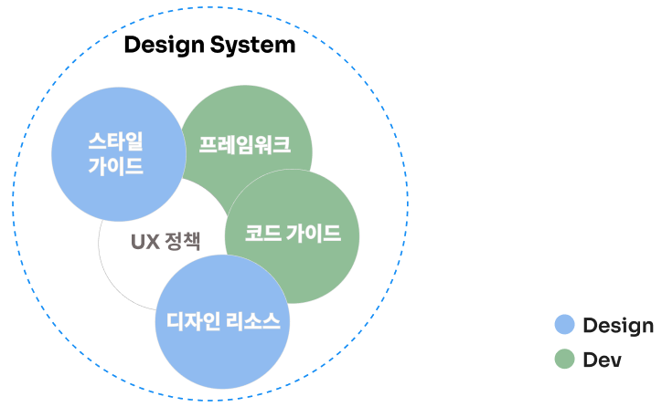

Design System은 스타일 가이드 및 디자인 리소스와 같은 시각적인 요소를 넘어, Product와 개발과정 전반의 일관성과 효율성을 위한 UX 정책(재사용 가능한 디자인 원칙, 구성 요소, 규칙들)을 포함합니다. 
여기에 개발 프레임워크와 코드 가이드도 함께 적용하여 디자인과 개발 협업을 원활하게 하고 같은 목표를 향해 효율적으로 나아갈 수 있도록 돕는 역할을 합니다. 
  
Design System은 LEGO Kits와 유사합니다.  

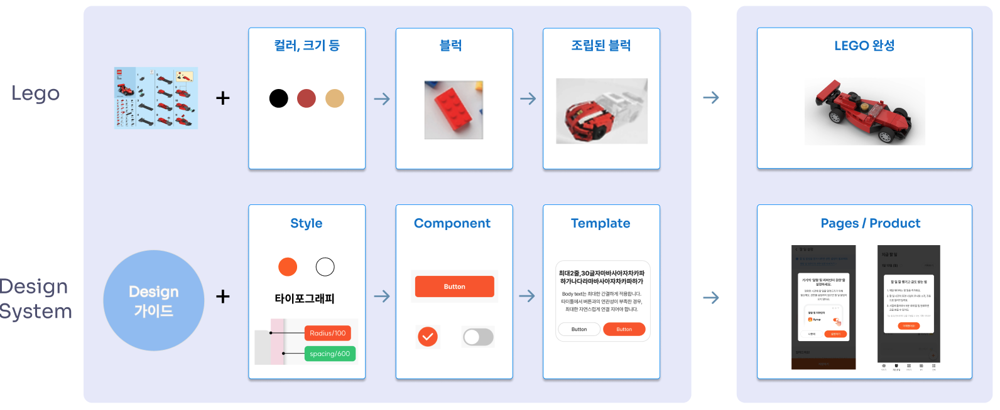

LEGO Kits에는 사용할 블럭들과 조립 설명서가 포합되어 있고, 조립 설명서의 각 단계를 따라가면 누구나 쉽게 레고를 완성할 수 있죠.
Design System도 디자인 가이드에 맞춰 각 요소를 기반으로 여러 UI 컴포넌트를 만든 후에 이를 조합해 Template을 만들 수 있고, LEGO 처럼 새로운 요소를 추가하거나 수정하며 확장할 수 있습니다.  
일관된 스타일과 규칙을 따르기 때문에 최종 개발된 화면이 디자인과 동일하게 완성됩니다.

### 일관성과 생산성을 동시에! Design System 적용 기대 효과

디자인 부서와 개발 부서가 협업할 때 가장 중요한 요소는 일관성과 생산성입니다.
하지만 프로젝트가 커질수록 UI가 제각각 달라지거나, 동일한 컴포넌트를 여러 번 개발하는 비효율이 발생하곤 합니다. 
이러한 문제를 해결하기 위해 많은 기업들이 Design System을 도입하고 있으며, 그 효과는 기대 이상입니다.

* 디자인 일관성 향상: Design System은 Foundation, Component, Template과 같은 표준화된 요소를 포함하여, UI 스타일과 컴포넌트를 체계적으로 관리합니다. 이를 통해 디자인이 일관되게 유지되며, Product 전반에서 균일한 사용자 경험을 제공할 수 있습니다.

* 개발 생산성 극대화: Design System을 도입하면 반복적인 UI 개발 작업이 줄어들고, 컴포넌트 기반 개발이 가능해지면서 전체적인 생산성이 향상됩니다. 특히, Storybook과 같은 도구를 활용하면 UI 컴포넌트를 독립적으로 개발하고 테스트할 수 있어 개발 속도가 빨라집니다.

* 디자이너와 개발자의 원활한 협업: 디자이너와 개발자가 같은 Design System을 기반으로 작업하면, 상호 커뮤니케이션 비용이 줄어들고 협업이 훨씬 쉬워집니다. Figma와 Storybook을 연동하면 디자인에서 개발까지의 흐름이 자연스럽게 이어지며, 디자인 수정 사항이 즉각 반영될 수 있습니다.

* 유지보수 및 확장 용이: Design System은 단순한 UI 라이브러리가 아니라 지속적으로 발전하는 시스템입니다. 새로운 기능이 추가되거나 리브랜딩이 진행될 경우, Design System을 통해 빠르게 대응할 수 있습니다.

Design System을 도입하면 디자인 일관성을 유지하면서도 개발 생산성을 극대화할 수 있습니다. 또한, 디자이너와 개발자 간의 원활한 협업이 가능해지고, 유지보수와 확장성이 뛰어난 체계를 구축할 수 있습니다.   
Design System, 더 효율적인 협업과 개발을 위한 필수 요소라고 할 수 있습니다.

### Design System을 활용한 Product 개발 Process: Hand-off 최적화로 효율성 높이기

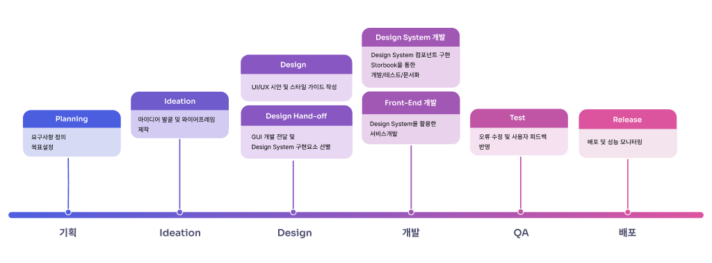

기획부터 디자인, 개발, QA, 배포까지의 전체 Product 개발 프로세스 중에서 Design System의 개발과 적용을 위해서는 디자인과 개발간 프로세스의 **Hand-off** 과정이 아주 중요합니다. Hand-off는 디자이너가 개발자에게 디자인 파일뿐만 아니라 이미지의 크기, 위치, 색상, 폰트 정보 등 다양한 정보를 정리해서 전달하는 것을 말하는데, 디자인 작업이 끝나고 실제 개발이 시작되는 시점에 **Figma**를 통해 Hand-off가 진행됩니다.
  
Figma를 통해서 명확한 디자인 기준과 일관된 가이드를 제공해 주기 때문에, 개발자들이 디자인을 코드로 변환하는 과정에서 속도와 품질을 향상시킬 수 있습니다. 이를 통해 불필요한 커뮤니케이션을 줄이고, 보다 효율적인 개발 프로세스를 구축할 수 있습니다.
  
(SK플래닛은 디자인 Tool로 Figma를 사용하고 있습니다. Figma는 직관적인 인터페이스와 다양한 플러그인 그리고 Dev Mode 등 강력한 협업 기능을 제공하여 디자인과 개발 작업의 효율성을 극대화해 줍니다.)

### 개발자가 UX를, 디자이너가 개발자를 이해해야 하는 이유 

UX 디자이너와 개발자는 같은 목표를 향해 나아가지만, 접근 방식은 다릅니다. 
  
UX 디자이너는 사용자의 경험과 직관적인 인터페이스를 고민하는 반면, 개발자는 기술적인 구현과 성능 최적화를 우선시합니다. 이러한 관점의 차이가 발생하는 이유를 이해하고, 효과적인 협업 방법을 찾는 것이 프로젝트 성공의 핵심입니다.

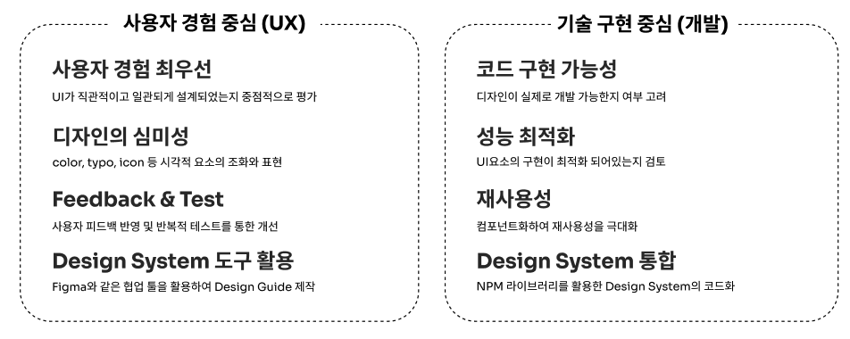

UX 디자이너와 개발자는 각자의 역할이 다르지만, 결국 '사용자에게 더 나은 경험을 제공하는 것' 이라는 공통된 목표를 가지고 있습니다. 관점의 차이를 이해하고 효과적인 협업 방식을 적용한다면, 더 나은 Product를 만들 수 있습니다. 

### UX와 개발, 완벽한 협업이 좋은 Product를 만든다     

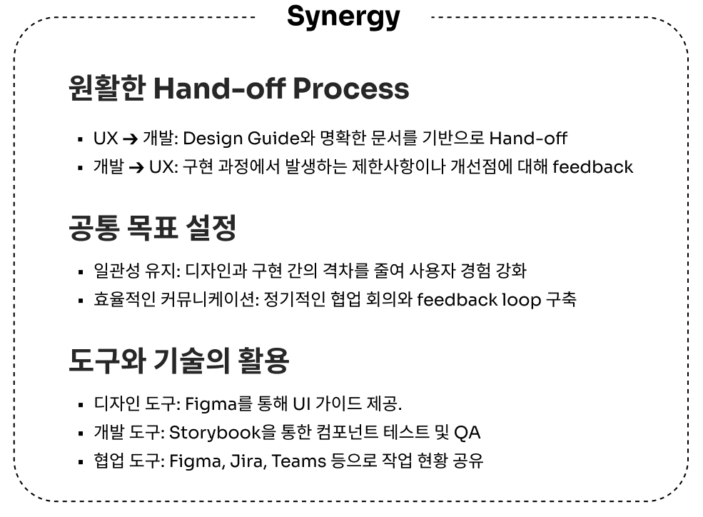

실제로 Syrup의 Design System 구축 과정에서 협업의 중요성이 더 크게 느껴졌습니다. 
 
Syrup의 UX과 개발팀은 지속적인 협의를 통해 원활한 Hand-off Process를 구축하고, 디자인, 개발, 협업을 위한 각각의 도구와 기술을 활용하여 협업 효율성을 점점 높여 갔습니다. 그 결과 일관성 유지로 디자인과 개발간 격차를 줄여 사용자 경험을 강화할 수 있었습니다.
 
또한 서비스 관리가 용이해지고, 품질이 향상 되었으며, 상호 신뢰가 깊어져 큰 시너지를 낼 수 있었습니다.

### 개발자의 시각에서 보는 Design System

Product 개발에서 디자인과 개발 팀의 협업은 성공적인 결과를 위한 필수적인 요소입니다. 그 중에서도 Hand-off는 두 팀 간의 원활한 소통을 가능하게 하는 핵심 과정으로 매우 중요합니다.
개발자는 디자인 파일을 통해 UI 구성 요소와 디자인 스타일을 구현해야 하므로, Design System과 Hand-off 과정이 제대로 이루어지지 않으면 시간 낭비는 물론이고, 오류가 발생할 확률도 높아집니다. 
  
효율적인 Hand-off는 단순히 디자인을 개발 코드로 변환하는 작업 그 이상의 것으로, 디자인과 개발 간의 명확한 소통을 바탕으로, 디자인 의도와 개발 구현이 일치하도록 돕는 중요한 단계입니다. Design System을 기반으로 한 명확한 Hand-off는 개발자가 빠르고 정확하게 작업을 진행할 수 있도록 지원합니다. 이를 통해 디자인과 개발 사이의 차이를 최소화하고, 프로젝트가 일정대로 진행될 수 있도록 보장할 수 있습니다.

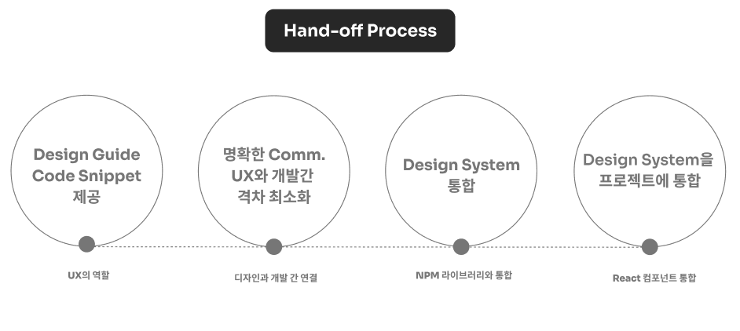

Design System Hand-off는 디자인에서 구현까지 원활하게 이어지도록 체계적인 절차를 따릅니다.
 
UX는 UI 컴포넌트와 스타일 가이드를 문서화해 개발자가 무엇을 구현해야 할지 명확하게 전달합니다. 이후 디자인과 기술 간 차이를 줄이기 위해 지속적으로 소통하고, 개발은 구현된 Design System을 프로젝트에 통합하여 효율적으로 관리할 수 있게 됩니다.

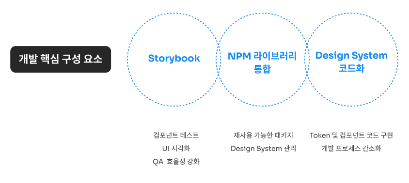

개발자가 Design System을 개발하는 핵심 구성 요소는 다음과 같은 3가지가 있습니다.

* Storybook: UI 컴포넌트를 개발하고, 시각적으로 확인하고 테스트하며 일관성을 유지하도록 도와 줍니다.

* NPM 라이브러리 통합: 구현된 Design System 컴포넌트를 패키징하여 프로젝트에서 재사용할 수 있게 하고, 쉽게 관리할 수 있게 도와줍니다.

* Design System 코드화: 스타일 가이드와 컴포넌트를 실제 개발 코드로 구현하여, Design System 컴포넌트의 재사용성과 유지보수를 쉽게 만들며 개발 프로세스를 간소화합니다.

### UI/UX의 일관성을 보장하기 위한 핵심 요소들

#### Design System의 기반이 되는 Token

개발자에게 Token은 흔히 JWT(JSON Web Token), API 인증, NFT(Non-Fungible Token)와 같은 보안 및 데이터 관리와 관련된 용어로 잘 알려져 있습니다.
  
**Design System에서의 Token**도 이와 유사한 개념입니다. Design System에서의 Token은 색상, 글꼴 크기, 간격 등 UI 스타일을 정의하는 값들을 담고 있는 데이터로서, 시스템 전체에서 일관된 스타일을 유지할 수 있게 도와주는 디자인과 개발의 공통 언어라고 할 수 있습니다. 따라서 UI 스타일과 관련된 데이터를 체계적으로 관리하고, 디자인과 개발 간의 일관성을 유지하는 데 중요한 역할을 합니다.

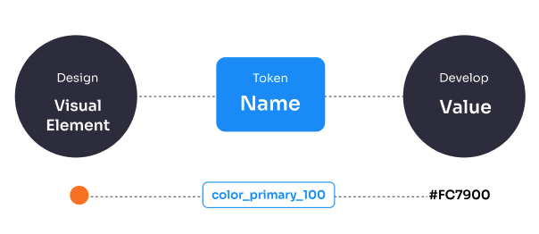

**Syrup의 버튼에 Token을 적용한 사례**를 통해 Token의 활용 방법에 대해 자세히 살펴보겠습니다.

UX에서는 색상, 크기, 폰트, 간격과 같은 시각 요소를 **Token Name**으로 정의합니다. 개발자는 Hand-off로 받은 JSON 형태의 Token 데이터를 코드로 변환하여 사용합니다.
 
적용 사례처럼 Token을 사용하면 스타일 관리가 정말 쉬워지고, 디자인과 개발간 Hand-off 과정에서 발생할 수 있는 Human Error를 최소화하여 UI개발 속도 향상, 커뮤니케이션 비용 감소 등 의미있는 효과를 가져올 수 있습니다. 또한, Token 값의 업데이트만으로도 변동 사항을 빠르게 코드에 반영할 수 있게 됩니다.
  
이렇게 Token을 적용하면 일관성 유지가 쉬워지고, 반복적인 코드 감소로 유지보수가 더 쉬워집니다. 

#### Design System의 구성 요소

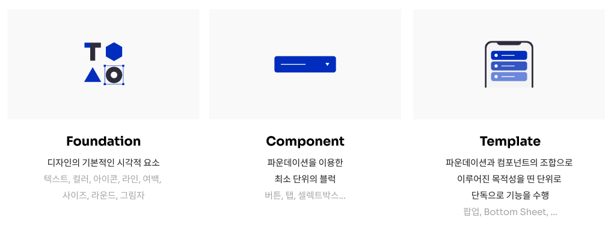

Design System은 **Foundation, Component, Template** 의 세 가지 요소로 구성됩니다.
 
이들은 서로 긴밀하게 연관되어 있으며, Product의 UI/UX를 일관되게 유지하고, 개발과 디자인 조직 간의 협업을 원활하게 만드는 데 중요한 기초가 됩니다.

* **Foundataion** : Design System의 기초가 되는 핵심 요소들로, UI의 기본 스타일과 규칙을 정의합니다. 색상, 타이포그래피, 그리드 시스템 등이 포함되며, Product의 시각적 정체성을 구축하고 디자인의 일관성을 유지하는 데 중요한 역할을 합니다. 특히 디자인 Token은 Foundation의 중요한 부분으로, 색상, 간격, 글꼴 크기와 같은 UI 스타일 속성들을 변수 형태로 저장해두고, 이를 코드와 디자인 전반에서 재사용할 수 있도록 도와줍니다. Token은 디자인과 개발 간의 차이를 좁혀주며, 변경이 필요할 때 한 곳에서 수정하면 시스템 전체에 일관되게 적용할 수 있습니다.

* **Component** : UI의 개별 구성 요소들을 의미합니다. 버튼, 입력 필드, 카드 등의 UI 구성 요소들은 Foundation에서 정의된 스타일을 기반으로 구현되며, 이들을 재사용 가능한 형태로 만들면 개발 과정에서 효율성을 높일 수 있습니다.

* **Template** : 여러 개의 컴포넌트가 결합된 레이아웃을 의미합니다. 이는 페이지나 화면을 구성하는 틀로, Product의 특정 기능이나 콘텐츠의 기본 구조를 제공합니다. Template은 여러 페이지에서 공통적으로 사용될 수 있는 레이아웃을 제공하여, 디자인과 개발의 일관성을 더욱 강화합니다.

### Syrup Design System 도입 전후, 무엇이 달라졌을까요?

Design System은 단순히 일관된 시각적 스타일을 적용하는 것을 넘어, Product 개발 전반에 걸쳐 중요한 변화를 가져옵니다.
 
Syrup에 **Design System을 도입한 전후의 차이**를 살펴보며, 이러한 변화가 팀 간의 협업, 작업 효율성, 서비스 품질에 어떻게 영향을 미쳤는지 비교해보겠습니다.

#### 도입 이전의 모습

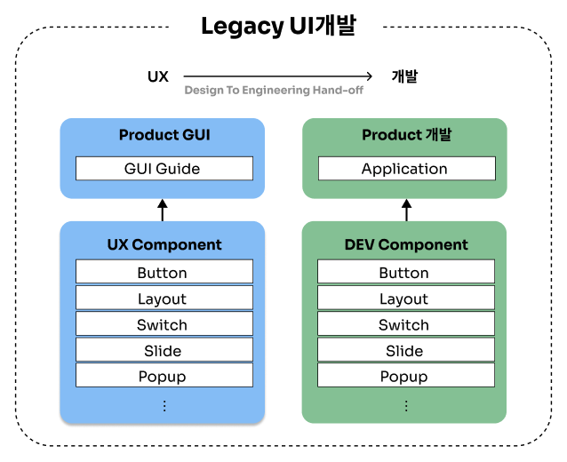

Syrup에 Design System을 도입하기 전에는 **디자인과 개발이 분리**되어 있었다고 볼 수 있습니다. UX는 UX에서 만든 컴포넌트를 기반으로 Product 디자인을 하고, 개발은 그 디자인을 기반으로 개발자 나름의 컴포넌트를 구현하여 Product를 개발했습니다. 
  
이렇게 각자 필요에 따라 컴포넌트를 만들다 보니, 다양한 Variation  및 중복된 디자인과 개발이 발생하며 일관성은 떨어지고, 이는 곧 QA 비용의 증가로 이어져 **리소스 운영 효율성이 저하**되었습니다.

#### 도입 이후의 모습

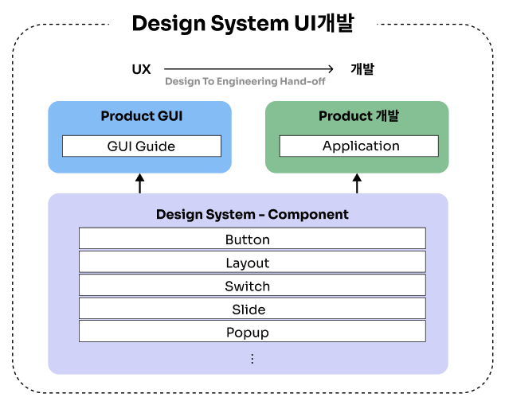

**Design System을 도입**하고 난 이후에는 디자인과 개발까지의 과정이 유기적으로 연결되었습니다. UX와 개발, 두 조직이 서로 합의한 Design System 컴포넌트를 기반으로 디자인과 개발 구현을 하게 되었습니다. 
  
**디자인 가이드와 Storybook**을 통해 구현된 개발 컴포넌트 명세가 서로 일치하면서 **커뮤니케이션 비용이 크게 절감**되었습니다. 또한, 컴포넌트 재사용이 증가하며 **디자인과 개발의 리소스 운영 효율도 개선**되었습니다.

#### 디자인부터 개발까지, 최적의 효율성을 실현한 Syrup Design System

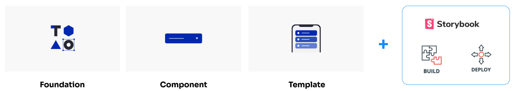

Syrup의 Design System은 Design System의 기본 구성 요소인 Foundation, Component, Template을 포함하고, Storybook을 활용해 UI 컴포넌트 개발과 문서화를 체계적으로 진행했습니다.그리고, 빌드와 배포 프로세스까지 통합하여 더 빠르고 안정적인 개발 환경을 마련했습니다. 즉, 디자인부터 개발까지 전 과정을 유기적으로 연결하며, 체계적인 시스템을 통해 일관된 UI/UX를 제공할 수 있는 환경을 구축했습니다.
  
Syrup은 Design System 적용을 통해 **생산성을 높이고, 유지보수의 편의성을 극대화**할 수 있었습니다.

## 단계별 아키텍처 분석: UX 단계에서 프론트엔드 개발로의 원활한 Hand-off 과정

### Design System 구축의 첫 단계

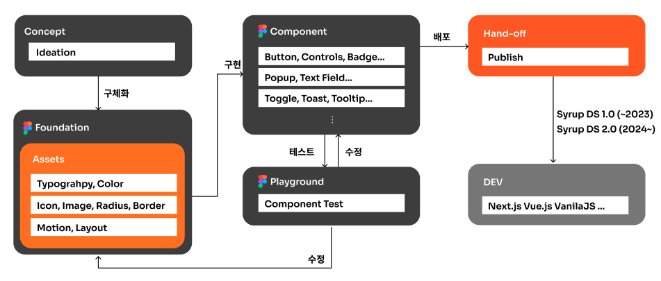

**1. Foundation**

* 타이포그래피, 색상, 레이아웃 등 기본적인 디자인 요소들이 정리됩니다.
* 모든 컴포넌트에 일관되게 적용되어 디자인의 통일성을 제공합니다.

**2. 원자 단위 컴포넌트 생성**

* Foundation을 바탕으로 Button, Popup, Toggle, Badge 등 기본적인 컴포넌트들이 생성됩니다.

**3. Playground에서의 테스트**

* 생성된 컴포넌트는 Playground라는 테스트 도구에서 최적화가 이루어지며, 반복적인 수정 과정을 거쳐 최종적으로 완성됩니다.

**4. Hand-off**

* 최종적으로 완성된 컴포넌트는 디자이너가 개발자에게 Hand-off되며, Design System이 개발로 이어집니다.
* 스페이싱 컴포넌트 : 아래는 Hand-off된 컴포넌트 예시입니다. 

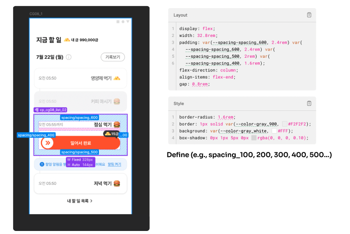 

Hand-off된 컴포넌트 중 하나인 **스페이싱(Spacing) 컴포넌트**입니다. 이 컴포넌트는 간단하지만 중요한 역할을 하는 요소로, 여백을 조절하는 용도로 사용됩니다. 화면의 왼쪽 부분에서는 상하 간격이나 좌우 간격이 어떻게 표현되는지를 시각적으로 확인할 수 있습니다. 
  
오른쪽의 코드 영역은 디자이너가 작성한 명세로, 이 부분에는 컴포넌트의 상세 규격이 포함되어 있습니다.이처럼, Design System에서 컴포넌트를 Hand-off하면 디자인과 개발 간의 명확한 기준을 제공하여, 개발자가 디자인을 정확히 구현할 수 있게 됩니다.

* Hand-off 후 개발 단계 프로세스: 
Design System에서 Hand-off된 컴포넌트는 개발팀에 전달된 후 Adopting 과정을 거쳐 실제 제품에 적용됩니다. 그러나, 개발 단계에서 바로 이를 사용하는 것이 쉽지 않은 경우가 많습니다. 또한, 개발 프레임워크와 언어적 환경이 각기 다르기 때문에, 디자인 명세가 바로 적용되지 않는 경우가 발생합니다. 
  
따라서, Hand-off 이후의 프로세스에서 명확한 프로토콜이 필요하게 됩니다. 이를 해결하기 위해, Hand-off된 컴포넌트를 개발 컴포넌트로 변환하는 시스템을 구축하고, 이를 통해 일관성을 유지할 수 있도록 개발 단계를 구체화했습니다. 

### Design System Hand-off 이후 개발 아키텍처 구축

Hand-off 이후의 일관성을 유지하기 위해, 개발 단계에서는 체계적인 아키텍처가 필요합니다.

먼저, **파운데이션**은 **디자인 Token** 형태로 변환되어야 합니다. 이 변환 과정에서 디자인과 개발이 동일한 일관성 보장을 위해 검증된 플러그인을 활용합니다. 변환된 컴포넌트는 패키징과 배포 과정을 거쳐 사내 NEXUS에 NPM 라이브러리 형태로 저장하며, 이를 통해 사내의 Front-End 개발자는 언제든지 Design System에서 컴포넌트를 손쉽게 가져와 사용할 수 있습니다.
  
또한, 개발 컴포넌트 영역에서는 **Storybook**이라는 문서화된 명세를 제공함으로써, 개발자는 컴포넌트의 속성을 실시간으로 변경하고 그 변화를 시뮬레이션할 수 있습니다. 이와 같이 NPM과 Storybook을 제공하여 개발자들이 Design System을 효율적으로 채택하고 적용할 수 있도록 도와 줍니다.

##### NPM Publishing

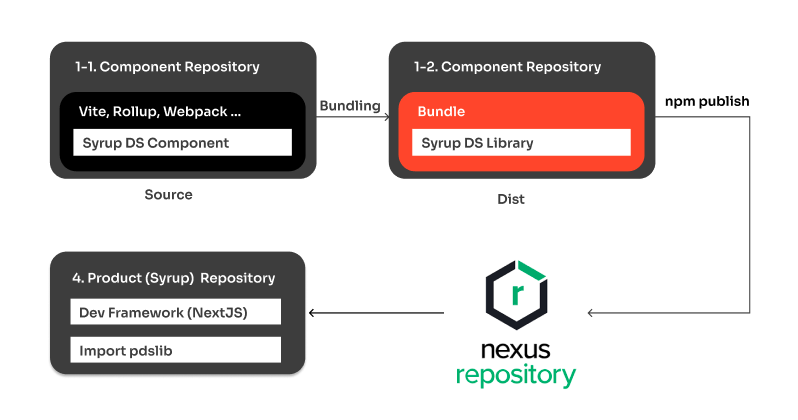

Design System에서 작성된 컴포넌트는 번들링을 통해 필요한 파일과 의존성을 하나로 묶어 Dist라는 결과물로 저장됩니다. 이후 이 번들링된 결과물은 사내 NEXUS 저장소에 NPM 라이브러리 형태로 배포됩니다. 이를 통해 사내 어디에서든 표준화된 방식으로 컴포넌트를 공유하고 활용할 수 있습니다. 이 과정에서 중요한 점은 Storybook을 활용하여 협업을 원활하게 만드는 것입니다. 
  
Storybook은 각 컴포넌트의 사용법과 속성을 문서화하여, 개발자들이 실시간으로 컴포넌트를 어떻게 적용할 수 있을지 시뮬레이션할 수 있도록 도와 줍니다. 이를 통해 팀 간의 명확한 기준과 일관성 있는 사용법을 공유할 수 있어 효율적인 협업이 이루어집니다. 결국, NEXUS와 Storybook을 활용하면 Design System의 컴포넌트를 손쉽게 관리하고 효율적으로 활용할 수 있으며, 팀 간 협업을 강화하는 데 중요한 역할을 합니다.

##### Storybook 활용하기

(1) Storybook을 통해 **UX 팀과 FE 개발 팀은 보다 효율적으로 협업**할 수 있으며, 결과적으로 더 나은 사용자 경험을 제공할 수 있습니다.
Storybook은 UI 컴포넌트를 독립적으로 개발하고 테스트할 수 있는 도구입니다. 이 도구는 다음과 같은 기본 개념과 기능을 가지고 있습니다. 

* **독립적 개발 환경** : Storybook은 UI 컴포넌트를 독립적으로 실행하고, 실제 애플리케이션과는 별도로 개발할 수 있는 환경을 제공합니다. 이를 통해 개발자들은 애플리케이션의 다른 부분과 상관없이 UI 컴포넌트를 만들고 테스트할 수 있습니다.

* **문서화** : Storybook을 사용하면 자동으로 컴포넌트의 사용 방법과 다양한 상태를 문서화할 수 있습니다. 이는 새로운 팀원들이 빠르게 컴포넌트를 이해하고 사용할 수 있게 합니다.

(2) 또한 Storybook은 **UX 팀이 QA 작업을 보다 효율적으로 수행**할 수 있도록 도와줍니다. UX 팀이 Storybook을 통해 QA할 수 있는 방법은 다음과 같습니다:

* **다양한 상태 테스트** : Storybook에서 제공하는 스토리를 통해 컴포넌트의 다양한 상태를 쉽게 테스트할 수 있습니다. 이를 통해 사용자가 실제로 접하게 될 다양한 상황을 미리 확인하고, 문제가 발생할 가능성을 줄일 수 있습니다.

* **스토리 작성** : 각 컴포넌트의 다양한 상태와 변형을 스토리로 작성합니다. 예를 들어, 버튼 컴포넌트는 기본 상태, 마우스 오버 상태, 클릭된 상태 등의 스토리를 가질 수 있습니다.

* **상태 관리 도구 사용** : Storybook의 상태 관리 도구를 활용하여 컴포넌트의 다양한 상태를 시뮬레이션하고 확인할 수 있습니다. 이를 통해 사용자가 실제로 접하게 될 다양한 상황을 미리 확인할 수 있습니다.

* **상호작용 테스트** : Storybook의 상호작용 테스트 기능을 활용하여 컴포넌트가 사용자의 상호작용에 따라 올바르게 작동하는지 확인할 수 있습니다. 예를 들어, 폼 컴포넌트는 사용자가 입력한 데이터를 올바르게 처리하는지 테스트할 수 있습니다.

* **디자인 일관성 확인** : Storybook을 통해 컴포넌트의 디자인이 일관되게 적용되었는지 확인할 수 있습니다. 이는 전체 애플리케이션의 디자인 품질을 높이는 데 도움이 됩니다.

* **실시간 피드백**: Storybook의 핫 리로딩 기능을 활용하여 변경 사항을 실시간으로 확인할 수 있습니다. 이는 UX 팀이 빠르게 피드백을 제공하고, 개발자들이 이를 반영할 수 있도록 도와줍니다.

* **접근성 검사**: Storybook의 애드온을 활용하여 컴포넌트의 접근성을 자동으로 검사할 수 있습니다. 이를 통해 접근성 문제가 발생하기 전에 미리 확인하고 수정할 수 있습니다. 

(3) 마지막으로 Storybook은 UX 팀과 프론트엔드(FE) 개발팀간의 상호 협업을 촉진하는 데 매우 유용합니다. 
 
다음은 **협업을 촉진**하는 몇 가지 사례입니다. 

* **디자인 리뷰**: UX 팀이 Storybook에서 컴포넌트를 미리 확인하고, 디자인 피드백을 제공할 수 있습니다. 이를 통해 개발 단계에서 디자인 오류를 조기에 발견하고 수정할 수 있습니다.

* **문서화와 공유**: Storybook을 통해 컴포넌트의 사용 방법과 다양한 상태를 문서화하고, 이를 팀 전체와 공유할 수 있습니다. 이는 팀원들이 컴포넌트를 쉽게 이해하고 사용할 수 있도록 도와줍니다.

* **공동 작업 환경**: Storybook은 UX 팀과 개발 팀이 동일한 작업 환경에서 협업할 수 있도록 도와줍니다. 이를 통해 두 팀 간의 소통이 원활해지고, 작업 효율이 높아집니다.

* **실시간 피드백**: UX 팀이 Storybook을 통해 실시간으로 컴포넌트의 변경 사항을 확인하고, 개발 팀에 피드백을 제공할 수 있습니다. 이는 빠른 문제 해결과 품질 향상에 도움이 됩니다.

### 핵심 아키텍처와 Hand-off 전략

#### Lego 공장과 조립 킷

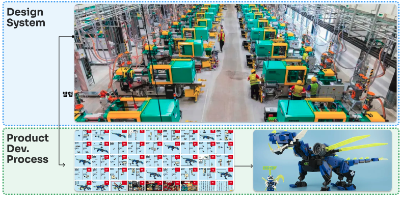

이제 이 모든 과정을 비유적으로 설명해 보겠습니다.
  
Design System은 마치 **레고 공장에서 레고 킷을 만드는 과정**과 같습니다. 여기서 레고 킷은 다양한 컴포넌트들로 구성되며, 이 킷이 제품 단계로 넘어가면 설계도가 만들어집니다. 마지막으로, 개발 단계에서는 이 설계도를 참고해 실제 제품이 완성됩니다.
  
이처럼 Design System은 제품 개발의 각 단계를 자연스럽게 연결하며, 레고 킷처럼 필요한 요소들을 조합하고 구성하는 과정이라고 할 수 있습니다.
쉽게 설명하기 위해 레고를 비유로 들었지만, 이 흐름은 실제 Design System의 중요한 핵심을 잘 보여줍니다.

#### Design System과 제품 개발의 흐름: 일관성 유지와 독립적인 확장

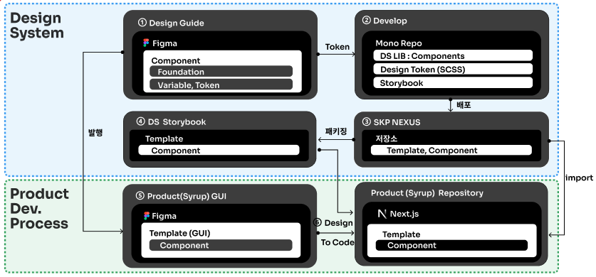 

##### (1) Design System 영역

Design System과 제품 개발의 과정은 본질적으로 서로 연결되어 있지만, 그 구체적인 흐름을 살펴보면 복잡해 보일 수 있습니다. 그럼에도 불구하고, 각 단계에서의 역할과 관계를 명확하게 정리하면 흐름을 이해하는 데 도움이 됩니다.

* **디자인에서 생성한 컴포넌트 Hand-off**: 첫 번째 단계에서는 디자인 팀이 생성한 컴포넌트를 개발팀에 전달합니다. 이 컴포넌트는 Design System의 핵심으로, UI/UX 디자인의 일관성과 재사용 가능성을 확보하는 데 중요한 역할을 합니다.

* **컴포넌트 개발시스템에서 Adopting 및 변환**: Design System에서 전달된 컴포넌트는 개발 환경에 맞게 Adopting되고, 이를 변환하여 실제 개발에 사용할 수 있도록 준비됩니다. 이 과정에서 개발팀은 각 환경에 맞는 최적화를 거쳐 코드를 생성합니다.

* **사내 저장소에 업로드**: 변환된 컴포넌트는 NEXUS와 같은 사내 저장소에 업로드되어, 사내에서 사용될 수 있도록 저장됩니다. 이를 통해 개발자들은 언제든지 Design System의 컴포넌트를 손쉽게 사용할 수 있습니다.

* **패키징된 결과로 표준화된 문서 제공**: 모든 컴포넌트는 패키징 되어 표준화된 문서와 함께 제공됩니다. 이 문서는 개발자들이 컴포넌트를 사용할 때 필요한 명세와 속성을 포함하고 있어, 실시간으로 속성 기반 시뮬레이션을 통해 쉽게 적용할 수 있습니다.

##### (2) 제품 영역

* **제품 GUI 생성**: 제품 영역에서는 Design System에서 생성된 컴포넌트를 활용하여 GUI를 구성합니다. 이 단계에서는 디자인팀이 제공한 명세와 컴포넌트를 바탕으로 실제 제품 화면이 만들어집니다.

* **개발에서 구현**: 마지막 단계인 개발에서는 위에서 생성된 GUI를 구현하여 최종 제품을 완성합니다. 이때, Design System에서 제공된 컴포넌트와 코드가 실시간으로 반영됩니다.

* **제품 단계에서의 Design To Code 미리보기**: 결과적으로, Design System이 도입된 시스템에서는 제품 구현 단계에서 GUI를 참조하여 컴포넌트를 구성하는 과정을 통해 효율적인 프로세스가 수행됩니다. 이 과정은 일관성 있는 디자인과 코드의 통합을 촉진하며, 개발자와 디자이너 간의 협업을 원활하게 만들어 제품 개발의 속도와 품질을 동시에 향상시키는 중요한 역할을 합니다.

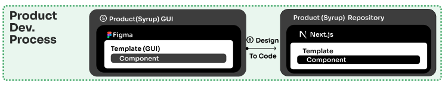

Design System에서 생성된 컴포넌트들을 활용하여 GUI 작성자가 화면을 구성합니다.
일반적으로 이 역할은 기획자가 담당하는 경우가 많습니다.

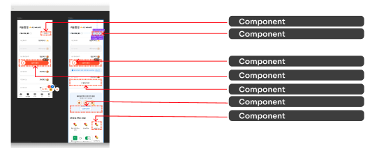

완성된 GUI 화면은 개별 컴포넌트들로 이루어져 있는데, 이 컴포넌트들은 **Design to Code 기능을 제공**하며 개발자는 이를 그대로 참조해 결과물을 바로 만들어낼 수 있습니다. 즉, Design System을 활용하면 일관된 UI를 빠르게 구현할 수 있으며, 디자인과 개발이 원활하게 협업할 수 있습니다. 
 

##### (3) 중요한 점 

Design System의 가장 중요한 특징은 **일관성 유지**입니다. 처음 디자인 단계에서 생성된 컴포넌트는 제품 단계까지 일관되게 연결되어 제품 구현에 반영됩니다. 이 모든 과정은 Design System이 독립적으로 확장되고 버전업이 가능하도록 만들어져 있기 때문에, 제품에 영향을 주지 않고 Design System을 업데이트할 수 있습니다.

### 아키텍처 도입에 따른 기대효과 

#### (1) 정성적 효과

* **일관성 있는 사용자 경험 제공**: Design System을 사용하면 모든 UI 컴포넌트와 디자인 요소가 일관되게 유지됩니다. 이는 사용자가 애플리케이션을 사용하는 과정에서 일관된 느낌을 받고, 학습 곡선을 줄이는 데 기여합니다.

* **디자인 및 개발 시간 단축**: Design System을 통해 재사용 가능한 컴포넌트와 패턴을 사용하면, 개발자는 새로운 기능을 빠르게 구현할 수 있고, 디자이너는 일관된 디자인을 더 쉽게 유지할 수 있습니다. 이는 프로젝트의 전반적인 시간 절감에 기여합니다. 

* **개발자와 디자이너 간의 원활한 협업**: Design System은 공통된 언어와 도구를 제공하여 개발자와 디자이너 간의 소통을 원활하게 합니다. 이는 오해와 충돌을 줄이며, 팀 전반의 협업 효율성을 높입니다.

* **디자인의 일관성 유지**: 프로젝트의 규모가 커지고 시간이 지남에 따라, Design System을 사용하여 일관성 있는 디자인을 유지하는 것이 중요합니다. 이는 사용자 경험의 품질을 일관되게 유지하고, 브랜드 이미지를 강화하는 데 기여합니다.

#### (2) 정량적 효과

* **QA 테스트 및 피드백**: Design System을 적용한 후, 사용자들에게 직접적인 테스트와 피드백을 받는 것이 중요합니다. 사용자들이 개선된 일관성을 어떻게 인식하고 있는지를 측정할 수 있습니다. 예를 들어, 사용자의 작업 효율성, 만족도, 오류 발생률 등을 비교 분석할 수 있습니다.

* **개발 속도 측정**: Design System을 도입한 후 프로젝트의 개발 속도를 측정할 수 있습니다. 이전 프로젝트와 비교하여 새로운 기능을 구현하는 데 걸리는 시간이 줄어든 정도를 평가할 수 있습니다.

* **재사용 비율 측정(FE 개발자)** : Design System에서 제공하는 재사용 가능한 컴포넌트와 패턴의 사용 빈도를 측정할 수 있습니다. 이는 개발자들이 얼마나 많은 시간을 재사용 가능한 자산을 활용하는 데에 투자했는지를 알 수 있습니다.

* **오류율 감소(QA)** : Design System 도입 후의 버그 및 오류 발생률을 이전과 비교하여 정량적으로 평가할 수 있습니다. 일관된 디자인과 개발 접근법을 통해 오류 발생 가능성이 줄어드는지를 측정할 수 있습니다.

* **Syrup 컴포넌트 Design System 전환율**: 2024년 앱 개편에서 196개 컴포넌트 중 67개에 Design System이 적용되어 **전체 적용률은 약 34퍼센트**입니다.

Syrup 개편 시 주요 기능별 UX QA 자료는 다음과 같습니다(기능별 소요기간 등). 
* 모으기: 12일
* 불리기: 16일
* MY: 15일
* 평균 소요기간 = (12 + 16 + 15) / 3 = 14.33일

#### (3) 결론

총 68건 중 Design System이 있었다면 발생하지 않았을 31건은 전체의 약 45.59퍼센트를 차지합니다. 이를 바탕으로, 평균 리드 타임(Lead Time)인 14.33일에 이 비율을 적용하면, 6.53일 정도의 시간이 절감될 수 있음을 의미합니다. 
  
따라서, Design System을 도입하면 전체 리드 타임의 약 **45.59퍼센트**를 줄일 수 있으며, 이를 통해 **평균 약 6.53일의 처리시간 감소 효과**를 보여 줍니다. 

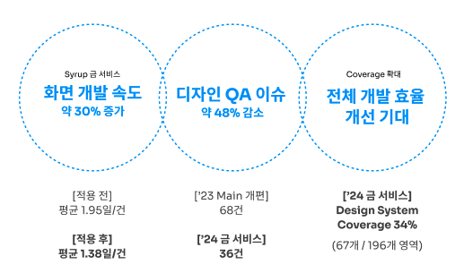

## Design System 구현편

이번 섹션에서는 Syrup 에 적용된 Design System이 어떠한 방식으로 개발되었는지를 설명합니다. 먼저, Design System은 UX 디자이너들이 사용하는 툴인, Figma 에 정의되어 있습니다.   
Figma에는 

1. 디자인 요소
2. 디자인 컴포넌트

들이 구현되어 있는데, 디자인 요소는 개발자들이 사용하는 상수(Constant) 와 유사한 개념으로, 한번 정의되면 Design System 프로젝트 전역에서 재사용 가능합니다. 
 
Syrup Design System에서는 색상, 폰트, 간격, 둥글기 등을 정의하고 있습니다. 

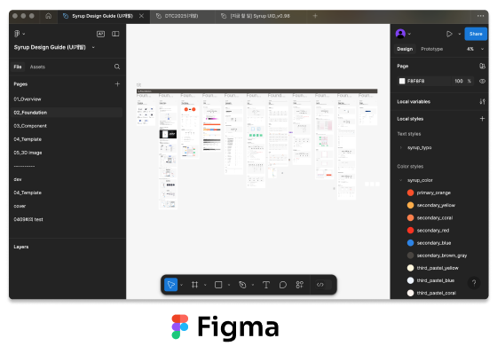

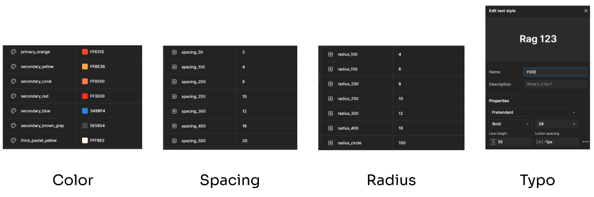

이렇게 생성된 디자인 요소로 디자이너들은 **디자인 컴포넌트**를 만듭니다.
 
디자인 컴포넌트는 개발자들이 사용하는 **클래스**와 유사한 개념으로, 각 컴포넌트들의 용도에 따라 지정할 수 있으며 다양한 종류를 포함합니다. 

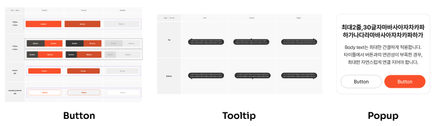

Syrup Design System에서는 버튼, 툴팁, 팝업 등과 같은 요소들이 정의되어 있으며, 이번 예시에서는 버튼을 어떤 방식으로 구현하였는지 설명드리겠습니다.
  
이렇게 만들어진 Design System은 Figma 의 여러 프로젝트에서 참조하여 사용되며, 이것은 개발자들이 사용하는 **Library**와 유사한 개념입니다. Design System에 수정사항이 있을 경우 디자이너들은 Figma를 통해 변경사항을 publishing하게 되며, 이 변경사항은 하위 프로젝트에 자동으로 적용됩니다.

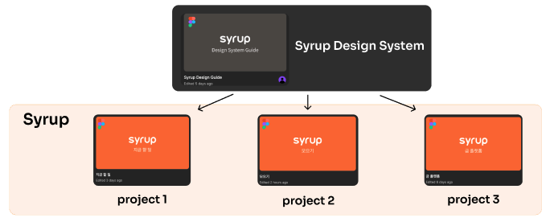 

Design System을 개발하는 프론트엔드 개발자는 위와같이 정의된 Figma 의 디자인 요소, 디자인 컴포넌트들을 **Code**로 구현합니다(참고로 Syrup 프론트엔드는 React로 개발한 프로젝트입니다). 디자인 요소는 JSON 및 SASS(Syntactically Awesome Stylesheets) 의 형태로 구현하였고, 디자인 컴포넌트들은 JSX(JavaScript XML) 컴포넌트로 구현하여 해당 프로젝트에서 사용하고 있습니다.
  
먼저 디자인 요소를 코드에서 사용하기 위해 일정한 포맷으로 추출하는 2가지 방법이 있습니다.

##### (1) Figma REST API

* 해당 기능은 Figma에서 공식적으로 지원하는 REST API입니다. 디자이너가 작업하는 Figma 프로젝트에서 Access Token 을 발급받고, REST API 호출을 하면 raw한 JSON의 형태로 응답값을 줍니다.

* 이렇게 받은 응답값에서 필요한 부분을 파싱하여 사용할 수 있습니다. 

##### (2) Figma Plugins

* Figma 사용자가 필요한 기능을 직접 구현하여 마켓에 등록하는, Chrome Extensions와 유사합니다. 사용 방법이 매우 간단하며, 디자인 요소의 값들을 JSON, SASS 파일로 바로 추출하여 프로젝트에 적용 가능합니다. 

* 당사에서도 위 장점을 고려하여 프로젝트에 활용 중입니다(추후 Figma REST API 에 대한 제약이 완화되었을 때를 대비하여 마이그레이션을 별도 준비중입니다). 

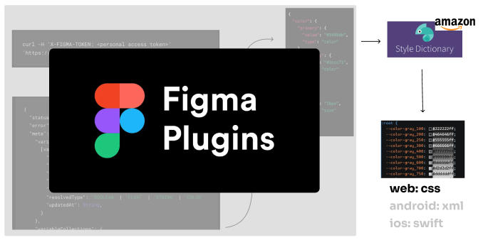 

Syrup Design System에서는 Figma Plugins 로 JSON 형태의 값을 추출한 뒤에, Style Dictionary 라이브러리를 사용하여 해당 값을 CSS Variable 으로 추출하고 있습니다.

다음으로는 위와 같이 추출된 다자인 요소들로 컴포넌트를 만들어야 합니다. 
 
예시로 버튼을 통하여 설명드리겠습니다.

Figma에는 실제 Product 디자인을 위해 사용하는 여러 종류의 버튼들이 하나의 'Button' 디자인 컴포넌트로 지정되어 있습니다. 디자이너들이 사용하는 이 컴포넌트들은 '개발단에서 구현이 쉽도록'이라는 요소를 고려해야 하며, 따라서 저희는 디자이너들과 소통하며 시행착오를 거친 후 가장 최적화된 프로퍼티들을 추출, 값을 정리하였습니다.

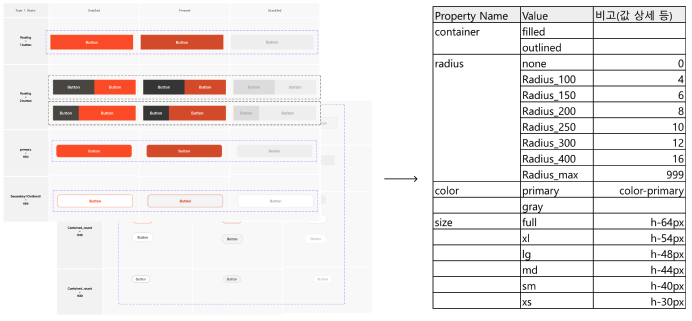 

이렇게 정리된 버튼의 프로퍼티들은 개발에서 사용하는 언어에 따라 타입시스템에 추가되고, React JSX 컴포넌트로 개발됩니다.

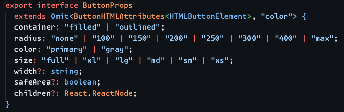 

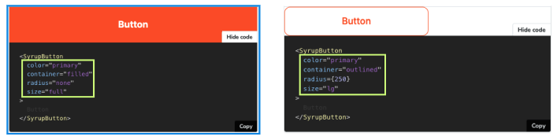 

이렇게 개발된 컴포넌트들은 IDE 의 타입 추론 기능의 도움을 받아, UI 개발시 편하게 사용할 수 있습니다.

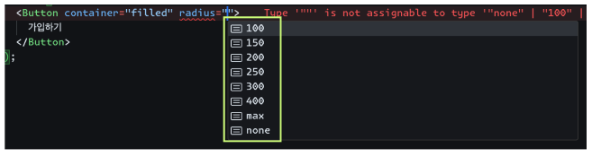 

## 결론

Figma에 정의된 Design System을 개발하여 프로젝트에 도입한 후 느낀 점은 다음과 같습니다. 
  
(1) Figma에서 디자이너와 개발자가 소통하면서 디자인 요소를 명확하게 정의하는 것이 중요하다는 점과,
 
(2) 한번 정의된 컴포넌트는 최대한 사용해야 한다는 점, 
 
(3) 마지막으로 이러한 과정 끝에 완성된 Design System을 도입하면 UI 개발 시 많은 도움을 받을 수 있다
  
는 것이었습니다. 물론, Design System을 UX 팀과 소통하며 시행착오를 거치며 개발하는 과정은 초기에는 일정한 오버헤드를 발생시키지만, 이러한 trade-off를 통해 디자인의 일관성 확보, 개발 오류 감소, 그리고 전반적인 프로젝트 효율성 및 품질 향상이라는 긍정적인 효과를 얻을 수 있었습니다.
  
따라서, 초기 투자와 노력이 장기적으로 충분히 가치 있는 선택임을 확인할 수 있었습니다.

읽어 주셔서 감사합니다.