### 들어가며

Syrup은 재미있게 포인트 모으기, 모은 포인트 투자, 쿠폰 활용, 할인 혜택, 멤버십과 자산 내역 등을 한 곳에서 관리하는 SK플래닛의 대표 서비스입니다.  
SK플래닛은 고객에게 더 좋은 경험을 제공하기 위해서 응답 속도 위주로 Syrup 서비스를 개선했습니다.  
본 내용은 Syrup 서비스 개선에 적용한 기술, 해당 기술을 채택한 이유, 개선 과정에서 경험한 시행 착오 그리고 개선 결과입니다.

### 개선 배경

Syrup 서비스는 2010년에 처음 출시되어 13년 이상, SK플래닛 고객이 사용하고 있습니다(2023년 기준).  
이렇게 오랜 기간 Syrup 서비스를 제공하면서 API 서버의 레거시화가 진행되었는데, 특히 모바일 웹이 호출하는 웹 게이트웨이 서버의 응답 속도가 문제였습니다.  
이러한 웹 게이트웨이의 느린 응답은 전체 Syrup 모바일 웹의 로딩과 렌더링 속도에 직접적인 영향을 주었고, Syrup 모바일 웹의 응답 속도와 서비스 개선을 위하여 신규 서버 구축의 필요성이 대두되었습니다.

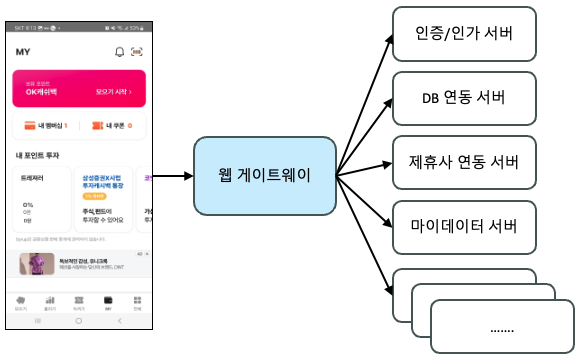

### 현상 및 개선 목표

Syrup은 멤버십 카드/쿠폰, 불리기(금, 조각, 주식, 가상화폐, 부동산), 마이데이터 등의 서비스를 제공하기 위하여 많은 외부 파트너와 제휴하고 있습니다.  

지금까지 Syrup 웹 게이트웨이는 파트너가 제공하는 정보를 조회하기 위하여 다수의 API를 호출하는데, 다음의 방법으로 API를 호출했습니다.  

첫 번째는 웹 게이트웨이가 순차적으로 API를 호출하여 모든 응답이 완료될 때까지 대기한 후, 최종으로 데이터를 병합하여 클라이언트(프론트엔드)로 보내는 방법입니다.  
이처럼 다수의 API를 순차적으로 처리할 때, 응답 시간이 지연되는 문제가 있습니다.  

예를 들어, 다음 그림에서 Gateway의 getSummary API 응답 시간은 Gateway 내부에서 호출하는 API인 getToken, getMember, getFinanceInfo, getCardInfo, getCouponInfo, getProfitInfo 의 응답 시간을 합한 것입니다.  
이러한 결과로 전체 API 응답 시간은 402.063 ms가 되어 클라이언트가 getSummary API를 호출한 후, 대기 시간이 길어지는 문제가 있었습니다. 

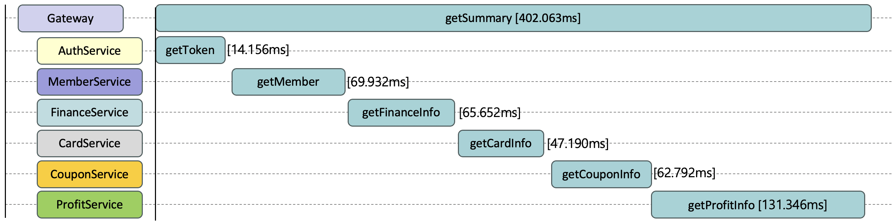

이때 응답 시간을 줄이기 위한 방법으로 서로 의존성이 없는 API를 비동기로 호출하기도 했습니다.  
이 방법은 getSummary API의 응답 시간은 단축되지만, 가장 많은 시간이 소요되는 API에 의존하게 됩니다(다음 그림에서 ProfitService의 getProfitInfo API 응답 시간에 의존).  
특히 특정 API가 타임아웃 시간까지 대기하면, 전체 응답 시간은 타임아웃 시간까지 지연됩니다.

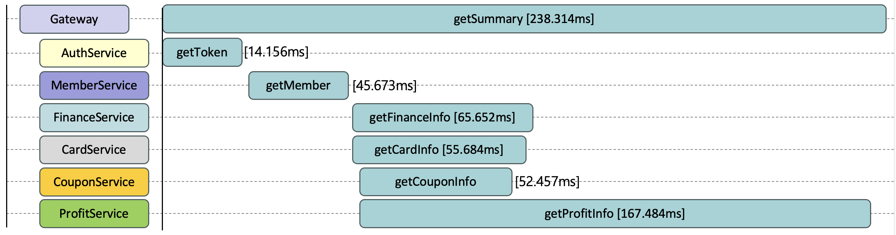

또한 스프링 MVC(Model, View, Controller)를 사용할 경우, 비동기 호출을 위해 일반적으로  CompletableFuture를 사용하는데, CompletableFuture는 다음과 같은 문제가 있습니다. 

* **복잡성** 
CompletableFuture를 사용하면 코드가 복잡해질 수 있습니다. 특히 여러 개의 thenCombine을 조합하여 연결할 때, 다음 코드와 같이 콜백 함수와 데이터 병합 코드로 인해 가독성이 떨어질 수 있습니다.

    public static void main(String[] args) {
        CompletableFuture<String> SK = CompletableFuture.supplyAsync(() ->
            "SK"
        );
    
        CompletableFuture<String> Planet = CompletableFuture.supplyAsync(() ->
            "Planet"
        );
    
        CompletableFuture<String> Syrup = CompletableFuture.supplyAsync(() ->
            "Syrup"
        );
    
        CompletableFuture<String> Development = CompletableFuture.supplyAsync(() ->
            "Development"
        );
    
        CompletableFuture<String> Team = CompletableFuture.supplyAsync(() ->
            "Team"
        );
    
        CompletableFuture<String> future = SK
            .thenCombine(Planet, (result, planet) -> result + " " + planet)
            .thenCombine(Syrup, (result, syrup) -> result + " " + syrup)
            .thenCombine(Development, (result, development) -> result + " " + development)
            .thenCombine(Team, (result, team) -> result + " " + team);
    
        try {
            System.out.println(future.get());
        } catch (InterruptedException | ExecutionException e) {}
    }

* **스레드 풀 관리**
CompletableFuture는 백그라운드 스레드 풀을 사용하여 비동기 작업을 하기 때문에 스레드 풀을 관리해야 합니다. 스레드 풀을 관리하지 않으면 스레드가 과도하게 생성되거나 리소스 누수 문제가 발생될 수 있습니다.   
실제 CompletableFuture 사용 시, 별도로 스레드 풀을 관리하지 않아서 장애가 발생된 경험이 있습니다.

* **콘텍스트 스위칭 비용**
비동기 API 호출을 위해 작업이 다른 스레드로 전환될 때, 추가 시간과 메모리 사용 등 오버헤드 비용이 발생하여 전체적인 서버 성능에 영향을 미칠 수 있습니다.

두 번째는 클라이언트에서 다수의 API를 병렬 호출하여 전체 응답을 화면에서 처리하는 방법입니다.  
특히 React, Vue와 같은 모던 프론트엔드 개발 환경은 전체 페이지 단위가 아닌 컴포넌트 단위로 API를 호출하는 사례가 많아지면서 이와 같은 병렬 호출 방법이 주로 사용됩니다.

다수의 API를 호출할 때에도 다음 그림과 같이 AuthService, MemberService에서 제공하는 API(인증/인가 등)가 중복 호출되는 문제가 발생되어 AuthService, MemberService의 트래픽을 증가시키고 있었습니다. 또한 Gateway API 호출 건수가 많아짐에 따라 고객의 네트워크 비용도 증가 됩니다. 

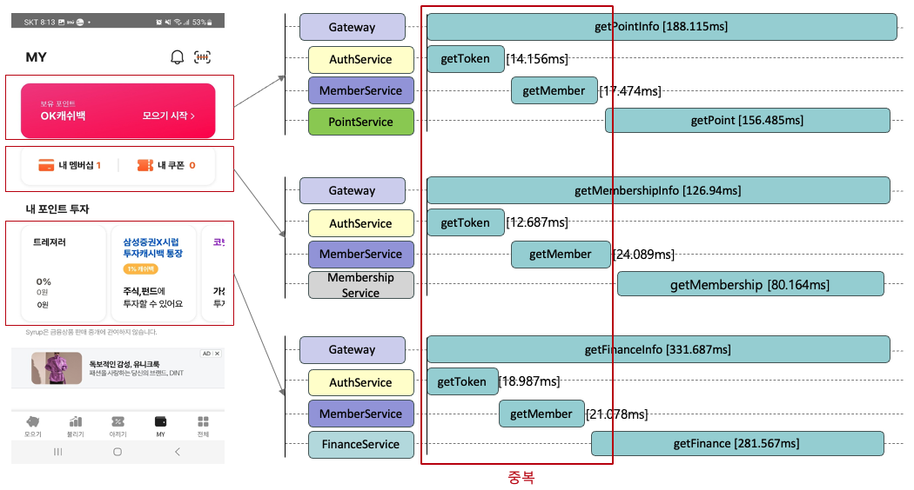

이러한 문제를 해결하기 위해 신규로 구축되는 Syrup 웹 게이트웨이에는 WebFlux, Server Sent Events를 적용하여 신규 서버를 구축했고, 추가로 모던 프론트엔드 개발 환경을 통한 렌더링 성능 향상 및 사용자 경험 개선을 위해 프론트엔드 환경도 Next.js를 적용했습니다.

### 적용 기술

#### 1. WebFlux

WebFlux(https://docs.spring.io/spring-framework/reference/web/webflux.html )는 스프링(Spring) 5부터 도입된 리엑티브 프로그래밍을 위한 모듈 중 하나입니다.  
리엑티브 프로그래밍은 비동기 동작이고 이벤트 기반의 애플리케이션을 개발하기 위한 패러다임이며, 특히 대규모의 동시성이 필요한 애플리케이션에 적합합니다.  

WebFlux는 다음과 같은 특징이 있습니다.  

**비동기 및 논블로킹**  
비동기 방식으로 HTTP 요청을 처리하여, 블로킹 I/O 작업이 최소화됩니다. 이를 통해 대규모의 동시 요청을 처리하고 높은 확장성을 제공합니다.  

**리액티브 스트림**  
리액티브 스트림 API를 사용하여 데이터를 처리합니다. 이 기능은 데이터를 스트림으로 처리하여 실시간 데이터를 처리할 수 있습니다.  

**함수형 프로그래밍**  
함수형 프로그래밍 패러다임을 따르며, 람다 표현식 및 스트림 처리와 같은 기능을 활용하여 코드를 작성할 수 있습니다.  

**다양한 백엔드 런타임**  
Netty와 Servlet 3.1+와 같은 다양한 런타임을 지원하고, 선택한 런타임에 맞게 웹 애플리케이션을 개발할 수 있습니다.  

따라서 WebFlux를 사용하면 대규모의 실시간 애플리케이션을 구축할 때 높은 성능 보장과 확장성을 달성할 수 있고, 비동기 및 이벤트 기반 프로그래밍 모델을 활용할 수 있습니다.  

WebFlux는 다음과 같은 장단점이 있으며, Syrup 웹 게이트웨이는 RDBMS와 직접 연동하지 않고, 다른 파트너 사와 연동이 많은 서버임을 고려하여 WebFlux가 적합하다고 판단했습니다.  

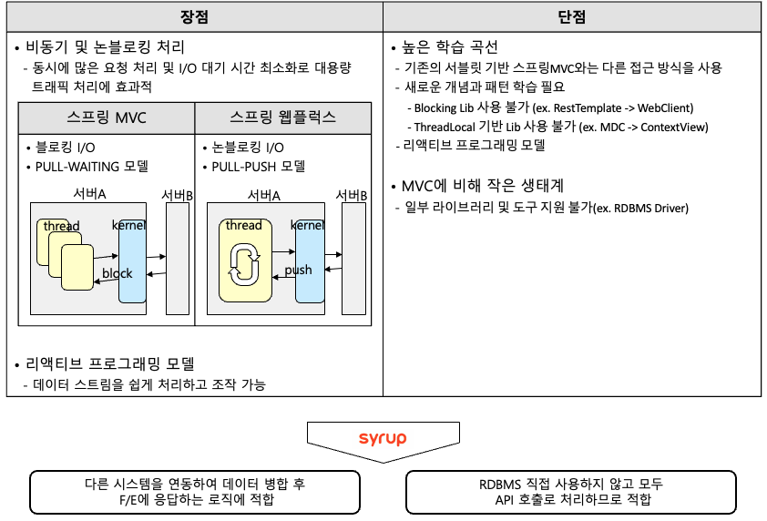

추가로 WebFlux 적용할 때, 성능 향상 이외에 다음과 같은 장점이 있었습니다.  

**(1) CompletableFuture를 사용하는 대신, Reactor의 Mono.zip을 활용하면 단순한 비동기 처리가 가능합니다.**
CompletableFuture를 사용하는 경우, thenCombine마다 콜백 함수가 필요하고 콜백 함수에서 이전까지 결과와 현재 결과를 병합하는 코드가 필요해 전체 코드가 복잡해집니다. 반면 Mono.zip을 사용하면 하나의 콜백 함수에서 모든 처리가 가능합니다.  

다음 코드에서 주석 부분은 CompletableFuture를 사용할 때 코드이고, 주석 제거 부분은 WebFlux 사용시 코드입니다

    public static void main(String[] args) {
    //    CompletableFuture<String> SK = CompletableFuture.supplyAsync(() ->
    //        "SK"
    //    );
    //
    //    CompletableFuture<String> Planet = CompletableFuture.supplyAsync(() ->
    //        "Planet"
    //    );
    //
    //    CompletableFuture<String> Syrup = CompletableFuture.supplyAsync(() ->
    //        "Syrup"
    //    );
    //
    //    CompletableFuture<String> Development = CompletableFuture.supplyAsync(() ->
    //        "Development"
    //    );
    //
    //    CompletableFuture<String> Team = CompletableFuture.supplyAsync(() ->
    //        "Team"
    //    );
    //
    //    CompletableFuture<String> future = SK
    //            .thenCombine(Planet, (result, planet) -> result + " " + planet)
    //            .thenCombine(Syrup, (result, syrup) -> result + " " + syrup)
    //            .thenCombine(Development, (result, development) -> result + " " + development)
    //            .thenCombine(Team, (result, team) -> result + " " + team);
    //
    //    try {
    //        System.out.println(future.get());
    //    } catch (InterruptedException | ExecutionException e) {}
 
    Mono<String> SK = Mono.just("SK");
    Mono<String> Planet = Mono.just("Planet")
    Mono<String> Syrup = Mono.just("Syrup");
    Mono<String> Development = Mono.just("Development");
    Mono<String> Team = Mono.just("Team");
 
    Mono.zip(SK, Planet, Syrup, Development, Team).map(t ->
        t.getT1() + " " + t.getT2() + " " + t.getT3() + " " + t.getT4() + ' ' + t.getT5()
    ).subscribe(System.out::println);
    }

**(2) 타임아웃 제한 없이 롱-폴링을 사용할 수 있었습니다.**  
기존의 Syrup은 마이데이터 자산 업데이트 체크를 위해 폴링 방식을 사용했습니다. 폴링을 사용하면 프론트엔드에서 매번 업데이트 체크 요청을 전송해야 하므로 고객 네트워크 비용이 증가됩니다.   
이를 개선하기 위해 업데이트 체크 역할을 Gateway로 이전하여 롱-폴링 사용을 고려했으나, 업데이트가 진행되는 기간에 Gateway 서버의 스레드 점유 때문에 서버 비용이 증가되는 문제가 있었습니다. 따라서 롱-폴링을 사용하면, 타임아웃 설정이 필수입니다.  
이번에 WebFlux로 서버를 개편하면서 연결 요청마다 스레드가 생성되지 않는 것을 이용하여 롱-폴링 시 별도의 타임아웃 설정 없이 사용할 수 있었습니다.  

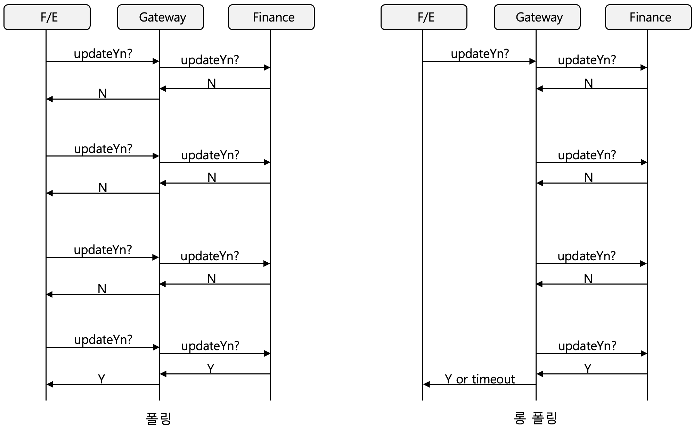

#### 2. Server Sent Events

Server Sent Events(https://docs.nestjs.com/techniques/server-sent-events, SSE)는 서버에서 클라이언트로 단방향 데이터를 전송하기 위한 웹 기술입니다. SSE는 서버에서 클라이언트로 데이터를 푸시하고, 웹 페이지가 열려 있는 동안 데이터를 실시간으로 업데이트할 때 사용됩니다.  
따라서 SSE는 실시간으로 정보가 업데이트 되는 스트리밍 뉴스, 실시간 주가, 온라인 게임, 알림 및 기타 웹 애플리케이션에 유용하게 사용됩니다.

이러한 SSE의 주요 특징은 다음과 같습니다. 

**단방향 통신**  
서버에서 클라이언트로 단방향 통신을 제공합니다. 이것은 클라이언트가 주기적으로 서버에 데이터를 요청하지 않고도 서버가 데이터를 보낼 수 있습니다.  

**간단한 프로토콜**  
SSE는 간단한 프로토콜로써, 웹 브라우저에 내장된 EventSource 객체를 활용하여 쉽게 사용할 수 있습니다.  

**Event-Driven 구조**  
서버는 이벤트 스트림으로 클라이언트에 이벤트를 보낼 수 있으며, 클라이언트는 JavaScript 이벤트 핸들러를 사용하여 처리합니다.  

SSE를 구현하려면, 서버 측은 특정 HTTP 헤더('Content-Type: text/event-stream')를 사용하여 SSE 스트림을 전송하고, 클라이언트 측은 EventSource API를 사용하여 이벤트를 수신하는 코드를 작성하면 됩니다. 

Syrup은 다음 그림과 같이 SSE를 적용하여 비동기로 호출되는 API 전체 응답을 기다리는 것이 아닌, 개별 API응답을 즉시 프론트엔드에 푸시하고, 프론트엔드에서는 바로 렌더링하여 사용자 경험을 개선했습니다.

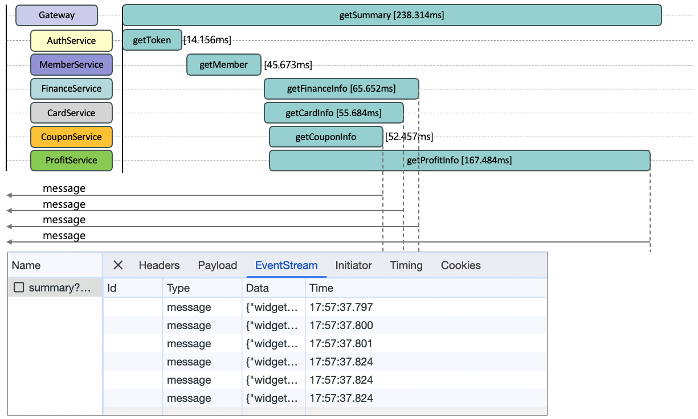

#### 3. Next.js

Next.js(https://nextjs.org )는 React 기반의 웹 애플리케이션 프레임워크로써 웹 애플리케이션을 쉽고 빠르게 개발하도록 도와주는 도구와 환경입니다. Next.js는 다음과 같은 주요 기능을 제공합니다.

**서버 사이드 렌더링(Server Side Rendering, SSR)**  
Next.js는 기본적으로 서버 사이드 랜더링을 지원하며, 이를 통해 초기 페이지를 로딩할 때 서버에서 페이지를 렌더링하여 검색 엔진 최적화(SEO)와 초기 로딩 속도를 높일 수 있습니다.  

**정적 사이트 생성(Static Site Generation, SSG)**   
Next.js는 빌드 시 미리 정적 HTML 파일을 생성할 수 있습니다. 이것은 정적 HTML을 우선적으로 노출시켜 초기 로딩 속도 및 사용자 경험을 향상시키고 CDN(Content Delivery Network)을  통한 캐싱도 가능합니다.  

**데이터 미리 가져오기(Date Pre-fetching)**  
페이지 이동 전에 필요한 데이터를 미리 가져오는 기능을 지원합니다. 이 기능으로 페이지는 빠르고 부드럽게 전환됩니다.  

Next.js는 다음과 같은 장단점이 있으며, Syrup은 Next.js 의 장점만을 수용하여 정적 사이트 생성(SSG)만 적용하기로 했습니다. 서버 사이드 렌더링을 적용하면 별도의 서버 리소스, 모니터링, 운영 인력 등이 필요하기 때문에 서버 사이드 렌더링은 효과 대비 비용 효율성이 떨어진다고 판단했습니다.

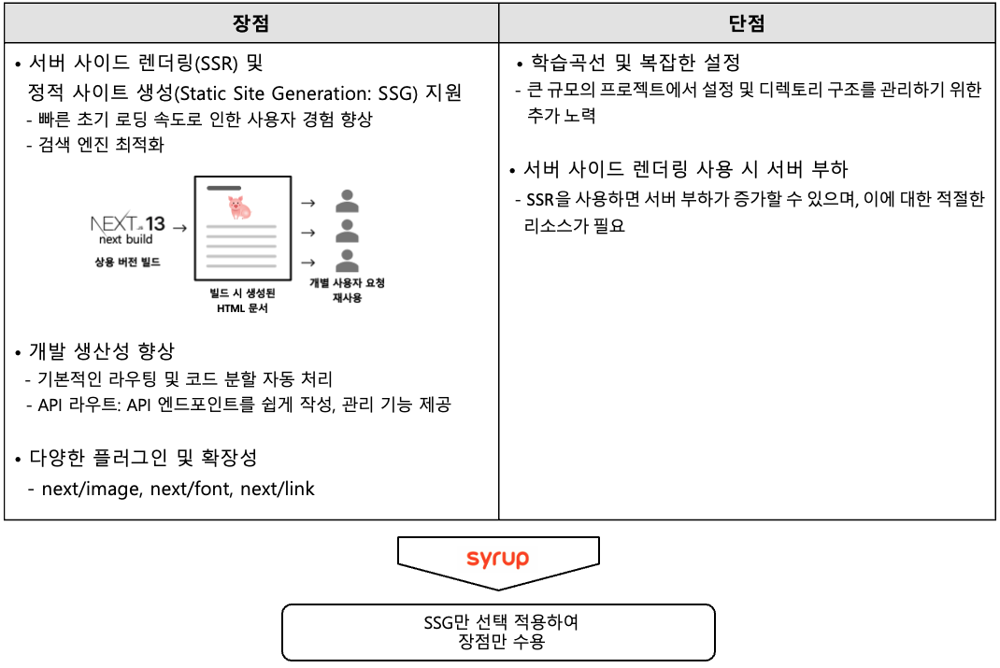

### 개선 과정에서 시행착오(WebFlux 위주)    

WebFlux를 적용하면서 겪었던 몇 가지 시행착오를 정리해 보았습니다. 

첫 번째는 리액티브 프로그래밍 모델에 대한 적응이 필요했습니다.  
예를 들어 다음 코드에서 getSummaryBad 함수가 실행되어도 실제 System.out.println(res); 구문이 실행되지 않았는데 이유가 무엇일까요?

이유는 (1)리엑티브 프로그래밍 모델은 발행자(Publisher)-구독자(Subscriber) 모델이 사용되는데 별도 구독을 하거나 하나의 구독 파이프라인 안에서 실행되고, (2)발행자의 발행 준비가 완료된 후, 푸시되어야 구독이 일어나기 때문입니다. 

Mono.just를 사용하면, 즉각적인 발행이 이루어지므로 발행은 별개로 하고, getSummaryBad는 별도의 구독도 없고 파이프라인에도 포함되지 않아 System.out.println(res); 구문이 실행되지 않았습니다. 그리고 getSummaryNormal은 구독 파이프라인에 포함되어 로그가 출력되는 차이가 있습니다.

이와 같은 우리는 리엑티브 프로그래밍 모델에 대한 적응이 필요했으며, 리엑티브 시스템의 기본 개념, 리엑티브 프로그래밍 모델, 리엑터 라이브러리의 사용법 등을 익히는 데 6개월 이상 소요되었습니다.

    private Mono<String> getToken() {
        return Mono.just("token");
    }
    
    private Mono<String> getMember() {
        return Mono.just("member");
    }
    
    private Mono<String> getMembershipInfo() {
        return Mono.just("membership");
    }
    
    // reactive programming bad example
    public Mono<ServerResponse> getSummaryBad(ServerRequest request) {
    Mono token = getToken();
    Mono member = getMember();
 
    token.flatMap(res -> {
        System.out.println(res);
        return res;
    });
 
    member.flatMap(res -> {
        System.out.println(res);
        return res;
    });
 
    Mono membership = getMembershipInfo().flatMap(res -> {
        return Mono.just(res);
    });
 
    return ServerResponse.ok().body(membership, String.class);
    }
    
    // reactive programming normal example
    public Mono<ServerResponse> getSummaryNormal(ServerRequest request) {
        return token.flatMap(tokenRes -> {
            System.out.println(tokenRes);
            return member.flatMap(memberRes -> {
                System.out.println(memberRes);
                return getMembershipInfo().flatMap(membershipRes -> {
                    return ServerResponse.ok().body(Mono.just(membershipRes), String.class);
                });
            });
        });
    }

두 번째는 멀티 스레드 기반 라이브러리를 사용할 수 없습니다.  
WebFlux는 스프링 MVC와 다르게 연결 요청마다 별도의 스레드를 생성하지 않기 때문에 스레드 기반으로 데이터를 관리하는 라이브러리를 사용할 수 없습니다.  만약 이것을 무시하고 사용하면 다른 사용자의 정보가 노출되는 지옥이 펼쳐질 수 있습니다.

대표적인 멀티 스레드 기반 라이브러리는 ThreadLocal, MDC(Mapped Diagnostic Context) 등이 있으며, 이를 대체하기 위해 WebFlux는 ContextView를 제공합니다. 또한 로그 추적을 위해서 Spring Cloud Sleuth를 사용할 수 있습니다.

    // context write
    .contextWrite(context -> {
        context = context.put(ContextType.MEMBER_CONTEXT, MemberContext.builder().build());
        return context.put(ContextType.LOG_CONTEXT, LogContext.builder().traceId(TraceUtil.createTraceValue()).build());
    })
 
    // context read
        return Mono.deferContextual(contextView -> {
            MemberContext memberContext = (MemberContext) ContextUtils.getContext(contextView, ContextType.MEMBER_CONTEXT);    
    });

세 번째는 블로킹 라이브러리를 사용할 수 없습니다. 언급한 바와 같이 WebFlux는 스프링 MVC와 달리 연결을 요청할 때마다 스레드를 할당하지 않고, 적은 수의 Worker 스레드를 공용으로 사용하는 리액티브 프로그래밍 모델입니다. 

이처럼 적은 수의 Worker 스레드를 사용하기 때문에 스프링 MVC에서 사용하던 블로킹 라이브러리를 그대로 사용하면, 전체 시스템이 블로킹될 수 있습니다. 참고로 RestTemplate은 대표적인 블로킹 I/O를 사용하는 라이브러리입니다.

만약 RestTemplate을 이용하여 API 호출 중 대기시간이 길어질 경우, 스프링 MVC는 해당 API만 영향을 주지만 WebFlux는 전체 시스템에 영향을 주게 됩니다. 

WebFlux에서 대표적으로 사용할 수 있는 논-블로킹 라이브러리는 다음 그림과 같으며, 이 중에서 R2DBC(Reactive Relational Database Connectivity)는 아직까지 지원 데이터베이스 부족, 커뮤니티와 지원 부족, 개발의 복잡성 등의 문제가 있기 때문에 신중히 사용해야 합니다.

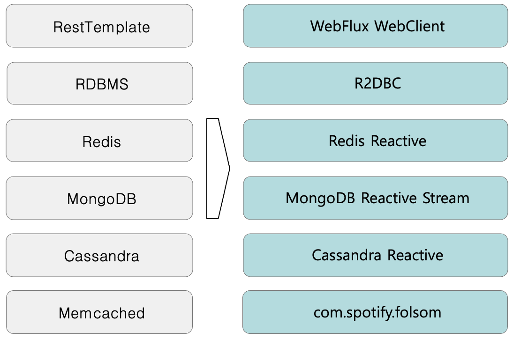

Syrup 웹 게이트웨이는 리액티브 환경에서 외부 API 연동을 위해 WebClient를 사용하며, MemCached 사용을 위해 com.spotify.folsom(https://github.com/spotify/folsom )을 사용합니다. 

네 번째는 스프링 MVC에 비해 생태계가 작기 때문에 사용할 수 있는 라이브러리의 선택지가 좁습니다. 

Syrup은 다음 그림과 같이 A 서버에서 MemCached에 값을 저장하고, B 서버에서 MemCached의 값을 읽어서 사용하는 경우가 있습니다. A 서버와 B 서버가 동일한 라이브러리 패키지와  Key 해싱 알고리즘을 사용한다면, 다중 노드를 사용하더라도 문제 없이 동작됩니다(캐시 HIT).

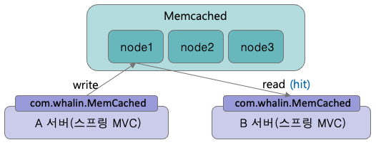

하지만 WebFlux는 블로킹 I/O를 사용하는 com.whalin.MemCached를 적용할 수 없었고, 논-블로킹 I/O를 사용하는 com.spotify.folsom을 사용해야 합니다. 

두 라이브러리가 지원하는 Key 해싱 알고리즘이 다르기 때문에 다음 그림과 같이 다중 노드 환경에서 캐시 Miss가 발생됩니다. 

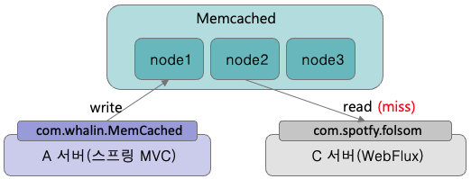

결국 특정 라이브러리를 사용할 수 없어서 기존 로직을 변경하거나 다른 우회적인 방법을 찾아야 하는 시행착오를 겪었습니다. 

### 개선 결과

WebFlux, Server Sent Events, Next.js를 통한 웹 게이트웨이와 웹 서버를 개선한 이후, Syrup의 전체적인 화면 로딩 속도가 개선되었습니다.

(1) API 요청 건수는 기존 대비 70% 이상 줄었습니다. 개별로 호출되던 API가 하나의 API로 통합된 결과입니다.

(2) API 응답 속도는 기존 대비 50% 이상 개선되었습니다. 순차적으로 호출되던 외부 API가 비동기로 호출된 결과입니다. 

(3) API 이외에 Next.js 적용을 통한 렌더링 속도 개선 효과도 확인할 수 있었습니다.  
또한 LightHouse를 통한 웹 페이지 성능을 확인해 보았는데요. 특히 이번 개선으로 First Contentful Paint, Total Blocking Time, Speed Index 값이 개선된 것을 확인할 수 있었습니다. 

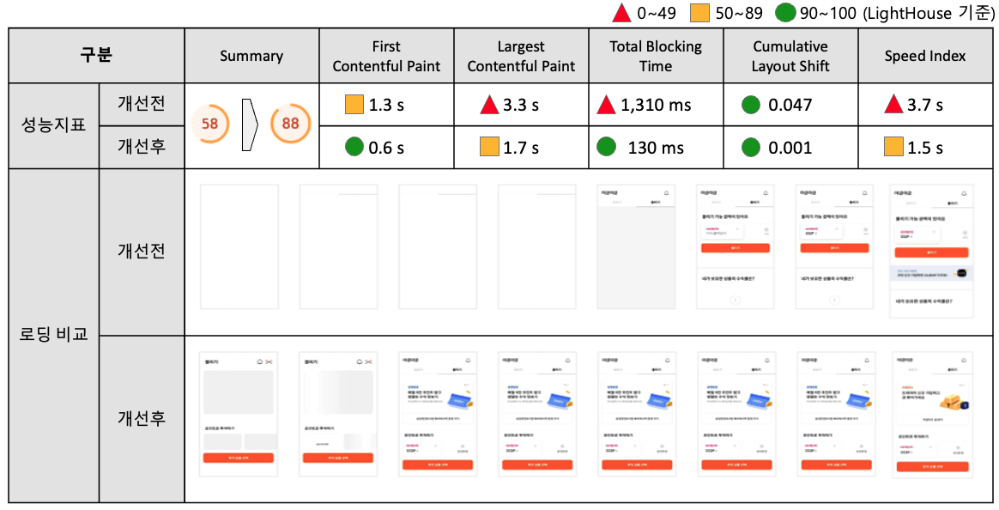

(4) 마지막으로 실제 앱 실행을 통한 비교 시험에서도 성능이 좋아진 것을 확인할 수 있었습니다.  
개선 전(3.52s) 대비, 개선 후(1.96s) 최초 로딩 속도가 1.56s 개선되었습니다.

### 마무리

지금까지 Syrup 모바일 웹의 몇 가지 개선 사례를 공유 드렸습니다. 개선 과정에서 WebFlux, Server Sent Events, Next.js를 활용한 성능 개선에 집중했고, 실제로 체감할 수 있는 성능 향상을 달성했습니다.

이러한 결과를 얻기까지 WebFlux, Server Sent Events, Next.js를 도입에 따른 레퍼런스 부족, 코딩스킬 경험의 부족으로 인한 여러 시행착오의 과정을 겪었지만 그 결과 실질적인 성능 향상 뿐만 아니라 개발 관점에서 많은 성장과 다양한 경험을 할 수 있었습니다.  

짧은 글이나마 과정을 정리한 이 글이 독자 여러분의 성장에 작은 밑거름이 될 수 있길 바랍니다.

감사합니다.

모으는 재미, 불리는 맛 Syrup

Google play  
https://play.google.com/store/apps/details?id=com.skt.skaf.OA00026910&hl=ko&gl=US  
Apple App Store  
https://apps.apple.com/kr/app/syrup-%EC%8B%9C%EB%9F%BD/id430282710
