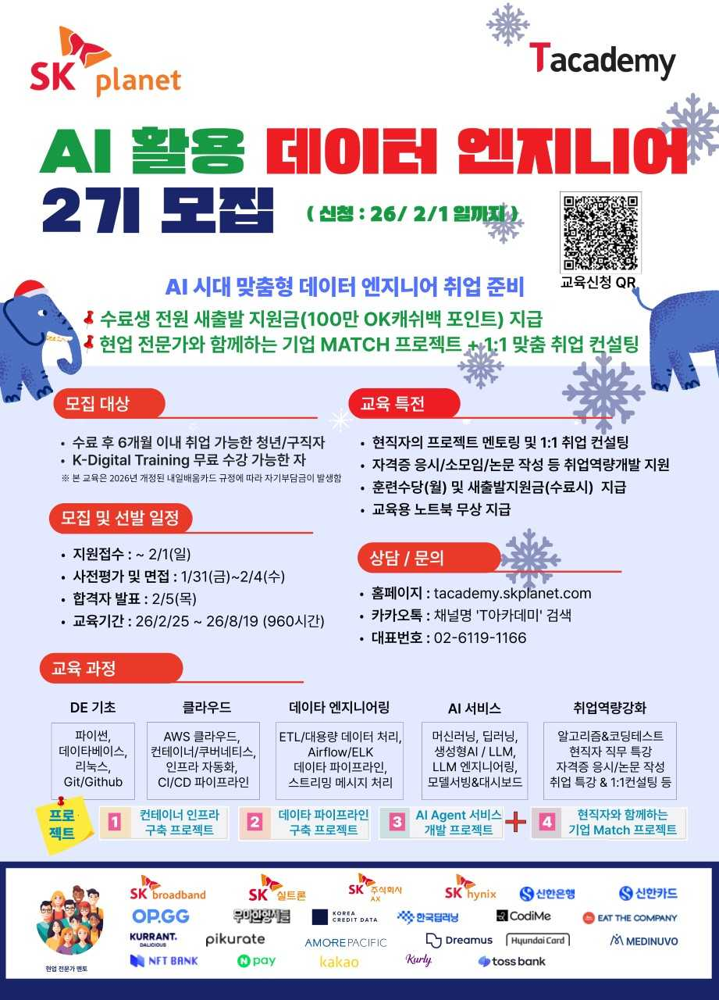

[요약] SK플래닛 [T Academy](https://tacademy.skplanet.com/)에서 'AI 활용 데이터 엔지니어 2기' 교육생을 모집합니다(대한상공회의소와 고용노동부가 함께 합니다). 
주 5일 오프라인 K-Digital 과정으로 최신 AI 활용 능력 및 데이터 엔지니어링 교육, 기업 연계 프로젝트 등을 수행하며, 수료 새출발 지원금(OK캐쉬백 100만 포인트 제공) 등의 혜택도 있사오니 많은 관심 부탁드립니다.  
신청 마감은 2026년 2월 1일까지이며, 문의 및 자세한 사항은 [T Academy](http://tacademy.skplanet.com/) 웹사이트 및 아래 배너를 참조하세요! 

* SK플래닛 T Academy 웹사이트: [(링크)](https://tacademy.skplanet.com/frontMain.do)
* AI 활용 데이터 엔지니어 2기 신청: [(링크)](https://tacademy.skplanet.com/front/community/asac/aiDataEngineeringAppPage.do?index=1)

---

