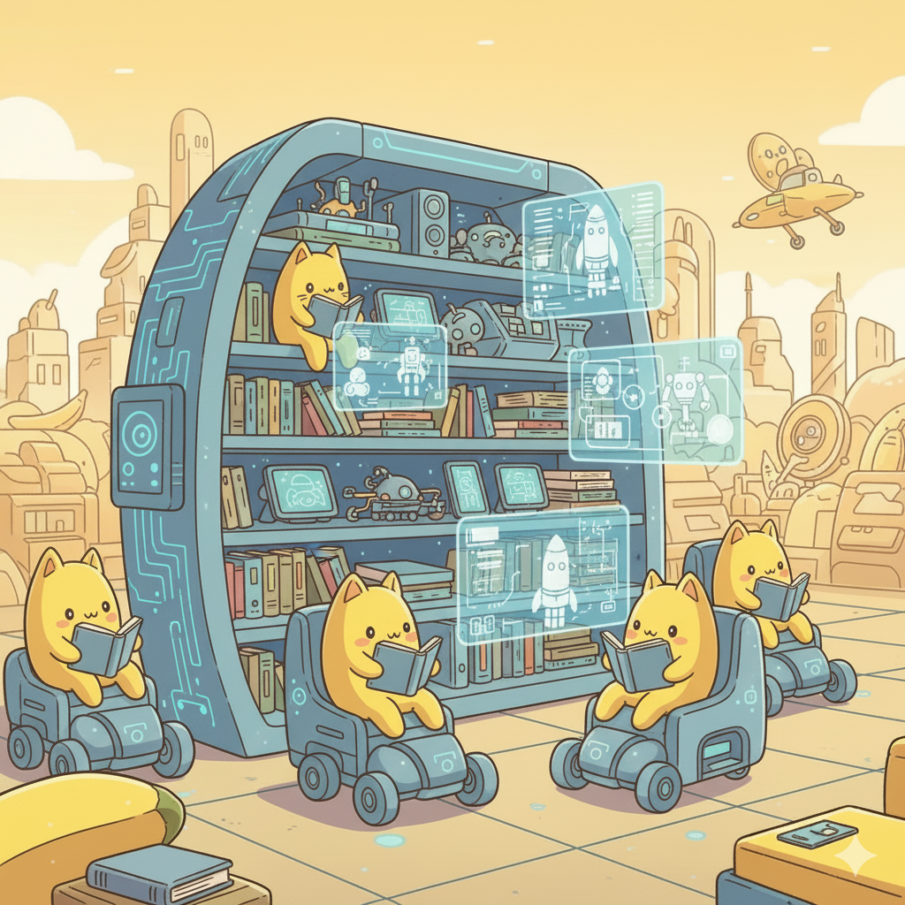
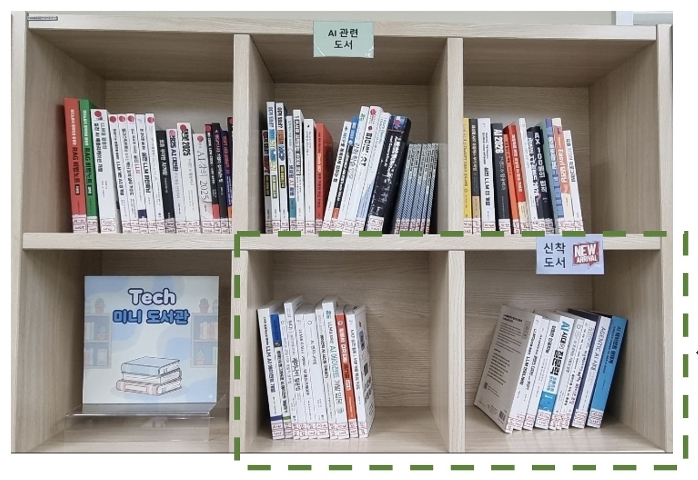
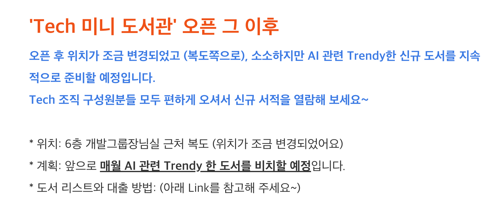
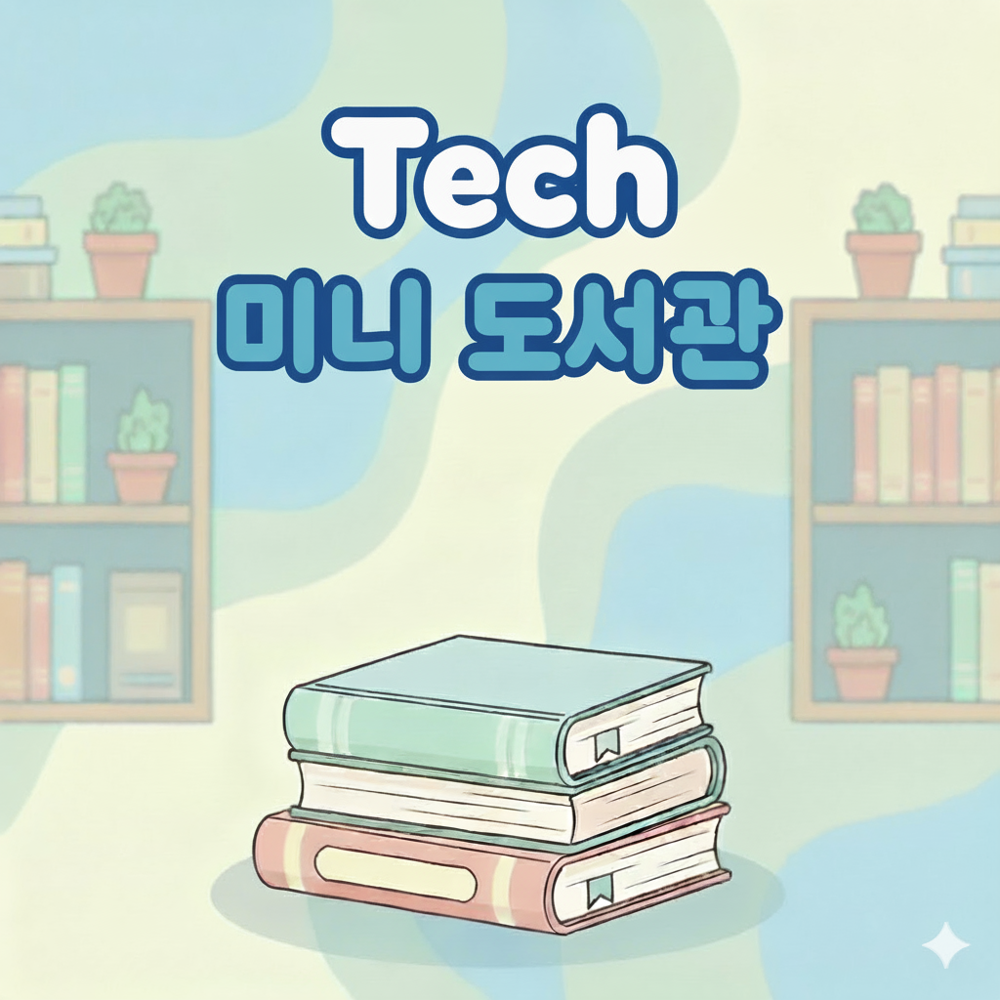
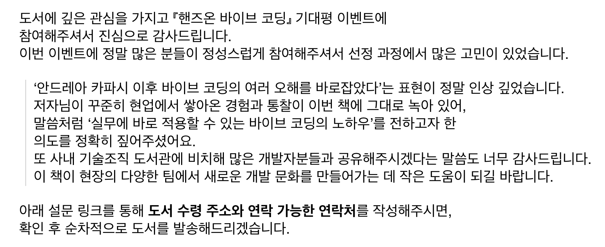
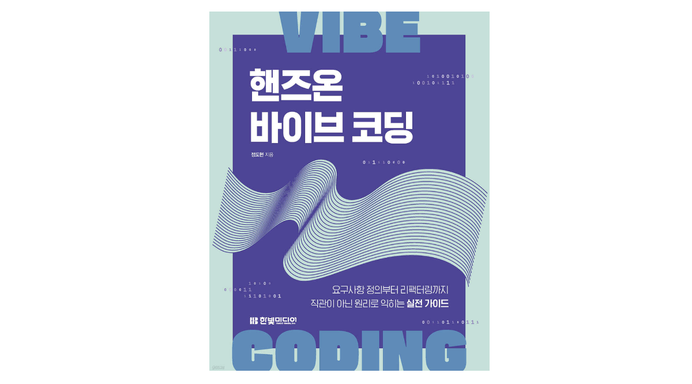
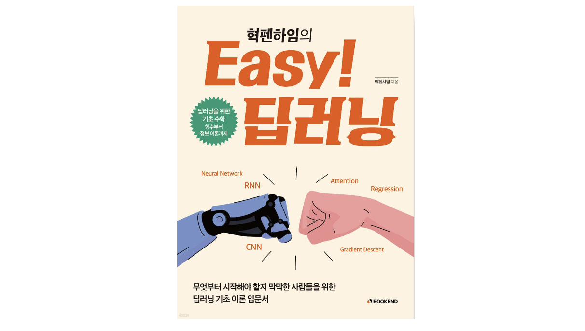

안녕하세요 오랜만에 Joe!입니다. 

개발자 하면 책! 은 떨어질래야 떨어질 수 없는 것 같습니다.  판교 SK플래닛의 개발자-엔지니어분들도 그러한데요. 이번 글은 **기술조직 내 '언플러그드한' 개발자 미니 도서관을 열고 운영을 시작한 이야기**입니다. 편하게 보아주세요~ 

# 도입 계기는 
---
원래 스탭 부서(기술지원팀)에서 사내 교육기획을 위해 개발도서를 업무용도로 담당자가 구입하고 있었습니다. AI(프로덕트 개발, 코딩툴, 자동화), 개발, 데이터, 인프라, 기술문화, PM, 교육/조직, 글쓰기/말하기 등 다양한 주제의 책을 구입했고 조금씩 '쌓여'가고 있었는데요.

그러던 중 어느 분께서(!) 이 책들을 다른 구성원에게도 공유해 보면 어떠냐는 좋은 의견을 주셨고, 

개발자들의 의견도 알아봤더니, 현재 제휴맺고 있는 사내 온라인도서관은 (코드가 있는)개발도서는 신간 e-book 업로드가 늦고 코드를 보기에는 불편하며 사용자가 표시해 놓은 항목이 대출이 끝나면 지워지는 등 아쉽다는 피드백이 있어,

저희가 갖고있는 도서를 seed로 **'언플러그드한 작은 도서관'** 을 베타 사내 서비스로 시작하게 되었습니다(이름은 처음에는 '작은 도서관' 이었다가 **'테크 미니 도서관(이하 테미도)'** 로 바꾸었어요). 

실은 원래에도 각 팀별로도 개발도서를 구입/공유하고 있었기 때문에, 굳이 이것이 필요할까도 싶었으나 의외로 사내 설문 응답 결과 매우 높은 니즈가 있었고(75%+), 

**향후 구입하는 도서는 AI 도서 중심으로 구입한다**는 나름의 '원칙'을 세우고 오래된 도서는 정리하는 등 규모를 갖추기 시작했습니다(근데 왜 언플러그드냐고요?)

(구글 나노바나나로 그린 '테미도'의 상상도입니다. 편안해 보이죠? ^^)

 

# 네 시작은 미약하였으나... 
---
'테미도'는 다음과 같이 다소 '의도적인' 컨셉으로 (Agentic AI 시대에) **매우 아날로그스럽고 최소화한 룰**을 가지고 여름 휴가가 살짝 지난 지난 8월 하순에 small start를 해보았습니다. 

* 추구 방향: **운영자와 대여자 모두에게 부담 최소화**, 인간의 개입 최소화, ~~AI의 개입도 최소화(응?)~~
* 운영자 입장: 절차 최소화 (심지어 바이브코딩/자동화도 미 도입) 
* 대여자 입장: 대여와 반납에 부담을 주지 않음 (예: 납기일은 정책이 있고 기록은 하지만 **부담은 안준다**) 
* 카테고리: 신규 도서는 철저히 **AI 도서** 위주로 구입 (개발도서는 정말 양서인 경우 선정. 웬만하면 각 팀에서 구입) 

도서의 분류 및 규모는 다음과 같았습니다(역시 AI가 많았네요). 

* AI: 5x권 (개발, AI코딩, 자동화, 전략/사례) 
* Dev: 4x권 (BE, FE, SWE, DevOps, 개발문화) 
* Data & 기타: 2x권 

약 150권 들어갈 규모의 책꽂이 2개를 구한 다음 그냥 저희팀 앞에 비치해 두었습니다. 

많이 대여하셨던 책들은 최근 기술인 클로드코드, 커서, 깃헙 코파일럿, 요즘 다른회사 개발, n8n, 에이전트 등의 책이 역시 인기가 많았습니다. : ) 

대출방식은 ~~실시간 공유 그런건 없고~~ 출입대장 형식의 수기(handwriting) 작성으로 하였습니다. 대신(!) 책장 옆에는 첫 1개월 동안 초콜릿과 쿠키 등 맛난 간식을 수시로 제공했구요 ^ ^  
(간식이 너무 빨리 떨어져서 걱정하시는 분도 계셨습니다 ㅎㅎ)

(책장도 구입하고 4분기에 신착 AI 개발도서도 다수 보강하였어요!)
 

# 느슨한 사내 홍보 
---
신간 안내는 매월 초 이메일로 홍보를 진행하고 있으며,  
추천도서 소개는 매월 진행하는 사내 기술조직 뉴스레터를 통해 진행 중입니다('테미도를 통해 대출 가능합니다' 라는 문구를 빼먹지 않음!)  
~~(근데 메일을 보내는건 그럼 언플러그드가 아닌건가...아 넘어가주세요~)~~

(뉴스레터 문구 일부입니다)

 

# 2.5개월 초기 운영 결과 (8월-11월 첫주 & 추석연휴) 
---
추석연휴가 포함되었으므로 실제는 2개월 반 정도의 기간 동안 운영을 한 셈이네요. 심지어 반납일도 엄격하게 demanding하지 않는 '느슨한' 운영을 약 3개월 진행하였는데요(반출대장에는 대여일과 반납일을 기록하도록 함) **나름 자율적으로 잘 운영이 되고 있습니다.**

Working day 기준으로 거의 매일 대출이 이뤄졌고 각 개발팀에서 골고루 대여를 했었습니다(일부 인프라팀 및 사업부서에서도 한 분이 이름을 적고 빌려가셨었네요 ㅎㅎ)

 

# 향후 계획
---
테미도의 스케일을 '키울' 생각은 지금은 전혀 없습니다. 오래된 책은 기증하는 등 바로바로 '다이어트'를 하여 규모를 유지할 예정이구요. 

'AI 중심 신간의 가장 빠른 사내 공급'을 통해 개발자들이 '서점에 가지 않고도' 사무실에서 종이 스타일 도서의 내용을 빠르게 접할 수 있게 하는 것이 목표일 수 있겠습니다. 

모쪼록 개발자들이 편하게 책과 최신 지식을 접하고 회사와 개인의 성장에 기여하는 작은 환경이 되기를 바랍니다! 

 

## 덧1. 이번 주에 옆옆 개발팀(익명)에서 도서비 펀딩을 해주셨습니다(감사합니다!) 
---

**조만간 사내 설문을 한번 해서** 개발자들이 원하는 인기 도서를 올해가 가기 전에 얼른 구입해 보아야겠습니다~  
(다른 팀들도 생각있으시면 연말에 바로바로 펀펀한 펀딩~~ ㅎㅎ)

 

## 덧2. 글쓴이가 한빛미디어 이벤트에 당첨되어 테미도에 책을 기증하였습니다 ~~(왜?)~~
---

실은 지난 10월, 한빛미디어에서 로보코 정도현님의 최신간 [**'핸즈온 바이브 코딩'**](https://www.yes24.com/product/goods/160603535) 기대평 이벤트가 올라와서 매우 가벼운 마음으로 응모를 하였습니다. 당첨이 되면 저희 테크 미니 도서관에 기증을 하고 싶다는 순수한(!) 문구를 적었는데 그만 저의 진심이 하늘에 닿고 말았다는...  
아래 이벤트 담당자님의 답변을 첨부해 드립니다. 

책은 잘 받았구요, 11월 뉴스레터에도 추천도서로 올릴 예정입니다. 
좋은 이벤트에 참여할 수 있도록 기회를 주셔서 다시 한번 감사드립니다! 

(출처: [yes24](https://www.yes24.com/product/goods/160603535))

 

## 덧3. 혁펜하임 님 도서기증 사례를 소개합니다.
---

익명의 한 분께서(!) 최근 혁펜하임 님의 어려운 소식을 듣고 **'이지 딥러닝'** 도서를 무상 기증해 주셨습니다(정말 감사합니다). 

(출처: [교보문고](https://product.kyobobook.co.kr/detail/S000214848175))

참고로 이 분은 예전에 모 포털에서 스포츠 콘텐트를 운영하셨었고 당시 롯데 모 선수 분이 쓰러졌을 때 기부 프로모션을 진행해보자는 생각은 있었으나 소심해서(본인 표현) 미처 의견을 내놓지 못해서 늘 마음에 걸리셨다고 합니다. 이번에 또 건너건너 아는 분이 어려움을 당하셔서 작게나마 도움을 드리면 좋겠다는 생각에 조용히 책을 기부하셨다고 합니다 ~~(절대 이름 밝히지 말아 달라고...)~~. 마음을 나눠 주셔서 감사드리며 혁펜하임 님도 꼭 쾌차하시길 바랍니다. 참고로 예전에 저희 DTC 세미나 해주셨던 테디노트 님도 링크드인에서 별도로 나눔에 동참해 주셨었네요.  
이들의 선한 영향력이 세상을 따뜻하게 하는 것 같습니다 ^ ^ 

저희 12월 기술조직 (사내) 뉴스레터에 추천 도서로 올릴 예정입니다 : ) 

아, 혁펜하임 님 온라인 강의도 있으니 함께 참고하세요! => [(혁펜하임 아카데미)](https://www.hyukppen.com/)

 

# 마무리하며 

비록 거창한 무언가를 도입하는 그런 이야기는 아니지만, 작은 일이라도 무시(?)하지 않고 필요에 따라 자연스럽게 누군가의 필요를 채워 가는 소소한 이야기 하나를 전해 드렸습니다. 

이러한 작은 일들이 쌓여 AI 시대에 필요한 한 사람의 개발자가 성장하는 데 기여할 수 있다면 얼마나 좋은 일일까 하는 생각을 하면서 글을 맺고자 합니다. 읽어 주셔서 감사합니다. 