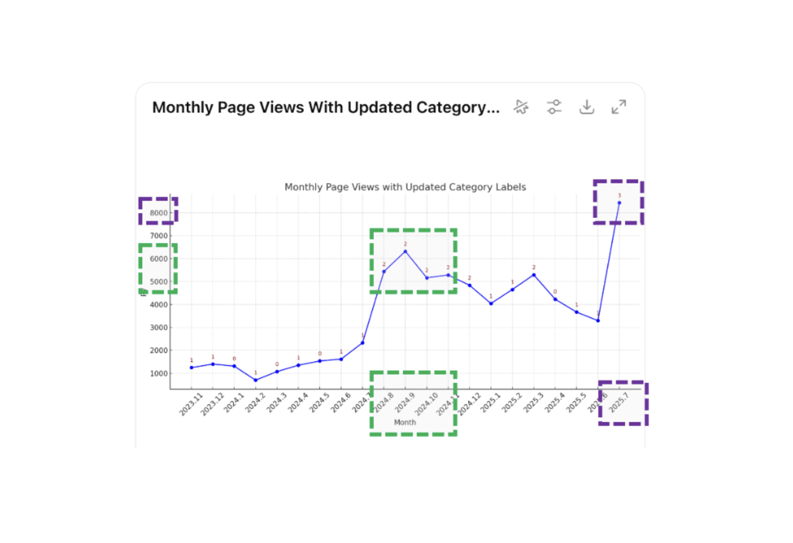
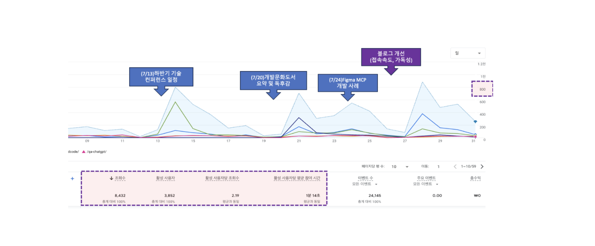
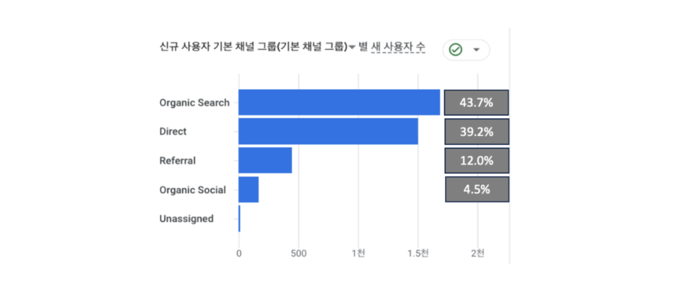
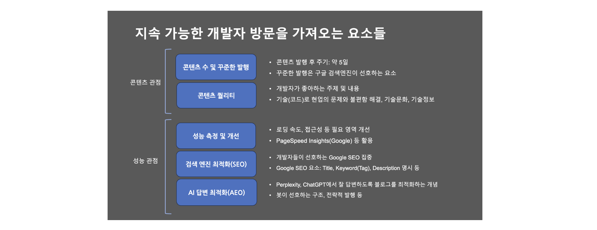
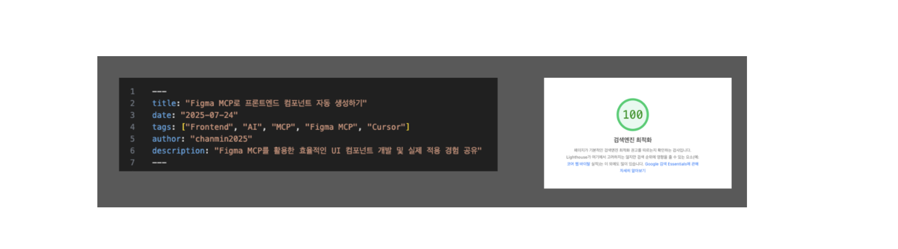
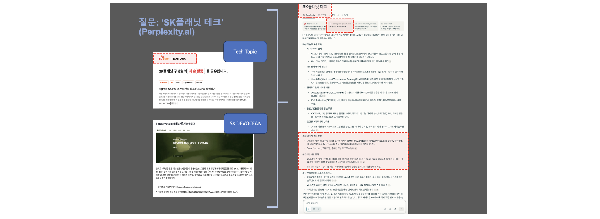

안녕하세요, SK플래닛(이하 SKP)에서는 2025년 현재 ['Tech Topic'](https://techtopic.skplanet.com/) 이라는 기술(테크) 블로그를 운영하고 있습니다.  
본 글에서는 지난 7월 한 달간 진행하였던 다양한 측면에서의 기술 블로그 개선 실험 사례를 공유하고, 향후 더 나은 방향을 탐색하고자 공유드리오니 참고 부탁드립니다. 
목차는 다음과 같습니다.

1. 들어가며 
    * 기술 블로그의 가치
    * Tech Topic 소개 
    * 히스토리 
2. 콘텐트 반응 실험 및 분석 
3. 지속 가능한 개발자 방문을 가져오는 요소들
    * 글의 유입양 및 퀄리티, 꾸준함 
    * 성능 개선, SEO, AEO 
4. 마무리하며
 

# 1. 들어가며 

## 1) 기술 블로그의 가치: 왜 많은 기업들은 기술 블로그를 쓰는가?

이미 국내외 많은 ICT 기업들이 도입하고 있는 기술 블로그(테크 블로그)의 가치는, 1) 기업 차원에서는 전략적 활용 및 개발문화를 조성하는 도구로 활용 2) 구성원 차원에서는 개발자의 성장 및 퍼스널 브랜딩 채널로 활용하는 것으로 볼 수 있습니다(['코드 너머, 회사보다 오래 남을 개발자'](https://techtopic.skplanet.com/book-beyondcode/) 참고).   
Tech Topic의 경우, 최근에는 **팀 및 프로젝트 단위의 성과**도 포스팅하는 비중을 높여서, 개인뿐만 아니라 **조직의 테크 브렌딩에도 기여**하고 있습니다(아래 참조). 

* [Syrup 디자인시스템 개발: UX-FE로의 효과적인 핸드오프](https://techtopic.skplanet.com/syrup-designsystem/) (Syrup개발팀 개발자 3명)
* [\[AI Moment\] B2B 영상 생성, AI로 어떻게 가능해졌나](https://techtopic.skplanet.com/aimoment/) (VAS개발팀 개발자 3명)
* [마케터를 돕는 LLM 기반 DMP - Seg Lens 시스템 개발기](https://techtopic.skplanet.com/dmp-seglens/) (데이터서비스개발팀 개발자 3명) 등 

저희뿐만 아니라 주요 테크 기업에서는 기술 블로그 및 기술 문서 작성을 중요하게 인식하고 있으며, KPI/기술문화/기여보상 등 **다양한 방법으로 글쓰기를 장려**하고 있습니다.

## 2) Tech Topic: SK플래닛 기술 블로그 (Season 2)

SKP 초기 운영되던 [README(2012-2018, 현재 아카이빙)](https://web.archive.org/web/20190116065552/http://readme.skplanet.com/) 블로그 이후 기술 블로그가 부재하여, 회사의 기술 활동을 대외에 공유하기 위한 기술 블로그를 제안, 2023년 새롭게 런칭하였습니다(**Tech Topic** 네이밍은 당시 CTO님께서 제안해 주셔서 이를 반영하였습니다). 
빠르게 런칭할 수 있고 **개발자 친화적인 GitHub Pages + Gatsby 조합을 선택하였고, Markdown으로 작성**하되
기획자/디자이너 등이 작성할 경우에는 사내 위키(컨플루언스)로 1차 접수를 받고 상호 검수 및 변환작업 후 포스팅을 진행하는 절차를 가졌습니다.
  
**초기**에는 다양한 조직의 활동 사례를 반영하고자 다양한 솔루션(챗봇, IoT 등) 소개, UX, Web3 등 다양한 주제를 커버하고 있었으나,
**'24년 하반기**부터 개발(코드를 포함하는) 및 기술 문화를 주제로 하는 글의 비중을 높이고자 하였습니다.
포스팅 주기는 월 1회/격월 1회 등으로 기준이 변경되었고, 그 동안 담당자 및 역할이 조금씩 바뀌기도 하였습니다.

## 3) 히스토리(2024-2025 상반기)

2024년 상반기까지는 월평균 1천-2천 PV(페이지뷰) 수준의 방문자 통계를 보여주고 있습니다.  
참고로 블로그 등의 웹사이트의 PV 등 정보는 [Similarweb ](https://www.similarweb.com/)등의 분석 사이트 무료 버전을 활용하면 누구나 쉽게 알 수 있습니다(좀더 상세한 분석은 GA 등의 도구가 필요).

그러다가 **코드 레벨의 개발을 통한 문제해결 사례, 기술문화 사례 등 개발자가 선호하는 주제 중심으로 변경을 조금씩 시도**하였고,
그 결과 **'24년 하반기에는 월평균 5천-6천 PV 수준으로 상승**하는 그래프를 보여 주었습니다(초록색 점선 참조).
3분기에 특히 집중되었던 글은 아래와과 같았고, 개발자들이 선호하는 글임을 확인할 수 있었습니다.
포스팅 주기는 상반기 격월 1회 → 하반기 월 2-3회 수준으로 진행하였습니다.

* AI-assisted Coding과 개발 생산성 향상 시리즈 (한기용님 테크 세미나 - 발표자의 허락을 받은 요약본 게시 및 GitHub Copilot 활용 사례와 PoC 결과 공유)
* SK ICT Family사 테크 블로그 총정리 (SKT, C&C, SKP 및 스퀘어 자회사 블로그 소개)
* 오픈소스 Trino를 활용한 전사 데이터분석 시스템 구축기
* 생성형 AI로 QA 업무 수행하기: 똑똑한 소프트웨어 테스트의 시작 등 

2025년에는 월 1회 수준으로 운영하였으며 **월평균 3천-5천 PV** 수준으로 조금 떨어졌는데요.
7월에 반전을 위한(!) 블로그 개선을 포함한 컨텐츠 실험을 하게 됩니다(결론부터 말씀드리면 **7월 한 달간 8천+ PV로 증가**하였으며 이 내용을 소개해 드리고자 합니다).

# 2. 콘텐트 반응 실험

## 1) GA 분석: 어떤 점이 좋아졌는가?

7월 한 달간 사용자의 유입 결과를 나타내는 **GA(Google Analytics)** 의 월간 주요 지표 페이지로, 진행 및 개선 현황을 한눈에 파악할 수 있습니다.
실험 및 개선 내용은
1) 포스팅 숫자(1회 → 3회) 증가
2) 개발자가 선호하는 글 주제 선정 및 다변화
3) 블로그 성능 개선 작업(접속 속도 및 가독성)을 포함하였으며,
이해를 돕기 위해 각 마일스톤별로 설명을 추가하였습니다.

* 다양한 주제, 3번의 포스팅: *개발 사례*([Figma MCP](https://devocean.sk.com/blog/techBoardDetail.do?ID=167571)), *기술 문화*(['코드너머' 독후감](https://devocean.sk.com/blog/techBoardDetail.do?ID=167611)), *기술 정보*([컨퍼런스 일정](https://techtopic.skplanet.com/techseminar2025-2h/))
* 포스팅 주기 변화: 기존 월/격월 수준 → 1주일 단위로 injection
* 블로그 성능 개선: 접속 속도, 가독성 측면 개선

### 2) 견인 효과: 포스팅 구간별 상승을 견인하는 효과는?

글 포스팅은 첫 1주차에는 올리지 않고, **2주차부터 주 1회 수준으로 유입하여 공백기 동안의 기존 글 및 새로운 글의 효과와 함께 누적기간 동안의 효과를 보고자 하였습니다**.
특히 4구간의 경우는 세 번째 글을 유입하면서 **블로그 성능 개선 활동을 비슷한 시기에 진행하여 효과를 함께 검토하였습니다.**

결과를 요약하면, 첫 2-3주간은 SEO를 타는 글은 조회수의 영향을 받지 않았으나, 4주차 이후부터는 블로그 메인 및 오가닉 조회수의 동반상승 효과를 보고 있습니다. 글 하나의 반감기는 차이는 있겠지만 5일 전후로 관찰되고 있습니다.  

### 3) 유입 경로별 분석: SEO 등 최적화의 효과는?

7월 한 달간 유입 경로별 분포는 \*\*Organic > Direct > Referral \*\*등의 순서로 전반적으로 건강하고 전형적인 트래픽 분포를 보여 주었습니다.
특히 Organic Search 비중이 약 43%로, 구글 검색 최적화가 잘 된 편으로 볼 수 있고 Direct 트래픽 비중도 약 39%를 차지,
'브랜드 인지도나 충성도가 높은' 편으로 볼 수도 있곘으나 상대적으로 2구간의 이벤트 효과 및 추후 설명드릴 AEO 검색의 비중도 함께 반영이 되었음을 추정할 수 있습니다. 

# 3\. 지속 가능한 개발자 방문을 가져오는 요소

## 1) 콘텐트 관점과 성능 관점에서의 지속가능성 

* **콘텐트 수 및 꾸준한 발행**
* **콘텐트 퀄리티(개발자에게 도움이 되고 선호하는 주제 및 내용)**
* **성능 측정 및 개선**
* **검색 엔진 최적화(SEO)**
* **AI 답변 최적화(AEO, AIO)**

등이 있으며, 이들 모두를 고려해야 합니다. 
퀄리티는 개발자가 선호하는 주제와도 관련이 많으며, 최근에는 AI Coding, AI Agent, MCP 등의 'AI' 관련 주제와 코드를 통한 다양한 문제해결 및 기술부채 해결 사례, 그리고 여러 기술문화 사례 및 정보 공유 등이 포함됩니다. 

## 2) 성능 측정 및 개선: 20의 블로그 개선으로 80의 성능 향상 효과를 가져오는 활동은?

테크 블로그를 포함하여 **웹사이트의 성능 측정**을 위해서는 **Google의 'PageSpeed Insights'** 라는 도구를 가장 많이 사용하고 있습니다.
이 도구에서 활용 가능한 **진단 요소는 1) 성능(속도), 2) 접근성(A11y) 3) 구글 검색 최적화 등**인데요. 
Tech Topic 블로그를 개선하기 전에 주요 메트릭을 측정하고 원인을 찾아보았습니다. 
이 중 가장 두드러진 개선 포인트는 로딩 속도 저하였는데요. 이를 나타내는 두 가지 요소가 있었습니다.

* **Largest Contentful Paint**(LCP): 3초 수준 (목표수준 2.5초 이하. 메인 배너 크기로 인한 로딩 속도 지연)
* **Cumulative Layout Shift**( CLS): 0.105초 (목표 0.1초 이하. 주 원인은 특정 태그 존재, 콘트라스트가 떨어지는 컬러 선택 등으로 가독성이 떨어지는 것으로 판단)

따라서 이들을 개선하여 **4개 항목 모두 95점-100점의 성능 개선 효과**를 이루었습니다(아래 참조).

* 로딩속도 개선: 메인 배너 제거
* 가독성 개선: 제목 길이 수정 (3줄 → 1줄)
* 접근성 개선(A11y): Font Color 및 명도 변경, 불필요한 태그 제거 등
* 개선 후 LCP: 3초 → 1.2초로 개선
* 개선 후 CLS: 0
* 최신 제목 및 글이 최대 3개까지 메인 페이지에 노출 (이전에는 제목과 배너에 가려 보이지 않았음)

## 3) 검색 엔진 최적화: 어떤 부분이 반영되어 있는가?

**검색 엔진 최적화(SEO: Search Engine Optimization)의 목적은 구글, 네이버 등의 검색 엔진이 나의 글을 검색결과 상단에 잘 배치(노출)해 주는 것입니다**.
저희는 개발자 대상 블로그라는 특성을 고려한 선택과 집중으로 Google 검색엔진 최적화를 중심으로 작업을 했구요.
아래와 같은 내용 중심의 기본적인 사항을 적용하여 포스팅하고 있습니다.

* 마크다운 문서 헤드에 title, tags(keywords), description 등 검색에 필요한 내용을 작성하여 반영
* 태그 분류화 작업: 직무별 분류 및 글의 특성을 반영한 키워드 ontology (확대 개선여지 있음)
* 문서 구조화, 멀티링크 반영 등 

## 4) AI 답변 최적화: 왜 중요하고 어떤 부분을 반영해야 하는가?

최근 AI 기반 검색이 대중화되면서 사용자는 더 이상 검색결과 페이지를 일일이 클릭하지 않고 ChatGPT 등 AI 에이전트에게 질문을 던지고 답변을 받는 형식으로 변화하면서, 온라인 광고 마케팅 산업이 급변하고 있습니다.  
테크 블로그도 그 동안 많은 부분 검색엔진 최적화에 영향을 받아 왔고 이를 고려한 전략을 수립하여 실행해 왔으나, 이제는 AI 에이전트를 고려한 전략을 새롭게 수립하여야 합니다.
이를 **AI 답변 최적화**(**AEO: Answer Engine Optimization**) 또는 **AI 검색 최적화**(**AIO, Artificial Intelligence Optimization**) 라고 합니다.
  
**좋은 AEO/AIO 전략**은 다음과 같이 알려져 있는데요,
빠르게 렌더링되는 페이지와 안정적인 페이지 구조 및 내용을 사이트(블로그)에 반영하면 AI가 검색하기에 용이하다고 합니다. 

* 빠르게 렌더링되도록 구성 (AI가 로딩하고 읽기에도 좋음)
* 페이지 구조화 (h1, h2, h3 등) 
* 요약문을 포함하여 작성: 글 앞에 TL:DR, 한줄 요약 등을 추가
* 자연어형 질문 & 답변 포맷으로 구성. 예를 들어 소제목을 질문 형태로 만들고 이후 바로 답변 형태로 글을 작성하면 잘 읽음(FAQ-like).
* 스키마 마크업을 적용: FAQ, HowTo, Article 등의 마크업 추가

아래는 Perplexity AI에서 특별한 질문 형식 없이 **'SK플래닛 테크'** 라고만 검색한 간단한 사례인데요,
이 경우에도 Tech Topic 블로그와 함께 조직 구조 및 연구개발/개발 문화에 대한 내용을 잘 소개해 주고 있습니다. 
때로는 글에 따라 사람의 조회수가 상대적으로 높지 않더라도 AI가 잘 검색할 수 있는 글을 AEO/AIO 전략에 따라 발행할 경우 AI가 잘 검색하는 사례를 보여주고 있습니다.

# 4\. 마무리하며

이제는 개발자뿐만 아니라 AI가 나와 회사의 글을 검색하고 읽는 시대가 되었고,  
빠르게 변화하는 시대와 기술의 흐름 가운데에서 많은 기업의 테크(기술) 블로그도 이에 발맞춰 준비하고 운영하시리라 생각합니다. 이제는 개발자와 AI 모두에게 친화적인 블로그 콘텐츠와 플랫폼 구축을 위해 새로운 요소를 계속 발굴하여 반영하는 것이 글 작성자 및 운영자 모두에게 필요할 것으로 보입니다
(사내교육/가이드 적시 반영 등).
  
각자의 테크 블로그에 글을 쓰고 운영하는 모든 분들께서 이 작은 고민의 실험과 질문들에 잠시 발걸음을 멈추고, 모쪼록 함께 생각할 수 있는 계기가 되었으면 좋겠습니다. : )
읽어 주셔서 감사드립니다.

