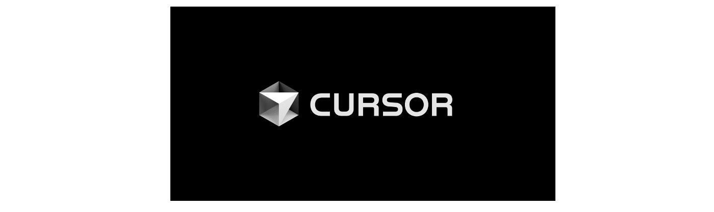

안녕하세요, 테크편집부입니다.  
SK플래닛은 창립 때부터 개발자의 업무와 문화를 더 잘 이해하는 **개발조직 주관으로** (CTO, 개발그룹, 테크센터 등) **개발자의 성장**을 위한 다양한 프로그램을 매년 발굴 및 운영해 왔습니다(Tech Academy, 신입개발자 Bootcamp, Coursera 등 MOOC, Agile Coaching, DTC, AI/Cloud/Web3 및 SW Engineering 교육 등).  
최근에는 특히 최태원 회장님께서도 업무에서의 AI 활용을 계속 강조하셨으며('이제는 AI를 업무에서 갖고 노는 수준 되어야', 2025년 이천포럼), 교육도 OI(Operational Improvement)를 고려하면서, 또한 단순 개발 툴 소개나 1회성 트렌드 공유 차원이 아닌 MCP, Agentic AI, ADLC 등 쏟아지는 개발 패러다임을 어떻게 우리 상황을 고려하고 업무 프로세스에 잘 녹여 생산성 향상과 프로덕트 개발에 반영할지에 대한 고민을 병행하면서 업무를 고려한 교육 프로그램을 담당자와 실무자가 함께 기획 및 운영하고 있습니다.

본 글에서는 2025년 초부터 3분기까지 진행되었던 테크 인사이트 세미나, 실습 중심의 Tech Upskilling 및 Reskilling 교육, 기술 블로그 활용 중심으로 간략하게 정리하여 공유드립니다.  
(꼼꼼히 읽어 보셔도 좋고 시간이 없으신 분들은 제목/이미지 위주로 빠르게 skim하셔도 좋겠습니다) 

---
# 0. 2025년 추진 방향 

2025년 목표는 시장 대비 개발자 경쟁력 강화와 사내 프로덕트의 적시 런칭을 위한 skill 보유를 목표로 하였고, 기술 방향은 **AI, Tech(개발 및 인프라를 포괄)** 육성 방향은 **Upskilling, Reskilling**의 두 축으로 잡았습니다. 방식은 핸즈온/세미나/정보공유/(아직 진행하지는 않았지만)해커톤 등의 이벤트 방식 등 유연하고 다양한 방식을 제공하고자 하였습니다. 

* AI는 프로덕트 개발, AI Coding, Workflow 로 정의하며 2025년에는 **프로덕트 개발과 AI Coding**에 포커스. 
* 테크는 구성원 및 조직 니즈 **우선순위** 가 높은 분야 중심으로 먼저 교육 프로그램화하여 **Upskilling**(k8s, Redis, Kafka 등)
* 특히 **Reskilling** 필요 대상자에게, 가급적 빠르게 과제 투입 전에 필요한 기본역량을 제공하는 것을 목표로 함. 
* **기술 공유**는 오프라인 세미나와 온라인 세미나/정보공유(테크 블로그 등). 필요 시 해커톤/블로그톤 등 이벤트 시행('24년 동일한 목표  공유 차원의 [사내 프롬프톤 행사](https://techtopic.skplanet.com/skp-prompthon24/) 기 시행). 

--- 

# 1. AI & 테크 인사이트 세미나 (2025) 

사내 DTC(Data & Tech Committee) 등 다양한 사내 채널에서 외부 전문가를 모시고 테크 인사이트 세미나를 진행하고 있으며, 지금까지 진행된 내용을 정리합니다. 

 
## 1) GitHub Copilot UNIVERSE 리캡 판교 (2월) 

GitHub Copilot의 전사 확대도입 이후 **'24년 11월 말과 '25년 2월 Microsoft 및 GitHub에서 공식 발표된 GitHub Copilot의 신기술 중심으로 세미나를 진행**하였습니다. 마침 발표 전날 지금은 주력으로 사용하고 있는 Agent Mode가 당시 공개되었는데 해당 내용도 발표에서 언급할 수 있었습니다. Microsoft 손건 님과 GitHub APAC 이재민 님께서 함께 해 주셨으며, 이후 ㅇㅇㅇ명의 엔지니어들이 현업에서 **코파일럿 기업용 버전을 개발 도구로 사용하여 개발 생산성을 높이고** 있습니다. 

(참고) SK플래닛 개발자들의 GitHub Copilot 활용기 => [(링크)](https://techtopic.skplanet.com/github-copilot/)

## 2) NVIDIA GTC 2025 리캡 세미나 및 MCP 소개 (3월) 

올해 3월에 미국 산호세에서 열린 **엔비디아의 GTC(GPU Technology Conference) 2025 동향을 가장 빠르게 리캡**할 수 있어서 AI 동향 파악에 많은 도움이 되었던 세미나였습니다(세미나 만족도 4.7 / 5점척도). 참고로 GTC 2025는 3월 16일에서 19일 산호세에서 개최되었는데 저희 세미나는 3월 31일 판교였으니까 꽤 빠른 편이었다고 할 수 있습니다 : ) 발표는 KAIST 김재철AI대학원에서 CAIO 과정 등을 진행하시는 장동인 교수님께서 열정적으로 강연을 해주셨습니다. 

또한 마침 이 때가 Anthropic에서 정의한, 지금은 너무도 유명해진 **MCP(Model Context Protocol)** 가 막 뜨기 시작하는 타이밍이어서 함께 요청을 드렸고, 흔쾌히 수락해 주셔서 적시에 구성원들에게 빠르게 소개해 드렸던 기억이 납니다. 

## 3) Cursor 개발조직 도입 및 활용 사례 공유 (3월) 

GitHub Copilot뿐만 아니라 (당시에는 매우 핫했던) 애니스피어사의 **Cursor** 도입을 위한 사전 준비로, 이미 잘 활용하고 있는 **타 조직의 프랙티스를 공유**하기로 하였습니다. 

발표는 G사 이노베이션 랩 김헌기 팀장님을 모시고 사례 공유를 진행하였으며(양 사의 **오픈 네트워킹 차원**에서 흔쾌히 강연을 수락해 주셨습니다 - 저희도 공유를 해야 하는데...), 주요 내용은 **1) 프로젝트 코드 리뷰 2) 검증된 프로젝트 패턴의 표준화 및 재사용 3) 레거시 코드 마이그레이션 자동화 4) 오픈소스 프로젝트의 활용 6) 생성형 AI 앱 개발 접근성 향상** 등이었으며, 실제 실습 내용이 일부 포함되어 있어서 off-the-record로 강연을 진행하였습니다. 참고로 G사는 지금도 클로드코드 등 AI 도구를 활용하여 여러 개발 단계에서  실험들을 계속하는 모범적인 사례를 공유해 주고 계십니다. 

(https://cursor.com/) 

## 4) 비즈니스와 현업에서 RAG, Agent 및 바이브코딩 사내 도입 사례 공유 (8월)  

우리나라에서 AI 하시는 분은 거의 다 아시는 바로 그! 테디노트 이경록 대표님께서 판교에서 강연해 주셨습니다. 연사님 소개는 문답무용(!)일 것 같고 : ) 발표 내용을 간단히 정리하였습니다.. 

* a. RAG·에이전트 도입 확산과 LangGraph 중심의 고도화 흐름 - 2024년은 단순 RAG 도입을 넘어 평가체계, 지연시간 개선, 출처표기, 온프레미스 구축, 복잡 문서 처리 등 현업 니즈에 맞춘 고도화가 이뤄지고 있음. LangGraph는 노드 재사용, 메모리 관리, 쉬운 배포 등의 장점으로 RAG/에이전트 개발에 빠르게 채택되고 있으며, 국내외 기업(J, K, L 등) 도입이 증가 중임.

* b. 바이브 코딩 코드보다 과정 중심의 새로운 개발 패러다임 - OpenAI의 카파시가 언급한 바이브 코딩은 “코드를 거의 작성하지 않고 말로 서비스 구축”하는 방식으로, Claude Code 등 AI 코딩 툴을 통해 개발 생산성이 5~10배 증가함. 결과보다는 과정 중심의 평가 체계 전환과 PRD, MCP, 참조 코드 기반 시스템 구축이 필수로 제시됨.

* c. 기업에서의 시사점: ‘개인의 역량’이 아닌 ‘조직의 시스템화’가 핵심 - AI 활용 격차는 개인 능력보다는 도구와 협업 체계의 성숙도에서 발생. 기업은 단순한 AI 교육이 아니라, 누구나 고품질 서비스를 만들 수 있는 바이브 코딩 시스템과 MCP 기반 워크플로우를 구축해야 함. AI가 코딩의 90%를 담당할 미래에 대비한 전략적 조직 전환이 요구됨.

(GPT로 생성한 바이브코딩 이미지입니다)

덧. 한빛+에서 올해 진행한 최강의 행사, 9월 ['데브그라운드 2025 with Upstage'](https://devground2025.hanbit.co.kr/) 에 갔었는데 약 1개월 사이에 테디노트 님 발표내용이 버전 업 되었었습니다 : )
실험적으로 야심차게 진행했던 바이브코딩 사내 프로젝트는 그 한달 사이에도 코드 검증을 위해 잠재적으로 중단을 선언하셨습니다(당연한 귀결이겠지만 AI가 만든 코드는 개발자가 다 이해하는 것을 전제하는 것으로 했구요. 다시 한번 AI는 도구이고 개발의 최종 책임은 개발자에게 있음을 Lessons Learned할 수 있었던 시간이었습니다. 여담으로 신규입사 개발자가 바이브코딩 한다는 JD 보고 들어왔는데 이제 안하냐고 물어서 잠시 난감해 했다는 후문이...) 

(https://devground2025.hanbit.co.kr/)

덧. 당시 현장 분위기는 SK데보션 블로그 글을 참고하세요! 현장감이 잘 살아 있습니다 :) 
https://devocean.sk.com/blog/techBoardDetail.do?ID=167950  
덧2. 올해 가장 핫한 연사 중 한 분인 하용호 님을 저희 테크 세미나(4분기 DTC)에 섭외하려고 했으나 국가전략회 일정 등으로 이번에는 어렵게 되었습니다. 다음 기회에 꼭 뵙기를 희망합니다 : ) 
 
 

## 5) 사내 Agent특강 (9월) 

본 발표는 전사 HRD 부서의 'AI 활용사례 공유' 행사의 일환으로 진행되었으며, 요즘 가장 핫한 김덕진 교수님(세종사이버대)과 진대연 CSO님(모멘트스튜디오)을 섭외해 주셔서 함께 소개해 보았습니다 : ) 
 
 

--- 

# 2. Tech Upskilling 핸즈온: AI 개발, AI Coding, 대용량 데이터 처리 및 컨테이너

## 1) RAG & AI Agent 개발 실습 교육 (3월) 

핫한 AI 도서로 인기를 날렸던 **'LLM을 활용한 실전 AI 애플리케이션 개발'** 을 집필한 허정준 개발자님을 강사로 모시고 1일 과정으로 사내 교육을 진행하였습니다. SK그룹 교육기관인 mySUNI와 하이닉스 등에서도 강연을 진행하셨다고 하는데요, 본 교육은 올해 초에 진행했고 많은 내용을 1일에 압축하느라 일반 개발자들(백엔드 개발자가 가장 많았음)에게는 조금 어려웠다는 피드백도 있었지만 LLM의 원리나 우리 서비스에 적용되었던 LLM의 기능에 대해 이해할 수 있었으며 열정적인 강사님의 진행으로 **특히 현업에서 AI Product를 준비중이거나 개발하고 있는 부서의 엔지니어 만족도가 높은 교육**이었습니다(교육을 마치고 개별적으로 Q&A를 받았는데 친절하게 일일이 잘 답변해 주셨음). 

(허정준님 집필 기술도서: https://product.kyobobook.co.kr/detail/S000213834592) 

## 2) 도커 & 쿠버네티스 배포 및 모니터링 핸즈온 (장철원 님) (3,4월) 

N사, K사 현역 엔지니어 출신의 장철원 마도학자 대표님을 모시고 상반기 실습과정을 진행하였습니다. 본 주제 관련 사내 니즈가 워낙 많아서 개설하게 되었는데 강사님 기술 전달 스킬도 넘 좋아서 **추가 차수를 만들어 교육을 진행할 정도로 반응이 좋았던 교육**이었습니다. 주요 내용은 k8s를 활용한 웹 서비스 배포 및 모니터링까지 실습하는 것을 목표로 진행하였고, 사내망 환경에서 일부 실습이 어려울 것까지 꼼꼼하게 준비하신 강사님의 준비성이 돋보인 강의였습니다. 

(장철원님 집필 기술도서: https://product.kyobobook.co.kr/detail/S000213057687) 

## 3) 대용량 데이터 처리를 위한 레디스 1 Day 장애실습 핸즈온 (5월) 

**국내 최고의 ~~싱카볼~~ 레디스 전문가** 강대명 님을 어렵게 모시고 ^ ^ 판교에서 교육을 진행할 수 있어서 감사하게 생각합니다. 마침 교육기간이 레디스 8로 버전업된지 얼마 안된 시점이어서 다양한 지식과 풍부한 경험을 강연에 풀어주셨었는데요, **기본 개념부터 장애 모의실습까지** 정말 알찬 내용의 교육을 해주셨습니다(알고보니 웬만한 회사들이 다 그분의 교육과 컨설팅을 거쳐갔다는...). 교육이 끝난 후에도 **사내 개발자들이 사내 컨플루언스에 자발적으로 후기를 쓰고 내용을 공유하는 등** 역시 개발자 만족도가 매우 높은 교육이었습니다. 주요 커리큘럼은 기본 사용법 및 캐시 전략, 내부 자료구조, Failover, Cluster, 장애 확인실습 및 분석 회고 등을 진행해 주셨습니다. 

(강대명님 집필 기술도서: https://product.kyobobook.co.kr/detail/S000218148637)

## 4) GitHub Copilot을 활용한 Figma MCP 핸즈온 교육 (5월) 

본 교육은 **사내 프론트엔드 개발자가(물론 다른 직군도 가능) GitHub Copilot 최신 Agent Mode 및 Figma MCP를 활용하여 디자인 시스템을 실습 구현하는 것을 목표로 진행**해 보았고, Microsoft 이보라 님[(GitHub)](https://github.com/violet-bora-lee)께서 함께 해 주셨습니다. Microsoft MVP답게 깃헙 코파일럿 활용 꿀팁 소개도 함께 해 주셔서 많은 도움이 되었던 프로그램이었습니다.

덧. 본 교육의 내용을 참고하여 한 사내 개발자 분께서는 [**본인의 Figma MCP 활용기**](https://devocean.sk.com/search/techBoardDetail.do?ID=167571)를 VWBE*하게 개발-사내공유-블로그 포스팅까지 해 주셨습니다(이 글 작성시점 SK 데보션 조회수 11,000+ 기록중) 

(* VWBE: Voluntarily, Willingly, Brain Engagement - '자발적이고 의욕적인 두뇌활동' 이라는 뜻으로, SK 고유의 기업문화 중 하나를 설명하는 사내 용어입니다)

(https://devocean.sk.com/) 

~~그밖에도 국내 전문가 분들과의 바이브코딩 핸즈온, AI Frontier 집중교육, 사내 해커톤 등을 진행/준비하고 있습니다!~~ 

---

# 3. 직무변경 대상자의 빠른 현업 적응 지원: Tech Reskilling 교육 
 
2분기 사내 조직변경에 따라 일부 엔지니어들의 이동 및 직무변경이 이루어졌습니다. 예를 들어 이번에 새롭게 백엔드 개발자가 되신 분들은 (아카데믹하게는 좀 다뤄보신 적이 있으셨으나) 이전 조직/커리어에서는 미디어 도메인에서 C++을 사용하시던 최적화 엔지니어 분들이셨는데 이번에 자바/스프링을 실무 과제에서 다루게 되셨습니다. 웹 프론트엔드나 데이터 분석/엔지니어링 직군으로 변경하시는 분들도 계셨구요. 

**따라서 이분들의 빠른 현업 적응을 돕고자** **Reskilling 과정을 기획 및 진행**하게 되었습니다.

* 대상: **웹 프론트엔드, 백엔드, 데이터 엔지니어링 직군 ㅇㅇ명**
* 방향: 현업과제 시작 전에 교육, 자료, 팀 동료를 통해 기본지식/스킬을 접할 기회 제공 
* 과정 설계 및 선택: 현업과 상의하여 과정 내용 설계 및 인프런 비즈니스 과정 중 필요과정 pick
* 오프라인 과정 예시: 자바 스프링 핵심과정 (백엔드), 리액트/타입스크립트 핵심과정 (프론트엔드)
* 온라인 과정 예시: 토비의 클린 스프링(백엔드), 한입 크기로 잘라먹는 Next.js(프론트엔드), Airflow 마스터클래스(데이터) 등 
* 오프라인 종합 만족도: 4.7 / 5점 | 온라인 종합 만족도: 4.3 / 5점 
* 주요 피드백: **오프라인 + 온라인 연계교육 효과(현업 적응시간 단축)**. 교육에서 얻은 지식으로 실제 현업수행에 도움
* 기타: AI 코딩도구 지원 도움(현업 활용비율 77%). 더욱 향상된 도구(클로드코드 등) 도입 검토 희망. 

(인프런 비즈니스 관리자 페이지 메인)

---

# 4. 회사 기술 블로그 활용: as tech writing 'playground' 

국내외 많은 IT기업들처럼 저희도 기술 블로그를 다양한 목적으로 활용하고 있습니다. 

여러 가지 전략 및 활용 방안이 있지만, 당사에서는 **구성원의 역량개발 및 성장 관점에서도** 기술 블로그의 활용도를 높이려고 합니다. **개발 결과를 회고하고 정리하는 내용을 담는 도구로써, 성장에 도움되는 기술 정보를 공유하는 도구로써, 그리고 AI 시대에 더욱 중요해지는 개발자의 Tech Writing을 위한 'Playground'로써** 온라인과 오프라인을 연결하면서 외연을 넓혀 가고자 합니다(참고로 국내 Top PV 수준의 SK데보션 블로그를 참조 모델로 하고 있습니다).  
2025년 기준으로 양적으로는 스퀘어 관계사 대비 약 2배 이상의 글을 작성하고 있으며, 월평균 상반기 1회에서 하반기 2-3회 수준으로 포스팅하고 있습니다. 

(SK planet 기술 블로그 Tech Topic)

덧. 지난 7월 진행하였던 Tech Topic 기술 블로그 개선 실험 내용은 여기를 참조하세요 => [(링크)](https://techtopic.skplanet.com/techblogupdate1/)

---

# 5. SK 데보션 프로 활동 및 SK AI SUMMIT 2025 발표 참여 

## 1) SK 데보션 프로 활동 참여

(https://devocean.sk.com/)  
 
* 구성원 측면: 데보션 프로 활동을 통해 개발자 퍼스널 브랜딩 활동 지원 (국내 1위 PV 블로그 플랫폼 활용 가능)
* 회사 측면: 당사 구성원의 적극적인 활동을 통해, 매년 데보션 홍보 때마다 SKT, SK하이닉스와 함께 회사 이름이 매년 기사에 언급됨
* 기타: 다양한 분야의 기술 전문가 네트워킹 및 커뮤니티 활동 가능 
* 효과: 1만+ ~ 수천 조회수의 글 작성 및 기고, 우수 활동 시 기여보상 및 발표 기회 제공 

## 2) SK AI SUMMIT 발표 

(https://www.skaisummit.com/)  

SK플래닛에서도 이번 [SK AI SUMMIT 2025](https://www.skaisummit.com/) 에서 2건의 발표를 하게 되었습니다(작년에는 1건). 

* 어떤 광고가 돈이 될까? AI 기반 광고 수익 최적화 (11/3(월)), 17시, 203호) 
* 내 목소리가 말하고, 노래한다! AI가 만들어준 나만의 목소리 (11/4(화)), 15시, 205호)

DTC 등 사내 발표뿐만 아니라 AI SUMMIT에서 외부 발표의 기회를 제공함으로써 회사의 사례공유와 동시에 개발자들의 성장 및 개발자 퍼스널 브랜딩의 기회를 함께 제공하고 있습니다. 발표 내용은 SK AI SUMMIT 공식 유튜브에 녹화본이 올라가며, 당사 Tech Topic 블로그에도 정리되어 올라갈 예정입니다(기회가 되면 별도 페이지에서 내용을 공유하도록 하겠습니다). 

--

# 맺으며  

대 AI 시대에도, AI '구성원' 과 함께 일하며 비록 개발자의 역할 '일부'가 바뀔지라도, 그럴수록 휴먼 개발자의 성장과 이를 위한 기업의 노력은 투자 또는 Operational Improvement(단순 비용절감이라는 저차원적인 발상이 아닌 업무의 혁신/개선을 포함한 개념) 차원에서 더욱 필요할 것이며, 이것이 선순환 관계를 이루어 기업과 개인이 함께 성장하여 기업의 이윤 추구, 내부 고객(개발자)의 만족(DevEx)과 나아가 고객 만족을 함께 이루는 지혜로운 길의 선택이 계속 이어지기를 바랍니다. 

감사합니다. 
