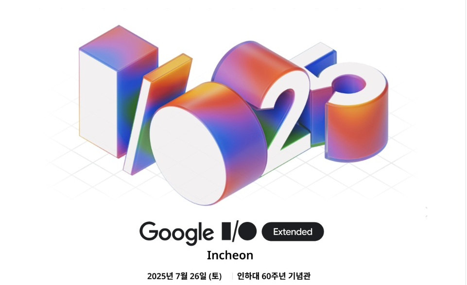
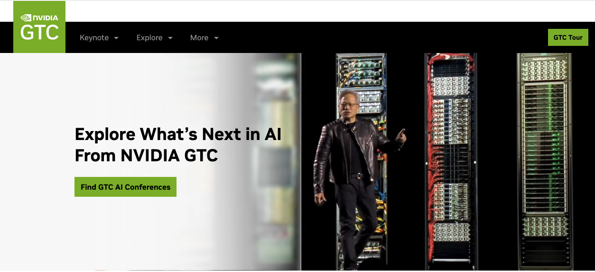

<<추가>> 10/1일자로 새로운 내용을 업데이트하였습니다. [링크](https://techtopic.skplanet.com/techseminar2025-4Q/) 를 참조하세요!
* SK AI SUMMIT 2025 및 클로드코드 해커톤 
* 팀네이버 컨퍼런스 DAN25 
* 우아콘 2025 등등

--- 
안녕하세요, 이 글에서는 여러 곳에서 열리는 **국내외 기술 세미나 & 컨퍼런스 주요 정보**를 한 곳에 정리해 보았습니다.  
저희 업무에도 활용할 겸 최신 정보를 정리하면서, 개발자 여러분들도 함께 참고하실 수 있도록 현재까지 공개된 주요 기술 행사 일정들을 공유드리오니 참고하시기 바랍니다. 

### 목차 (연중 추가될 수 있음)
* 7월: TOSS MAKERS CONFERENCE 25 | Google I/O Extended Incheon 2025 | 한빛미디어 북토크('코드 너머' DevRel 세미나) | OKKY 7월 세미나: '개발자의 문장력'  
* 8월: 파이콘 한국 2025 | FEConf2025
* 9월: KWDC25 | KBW2025 | lab | up > /conf/5 | ISMIR 2025 
* 10월: OpenAI DevDay 2025 | GitHub UNIVERSE25 
* 11월: SK AI SUMMIT 2025 | AI SUMMIT SEOUL & EXPO 2025 
* 12월: AWS re:Invent 2025 
* 미공개: 네이버 DAN25 | if(kakaoAI) 2025 | 우아콘 2025 | SDC Korea 2025 | 모두콘 2025 등
* '26.1Q: CES26 | MWC26 | (NVIDIA GTC26)
 

# [2025년 7월] 
--- 
### (1) TOSS MAKERS CONFERENCE 25 

* 한줄설명: 올해 'Every Maker, Every Tech' 라는 주제로, 토스에서 프로덕트/디자인/개발 '통합' 컨퍼런스를 3일간 진행합니다 - 종전에는 SLASH(개발), Simplicity(디자인) 등으로 나누어 진행.
* 일시/장소: 7월 23일(수) - 25일(금), COEX 그랜드볼룸
* 참가자 신청: 7월 13일(일)까지 접수를 받습니다(무료, 추첨 후 7/16 결과발표) => https://toss.im/tmc-25
* 참고사항(7/13 기준): 날짜별 주제가 상이하며, 편의를 위해 한 날짜만 신청 가능합니다. (예: Day3 - Engineering Day) 

### (2) Google I/O Extended Incheon 2025 

* 한줄설명: Google I/O 현재 참관기 등 5개 트랙, 총 27개 세션 + Hands-on 워크숍 - Google 개발 생태계의 최신 기술과 현장의 목소리를 인천에서 만나세요! 
* 일시/장소: 7월 26일 (토) 13시-18시, 인하대 60주년 기념관 (인천 미추홀구 인하로 100) 
* 참가자 신청: 7/13 현재 접수중(유료, 일반/학생) => https://www.ticketa.co/events/7
* 참고사항(7/13 기준): 없음

### (3) 기술보다 강한 '나'를 만드는 실전 커리어 전략 (한빛미디어 북토크)  

* 한줄설명: 삼성전자, 우아한형제들, SKT, 카카오페이, (전)토스 DevRel 실무자의 생생한 이야기를 소개합니다! 
* 링크: https://event-us.kr/FKH3nHkjmPGh/event/107750
* 일시/장소: 07월 25일(금) 19:00 ~ 22:00, 서울 서대문구 연희로2길 62 한빛미디어 B동 1층 리더스홀
* 참가자 신청: 7/13 현재 접수중(유료, 선착순 100명) => https://event-us.kr/FKH3nHkjmPGh/event/107750
* 참고사항: '코드 너머, 회사보다 오래 남을 개발자' 도서 출간 기념 북토크 행사입니다.

### (4) '개발자의 문장력 - 협업을 살리는 소프트스킬의 힘' 특강 (OKKY 7월 세미나)

* 한줄설명: 제목이 설명 그대로를 말해줍니다 : ) 
* 일시/장소: 7월 29일(화) 19시-21시, 서울 강남구 역삼로 168 팁스타운 S6 지하1층 세미나실
* 참가자 신청: 7/13 현재 접수중(유료, 선착순 50명) => https://okky.kr/events/webinars/1537740
* 참고사항(7/13 기준): CJ올리브영 DevRel Specialist 최가인 님께서 발표해 주십니다. 

 

# [2025년 8월] 
--- 
### (1) 파이콘 한국 2025  

* 한줄설명: 국내 최대 파이썬 컨퍼런스로 AI개발부터 파이썬 사용기까지 다양한 발표를 진행합니다(올해 주제: 'Weave with Python'). 
* 링크: https://2025.pycon.kr/
* 일시/장소: 2025년 8월 15(금) ~ 17(일), 동국대학교 서울캠퍼스 신공학관 
* 참가자 신청: 7/13 현재 접수중(유료), 튜토리얼 티켓 판매(7/7-8/1), 일반 참가자/개인 후원자 티켓 판매(6/15-8/17, 소진시까지)  
* 기타: 파이콘 한국은 커뮤니티 주관으로 이루어지는 비영리 개발자 대상 행사로, 오픈 소스인 파이썬의 저변 확대 및 커뮤니티의 활성화를 목표로 합니다.  

### (2) FEConf2025 

* 한줄설명: FEConf는 국내외 프론트엔드 개발자들이 한자리에 모여 경험을 나누고, 기술의 흐름을 함께 만들어 가는 행사입니다(국내 최대 프론트엔드 개발자 행사). 
* 링크: https://2025.feconf.kr/
* 일시/장소: 2025년 8월 23일(토) 세종대학교 광개토관 
* 참가자 신청: 접수 전 (7/13 기준) (유료) 
* 기타: 7/13 현재 위 링크를 통해 스피커(연사) 및 라이트닝 톡 발표자 모집을 받고 있습니다(후원사도...). 

(참고) 아쉽게도 매년 8월 열렸던 인프콘은, 올해는 열리지 않는다고 합니다(내년에...?). 

(작년 웹사이트 이미지입니다)

* 관련 글(이형주 대표님): https://www.inflearn.com/pages/notice-20250618-infcon 
* 인프콘 다시보기: https://www.youtube.com/playlist?list=PLpkj8RKr48wZQXN874PP1hJkaRm6qcvZg

 

# [2025년 9월] 

### (1) KWDC25 

* 한줄설명: KWDC(Koreawide Developer Conference) 주관 한국 애플 생태계 컨퍼런스 (개발자, 기획자, 디자이너를 모두 아우르는 행사)
* 링크: https://kwdc.dev/ko/2025/
* 일시/장소: 2025년 9월 5일(금), 양재 aT센터 5층 그랜드홀 
* 참가자 신청: https://www.ticketa.co/events/12 (유료) 
* 기타: 7/13 현재 프로그램 공개 전입니다. 

### (2) Korea Blockchain Week(KBW2025) 

* 한줄설명: 국내 최대 블록체인 행사로, 메인 컨퍼런스(IMPACT)와 다양한 사이드 이벤트를 진행합니다.  
* 링크: https://koreablockchainweek.com/ko
* 일시/장소: Sep 22-28 (IMPACT: Sep 23-24, Walkerhill Hotal & Resorts) 
* 참가자 신청: 7/13 현재 접수중 - https://tickets.koreablockchainweek.com/ (유료)  (7/31까지 Early Bird 접수중, 이후 Regular & On-site Pass 접수) 
* 참고사항(7/13 기준): 최근 이슈가 되는 스테이블코인 이야기는 얼마나 나올까요? 관전 포인트 중 하나입니다. 

### (3) lab | up > /conf/5 (제 5회 래블업 개발자 컨퍼런스) 

* 한줄설명: 래블업이 주최하는 기술 컨퍼런스 lab | up > /conf가 올해로 5회째를 맞이합니다. AI, HPC, 오픈소스 분야의 개발자와 엔지니어들이 모이는 래블업 컨퍼런스에서 경험과 인사이트를 얻어가세요! 
* 링크: 추후 공개 (주제: Make AI Composable) 
* 일시/장소: 2025년 9월 24일(화), 양재 aT센터 
* 참가자 신청:  접수 전 (추후 공개)  
* 참고사항(7/13 기준): 발표자 신청을 받기 시작했습니다(7/14-8/3, 결과발표 8/8) - https://www.backend.ai/ko/event/lablup-conf-5th

### (4) ISMIR 2025 

* 한줄설명: 국제 음악기술 컨퍼런스이나 올해는 국내에서 개최합니다(대전 카이스트). 
* 링크: https://ismir2025.ismir.net/
* 일시/장소: Sep 21-25, Daejeon, Korea 
* 신청: https://ismir2025.ismir.net/Registration (유료) (Basic & General 기준으로 Early Bird: ~Aug 4, Regular: Aug 5 ~ Sep 20, On-site: Sep 21 ~ 25, 1day Pass도 있음) 
* 참고사항: ISMIR = International Society for Music Information Retrieval Conference (음악검색 테마를 중심으로 AI기술 내용/발표를 포함합니다) 

 

# [2025년 10월] 

### (1) OpenAI DevDay 2025  

* 한줄설명: OpenAI에서 세 번째 개최하는 개발자 컨퍼런스입니다. 
* 일시/장소: October 6, San Francisco (현지시간)
* 신청: 7/13 현재 등록 알림메일 신청이 가능합니다 => https://www.devday.openai.com/
* 참고사항: 2024년에는 샌프란, 런던, 싱가폴 세 곳에서 컨퍼런스를 진행했었습니다. 

### (2) GitHub UNIVERSE25 

* 한줄설명: GitHub의 연례 기술 컨퍼런스. 최근 수년간 GitHub Copilot 신기술 발표 중심. 
* 링크: https://githubuniverse.com/
* 일시/장소: October 28 ~ 29, San Francisco, CA
* 신청: In-person and virtual (Early Bird: - Sep 8) (Virtual Pass: Free & Always) 
* 참고사항: 샌프란에서 발표되는 내용을 중심으로, 2개월 전후로 국가별로 내용을 보강하여 매년 리캡 세미나를 진행하고 있습니다(예: UNIVERSE24 Recap Seoul, Tokyo 등).

 

# [2025년 11월]

### (1) SK AI SUMMIT 2025

* 한줄설명: SK의 대표 기술 컨퍼런스인 SK TECH SUMMIT이 '24년부터 SK AI SUMMIT으로 새롭게 개최하였습니다. 
* 링크: https://www.skaisummit.com/ (7/13 기준 2024년 내용) 
* 일시/장소: 11월 예정, 서울 코엑스 예정 (2024년에는 11/4 - 11/5, 코엑스에서 진행)
* 참가자 신청: 추후 안내 예정  
* 참고사항(7/13 기준): Youtube에서 지난 AI SUMMIT & TECH SUMMIT 발표내용을 보실 수 있습니다 - https://www.youtube.com/@skaisummit2024

### (2) AI SUMMIT SEOUL & EXPO 2025 

* 한줄설명: 산업 분야의 AI 통합·활용 전략 중심 국제 행사
* 링크: https://www.aisummitseoul.com/ (7/13 현재 프로그램 오픈 전) 
* 일시/장소: 2025년 11월 10일(월) ~ 11일(화)
* 참가자 신청: https://www.aisummitseoul.com/register (유료) 
* 참고사항(7/13 기준): (1)과는 별도의 행사로, MIT Technology Review를 발간하는 DMK Global에서 행사를 주관합니다.

 

# [2025년 12월]

### (1) AWS re:Invent 2025 

* 한줄설명: AWS(Amazon Web Services)의 대표적인 연례 기술 컨퍼런스입니다. 
* 링크: https://reinvent.awsevents.com/
* 일시/장소: Decemter 1 - 5, 2025 | Las Vegas
* 참가자 신청: https://registration.awsevents.com/flow/awsevents/reinvent2025/reg/createaccount (유료)

 

# [2025 일정 미공개 행사]
국내 주요 연례 컨퍼런스 중, 7/13 현재 일정 미공개 행사들입니다. 일정이 확정되면 상단으로 배치 예정입니다.
 

### TEAM NAVER CONFERENCE DAN25
(아래 이미지는 2024년 메인 페이지 스크린샷입니다) 

* 한줄설명: 네이버 연례 개발자 컨퍼런스로, 2024년에는 Deview와 통합하여 코엑스에서 2일간 진행하였습니다. 
* '24년 링크: https://dan.naver.com/24
* 참고사항(7/13 현재): 위 웹사이트에서 키노트 영상 다시보기 및 세션발표 자료 다운로드가 가능합니다. 

### if(kakaoAI) 2025
(아래 이미지는 2024년 메인 페이지 스크린샷입니다) 

* 한줄설명: 카카오 연례 개발자 컨퍼런스로, 2024년에는 10월에 Kakao AI 캠퍼스에서 3일간 진행하였습니다. 
* '24년 링크: https://if.kakao.com/2024
* 참고사항(7/13 현재): 지난 if kakao는 여기서 보실 수 있어요 => https://if.kakao.com/history

### 우아콘 2025
(아래 이미지는 2024년 메인 페이지 스크린샷입니다) 

* 한줄설명: 우아한형제들(배민)의 연례 개발자 컨퍼런스로, 2024년에는 10월에 파르나스 호텔에서 진행하였습니다. 
* '24년 링크: https://2024.woowacon.com/
* 참고사항(7/13 현재): 웹사이트 각 세션에서 다시보기 영상 확인이 가능합니다. 

### SDC Korea 2025 (Samsung Developer Conference Korea 2024) 
(아래 이미지는 2024년 메인 페이지 스크린샷입니다) 

* 한줄설명: 삼성전자 연례 개발자 컨퍼런스로, 2024년에는 11월에 온라인으로 진행하였습니다. 
* '24년 링크: https://www.sdc-korea.com/
* 참고사항(7/13 현재): https://www.sdc-korea.com/session 에서 다시보기가 가능합니다. 

### 모두콘 2025
(아래 이미지는 2024년 메인 페이지 스크린샷입니다) 

* 한줄설명: 모두의 연구소(모두연)의 연례 개발자 컨퍼런스로, 2024년에는 12월에 1 Day로 진행하였습니다. 
* '24년 링크: https://moducon.modulabs.co.kr/
* 참고사항(7/13 현재): 웹사이트 내 "영상 보러가기"를 클릭하시면 다시보기가 가능합니다.  
 

# [2026 1Q 행사]
2026년 일정이 확정된 행사는 아래의 해외 행사들입니다. 
 

### CES26 

* 한줄설명: 세계 최대 연례 가전 행사로, 국내 대기업에서도 다수 참여하며, 최근에는 AI 기술 전시/발표를 포함합니다. 
* '26년 링크: https://www.ces.tech/
* 일시/장소: January 6 - 9, Las Vegas (현지시간) 
* 등록: https://www.ces.tech/attend/registration-notification/ (유료)
* 참조: CES = Consumer Electronics Show 

### MWC26

* 한줄설명: 세계 최대 연례 모바일 통신 행사로, 국내 이동통신사에서도 매년 참여합니다. 
* '26년 링크: https://www.mwcbarcelona.com/
* 일시/장소: 2 - 5 March 2026 (현지시간) 
* 등록: https://www.mwcbarcelona.com/register-your-interest (유료)
* 참조: MWC = Mobile World Congress 

### NVIDIA GTC 2026

* 한줄설명: NVIDIA GTC 는 GPU 기반의 고성능 연산에서 출발해 현재는 AI, 로보틱스, 자율주행, 양자컴퓨팅 등 최첨단 기술을 다루는 개발자·연구자 대상 글로벌 기술 콘퍼런스임(2025년에는 3월 산호세에서 개최). 
* '26년 링크: https://www.nvidia.com/gtc/ (행사 업데이트 전) 
* 일시/장소: 2026년 3월 추정 
* 등록: 오픈 전 (유료) - 향후 GTC 2026 등록 오픈 및 뉴스를 위한 Sign Up 안내
* 참조: GTC = GPU Technology Conference 
 

# 마무리하며

지금까지 2025년 하반기 국내외 기술 컨퍼런스 및 세미나 정보를 정리한 내용을 공유드렸습니다. 
포스팅 시점에서 미확정 행사도 있고 '모든' 행사를 담거나 완전한 자동화는 아직은 어려워서, 큰 행사와 작은 밋업을 포함, 당사와 연관성이 많은 행사의 **소개 및 안내**를 겸하는 형식으로 small start를 해 보고, 하반기 중 **추가**해 나갈 예정입니다 - 업데이트 주기는 월 1-2회 정도 생각하고 있으며 올 하반기 실험적으로 진행해 보도록 하겠습니다. 

읽어 주셔서 감사합니다.

