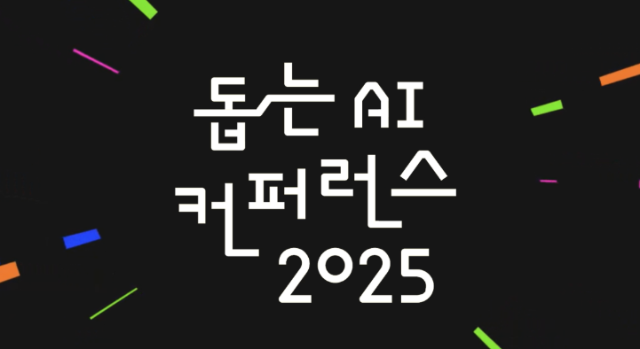
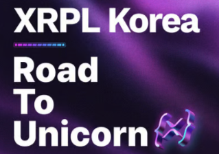
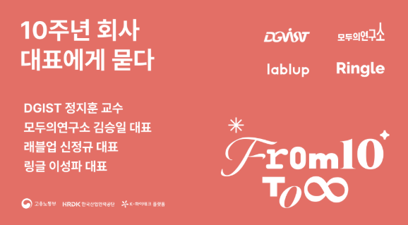
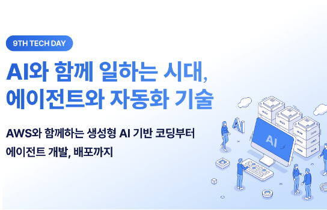
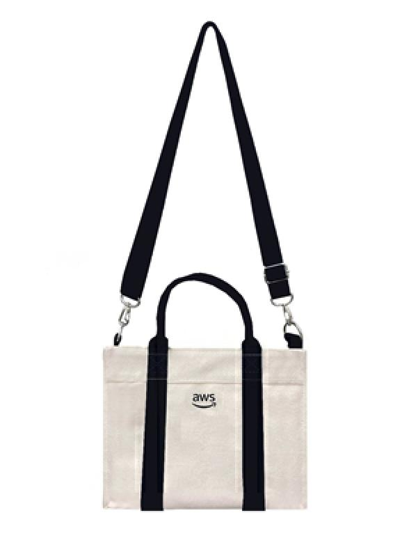
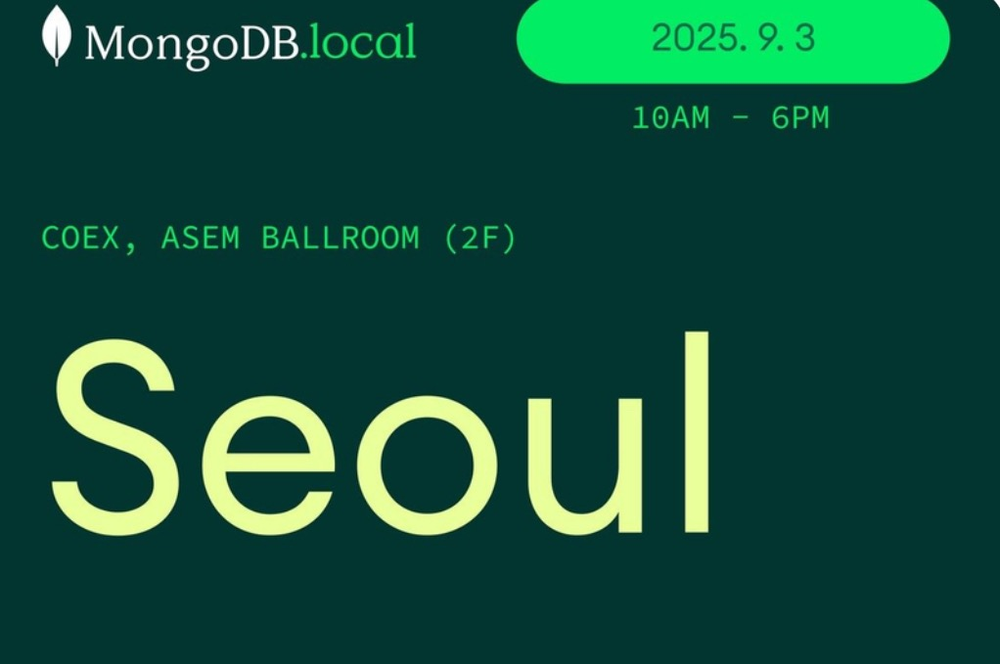
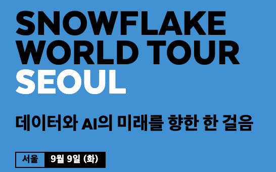
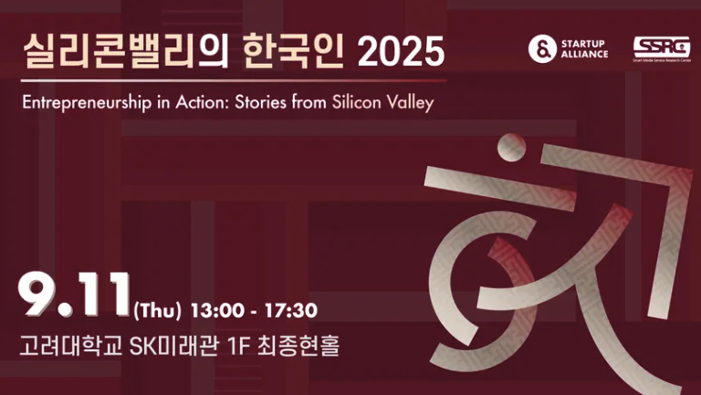
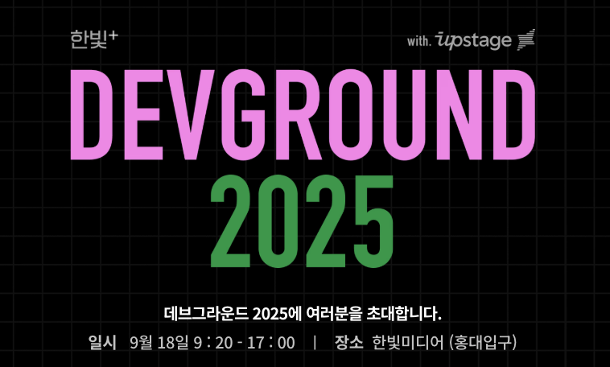
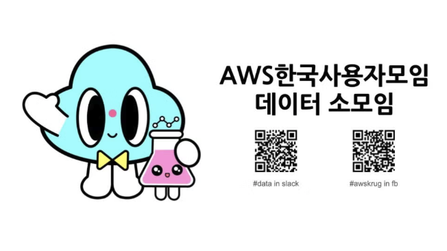

안녕하세요, 테크편집부입니다. 이번에도 저희 업무에 활용할 겸 최신 정보를 정리하면서, 개발자 여러분들도 함께 참고하실 수 있도록 현재까지 공개된 주요 기술 행사 일정들을 정리하였습니다.  
이번 페이지에는 8월 말-9월 중에 열리는 좋은 행사들이지만, 다른 블로그에는 잘 알려지지 않은 행사들 위주로 정리해 보았사오니 일정에 참고하시기 바랍니다(아래는 행사명 요약입니다).

- (8/25-26 월화) 돕는 AI 컨퍼런스 2025 (카카오임팩트)
- (8/27 수) XRPL Korea: Road to Unicorn (9월 해커톤 일정 포함)
- (8/30 토) 모두연 10주년 기념 발표
- (9/01 월) 9월 데보션 테크 데이: Agent와 자동화 기술
- (9/03 수) MongoDB.local Seoul 2025
- (9/09 화) SNOWFLAKE WORLD TOUR SEOUL
- (9/11 목) 실리콘밸리의 한국인 2025
- (9/18 목) 한빛 DEVGROUND 2025 (w/Upstage)
- (9/18 목) AWSKRUG 데이터모임: 2025년 9월 (Claude Code 사례)

덧. 지난번에 공유드린 행사 일정은 여기를 참고하세요! (9월에 한번 더 업데이트하겠습니다)
https://techtopic.skplanet.com/techseminar2025-2h/
  

# [8월 말]

## 돕는 AI 컨퍼런스 2025 (카카오임팩트)

* 분야: AI, 사회공헌
* 일시: 8/25(월)-8/26(화) 
* 장소: 삼성동 COEX Hall C 
* https://aicon.kakaoimpact.org/ (무료)
* 소개: 작은 기술일지라도 선한 방향으로 쓰이기 시작한다면? 세상은 달라지지라 생각합니다. 돕는AI 컨퍼런스는 이 질문에 대한 답을 함께 찾아가는 자리입니다. 테크포임팩트 2년간의 실험을 통해 검증된 '돕는 기술'의 가치를 공유하고, 사회문제 해결 현장에서 AI가 어떻게 진짜 변화를 만들어낼 수 있는지 구체적인 사례와 방법론을 제시합니다. (중략) 

## XRPL Korea: Road to Unicorn

* 분야: Web3, VC
* 일시: 8/27(수), 오후 6시-오후 10시
* 장소: 강남 해시드 라운지
* https://lu.ma/kq85kpsj?locale=ko (무료신청, 주최측 승인)
* 글로벌 블록체인 네트워크 XRPL(XRP Ledger)의 한국 커뮤니티 XRPL Korea가 주최하는 XRPL Korea : Road To Unicorn이 진행됩니다!
 
​아이디어·팀·시장, VC의 투자 우선순위부터 실제 투자 사례, 그리고 Web3 시장 전망까지 — 현장에서만 들을 수 있는 생생한 인사이트를 만나보세요!
 
​세션 후에는 XRPL Hackathon 2025 파트너 VC/AC 분들과 업계 관계자, 유망한 스타트업들이 함께하는 네트워킹 시간이 준비되어있습니다. 9월 해커톤 일정도 별도 안내되어 있으니 관심있으신 분들 참고하세요. 
  

## [모두팝] 10주년 회사 대표에게 묻다 - AI, 교육, 커뮤니티 이야기 ▶온라인 참석◀

* 분야: AI, TechEdu, 커뮤니티
* 일시: 8/30(토), 11:00-13:00 
* 장소: 온라인 Live 
* https://modulabs.co.kr/community/momos/398 (무료신청 후 링크 제공)
* 정지훈 교수, 신정규 대표, 김승일 대표, 링글 이성파 대표를 모시고 모두의연구소 10년, 무한한 가능성의 시작에 대해 이야기합니다.

# [2025년 9월] 

## 제 9회 SK데보션 테크 데이-AI와 함께 일하는 시대, 에이전트와 자동화 기술 (SKT)

* 분야: AI, Agent, AWS/Cloud 
* 일시: 9/1(월),  13:30 ~ 17:40
* 장소: 을지로 SKT타워 4층 SUPEX홀
* https://devocean.sk.com/events/view.do?id=210 (무료 사전등록)
* 국내 최고의 기술 블로그와 커뮤니티를 지향하는 SK데보션의 테크(AI)세미나(AWS와 함께 합니다) - AWS와 함께하는 생성형 AI 기반 코딩부터 에이전트 개발, 배포까지  
(SKT와 AWS 엔지니어의 실제 사례 발표로 진행됩니다)  
+ 참여자 전원에게 AWS 굿즈(가방)를 드린다고 합니다 : )  

## MongoDB.local Seoul 2025

* 분야: MongoDB/NoSQL, AI 
* 일시: 9/3(수), 10:00-17:45
* 장소: 삼성동 COEX 아셈볼룸 (2F)
* https://events.mongodb.com/mongodblocalseoul25 (무료 신청)
* 수많은 개발자들에게 사랑 받고 있는 MongoDB가 다가오는 2025년 9월 3일 수요일 단 하루, 삼성동 코엑스 컨벤션에서 연례 최대 행사를 개최합니다!  
글로벌 연사들의 주요 기조 연설과 업계를 이끄는 테크 기업들의 생생한 사용사례, 데이터 모델링 방법과 벡터 검색 초급부터 심화 기능까지 다루는 실습 랩을 만나보실 수 있습니다! (실습 랩은 다음 2개를 진행합니다)  
Lab 1 : MongoDB 데이터 모델링 (13:20-15:20)  
Lab 2 : MongoDB Vector Search (15:40-17:20)
 

## SNOWFLAKE WORLD TOUR SEOUL: 데이터와 AI의 미래를 향한 한 걸음 

* 분야: Snowflake/AI, Big Data 
* 일시: 9/9(화), 08:00-17:00
* 장소: 삼성동 COEX 컨퍼런스 센터(1-3F)
* https://www.snowflake.com/ko/world-tour/seoul/ (무료 신청) 
* 데이터와 앱 그리고 AI로 여는 새로운 미래! 오는 9월 9일(화), 서울에서 열리는 Snowflake World Tour에서 데이터와 AI 로 비즈니스 혁신을 이끄는 Snowflake의 최신 기술을 만나보세요.

## 실리콘밸리의 한국인 2025 (스타트업얼라이언스)

* 분야: IT, 실리콘밸리
* 일시: 9/11(목), 13:00-1730
* 장소: 고려대학교 SK미래관 1층 최종현홀
* https://www.startupall.kr/programs/info/26
* ‘실리콘밸리의 한국인’은 실리콘밸리와 미국 전역에서 활동 중인 한국인 창업자와 실무자들의 목소리를 직접 듣는 자리입니다. 10년 넘게 이어져 온 이 프로그램은 매해 다른 시선으로 실리콘밸리의 이야기를 담아왔습니다. 고려대학교 스마트미디어 서비스 연구센터와 함께 진행되는 2025년 행사는 커리어와 창업 두 축으로 구성해 Z세대·밀레니얼 세대가 글로벌 무대에서 진로를 고민하는 데 도움을 주고자 합니다. 미디어가 담아내지 못한 생생한 목소리, 그리고 그들의 고민과 선택. 실리콘밸리를 향한 동경 너머의 진짜 이야기를 함께 들어보세요.

## 한빛 DEVGROUND 2025 (w/Upstage)

* 분야: AI, Dev 
* 일시: 9/18(목), 09:20-17:00 
* 장소: 한빛미디어(홍대입구)
* 주요 연사: 박태웅 님, 하용호 님 등 
* https://devground2025.hanbit.co.kr/ (8:27 14:00 open) (신청: 이벤터스 선착순 유료 접수 - 5만원) 
* Vibe Up, Next Stage - AI와 개발의 미래를 함께 탐구하고, 실전 경험으로 풀어낸 개발자들의 이야기를 통해 Next Stage로 도약할 인사이트와 노하우를 나눕니다(AI 트랙과 Vibe Coding 2개 트랙이 함께 제공됩니다).
 

## AWSKRUG 데이터모임: 2025년 9월

* 분야: Claude Code/AI Coding
* 일시: 9/18(목), 19:00-
* 장소: 서울 강남구 테헤란로 231 센터필드 EAST 18층 18.301, 18.400
* https://www.meetup.com/ko-KR/awskrug/events/310626090/ (유료, 1만원)
* 세션: Claude Code 알고 쓰자 (최종원 데이터 엔지니어, 딜라이트룸 - Claude Code 창시자의 철학을 따라가보며 내부 동작을 깊이있게 분석했던 사례를 공유합니다)

 
 
덧 1. 국내 대기업 & 해외 행사들은 아래를 참고하세요.

* KT 해커톤(K intelligence 해커톤 2025): https://dacon.io/competitions/official/236553/ (온라인 예선 진행중, 오프라인 본선 9/20)
* LG SDC 2025: https://www.lgsdc.com/ (9/23-9/25, 참가신청: 8/25(월) 09시부터)( ~~사내 개발자 행사로 알고 있는데 웹사이트는 외부 오픈되어 있음~~ : Day 1 키노트 발표자가 DEF CON 33 우승팀인 티오리 박세준 대표가 포함된 것이 눈에 띔)
* 삼성 SDS의 REAL SUMMIT 2025: https://www.realsummit2025.com/ (9/11, 코엑스)
* Dell Technologies Forum: https://events.dell.com/event/edd57c8d-820b-4501-b95a-3a3055fedfb2/agenda (9/17, COEX)
* Meta Connect 2025: https://www.meta.com/ko-kr/connect/ (9/17-18, Livestream)

덧 2. 기타 행사 정보는 지난 링크를 참고하세요! https://techtopic.skplanet.com/techseminar2025-2h/
  9월 중에 한번 더 업데이트하겠습니다. 

* 9월: KWDC25 | KBW2025 | lab | up > /conf/5 | ISMIR 2025
* 10월: OpenAI DevDay 2025 | GitHub UNIVERSE25
* 11월: SK AI SUMMIT 2025 | AI SUMMIT SEOUL & EXPO 2025 
* 12월: AWS re:Invent 2025 
* 미공개: 네이버 DAN25 | if(kakaoAI) 2025 | 우아콘 2025 | SDC Korea 2025 | 모두콘 2025 등
* '26.1Q: CES26 | MWC26 | (NVIDIA GTC26)

# 마무리하며

아직 포스팅 시점에서 미확정 행사도 있고 '모든' 행사를 담거나 완전한 자동화가 조금 어려워서, 큰 행사와 작은 밋업을 포함, 당사와 연관성이 많은 행사의 **소개 및 안내**를 겸하는 형식으로 조금씩 **추가**해 나가고 있습니다 - 조금 더 실험적으로 진행하면서 유익한 정보를 제공해 보도록 하겠습니다. 

읽어 주셔서 감사합니다.

