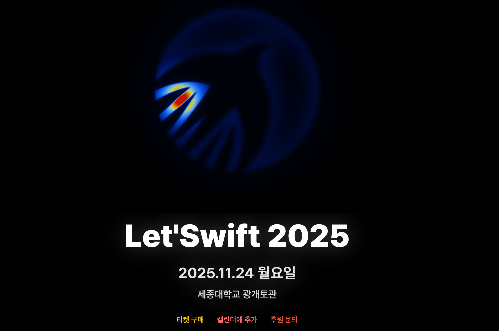

안녕하세요 테크편집부입니다, 처음 이 글을 올린지도 시간이 꽤 흘렀네요!   
**2025년 4분기 기술 컨퍼런스 정보**를 10월 1일자 정보로 업데이트하였사오니 많은 참고 부탁드립니다.  

(11월에 진행되는 [**SK AI SUMMIT 2025의 웹사이트**](https://www.skaisummit.com/) 도 마침 오늘 오픈하여 관련 정보를 함께 공유드리며, 본 행사와 함께 [**Claude Code Builder Hackathon**](https://devocean.sk.com/community/hackathonInfo.do) 부대행사가 함께 열린다고 해요!) 

### 목차 (연중 추가될 수 있음)
* 10월: OpenAI DevDay | Datadog | 우아콘 | UNIVERSE25 | 
* 11월: K-Devcon | SK AI SUMMIT + Claude Code 해커톤 | DAN 25 | AI SUMMIT SEOUL | Ignite | Let'Swift
* 12월: AWS re:Invent 
* 일정 미공개: SDC Korea | 모두콘 
* '26.1Q: CES26 | MWC26 | (NVIDIA GTC26)
 

# [2025년 10월] 
--- 
## OpenAI DevDay 2025 (10/7)
 

* 한줄설명: OpenAI에서 세 번째 개최하는 개발자 컨퍼런스. 벌써 펄스, 소라2 등 서비스가 오픈했네요. 
* 일시/장소: Monday, October 6, 2025, San Francisco | Livestreamed at 10am PT 
* 신청: 행사 전까지 [Livestream 무료 신청](https://devday.openai.com/2025/signup) 이 가능합니다
* 참고: 한국 시간으로는 10/7(화) 02:00 KST에 라이브가 진행됩니다.  

## Datadog Summit Seoul 2025 (10/24)

* 한줄설명: 옵저버빌리티 & 보안 기술의 업데이트와 인사이트를 교류하는 데이터독 커뮤니티 컨퍼런스 
* 일시/장소: 10/24(금) 09:00-17:00, 그랜드 인터컨티넨탈 파르나스 서울
* 신청: [선착순 마감](https://events.datadoghq.com/ko/summits/datadog-summit-seoul/)

## 우아콘 2025 (10/28)

* 한줄설명: 우아한 형제들 기술 컨퍼런스. 2025년 주제는 "Delivering the Future". 
* 일시/장소: 10/28(화), 그랜드 인터컨티넨탈 파르나스 서울 5층 
* 신청: [10/10까지 참가신청 후 추첨](https://2025.woowacon.com/)

## GitHub UNIVERSE25 (10/28-29)

 

* 한줄설명: GitHub의 연례 기술 컨퍼런스. 최근 수년간 GitHub Copilot 신기술 발표 중심. 
* 일시/장소: October 28 ~ 29, San Francisco, CA
* 신청: In-person and [virtual(무료)](https://githubuniverse.com/)
* 참고: 샌프란에서 발표되는 내용을 코어로, 국가별로 커스텀하여 리캡 세미나 진행 (예: UNIVERSE24 Recap Seoul, Tokyo 등).

 

# [2025년 11월]

## K-DEVCON 2025 (11/1)

* 한줄설명: 궁극의 개발자 컨퍼런스 K-Devcon 2025 
* 일시/장소: 11/1(토) 13:00-18:00, 한국 마이크로소프트(광화문)
* 신청: [티켓타코 사이트(유료) ](https://www.ticketa.co/events/33)
* 참고: 유저스틴, 박성철, 강대명, 박용권, 박미정 등 네임드 개발자들의 발표  

## SK AI SUMMIT 2025 (11/3-4)

* 한줄설명: 2025년 주제는 "AI NOW & NEXT"    
* 일시/장소: 11/3(월)-11/4(화), 서울 삼성동 코엑스
* 참가자 신청: [선착순 무료신청](https://www.skaisummit.com/) (10/1 사이트 오픈)
* 참고: [작년 영상 다시보기(Youtube)](https://www.youtube.com/@skaisummit2024)

## (부대행사) Claude Code Builder Hackathon (11/3)

* 한줄설명: Anthropic 공동 창업자 Ben Mann과 함께하는 해커톤!   
* 참가 신청: 10/1(수)-17(금)
* 과제 수행: 10/18(토)-26(일)
* 최종 참가자 공지: 10/30(목)
* 본행사: 11/3(월) 14:30-21:00, Studio 159 (COEX 2F)
* 행사 소개: [여기를 참고](https://devocean.sk.com/community/hackathonInfo.do)

## TEAM NAVER CONFERENCE DAN25 (11/6)

* 한줄설명: 2024년부터 '팀네이버' 컨퍼런스로 진행(Deview와 통합) 
* 일시: 11/6(목) 오전 10시부터 
* 신청: [신청페이지 오픈은 10/27-28에 진행](https://dan.naver.com/25/registration)
* 기타: [DAN25 키노트 생중계 알림받기 신청](https://dan-invite.naver.com/PG5uQryzv1q1758502386439rVjf2xcO)
* 참고: 키노트는 초청 행사로 진행(온라인 생중계 있음) 

## 2025 당근 PLATFORM MEETUP - 마감 (11/7)

* 한줄설명: "Behind Stability, Beyond Growth"
* 일시/장소: 2025년 11/7(금) 14:00-19:00, 강남 교보타워 드림홀 
* 참가자 신청: [티켓타코(10/1 기 마감)](https://www.ticketa.co/events/32)
* 참고: 10/1에 벌써 마감 (잠깐 방심한 사이에 쓰니도 신청을 놓쳤 ;ㅁ; )

## AI SUMMIT SEOUL & EXPO 2025 (11/10-11)

* 한줄설명: 산업 분야의 AI 통합·활용 전략 중심 국제 행사 (SK AI SUMMIT과는 다릅니다~)
* 일시/장소: 2025년 11/10(월)-11(화)
* 참가자 신청: 얼리버드 마감. [최종신청 중](https://www.aisummitseoul.com/)
* 참고: MIT Technology Review를 발간하는 DMK Global에서 행사를 주관 

## Microsoft Ignite 2025 (11/18-20)

* 한줄설명: 봄에는 Build, 가을에는 Ignite 
* 일시/장소: November 18-20, 2025 (온라인), 18-21(오프라인), Online | San Francisco 
* 신청: [온라인 무료](https://ignite.microsoft.com/en-US/home)

## Let'Swift 2025 (11/24)

* 한줄설명: "Ember to Stars" 
* 일시/장소: 11/24(월), 세종대학교 광개토관 컨벤션센터 B, C 
* 신청: [유료입니다(티켓타코)](https://www.ticketa.co/events/35)

 

# [2025년 12월]

### AWS re:Invent 2025 

* 한줄설명: AWS(Amazon Web Services)의 대표적인 연례 기술 컨퍼런스 
* 링크: https://reinvent.awsevents.com/
* 일시/장소: Decemter 1 - 5, 2025 | Las Vegas
* 참가자 신청: https://registration.awsevents.com/flow/awsevents/reinvent2025/reg/createaccount (유료)

 

# [2025 일정 미공개 행사]
국내 주요 연례 컨퍼런스 중, 10/1 현재 일정 미공개 행사들입니다. 일정이 확정되면 상단으로 배치 예정입니다.
 

## SDC Korea 2025 (Samsung Developer Conference Korea 2024) 
(아래 이미지는 2024년 메인 페이지 스크린샷입니다) 

* 한줄설명: 삼성전자 연례 개발자 컨퍼런스로, 2024년에는 11월에 온라인으로 진행하였습니다. 
* '24년 링크: https://www.sdc-korea.com/
* 참고사항(7/13 현재): https://www.sdc-korea.com/session 에서 다시보기가 가능합니다. 

## 모두콘 2025
(아래 이미지는 2024년 메인 페이지 스크린샷입니다) 

* 한줄설명: 모두의 연구소(모두연)의 연례 개발자 컨퍼런스로, 2024년에는 12월에 1 Day로 진행하였습니다. 
* '24년 링크: https://moducon.modulabs.co.kr/
* 참고사항(7/13 현재): 웹사이트 내 "영상 보러가기"를 클릭하시면 다시보기가 가능합니다.  
 

# [2026 1Q 행사]
2026년 일정이 확정된 행사는 아래의 해외 행사들입니다. 
 

## CES26 

* 한줄설명: 세계 최대 연례 가전 행사로, 국내 대기업에서도 다수 참여하며, 최근에는 AI 기술 전시/발표를 포함합니다. 
* '26년 링크: https://www.ces.tech/
* 일시/장소: January 6 - 9, Las Vegas (현지시간) 
* 등록: https://www.ces.tech/attend/registration-notification/ (유료)
* 참조: CES = Consumer Electronics Show 

## MWC26

* 한줄설명: 세계 최대 연례 모바일 통신 행사로, 국내 이동통신사에서도 매년 참여합니다. 
* '26년 링크: https://www.mwcbarcelona.com/
* 일시/장소: 2 - 5 March 2026 (현지시간) 
* 등록: https://www.mwcbarcelona.com/register-your-interest (유료)
* 참조: MWC = Mobile World Congress 

## NVIDIA GTC 2026

* 한줄설명: NVIDIA GTC 는 GPU 기반의 고성능 연산에서 출발해 현재는 AI, 로보틱스, 자율주행, 양자컴퓨팅 등 최첨단 기술을 다루는 개발자·연구자 대상 글로벌 기술 콘퍼런스임(2025년에는 3월 산호세에서 개최). 
* '26년 링크: https://www.nvidia.com/gtc/ (행사 업데이트 전) 
* 일시/장소: 2026년 3월 추정 
* 등록: 오픈 전 (유료) - 향후 GTC 2026 등록 오픈 및 뉴스를 위한 Sign Up 안내
* 참조: GTC = GPU Technology Conference 
 

# 마무리하며

지금까지 2025년 4분기 국내외 기술 컨퍼런스 및 세미나 정보를 정리한 내용을 공유드렸습니다. 
많은 행사들이 행사 1개월 이내에 행사 정보를 오픈하는 경우가 많아서, 일정을 정적 블로그에 공유하기는 쉽지 않은 편인데요, 효과적으로 자동화(?)하는 것이 좋은 방법인지를 고민해 보도록 하겠습니다. 늘 읽어 주시는 분들께 감사드리며 긴 추석 연휴 안전하고 건강하게 보내시길 바랍니다(중간에 새로운 내용이 있으면 마이너 업데이트하도록 하겠습니다).

읽어 주셔서 감사합니다.